# Page: Overview

# Overview

<details>
<summary>Relevant source files</summary>

The following files were used as context for generating this wiki page:

- [CHANGELOG.md](CHANGELOG.md)
- [CLAUDE.md](CLAUDE.md)
- [frontend/src/components/sources/AddSourceDialog.tsx](frontend/src/components/sources/AddSourceDialog.tsx)
- [frontend/src/components/sources/steps/SourceTypeStep.tsx](frontend/src/components/sources/steps/SourceTypeStep.tsx)
- [open_notebook/domain/CLAUDE.md](open_notebook/domain/CLAUDE.md)
- [open_notebook/utils/CLAUDE.md](open_notebook/utils/CLAUDE.md)
- [open_notebook/utils/chunking.py](open_notebook/utils/chunking.py)
- [pyproject.toml](pyproject.toml)
- [uv.lock](uv.lock)

</details>


Open Notebook is an open-source, privacy-focused AI research assistant that serves as a self-hosted alternative to Google's Notebook LM. It enables users to organize research materials (PDFs, videos, audio, web pages), chat with AI about their content, and generate professional podcasts—all while maintaining complete control over their data and choice of AI providers.

**Version**: 1.6.2 (as of [pyproject.toml:3]())

**Key Differentiators:**
- **Privacy First**: Self-hosted deployment—your research never leaves your infrastructure
- **Multi-Provider AI**: 10+ LLM providers (OpenAI, Anthropic, Ollama, Google, Groq, Mistral, DeepSeek, xAI, OpenRouter, VertexAI) plus specialized services (VoyageAI embeddings, ElevenLabs TTS)
- **No Vendor Lock-in**: Switch providers via environment variables, deploy anywhere, own your data
- **Full API Access**: FastAPI REST API at `/docs` for automation and integration
- **Advanced Podcasts**: Multi-speaker podcast generation with customizable voice profiles and episode templates

**This Page**: Provides a high-level architectural overview and maps user-facing concepts to code entities. For detailed subsystem documentation, see the child pages.

**Sources**: [pyproject.toml:1-43](), Diagram 1 and Diagram 6 from provided system architecture

---

## What Open Notebook Does

Open Notebook helps researchers and knowledge workers organize and interact with their research materials using AI:

| Capability | Description | Implementation |
|------------|-------------|----------------|
| **Multi-Modal Content** | Import PDFs, videos, audio, web pages, Office docs | [content-core](https://github.com/lfnovo/content-core) library in [pyproject.toml:36]() |
| **Notebook Organization** | Organize sources and notes into project notebooks | `Notebook` class in [open_notebook/domain/notebook.py]() |
| **Vector Search** | Semantic search across all content using embeddings | `SourceEmbedding` table in SurrealDB, `fn::vector_search` |
| **AI Chat** | Context-aware conversations powered by RAG | `ChatSession` class, `chat_graph` workflow in [open_notebook/graphs/chat.py]() |
| **Content Transformations** | AI-powered content analysis and insight generation | `Transformation` class, `transform_graph` workflow |
| **Podcast Generation** | Multi-speaker podcasts from research materials | [podcast-creator](https://github.com/lfnovo/podcast-creator) library in [pyproject.toml:40]() |
| **Multi-Provider AI** | Support for 16+ AI providers via unified interface | [esperanto](https://github.com/lfnovo/esperanto) library in [pyproject.toml:38]() |

**Core Workflow**: Users create notebooks via `Notebook` class ([open_notebook/domain/notebook.py:100-150]()), upload sources (processed by `source_graph` workflow in [open_notebook/graphs/source.py]()), write notes, and chat with AI (`chat_graph` in [open_notebook/graphs/chat.py]()). The system uses retrieval-augmented generation (RAG) via `vector_search()` function to provide context-aware AI responses grounded in the user's sources.

**Sources**: [open_notebook/domain/notebook.py](), [open_notebook/graphs/source.py](), [open_notebook/graphs/chat.py](), Diagram 2 and Diagram 5 from provided system architecture

---

## Architecture at a Glance

Open Notebook implements a modern multi-tier architecture with asynchronous background processing:

**System Layers Diagram**

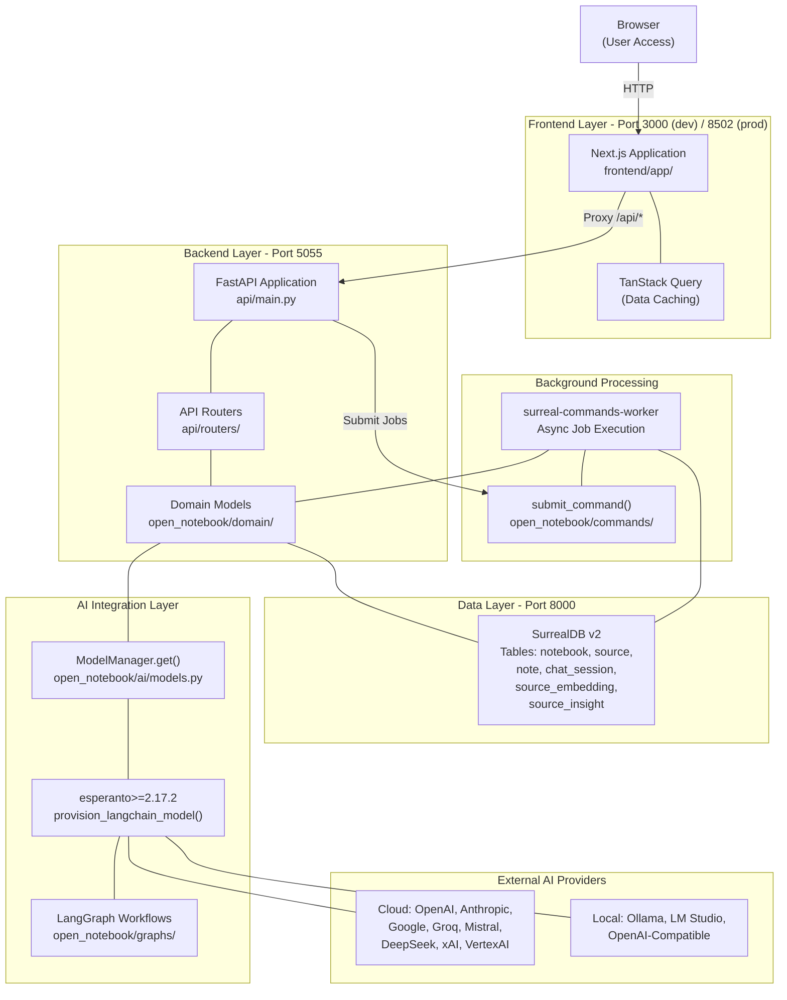

**Layer Responsibilities:**

1. **Frontend (Port 3000 dev / 8502 prod)**: Next.js/React UI with TanStack Query for caching. Proxies `/api/*` requests to backend via rewrites in `next.config.ts`.

2. **Backend (Port 5055)**: FastAPI REST API implementing business logic through domain models (`ObjectModel` base class in [open_notebook/domain/base.py:15-100]()). Entry point at [api/main.py:1-50]().

3. **Background Worker**: `surreal-commands-worker` processes long-running tasks via commands in [open_notebook/commands/]() (embedding, transformation, source processing). Worker runs `execute_command_sync()` from [open_notebook/utils/command_utils.py:50-100]().

4. **Data Layer (Port 8000)**: SurrealDB v2 provides graph relationships (`->reference`, `->artifact`, `->refers_to` edges), vector search via `vector::similarity::cosine()`, and full-text search via `search::analyze()`. Schema in [migrations/]().

5. **AI Integration**: `ModelManager.get()` in [open_notebook/ai/models.py:50-150]() selects models, `provision_langchain_model()` in [open_notebook/ai/provision.py]() abstracts provider differences, LangGraph `StateGraph` instances in [open_notebook/graphs/]() orchestrate multi-step workflows.

**Sources**: [api/main.py:1-50](), [open_notebook/domain/base.py:15-100](), [open_notebook/ai/models.py:50-150](), [open_notebook/commands/](), [pyproject.toml:15-43](), Diagram 1 from provided architecture

---

## High-Level System Architecture

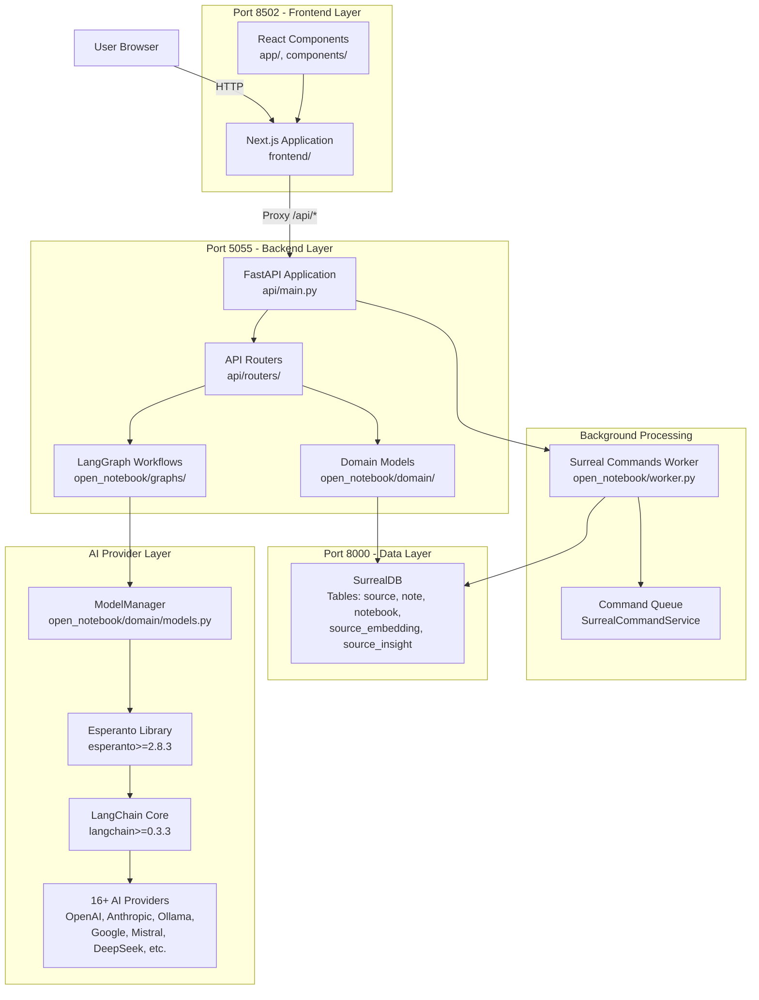

**Architecture Overview**

Open Notebook implements a modern three-tier architecture with asynchronous background processing:

1. **Frontend Layer (Port 8502)**: Next.js 15/React application serving the user interface. As of v1.1+, automatically proxies `/api/*` requests to the backend, simplifying reverse proxy configurations.
2. **Backend Layer (Port 5055)**: FastAPI REST API implementing business logic through domain models and LangGraph workflows. Exposes `/docs` endpoint for automatic OpenAPI documentation.
3. **Data Layer (Port 8000)**: SurrealDB v2 multi-model database providing graph relationships (reference/artifact edges), vector search (`fn::vector_search`), and full-text search (`fn::text_search`).
4. **Background Worker**: `surreal-commands` (v1.2.0+) async task processor with retry logic and exponential jitter backoff for long-running operations (vectorization, content processing, podcast generation).
5. **AI Provider Layer**: Unified interface to 16+ AI providers through the Esperanto library (v2.8.3+) and LangChain (v0.3.3+). Supports LLM, embedding, STT, and TTS capabilities.

**Sources**: [README.md:237-268](), [pyproject.toml:15-43](), [.env.example:1-42](), Diagram 1 from provided system architecture

---

## Core Components: User Concepts to Code

This diagram bridges natural language concepts to concrete code entities, showing how user-facing features map to implementation details:

**Component Mapping Diagram**

```mermaid
graph TB
    subgraph UserConcepts["User-Facing Concepts"]
        Notebook["Notebook<br/>(Research Project)"]
        Source["Source<br/>(PDF, video, URL, audio)"]
        Note["Note<br/>(User/AI annotations)"]
        Chat["Chat Session<br/>(AI conversation)"]
        Insight["Insight<br/>(AI analysis)"]
    end
    
    subgraph DomainLayer["Domain Models (open_notebook/domain/)"]
        NotebookModel["Notebook<br/>notebook.py"]
        SourceModel["Source<br/>notebook.py"]
        NoteModel["Note<br/>notebook.py"]
        ChatModel["ChatSession<br/>notebook.py"]
        TransformModel["Transformation<br/>notebook.py"]
    end
    
    subgraph DatabaseLayer["SurrealDB Tables"]
        NotebookTable["notebook"]
        SourceTable["source"]
        NoteTable["note"]
        ChatTable["chat_session"]
        EmbeddingTable["source_embedding<br/>(vector chunks)"]
        InsightTable["source_insight<br/>(AI results)"]
    end
    
    subgraph APILayer["FastAPI Endpoints (api/routers/)"]
        NotebooksAPI["/api/notebooks/*<br/>notebooks.py"]
        SourcesAPI["/api/sources/*<br/>sources.py"]
        NotesAPI["/api/notes/*<br/>notes.py"]
        ChatAPI["/api/chat/*<br/>chat.py"]
    end
    
    subgraph WorkflowLayer["LangGraph Workflows (open_notebook/graphs/)"]
        SourceGraph["source_graph<br/>(content processing)"]
        ChatGraph["chat_graph<br/>(conversations)"]
        TransformGraph["transform_graph<br/>(AI analysis)"]
        AskGraph["ask_graph<br/>(Q&A workflow)"]
    end
    
    Notebook --> NotebookModel
    Source --> SourceModel
    Note --> NoteModel
    Chat --> ChatModel
    Insight --> TransformModel
    
    NotebookModel --> NotebookTable
    SourceModel --> SourceTable
    NoteModel --> NoteTable
    ChatModel --> ChatTable
    SourceModel -.->|"vectorize()"| EmbeddingTable
    TransformModel --> InsightTable
    
    NotebookModel --> NotebooksAPI
    SourceModel --> SourcesAPI
    NoteModel --> NotesAPI
    ChatModel --> ChatAPI
    
    SourceModel --> SourceGraph
    ChatModel --> ChatGraph
    TransformModel --> TransformGraph
    NotebookModel --> AskGraph
```

**Key Relationships:**

| User Action | Domain Model Method | Database Operation | API Endpoint | Background Job |
|-------------|-------------------|-------------------|--------------|----------------|
| Create notebook | `Notebook.create()` | `INSERT INTO notebook` | `POST /api/notebooks` | None |
| Upload PDF | `Source.create()` | `INSERT INTO source` | `POST /api/sources/upload` | `process_source` command |
| Vectorize source | `Source.vectorize()` | `INSERT INTO source_embedding` | Automatic (worker) | `embed_chunk_command` |
| Start chat | `ChatSession.create()` | `INSERT INTO chat_session` | `POST /api/chat` | None |
| Send message | `ChatSession.chat()` | `UPDATE chat_session` | `POST /api/chat/{id}/message` | Calls `chat_graph` |
| Run transformation | `Transformation.create()` | `INSERT INTO source_insight` | `POST /api/transformations` | `transform_content` command |

**Sources**: [open_notebook/domain/notebook.py](), [api/routers/](), [open_notebook/graphs/](), [migrations/1.surrealql](), Diagram 2 from provided architecture

---

## Technology Stack

| Layer | Technology | Version | Purpose |
|-------|-----------|---------|---------|
| **Frontend** | Next.js | 16 | React framework with App Router |
| | React | 19 | Component-based UI library |
| | TanStack Query | Latest | Server state management, caching |
| | Tailwind CSS | Latest | Utility-first styling |
| | shadcn/ui | Latest | UI component library (Radix UI) |
| **Backend** | Python | 3.11-3.12 | Core language (required range per [pyproject.toml:14]()) |
| | FastAPI | ≥0.104.0 | REST API framework with OpenAPI docs at `/docs` |
| | Uvicorn | ≥0.24.0 | ASGI server |
| | Pydantic | ≥2.9.2 | Data validation and serialization |
| **AI/ML** | LangChain | ≥1.2.0 | LLM orchestration framework |
| | LangGraph | ≥1.0.5 | Stateful AI workflows with `StateGraph` pattern |
| | Esperanto | ≥2.17.2 | Multi-provider AI abstraction (10+ LLM providers) |
| | tiktoken | ≥0.12.0 | Token counting for context window management |
| **Database** | SurrealDB | v2 | Multi-model database (graph + vector) |
| | langgraph-checkpoint-sqlite | ≥3.0.1 | LangGraph workflow state persistence |
| **Processing** | content-core | ≥1.13,<2 | Content extraction (PDF, video, audio, web, Office docs) |
| | podcast-creator | ≥0.7.0,<1 | Multi-speaker podcast generation with TTS |
| | surreal-commands | ≥1.3.0,<2 | Background job queue with retry logic |
| **Deployment** | Docker | Latest | Containerization (multi-stage builds) |
| | supervisord | Latest | Process management (single-container mode) |

**Critical Libraries:**

- **AI Providers**: 10+ LLM provider integrations via `langchain-openai` ([pyproject.toml:25]()), `langchain-anthropic` ([pyproject.toml:26]()), `langchain-ollama` ([pyproject.toml:27]()), `langchain-google-genai` ([pyproject.toml:28]()), `langchain-groq` ([pyproject.toml:29]()), `langchain_mistralai` ([pyproject.toml:30]()), `langchain_deepseek` ([pyproject.toml:31]()), `langchain-google-vertexai` ([pyproject.toml:32]())
- **Content Extraction**: `content-core` (≥1.13,<2 per [pyproject.toml:36]()) handles PDFs, Office docs, video/audio transcription, and web page processing
- **Prompt Templating**: `ai-prompter` (≥0.3,<1 per [pyproject.toml:37]()) provides Jinja2-based prompt rendering in [open_notebook/graphs/]() workflows

**Sources**: [pyproject.toml:15-43]()

---

## Example: Source Upload Flow

This sequence shows how Open Notebook processes an uploaded PDF, illustrating the interaction between all system layers:

**Source Processing Sequence**

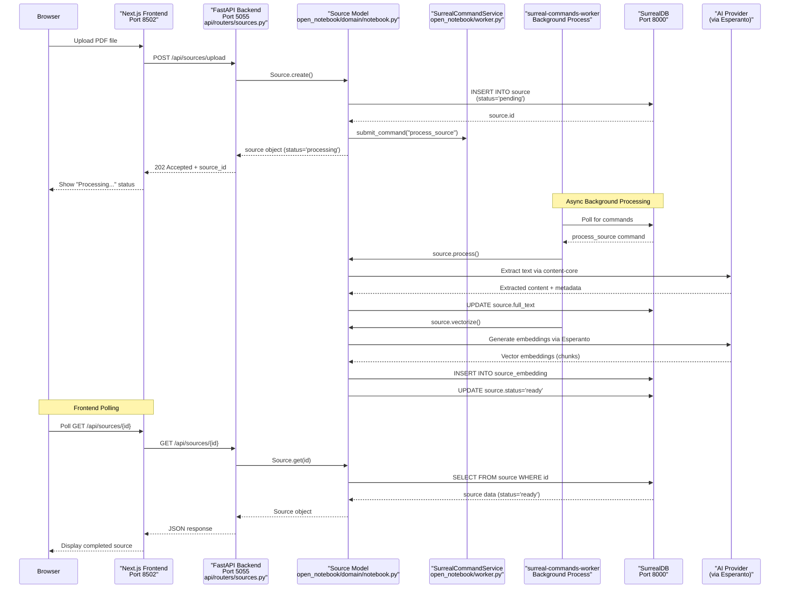

**Key Implementation Details:**

1. **Synchronous Creation** ([api/routers/sources.py]()): `POST /api/sources/upload` creates initial `Source` record with `status='pending'`
2. **Async Job Submission** ([open_notebook/domain/notebook.py]()): `Source.create()` calls `CommandService.submit_command()` to queue background processing
3. **Content Extraction** ([open_notebook/worker.py]()): Worker invokes `source.process()` which uses `content-core` library to extract text, metadata, and thumbnails
4. **Vectorization** ([open_notebook/domain/notebook.py]()): `source.vectorize()` chunks content and generates embeddings via `Esperanto`, storing results in `source_embedding` table
5. **Status Updates**: Worker updates `source.status` through workflow stages: `pending` → `processing` → `ready` (or `error`)

**Sources**: [api/routers/sources.py](), [open_notebook/domain/notebook.py](), [open_notebook/worker.py](), Diagram 3 from provided architecture

---

## Network Configuration

| Port | Service | Command | Purpose | Exposure |
|------|---------|---------|---------|----------|
| **3000** (dev)<br/>**8502** (prod) | Next.js Frontend | `npm run dev` or `npm start` | User interface, proxies `/api/*` requests to backend | External (browser access) |
| **5055** | FastAPI Backend | `uvicorn api.main:app` or `python run_api.py` | REST API endpoints at `/api/*`, OpenAPI docs at `/docs` | Internal (via proxy) + External (direct API access) |
| **8000** | SurrealDB | `surreal start` | Database operations, graph relationships, vector/text search | Internal only (never exposed externally) |

**Environment Variables for Network Configuration:**

```bash
# Browser-facing API URL (how users' browsers reach the API)
# Examples:
# - Local dev: http://localhost:5055 (default)
# - Remote server: http://192.168.1.100:5055
# - Reverse proxy: https://notebook.example.com (no /api suffix)
NEXT_PUBLIC_API_URL=http://localhost:5055

# Server-side API URL (how Next.js server proxies to FastAPI)
# Examples:
# - Single container: http://localhost:5055 (default)
# - Multi-container: http://open_notebook:5055 (Docker service name)
# - Kubernetes: http://api-service.namespace.svc.cluster.local:5055
INTERNAL_API_URL=http://localhost:5055
```

**Proxy Behavior**: Next.js automatically proxies `/api/*` requests to the FastAPI backend using rewrites defined in `next.config.ts`. This means:
- Only port 3000 (dev) or 8502 (prod) needs to be exposed when using a reverse proxy
- The frontend constructs API URLs using `NEXT_PUBLIC_API_URL` environment variable
- Server-side requests use `INTERNAL_API_URL` for internal routing

**Sources**: [frontend/next.config.ts](), Diagram 1 and Diagram 4 from provided architecture

---

## Deployment Options

Open Notebook supports three deployment strategies, all using the same configuration interface:

**Deployment Models Comparison**

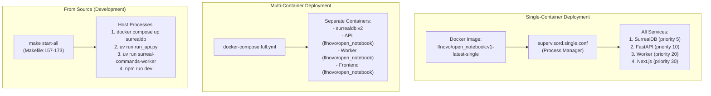

| Deployment | Best For | Complexity | Scalability | Use Case |
|------------|----------|------------|-------------|----------|
| **Single-Container**<br/>[Dockerfile.single]() | Shared hosting, PikaPods, personal servers | Low | Limited | Quick deployment, minimal resources |
| **Multi-Container**<br/>[docker-compose.full.yml]() | Production, cloud VMs, home servers | Medium | High | Recommended for most users |
| **From Source**<br/>[Makefile:157-173]() | Development, contributors | High | N/A | Local development with hot-reload |

**Key Files:**

- **Single-Container**: [Dockerfile.single](), [supervisord.single.conf]() - All processes in one container
- **Multi-Container**: [docker-compose.full.yml]() - Separate services with health checks
- **From Source**: [Makefile:157-173](), `make start-all` - Direct execution on host

**Configuration**: All deployment methods use the same environment variables from [.env.example:1-259](). See page [#2.2](#) for detailed configuration guide.

**Sources**: [Dockerfile.single](), [docker-compose.full.yml](), [Makefile:157-173](), [supervisord.single.conf](), [README.md:96-144](), Diagram 4 from provided architecture

---

## Domain Model Layer

Open Notebook implements a custom ORM pattern providing CRUD operations and graph relationships:

**Domain Model Hierarchy**

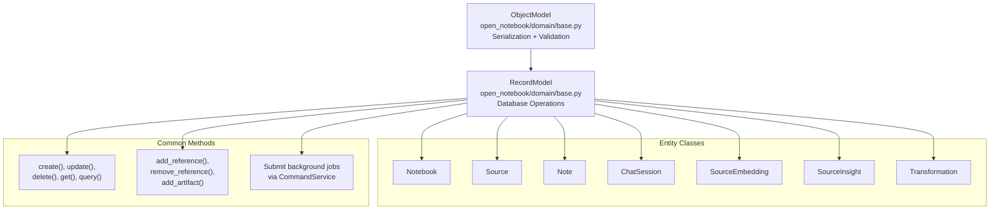

**Base Classes** ([open_notebook/domain/base.py]()):

- **`ObjectModel`**: Provides `to_dict()`, `from_dict()` serialization and Pydantic validation
- **`RecordModel`**: Adds database operations via repository functions (`repo_create()`, `repo_update()`, `repo_delete()`, `repo_query()`)

**Graph Relationships**:

- **`reference` edges**: Many-to-many relationships (e.g., `Source` ↔ `Notebook`)
- **`artifact` edges**: One-to-many relationships (e.g., `Notebook` → `Note`)

**Example Usage**:

```python
# All entity classes in open_notebook/domain/notebook.py
from open_notebook.domain.notebook import Notebook, Source

# Create notebook
notebook = await Notebook.create(name="AI Research", description="Papers on LLMs")

# Create and link source
source = await Source.create(title="Attention Is All You Need", file_path="/uploads/paper.pdf")
await notebook.add_reference(source)  # Creates reference edge in SurrealDB

# Submit async processing job
from open_notebook.worker import CommandService
CommandService.submit_command("process_source", {"source_id": source.id})
```

**Sources**: [open_notebook/domain/base.py](), [open_notebook/domain/notebook.py](), [open_notebook/database/repository.py](), Diagram 2 from provided architecture

---

## AI Provider Integration

Open Notebook supports 16+ AI providers through a multi-tier abstraction:

**AI Provider Architecture**

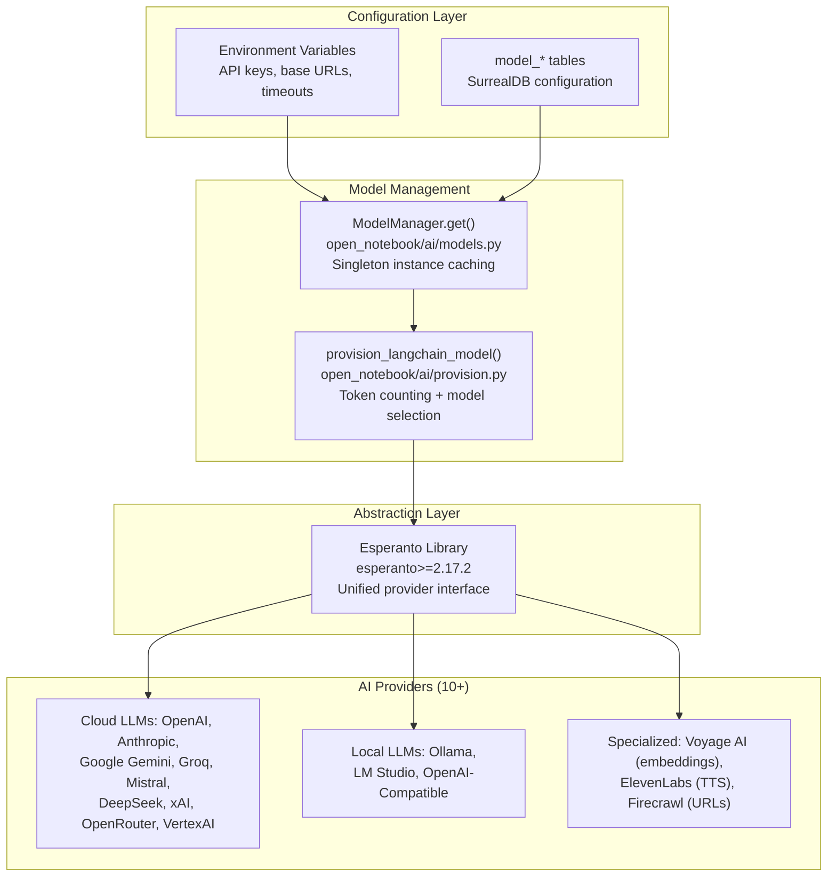

**Provider Support Matrix**:

| Provider | LLM | Embedding | STT | TTS | Configuration Variable |
|----------|-----|-----------|-----|-----|----------------------|
| OpenAI | ✅ | ✅ | ✅ | ✅ | `OPENAI_API_KEY` |
| Anthropic | ✅ | ❌ | ❌ | ❌ | `ANTHROPIC_API_KEY` |
| Google Gemini | ✅ | ✅ | ❌ | ✅ | `GOOGLE_API_KEY` |
| Ollama | ✅ | ✅ | ❌ | ❌ | `OLLAMA_API_BASE` |
| Groq | ✅ | ❌ | ✅ | ❌ | `GROQ_API_KEY` |
| Mistral | ✅ | ✅ | ❌ | ❌ | `MISTRAL_API_KEY` |
| DeepSeek | ✅ | ❌ | ❌ | ❌ | `DEEPSEEK_API_KEY` |
| xAI | ✅ | ❌ | ❌ | ❌ | `XAI_API_KEY` |
| OpenRouter | ✅ | ❌ | ❌ | ❌ | `OPENROUTER_API_KEY` |
| VertexAI | ✅ | ✅ | ❌ | ❌ | `GOOGLE_APPLICATION_CREDENTIALS` |
| Voyage AI | ❌ | ✅ | ❌ | ❌ | `VOYAGE_API_KEY` |
| ElevenLabs | ❌ | ❌ | ❌ | ✅ | `ELEVENLABS_API_KEY` |
| LM Studio | ✅ | ❌ | ❌ | ❌ | `OPENAI_COMPATIBLE_BASE_URL` |

**Model Selection Process**:

1. **`ModelManager.get(type)`** ([open_notebook/ai/models.py:50-150]()): Retrieves model configuration from SurrealDB `model_*` tables for `"llm"`, `"embedding"`, `"stt"`, or `"tts"` types
2. **Token Counting** ([open_notebook/ai/provision.py]()): `provision_langchain_model()` counts tokens in conversation using `tiktoken`, auto-upgrades to large-context variants if needed
3. **Provider Instantiation**: Esperanto creates provider-specific instances (e.g., `ChatOpenAI`, `ChatAnthropic`) and returns LangChain-compatible `BaseChatModel` or `Embeddings` instances
4. **Override Support**: Chat sessions support `model_override` field to specify custom model per conversation

**Sources**: [open_notebook/ai/models.py:50-150](), [open_notebook/ai/provision.py](), [pyproject.toml:25-32](), Diagram 6 from provided architecture

---

## Repository Structure

```
open-notebook/
├── api/                             # FastAPI backend application
│   ├── main.py                      # FastAPI app initialization, CORS, routers
│   └── routers/                     # API endpoint handlers
│       ├── chat.py                  # POST /api/chat, GET /api/chat/{id}/messages
│       ├── notebooks.py             # CRUD for /api/notebooks/*
│       ├── sources.py               # CRUD for /api/sources/*, upload handling
│       └── notes.py                 # CRUD for /api/notes/*
│
├── open_notebook/                   # Core Python package
│   ├── domain/                      # Business logic and models
│   │   ├── base.py                  # ObjectModel, RecordModel base classes
│   │   ├── notebook.py              # Notebook, Source, Note, ChatSession entities
│   │   ├── models.py                # Model, ModelManager, DefaultModels
│   │   └── podcast.py               # PodcastConfig, PodcastEpisode, SpeakerProfile
│   ├── database/                    # Data access layer
│   │   └── repository.py            # repo_create(), repo_update(), repo_query()
│   ├── graphs/                      # LangGraph workflows (StateGraph)
│   │   ├── chat.py                  # chat_graph, source_chat_graph
│   │   ├── ask.py                   # ask_graph (multi-stage Q&A)
│   │   ├── transformation.py        # transform_graph (content analysis)
│   │   ├── source.py                # source_graph (content processing)
│   │   └── utils.py                 # provision_langchain_model(), build_context()
│   ├── config.py                    # Configuration from environment variables
│   ├── exceptions.py                # OpenNotebookError exception hierarchy
│   └── worker.py                    # Background worker entry point, command handlers
│
├── frontend/                        # Next.js 15 application
│   ├── app/                         # App Router pages
│   │   └── dashboard/notebooks/[id]/ # Main notebook interface
│   ├── components/                  # React components
│   │   ├── chat/                    # ChatPanel, MessageRenderer
│   │   ├── sources/                 # SourcesColumn, SourceDetail
│   │   └── notes/                   # NotesColumn, NoteEditor
│   ├── lib/                         # Utilities
│   │   ├── api/                     # API client modules (sourcesApi, notebooksApi)
│   │   └── hooks/                   # React Query hooks (useSources, useNotebook)
│   ├── next.config.ts               # Next.js configuration, API proxy rewrites
│   └── package.json                 # Node.js dependencies
│
├── migrations/                      # Database schema definitions
│   └── 1.surrealql                  # SurrealDB table definitions (DEFINE TABLE)
│
├── Dockerfile                       # Multi-container deployment image
├── Dockerfile.single                # Single-container all-in-one image
├── docker-compose.full.yml          # Multi-container orchestration
├── supervisord.conf                 # Process manager (multi-container)
├── supervisord.single.conf          # Process manager (single-container)
├── Makefile                         # Development commands (make start-all, etc.)
├── pyproject.toml                   # Python dependencies, project metadata
├── .env.example                     # Environment variable template
└── README.md                        # Project documentation
```

**Key Directories**:

- **`api/`**: FastAPI REST API with route handlers in `routers/` (notebooks, sources, chat, search, models)
- **`open_notebook/domain/`**: Core business entities (`Notebook`, `Source`, `Note`, `ChatSession`) inheriting from `ObjectModel` base class in [open_notebook/domain/base.py:15-100]()
- **`open_notebook/graphs/`**: LangGraph workflows using `StateGraph` pattern: `source_graph`, `chat_graph`, `ask_graph`, `transform_graph`
- **`open_notebook/ai/`**: AI integration layer with `ModelManager`, `provision_langchain_model()`, and provider configuration
- **`open_notebook/commands/`**: Background command implementations (`embed_note`, `embed_source`, `process_source`) executed by `surreal-commands-worker`
- **`open_notebook/utils/`**: Utilities for chunking (`chunk_text()`), embedding (`generate_embedding()`), and context building (`ContextBuilder`)
- **`frontend/app/`**: Next.js App Router pages (main UI at `app/[...all]/page.tsx` with client-side routing)
- **`frontend/lib/api/`**: API client modules (`notebooks.ts`, `sources.ts`, `chat.ts`) with TypeScript type definitions
- **`migrations/`**: SurrealDB schema migrations with table definitions, indexes, and graph relationship definitions

**Sources**: Repository structure, [open_notebook/domain/base.py:15-100](), [open_notebook/graphs/](), [open_notebook/commands/](), [frontend/lib/api/]()

---

## Next Steps

This overview provides the foundation for understanding Open Notebook's architecture. For deeper dives into specific subsystems:

- **Installation**: See [Getting Started](#2) for deployment instructions
- **Backend Architecture**: See [System Architecture](#3) for detailed component descriptions
- **AI Integration**: See [AI Integration](#4) for multi-provider configuration
- **Workflows**: See [LangGraph Workflows](#5) for AI conversation and processing logic
- **Content Processing**: See [Content Processing](#6) for vectorization and search
- **Frontend**: See [Frontend Architecture](#8) for UI implementation details
- **Deployment**: See [Deployment](#10) for production deployment strategies

**Sources**: Documentation structure from table of contents

---

# Page: What is Open Notebook

# What is Open Notebook

<details>
<summary>Relevant source files</summary>

The following files were used as context for generating this wiki page:

- [CHANGELOG.md](CHANGELOG.md)
- [README.md](README.md)
- [frontend/src/CLAUDE.md](frontend/src/CLAUDE.md)
- [frontend/src/components/common/LanguageToggle.tsx](frontend/src/components/common/LanguageToggle.tsx)
- [frontend/src/components/sources/AddSourceDialog.tsx](frontend/src/components/sources/AddSourceDialog.tsx)
- [frontend/src/components/sources/steps/SourceTypeStep.tsx](frontend/src/components/sources/steps/SourceTypeStep.tsx)
- [frontend/src/lib/locales/CLAUDE.md](frontend/src/lib/locales/CLAUDE.md)
- [frontend/src/lib/locales/index.test.ts](frontend/src/lib/locales/index.test.ts)
- [frontend/src/lib/locales/index.ts](frontend/src/lib/locales/index.ts)
- [frontend/src/lib/utils/date-locale.ts](frontend/src/lib/utils/date-locale.ts)
- [pyproject.toml](pyproject.toml)
- [uv.lock](uv.lock)

</details>


## Purpose and Scope

This document introduces Open Notebook as a system: its purpose, core architecture, and fundamental capabilities. It provides a high-level overview of how the application works and what problems it solves. For detailed installation instructions, see [Quick Start Guide](#2.1). For deep dives into specific subsystems, see [System Architecture](#3) and subsequent sections.

---

## Overview

Open Notebook is a privacy-focused, open-source research assistant inspired by Google Notebook LM. It enables users to organize research materials (PDFs, videos, audio, web pages, text), interact with content through AI-powered chat, generate professional podcasts, and perform semantic search across all sources—while maintaining complete control over data and AI provider choices.

The project is self-hosted and supports 16+ AI providers (OpenAI, Anthropic, Ollama, LM Studio, Google, Groq, Mistral, DeepSeek, xAI, and more), allowing users to optimize for cost, speed, quality, or run entirely offline.

**Sources:**
- [README.md:53-68]()
- [pyproject.toml:1-7]()

---

## Core Value Proposition

Open Notebook addresses three primary concerns with cloud-based research tools:

| **Concern** | **Open Notebook Solution** |
|-------------|---------------------------|
| **Privacy** | Self-hosted; data never leaves your infrastructure |
| **Vendor Lock-in** | 16+ AI providers via unified API; switch anytime |
| **Customization** | Open source; full control over features and integrations |
| **Cost** | Pay only for AI API usage or run 100% local with Ollama |
| **API Access** | Full REST API for automation and custom integrations |

Unlike Google Notebook LM, Open Notebook provides:
- Multi-speaker podcast generation (1-4 speakers vs. Google's 2-speaker limit)
- Custom content transformations (user-defined LLM-based processing)
- Complete API access for programmatic control
- Choice of deployment (Docker, cloud, or local development)

**Sources:**
- [README.md:72-92]()

---

## System Architecture: Conceptual View

Open Notebook follows a three-tier architecture with clear separation of concerns:

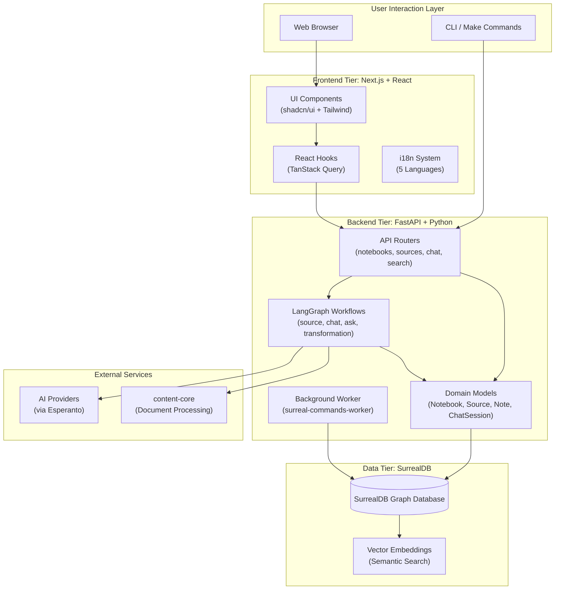

**Key Components:**

- **Frontend (`frontend/src/`)**: Next.js 16 application with React 19, providing a multi-language UI (English, Chinese Simplified/Traditional, Portuguese, Japanese). Uses TanStack Query for data fetching and Zustand for client state.

- **Backend (`open_notebook/`)**: FastAPI server exposing REST API endpoints. Orchestrates complex operations via LangGraph workflows. Includes domain models (`Notebook`, `Source`, `Note`, `ChatSession`) that inherit from `ObjectModel` base class.

- **Database**: SurrealDB graph database storing entities, relationships, and vector embeddings for semantic search.

- **Worker**: Background process (`surreal-commands-worker`) executing async tasks (embedding generation, source processing) via command queue.

- **AI Integration**: Esperanto library provides unified interface to 16+ AI providers for LLM, embedding, TTS, and STT operations.

**Sources:**
- High-level diagram "Diagram 1: Three-Tier System Overview"
- [pyproject.toml:15-42]()

---

## Core Entities and Relationships

Open Notebook organizes research around four primary domain entities:

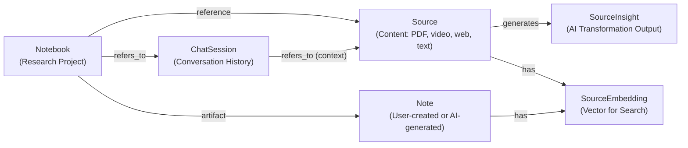

**Entity Descriptions:**

| **Entity** | **Purpose** | **Code Reference** |
|------------|-------------|-------------------|
| `Notebook` | Top-level organizational unit for research projects | `open_notebook/domain/notebook.py` |
| `Source` | Multi-modal content (PDF, video, audio, web page, text) | `open_notebook/domain/source.py` |
| `Note` | User-written notes or AI-generated insights | `open_notebook/domain/note.py` |
| `ChatSession` | Conversation thread with message history and model overrides | `open_notebook/domain/chat_session.py` |
| `SourceInsight` | AI-generated analysis from applying transformations | `open_notebook/domain/source_insight.py` |
| `SourceEmbedding` | Vector representations for semantic search | `open_notebook/domain/source_embedding.py` |

**Relationships** (stored as SurrealDB graph edges):
- **reference**: Links `Notebook` to `Source` (many-to-many)
- **artifact**: Links `Notebook` to `Note` (one-to-many)
- **refers_to**: Links `Notebook` or `ChatSession` to other entities for context

**Sources:**
- High-level diagram "Diagram 7: Data Model and Relationships"
- [README.md:179-196]()

---

## Key Capabilities

### 1. Multi-Modal Content Ingestion

Open Notebook processes diverse content types via the `content-core` library:

| **Content Type** | **Processing Method** | **Outputs** |
|------------------|----------------------|-------------|
| PDFs | Text extraction + OCR | Full text, metadata |
| Videos (MP4, AVI, MOV) | STT transcription | Transcript, timestamps |
| Audio (MP3, WAV, M4A) | STT transcription | Transcript |
| Web Pages | HTML parsing or Firecrawl/Jina APIs | Cleaned text, topics |
| Office Docs (DOCX, PPTX, XLSX) | Format-specific parsers | Structured text |
| Images (JPG, PNG, TIFF) | OCR (optional) | Extracted text |
| Plain Text / Markdown | Direct import | Raw content |

**Processing Pipeline:**
1. User uploads source via `AddSourceDialog` component ([frontend/src/components/sources/AddSourceDialog.tsx:88-634]())
2. Backend creates `Source` record and submits `process_source` command
3. Worker executes `source_graph` LangGraph workflow ([open_notebook/graphs/source_graph.py]())
4. `content-core` extracts content with configurable engines
5. Optional: Generate embeddings via `embed_source` command
6. Optional: Apply transformations to generate insights

**Batch Processing:** The system supports processing up to 50 items simultaneously (multiple URLs or files), with progress tracking and per-item success/failure reporting.

**Sources:**
- [frontend/src/components/sources/steps/SourceTypeStep.tsx:1-357]()
- [README.md:179-196]()
- High-level diagram "Diagram 5: Source Processing Pipeline"

---

### 2. AI-Powered Chat

Users interact with research materials through context-aware conversations:

- **Notebook Chat**: Discuss all sources within a notebook
- **Source Chat**: Focus conversation on a single source
- **Context Selection**: Choose which sources/notes to include via `ContextToggle` component
- **Model Override**: Select different AI models per chat session
- **Message History**: Persistent conversation threads stored in `ChatSession` entities

**Code Flow:**
1. Frontend uses `useNotebookChat` or `useSourceChat` hooks ([frontend/src/lib/hooks/use-chat.ts]())
2. Hooks call `chatApi.sendMessage()` with context-building logic
3. Backend routes to `chat` or `source_chat` LangGraph workflows
4. Workflows use `ModelManager` to provision selected LLM via Esperanto
5. Response streams back to frontend via Server-Sent Events (SSE)

**Sources:**
- [README.md:185-187]()
- High-level diagram "Diagram 2: Backend Architecture and Data Flow"

---

### 3. Semantic Search and Question Answering

Open Notebook provides two search modes:

| **Mode** | **Method** | **Use Case** |
|----------|-----------|--------------|
| **Text Search** | SurrealDB full-text search | Keyword-based retrieval |
| **Vector Search** | Cosine similarity on embeddings | Semantic/conceptual queries |
| **Ask (Multi-Stage RAG)** | Strategy → Parallel Searches → Synthesis | Complex research questions |

**Ask Workflow** (`ask_graph`):
1. Generate search strategy (decompose question into sub-queries)
2. Execute parallel text + vector searches
3. Synthesize final answer from retrieved context
4. Return answer with source citations

**Embedding System:**
- Unified interface: `SourceEmbedding` table stores vectors for sources, notes, and insights
- Content-aware chunking: Automatic detection of HTML, Markdown, or plain text with appropriate splitting ([open_notebook/utils/chunking.py]())
- Batch generation: Process large content via mean pooling when exceeding model context limits

**Sources:**
- [README.md:185]()
- High-level diagram "Diagram 2: Backend Architecture and Data Flow" (Ask workflow)
- [CHANGELOG.md:40-56]()

---

### 4. Professional Podcast Generation

Generate multi-speaker podcasts from notebook content with full script control:

- **Episode Profiles**: Reusable templates defining format, speakers, and style
- **Speaker Profiles**: Custom personalities with voice IDs, backstories, and speaking patterns
- **1-4 Speakers**: Flexible configuration (vs. Google Notebook LM's 2-speaker limit)
- **Generation Pipeline**:
  1. Generate briefing (content summary)
  2. Create outline (topic structure)
  3. Write transcript (multi-speaker dialogue)
  4. Synthesize audio via TTS (ElevenLabs or OpenAI)

**Sources:**
- [README.md:198-201]()

---

### 5. Content Transformations

Transformations apply customizable LLM-based processing to sources:

- **Built-in Transformations**: Summary, key points extraction, question generation
- **Custom Transformations**: User-defined prompts for domain-specific analysis
- **Parallel Execution**: LangGraph `Send` primitive processes multiple transformations concurrently
- **Output**: Each transformation generates a `SourceInsight` record, which is embedded for search

**Code Execution:**
1. User selects transformations in `ProcessingStep` component ([frontend/src/components/sources/steps/ProcessingStep.tsx]())
2. `source_graph` workflow triggers `transform_graph` for each transformation
3. `transform_graph` applies prompt template via selected LLM
4. Insight saved and embedded asynchronously

**Sources:**
- [README.md:191]()
- High-level diagram "Diagram 5: Source Processing Pipeline"

---

## Multi-Provider AI Architecture

Open Notebook's AI provider support is centralized through two key abstractions:

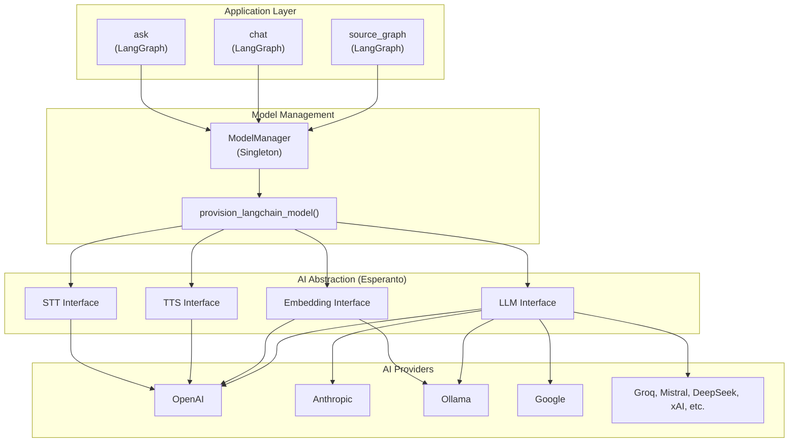

**Key Components:**

- **`ModelManager`** ([open_notebook/ai/model_manager.py]()): Singleton managing model configurations stored in SurrealDB. Provides `Model.get('llm')`, `Model.get('embedding')`, etc.

- **`provision_langchain_model()`**: Runtime instantiation of LangChain model instances based on configuration.

- **Esperanto Library** ([pyproject.toml:38]()): Unified interface abstracting provider-specific APIs. Supports configuration hierarchy (base API key → per-modality override for Azure/custom endpoints).

**Configuration Storage:**
- **Environment Variables**: API keys and endpoints ([docker.env](), [.env]())
- **SurrealDB**: Default model selections and per-operation overrides

**Sources:**
- [README.md:153-175]()
- [pyproject.toml:38]()
- High-level diagram "Diagram 6: AI Provider Integration and Model Management"

---

## Internationalization (i18n)

Open Notebook supports 5 languages with a type-safe translation system:

| **Language** | **Code** | **Locale File** |
|--------------|----------|----------------|
| English | `en-US` | [frontend/src/lib/locales/en-US/index.ts]() |
| Simplified Chinese | `zh-CN` | [frontend/src/lib/locales/zh-CN/index.ts]() |
| Traditional Chinese | `zh-TW` | [frontend/src/lib/locales/zh-TW/index.ts]() |
| Portuguese (Brazil) | `pt-BR` | [frontend/src/lib/locales/pt-BR/index.ts]() |
| Japanese | `ja-JP` | [frontend/src/lib/locales/ja-JP/index.ts]() |

**Implementation:**
- **i18next Framework**: Core internationalization ([frontend/src/lib/i18n.ts]())
- **Proxy-Based API**: Access translations via `t.section.key` instead of `t('section.key')` for better developer experience
- **Language Persistence**: Stored in localStorage, auto-detected from browser
- **Date Localization**: Integrated with `date-fns` locales ([frontend/src/lib/utils/date-locale.ts]())
- **Language Toggle**: UI component for switching languages ([frontend/src/components/common/LanguageToggle.tsx:1-71]())

**Usage Example:**
```typescript
const { t, setLanguage } = useTranslation()
return <h1>{t.notebooks.title}</h1>  // Type-safe access
```

**Sources:**
- [frontend/src/lib/locales/index.ts:1-33]()
- [frontend/src/components/common/LanguageToggle.tsx:1-71]()
- [frontend/src/lib/locales/CLAUDE.md:1-144]()
- [CHANGELOG.md:78-91]()

---

## Deployment Architecture

Open Notebook supports three deployment modes:

| **Mode** | **Description** | **Use Case** |
|----------|----------------|--------------|
| **Local Development** | `make start-all` orchestrates 4 processes | Contributors, testing |
| **Docker Compose** | Multi-container (DB + App + optional Ollama) | Most users, production |
| **Single Container** | All-in-one image with embedded SurrealDB | Simplest deployment, edge devices |

**Process Management:**
- **Local**: Makefile coordinates SurrealDB, API, Worker, Frontend
- **Docker Compose**: Separate containers with health checks and dependencies
- **Single Container**: `supervisord` manages all processes with startup priorities

**Image Variants:**
- `lfnovo/open_notebook:v1-latest` - Multi-container mode (app only)
- `lfnovo/open_notebook:v1-latest-single` - Single-container mode (all-in-one)
- Multi-platform support: `amd64` + `arm64`

**Sources:**
- [README.md:98-136]()
- High-level diagram "Diagram 4: Deployment Architecture and Orchestration"

---

## Technology Stack Summary

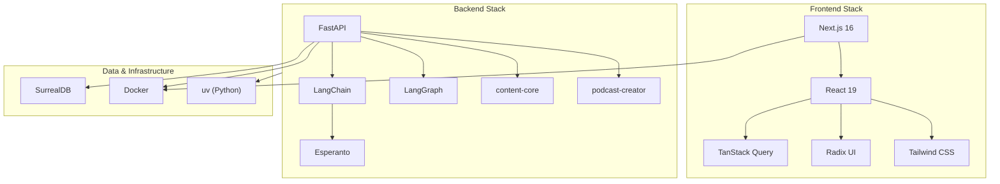

**Key Libraries:**

| **Library** | **Version** | **Purpose** |
|-------------|-------------|-------------|
| **FastAPI** | ≥0.104.0 | REST API server |
| **Next.js** | 16.1.1 | React framework with App Router |
| **LangChain** | ≥1.2.0 | LLM orchestration |
| **LangGraph** | ≥1.0.5 | Stateful workflow graphs |
| **SurrealDB** | ≥1.0.4 | Graph database with vector support |
| **Esperanto** | ≥2.17.2 | Multi-provider AI abstraction |
| **content-core** | ≥1.13 | Document processing |
| **podcast-creator** | ≥0.7.0 | Multi-speaker podcast generation |
| **TanStack Query** | Latest | React data fetching |

**Sources:**
- [pyproject.toml:15-42]()
- [README.md:93-95]()

---

## Comparison to Google Notebook LM

| **Feature** | **Open Notebook** | **Google Notebook LM** |
|-------------|-------------------|------------------------|
| **Hosting** | Self-hosted (Docker/local) | Google cloud only |
| **Privacy** | Complete data sovereignty | Data stored on Google servers |
| **AI Providers** | 16+ (OpenAI, Anthropic, Ollama, etc.) | Google models only |
| **Podcast Speakers** | 1-4 speakers, custom profiles | 2 speakers, fixed format |
| **Transformations** | Custom + built-in | Limited options |
| **API Access** | Full REST API | None |
| **Offline Mode** | Yes (via Ollama) | No |
| **Cost** | AI API usage only | Free tier + subscription |
| **Customization** | Open source, fully extensible | Closed system |

**Sources:**
- [README.md:72-92]()

---

## Next Steps

- For installation instructions, see [Quick Start Guide](#2.1)
- For detailed system architecture, see [Three-Tier Architecture Overview](#3.1)
- For AI provider configuration, see [AI Provider Setup](#2.3)
- For frontend architecture details, see [Application Structure & Routing](#8.1)
- For backend workflows, see [LangGraph Workflows](#5)
- For deployment options, see [Deployment Options Overview](#10.1)

**Sources:**
- [README.md:203-226]()

---

# Page: Key Features & Capabilities

# Key Features & Capabilities

<details>
<summary>Relevant source files</summary>

The following files were used as context for generating this wiki page:

- [CHANGELOG.md](CHANGELOG.md)
- [frontend/src/components/sources/AddSourceDialog.tsx](frontend/src/components/sources/AddSourceDialog.tsx)
- [frontend/src/components/sources/steps/SourceTypeStep.tsx](frontend/src/components/sources/steps/SourceTypeStep.tsx)
- [frontend/src/lib/locales/en-US/index.ts](frontend/src/lib/locales/en-US/index.ts)
- [frontend/src/lib/locales/ja-JP/index.ts](frontend/src/lib/locales/ja-JP/index.ts)
- [frontend/src/lib/locales/pt-BR/index.ts](frontend/src/lib/locales/pt-BR/index.ts)
- [frontend/src/lib/locales/zh-CN/index.ts](frontend/src/lib/locales/zh-CN/index.ts)
- [frontend/src/lib/locales/zh-TW/index.ts](frontend/src/lib/locales/zh-TW/index.ts)
- [pyproject.toml](pyproject.toml)
- [uv.lock](uv.lock)

</details>


## Purpose and Scope

This document enumerates and describes the key features and capabilities of Open Notebook, providing technical details about what the system can do, how features are organized, and which code entities implement them. For architectural details about how these features are implemented, see [System Architecture](#3). For user-facing instructions on using these features, see the User Guide documentation.

---

## Feature Categories Overview

Open Notebook provides seven major categories of functionality:

| Category | Key Features | Primary Code Location |
|----------|--------------|----------------------|
| **Research Organization** | Notebooks, sources, notes, multi-modal content, batch processing | [open_notebook/domain/notebook.py]() |
| **Content Processing** | Extraction, content-aware chunking, unified embedding, transformation | [open_notebook/graphs/source_graph.py](), [open_notebook/utils/]() |
| **AI Integration** | 16+ providers, multi-model support, reasoning models, abstraction layer | [open_notebook/ai/models.py]() |
| **Search & Retrieval** | Text search, vector search, multi-stage RAG | [open_notebook/domain/notebook.py](), [open_notebook/graphs/ask.py]() |
| **Podcast Generation** | Multi-speaker, episode profiles, TTS integration | [open_notebook/podcasts/]() |
| **Internationalization** | 5 languages, date localization, Proxy-based translation | [frontend/src/lib/locales/](), [frontend/src/lib/i18n.ts]() |
| **API & Integration** | REST API, background jobs, streaming responses | [api/](), [commands/]() |

**Sources:** [README.md:175-194](), [pyproject.toml:1-98](), [CHANGELOG.md:39-92]()

---

## Research Organization Features

### Domain Entity Model

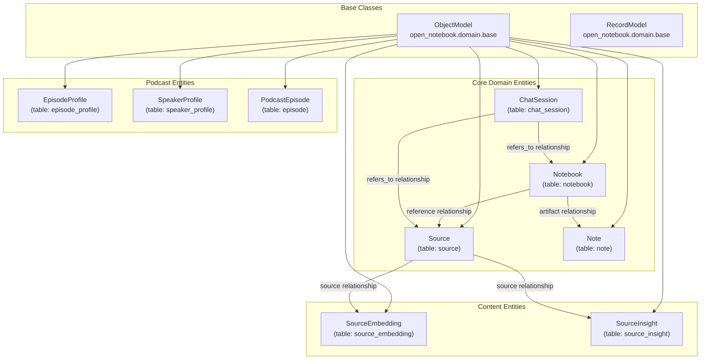

**Diagram: Domain Entity Model - Core classes inherit from `ObjectModel` base class**

### Notebook Container

The `Notebook` class provides the top-level organizational unit for research projects:

**Key Methods:**
- `get_sources()` - Retrieves all sources linked via `reference` relationship
- `get_notes()` - Retrieves all notes linked via `artifact` relationship
- `get_chat_sessions()` - Retrieves all chat sessions linked via `refers_to` relationship

**Validation:** Notebook names cannot be empty (validated via `name_must_not_be_empty`)

**Sources:** [open_notebook/domain/notebook.py:16-87]()

### Source Management

The `Source` class represents content items (PDFs, URLs, audio, video, text) with comprehensive metadata:

**Key Attributes:**
- `asset: Asset` - File path or URL reference
- `title: str` - Human-readable title
- `topics: List[str]` - Extracted topic tags
- `full_text: str` - Complete extracted text content
- `command: RecordID` - Link to background processing job

**Multi-Modal Support:**
Sources can be created from various content types, processed via the `content-core` library:
- PDF documents
- Web URLs (via Firecrawl or Jina)
- Audio files (transcribed via STT providers)
- Video files (audio extraction + transcription)
- Office documents (Word, Excel, PowerPoint)
- Plain text (with automatic HTML detection and conversion to Markdown)

**HTML Content Detection:**
The frontend automatically detects HTML content in clipboard data and converts it to Markdown, preserving formatting from Word documents, web pages, and other rich text sources.

**Batch Processing:**
The system supports batch source creation with up to 50 items per batch:
- Multiple URLs (one per line)
- Multiple file uploads
- Progress tracking with per-item success/failure reporting

**Processing Status Tracking:**
```python
status = await source.get_status()  # Returns: pending, processing, completed, failed
progress = await source.get_processing_progress()  # Detailed execution metadata
```

**Sources:** [open_notebook/domain/notebook.py:144-350](), [pyproject.toml:36](), [frontend/src/components/sources/AddSourceDialog.tsx:28-29](), [frontend/src/components/sources/steps/SourceTypeStep.tsx:98](), [CHANGELOG.md:10-16]()

### Note System

The `Note` class provides manual and AI-generated note storage:

**Note Types:**
- `note_type: "human"` - User-created notes
- `note_type: "ai"` - AI-generated insights saved as notes

**Automatic Embedding:** Notes automatically generate embeddings for semantic search via `needs_embedding()` and `get_embedding_content()` methods.

**Context Generation:** The `get_context()` method provides flexible context sizes for AI interactions:
- `"short"` - Title + first 100 characters
- `"long"` - Title + full content

**Sources:** [open_notebook/domain/notebook.py:352-387]()

### Chat Session Management

The `ChatSession` class tracks conversational AI interactions:

**Key Features:**
- Multiple sessions per notebook for different conversation threads
- Session-specific model overrides via `model_override` field
- Relationships to both notebooks and individual sources
- Persistent conversation history stored in LangGraph checkpoints

**Session Scoping:**
- `relate_to_notebook()` - General notebook chat
- `relate_to_source()` - Source-specific chat with focused context

**Sources:** [open_notebook/domain/notebook.py:389-404]()

---

## Content Processing Features

### Processing Pipeline Architecture

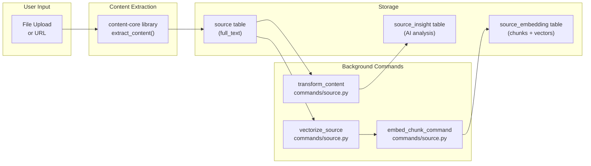

**Diagram: Content Processing Pipeline - Command-based architecture with background job system**

### Text Extraction

Content extraction is handled by the `content-core` library, supporting:

**Supported Formats:**
- PDF (text extraction, OCR fallback)
- Web URLs (Firecrawl or Jina scraping)
- Audio/Video (FFmpeg + STT providers)
- Office Documents (docx, xlsx, pptx)
- Plain text files

**Extraction Process:**
1. File stored in `./uploads` directory
2. `content-core` extracts text based on file type
3. Full text stored in `Source.full_text` field
4. Background jobs triggered for vectorization and transformation

**Sources:** [pyproject.toml:36](), [open_notebook/domain/notebook.py:148-154]()

### Vectorization System

Vectorization converts text into searchable embeddings using a fire-and-forget architecture where domain models automatically trigger embedding generation after save:

**Embedding Command Flow:**
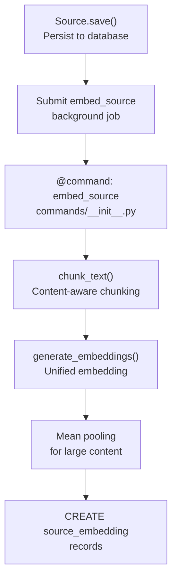

**Diagram: Unified Embedding Flow - Automatic embedding generation with content-type aware chunking**

**Key Implementation Details:**

**Content-Type Aware Chunking:** The `chunk_text()` function in [open_notebook/utils/chunking.py]() automatically detects and handles different content types:
- **HTML**: Uses `MarkdownHeaderTextSplitter` for semantic chunking
- **Markdown**: Uses `MarkdownHeaderTextSplitter` preserving document structure
- **Plain Text**: Uses `RecursiveCharacterTextSplitter` for basic chunking
- Default chunk size: 1500 characters (optimized for Ollama compatibility)
- Overlap: 200 characters for context preservation

**Unified Embedding Generation:** The `generate_embeddings()` function in [open_notebook/utils/embedding.py]() handles content that exceeds model context limits:
- **Within Limits**: Direct embedding generation
- **Over Limits**: Content is chunked, embedded, and combined via mean pooling
- Automatic retry with exponential backoff for rate limits

**Dedicated Embedding Commands:** Version 1.6.0 introduced specialized commands:
- `embed_source` - Embeds source full text
- `embed_note` - Embeds note content  
- `embed_insight` - Embeds transformation-generated insights
- `rebuild_embeddings_command` - Delegates to individual embed commands for bulk operations

**Embedding Model Selection:** The `model_manager.get_embedding_model()` selects the appropriate embedding model based on provider configuration:
- OpenAI: `text-embedding-3-small`, `text-embedding-3-large`
- Voyage AI: `voyage-2`, `voyage-large-2`
- Google: `text-embedding-004`
- Ollama: Local models (e.g., `nomic-embed-text`)

**Sources:** [CHANGELOG.md:39-55](), [open_notebook/utils/chunking.py](), [open_notebook/utils/embedding.py](), [commands/__init__.py]()

### Content Transformations

Transformations generate AI-powered insights from source content through the `transform_graph` LangGraph workflow:

**Transformation Types:**
1. **Summary** - Condensed overview of content
2. **Key Points** - Bullet-point extraction
3. **Questions** - Generated comprehension questions
4. **Custom** - User-defined transformation prompts

**Transformation Execution:**
Transformations are applied automatically during source processing based on user selection, or can be triggered manually for existing sources.

**Storage:** Results stored as `SourceInsight` records with automatic embedding:
- `insight_type: str` - Transformation type identifier
- `content: str` - Generated text
- Automatic `embed_insight` command submission for semantic search
- Cascade deletion when parent source is deleted

**Parallel Processing:** Multiple transformations run concurrently using LangGraph's `Send` primitive for efficient insight generation.

**Sources:** [open_notebook/domain/notebook.py:311-340](), [open_notebook/graphs/transform_graph.py]()

---

## AI Integration Features

### Multi-Provider Architecture

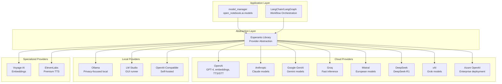

**Diagram: AI Provider Integration - Esperanto library provides unified access to 16+ providers**

### Provider Capability Matrix

| Provider | LLM | Embedding | TTS | STT | Configuration Prefix |
|----------|-----|-----------|-----|-----|---------------------|
| OpenAI | ✅ | ✅ | ✅ | ✅ | `OPENAI_API_KEY` |
| Anthropic | ✅ | ❌ | ❌ | ❌ | `ANTHROPIC_API_KEY` |
| Google GenAI | ✅ | ✅ | ✅ | ❌ | `GOOGLE_API_KEY` |
| Vertex AI | ✅ | ✅ | ✅ | ❌ | `VERTEX_PROJECT` |
| Groq | ✅ | ❌ | ❌ | ✅ | `GROQ_API_KEY` |
| Ollama | ✅ | ✅ | ❌ | ❌ | `OLLAMA_API_BASE` |
| Mistral | ✅ | ✅ | ❌ | ❌ | `MISTRAL_API_KEY` |
| DeepSeek | ✅ | ❌ | ❌ | ❌ | `DEEPSEEK_API_KEY` |
| xAI | ✅ | ❌ | ❌ | ❌ | `XAI_API_KEY` |
| Azure OpenAI | ✅ | ✅ | ❌ | ❌ | `AZURE_OPENAI_*` |
| OpenRouter | ✅ | ❌ | ❌ | ❌ | `OPENROUTER_API_KEY` |
| LM Studio | ✅ | ❌ | ❌ | ❌ | `OPENAI_COMPATIBLE_*` |
| Voyage AI | ❌ | ✅ | ❌ | ❌ | `VOYAGE_API_KEY` |
| ElevenLabs | ❌ | ❌ | ✅ | ✅ | `ELEVENLABS_API_KEY` |

**Sources:** [README.md:151-173](), [pyproject.toml:20-32](), [.env.example:89-180]()

### Model Manager

The `model_manager` singleton provides centralized model configuration and selection:

**Key Methods:**
```python
# Get configured models
llm_model = await model_manager.get_llm_model()
embedding_model = await model_manager.get_embedding_model()
tts_model = await model_manager.get_tts_model()
stt_model = await model_manager.get_stt_model()

# Override for specific operation
custom_llm = await model_manager.get_llm_model(
    provider="anthropic",
    model="claude-3-5-sonnet-20241022"
)
```

**Configuration Storage:** Model preferences stored in `RecordModel` singleton for persistence across sessions.

**Sources:** [open_notebook/ai/models.py]()

### Reasoning Model Support

Full support for "thinking" models that require special handling:

**Supported Reasoning Models:**
- DeepSeek-R1 (DeepSeek provider)
- Qwen3 reasoning models
- OpenAI o1/o3 models

**Implementation Details:**
- Extended timeouts via `ESPERANTO_LLM_TIMEOUT` configuration
- Special prompt handling for reasoning chains
- Thought process captured in response metadata

**Sources:** [README.md:189](), [.env.example:57-74]()

---

## Search & Retrieval Features

### Search Architecture

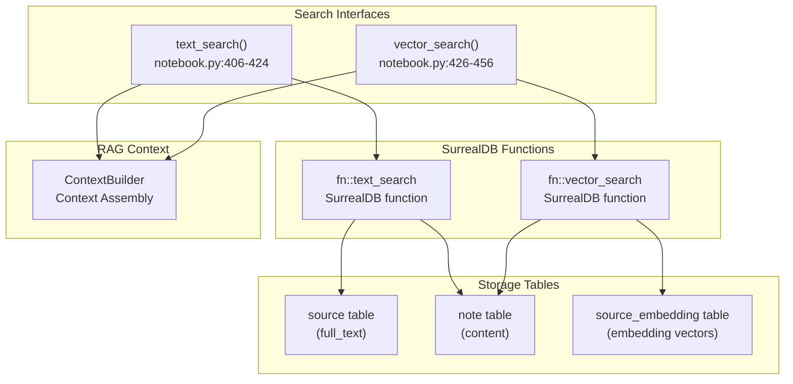

**Diagram: Search System Architecture - Dual search strategies with SurrealDB graph functions**

### Text Search

Full-text search across source content and notes:

**Function Signature:**
```python
async def text_search(
    keyword: str,
    results: int,
    source: bool = True,
    note: bool = True
)
```

**Search Scope Control:**
- `source=True` - Search source `full_text` fields
- `note=True` - Search note `content` fields
- Both can be enabled simultaneously

**Implementation:** Delegates to `fn::text_search` SurrealDB function for efficient full-text indexing.

**Sources:** [open_notebook/domain/notebook.py:406-424]()

### Vector Search

Semantic search using embedding similarity:

**Function Signature:**
```python
async def vector_search(
    keyword: str,
    results: int,
    source: bool = True,
    note: bool = True,
    minimum_score: float = 0.2
)
```

**Process Flow:**
1. Generate embedding for search keyword using configured embedding model
2. Query SurrealDB `fn::vector_search` function with embedding vector
3. Filter results by minimum cosine similarity score (default: 0.2)
4. Return top N results from specified content types

**Searchable Content:**
- `source_embedding` records (text chunks from sources)
- `note` records (note content)
- `source_insight` records (AI-generated insights)

**Sources:** [open_notebook/domain/notebook.py:426-456]()

### Context Building for RAG

The `ContextBuilder` class assembles relevant context for AI interactions:

**Context Strategies:**
1. **Notebook Context** - All sources and notes in a notebook
2. **Source-Specific Context** - Single source with insights
3. **Search-Based Context** - Results from vector/text search
4. **Hybrid Context** - Combination of strategies

**Context Size Control:**
```python
context = await source.get_context(context_size="short")  # Summary only
context = await source.get_context(context_size="long")   # Full text
```

**Output Format:**
```python
{
    "id": "source:xyz",
    "title": "Document Title",
    "insights": [{"insight_type": "summary", "content": "..."}],
    "full_text": "..." (if context_size="long")
}
```

**Sources:** [open_notebook/domain/notebook.py:215-229](), [open_notebook/domain/notebook.py:370-380]()

---

## Podcast Generation Features

### Podcast System Architecture

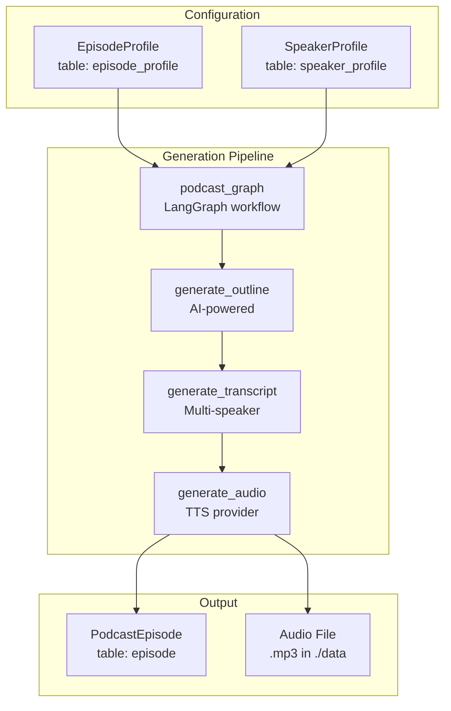

**Diagram: Podcast Generation Pipeline - Profile-based configuration with multi-stage generation**

### Episode Profiles

The `EpisodeProfile` class defines podcast structure and AI model configuration:

**Key Fields:**
- `name: str` - Unique profile identifier
- `speaker_config: str` - Reference to `SpeakerProfile` name
- `outline_provider: str` - AI provider for outline generation (e.g., "openai")
- `outline_model: str` - Model name (e.g., "gpt-4o")
- `transcript_provider: str` - AI provider for transcript generation
- `transcript_model: str` - Model name for dialogue creation
- `default_briefing: str` - Template for episode instructions
- `num_segments: int` - Number of podcast segments (3-20)

**Validation:** Segment count restricted to 3-20 range via `validate_segments` validator.

**Sources:** [open_notebook/podcasts/models.py:10-46]()

### Speaker Profiles

The `SpeakerProfile` class defines voice and personality configuration:

**Multi-Speaker Support:** 1-4 speakers per profile for flexible podcast formats:
- 1 speaker: Monologue/lecture format
- 2 speakers: Traditional conversational podcast (like Notebook LM)
- 3-4 speakers: Panel discussion format

**Speaker Configuration:**
```python
speakers: List[Dict[str, Any]] = [
    {
        "name": "Alex",
        "voice_id": "alloy",  # TTS provider voice ID
        "backstory": "Technical expert with 10 years experience",
        "personality": "Analytical, detail-oriented, occasionally humorous"
    },
    # ... additional speakers
]
```

**TTS Provider Configuration:**
- `tts_provider: str` - Provider name (openai, elevenlabs, google)
- `tts_model: str` - Model/voice engine name

**Validation:** Enforces 1-4 speaker limit and required fields via `validate_speakers` validator.

**Sources:** [open_notebook/podcasts/models.py:48-88]()

### Podcast Episode

The `PodcastEpisode` class tracks generated podcasts with job status:

**Key Fields:**
- `episode_profile: Dict` - Snapshot of episode configuration used
- `speaker_profile: Dict` - Snapshot of speaker configuration used
- `briefing: str` - Full briefing sent to AI models
- `content: str` - Source content for podcast generation
- `outline: Dict` - Generated podcast outline structure
- `transcript: Dict` - Generated multi-speaker dialogue
- `audio_file: str` - Path to generated .mp3 file
- `command: RecordID` - Link to background generation job

**Job Status Tracking:**
```python
status = await episode.get_job_status()  # pending, processing, completed, failed
```

**Sources:** [open_notebook/podcasts/models.py:90-148]()

### TTS Batch Processing

Concurrent TTS request control via `TTS_BATCH_SIZE` configuration:

**Batch Size Recommendations:**
- OpenAI: 5 concurrent requests (default)
- ElevenLabs: 2 concurrent requests (rate limit considerations)
- Google: 4 concurrent requests
- Custom/local: 1 request (resource constraints)

**Implementation:** Background worker processes TTS in batches to prevent provider rate limit errors and connection pool exhaustion.

**Sources:** [.env.example:133-137]()

---

## API & Integration Features

### REST API Architecture

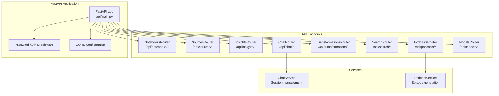

**Diagram: REST API Structure - FastAPI routers organized by domain entity**

### API Documentation

The FastAPI application provides automatic OpenAPI documentation:

**Endpoints:**
- Interactive API Docs: `http://localhost:5055/docs` (Swagger UI)
- OpenAPI Spec: `http://localhost:5055/openapi.json`
- ReDoc: `http://localhost:5055/redoc`

**Authentication:** Optional password protection via `OPEN_NOTEBOOK_PASSWORD` environment variable.

**Sources:** [api/main.py](), [.env.example:89-92]()

### Background Job System

Asynchronous task processing via `surreal-commands` library:

**Command Registration:**
```python
from surreal_commands import command

@command("open_notebook", "vectorize_source")
async def vectorize_source_handler(source_id: str):
    # Processing logic
    pass
```

**Job Submission:**
```python
from surreal_commands import submit_command

command_id = submit_command(
    "open_notebook",
    "vectorize_source",
    {"source_id": str(source.id)}
)
```

**Status Tracking:**
```python
from surreal_commands import get_command_status

status = await get_command_status(command_id)
# status.status: pending, processing, completed, failed
# status.result: Execution results and metadata
```

**Registered Commands:**
- `embed_source` - Source text embedding with content-aware chunking
- `embed_note` - Note content embedding
- `embed_insight` - Insight embedding for semantic search
- `process_source` - Complete source processing pipeline
- `rebuild_embeddings_command` - Bulk embedding regeneration
- `generate_podcast` - Podcast episode generation

**Concurrency Control:** `SURREAL_COMMANDS_MAX_TASKS` (default: 5) controls worker pool size.

**Retry Configuration:** Global retry policies via environment variables:
- `SURREAL_COMMANDS_RETRY_ENABLED` - Enable/disable retries
- `SURREAL_COMMANDS_RETRY_MAX_ATTEMPTS` - Maximum retry attempts (default: 3)
- `SURREAL_COMMANDS_RETRY_WAIT_STRATEGY` - Backoff strategy (exponential_jitter, exponential, fixed, random)

**Sources:** [pyproject.toml:41](), [.env.example:196-251](), [commands/]()

---

## Feature Integration Matrix

### Cross-Feature Interactions

| Feature A | Feature B | Integration Point | Code Location |
|-----------|-----------|------------------|---------------|
| Source | Vectorization | Automatic `embed_source` submission after save | [open_notebook/domain/notebook.py]() |
| Source | Transformation | `transform_graph` generates insights during processing | [open_notebook/graphs/transform_graph.py]() |
| Chat | Vector Search | `ContextBuilder` retrieves relevant chunks | [open_notebook/graphs/chat.py]() |
| Chat | Sources | `refers_to` relationship scopes context | [open_notebook/domain/notebook.py]() |
| Podcast | Sources | Episode generated from source content | [open_notebook/podcasts/]() |
| Notes | Search | Automatic embedding via `embed_note` command | [commands/__init__.py]() |
| Insights | Search | Automatic embedding via `embed_insight` command | [commands/__init__.py]() |
| Insights | Notes | `save_as_note()` converts insight to note | [open_notebook/domain/notebook.py]() |

**Sources:** [open_notebook/domain/notebook.py](), [open_notebook/graphs/]()

---

## Internationalization Features

### Multi-Language Support

Open Notebook provides comprehensive internationalization with 5 supported languages:

**Supported Languages:**
| Language | Code | Locale File |
|----------|------|-------------|
| English | en-US | [frontend/src/lib/locales/en-US/index.ts]() |
| Simplified Chinese | zh-CN | [frontend/src/lib/locales/zh-CN/index.ts]() |
| Traditional Chinese | zh-TW | [frontend/src/lib/locales/zh-TW/index.ts]() |
| Portuguese (Brazil) | pt-BR | [frontend/src/lib/locales/pt-BR/index.ts]() |
| Japanese | ja-JP | [frontend/src/lib/locales/ja-JP/index.ts]() |

**Translation System Architecture:**
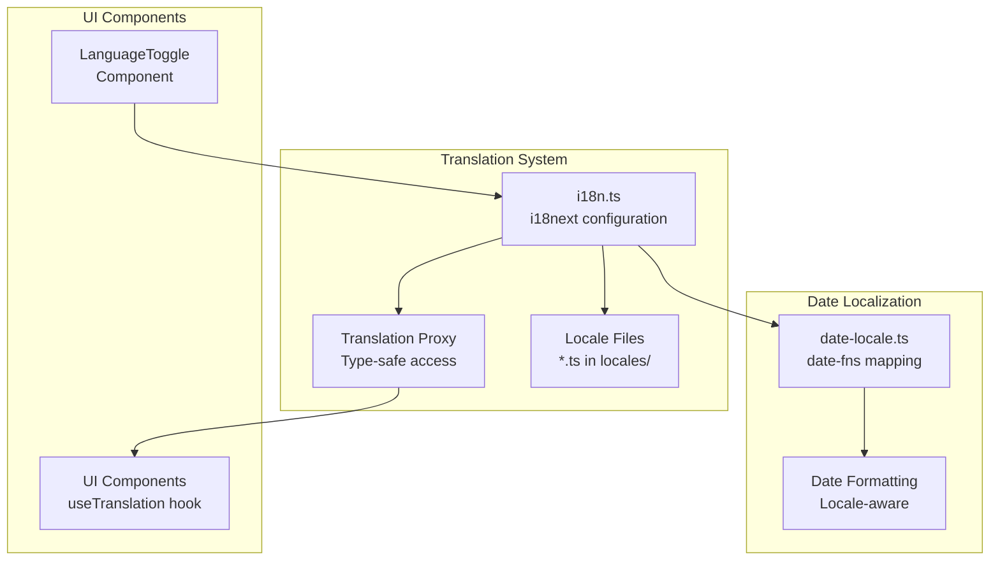

**Diagram: Internationalization Architecture - Proxy-based type-safe translation system**

**Key Features:**

**Proxy-Based Translation API:** The `useTranslation()` hook returns a Proxy object that provides compile-time type safety:
```typescript
const { t } = useTranslation()
// Type-safe access with dot notation
t.sources.title  // "Sources" (English)
t.sources.add    // "Add Source" (English)
// Instead of traditional string-based approach:
// t('sources.title')
```

**Date Localization:** The `date-locale.ts` module maps UI languages to `date-fns` locales for consistent date formatting across the application.

**Dynamic Language Switching:** Users can switch languages at runtime via the `LanguageToggle` component without page reload, with preferences persisted in browser storage.

**Translation Coverage:**
- All UI strings (navigation, forms, buttons, messages)
- Error messages and API responses
- Validation messages
- Empty states and placeholders
- Accessibility labels

**Sources:** [frontend/src/lib/locales/](), [frontend/src/lib/i18n.ts](), [frontend/src/lib/hooks/use-translation.ts](), [CHANGELOG.md:78-92]()

---

## Configuration & Extensibility

### Environment-Driven Configuration

All features are configurable via environment variables without code changes:

**Key Configuration Areas:**
1. **AI Providers** - 16+ provider API keys and endpoints
2. **Database** - SurrealDB connection parameters
3. **API** - URL routing, timeouts, ports
4. **Performance** - Worker concurrency, retry policies, batch sizes
5. **Security** - Password protection, SSL verification

**Dynamic Provider Selection:** Change AI providers at runtime without rebuilding containers by updating environment variables.

**Sources:** [.env.example:1-259]()

### Extensibility Points

**Custom Transformations:** Add new transformation types by:
1. Defining prompt template
2. Submitting `transform_content` command with custom `transformation_type`
3. Results stored as `SourceInsight` records

**Custom LangGraph Workflows:** Extend AI capabilities by adding workflows to [open_notebook/graphs/]():
- Follow existing workflow patterns
- Register with LangGraph checkpoint system
- Submit via background commands

**API Extensions:** Add custom endpoints by:
1. Creating router in [api/]()
2. Registering with FastAPI app
3. Leveraging existing domain models

**Sources:** [open_notebook/graphs/](), [api/](), [commands/]()

---

**Document Version:** 1.0 (January 2025)

---

# Page: Technology Stack

# Technology Stack

<details>
<summary>Relevant source files</summary>

The following files were used as context for generating this wiki page:

- [CHANGELOG.md](CHANGELOG.md)
- [CLAUDE.md](CLAUDE.md)
- [README.dev.md](README.dev.md)
- [docs/7-DEVELOPMENT/development-setup.md](docs/7-DEVELOPMENT/development-setup.md)
- [frontend/package-lock.json](frontend/package-lock.json)
- [frontend/package.json](frontend/package.json)
- [frontend/src/components/sources/AddSourceDialog.tsx](frontend/src/components/sources/AddSourceDialog.tsx)
- [frontend/src/components/sources/steps/SourceTypeStep.tsx](frontend/src/components/sources/steps/SourceTypeStep.tsx)
- [frontend/src/components/ui/alert-dialog.tsx](frontend/src/components/ui/alert-dialog.tsx)
- [frontend/src/lib/hooks/CLAUDE.md](frontend/src/lib/hooks/CLAUDE.md)
- [frontend/src/proxy.ts](frontend/src/proxy.ts)
- [frontend/start-server.js](frontend/start-server.js)
- [frontend/tsconfig.json](frontend/tsconfig.json)
- [open_notebook/domain/CLAUDE.md](open_notebook/domain/CLAUDE.md)
- [open_notebook/utils/CLAUDE.md](open_notebook/utils/CLAUDE.md)
- [open_notebook/utils/chunking.py](open_notebook/utils/chunking.py)
- [pyproject.toml](pyproject.toml)
- [uv.lock](uv.lock)

</details>


## Overview

Open Notebook is built on a modern, full-stack architecture combining a Next.js frontend, FastAPI backend, and SurrealDB multi-model database. The system leverages LangChain/LangGraph for AI orchestration and the Esperanto library for multi-provider AI abstraction. This page documents the core technologies, their versions, and how they integrate to deliver Open Notebook's capabilities.

For environment configuration and API keys, see [Environment Configuration](#2.2). For deployment considerations, see [Deployment Options Overview](#10.1).

## Technology Stack Overview

The following diagram shows the major technology layers and their primary components:

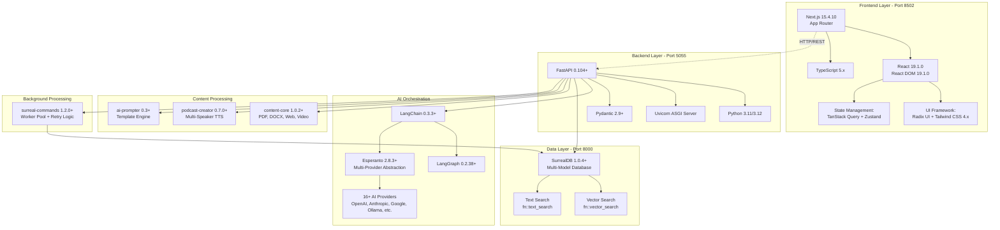

**Sources:** [pyproject.toml:1-43](), [frontend/package.json:1-64]()

## Frontend Stack

### Core Framework

Open Notebook's frontend is built on Next.js 15 with React 19, deployed on port 8502:

| Technology | Version | Purpose |
|------------|---------|---------|
| Next.js | 15.4.10 | App Router-based framework with server components |
| React | 19.1.0 | UI rendering and component architecture |
| React DOM | 19.1.0 | Browser-specific React renderer |
| TypeScript | 5.x | Type-safe JavaScript with strict checking |

The Next.js App Router structure is organized in [frontend/src/app/(dashboard)/](), with shared components in [frontend/src/components/]() and API clients in [frontend/src/lib/api/](). The framework runs on port 8502 (configurable via `PORT` environment variable).

**Sources:** [frontend/package.json:38-42](), [frontend/package.json:7-9]()

### UI Component Library

The frontend uses Radix UI primitives with Tailwind CSS for styling:

| Package | Version | Purpose |
|---------|---------|---------|
| @radix-ui/react-dialog | ^1.1.15 | Modal dialogs (SourceDetailContent, SourceInsightDialog) |
| @radix-ui/react-select | ^2.2.5 | Dropdown selectors (ModelSelector, transformation picker) |
| @radix-ui/react-tabs | ^1.1.12 | Tabbed interfaces (source detail content/insights/details) |
| @radix-ui/react-accordion | ^1.2.12 | Collapsible sections |
| @radix-ui/react-tooltip | ^1.2.7 | Contextual help tooltips |
| @radix-ui/react-dropdown-menu | ^2.1.15 | Action menus |
| tailwindcss | ^4.x | Utility-first CSS framework |
| @tailwindcss/typography | ^0.5.16 | Prose styling for markdown content |
| lucide-react | ^0.525.0 | Icon library (1000+ icons) |

Radix UI components are wrapped in [frontend/src/components/ui/]() with consistent styling. Tailwind CSS 4.x provides utility classes with the @tailwindcss/typography plugin for rendering markdown content from AI responses.

**Sources:** [frontend/package.json:14-29](), [frontend/src/components/source/SourceDetailContent.tsx:1-713]()

### State Management & Data Fetching

| Package | Version | Purpose |
|---------|---------|---------|
| @tanstack/react-query | ^5.83.0 | Server state management with caching and invalidation |
| zustand | ^5.0.6 | Client-side state management (UI state, modals) |
| axios | ^1.12.0 | HTTP client for API communication |
| react-hook-form | ^7.60.0 | Form state management with validation |
| zod | ^4.0.5 | Runtime schema validation |
| @hookform/resolvers | ^5.1.1 | Integration between react-hook-form and zod |

TanStack Query (React Query) manages all server state including sources, insights, notes, and transformations. API clients in [frontend/src/lib/api/]() use axios to communicate with the FastAPI backend. Zustand stores transient UI state like modal visibility and selected items.

**Sources:** [frontend/package.json:30-33](), [frontend/package.json:42-49](), [frontend/src/lib/api/insights.ts:1-38]()

### Content Rendering

| Package | Version | Purpose |
|---------|---------|---------|
| react-markdown | ^10.1.0 | Markdown rendering for AI-generated content |
| remark-gfm | ^4.0.1 | GitHub Flavored Markdown support (tables, task lists) |
| @uiw/react-md-editor | ^4.0.8 | WYSIWYG markdown editor |
| @monaco-editor/react | ^4.7.0 | Code editor (for transformation prompts) |

React Markdown renders AI-generated content with custom component mappings for tables, headings, and code blocks. The implementation in [frontend/src/components/source/SourceDetailContent.tsx:493-518]() shows how markdown is styled with Tailwind typography classes.

**Sources:** [frontend/package.json:31-32](), [frontend/package.json:44](), [frontend/src/components/source/SourceDetailContent.tsx:493-518]()

### Additional Frontend Dependencies

| Package | Version | Purpose |
|---------|---------|---------|
| sonner | ^2.0.6 | Toast notifications |
| next-themes | ^0.4.6 | Dark/light mode theme switching |
| date-fns | ^4.1.0 | Date formatting and manipulation |
| use-debounce | ^10.0.6 | Input debouncing for search/filters |
| clsx | ^2.1.1 | Conditional className composition |
| tailwind-merge | ^3.3.1 | Merge Tailwind classes without conflicts |
| class-variance-authority | ^0.7.1 | Type-safe variant APIs for components |

**Sources:** [frontend/package.json:33-50]()

## Backend Stack

### Core Framework & Server

The backend runs on FastAPI with Uvicorn ASGI server on port 5055:

| Package | Version | Purpose |
|---------|---------|---------|
| fastapi | >=0.104.0 | Async web framework with automatic OpenAPI docs |
| uvicorn | >=0.24.0 | ASGI server for production deployment |
| pydantic | >=2.9.2 | Data validation and serialization |
| httpx | >=0.27.0 | Async HTTP client with SOCKS proxy support |

FastAPI provides REST endpoints in [api/]() with automatic request validation via Pydantic models. The server exposes automatic API documentation at `/docs` (Swagger UI) and `/redoc` (ReDoc).

**Sources:** [pyproject.toml:16-18](), [pyproject.toml:35]()

### Python Version Requirements

```
requires-python = ">=3.11,<3.13"
```

Open Notebook requires Python 3.11 or 3.12, explicitly excluding Python 3.13 due to compatibility constraints in the LangChain ecosystem. Python 3.11+ provides modern features like improved error messages, TaskGroups for async operations, and performance optimizations used throughout the codebase.

**Sources:** [pyproject.toml:14]()

### Package Metadata

| Attribute | Value |
|-----------|-------|
| Package Name | `open-notebook` |
| Current Version | `1.3.0` |
| License | MIT License |
| Build System | setuptools |
| Package Directory | `open_notebook/` |

**Sources:** [pyproject.toml:1-14](), [pyproject.toml:45-46](), [pyproject.toml:60-62]()

## Database Layer

### SurrealDB Multi-Model Database

Open Notebook uses SurrealDB as its primary data store, combining document, graph, and vector search capabilities:

| Package | Version | Purpose |
|---------|---------|---------|
| surrealdb | >=1.0.4 | Python client for SurrealDB database |

SurrealDB runs on port 8000 (configurable via `SURREAL_URL` environment variable). The database is accessed via WebSocket protocol (`ws://localhost:8000/rpc` by default) with connection pooling managed by the repository pattern in [open_notebook/domain/base.py]().

**Database Capabilities:**

```mermaid
graph LR
    subgraph "SurrealDB Features"
        Doc["Document Store<br/>JSON objects"]
        Graph["Graph Database<br/>Edges & Relations"]
        Vector["Vector Search<br/>Embeddings"]
        FullText["Text Search<br/>Full-text indexing"]
    end
    
    subgraph "Open Notebook Usage"
        Sources["Source Model<br/>open_notebook/domain/source.py"]
        Notes["Note Model<br/>open_notebook/domain/note.py"]
        Embeddings["SourceEmbedding Model<br/>Chunks with vectors"]
        Relations["Notebook References<br/>reference edges"]
    end
    
    Doc --> Sources
    Doc --> Notes
    Graph --> Relations
    Vector --> Embeddings
    FullText --> Sources
    FullText --> Notes
```

**Key Database Functions:**

- `fn::vector_search(collection, vector, limit)` - Cosine similarity search for embeddings
- `fn::text_search(collection, query)` - Full-text search with the `my_analyzer` tokenizer
- `relate()` - Create graph edges between records (e.g., notebook→source references)

Connection configuration is loaded from environment variables: `SURREAL_URL`, `SURREAL_USER`, `SURREAL_PASSWORD`, `SURREAL_NAMESPACE`, and `SURREAL_DATABASE`.

**Sources:** [pyproject.toml:40](), [.env.example:189-194]()

## AI Orchestration Layer

### LangChain Core Ecosystem

The AI workflow orchestration is powered by LangChain and LangGraph:

| Package | Version | Purpose |
|---------|---------|---------|
| langchain | >=1.2.0 | Core abstraction for LLM interactions and prompt management |
| langgraph | >=1.0.5 | StateGraph framework for multi-step AI workflows |
| langgraph-checkpoint-sqlite | >=3.0.1 | Conversation state persistence in checkpoints.sqlite |
| langchain-community | >=0.4.1 | Community integrations and utilities |
| tiktoken | >=0.12.0 | Token counting for context window management |

**LangGraph Workflows:**

```mermaid
graph TB
    subgraph "LangGraph StateGraphs"
        ChatGraph["chat_graph<br/>ThreadState"]
        SourceChatGraph["source_chat_graph<br/>SourceChatState"]
        AskGraph["ask_graph<br/>QuestionState"]
        TransformGraph["transformation_graph<br/>TransformationState"]
        SourceGraph["source_graph<br/>SourceProcessingState"]
    end
    
    subgraph "Graph Components"
        State["State Classes<br/>TypedDict with annotations"]
        Nodes["Node Functions<br/>Process state & return updates"]
        Edges["Conditional Edges<br/>Route based on state"]
        Checkpoints["SqliteSaver<br/>checkpoints.sqlite"]
    end
    
    subgraph "Used By"
        ChatAPI["Chat API endpoints<br/>api/"]
        SourceAPI["Source processing<br/>open_notebook/domain/source.py"]
        TransformAPI["Transformation API<br/>api/"]
    end
    
    ChatGraph --> State
    ChatGraph --> Nodes
    ChatGraph --> Edges
    ChatGraph --> Checkpoints
    
    SourceChatGraph --> State
    AskGraph --> State
    TransformGraph --> State
    SourceGraph --> State
    
    ChatAPI --> ChatGraph
    ChatAPI --> SourceChatGraph
    ChatAPI --> AskGraph
    
    TransformAPI --> TransformGraph
    SourceAPI --> SourceGraph
```

All StateGraphs are defined in [open_notebook/graphs/]() and use the `SqliteSaver` checkpoint system for conversation persistence. The graphs implement complex multi-step workflows with conditional branching based on state.

**Sources:** [pyproject.toml:20-24]()

### LangChain Provider Adapters

Open Notebook supports 8 AI providers through LangChain adapter packages:

| Package | Version | Supported Capabilities |
|---------|---------|------------------------|
| langchain-openai | >=1.1.6 | LLM, Embeddings, Vision, TTS, STT |
| langchain-anthropic | >=1.3.0 | LLM, Vision |
| langchain-ollama | >=1.0.1 | LLM, Embeddings (local) |
| langchain-google-genai | >=4.1.2 | LLM, Embeddings, Vision |
| langchain-google-vertexai | >=3.2.0 | LLM, Embeddings (GCP) |
| langchain-groq | >=1.1.1 | LLM (fast inference) |
| langchain_mistralai | >=1.1.1 | LLM, Embeddings |
| langchain_deepseek | >=1.0.0 | LLM |

These adapters convert provider-specific APIs into LangChain's unified interface. The `esperanto` library (see Multi-Provider Abstraction section) provides a higher-level abstraction over these adapters, handling provider selection, authentication, and capability routing.

Model provisioning occurs in [open_notebook/graphs/utils.py]() via the `provision_langchain_model()` function, which selects appropriate models based on token counts and context requirements.

**Sources:** [pyproject.toml:25-31](), [pyproject.toml:39]()

## Multi-Provider AI Abstraction

### Esperanto Library

The `esperanto` library (>=2.13) provides a unified interface over 16+ AI providers:

```mermaid
graph TB
    subgraph "Esperanto API"
        AIFactory["AIFactory<br/>Provider configuration"]
        ModelTypes["Model Types:<br/>LLM, Embedding, STT, TTS"]
        ToLangChain["to_langchain()<br/>Convert to LangChain objects"]
    end
    
    subgraph "Supported Providers"
        OpenAI["OpenAI"]
        Anthropic["Anthropic"]
        Google["Google/Gemini"]
        Ollama["Ollama (local)"]
        Azure["Azure OpenAI"]
        Mistral["Mistral"]
        DeepSeek["DeepSeek"]
        Groq["Groq"]
        ElevenLabs["ElevenLabs"]
        Voyage["Voyage AI"]
        XAI["xAI"]
        Others["OpenRouter, LM Studio,<br/>Custom OpenAI-compatible"]
    end
    
    subgraph "Configuration"
        EnvVars["Environment Variables<br/>.env.example"]
        ModelManager["ModelManager<br/>open_notebook/domain/model.py"]
        DefaultModels["DefaultModels<br/>System-wide defaults"]
    end
    
    subgraph "Used By"
        Provision["provision_langchain_model()<br/>open_notebook/graphs/utils.py"]
        Worker["Background Worker<br/>Embeddings, TTS"]
        Graphs["LangGraph Workflows<br/>open_notebook/graphs/"]
    end
    
    AIFactory --> ModelTypes
    ModelTypes --> ToLangChain
    
    AIFactory --> OpenAI
    AIFactory --> Anthropic
    AIFactory --> Google
    AIFactory --> Ollama
    AIFactory --> Azure
    AIFactory --> Mistral
    AIFactory --> DeepSeek
    AIFactory --> Groq
    AIFactory --> ElevenLabs
    AIFactory --> Voyage
    AIFactory --> XAI
    AIFactory --> Others
    
    EnvVars --> ModelManager
    ModelManager --> DefaultModels
    DefaultModels --> Provision
    
    Provision --> AIFactory
    Worker --> AIFactory
    Graphs --> Provision
```

**Key Features:**

- **Capability-based routing:** Different providers support different modalities (LLM, Embedding, STT, TTS)
- **Automatic fallback:** Can specify multiple providers for redundancy
- **Unified configuration:** Single environment variable pattern for all providers
- **LangChain integration:** Seamless conversion via `to_langchain()` method
- **Timeout configuration:** Global `ESPERANTO_LLM_TIMEOUT` setting (default 60s)

Provider configuration is loaded from environment variables like `OPENAI_API_KEY`, `ANTHROPIC_API_KEY`, `OLLAMA_API_BASE`, etc. The `ModelManager` class in [open_notebook/domain/model.py]() provides centralized model configuration with the `DefaultModels` singleton storing system-wide model preferences.

**Sources:** [pyproject.toml:38](), [.env.example:57-74](), [.env.example:93-156]()

## Content Processing Libraries

### content-core

The `content-core` library (>=1.0.2) handles multi-format content extraction:

**Supported Formats:**

| Format | Extraction Method | Used For |
|--------|------------------|----------|
| PDF | Docling, PyMuPDF | Document ingestion |
| DOCX/DOC | Docling | Document ingestion |
| PPTX/PPT | Docling | Presentation ingestion |
| Web Pages | BeautifulSoup, Firecrawl, Jina | URL content extraction |
| YouTube | PyTubeFix + MoviePy | Video transcription |
| Audio | MoviePy + STT models | Audio transcription |
| Images | OCR + Vision models | Image content extraction |

The library is invoked by [open_notebook/domain/source.py]() during source creation and processing. The `Source.process()` method delegates to content-core for extraction, then stores the resulting text in the `full_text` field.

**Sources:** [pyproject.toml:36]()

### ai-prompter

The `ai-prompter` library (>=0.3) provides template-based prompt construction:

**Key Features:**

- Jinja2-based template engine with variable substitution
- Support for conditional blocks and loops
- Context-aware variable injection
- Template validation and error handling

Used extensively in [open_notebook/graphs/]() via the `Prompter` class for generating dynamic prompts based on workflow state. For example, the source chat graph uses templated prompts to inject source content and conversation history.

**Sources:** [pyproject.toml:37]()

### podcast-creator

The `podcast-creator` library (>=0.7.0) implements multi-speaker podcast generation:

**Pipeline Stages:**

1. **Script Generation:** LLM creates dialogue between speakers based on source content
2. **Voice Assignment:** Maps speakers to TTS voices from configured provider
3. **Audio Synthesis:** Generates speech for each speaker turn
4. **Audio Assembly:** Combines segments with transitions and timing

The library supports multiple TTS providers (OpenAI, Google, ElevenLabs, Azure) and allows customization of conversation style, dialogue structure, and speaker personalities via [open_notebook/domain/podcast_config.py]().

**Sources:** [pyproject.toml:41]()

## Background Task Processing

### surreal-commands

The `surreal-commands` library (>=1.3.0) implements the command pattern for background task processing:

**Architecture:**

```mermaid
graph TB
    subgraph "Command Pattern"
        CommandService["CommandService<br/>Job orchestration"]
        CommandQueue["Command Queue<br/>Stored in SurrealDB"]
        WorkerPool["Worker Pool<br/>Concurrent execution"]
    end
    
    subgraph "Retry Logic"
        RetryStrategy["Retry Strategy:<br/>exponential_jitter"]
        MaxAttempts["Max Attempts: 3-5<br/>Configurable per command"]
        Backoff["Backoff:<br/>1s min, 30s max"]
    end
    
    subgraph "Commands"
        VectorizeSource["vectorize_source<br/>Split + embed chunks"]
        EmbedChunk["embed_chunk<br/>Generate embeddings"]
        TransformSource["transform_source<br/>Apply transformations"]
        GeneratePodcast["generate_podcast<br/>TTS pipeline"]
    end
    
    subgraph "Configuration"
        MaxTasks["SURREAL_COMMANDS_MAX_TASKS<br/>Default: 5"]
        RetryEnabled["SURREAL_COMMANDS_RETRY_ENABLED<br/>Default: true"]
        WaitStrategy["SURREAL_COMMANDS_RETRY_WAIT_STRATEGY<br/>Default: exponential_jitter"]
    end
    
    CommandService --> CommandQueue
    CommandQueue --> WorkerPool
    
    WorkerPool --> VectorizeSource
    WorkerPool --> EmbedChunk
    WorkerPool --> TransformSource
    WorkerPool --> GeneratePodcast
    
    WorkerPool --> RetryStrategy
    RetryStrategy --> MaxAttempts
    RetryStrategy --> Backoff
    
    MaxTasks --> WorkerPool
    RetryEnabled --> RetryStrategy
    WaitStrategy --> RetryStrategy
```

**Key Features:**

- **Persistent queue:** Commands stored in SurrealDB survive restarts
- **Automatic retry:** Exponential backoff with jitter prevents thundering herd
- **Concurrent execution:** Configurable worker pool (default 5 tasks)
- **Status tracking:** Monitor command progress and failures
- **Idempotency:** Safe to retry failed operations

The worker runs in [open_notebook/worker/]() and processes commands asynchronously. Configuration is provided via environment variables in [.env.example:196-251]().

**Sources:** [pyproject.toml:42](), [.env.example:196-251]()

## Supporting Libraries

### Utilities

| Package | Version | Purpose |
|---------|---------|---------|
| loguru | >=0.7.2 | Structured logging with automatic context capture |
| python-dotenv | >=1.0.1 | Environment variable loading from .env files |
| tomli | >=2.0.2 | TOML file parsing |
| groq | >=0.12.0 | Direct Groq SDK for non-LangChain features |

The `loguru` logger provides colored console output and file rotation. Configuration is handled in [open_notebook/config.py](). The `python-dotenv` library loads `.env` or `docker.env` at startup.

**Sources:** [pyproject.toml:19](), [pyproject.toml:32-34]()

## Development Tools

### Code Quality Tools

The following development dependencies are available via `pip install -e ".[dev]"` or `uv sync --group dev`:

| Package | Version | Purpose |
|---------|---------|---------|
| ruff | >=0.5.5 | Fast Python linter and formatter (replaces black/flake8/isort) |
| mypy | >=1.11.1 | Static type checker for Python code |
| pre-commit | >=4.0.1 | Git hook framework for automated checks |
| pytest | >=8.0.0 | Testing framework |
| pytest-asyncio | >=1.2.0 | Async test support |
| types-requests | >=2.32.4 | Type stubs for requests library |

**Sources:** [pyproject.toml:50-69]()

### Frontend Development Tools

| Package | Version | Purpose |
|---------|---------|---------|
| eslint | ^9 | JavaScript/TypeScript linter |
| eslint-config-next | 15.4.2 | Next.js-specific ESLint rules |
| @tailwindcss/postcss | ^4 | PostCSS integration for Tailwind CSS |
| tw-animate-css | ^1.3.5 | Animation utilities for Tailwind |

**Sources:** [frontend/package.json:52-61]()

## Code Quality Configuration

### Ruff Configuration

Ruff is configured as the primary linter with the following settings:

| Setting | Value | Purpose |
|---------|-------|---------|
| Line Length | 88 characters | Matches Black formatter convention |
| Selected Rules | E (pycodestyle errors), F (pyflakes), I (isort) | Core error detection and import sorting |
| Ignored Rules | E501, E402, E722, F401, F541, F841 | Legacy patterns and acceptable exceptions |

The following rules are explicitly ignored:
- **E501** (line too long): Handled by formatter, not enforcer
- **E402** (module level import not at top): Required for certain Streamlit patterns
- **E722** (bare except): Legacy code pattern being gradually refactored
- **F401** (imported but unused): May be used in type hints or re-exports
- **F541** (f-string without placeholders): Acceptable for template strings
- **F841** (unused variable): Common in comprehensions and unpacking

Per-file ignores allow E402 for Streamlit pages that require `nest_asyncio.apply()` before imports.

**Sources:** [pyproject.toml:75-93]()

### MyPy Configuration

Static type checking is configured with special handling for UI code:

```toml
[tool.mypy]
# Exclude Streamlit UI pages from type checking
[[tool.mypy.overrides]]
module = "pages.*"
ignore_errors = true
```

This configuration excludes `pages/` directory from type checking because Streamlit's dynamic module system and global state patterns are incompatible with strict type checking. All other modules in `open_notebook/` and `api/` are subject to type checking.

**Sources:** [pyproject.toml:94-98]()

### Isort Configuration

Import sorting follows the Black-compatible profile:

```toml
[tool.isort]
profile = "black"
line_length = 88
```

This ensures import statements are formatted consistently with Ruff's formatting and Black's conventions. The configuration is applied automatically by pre-commit hooks and can be run manually via `make lint`.

**Sources:** [pyproject.toml:71-73]()

## Technology Stack Summary

The following diagram maps high-level technology choices to their implementing packages:

```mermaid
graph TB
    subgraph "Technology Choices"
        WebFramework["Web Framework:<br/>FastAPI + ASGI"]
        AIOrchestration["AI Orchestration:<br/>LangChain + LangGraph"]
        Database["Database:<br/>SurrealDB Multi-Model"]
        BackgroundTasks["Background Tasks:<br/>Command Pattern + Worker Pool"]
        ContentProcessing["Content Processing:<br/>Multi-Format Extraction"]
        PodcastGen["Podcast Generation:<br/>Multi-Speaker AI Audio"]
        MultiProvider["Multi-Provider AI:<br/>16+ Provider Support"]
    end
    
    subgraph "Implementing Packages"
        fastapi_pkg["fastapi + uvicorn + pydantic"]
        langchain_pkg["langchain + langgraph + checkpoint"]
        surrealdb_pkg["surrealdb"]
        commands_pkg["surreal-commands"]
        content_pkg["content-core"]
        podcast_pkg["podcast-creator"]
        esperanto_pkg["esperanto + 8 langchain-* adapters"]
    end
    
    WebFramework --> fastapi_pkg
    AIOrchestration --> langchain_pkg
    Database --> surrealdb_pkg
    BackgroundTasks --> commands_pkg
    ContentProcessing --> content_pkg
    PodcastGen --> podcast_pkg
    MultiProvider --> esperanto_pkg
```

This architecture enables Open Notebook's core capabilities:
- **Privacy-focused research assistant** via self-hostable components (FastAPI, SurrealDB, Ollama)
- **Multi-provider AI flexibility** through Esperanto abstraction layer
- **Complex AI workflows** via LangGraph state machines with checkpoint persistence
- **Scalable content processing** through async background worker with retry logic
- **Advanced podcast generation** with configurable dialogue styles and TTS providers

For detailed information on how these components interact at runtime, see [Core Architecture Overview](#3.1).

**Sources:** [pyproject.toml:15-43]()

---

# Page: Getting Started

# Getting Started

<details>
<summary>Relevant source files</summary>

The following files were used as context for generating this wiki page:

- [.dockerignore](.dockerignore)
- [.env.example](.env.example)
- [.gitignore](.gitignore)
- [docs/0-START-HERE/quick-start-cloud.md](docs/0-START-HERE/quick-start-cloud.md)
- [docs/0-START-HERE/quick-start-local.md](docs/0-START-HERE/quick-start-local.md)
- [docs/0-START-HERE/quick-start-openai.md](docs/0-START-HERE/quick-start-openai.md)
- [docs/1-INSTALLATION/docker-compose.md](docs/1-INSTALLATION/docker-compose.md)
- [docs/1-INSTALLATION/single-container.md](docs/1-INSTALLATION/single-container.md)

</details>


This page provides an overview of the installation process, deployment options, and initial configuration for Open Notebook. It covers the three primary deployment modes, environment configuration basics, and verification procedures to get your instance running.

For step-by-step installation instructions, see [Quick Start Guide](#2.1). For detailed environment variable configuration, see [Environment Configuration](#2.2). For AI provider-specific setup, see [AI Provider Setup](#2.3). For solving common issues, see [Troubleshooting Common Issues](#2.4).

## Deployment Modes Overview

Open Notebook supports three deployment architectures, each using different Docker images and orchestration strategies:

**Deployment Architecture Options**

```mermaid
graph TB
    subgraph LocalDev["Local Development Mode"]
        MakeStartAll["make start-all command"]
        LocalSurreal["surrealdb process<br/>Port 8000"]
        LocalAPI["run_api.py<br/>Port 5055"]
        LocalWorker["surreal-commands-worker"]
        LocalFrontend["npm run dev<br/>Port 3000"]
    end
    
    subgraph MultiContainer["Docker Compose Multi-Container"]
        ComposeFile["docker-compose.yml"]
        SurrealService["surrealdb:v2 service<br/>Port 8000<br/>Volume: ./surreal_data"]
        AppService["lfnovo/open_notebook:v1-latest<br/>Ports: 8502, 5055<br/>Volume: ./notebook_data"]
        OllamaService["ollama:latest service<br/>Port 11434<br/>Volume: ./ollama_models"]
    end
    
    subgraph SingleContainer["Single Container Mode"]
        SingleImage["lfnovo/open_notebook:v1-latest-single"]
        Supervisord["supervisord process manager"]
        EmbeddedSurreal["Embedded surrealdb<br/>Priority 5"]
        EmbeddedAPI["uvicorn FastAPI<br/>Priority 10"]
        EmbeddedWorker["surreal-commands-worker<br/>Priority 20"]
        EmbeddedFrontend["next start<br/>Priority 30"]
    end
    
    MakeStartAll --> LocalSurreal
    MakeStartAll --> LocalAPI
    MakeStartAll --> LocalWorker
    MakeStartAll --> LocalFrontend
    
    ComposeFile --> SurrealService
    ComposeFile --> AppService
    ComposeFile --> OllamaService
    
    SingleImage --> Supervisord
    Supervisord --> EmbeddedSurreal
    Supervisord --> EmbeddedAPI
    Supervisord --> EmbeddedWorker
    Supervisord --> EmbeddedFrontend
```

Sources: [.env.example:1-259](), [docs/1-INSTALLATION/docker-compose.md:1-314](), [docs/1-INSTALLATION/single-container.md:1-123]()

| Mode | Best For | Complexity | Resource Usage | Data Persistence |
|------|----------|------------|----------------|------------------|
| **Local Development** | Contributors, debugging | High | Minimal | Host filesystem |
| **Docker Compose** | Self-hosting, production | Medium | ~1.2GB | Docker volumes |
| **Single Container** | PikaPods, Railway, Heroku | Low | ~800MB | Container volumes |

Sources: [docs/1-INSTALLATION/docker-compose.md:1-20](), [docs/1-INSTALLATION/single-container.md:106-115]()

## Prerequisites

All deployment modes require:

1. **Docker Engine** 20.10+ or **Docker Desktop** 4.0+
2. **API Key** from at least one AI provider (or Ollama for local models)
3. **Storage**: Minimum 2GB free disk space (5GB+ recommended for Ollama models)
4. **Memory**: 2GB RAM minimum (4GB+ recommended)
5. **Network**: Ports 8502 (frontend), 5055 (API), and 8000 (database) available

For local development mode, additionally requires:
- Python 3.11+
- Node.js 18+
- `make` utility

Sources: [docs/0-START-HERE/quick-start-openai.md:1-14](), [docs/0-START-HERE/quick-start-local.md:6-14]()

## Installation Decision Tree

**Choosing Your Deployment Path**

```mermaid
graph TD
    Start["Start Installation"]
    DevOrProd{"Purpose?"}
    Platform{"Deployment Platform?"}
    AIProvider{"AI Provider Preference?"}
    
    Start --> DevOrProd
    DevOrProd -->|"Development/Contributing"| LocalDev["Local Development Mode<br/>make start-all"]
    DevOrProd -->|"Production/Self-hosting"| Platform
    
    Platform -->|"VPS/Own Server"| DockerCompose["Docker Compose<br/>docker-compose.yml"]
    Platform -->|"PikaPods/Railway/Heroku"| SingleContainer["Single Container<br/>lfnovo/open_notebook:v1-latest-single"]
    
    DockerCompose --> AIProvider
    SingleContainer --> AIProvider
    
    AIProvider -->|"OpenAI/Anthropic/Cloud"| CloudSetup["Cloud AI Setup<br/>Add API_KEY env var"]
    AIProvider -->|"Ollama/Local"| LocalAI["Add ollama service<br/>OLLAMA_API_BASE"]
    
    CloudSetup --> Verify["Verify Installation<br/>curl localhost:5055/health"]
    LocalAI --> Verify
    LocalDev --> Verify
```

Sources: [docs/0-START-HERE/quick-start-openai.md:1-179](), [docs/0-START-HERE/quick-start-local.md:1-286](), [docs/0-START-HERE/quick-start-cloud.md:1-227]()

## Core Configuration Components

### Environment Variables Structure

**Configuration Flow from .env to Services**

```mermaid
graph LR
    EnvFile[".env or docker.env file"]
    EnvVars["Environment Variables"]
    
    subgraph Services
        FastAPI["FastAPI Backend<br/>api/main.py<br/>Port 5055"]
        NextJS["Next.js Frontend<br/>app/layout.tsx<br/>Port 8502"]
        Worker["surreal-commands-worker<br/>commands/__init__.py"]
        SurrealDB["SurrealDB<br/>Port 8000"]
    end
    
    subgraph ConfigGroups["Configuration Groups"]
        AIKeys["AI Provider Keys<br/>OPENAI_API_KEY<br/>ANTHROPIC_API_KEY<br/>GOOGLE_API_KEY"]
        DBConfig["Database Config<br/>SURREAL_URL<br/>SURREAL_USER<br/>SURREAL_PASSWORD"]
        APIConfig["API Config<br/>API_URL<br/>INTERNAL_API_URL<br/>API_CLIENT_TIMEOUT"]
        WorkerConfig["Worker Config<br/>SURREAL_COMMANDS_MAX_TASKS<br/>SURREAL_COMMANDS_RETRY_*"]
    end
    
    EnvFile --> EnvVars
    EnvVars --> AIKeys
    EnvVars --> DBConfig
    EnvVars --> APIConfig
    EnvVars --> WorkerConfig
    
    AIKeys --> FastAPI
    AIKeys --> Worker
    DBConfig --> FastAPI
    DBConfig --> Worker
    DBConfig --> SurrealDB
    APIConfig --> NextJS
    APIConfig --> FastAPI
    WorkerConfig --> Worker
```

Sources: [.env.example:1-259]()

### Essential Environment Variables

The following variables must be configured for any deployment:

```bash
# Database Connection (required)
SURREAL_URL=ws://surrealdb:8000/rpc
SURREAL_USER=root
SURREAL_PASSWORD=password
SURREAL_NAMESPACE=open_notebook
SURREAL_DATABASE=open_notebook
```

Sources: [.env.example:188-194]()

For Docker Compose multi-container deployments, use service name `surrealdb` in `SURREAL_URL`. For single-container deployments, use `localhost` as the database runs in the same container. For local development, use `localhost` or the actual hostname.

Sources: [docs/1-INSTALLATION/docker-compose.md:58-62](), [docs/1-INSTALLATION/single-container.md:32-36]()

### AI Provider Configuration

At minimum, configure one AI provider for LLM functionality:

```bash
# Cloud Providers (choose at least one)
OPENAI_API_KEY=sk-proj-...
ANTHROPIC_API_KEY=sk-ant-...
GOOGLE_API_KEY=...
GROQ_API_KEY=gsk_...

# Local Providers
OLLAMA_API_BASE=http://ollama:11434  # Docker Compose service name
# or
OLLAMA_API_BASE=http://host.docker.internal:11434  # Host machine Ollama
```

Sources: [.env.example:93-117](), [docs/1-INSTALLATION/docker-compose.md:131-148]()

For advanced configurations supporting multiple endpoints (e.g., Azure OpenAI with separate deployments for different capabilities), see [Environment Configuration](#2.2).

### API URL Configuration

The `API_URL` variable controls how the frontend connects to the backend. This is critical for deployments behind reverse proxies or on remote servers:

```bash
# Local Docker deployment (default)
API_URL=http://localhost:5055

# Remote server accessible by IP
API_URL=http://192.168.1.100:5055

# Behind reverse proxy with custom domain
API_URL=https://notebook.example.com

# Server-side proxy configuration (for Next.js rewrites)
INTERNAL_API_URL=http://open_notebook:5055  # Docker Compose service name
```

Sources: [.env.example:2-41]()

The `INTERNAL_API_URL` is specifically for Next.js server-side rewrites in multi-container setups. In single-container deployments, both the frontend and backend share `localhost`, so `INTERNAL_API_URL` defaults to `http://localhost:5055`.

## Docker Compose Deployment

The recommended deployment method uses `docker-compose.yml` to orchestrate multiple services.

### Service Definitions

**Docker Compose Service Architecture**

```mermaid
graph TB
    subgraph DockerHost["Docker Host"]
        subgraph SurrealContainer["surrealdb:v2 Container"]
            SurrealProcess["surrealdb start<br/>--user root<br/>--pass password<br/>--bind 0.0.0.0:8000"]
            SurrealVolume["Volume: ./surreal_data<br/>Mount: /mydata"]
        end
        
        subgraph AppContainer["lfnovo/open_notebook:v1-latest Container"]
            SupervisordApp["supervisord.conf"]
            APIProcess["uvicorn api.main:app<br/>--host 0.0.0.0<br/>--port 5055"]
            WorkerProcess["surreal-commands-worker<br/>--import-modules commands"]
            FrontendProcess["next start<br/>--port 8502"]
            AppVolume["Volume: ./notebook_data<br/>Mount: /app/data"]
        end
        
        subgraph OllamaContainer["ollama:latest Container (optional)"]
            OllamaProcess["ollama serve"]
            OllamaVolume["Volume: ./ollama_models<br/>Mount: /root/.ollama"]
        end
    end
    
    SurrealProcess --> SurrealVolume
    SupervisordApp --> APIProcess
    SupervisordApp --> WorkerProcess
    SupervisordApp --> FrontendProcess
    APIProcess --> AppVolume
    APIProcess -.->|"ws://surrealdb:8000/rpc"| SurrealProcess
    WorkerProcess -.->|"Database queries"| SurrealProcess
    FrontendProcess -.->|"API proxy /api/*"| APIProcess
    OllamaProcess --> OllamaVolume
    APIProcess -.->|"http://ollama:11434"| OllamaProcess
```

Sources: [docs/1-INSTALLATION/docker-compose.md:34-69](), [docs/1-INSTALLATION/docker-compose.md:152-178]()

### Minimal docker-compose.yml

```yaml
services:
  surrealdb:
    image: surrealdb/surrealdb:v2
    command: start --user root --pass password --bind 0.0.0.0:8000 rocksdb:/mydata/mydatabase.db
    ports:
      - "8000:8000"
    volumes:
      - ./surreal_data:/mydata

  open_notebook:
    image: lfnovo/open_notebook:v1-latest
    pull_policy: always
    ports:
      - "8502:8502"  # Frontend
      - "5055:5055"  # API
    environment:
      - OPENAI_API_KEY=sk-...
      - SURREAL_URL=ws://surrealdb:8000/rpc
      - SURREAL_USER=root
      - SURREAL_PASSWORD=password
      - SURREAL_NAMESPACE=open_notebook
      - SURREAL_DATABASE=open_notebook
    volumes:
      - ./notebook_data:/app/data
    depends_on:
      - surrealdb
    restart: always
```

Sources: [docs/1-INSTALLATION/docker-compose.md:34-69]()

The `depends_on` directive ensures `surrealdb` starts before `open_notebook`, but does not wait for the database to be fully ready. The application includes built-in retry logic to handle database connection delays.

## Single Container Deployment

The single-container variant bundles all services using `supervisord` for process management.

### Process Management with supervisord

**Single Container Process Hierarchy**

```mermaid
graph TD
    Container["lfnovo/open_notebook:v1-latest-single"]
    Supervisord["supervisord -c supervisord.single.conf"]
    
    SurrealProc["surrealdb:surrealdb<br/>Priority 5<br/>start --bind 0.0.0.0:8000"]
    APIProc["api:uvicorn<br/>Priority 10<br/>api.main:app --port 5055"]
    WorkerProc["worker:surreal-commands-worker<br/>Priority 20<br/>--import-modules commands"]
    FrontendProc["frontend:next<br/>Priority 30<br/>wait-for-api.sh && next start"]
    
    WaitScript["wait-for-api.sh<br/>Poll localhost:5055/health"]
    
    Container --> Supervisord
    Supervisord -->|"autorestart=true"| SurrealProc
    Supervisord -->|"autorestart=true"| APIProc
    Supervisord -->|"autorestart=true"| WorkerProc
    Supervisord -->|"autorestart=true"| FrontendProc
    
    FrontendProc --> WaitScript
    WaitScript -.->|"Health check"| APIProc
```

Sources: [docs/1-INSTALLATION/single-container.md:1-123]()

The priority-based startup ensures services start in the correct order: database first, then API, then worker, and finally the frontend after confirming the API is healthy.

### Single Container Configuration

```yaml
services:
  open_notebook:
    image: lfnovo/open_notebook:v1-latest-single
    pull_policy: always
    ports:
      - "8502:8502"
      - "5055:5055"
    environment:
      - OPENAI_API_KEY=sk-...
      - SURREAL_URL=ws://localhost:8000/rpc
      - SURREAL_USER=root
      - SURREAL_PASSWORD=password
      - SURREAL_NAMESPACE=open_notebook
      - SURREAL_DATABASE=open_notebook
    volumes:
      - ./data:/app/data
    restart: always
```

Sources: [docs/1-INSTALLATION/single-container.md:21-40]()

Note that `SURREAL_URL` uses `localhost` instead of a service name, as all processes share the same container network namespace.

## Data Persistence

Open Notebook uses several volume mounts to persist data across container restarts:

**Volume Mount Structure**

| Host Path | Container Path | Purpose | Used By |
|-----------|---------------|---------|---------|
| `./notebook_data` | `/app/data` | Uploaded files, processed content | `open_notebook` service |
| `./surreal_data` | `/mydata` | SurrealDB database files | `surrealdb` service |
| `./ollama_models` | `/root/.ollama` | Downloaded Ollama models | `ollama` service (optional) |

Sources: [docs/1-INSTALLATION/docker-compose.md:42-43](), [docs/1-INSTALLATION/docker-compose.md:159-160](), [.gitignore:4-9]()

The `.gitignore` file excludes these directories to prevent accidentally committing large binary files or sensitive data to version control:

Sources: [.gitignore:4-9]()

The `.dockerignore` file similarly excludes these directories from Docker build contexts to reduce image build time and size:

Sources: [.dockerignore:26-34]()

## Installation Verification

After starting services, verify the installation with the following checks:

### Health Check Sequence

```mermaid
sequenceDiagram
    participant User
    participant DockerHost
    participant SurrealDB
    participant FastAPI
    participant Frontend
    
    User->>DockerHost: docker compose up -d
    DockerHost->>SurrealDB: Start surrealdb:v2
    DockerHost->>FastAPI: Start uvicorn (wait for DB)
    DockerHost->>Frontend: Start next (wait for API)
    
    User->>SurrealDB: curl localhost:8000/health
    SurrealDB-->>User: 200 OK (DB ready)
    
    User->>FastAPI: curl localhost:5055/health
    FastAPI->>SurrealDB: Test connection
    SurrealDB-->>FastAPI: Connection OK
    FastAPI-->>User: {"status": "healthy"}
    
    User->>Frontend: Open localhost:8502
    Frontend->>FastAPI: GET /api/notebooks
    FastAPI->>SurrealDB: Query notebooks
    SurrealDB-->>FastAPI: Empty list []
    FastAPI-->>Frontend: {"notebooks": []}
    Frontend-->>User: Display empty notebook list
```

Sources: [docs/1-INSTALLATION/docker-compose.md:100-114]()

### Verification Commands

```bash
# Check all containers are running
docker compose ps
# Expected: surrealdb, open_notebook (and optionally ollama) with STATUS "Up"

# Check API health
curl http://localhost:5055/health
# Expected: {"status":"healthy"}

# Check frontend accessibility
curl -I http://localhost:8502
# Expected: HTTP/1.1 200 OK

# View logs for troubleshooting
docker compose logs -f open_notebook
```

Sources: [docs/1-INSTALLATION/docker-compose.md:92-114](), [docs/1-INSTALLATION/docker-compose.md:203-210]()

### Common Verification Issues

1. **Services not starting**: Wait 20-30 seconds for initial startup. The worker needs time to initialize, and the frontend waits for the API health check.

2. **Port conflicts**: If ports 8502, 5055, or 8000 are already in use, modify the port mappings in `docker-compose.yml`. Change only the left side of the colon: `"8503:8502"` maps host port 8503 to container port 8502.

3. **Database connection errors**: Check `SURREAL_URL` matches the actual service name or hostname. In multi-container mode, use the service name (`ws://surrealdb:8000/rpc`). In single-container mode, use `localhost` (`ws://localhost:8000/rpc`).

Sources: [docs/1-INSTALLATION/docker-compose.md:232-274]()

## Timeout Configuration

For deployments using slow AI providers (Ollama on CPU, remote LM Studio) or processing large documents, adjust timeout settings:

```bash
# Frontend waits for API responses (default: 300 seconds)
API_CLIENT_TIMEOUT=600

# AI provider API calls timeout (default: 60 seconds)
ESPERANTO_LLM_TIMEOUT=180
```

Sources: [.env.example:43-74]()

The `API_CLIENT_TIMEOUT` should be higher than `ESPERANTO_LLM_TIMEOUT` to allow proper error handling. If transformations complete but timeout errors occur, increase `API_CLIENT_TIMEOUT` first. Only increase `ESPERANTO_LLM_TIMEOUT` if the AI provider itself is timing out during inference.

## Next Steps

After successful installation and verification:

1. **Configure AI Models**: Navigate to Settings → Models in the web interface to select your preferred LLM, embedding, TTS, and STT models. See [AI Provider Setup](#2.3) for provider-specific configuration.

2. **Create First Notebook**: Click "New Notebook" to create an organizational container for your research materials.

3. **Add Sources**: Use the "Add Source" dialog to ingest web links, upload files, or paste text. The system will process content through the `source_graph` workflow.

4. **Explore Features**: Try the chat interface, search functionality, and transformations to extract insights from your sources.

For detailed operational guidance, refer to the User Guide documentation. For development and contribution workflows, see the Development Guide.

## Configuration Reference

For complete environment variable documentation, see [Environment Configuration](#2.2). For troubleshooting common issues during installation, see [Troubleshooting Common Issues](#2.4).

The `.env.example` file contains comprehensive documentation for all 50+ configuration options, including:
- Multiple AI provider configurations with modality-specific overrides
- Worker concurrency and retry settings for the command queue
- SSL verification options for self-hosted AI providers
- Database connection parameters
- Timeout and performance tuning

Sources: [.env.example:1-259]()

---

# Page: Quick Start Guide

# Quick Start Guide

<details>
<summary>Relevant source files</summary>

The following files were used as context for generating this wiki page:

- [Makefile](Makefile)
- [docker-compose.dev.yml](docker-compose.dev.yml)
- [docs/0-START-HERE/quick-start-cloud.md](docs/0-START-HERE/quick-start-cloud.md)
- [docs/0-START-HERE/quick-start-local.md](docs/0-START-HERE/quick-start-local.md)
- [docs/0-START-HERE/quick-start-openai.md](docs/0-START-HERE/quick-start-openai.md)
- [docs/1-INSTALLATION/docker-compose.md](docs/1-INSTALLATION/docker-compose.md)
- [docs/1-INSTALLATION/single-container.md](docs/1-INSTALLATION/single-container.md)

</details>


This page provides step-by-step instructions for the fastest path to running Open Notebook. It covers deployment mode selection, basic configuration, and service startup verification. For detailed environment variable configuration, see [Environment Configuration](#2.2). For AI provider-specific setup, see [AI Provider Setup](#2.3).

## Deployment Modes Overview

Open Notebook supports three deployment modes, each with different complexity and use case trade-offs:

```mermaid
graph TB
    User["User"]
    
    subgraph Local["Local Development (make start-all)"]
        LocalDB["docker compose<br/>surrealdb:v2<br/>Port 8000"]
        LocalAPI["run_api.py<br/>uvicorn<br/>Port 5055"]
        LocalWorker["surreal-commands-worker<br/>--import-modules commands"]
        LocalFrontend["npm run dev<br/>Next.js<br/>Port 3000"]
    end
    
    subgraph Compose["Docker Compose (Recommended)"]
        ComposeDB["surrealdb service<br/>surrealdb:v2<br/>Port 8000"]
        ComposeApp["open_notebook service<br/>lfnovo/open_notebook:v1-latest<br/>Ports 8502, 5055"]
        ComposeOllama["ollama service (optional)<br/>ollama:latest<br/>Port 11434"]
    end
    
    subgraph Single["Single Container"]
        SingleImage["lfnovo/open_notebook:v1-latest-single<br/>supervisord manager"]
        SingleDB["Embedded SurrealDB<br/>Priority 5"]
        SingleAPI["API Service<br/>Priority 10"]
        SingleWorker["Worker Service<br/>Priority 20"]
        SingleFrontend["Frontend Service<br/>Priority 30"]
    end
    
    User -->|"Fastest iteration"| Local
    User -->|"Production ready"| Compose
    User -->|"Simplest deploy"| Single
    
    LocalDB -.->|"depends"| LocalAPI
    LocalAPI -.->|"depends"| LocalWorker
    LocalWorker -.->|"depends"| LocalFrontend
    
    ComposeDB -.->|"depends_on"| ComposeApp
    ComposeApp -.->|"optional"| ComposeOllama
    
    SingleImage --> SingleDB
    SingleDB -.->|"priority order"| SingleAPI
    SingleAPI -.->|"priority order"| SingleWorker
    SingleWorker -.->|"priority order"| SingleFrontend
```

**Deployment Mode Comparison**

| Mode | Setup Time | Complexity | Use Case | Hot Reload |
|------|------------|------------|----------|------------|
| **Local Development** | 5 min | High | Development, debugging | Yes (frontend + backend) |
| **Docker Compose** | 3 min | Medium | Production, testing | No |
| **Single Container** | 2 min | Low | Cloud platforms, constrained environments | No |

Sources: [Makefile:157-173](), [docker-compose.dev.yml:1-29](), [docs/1-INSTALLATION/docker-compose.md:1-314](), [docs/1-INSTALLATION/single-container.md:1-123]()

---

## Recommended Path: Docker Compose Setup

Docker Compose is the recommended deployment mode for most users. It separates services into independent containers, enabling better resource management and scaling.

### Prerequisites

1. **Docker Desktop** installed and running ([download](https://www.docker.com/products/docker-desktop/))
2. **API key** from at least one AI provider (OpenAI recommended for first-time setup)
3. **5-10 minutes** for initial setup and model configuration

Sources: [docs/1-INSTALLATION/docker-compose.md:7-12]()

### Configuration File

Create a working directory and add the following `docker-compose.yml`:

```yaml
services:
  surrealdb:
    image: surrealdb/surrealdb:v2
    command: start --user root --pass password --bind 0.0.0.0:8000 rocksdb:/mydata/mydatabase.db
    ports:
      - "8000:8000"
    volumes:
      - ./surreal_data:/mydata

  open_notebook:
    image: lfnovo/open_notebook:v1-latest
    pull_policy: always
    ports:
      - "8502:8502"  # Frontend (Next.js)
      - "5055:5055"  # API (FastAPI)
    environment:
      # AI Provider - add at least one
      - OPENAI_API_KEY=sk-proj-...
      
      # Database connection
      - SURREAL_URL=ws://surrealdb:8000/rpc
      - SURREAL_USER=root
      - SURREAL_PASSWORD=password
      - SURREAL_NAMESPACE=open_notebook
      - SURREAL_DATABASE=open_notebook
    volumes:
      - ./notebook_data:/app/data
    depends_on:
      - surrealdb
    restart: always
```

**Configuration Notes:**
- Replace `sk-proj-...` with your actual OpenAI API key
- The `surrealdb` service uses RocksDB persistence at `/mydata/mydatabase.db`
- The `open_notebook` service includes both the FastAPI backend and Next.js frontend
- Volume mounts enable data persistence across container restarts

Sources: [docs/1-INSTALLATION/docker-compose.md:34-69]()

### Service Startup

```bash
# Start all services in detached mode
docker compose up -d

# Wait 15-20 seconds for services to initialize

# Check service status
docker compose ps

# View logs (optional)
docker compose logs -f
```

**Expected Output:**
```
✅ surrealdb running on :8000
✅ open_notebook running on :8502 (UI) and :5055 (API)
```

Sources: [docs/1-INSTALLATION/docker-compose.md:78-95]()

### Service Architecture

The following diagram shows the container architecture and port mappings:

```mermaid
graph TB
    subgraph Host["Host Machine"]
        Port8502["localhost:8502<br/>(Frontend Access)"]
        Port5055["localhost:5055<br/>(API Access)"]
        Port8000["localhost:8000<br/>(Database Access)"]
        
        SurrealVolume["./surreal_data<br/>(Database Persistence)"]
        NotebookVolume["./notebook_data<br/>(File Storage)"]
    end
    
    subgraph DockerNetwork["Docker Network (default)"]
        subgraph SurrealContainer["Container: surrealdb"]
            SurrealProcess["surrealdb process<br/>--bind 0.0.0.0:8000<br/>rocksdb:/mydata/mydatabase.db"]
            SurrealData["/mydata"]
        end
        
        subgraph AppContainer["Container: open_notebook"]
            Supervisord["supervisord<br/>Process Manager"]
            
            subgraph Services["Managed Services"]
                DB2["SurrealDB<br/>(if single mode)<br/>Priority 5"]
                API["API Service<br/>run_api.py<br/>uvicorn :5055<br/>Priority 10"]
                Worker["Worker Service<br/>surreal-commands-worker<br/>--import-modules commands<br/>Priority 20"]
                Frontend["Frontend Service<br/>PORT=8502 node server.js<br/>Priority 30"]
            end
            
            AppData["/app/data"]
        end
    end
    
    Port8502 -->|"mapped"| Frontend
    Port5055 -->|"mapped"| API
    Port8000 -->|"mapped"| SurrealProcess
    
    SurrealVolume -.->|"mounted"| SurrealData
    NotebookVolume -.->|"mounted"| AppData
    
    API -->|"SURREAL_URL=ws://surrealdb:8000/rpc"| SurrealProcess
    Worker -->|"SURREAL_URL"| SurrealProcess
    Frontend -->|"NEXT_PUBLIC_API_URL=http://localhost:5055"| API
```

**Port Mapping Summary:**

| Service | Internal Port | External Port | Purpose |
|---------|---------------|---------------|---------|
| `surrealdb` | 8000 | 8000 | SurrealDB RPC endpoint |
| `open_notebook` (API) | 5055 | 5055 | FastAPI REST API |
| `open_notebook` (Frontend) | 8502 | 8502 | Next.js web interface |

Sources: [docker-compose.dev.yml:1-29](), [docs/1-INSTALLATION/docker-compose.md:34-69]()

### Verification Steps

**1. API Health Check**

```bash
curl http://localhost:5055/health
```

Expected response:
```json
{"status": "healthy"}
```

**2. Frontend Access**

Open browser to `http://localhost:8502`. The Open Notebook interface should load.

**3. Create First Notebook**

- Click "New Notebook"
- Enter name and description
- Click "Create"

**4. Verify Database Connection**

```bash
# Check SurrealDB logs
docker compose logs surrealdb | grep "Started web server"

# Query database directly (optional)
curl -X POST http://localhost:8000/sql \
  -u root:password \
  -d "INFO FOR DB;"
```

Sources: [docs/1-INSTALLATION/docker-compose.md:99-124]()

---

## Alternative Path: Local Development

For development with hot reload, use the `make start-all` orchestration:

```mermaid
sequenceDiagram
    participant Make as make start-all
    participant DB as SurrealDB Container
    participant API as run_api.py
    participant Worker as surreal-commands-worker
    participant Frontend as npm run dev
    
    Make->>DB: docker compose up -d surrealdb
    Note over DB: Port 8000
    Make->>Make: sleep 3
    
    Make->>API: uv run run_api.py &
    Note over API: Port 5055<br/>Hot reload enabled
    Make->>Make: sleep 3
    
    Make->>Worker: uv run surreal-commands-worker &
    Note over Worker: Background process<br/>--import-modules commands
    Make->>Make: sleep 2
    
    Make->>Frontend: cd frontend && npm run dev
    Note over Frontend: Port 3000<br/>Hot reload enabled
    
    Frontend->>API: NEXT_PUBLIC_API_URL
    API->>DB: SURREAL_URL
    Worker->>DB: SURREAL_URL
```

**Startup Command:**

```bash
make start-all
```

This command executes the following sequence defined in [Makefile:157-173]():

1. Start SurrealDB container via docker compose
2. Wait 3 seconds for database initialization
3. Start FastAPI backend with `uv run run_api.py`
4. Wait 3 seconds for API readiness
5. Start background worker with `uv run surreal-commands-worker --import-modules commands`
6. Wait 2 seconds for worker initialization
7. Start Next.js frontend with `npm run dev`

**Service URLs:**
- Frontend: `http://localhost:3000`
- API: `http://localhost:5055`
- API Docs: `http://localhost:5055/docs`
- Database: `ws://localhost:8000/rpc`

**Stop All Services:**

```bash
make stop-all
```

This kills all processes (next dev, surreal-commands-worker, run_api.py, uvicorn) and stops docker compose services.

**Check Service Status:**

```bash
make status
```

Sources: [Makefile:157-194]()

---

## Alternative Path: Single Container

For cloud platform deployments (PikaPods, Railway, Render), use the single-container image:

```bash
docker run -d \
  -p 8502:8502 \
  -p 5055:5055 \
  -e OPENAI_API_KEY=sk-proj-... \
  -e SURREAL_URL=ws://localhost:8000/rpc \
  -e SURREAL_USER=root \
  -e SURREAL_PASSWORD=password \
  -e SURREAL_NAMESPACE=open_notebook \
  -e SURREAL_DATABASE=open_notebook \
  -v ./data:/app/data \
  lfnovo/open_notebook:v1-latest-single
```

This image uses `supervisord` to manage all services (SurrealDB, API, Worker, Frontend) within a single container. See [Single Container Deployment](#10.2) for detailed configuration.

Sources: [docs/1-INSTALLATION/single-container.md:19-48]()

---

## Common Tasks

**Update to Latest Version:**

```bash
docker compose down
docker compose pull
docker compose up -d
```

**View Service Logs:**

```bash
# All services
docker compose logs -f

# Specific service
docker compose logs -f open_notebook
```

**Restart Services:**

```bash
docker compose restart
```

**Reset Database (CAUTION - deletes all data):**

```bash
docker compose down -v
docker compose up -d
```

Sources: [docs/1-INSTALLATION/docker-compose.md:196-228]()

---

## Service Dependencies and Startup Order

The following diagram illustrates service dependencies and the critical startup timing:

```mermaid
graph TB
    subgraph StartupSequence["Startup Sequence (Docker Compose)"]
        Start["docker compose up -d"]
        
        subgraph Phase1["Phase 1: Database (t=0s)"]
            SurrealStart["surrealdb container starts"]
            SurrealInit["RocksDB initialization"]
            SurrealReady["RPC endpoint :8000 ready"]
        end
        
        subgraph Phase2["Phase 2: Application (t=3-5s)"]
            AppStart["open_notebook container starts"]
            SupervisordStart["supervisord reads config"]
            
            subgraph Priority["Service Priority Order"]
                DBCheck["DB Service: Priority 5<br/>(only if single mode)"]
                APIStart["API Service: Priority 10<br/>run_api.py"]
                APIWait["wait-for-api.sh<br/>checks :5055/health"]
                WorkerStart["Worker Service: Priority 20<br/>surreal-commands-worker"]
                FrontendStart["Frontend Service: Priority 30<br/>node server.js"]
            end
        end
        
        subgraph Phase3["Phase 3: Ready (t=15-20s)"]
            Ready["All services operational"]
            HealthCheck["Health endpoints respond"]
        end
    end
    
    Start --> SurrealStart
    SurrealStart --> SurrealInit
    SurrealInit --> SurrealReady
    SurrealReady -->|"depends_on"| AppStart
    
    AppStart --> SupervisordStart
    SupervisordStart --> DBCheck
    DBCheck --> APIStart
    APIStart --> APIWait
    APIWait --> WorkerStart
    WorkerStart --> FrontendStart
    FrontendStart --> Ready
    Ready --> HealthCheck
```

**Timing Considerations:**

| Deployment Mode | Database Start | API Start | Frontend Start | Total Time |
|----------------|----------------|-----------|----------------|------------|
| Docker Compose | 0s | 3-5s (automatic) | 3-5s (automatic) | 15-20s |
| Local Development | 0s | 3s (sleep) | 8s (sleep 3+3+2) | ~10s |
| Single Container | 0s (embedded) | 5s (priority 10) | 30s (priority 30) | 20-30s |

The `wait-for-api.sh` script ensures the frontend doesn't start until the API `/health` endpoint responds successfully, preventing frontend errors during startup.

Sources: [Makefile:157-173](), [docker-compose.dev.yml:1-29]()

---

## Next Steps

After successful installation:

1. **Configure AI Models** - See [AI Provider Setup](#2.3) for provider-specific configuration
2. **Set Environment Variables** - See [Environment Configuration](#2.2) for advanced settings
3. **Create First Notebook** - Navigate to the web interface and create a notebook
4. **Add Sources** - Upload documents, paste URLs, or add text content
5. **Troubleshooting** - If issues occur, see [Troubleshooting Common Issues](#2.4)

For deployment-specific configuration:
- **Multi-Container Architecture** - See [Multi-Container Deployment](#10.3)
- **Single-Container Architecture** - See [Single-Container Deployment](#10.2)
- **Production Configuration** - See [Environment Variables & Configuration](#10.5)

Sources: [docs/1-INSTALLATION/docker-compose.md:292-298]()

---

# Page: Environment Configuration

# Environment Configuration

<details>
<summary>Relevant source files</summary>

The following files were used as context for generating this wiki page:

- [.dockerignore](.dockerignore)
- [.env.example](.env.example)
- [.gitignore](.gitignore)
- [CHANGELOG.md](CHANGELOG.md)
- [frontend/src/components/sources/AddSourceDialog.tsx](frontend/src/components/sources/AddSourceDialog.tsx)
- [frontend/src/components/sources/steps/SourceTypeStep.tsx](frontend/src/components/sources/steps/SourceTypeStep.tsx)
- [pyproject.toml](pyproject.toml)
- [uv.lock](uv.lock)

</details>


This document covers the environment variable configuration system for Open Notebook, including database connection, API networking, timeout settings, worker configuration, and security options. For specific AI provider setup instructions, see [AI Provider Setup](#2.3).

---

## Configuration Overview

Open Notebook uses environment variables defined in a `.env` file (or `docker.env` for Docker deployments) to configure all system components. The configuration follows a hierarchical pattern where generic settings can be overridden by specific ones, particularly for multi-modal AI integrations.

**Configuration Hierarchy**: Generic settings (e.g., `OPENAI_COMPATIBLE_BASE_URL`) apply to all AI capabilities (LLM, embedding, TTS, STT) unless overridden by mode-specific variables (e.g., `OPENAI_COMPATIBLE_BASE_URL_LLM`). This enables advanced deployments like Azure OpenAI where different services may use different endpoints.

**Sources**: [.env.example:1-259]()

---

## Configuration File Structure

The primary configuration file is `.env` for local development or `docker.env` for Docker deployments. Both files are excluded from version control ([.gitignore:1](), [.dockerignore:39]()).

```mermaid
graph LR
    subgraph "Configuration Sources"
        EnvExample[".env.example<br/>Template with documentation"]
        EnvLocal[".env<br/>Local development"]
        DockerEnv["docker.env<br/>Docker deployment"]
    end
    
    subgraph "Application Components"
        FastAPI["FastAPI Backend<br/>api/main.py"]
        Worker["Background Worker<br/>surreal-commands-worker"]
        Frontend["Next.js Frontend<br/>frontend/"]
    end
    
    subgraph "External Systems"
        SurrealDB["SurrealDB<br/>Database"]
        AIProviders["AI Providers<br/>OpenAI, Anthropic, etc."]
    end
    
    EnvExample -->|"Template for"| EnvLocal
    EnvExample -->|"Template for"| DockerEnv
    
    EnvLocal --> FastAPI
    EnvLocal --> Worker
    EnvLocal --> Frontend
    
    DockerEnv --> FastAPI
    DockerEnv --> Worker
    DockerEnv --> Frontend
    
    FastAPI --> SurrealDB
    Worker --> SurrealDB
    
    FastAPI --> AIProviders
    Worker --> AIProviders
```

**Diagram: Configuration Flow from Environment Files to System Components**

**Sources**: [.env.example:1-259](), [.gitignore:1,8](), [.dockerignore:39]()

---

## Core Infrastructure Configuration

### API URL Configuration

Open Notebook uses two distinct URL variables to handle both browser-side and server-side API communication:

| Variable | Purpose | Default | Example Values |
|----------|---------|---------|----------------|
| `API_URL` | Browser-side API endpoint | `http://localhost:5055` | `https://notebook.example.com`, `http://192.168.1.100:5055` |
| `INTERNAL_API_URL` | Server-side proxy target | `http://localhost:5055` | `http://api:5055` (Docker Compose), `http://api-service.namespace.svc.cluster.local:5055` (Kubernetes) |

**Why Two Variables?**
- `API_URL`: Used by the browser client to make direct API calls. Can be a public HTTPS URL.
- `INTERNAL_API_URL`: Used by Next.js server-side rewrites to proxy `/api/*` requests to the FastAPI backend. Typically uses internal container networking.

**Important**: Do not include `/api` at the end of these URLs - it is appended automatically by the system.

**Common Deployment Scenarios**:

```mermaid
graph TB
    subgraph "Single Container Deployment"
        Browser1["Browser"]
        NextJS1["Next.js<br/>localhost:8502"]
        FastAPI1["FastAPI<br/>localhost:5055"]
        
        Browser1 -->|"API_URL=http://localhost:5055"| FastAPI1
        NextJS1 -->|"INTERNAL_API_URL=http://localhost:5055"| FastAPI1
    end
    
    subgraph "Multi-Container Docker Compose"
        Browser2["Browser"]
        NextJS2["Next.js Container<br/>frontend:3000"]
        FastAPI2["FastAPI Container<br/>api:5055"]
        
        Browser2 -->|"API_URL=http://localhost:5055"| FastAPI2
        NextJS2 -->|"INTERNAL_API_URL=http://api:5055"| FastAPI2
    end
    
    subgraph "Reverse Proxy Deployment"
        Browser3["Browser"]
        Proxy["Reverse Proxy<br/>https://notebook.example.com"]
        NextJS3["Next.js<br/>internal:3000"]
        FastAPI3["FastAPI<br/>internal:5055"]
        
        Browser3 -->|"API_URL=https://notebook.example.com"| Proxy
        Proxy --> NextJS3
        Proxy --> FastAPI3
        NextJS3 -->|"INTERNAL_API_URL=http://localhost:5055"| FastAPI3
    end
```

**Diagram: API URL Configuration Patterns Across Deployment Types**

**Sources**: [.env.example:2-41]()

---

### Database Configuration

SurrealDB connection uses the modern WebSocket protocol with namespace and database scoping:

| Variable | Description | Default |
|----------|-------------|---------|
| `SURREAL_URL` | WebSocket connection URL | `ws://surrealdb/rpc:8000` |
| `SURREAL_USER` | Database username | `root` |
| `SURREAL_PASSWORD` | Database password | `root` |
| `SURREAL_NAMESPACE` | Database namespace | `open_notebook` |
| `SURREAL_DATABASE` | Database name | `open_notebook` |

**Docker Compose Example**: In multi-container deployments, `SURREAL_URL` uses the service name as hostname: `ws://surrealdb:8000/rpc`

**Single Container Example**: When using embedded SurrealDB, use `ws://localhost:8000/rpc`

```mermaid
graph LR
    subgraph "Application Layer"
        Repository["repository.py<br/>Database Access Layer"]
        ObjectModel["ObjectModel<br/>Base CRUD Operations"]
        Worker["surreal-commands-worker<br/>Background Processing"]
    end
    
    subgraph "Connection Pool"
        SurrealClient["surrealdb.Client<br/>Connection Pool"]
    end
    
    subgraph "SurrealDB Instance"
        Namespace["Namespace: open_notebook"]
        Database["Database: open_notebook"]
        Tables["Tables: notebook, source,<br/>note, chat_session, etc."]
    end
    
    Repository --> SurrealClient
    ObjectModel --> SurrealClient
    Worker --> SurrealClient
    
    SurrealClient -->|"SURREAL_URL<br/>SURREAL_USER<br/>SURREAL_PASSWORD"| Namespace
    Namespace --> Database
    Database --> Tables
```

**Diagram: Database Connection Flow Using Environment Variables**

**Sources**: [.env.example:188-194](), [pyproject.toml:39]()

---

## Timeout Configuration

Open Notebook provides granular timeout control at three levels to handle different processing scenarios:

### API Client Timeout

Controls how long the frontend waits for complete API responses:

| Variable | Default | Purpose |
|----------|---------|---------|
| `API_CLIENT_TIMEOUT` | 300 seconds (5 minutes) | Total time for API request completion |

**Tuning Guidelines**:

```mermaid
graph TB
    subgraph "Fast Cloud APIs"
        Fast["OpenAI, Anthropic, Groq<br/>API_CLIENT_TIMEOUT=300s<br/>(Default)"]
    end
    
    subgraph "Local GPU Processing"
        GPU["Ollama on GPU<br/>API_CLIENT_TIMEOUT=300s<br/>(Default)"]
    end
    
    subgraph "Local CPU Processing"
        CPU["Ollama on CPU<br/>API_CLIENT_TIMEOUT=600s<br/>(10 minutes)"]
    end
    
    subgraph "Slow Networks"
        Remote["Remote LM Studio<br/>API_CLIENT_TIMEOUT=900s<br/>(15 minutes)"]
    end
    
    subgraph "Large Documents"
        Large["Very Large PDFs<br/>API_CLIENT_TIMEOUT=900s+<br/>(15+ minutes)"]
    end
```

**Diagram: Recommended API Client Timeout Values by Use Case**

**Sources**: [.env.example:43-55]()

### Esperanto LLM Timeout

Controls timeout for individual AI model inference calls at the Esperanto library level:

| Variable | Default | Purpose |
|----------|---------|---------|
| `ESPERANTO_LLM_TIMEOUT` | 60 seconds | Single LLM API call timeout |

**Important**: This value should be **lower** than `API_CLIENT_TIMEOUT` to allow proper error handling and retries. The system may make multiple LLM calls within a single API request (e.g., for multi-stage RAG operations).

**Tuning Guidelines**:
- **Fast Cloud APIs** (OpenAI, Anthropic, Groq): 60 seconds (default)
- **Local Ollama (small models)**: 120-180 seconds
- **Local Ollama (large models on CPU)**: 300+ seconds
- **Remote/self-hosted LLMs**: 180-300 seconds depending on hardware

**Timeout Relationship**:

```mermaid
graph TD
    APIRequest["API Request Starts<br/>API_CLIENT_TIMEOUT timer begins"]
    
    APIRequest --> LLM1["LLM Call 1<br/>ESPERANTO_LLM_TIMEOUT"]
    APIRequest --> LLM2["LLM Call 2<br/>ESPERANTO_LLM_TIMEOUT"]
    APIRequest --> LLM3["LLM Call 3<br/>ESPERANTO_LLM_TIMEOUT"]
    
    LLM1 --> Check1{"Success?"}
    Check1 -->|"Yes"| LLM2
    Check1 -->|"No<br/>ESPERANTO_LLM_TIMEOUT<br/>exceeded"| Retry1["Retry Logic"]
    Retry1 --> LLM2
    
    LLM2 --> Check2{"Success?"}
    Check2 -->|"Yes"| LLM3
    Check2 -->|"No"| Retry2["Retry Logic"]
    Retry2 --> LLM3
    
    LLM3 --> Response["Response to Client"]
    
    APIRequest -.->|"API_CLIENT_TIMEOUT<br/>Must exceed total time"| Response
```

**Diagram: Timeout Hierarchy in Multi-LLM Request Flow**

**Sources**: [.env.example:57-74]()

---

## Worker and Retry Configuration

The background worker system (`surreal-commands-worker`) processes asynchronous tasks like embedding generation and source processing. Configuration is provided via `surreal-commands` library (v1.2.0+):

### Worker Concurrency

| Variable | Default | Purpose |
|----------|---------|---------|
| `SURREAL_COMMANDS_MAX_TASKS` | 5 | Maximum concurrent worker tasks |

**Tuning by Deployment Size**:

| Deployment Type | Recommended Value | Rationale |
|----------------|-------------------|-----------|
| Resource-constrained (low CPU/memory) | 1-2 workers | Reduces DB conflicts and resource usage |
| Normal deployment (balanced) | 5 workers | **RECOMMENDED** - Good throughput/conflict balance |
| Large instances (high CPU/memory) | 10-20 workers | High throughput, relies on retry logic |

**Note**: Higher concurrency increases vectorization speed but also increases SurrealDB transaction conflicts. The exponential-jitter backoff strategy handles this gracefully.

### Retry Configuration

Global retry defaults for all background commands (can be overridden per-command):

| Variable | Default | Values | Purpose |
|----------|---------|--------|---------|
| `SURREAL_COMMANDS_RETRY_ENABLED` | `true` | `true`/`false` | Enable/disable global retry |
| `SURREAL_COMMANDS_RETRY_MAX_ATTEMPTS` | 3 | Integer | Maximum retry attempts |
| `SURREAL_COMMANDS_RETRY_WAIT_STRATEGY` | `exponential_jitter` | `exponential_jitter`, `exponential`, `fixed`, `random` | Backoff strategy |
| `SURREAL_COMMANDS_RETRY_WAIT_MIN` | 1 second | Integer (seconds) | Minimum wait between retries |
| `SURREAL_COMMANDS_RETRY_WAIT_MAX` | 30 seconds | Integer (seconds) | Maximum wait between retries |

**Wait Strategy Recommendations**:

```mermaid
graph TB
    subgraph "Recommended Strategies"
        DBConflicts["Database Transaction Conflicts<br/>Strategy: exponential_jitter<br/>Prevents thundering herd<br/>Min: 1s, Max: 30s"]
        
        APIRateLimits["API Rate Limits<br/>Strategy: exponential<br/>Predictable backoff<br/>Min: 5s, Max: 120s"]
        
        QuickRetry["Quick Recovery Scenarios<br/>Strategy: fixed<br/>Constant retry interval<br/>Fixed wait: 2s"]
        
        Unpredictable["Unpredictable Timing<br/>Strategy: random<br/>Random retry timing<br/>Min: 1s, Max: 10s"]
    end
```

**Diagram: Retry Strategy Selection by Use Case**

**Retry Targets**: Commands automatically retry on:
- Database transaction conflicts during concurrent operations
- Network timeouts when calling external APIs
- Rate limits from LLM/embedding providers
- Temporary resource unavailability

**Sources**: [.env.example:196-231](), [.env.example:232-251](), [pyproject.toml:41]()

---

## Security Configuration

### Password Protection

| Variable | Purpose | Default |
|----------|---------|---------|
| `OPEN_NOTEBOOK_PASSWORD` | Password for public hosting | Not set (no auth) |

When set, the system requires password authentication via middleware. Leave unset for trusted private networks.

### SSL/TLS Configuration

For local AI providers (Ollama, LM Studio) behind reverse proxies with self-signed certificates:

| Variable | Purpose | Example |
|----------|---------|---------|
| `ESPERANTO_SSL_CA_BUNDLE` | Custom CA certificate path | `/path/to/ca-bundle.pem` |
| `ESPERANTO_SSL_VERIFY` | Enable/disable SSL verification | `false` (development only) |

**⚠️ Security Warning**: Setting `ESPERANTO_SSL_VERIFY=false` disables SSL verification and exposes you to man-in-the-middle attacks. Only use in trusted development/testing environments.

**Recommended Approach**: Use `ESPERANTO_SSL_CA_BUNDLE` with your CA certificate file for self-signed certificates instead of disabling verification.

**Sources**: [.env.example:76-91](), [CHANGELOG.md:129-130]()

---

## Multi-Modal Configuration Hierarchy

Open Notebook supports generic and mode-specific configuration for AI providers that offer multiple capabilities (LLM, embedding, TTS, STT):

```mermaid
graph TD
    subgraph "Configuration Hierarchy"
        Generic["Generic Configuration<br/>OPENAI_COMPATIBLE_BASE_URL<br/>OPENAI_COMPATIBLE_API_KEY<br/>Applies to ALL modalities"]
        
        Generic --> LLMSpecific["LLM-Specific Override<br/>OPENAI_COMPATIBLE_BASE_URL_LLM<br/>OPENAI_COMPATIBLE_API_KEY_LLM"]
        
        Generic --> EmbedSpecific["Embedding-Specific Override<br/>OPENAI_COMPATIBLE_BASE_URL_EMBEDDING<br/>OPENAI_COMPATIBLE_API_KEY_EMBEDDING"]
        
        Generic --> STTSpecific["STT-Specific Override<br/>OPENAI_COMPATIBLE_BASE_URL_STT<br/>OPENAI_COMPATIBLE_API_KEY_STT"]
        
        Generic --> TTSSpecific["TTS-Specific Override<br/>OPENAI_COMPATIBLE_BASE_URL_TTS<br/>OPENAI_COMPATIBLE_API_KEY_TTS"]
    end
    
    subgraph "Use Cases"
        SimpleCase["Simple Case:<br/>Single LM Studio instance<br/>Set only generic variables"]
        
        AzureCase["Azure OpenAI:<br/>Different deployments<br/>Set mode-specific variables"]
        
        HybridCase["Hybrid Setup:<br/>Local LLM + Cloud Embedding<br/>Override embedding only"]
    end
    
    Generic -.-> SimpleCase
    LLMSpecific -.-> AzureCase
    EmbedSpecific -.-> AzureCase
    EmbedSpecific -.-> HybridCase
```

**Diagram: Configuration Hierarchy for Multi-Modal AI Providers**

### OpenAI-Compatible Endpoints

Generic configuration (applies to all modalities unless overridden):

```bash
OPENAI_COMPATIBLE_BASE_URL=http://localhost:1234/v1
OPENAI_COMPATIBLE_API_KEY=your-api-key
```

Mode-specific overrides (optional):

```bash
# Override LLM endpoint (e.g., different LM Studio instance)
OPENAI_COMPATIBLE_BASE_URL_LLM=http://localhost:1234/v1
OPENAI_COMPATIBLE_API_KEY_LLM=llm-api-key

# Override embedding endpoint (e.g., cloud embedding service)
OPENAI_COMPATIBLE_BASE_URL_EMBEDDING=http://localhost:8080/v1
OPENAI_COMPATIBLE_API_KEY_EMBEDDING=embedding-api-key
```

### Azure OpenAI Configuration

Azure OpenAI requires endpoint and API version configuration. Same hierarchy applies:

Generic configuration:
```bash
AZURE_OPENAI_API_KEY=your-key
AZURE_OPENAI_ENDPOINT=https://your-resource.openai.azure.com
AZURE_OPENAI_API_VERSION=2024-12-01-preview
```

Mode-specific overrides for different Azure deployments:
```bash
# Separate LLM deployment
AZURE_OPENAI_API_KEY_LLM=llm-key
AZURE_OPENAI_ENDPOINT_LLM=https://your-llm-resource.openai.azure.com
AZURE_OPENAI_API_VERSION_LLM=2024-12-01-preview

# Separate embedding deployment
AZURE_OPENAI_API_KEY_EMBEDDING=embedding-key
AZURE_OPENAI_ENDPOINT_EMBEDDING=https://your-embedding-resource.openai.azure.com
AZURE_OPENAI_API_VERSION_EMBEDDING=2024-12-01-preview
```

**Sources**: [.env.example:142-180]()

---

## Additional Service Configuration

### Content Processing Services

| Variable | Purpose | Get Key From |
|----------|---------|--------------|
| `FIRECRAWL_API_KEY` | URL content extraction | https://firecrawl.dev/ |
| `JINA_API_KEY` | URL content extraction | https://jina.ai/ |

### TTS Configuration

| Variable | Default | Purpose |
|----------|---------|---------|
| `TTS_BATCH_SIZE` | 5 | Concurrent TTS requests for podcast generation |

**Recommended Values by Provider**:
- OpenAI: 5 (default)
- ElevenLabs: 2 (lower rate limits)
- Google: 4
- Custom/self-hosted: 1

**Sources**: [.env.example:129-137](), [.env.example:255-258]()

---

## Environment Variable Loading

The system loads environment variables using different mechanisms depending on the component:

```mermaid
graph LR
    subgraph "Python Backend"
        DotEnv["python-dotenv<br/>.env loading"]
        Settings["Settings Objects<br/>Pydantic validation"]
        OsEnviron["os.environ<br/>Direct access"]
    end
    
    subgraph "Next.js Frontend"
        NextEnv["Next.js env loading<br/>NEXT_PUBLIC_ prefix"]
        RuntimeEnv["Runtime env<br/>process.env"]
    end
    
    subgraph "Docker Container"
        DockerEnvFile["docker.env<br/>or .env"]
        DockerCompose["docker-compose.yml<br/>env_file directive"]
        ContainerEnv["Container environment<br/>ENV in Dockerfile"]
    end
    
    DotEnv --> Settings
    DotEnv --> OsEnviron
    
    DockerEnvFile --> DockerCompose
    DockerCompose --> DotEnv
    DockerCompose --> NextEnv
    ContainerEnv --> DotEnv
    ContainerEnv --> NextEnv
```

**Diagram: Environment Variable Loading Mechanisms**

**Python Dependencies**: The `python-dotenv` library ([pyproject.toml:34]()) handles `.env` file loading for the FastAPI backend and worker processes.

**Sources**: [pyproject.toml:34]()

---

## Configuration Validation

Environment variables are validated at application startup. Missing or invalid configurations will cause startup failures with descriptive error messages.

**Common Validation Errors**:

| Error | Cause | Solution |
|-------|-------|----------|
| `SURREAL_URL connection failed` | Database not accessible | Verify SurrealDB is running and URL is correct |
| `No default LLM model configured` | AI provider not set | Configure at least one AI provider (see [AI Provider Setup](#2.3)) |
| `Invalid timeout value` | Non-numeric timeout | Use integer values for timeout settings |
| `SSL certificate verification failed` | Self-signed certificate | Set `ESPERANTO_SSL_CA_BUNDLE` or use `ESPERANTO_SSL_VERIFY=false` (dev only) |

---

## Example Configurations

### Minimal Local Development

```bash
# Database (local SurrealDB)
SURREAL_URL="ws://localhost:8000/rpc"
SURREAL_USER="root"
SURREAL_PASSWORD="root"
SURREAL_NAMESPACE="open_notebook"
SURREAL_DATABASE="open_notebook"

# AI Provider (OpenAI)
OPENAI_API_KEY=sk-your-key-here
```

### Docker Compose Deployment

```bash
# API URLs
API_URL=http://localhost:5055
INTERNAL_API_URL=http://api:5055

# Database (SurrealDB service)
SURREAL_URL="ws://surrealdb:8000/rpc"
SURREAL_USER="root"
SURREAL_PASSWORD="root"
SURREAL_NAMESPACE="open_notebook"
SURREAL_DATABASE="open_notebook"

# Security
OPEN_NOTEBOOK_PASSWORD=your-secure-password

# AI Provider
OPENAI_API_KEY=sk-your-key-here
```

### Production with Reverse Proxy

```bash
# API URLs (public domain)
API_URL=https://notebook.example.com
INTERNAL_API_URL=http://localhost:5055

# Database
SURREAL_URL="ws://localhost:8000/rpc"
SURREAL_USER="root"
SURREAL_PASSWORD="strong-password-here"
SURREAL_NAMESPACE="open_notebook"
SURREAL_DATABASE="open_notebook"

# Security
OPEN_NOTEBOOK_PASSWORD=strong-password-here

# Timeouts (for slower hardware)
API_CLIENT_TIMEOUT=600
ESPERANTO_LLM_TIMEOUT=180

# Worker (higher concurrency for production)
SURREAL_COMMANDS_MAX_TASKS=10

# AI Providers (multiple)
OPENAI_API_KEY=sk-your-key-here
ANTHROPIC_API_KEY=sk-ant-your-key-here
```

**Sources**: [.env.example:1-259]()

---

## Configuration Best Practices

1. **Never commit `.env` or `docker.env`** - These files contain secrets and are excluded from version control
2. **Use `.env.example` as template** - Copy and customize for your deployment
3. **Start with defaults** - Only override timeout values if you experience issues
4. **Test SSL settings** - Verify certificate validation works before disabling verification
5. **Scale worker concurrency gradually** - Start with default (5) and increase only if needed
6. **Use generic AI configuration first** - Only add mode-specific overrides for complex deployments
7. **Document custom values** - Add comments in your `.env` file explaining non-default settings

**Sources**: [.env.example:1-259](), [.gitignore:1]()

---

# Page: AI Provider Setup

# AI Provider Setup

<details>
<summary>Relevant source files</summary>

The following files were used as context for generating this wiki page:

- [.dockerignore](.dockerignore)
- [.env.example](.env.example)
- [.gitignore](.gitignore)
- [docs/0-START-HERE/quick-start-cloud.md](docs/0-START-HERE/quick-start-cloud.md)
- [docs/0-START-HERE/quick-start-local.md](docs/0-START-HERE/quick-start-local.md)
- [docs/0-START-HERE/quick-start-openai.md](docs/0-START-HERE/quick-start-openai.md)
- [docs/1-INSTALLATION/docker-compose.md](docs/1-INSTALLATION/docker-compose.md)
- [docs/1-INSTALLATION/single-container.md](docs/1-INSTALLATION/single-container.md)

</details>


This document explains how to configure AI providers for Open Notebook. AI providers supply the language models (LLM), embedding models, text-to-speech (TTS), and speech-to-text (STT) capabilities that power content processing, chat, search, and podcast generation.

For runtime model selection and the ModelManager system, see [Model Configuration & Selection](#4.3). For Esperanto's abstraction layer implementation, see [Esperanto Abstraction Layer](#4.2).

---

## Overview

Open Notebook supports 10+ AI providers through a unified configuration system based on environment variables. All configuration is done via the `.env` file (local development) or `docker-compose.yml` environment section (Docker deployment).

### Supported Provider Categories

| Category | Providers | Capabilities |
|----------|-----------|--------------|
| **Cloud LLM** | OpenAI, Anthropic, Google Gemini, Groq, Mistral, DeepSeek, xAI, OpenRouter | Language models for chat, transformations, search |
| **Enterprise Cloud** | Azure OpenAI, Google Vertex AI | Enterprise-grade with advanced networking |
| **Local LLM** | Ollama, LM Studio | Offline, privacy-first language models |
| **Specialized** | ElevenLabs, Voyage AI, Firecrawl, Jina | TTS, embeddings, web scraping |
| **Generic** | Any OpenAI-compatible API | Custom endpoints (vLLM, Xinference, etc.) |

### Configuration Architecture

```mermaid
graph TB
    EnvFile[".env file<br/>or docker-compose.yml"]
    EsperantoLib["Esperanto Library<br/>(esperanto-py)"]
    
    subgraph "Provider Groups"
        CloudProviders["Cloud Providers<br/>OPENAI_API_KEY<br/>ANTHROPIC_API_KEY<br/>GOOGLE_API_KEY<br/>GROQ_API_KEY"]
        LocalProviders["Local Providers<br/>OLLAMA_API_BASE<br/>OPENAI_COMPATIBLE_BASE_URL"]
        EnterpriseProviders["Enterprise Providers<br/>AZURE_OPENAI_*<br/>VERTEX_PROJECT"]
        SpecializedProviders["Specialized Services<br/>ELEVENLABS_API_KEY<br/>VOYAGE_API_KEY"]
    end
    
    subgraph "Mode-Specific Overrides"
        LLMConfig["LLM Mode<br/>*_API_KEY_LLM<br/>*_BASE_URL_LLM"]
        EmbeddingConfig["Embedding Mode<br/>*_API_KEY_EMBEDDING<br/>*_BASE_URL_EMBEDDING"]
        TTSConfig["TTS Mode<br/>*_API_KEY_TTS<br/>*_BASE_URL_TTS"]
        STTConfig["STT Mode<br/>*_API_KEY_STT<br/>*_BASE_URL_STT"]
    end
    
    subgraph "Runtime Usage"
        ModelManager["ModelManager<br/>(api/models/manager.py)"]
        ProvisionFunc["provision_langchain_model()<br/>(api/integrations/model_utils.py)"]
        Workflows["LangGraph Workflows<br/>source_graph, chat, ask"]
    end
    
    EnvFile --> CloudProviders
    EnvFile --> LocalProviders
    EnvFile --> EnterpriseProviders
    EnvFile --> SpecializedProviders
    
    EnvFile --> LLMConfig
    EnvFile --> EmbeddingConfig
    EnvFile --> TTSConfig
    EnvFile --> STTConfig
    
    CloudProviders --> EsperantoLib
    LocalProviders --> EsperantoLib
    EnterpriseProviders --> EsperantoLib
    SpecializedProviders --> EsperantoLib
    
    LLMConfig -.->|"overrides generic"| EsperantoLib
    EmbeddingConfig -.->|"overrides generic"| EsperantoLib
    TTSConfig -.->|"overrides generic"| EsperantoLib
    STTConfig -.->|"overrides generic"| EsperantoLib
    
    EsperantoLib --> ModelManager
    ModelManager --> ProvisionFunc
    ProvisionFunc --> Workflows
```

**Sources:** [.env.example:1-259]()

---

## Configuration Hierarchy

Open Notebook uses a hierarchical configuration system where mode-specific settings override generic settings:

### Generic Configuration Pattern

Generic API keys apply to all modalities (LLM, embedding, TTS, STT):

```bash
# Generic - applies to all uses of this provider
OPENAI_API_KEY=sk-proj-...
ANTHROPIC_API_KEY=sk-ant-...
```

### Mode-Specific Override Pattern

Mode-specific variables override the generic configuration for particular capabilities:

```bash
# Generic configuration (baseline)
OPENAI_COMPATIBLE_BASE_URL=http://localhost:1234/v1
OPENAI_COMPATIBLE_API_KEY=generic-key

# Override for LLM only
OPENAI_COMPATIBLE_BASE_URL_LLM=http://localhost:8080/v1
OPENAI_COMPATIBLE_API_KEY_LLM=llm-specific-key

# Override for embedding only
OPENAI_COMPATIBLE_BASE_URL_EMBEDDING=http://localhost:9000/v1
OPENAI_COMPATIBLE_API_KEY_EMBEDDING=embedding-specific-key
```

**Use case:** Azure OpenAI deployments where different endpoints host different capabilities.

**Sources:** [.env.example:142-180]()

---

## Cloud AI Providers

### OpenAI

OpenAI provides GPT-4, GPT-3.5, and embedding models via a single API key.

**Configuration:**

```bash
# Single API key for all OpenAI capabilities
OPENAI_API_KEY=sk-proj-abc123...
```

**Supported Models:**
- Language: `gpt-4o`, `gpt-4o-mini`, `gpt-4-turbo`, `gpt-3.5-turbo`
- Embedding: `text-embedding-3-small`, `text-embedding-3-large`, `text-embedding-ada-002`
- TTS: `tts-1`, `tts-1-hd`
- STT: `whisper-1`

**Endpoint:** `https://api.openai.com/v1` (automatic)

**Sources:** [.env.example:93-94](), [docs/0-START-HERE/quick-start-openai.md:1-179]()

### Anthropic (Claude)

Anthropic provides Claude models with large context windows and strong reasoning.

**Configuration:**

```bash
ANTHROPIC_API_KEY=sk-ant-abc123...
```

**Supported Models:**
- Language: `claude-3-5-sonnet-latest`, `claude-3-5-haiku-latest`, `claude-3-opus-latest`

**Endpoint:** `https://api.anthropic.com` (automatic)

**Sources:** [.env.example:97-98](), [docs/0-START-HERE/quick-start-cloud.md:1-227]()

### Google Gemini

Google provides Gemini models with ultra-large context (up to 1M tokens) via AI Studio.

**Configuration:**

```bash
# Standard AI Studio key
GOOGLE_API_KEY=AIzaSy...

# Optional: Override endpoint (for proxies or Vertex AI)
GEMINI_API_BASE_URL=https://custom-endpoint.example.com
```

**Supported Models:**
- Language: `gemini-2.0-flash-exp`, `gemini-1.5-pro`, `gemini-1.5-flash`
- Embedding: `text-embedding-004`

**Best for:** Long-context operations, podcast generation with large notebooks.

**Sources:** [.env.example:100-103]()

### Groq

Groq provides ultra-fast inference with free tier availability.

**Configuration:**

```bash
GROQ_API_KEY=gsk_abc123...
```

**Supported Models:**
- Language: `llama-3.3-70b-versatile`, `llama-3.1-8b-instant`, `mixtral-8x7b-32768`

**Best for:** Fast responses, rate-limited scenarios with free tier.

**Sources:** [.env.example:123-124]()

### OpenRouter

OpenRouter provides access to 100+ models from multiple providers via a single API key.

**Configuration:**

```bash
OPENROUTER_BASE_URL=https://openrouter.ai/api/v1
OPENROUTER_API_KEY=sk-or-...
```

**Supported Models:**
- Access to models from OpenAI, Anthropic, Google, Meta, Mistral, and many others
- Example: `anthropic/claude-3.5-sonnet`, `openai/gpt-4o`, `google/gemini-2.0-flash-exp`

**Best for:** Multi-model experimentation, fallback routing, cost optimization.

**Sources:** [.env.example:119-121]()

### Additional Cloud Providers

**Mistral:**
```bash
MISTRAL_API_KEY=abc123...
# Models: mistral-large-latest, mistral-medium-latest
```

**DeepSeek:**
```bash
DEEPSEEK_API_KEY=abc123...
# Models: deepseek-chat, deepseek-coder
```

**xAI (Grok):**
```bash
XAI_API_KEY=abc123...
# Models: grok-beta
```

**Sources:** [.env.example:110-127]()

---

## Enterprise Cloud Providers

### Azure OpenAI

Azure OpenAI requires deployment-specific configuration with endpoints and API versions.

#### Generic Configuration

```bash
# Applies to all capabilities (LLM, embedding, TTS, STT)
AZURE_OPENAI_API_KEY=abc123...
AZURE_OPENAI_ENDPOINT=https://your-resource.openai.azure.com/
AZURE_OPENAI_API_VERSION=2024-12-01-preview
```

#### Mode-Specific Configuration

When different Azure deployments host different capabilities:

```bash
# LLM deployment
AZURE_OPENAI_API_KEY_LLM=llm-key...
AZURE_OPENAI_ENDPOINT_LLM=https://llm-deployment.openai.azure.com/
AZURE_OPENAI_API_VERSION_LLM=2024-12-01-preview

# Embedding deployment
AZURE_OPENAI_API_KEY_EMBEDDING=embedding-key...
AZURE_OPENAI_ENDPOINT_EMBEDDING=https://embedding-deployment.openai.azure.com/
AZURE_OPENAI_API_VERSION_EMBEDDING=2024-12-01-preview

# STT deployment
AZURE_OPENAI_API_KEY_STT=stt-key...
AZURE_OPENAI_ENDPOINT_STT=https://stt-deployment.openai.azure.com/
AZURE_OPENAI_API_VERSION_STT=2024-12-01-preview

# TTS deployment
AZURE_OPENAI_API_KEY_TTS=tts-key...
AZURE_OPENAI_ENDPOINT_TTS=https://tts-deployment.openai.azure.com/
AZURE_OPENAI_API_VERSION_TTS=2024-12-01-preview
```

**Why mode-specific configuration?** Azure OpenAI often uses separate deployments for language models, embeddings, and audio processing to optimize costs and regional availability.

**Sources:** [.env.example:158-180]()

### Google Vertex AI

Vertex AI provides enterprise Google Cloud integration with service account authentication.

**Configuration:**

```bash
VERTEX_PROJECT=my-google-cloud-project-name
GOOGLE_APPLICATION_CREDENTIALS=./google-credentials.json
VERTEX_LOCATION=us-east5
```

**Requirements:**
1. Google Cloud Project with Vertex AI API enabled
2. Service account JSON credentials file
3. Mount credentials file into container: `-v ./google-credentials.json:/app/google-credentials.json`

**Best for:** Enterprise deployments requiring VPC, IAM, or compliance features.

**Sources:** [.env.example:105-108](), [.gitignore:16]()

---

## Local AI Providers

### Ollama

Ollama enables completely offline, privacy-first AI with locally-run models.

#### Configuration for Docker Container Ollama

```bash
# Ollama running in separate Docker container
OLLAMA_API_BASE=http://ollama:11434
```

#### Configuration for Host Machine Ollama

```bash
# Ollama running on host machine (outside Docker)
OLLAMA_API_BASE=http://host.docker.internal:11434
```

#### Configuration for Remote Ollama Server

```bash
# Ollama running on another machine
OLLAMA_API_BASE=http://192.168.1.100:11434
```

#### Model Selection

After configuring the endpoint, select models in Settings → Models:
- `ollama/mistral` - General purpose, 4GB VRAM
- `ollama/llama3.1` - Better reasoning, 8GB VRAM
- `ollama/nomic-embed-text` - Embeddings

**Architecture Diagram:**

```mermaid
graph TB
    OpenNotebook["Open Notebook Container<br/>(port 8502)"]
    OllamaContainer["Ollama Container<br/>(port 11434)"]
    HostOllama["Host Ollama Process<br/>(port 11434)"]
    
    subgraph "Docker Network"
        OpenNotebook
        OllamaContainer
    end
    
    subgraph "Host Machine"
        HostOllama
    end
    
    OpenNotebook -->|"OLLAMA_API_BASE=<br/>http://ollama:11434"| OllamaContainer
    OpenNotebook -.->|"OLLAMA_API_BASE=<br/>http://host.docker.internal:11434"| HostOllama
    
    OllamaContainer --> LocalModels["Local Models<br/>./ollama_models volume<br/>mistral, llama3, etc."]
    HostOllama --> HostModels["~/.ollama/<br/>models directory"]
```

**Sources:** [.env.example:116-117](), [docs/0-START-HERE/quick-start-local.md:1-286]()

### LM Studio

LM Studio provides a GUI for running local models with OpenAI-compatible API.

**Configuration:**

```bash
# LM Studio always runs on host (has GUI), not in Docker
OPENAI_COMPATIBLE_BASE_URL=http://host.docker.internal:1234/v1
OPENAI_COMPATIBLE_API_KEY=not-needed
```

**Setup Steps:**
1. Download and install LM Studio from https://lmstudio.ai
2. Open LM Studio → Download a model from the library
3. Go to "Local Server" tab → Start server (default port 1234)
4. Configure Open Notebook with `host.docker.internal:1234`

**Best for:** Non-technical users who prefer GUI over CLI for model management.

**Sources:** [docs/0-START-HERE/quick-start-local.md:244-260]()

---

## OpenAI-Compatible Endpoints

Many self-hosted LLM servers expose OpenAI-compatible APIs. Open Notebook supports these via generic configuration.

### Generic Configuration (All Modalities)

```bash
# Single endpoint for LLM, embedding, STT, TTS
OPENAI_COMPATIBLE_BASE_URL=http://localhost:1234/v1
OPENAI_COMPATIBLE_API_KEY=optional-key
```

### Mode-Specific Configuration

When different services handle different modalities:

```bash
# Separate endpoints per capability
OPENAI_COMPATIBLE_BASE_URL_LLM=http://vllm-server:8000/v1
OPENAI_COMPATIBLE_API_KEY_LLM=llm-key

OPENAI_COMPATIBLE_BASE_URL_EMBEDDING=http://embedding-server:8080/v1
OPENAI_COMPATIBLE_API_KEY_EMBEDDING=embed-key

OPENAI_COMPATIBLE_BASE_URL_STT=http://whisper-server:9000/v1
OPENAI_COMPATIBLE_API_KEY_STT=stt-key

OPENAI_COMPATIBLE_BASE_URL_TTS=http://tts-server:9000/v1
OPENAI_COMPATIBLE_API_KEY_TTS=tts-key
```

**Compatible Servers:**
- vLLM
- Xinference
- LocalAI
- FastChat
- Oobabooga text-generation-webui (with OpenAI extension)
- LiteLLM proxy

**Sources:** [.env.example:142-156]()

---

## Specialized Services

### ElevenLabs (Text-to-Speech)

ElevenLabs provides high-quality TTS for podcast generation.

**Configuration:**

```bash
# API key (required for podcast feature)
ELEVENLABS_API_KEY=abc123...

# Concurrent request limit (default: 5)
# ElevenLabs has strict rate limits - recommended: 2
TTS_BATCH_SIZE=2
```

**Model Selection:** Configure in Settings → Models → TTS Model:
- `elevenlabs/eleven_multilingual_v2`
- `elevenlabs/eleven_turbo_v2` (faster, cheaper)

**Rate Limiting:** ElevenLabs enforces concurrent request limits. The `TTS_BATCH_SIZE` environment variable controls parallel TTS generation during podcast creation to prevent rate limit errors.

**Sources:** [.env.example:129-137]()

### Voyage AI (Embeddings)

Voyage AI provides specialized embedding models optimized for retrieval.

**Configuration:**

```bash
VOYAGE_API_KEY=pa-abc123...
```

**Supported Models:**
- `voyage-3`
- `voyage-3-lite`
- `voyage-code-2`

**Best for:** High-quality semantic search, especially for code or technical content.

**Sources:** [.env.example:139-140]()

### Firecrawl (Web Scraping)

Firecrawl provides advanced web scraping for URL-based sources.

**Configuration:**

```bash
FIRECRAWL_API_KEY=fc-abc123...
```

**Features:**
- JavaScript rendering
- Anti-bot bypass
- Clean markdown extraction
- Metadata extraction

**Usage:** When processing URL sources via `source_graph`, Firecrawl is used if configured; otherwise falls back to basic scraping.

**Sources:** [.env.example:255-256]()

### Jina AI (Web Scraping)

Jina provides alternative web scraping with reader API.

**Configuration:**

```bash
JINA_API_KEY=jina_abc123...
```

**Features:**
- Markdown conversion
- Reader-mode extraction
- Rate limiting friendly

**Sources:** [.env.example:258-259]()

---

## Advanced Configuration

### SSL Verification for Local Providers

When using self-hosted providers behind reverse proxies with self-signed certificates:

**Option 1: Custom CA Bundle (Recommended)**

```bash
# Path to CA certificate bundle
ESPERANTO_SSL_CA_BUNDLE=/path/to/ca-bundle.pem
```

**Option 2: Disable SSL Verification (Development Only)**

```bash
# WARNING: Exposes to man-in-the-middle attacks
# Only use in trusted development environments
ESPERANTO_SSL_VERIFY=false
```

**Docker Volume Mount:** When using custom CA bundle, mount it into the container:

```yaml
volumes:
  - ./ca-bundle.pem:/app/ca-bundle.pem
environment:
  - ESPERANTO_SSL_CA_BUNDLE=/app/ca-bundle.pem
```

**Sources:** [.env.example:76-87]()

### Timeout Configuration

Two timeout settings control AI provider behavior:

#### API Client Timeout

Controls frontend/API request timeout (end-to-end operation):

```bash
# Default: 300 seconds (5 minutes)
API_CLIENT_TIMEOUT=300
```

**When to increase:**
- Using CPU-only Ollama (recommended: 600-900 seconds)
- Processing very large documents
- Remote LM Studio over slow network

**Sources:** [.env.example:43-55]()

#### Esperanto LLM Timeout

Controls individual AI provider API call timeout:

```bash
# Default: 60 seconds (built into Esperanto)
ESPERANTO_LLM_TIMEOUT=60
```

**When to increase:**
- Local Ollama with large models on CPU (recommended: 120-300 seconds)
- Self-hosted LLMs with slow inference
- Remote LLM servers

**Rule:** `ESPERANTO_LLM_TIMEOUT` should always be **lower** than `API_CLIENT_TIMEOUT` to allow proper error handling.

**Sources:** [.env.example:57-74]()

---

## Configuration Validation

### Environment Variable Precedence

```mermaid
graph TB
    EnvFile[".env file"]
    DockerCompose["docker-compose.yml<br/>environment section"]
    SystemEnv["System Environment<br/>Variables"]
    
    GenericConfig["Generic Configuration<br/>OPENAI_API_KEY"]
    ModeSpecific["Mode-Specific Override<br/>OPENAI_API_KEY_LLM"]
    
    Runtime["Esperanto Library<br/>Runtime Resolution"]
    
    SystemEnv -->|"highest priority"| Runtime
    DockerCompose -->|"medium priority"| Runtime
    EnvFile -->|"lowest priority"| Runtime
    
    GenericConfig -->|"baseline"| Runtime
    ModeSpecific -->|"overrides"| Runtime
    
    Runtime --> FinalConfig["Final Configuration<br/>Used by ModelManager"]
```

### Verifying Configuration

After setting environment variables, verify them via API health check:

```bash
# Check API is running
curl http://localhost:5055/health

# Check configured models (requires authentication)
curl http://localhost:5055/api/models/
```

**Frontend Verification:** Go to Settings → Models to see available models and providers.

**Sources:** [.env.example:1-259]()

### Common Configuration Patterns

#### Pattern 1: Cloud Only (OpenAI)

```bash
OPENAI_API_KEY=sk-proj-...
```

**Best for:** Quick setup, production use, minimal configuration.

#### Pattern 2: Hybrid Cloud + Local

```bash
# Fast cloud for embeddings
OPENAI_API_KEY=sk-proj-...

# Local LLM for privacy-sensitive chat
OLLAMA_API_BASE=http://ollama:11434
```

**Best for:** Cost optimization, privacy-first chat with cloud embeddings.

#### Pattern 3: Multi-Provider Redundancy

```bash
# Primary provider
OPENAI_API_KEY=sk-proj-...

# Fallback providers
ANTHROPIC_API_KEY=sk-ant-...
GOOGLE_API_KEY=...
```

**Best for:** High availability, A/B testing models, avoiding vendor lock-in.

#### Pattern 4: Completely Offline

```bash
# No cloud API keys
OLLAMA_API_BASE=http://ollama:11434
```

**Best for:** Air-gapped environments, privacy compliance, cost elimination.

---

## Provider-Specific Considerations

### Rate Limits

| Provider | Rate Limit Strategy |
|----------|-------------------|
| **OpenAI** | Per-tier limits (RPM/TPM) - monitor usage dashboard |
| **Anthropic** | Per-tier limits - upgrade for higher throughput |
| **Google** | Generous free tier - QPM limits apply |
| **Groq** | Free tier: 30 RPM - paid tier: higher limits |
| **ElevenLabs** | Strict concurrent limits - use `TTS_BATCH_SIZE=2` |
| **Ollama** | No limits (hardware constrained) |

### Cost Optimization

**Embedding Strategy:** Embeddings dominate costs for large document sets. Options:

1. **Local embeddings**: Use `ollama/nomic-embed-text` (free, slower)
2. **Cheap cloud embeddings**: Use `text-embedding-3-small` from OpenAI
3. **Specialized embeddings**: Use Voyage AI for quality, OpenAI for speed

**LLM Strategy:** Use cheaper models for transformations, premium models for chat:

```yaml
# In Settings → Models
Default LLM: gpt-4o-mini  # Cheap for transformations
Chat Override: gpt-4o     # Premium for interactive chat
```

### Regional Availability

| Provider | Global | Regional Restrictions |
|----------|--------|---------------------|
| OpenAI | Yes | None |
| Anthropic | Yes | Limited in some countries |
| Google | Yes | API Studio vs Vertex AI regions vary |
| Groq | Yes | None |
| Ollama | N/A | Runs locally |

**Sources:** [.env.example:1-259](), [docs/0-START-HERE/quick-start-cloud.md:150-160]()

---

## Troubleshooting

### "Model not available" Error

**Cause:** Provider not configured or API key invalid.

**Solution:**
1. Verify environment variable is set: `docker compose config | grep API_KEY`
2. Check API key validity on provider's website
3. Restart services: `docker compose restart`

### "Connection timeout" Error

**Cause:** Ollama/LM Studio not reachable, or timeout too short.

**Solution:**
1. Verify endpoint: `curl http://ollama:11434` (inside container) or `curl http://localhost:11434` (outside)
2. Increase timeout: `API_CLIENT_TIMEOUT=600`
3. Check Ollama is running: `docker ps | grep ollama`

### "SSL certificate verify failed" Error

**Cause:** Self-signed certificate on local provider behind reverse proxy.

**Solution:**
1. Use custom CA bundle: `ESPERANTO_SSL_CA_BUNDLE=/path/to/ca.pem`
2. Or disable verification (dev only): `ESPERANTO_SSL_VERIFY=false`

### "Rate limit exceeded" Error

**Cause:** Provider rate limit hit.

**Solution:**
1. Reduce concurrency: `SURREAL_COMMANDS_MAX_TASKS=2`
2. Lower TTS batch size: `TTS_BATCH_SIZE=1`
3. Upgrade provider tier
4. Switch to less restricted provider (e.g., Ollama)

**Sources:** [.env.example:76-87](), [.env.example:43-74]()

---

## Summary: Quick Reference Table

| Provider Type | Environment Variable Pattern | Example | Use Case |
|--------------|----------------------------|---------|----------|
| **Cloud API** | `{PROVIDER}_API_KEY` | `OPENAI_API_KEY=sk-...` | Simple cloud setup |
| **Azure OpenAI** | `AZURE_OPENAI_*` | `AZURE_OPENAI_ENDPOINT=https://...` | Enterprise deployment |
| **Vertex AI** | `VERTEX_PROJECT`, `GOOGLE_APPLICATION_CREDENTIALS` | `VERTEX_PROJECT=my-project` | Google Cloud integration |
| **Local Ollama** | `OLLAMA_API_BASE` | `http://ollama:11434` | Privacy-first, offline |
| **LM Studio** | `OPENAI_COMPATIBLE_BASE_URL` | `http://host.docker.internal:1234/v1` | GUI-based local LLM |
| **OpenAI-Compatible** | `OPENAI_COMPATIBLE_BASE_URL` | `http://vllm-server:8000/v1` | Self-hosted servers |
| **Mode Override** | `{PROVIDER}_API_KEY_{MODE}` | `AZURE_OPENAI_API_KEY_LLM=...` | Split capabilities across endpoints |

**Sources:** [.env.example:1-259]()

---

# Page: Troubleshooting Common Issues

# Troubleshooting Common Issues

<details>
<summary>Relevant source files</summary>

The following files were used as context for generating this wiki page:

- [.dockerignore](.dockerignore)
- [.env.example](.env.example)
- [.gitignore](.gitignore)
- [frontend/src/lib/locales/en-US/index.ts](frontend/src/lib/locales/en-US/index.ts)
- [frontend/src/lib/locales/ja-JP/index.ts](frontend/src/lib/locales/ja-JP/index.ts)
- [frontend/src/lib/locales/pt-BR/index.ts](frontend/src/lib/locales/pt-BR/index.ts)
- [frontend/src/lib/locales/zh-CN/index.ts](frontend/src/lib/locales/zh-CN/index.ts)
- [frontend/src/lib/locales/zh-TW/index.ts](frontend/src/lib/locales/zh-TW/index.ts)

</details>


This page provides solutions for common installation, configuration, and runtime problems encountered when deploying and using Open Notebook. For initial setup instructions, see [Quick Start Guide](#2.1). For AI provider configuration, see [AI Provider Setup](#2.3). For environment variable reference, see [Environment Configuration](#2.2).

## Overview

Common issues fall into four categories:

| Category | Symptoms | Common Causes |
|----------|----------|---------------|
| **Connection Failures** | Frontend can't load, API unreachable, database errors | Network configuration, Docker networking, URL misconfiguration |
| **Timeout Errors** | Operations hang, 502/504 errors, processing failures | Insufficient timeout settings, slow AI providers, large files |
| **Configuration Issues** | Missing features, API key errors, service unavailable | Invalid environment variables, missing API keys, incorrect model selection |
| **Performance Problems** | Slow processing, high resource usage, conflicts | Worker concurrency too high, database conflicts, insufficient resources |

---

## Connection Issues

### Frontend Cannot Connect to API

**Symptoms**: Browser shows "Unable to connect to the API server" error, network requests fail with CORS errors or connection refused.

Sources: [frontend/src/lib/locales/en-US/index.ts:175-201]()

```mermaid
flowchart TD
    Start["Browser shows<br/>connection error"]
    CheckUrl["Check API_URL<br/>configuration"]
    CheckDocker["Running in<br/>Docker?"]
    CheckLocal["Running locally?"]
    
    DockerUrl["Set API_URL to<br/>container host"]
    LocalUrl["Set API_URL to<br/>localhost:5055"]
    ReverseProxy["Behind reverse<br/>proxy?"]
    ProxyUrl["Set API_URL to<br/>proxy domain"]
    
    CheckApiRunning["Is API server<br/>running?"]
    StartApi["Start API with<br/>make start-api"]
    CheckPort["Check port 5055<br/>is accessible"]
    
    CheckCors["Check browser<br/>console for CORS"]
    FixCors["Add API URL to<br/>CORS whitelist"]
    
    Success["✓ Connection<br/>established"]
    
    Start --> CheckUrl
    CheckUrl --> CheckDocker
    CheckDocker -->|Yes| DockerUrl
    CheckDocker -->|No| CheckLocal
    CheckLocal -->|Yes| LocalUrl
    CheckLocal -->|No| ReverseProxy
    ReverseProxy -->|Yes| ProxyUrl
    ReverseProxy -->|No| CheckApiRunning
    
    DockerUrl --> CheckApiRunning
    LocalUrl --> CheckApiRunning
    ProxyUrl --> CheckApiRunning
    
    CheckApiRunning -->|No| StartApi
    CheckApiRunning -->|Yes| CheckPort
    StartApi --> CheckPort
    CheckPort --> CheckCors
    CheckCors -->|CORS errors| FixCors
    CheckCors -->|No errors| Success
    FixCors --> Success
```

**Configuration Examples**:

| Deployment Mode | API_URL Setting | INTERNAL_API_URL Setting |
|----------------|-----------------|--------------------------|
| Local development | `http://localhost:5055` | Not needed (defaults to localhost) |
| Docker single-container | `http://localhost:5055` | Not needed (internal localhost) |
| Docker Compose | `http://localhost:5055` | `http://open_notebook:5055` |
| Reverse proxy (subdomain) | `https://api.example.com` | `http://open_notebook:5055` |
| Reverse proxy (same domain) | `https://notebook.example.com` | `http://open_notebook:5055` |

Sources: [.env.example:1-41]()

**Docker-Specific Solutions**:

For Docker deployments where the frontend shows connection errors:

1. **Multi-container setup** (docker-compose.yml):
   ```bash
   # Frontend needs to reach API through browser (external URL)
   API_URL=http://localhost:5055
   
   # Next.js server needs internal service name
   INTERNAL_API_URL=http://open_notebook:5055
   ```

2. **Single-container setup**:
   ```bash
   # Both use localhost since they're in the same container
   API_URL=http://localhost:5055
   # INTERNAL_API_URL not needed
   ```

3. **LAN/Remote access**:
   ```bash
   # Replace with your server's IP or hostname
   API_URL=http://192.168.1.100:5055
   ```

Sources: [.env.example:1-41]()

**Diagnostic Commands**:

```bash
# Check if API is accessible from host
curl http://localhost:5055/health

# Check if API is accessible from within Docker network
docker exec open_notebook curl http://localhost:5055/health

# Check Docker networking
docker network inspect open-notebook_default

# View frontend configuration logs (look for 🔧 [Config] messages)
# Open browser console and filter for "Config"
```

Sources: [frontend/src/lib/locales/en-US/index.ts:84]()

---

### API Cannot Connect to Database

**Symptoms**: API returns "Database Connection Failed" error, logs show `SurrealDB connection failed`, startup fails.

```mermaid
flowchart TD
    ApiError["API shows database<br/>connection error"]
    CheckSurreal["Is SurrealDB<br/>running?"]
    CheckUrl["Verify SURREAL_URL<br/>format"]
    
    StartSurreal["Start SurrealDB"]
    CheckFormat["Using ws://<br/>protocol?"]
    CheckPort["Port 8000<br/>accessible?"]
    CheckCreds["Check credentials<br/>match SurrealDB"]
    
    FixUrl["Update to:<br/>ws://host:8000/rpc"]
    CheckDocker["Docker service<br/>name correct?"]
    FixDocker["Use service name:<br/>ws://surrealdb:8000/rpc"]
    TestConnection["Test with surreal<br/>command"]
    
    Success["✓ Database<br/>connected"]
    
    ApiError --> CheckSurreal
    CheckSurreal -->|No| StartSurreal
    CheckSurreal -->|Yes| CheckUrl
    StartSurreal --> CheckUrl
    
    CheckUrl --> CheckFormat
    CheckFormat -->|Wrong| FixUrl
    CheckFormat -->|Correct| CheckPort
    FixUrl --> CheckPort
    
    CheckPort --> CheckDocker
    CheckDocker -->|Wrong| FixDocker
    CheckDocker -->|Correct| CheckCreds
    FixDocker --> CheckCreds
    
    CheckCreds --> TestConnection
    TestConnection --> Success
```

Sources: [frontend/src/lib/locales/en-US/index.ts:178-189]()

**Common Configuration Errors**:

| Issue | Incorrect | Correct |
|-------|-----------|---------|
| Wrong protocol | `http://localhost:8000` | `ws://localhost:8000/rpc` |
| Missing path | `ws://surrealdb:8000` | `ws://surrealdb:8000/rpc` |
| Wrong service name | `ws://localhost:8000/rpc` (in Docker) | `ws://surrealdb:8000/rpc` |
| Case sensitive fields | `SURREAL_DATABASE=Open_Notebook` | `SURREAL_DATABASE=open_notebook` |

Sources: [.env.example:188-194]()

**Diagnostic Commands**:

```bash
# Check if SurrealDB is running (Docker)
docker ps | grep surreal

# Check SurrealDB logs
docker logs surrealdb

# Test connection manually
docker exec -it surrealdb /surreal sql \
  --conn http://localhost:8000 \
  --user root --pass root \
  --ns open_notebook --db open_notebook

# Check network connectivity between containers
docker exec open_notebook ping surrealdb
```

**Local Development Setup**:

```bash
# Start SurrealDB manually
surreal start --log trace --user root --pass root \
  file:./surreal_data

# In .env file:
SURREAL_URL="ws://localhost:8000/rpc"
SURREAL_USER="root"
SURREAL_PASSWORD="root"
SURREAL_NAMESPACE="open_notebook"
SURREAL_DATABASE="open_notebook"
```

Sources: [.env.example:188-194]()

---

### Docker Networking Issues

**Multi-Container Service Communication**:

```mermaid
graph TB
    subgraph "Host Machine"
        Browser["Browser<br/>(external)"]
    end
    
    subgraph "Docker Network: open-notebook_default"
        Frontend["frontend container<br/>Port 3000→8502"]
        API["open_notebook container<br/>Port 5055"]
        DB["surrealdb container<br/>Port 8000"]
        Worker["Worker process<br/>(inside API container)"]
    end
    
    Browser -->|"http://localhost:8502<br/>(or 5055 for API)"| Frontend
    Frontend -->|"INTERNAL_API_URL<br/>http://open_notebook:5055"| API
    Browser -.->|"API_URL<br/>http://localhost:5055"| API
    API -->|"SURREAL_URL<br/>ws://surrealdb:8000/rpc"| DB
    Worker -->|"Same SURREAL_URL"| DB
    
    style Browser fill:#e1f5ff
    style Frontend fill:#fff5e1
    style API fill:#e1ffe1
    style DB fill:#ffe1e1
    style Worker fill:#f0e1ff
```

Sources: [.env.example:22-41](), [Diagram 4: Deployment Architecture]()

**Common Docker Networking Problems**:

1. **Service name resolution fails**:
   ```bash
   # Wrong: using localhost in docker-compose
   SURREAL_URL=ws://localhost:8000/rpc
   
   # Correct: using service name
   SURREAL_URL=ws://surrealdb:8000/rpc
   ```

2. **External vs internal URLs confused**:
   ```bash
   # API_URL is for browser (external)
   API_URL=http://localhost:5055
   
   # INTERNAL_API_URL is for Next.js SSR (internal)
   INTERNAL_API_URL=http://open_notebook:5055
   ```

3. **Port conflicts**:
   ```bash
   # Check for port conflicts
   sudo lsof -i :5055  # API port
   sudo lsof -i :8502  # Frontend port
   sudo lsof -i :8000  # SurrealDB port
   
   # Change ports in docker-compose.yml if needed
   ```

Sources: [.env.example:1-41]()

---

## Timeout Issues

### API Client Timeouts

**Symptoms**: Operations fail with "Request timeout", transformations incomplete but worker succeeds, frontend shows "Processing failed" after long wait.

```mermaid
flowchart TD
    TimeoutError["Timeout error<br/>in frontend"]
    
    CheckOp["Which operation<br/>timed out?"]
    
    Transform["Transformation/<br/>Insight"]
    LargeDoc["Large document<br/>processing"]
    Search["Search/Ask<br/>operation"]
    
    CheckProvider["Using local AI<br/>(Ollama/LM Studio)?"]
    CheckSize["Document size<br/>> 10MB?"]
    CheckModel["Using large/slow<br/>model?"]
    
    IncreaseClient["Increase<br/>API_CLIENT_TIMEOUT"]
    IncreaseEsperanto["Increase<br/>ESPERANTO_LLM_TIMEOUT"]
    IncreaseWorker["Check worker<br/>logs for actual time"]
    
    SetTimeout300["Set to 300s<br/>(5 min)"]
    SetTimeout600["Set to 600s<br/>(10 min)"]
    SetTimeout900["Set to 900s<br/>(15 min)"]
    
    Success["✓ Operation<br/>completes"]
    
    TimeoutError --> CheckOp
    CheckOp --> Transform
    CheckOp --> LargeDoc
    CheckOp --> Search
    
    Transform --> CheckProvider
    LargeDoc --> CheckSize
    Search --> CheckModel
    
    CheckProvider -->|Yes| IncreaseClient
    CheckProvider -->|Cloud API| CheckModel
    CheckSize -->|Yes| IncreaseClient
    CheckModel -->|Yes| IncreaseEsperanto
    
    IncreaseClient --> IncreaseWorker
    IncreaseWorker -->|"< 5 min"| SetTimeout300
    IncreaseWorker -->|"5-10 min"| SetTimeout600
    IncreaseWorker -->|"> 10 min"| SetTimeout900
    
    SetTimeout300 --> Success
    SetTimeout600 --> Success
    SetTimeout900 --> Success
    IncreaseEsperanto --> IncreaseClient
```

Sources: [.env.example:43-74]()

**Timeout Configuration Matrix**:

| Scenario | API_CLIENT_TIMEOUT | ESPERANTO_LLM_TIMEOUT | Reason |
|----------|-------------------|----------------------|---------|
| Fast cloud APIs (OpenAI, Anthropic) | 300s (default) | 60s (default) | Quick responses, low latency |
| Local Ollama on GPU | 300s | 120s | Moderate inference time |
| Local Ollama on CPU | 600-900s | 300s | Slow inference, needs patience |
| Remote LM Studio | 900s | 180s | Network + inference delay |
| Very large documents | 900s+ | 300s | Content extraction + AI processing |

Sources: [.env.example:43-74]()

**Configuration Examples**:

```bash
# For local Ollama on CPU
API_CLIENT_TIMEOUT=600
ESPERANTO_LLM_TIMEOUT=300

# For remote/slow providers
API_CLIENT_TIMEOUT=900
ESPERANTO_LLM_TIMEOUT=300

# For fast cloud APIs (default is usually fine)
API_CLIENT_TIMEOUT=300
ESPERANTO_LLM_TIMEOUT=60
```

**Important**: `API_CLIENT_TIMEOUT` should always be higher than `ESPERANTO_LLM_TIMEOUT` to allow proper error handling. If the AI model times out at the Esperanto layer, the API client needs time to receive and process that error.

Sources: [.env.example:43-74]()

---

### Worker Processing Timeouts

**Symptoms**: Sources stuck in "processing" state, embeddings never complete, transformations fail silently.

```mermaid
sequenceDiagram
    participant F as Frontend
    participant A as API
    participant Q as Command Queue
    participant W as Worker
    participant AI as AI Provider
    
    F->>A: POST /sources
    A->>Q: Queue command
    A-->>F: 202 Accepted
    
    Note over W,Q: Worker polls queue
    W->>Q: Get next command
    Q-->>W: process_source
    
    W->>AI: Generate embeddings
    Note over AI: Timeout occurs here
    AI--xW: Timeout after<br/>ESPERANTO_LLM_TIMEOUT
    
    W->>Q: Retry (attempt 2)
    W->>AI: Retry with backoff
    AI-->>W: Success
    W->>Q: Mark completed
    
    F->>A: GET /sources/{id}/status
    A-->>F: Status: completed
```

Sources: [.env.example:196-231](), [Diagram 5: Source Processing Pipeline]()

**Retry Configuration**:

The worker has built-in retry logic for transient failures:

```bash
# Enable/disable retries globally
SURREAL_COMMANDS_RETRY_ENABLED=true

# Maximum attempts before giving up
SURREAL_COMMANDS_RETRY_MAX_ATTEMPTS=3

# Backoff strategy (prevents thundering herd)
SURREAL_COMMANDS_RETRY_WAIT_STRATEGY=exponential_jitter

# Wait times between retries
SURREAL_COMMANDS_RETRY_WAIT_MIN=1
SURREAL_COMMANDS_RETRY_WAIT_MAX=30
```

Sources: [.env.example:196-231]()

**When Retries Help**:

| Failure Type | Retry Helps? | Configuration |
|-------------|--------------|---------------|
| Database transaction conflicts | ✓ Yes | `exponential_jitter`, `max_attempts=5` |
| AI provider rate limits | ✓ Yes | `exponential`, `wait_max=120` |
| Network timeouts | ✓ Yes | `exponential`, `max_attempts=3` |
| Invalid API keys | ✗ No | Fix configuration instead |
| Malformed content | ✗ No | Fix source data instead |

**Diagnostic Commands**:

```bash
# Check worker logs
docker logs open_notebook | grep worker

# Check command status in database
docker exec -it surrealdb /surreal sql \
  --conn http://localhost:8000 \
  --user root --pass root \
  --ns open_notebook --db open_notebook \
  "SELECT * FROM command WHERE status = 'failed' ORDER BY created DESC LIMIT 10;"

# Monitor worker processing
docker logs -f open_notebook | grep "Processing command"
```

Sources: [.env.example:196-251]()

---

## Configuration Issues

### SSL/TLS Certificate Errors

**Symptoms**: "SSL verification failed", "certificate verify failed", errors when connecting to self-hosted Ollama or LM Studio behind reverse proxy.

```mermaid
flowchart TD
    SSLError["SSL certificate<br/>verification error"]
    
    CheckProvider["Self-hosted<br/>provider?"]
    CheckCert["Have CA certificate?"]
    
    UseCaBundle["Use CA bundle<br/>option"]
    DisableVerify["Disable verification<br/>(dev only)"]
    
    SetCaPath["Set ESPERANTO_SSL_CA_BUNDLE<br/>to cert path"]
    SetVerifyFalse["Set ESPERANTO_SSL_VERIFY<br/>to false"]
    
    Warning["⚠️ Security risk:<br/>MitM attacks possible"]
    TestConnection["Test with curl<br/>--cacert"]
    
    Success["✓ SSL connection<br/>works"]
    
    SSLError --> CheckProvider
    CheckProvider -->|No| SSLError
    CheckProvider -->|Yes| CheckCert
    
    CheckCert -->|Yes| UseCaBundle
    CheckCert -->|No| DisableVerify
    
    UseCaBundle --> SetCaPath
    SetCaPath --> TestConnection
    TestConnection --> Success
    
    DisableVerify --> Warning
    Warning --> SetVerifyFalse
    SetVerifyFalse --> Success
    
    style Warning fill:#ffe1e1
```

Sources: [.env.example:76-87]()

**Configuration for Self-Signed Certificates**:

```bash
# Option 1: Use custom CA bundle (RECOMMENDED)
ESPERANTO_SSL_CA_BUNDLE=/path/to/ca-bundle.pem

# Option 2: Disable verification (DEVELOPMENT ONLY)
ESPERANTO_SSL_VERIFY=false
```

**⚠️ Security Warning**: Disabling SSL verification exposes you to man-in-the-middle attacks. Only use in trusted development/testing environments.

**Generate and Use CA Certificate**:

```bash
# If you have your reverse proxy's CA certificate
# Copy it to the container/host
cp /path/to/your/ca.pem /app/certs/ca.pem

# Set in docker.env
ESPERANTO_SSL_CA_BUNDLE=/app/certs/ca.pem

# Mount the certificate in docker-compose.yml
volumes:
  - ./certs:/app/certs:ro
```

**Test SSL Connection**:

```bash
# Test with curl using CA bundle
curl --cacert /path/to/ca.pem https://your-ollama-server:11434/api/tags

# Test without verification (to confirm it's an SSL issue)
curl -k https://your-ollama-server:11434/api/tags
```

Sources: [.env.example:76-87]()

---

### Missing or Invalid API Keys

**Symptoms**: "Unauthorized" errors, "API key required", models listed but fail when used, transformations fail immediately.

```mermaid
graph TB
    subgraph "AI Provider Configuration"
        EnvVars[".env file or<br/>docker.env"]
        
        Generic["Generic keys:<br/>OPENAI_API_KEY<br/>ANTHROPIC_API_KEY"]
        Modality["Modality-specific:<br/>OPENAI_COMPATIBLE_BASE_URL_LLM<br/>AZURE_OPENAI_API_KEY_EMBEDDING"]
        
        EnvVars --> Generic
        EnvVars --> Modality
    end
    
    subgraph "Runtime Resolution"
        Esperanto["Esperanto library<br/>reads env vars"]
        ModelManager["ModelManager<br/>caches config"]
        Provision["provision_langchain_model()<br/>instantiates models"]
        
        Generic --> Esperanto
        Modality --> Esperanto
        Esperanto --> ModelManager
        ModelManager --> Provision
    end
    
    subgraph "Error Points"
        MissingKey["❌ Key not set"]
        InvalidKey["❌ Key invalid"]
        WrongEndpoint["❌ Wrong endpoint"]
        
        Provision --> MissingKey
        Provision --> InvalidKey
        Provision --> WrongEndpoint
    end
    
    style MissingKey fill:#ffe1e1
    style InvalidKey fill:#ffe1e1
    style WrongEndpoint fill:#ffe1e1
```

Sources: [.env.example:89-180](), [Diagram 6: AI Provider Integration]()

**Configuration Hierarchy**:

The system supports both generic and modality-specific configuration. Modality-specific settings override generic ones:

```bash
# Generic configuration (applies to all modalities)
OPENAI_COMPATIBLE_BASE_URL=http://localhost:1234/v1
OPENAI_COMPATIBLE_API_KEY=sk-xxx

# Modality-specific (overrides generic for specific use)
OPENAI_COMPATIBLE_BASE_URL_LLM=http://localhost:1234/v1
OPENAI_COMPATIBLE_BASE_URL_EMBEDDING=http://localhost:8080/v1

# Azure OpenAI example (different endpoints per modality)
AZURE_OPENAI_API_KEY_LLM=key1
AZURE_OPENAI_ENDPOINT_LLM=https://myservice-llm.openai.azure.com
AZURE_OPENAI_API_KEY_EMBEDDING=key2
AZURE_OPENAI_ENDPOINT_EMBEDDING=https://myservice-embed.openai.azure.com
```

Sources: [.env.example:143-180]()

**Common Provider Configuration Errors**:

| Provider | Common Mistake | Correct Configuration |
|----------|---------------|----------------------|
| Ollama | Using `http://ollama:11434` in local dev | `OLLAMA_API_BASE=http://localhost:11434` (or host IP) |
| OpenRouter | Missing base URL | `OPENROUTER_BASE_URL=https://openrouter.ai/api/v1` |
| Azure OpenAI | Wrong API version | `AZURE_OPENAI_API_VERSION=2024-12-01-preview` |
| LM Studio | Missing `/v1` suffix | Add `/v1` to `OPENAI_COMPATIBLE_BASE_URL` |
| Gemini (Vertex) | Missing credentials file | Mount `google-credentials.json` and set path |

**Diagnostic Steps**:

```bash
# Check which providers are configured
docker exec open_notebook env | grep API_KEY

# Test provider endpoint manually
curl -H "Authorization: Bearer $OPENAI_API_KEY" \
  https://api.openai.com/v1/models

# Check model availability in UI
# Navigate to Settings -> Models and verify providers show "Active" status

# Check logs for authentication errors
docker logs open_notebook | grep -i "auth\|unauthorized\|api key"
```

Sources: [.env.example:89-180]()

---

### Model Selection Issues

**Symptoms**: "No embedding model configured", "Strategy model not found", features require model but none selected.

```mermaid
flowchart TD
    FeatureError["Feature reports<br/>missing model"]
    
    CheckFeature["Which feature?"]
    
    Search["Search/Ask<br/>Vector search"]
    Chat["Chat"]
    Transform["Transformations"]
    Podcast["Podcast<br/>generation"]
    
    RequireEmbed["Requires:<br/>Embedding model"]
    RequireLLM["Requires:<br/>Language model"]
    RequireTTS["Requires:<br/>TTS + LLM models"]
    RequireMulti["Requires:<br/>Strategy + Answer<br/>+ Final models"]
    
    CheckConfig["Check Models<br/>page"]
    SetDefault["Set default<br/>models"]
    SetAdvanced["Configure<br/>per-operation models"]
    
    NavModels["Navigate to<br/>Settings → Models"]
    SelectEmbed["Select embedding<br/>model from list"]
    SelectLLM["Select language<br/>model from list"]
    SelectTTS["Select TTS<br/>+ speaker profiles"]
    SelectAsk["Configure in<br/>Ask interface"]
    
    Success["✓ Feature<br/>available"]
    
    FeatureError --> CheckFeature
    
    CheckFeature --> Search
    CheckFeature --> Chat
    CheckFeature --> Transform
    CheckFeature --> Podcast
    
    Search --> RequireEmbed
    Chat --> RequireLLM
    Transform --> RequireLLM
    Podcast --> RequireTTS
    Search --> RequireMulti
    
    RequireEmbed --> CheckConfig
    RequireLLM --> CheckConfig
    RequireTTS --> CheckConfig
    RequireMulti --> CheckConfig
    
    CheckConfig --> NavModels
    NavModels --> SetDefault
    
    SetDefault --> SelectEmbed
    SetDefault --> SelectLLM
    SetDefault --> SelectTTS
    
    RequireMulti --> SetAdvanced
    SetAdvanced --> SelectAsk
    
    SelectEmbed --> Success
    SelectLLM --> Success
    SelectTTS --> Success
    SelectAsk --> Success
```

Sources: [frontend/src/lib/locales/en-US/index.ts:168-172]()

**Required Models by Feature**:

| Feature | Required Models | Configuration Location |
|---------|----------------|----------------------|
| Vector Search | Embedding model | Settings → Models → Embedding |
| Text Search | None | N/A (always available) |
| Chat | Language model (default) | Settings → Models → Chat Model |
| Transformations | Language model (default) | Settings → Models → Transformation Model |
| Ask (simple) | Embedding + LLM (default) | Settings → Models |
| Ask (advanced) | Strategy + Answer + Final LLM | Ask page → Advanced → Model Selection |
| Podcast | TTS model + Speaker profiles | Podcasts → Templates → Speaker/Episode Profiles |

**Model Selection in UI**:

```mermaid
sequenceDiagram
    participant U as User
    participant UI as Settings UI
    participant API as API
    participant DB as SurrealDB
    participant MM as ModelManager
    
    U->>UI: Navigate to Models page
    UI->>API: GET /models
    API->>DB: Query model configurations
    DB-->>API: Available models
    API-->>UI: Provider list + models
    
    Note over UI: User sees providers<br/>(OpenAI, Anthropic, Ollama, etc.)
    
    U->>UI: Select embedding model
    UI->>API: POST /models/defaults
    API->>DB: UPDATE model_embedding
    DB-->>API: Success
    API->>MM: Invalidate cache
    API-->>UI: Updated
    
    Note over MM: Next request uses<br/>new default model
```

Sources: [Diagram 6: AI Provider Integration]()

**Diagnostic Commands**:

```bash
# Check configured models in database
docker exec -it surrealdb /surreal sql \
  --conn http://localhost:8000 \
  --user root --pass root \
  --ns open_notebook --db open_notebook \
  "SELECT * FROM model_embedding;"

# Check available providers
docker logs open_notebook | grep -i "provider\|model"

# Test model availability through API
curl http://localhost:5055/api/models
```

Sources: [.env.example:89-180]()

---

## Performance Issues

### Worker Concurrency and Database Conflicts

**Symptoms**: "Transaction conflict" errors in logs, embeddings fail intermittently, batch processing slower than expected, high retry rates.

```mermaid
flowchart TD
    ConflictError["Database transaction<br/>conflict errors"]
    
    CheckConcurrency["Current worker<br/>concurrency?"]
    CheckSystem["System resources?"]
    
    HighConcurrency["SURREAL_COMMANDS_MAX_TASKS<br/>> 10"]
    MediumConcurrency["5-10 workers"]
    LowConcurrency["1-5 workers"]
    
    LowResources["Low CPU/Memory<br/>(< 4GB RAM)"]
    NormalResources["Normal resources<br/>(4-8GB RAM)"]
    HighResources["High resources<br/>(> 8GB RAM)"]
    
    Reduce["Reduce to<br/>1-2 workers"]
    Keep["Keep at<br/>5 workers"]
    IncreaseRetry["Increase retry<br/>wait times"]
    
    SetWorkers2["SURREAL_COMMANDS_MAX_TASKS=2"]
    SetWorkers5["SURREAL_COMMANDS_MAX_TASKS=5"]
    SetWaitMax60["SURREAL_COMMANDS_RETRY_WAIT_MAX=60"]
    
    Monitor["Monitor for<br/>conflicts"]
    
    Success["✓ Conflicts<br/>minimized"]
    
    ConflictError --> CheckConcurrency
    CheckConcurrency --> HighConcurrency
    CheckConcurrency --> MediumConcurrency
    CheckConcurrency --> LowConcurrency
    
    HighConcurrency --> CheckSystem
    MediumConcurrency --> CheckSystem
    LowConcurrency --> CheckSystem
    
    CheckSystem --> LowResources
    CheckSystem --> NormalResources
    CheckSystem --> HighResources
    
    LowResources --> Reduce
    NormalResources --> Keep
    HighResources --> IncreaseRetry
    
    Reduce --> SetWorkers2
    Keep --> SetWorkers5
    IncreaseRetry --> SetWaitMax60
    
    SetWorkers2 --> Monitor
    SetWorkers5 --> Monitor
    SetWaitMax60 --> Monitor
    
    Monitor --> Success
```

Sources: [.env.example:232-251]()

**Worker Concurrency Guidelines**:

| Deployment Type | Recommended Workers | Reason |
|----------------|-------------------|---------|
| Resource-constrained (< 4GB RAM) | 1-2 | Minimize conflicts and resource usage |
| Normal deployment (4-8GB RAM) | 5 (default) | Balanced throughput and conflict rate |
| Large instances (> 8GB RAM) | 10-20 | High throughput, relies on retry logic |
| Heavy batch processing | 5-10 | Balance speed with stability |

```bash
# Conservative setting (fewer conflicts)
SURREAL_COMMANDS_MAX_TASKS=2

# Balanced setting (recommended)
SURREAL_COMMANDS_MAX_TASKS=5

# Aggressive setting (requires good retry config)
SURREAL_COMMANDS_MAX_TASKS=15
SURREAL_COMMANDS_RETRY_WAIT_MAX=60
```

Sources: [.env.example:232-251]()

**Understanding Transaction Conflicts**:

```mermaid
sequenceDiagram
    participant W1 as Worker 1
    participant W2 as Worker 2
    participant DB as SurrealDB
    
    Note over W1,W2: Both processing different sources
    
    par Concurrent writes
        W1->>DB: BEGIN transaction
        W2->>DB: BEGIN transaction
    end
    
    W1->>DB: INSERT source_embedding
    W2->>DB: INSERT source_embedding
    
    DB-->>W1: ✓ Success
    DB--xW2: ❌ Transaction conflict
    
    Note over W2: Retry with exponential<br/>jitter backoff
    
    W2->>DB: BEGIN transaction (retry)
    W2->>DB: INSERT source_embedding
    DB-->>W2: ✓ Success
```

**When the retry logic handles conflicts automatically, you typically don't need to reduce concurrency. Reduce workers only if:**
- System resources are constrained
- Retry rates exceed 30-40% of operations
- Processing time is slower with higher concurrency

Sources: [.env.example:196-251]()

---

### Embedding Generation Performance

**Symptoms**: Embedding generation takes very long, system appears slow after adding many sources, search doesn't find recently added content.

**Optimization Strategies**:

1. **Use local embedding models** (Ollama with `nomic-embed-text` or similar)
   - Much faster than API calls
   - No rate limits
   - No per-request cost

2. **Batch processing optimization**:
   ```bash
   # Worker concurrency affects batch speed
   SURREAL_COMMANDS_MAX_TASKS=5
   
   # Adjust based on embedding provider speed
   # Fast (local Ollama): 10-15 workers
   # Slow (API with rate limits): 2-3 workers
   ```

3. **Content size optimization**:
   - Large sources are chunked before embedding
   - Default chunk size is optimized for most models
   - Adjust in code if needed: [backend/domain/models/source.py]()

4. **Disable embedding for non-searchable content**:
   ```bash
   # In Settings -> Embedding & Search
   # Set "Default embedding option" to "Ask" or "Never"
   # Then manually enable for important sources only
   ```

**Monitor Embedding Performance**:

```bash
# Check embedding progress
docker exec -it surrealdb /surreal sql \
  --conn http://localhost:8000 \
  --user root --pass root \
  --ns open_notebook --db open_notebook \
  "SELECT COUNT() FROM source_embedding GROUP BY source;"

# Check pending embedding commands
docker logs open_notebook | grep "embed_" | tail -20

# Monitor worker throughput
docker stats open_notebook
```

Sources: [.env.example:232-251](), [Diagram 5: Source Processing Pipeline]()

---

## Common Error Messages

### Error Message Reference

| Error Message | Cause | Solution |
|--------------|-------|----------|
| `Unable to connect to the API server` | Frontend can't reach backend | Check API_URL, ensure API is running, verify Docker networking |
| `Database Connection Failed` | Backend can't reach SurrealDB | Check SURREAL_URL format, verify SurrealDB is running, check credentials |
| `This feature requires an embedding model` | No embedding model selected | Navigate to Settings → Models, select an embedding model |
| `SSL verification failed` | Self-signed certificate issue | Set ESPERANTO_SSL_CA_BUNDLE or disable verification (dev only) |
| `Request timeout` | Operation took too long | Increase API_CLIENT_TIMEOUT and/or ESPERANTO_LLM_TIMEOUT |
| `Transaction conflict` | Database concurrency issue | Reduce SURREAL_COMMANDS_MAX_TASKS or check retry configuration |
| `Unauthorized` / `API key required` | Missing or invalid API key | Set provider API key in environment variables |
| `Strategy model not found` | Ask feature model not configured | Configure models in Ask page → Advanced settings |
| `Processing failed` | Source processing error | Check worker logs, verify AI provider configuration, retry processing |
| `File upload failed` | File size or format issue | Check file size < 100MB, verify supported format |

Sources: [frontend/src/lib/locales/en-US/index.ts:143-173]()

---

## Environment Variable Quick Reference

**Core Configuration**:

```bash
# API connectivity
API_URL=http://localhost:5055                    # Browser → API
INTERNAL_API_URL=http://open_notebook:5055       # Next.js → API (Docker)

# Database
SURREAL_URL=ws://surrealdb:8000/rpc             # API → SurrealDB
SURREAL_USER=root
SURREAL_PASSWORD=root
SURREAL_NAMESPACE=open_notebook
SURREAL_DATABASE=open_notebook

# Timeouts
API_CLIENT_TIMEOUT=300                           # Frontend timeout (5 min)
ESPERANTO_LLM_TIMEOUT=60                         # AI provider timeout (1 min)

# Worker
SURREAL_COMMANDS_MAX_TASKS=5                     # Concurrent worker tasks
SURREAL_COMMANDS_RETRY_ENABLED=true
SURREAL_COMMANDS_RETRY_MAX_ATTEMPTS=3
```

**AI Provider Examples**:

```bash
# OpenAI
OPENAI_API_KEY=sk-...

# Anthropic
ANTHROPIC_API_KEY=sk-ant-...

# Local Ollama
OLLAMA_API_BASE=http://localhost:11434

# OpenAI-compatible (LM Studio, etc.)
OPENAI_COMPATIBLE_BASE_URL=http://localhost:1234/v1
OPENAI_COMPATIBLE_API_KEY=lm-studio

# Azure OpenAI (modality-specific)
AZURE_OPENAI_API_KEY_LLM=...
AZURE_OPENAI_ENDPOINT_LLM=https://....openai.azure.com
AZURE_OPENAI_API_KEY_EMBEDDING=...
AZURE_OPENAI_ENDPOINT_EMBEDDING=https://....openai.azure.com
```

Sources: [.env.example:1-259]()

---

## Getting Additional Help

**Diagnostic Information Collection**:

When reporting issues, collect:

1. **Browser console logs** (for connection issues):
   - Open browser DevTools (F12)
   - Filter for "Config" or "error"
   - Copy relevant messages

2. **Docker logs**:
   ```bash
   docker logs open_notebook > api_logs.txt
   docker logs surrealdb > db_logs.txt
   ```

3. **Environment configuration** (sanitize API keys first):
   ```bash
   docker exec open_notebook env | grep -v "KEY\|PASSWORD" > config.txt
   ```

4. **Version information**:
   - Check Settings → Advanced for version number
   - Note deployment mode (Docker/local)

**Frontend Error Display**:

The frontend shows detailed connection diagnostics when errors occur, including:
- Attempted API URL
- Error message
- Browser and API versions
- Quick fix suggestions

Access this via: Browser console → Look for "🔧 [Config]" messages or connection error dialog.

Sources: [frontend/src/lib/locales/en-US/index.ts:76-201]()

---

# Page: System Architecture

# System Architecture

<details>
<summary>Relevant source files</summary>

The following files were used as context for generating this wiki page:

- [CHANGELOG.md](CHANGELOG.md)
- [CLAUDE.md](CLAUDE.md)
- [frontend/src/components/sources/AddSourceDialog.tsx](frontend/src/components/sources/AddSourceDialog.tsx)
- [frontend/src/components/sources/steps/SourceTypeStep.tsx](frontend/src/components/sources/steps/SourceTypeStep.tsx)
- [open_notebook/domain/CLAUDE.md](open_notebook/domain/CLAUDE.md)
- [open_notebook/utils/CLAUDE.md](open_notebook/utils/CLAUDE.md)
- [open_notebook/utils/chunking.py](open_notebook/utils/chunking.py)
- [pyproject.toml](pyproject.toml)
- [uv.lock](uv.lock)

</details>


## Purpose and Scope

This page provides a high-level overview of Open Notebook's system architecture, covering the three-tier design, inter-component communication patterns, and key architectural decisions. For detailed information about specific subsystems:

- Three-tier structure and responsibilities: see [Three-Tier Architecture Overview](#3.1)
- Domain model base classes and patterns: see [Domain Model Layer](#3.2)
- Individual entity implementations: see [Core Domain Entities](#3.3)
- Database operations and schema: see [Database Layer](#3.4)
- Async job processing: see [Background Worker System](#3.5)
- Error handling patterns: see [Exception Handling](#3.6)

---

## Architectural Philosophy

Open Notebook follows a **three-tier architecture** with clear separation of concerns:

1. **Frontend Tier**: Next.js/React application handling UI rendering and user interaction
2. **Backend Tier**: FastAPI service orchestrating business logic and AI operations
3. **Data Tier**: SurrealDB graph database managing persistence and relationships

The system is **async-first** throughout, using Python's `asyncio` and FastAPI's async request handlers to maximize concurrency. All database operations, AI model invocations, and external API calls use `async`/`await` patterns.

**Key principles**:
- **Fire-and-forget job submission**: Expensive operations (embeddings, transformations) are submitted to a background worker and return immediately
- **Polymorphic domain models**: Base classes (`ObjectModel`, `RecordModel`) provide unified CRUD with subclass resolution
- **Multi-provider abstraction**: AI operations work across 10+ providers through the Esperanto library
- **Graph-first data model**: SurrealDB stores entities as nodes with typed relationships as edges

Sources: [CLAUDE.md:14-115](), [open_notebook/domain/CLAUDE.md:1-106]()

---

## System Layers Overview

The following diagram shows the complete system stack with specific code entities:

```mermaid
graph TB
    subgraph "Frontend Tier - Port 3000/8502"
        Pages["app/*/page.tsx<br/>Next.js RSC Pages"]
        Components["@/components/*<br/>React Components"]
        Hooks["@/lib/hooks/use-*<br/>TanStack Query Hooks"]
        APIClient["@/lib/api/*.ts<br/>Axios API Clients"]
        i18n["i18n.ts<br/>5 Language Support"]
        Zustand["auth-store.ts<br/>modal-store.ts"]
    end
    
    subgraph "Backend Tier - Port 5055"
        FastAPIApp["api/main.py<br/>FastAPI() app"]
        Routers["api/routers/*<br/>notebooks.py, sources.py, chat.py"]
        
        subgraph "Orchestration"
            Graphs["open_notebook/graphs/*<br/>LangGraph StateGraph"]
            SourceGraph["source_graph"]
            ChatGraph["chat, source_chat"]
            AskGraph["ask"]
            TransformGraph["transform_graph"]
        end
        
        subgraph "Domain"
            BaseModels["base.py<br/>ObjectModel, RecordModel"]
            Entities["notebook.py<br/>Notebook, Source, Note"]
            Search["text_search(), vector_search()"]
        end
        
        subgraph "AI Services"
            ModelMgr["models.py<br/>ModelManager"]
            Provision["provision_langchain_model()"]
            Esperanto["Esperanto library<br/>Multi-provider LLM/Embedding"]
        end
        
        subgraph "Utils"
            ContextBuild["context_builder.py<br/>ContextBuilder"]
            Chunking["chunking.py<br/>chunk_text()"]
            Embedding["embedding.py<br/>generate_embedding()"]
        end
        
        subgraph "Data Access"
            Repo["repository.py<br/>repo_query, repo_create"]
        end
        
        Worker["surreal-commands-worker<br/>commands/__init__.py"]
    end
    
    subgraph "Data Tier - Port 8000"
        SurrealDB[("SurrealDB<br/>surreal_data/")]
        Tables["Tables: notebook, source,<br/>note, source_embedding"]
        Migrations["migrations/*.surql<br/>AsyncMigrationManager"]
    end
    
    Pages --> Components
    Components --> Hooks
    Hooks --> APIClient
    APIClient --> FastAPIApp
    FastAPIApp --> Routers
    Routers --> Graphs
    Routers --> Entities
    Graphs --> BaseModels
    Graphs --> ModelMgr
    Graphs --> ContextBuild
    Entities --> BaseModels
    BaseModels --> Repo
    ModelMgr --> Provision
    Provision --> Esperanto
    ContextBuild --> Chunking
    ContextBuild --> Embedding
    Chunking --> Embedding
    Embedding --> ModelMgr
    Search --> Repo
    Worker --> Repo
    Repo --> SurrealDB
    SurrealDB --> Tables
    Migrations --> SurrealDB
```

**Key observations**:

- Frontend hooks (`use-notebooks`, `use-sources`) wrap API clients with TanStack Query for caching and optimistic updates
- API routers delegate complex operations to LangGraph workflows (`source_graph`, `chat`, `ask`)
- Domain entities inherit from `ObjectModel` or `RecordModel`, providing automatic save/delete/relate methods
- All AI operations flow through `ModelManager.get_model()` → `provision_langchain_model()` → Esperanto
- Utilities (`ContextBuilder`, `chunk_text`, `generate_embedding`) are stateless helpers used by workflows
- Repository functions (`repo_query`, `repo_create`) are the only code that directly interacts with SurrealDB

Sources: [CLAUDE.md:14-115](), [pyproject.toml:1-99](), [open_notebook/domain/CLAUDE.md:1-106](), [open_notebook/utils/CLAUDE.md:1-171]()

---

## Frontend Architecture

The frontend follows a **layered component architecture** with clear data flow:

```mermaid
graph TB
    subgraph "Page Layer"
        NotebooksPage["app/notebooks/page.tsx"]
        NotebookDetail["app/notebooks/[id]/page.tsx"]
        SourcesPage["app/sources/page.tsx"]
    end
    
    subgraph "Component Layer"
        NotebookCard["NotebookCard.tsx"]
        AddSourceDialog["AddSourceDialog.tsx"]
        SourceTypeStep["steps/SourceTypeStep.tsx"]
        NotebooksStep["steps/NotebooksStep.tsx"]
        ProcessingStep["steps/ProcessingStep.tsx"]
    end
    
    subgraph "Hooks Layer"
        UseNotebooks["use-notebooks.ts<br/>useNotebooks()<br/>useCreateNotebook()"]
        UseSources["use-sources.ts<br/>useSources()<br/>useCreateSource()"]
        UseTransformations["use-transformations.ts"]
    end
    
    subgraph "API Client Layer"
        NotebooksAPI["lib/api/notebooks.ts<br/>list(), get(), create()"]
        SourcesAPI["lib/api/sources.ts<br/>create(), upload()"]
    end
    
    subgraph "State Management"
        TanStackCache["TanStack Query Cache<br/>QUERY_KEYS"]
        ZustandStores["Zustand: auth-store, modal-store"]
    end
    
    NotebooksPage --> NotebookCard
    NotebookDetail --> AddSourceDialog
    AddSourceDialog --> SourceTypeStep
    AddSourceDialog --> NotebooksStep
    AddSourceDialog --> ProcessingStep
    
    NotebookCard --> UseNotebooks
    AddSourceDialog --> UseSources
    ProcessingStep --> UseTransformations
    
    UseNotebooks --> NotebooksAPI
    UseSources --> SourcesAPI
    UseTransformations --> SourcesAPI
    
    UseNotebooks --> TanStackCache
    UseSources --> TanStackCache
    UseNotebooks --> ZustandStores
    
    NotebooksAPI --> FastAPI["POST /api/notebooks<br/>GET /api/notebooks"]
    SourcesAPI --> FastAPI
```

**Key patterns**:

- **Wizard pattern**: `AddSourceDialog` uses `WizardContainer` with three steps (`SourceTypeStep`, `NotebooksStep`, `ProcessingStep`)
- **Batch processing**: `SourceTypeStep` detects multiple URLs or files and enables batch mode with progress tracking
- **Optimistic updates**: TanStack Query invalidates `QUERY_KEYS.notebooks` and `QUERY_KEYS.sources` after mutations
- **Type safety**: All API responses typed with TypeScript interfaces from `@/lib/types/api`

Sources: [frontend/src/components/sources/AddSourceDialog.tsx:1-635](), [frontend/src/components/sources/steps/SourceTypeStep.tsx:1-357]()

---

## Backend Orchestration Flow

The backend uses **LangGraph workflows** to orchestrate complex multi-step operations:

```mermaid
graph TB
    subgraph "API Routers - api/routers/"
        SourcesRouter["sources.py<br/>POST /sources"]
        ChatRouter["chat.py<br/>POST /chat/send"]
        SearchRouter["search.py<br/>POST /search/ask"]
    end
    
    subgraph "LangGraph Workflows - open_notebook/graphs/"
        SourceWorkflow["source.py<br/>ainvoke(SourceState)"]
        ChatWorkflow["chat.py<br/>ainvoke(ChatState)"]
        AskWorkflow["ask.py<br/>ainvoke(AskState)"]
        
        subgraph "Source Graph Nodes"
            ContentProcess["content_process()<br/>ContentCore extraction"]
            SaveSource["save_source()<br/>Update DB"]
            TriggerTransforms["trigger_transformations()<br/>Send() parallel"]
        end
        
        subgraph "Ask Graph Nodes"
            GenerateStrategy["generate_strategy()<br/>LLM query planning"]
            ExecuteSearches["execute_searches()<br/>Parallel searches"]
            SynthesizeAnswer["synthesize_answer()<br/>Final LLM call"]
        end
    end
    
    subgraph "Domain Models - open_notebook/domain/"
        Source["Source.save()<br/>Source.vectorize()"]
        Note["Note.save()"]
    end
    
    subgraph "Background Worker"
        Worker["surreal-commands-worker"]
        Commands["commands/__init__.py<br/>embed_source<br/>embed_note<br/>embed_insight<br/>process_source"]
    end
    
    SourcesRouter --> SourceWorkflow
    ChatRouter --> ChatWorkflow
    SearchRouter --> AskWorkflow
    
    SourceWorkflow --> ContentProcess
    ContentProcess --> SaveSource
    SaveSource --> TriggerTransforms
    TriggerTransforms --> Source
    
    AskWorkflow --> GenerateStrategy
    GenerateStrategy --> ExecuteSearches
    ExecuteSearches --> SynthesizeAnswer
    
    Source --> Worker
    Note --> Worker
    Worker --> Commands
```

**Key mechanisms**:

- **State dictionaries**: Each workflow operates on a typed state dict (`SourceState`, `ChatState`, `AskState`)
- **Conditional edges**: `trigger_transformations` uses LangGraph's `Send()` primitive for parallel execution
- **Fire-and-forget embedding**: `Source.save()` calls `submit_command("embed_source", source_id)` and returns immediately
- **Multi-stage RAG**: `ask` workflow generates search strategy → executes parallel searches → synthesizes final answer

Sources: [CLAUDE.md:85-115](), [open_notebook/domain/CLAUDE.md:15-45]()

---

## Domain Model Inheritance

The domain layer uses two base classes with different persistence patterns:

| Base Class | Purpose | ID Strategy | Examples | Key Methods |
|------------|---------|-------------|----------|-------------|
| `ObjectModel` | Mutable entities | Auto-increment (`table:id`) | `Notebook`, `Source`, `Note`, `ChatSession` | `save()`, `delete()`, `relate()`, `get()` |
| `RecordModel` | Singleton configs | Fixed ID (`table:config_name`) | `ContentSettings`, `DefaultPrompts` | `update()`, `_load_from_db()` |

**ObjectModel hierarchy**:

```mermaid
graph TB
    ObjectModel["ObjectModel<br/>base.py:20-180"]
    
    Notebook["Notebook<br/>get_sources()<br/>get_notes()<br/>get_delete_preview()"]
    Source["Source<br/>vectorize()<br/>add_insight()<br/>get_context()"]
    Note["Note<br/>add_to_notebook()"]
    ChatSession["ChatSession<br/>model_override"]
    SourceInsight["SourceInsight<br/>Generated by transformations"]
    SourceEmbedding["SourceEmbedding<br/>Vector chunks"]
    Transformation["Transformation<br/>Reusable prompts"]
    
    ObjectModel --> Notebook
    ObjectModel --> Source
    ObjectModel --> Note
    ObjectModel --> ChatSession
    ObjectModel --> SourceInsight
    ObjectModel --> SourceEmbedding
    ObjectModel --> Transformation
```

**Key behaviors**:

- **Polymorphic resolution**: `ObjectModel.get("source:123")` inspects the ID prefix and returns a `Source` instance
- **Auto-embedding**: `Note.save()` submits `embed_note` command after save (fire-and-forget)
- **Cascade deletion**: `Notebook.delete()` removes notes, optionally removes exclusive sources, always unlinks all sources
- **Relationship management**: `relate("artifact", target_id)` creates SurrealDB graph edges

Sources: [open_notebook/domain/CLAUDE.md:10-62](), [open_notebook/domain/base.py:20-180]()

---

## Content Processing Pipeline

The system uses **content-aware chunking** and **mean-pooled embeddings** for large documents:

```mermaid
graph LR
    Input["Text Content<br/>+ file_path"]
    
    subgraph "chunking.py"
        DetectType["detect_content_type()<br/>Extension + Heuristics"]
        ChunkText["chunk_text()<br/>Returns List[str]"]
        
        HTMLSplitter["HTMLHeaderTextSplitter<br/>h1, h2, h3"]
        MarkdownSplitter["MarkdownHeaderTextSplitter<br/>#, ##, ###"]
        PlainSplitter["RecursiveCharacterTextSplitter<br/>CHUNK_SIZE=1200"]
    end
    
    subgraph "embedding.py"
        GenerateEmbedding["generate_embedding()<br/>Single text entry point"]
        GenerateEmbeddings["generate_embeddings()<br/>Batch call to Esperanto"]
        MeanPool["mean_pool_embeddings()<br/>Normalized mean"]
    end
    
    subgraph "AI Provider"
        Esperanto["Esperanto.embed()<br/>OpenAI/Ollama/VoyageAI"]
    end
    
    Input --> DetectType
    DetectType --> ChunkText
    ChunkText --> HTMLSplitter
    ChunkText --> MarkdownSplitter
    ChunkText --> PlainSplitter
    
    ChunkText --> GenerateEmbedding
    GenerateEmbedding --> GenerateEmbeddings
    GenerateEmbeddings --> Esperanto
    Esperanto --> MeanPool
    MeanPool --> FinalEmbedding["Final 768-dim Vector"]
```

**Processing stages**:

1. **Content type detection**: Checks file extension (`.md`, `.html`) or uses heuristics (header patterns, HTML tags)
2. **Smart chunking**: Uses appropriate splitter for content type, applies secondary chunking if chunks exceed `CHUNK_SIZE`
3. **Batch embedding**: Sends all chunks to AI provider in single API call
4. **Mean pooling**: Normalizes each embedding → computes mean → normalizes result

**Configuration**:

- `CHUNK_SIZE = 1200` characters (fits Ollama embedding context limits)
- `CHUNK_OVERLAP = 180` characters (15% overlap)
- `HIGH_CONFIDENCE_THRESHOLD = 0.8` (heuristics override extension)

Sources: [open_notebook/utils/chunking.py:1-381](), [open_notebook/utils/CLAUDE.md:40-77](), [open_notebook/utils/embedding.py]()

---

## Asynchronous Job System

The background worker processes compute-intensive operations asynchronously:

```mermaid
sequenceDiagram
    participant API as "FastAPI Router"
    participant Domain as "Domain Model"
    participant SurrealDB as "SurrealDB"
    participant Worker as "surreal-commands-worker"
    participant Commands as "commands/__init__.py"
    
    API->>Domain: source.save()
    Domain->>SurrealDB: INSERT source
    Domain->>SurrealDB: submit_command("embed_source", source_id)
    Domain-->>API: Return immediately
    
    Worker->>SurrealDB: Poll for pending commands
    SurrealDB-->>Worker: command: embed_source
    Worker->>Commands: embed_source(source_id)
    Commands->>Commands: chunk_text()
    Commands->>Commands: generate_embeddings()
    Commands->>SurrealDB: INSERT source_embedding (batch)
    Commands->>SurrealDB: UPDATE command status="completed"
```

**Job types** (from `commands/__init__.py`):

| Command | Trigger | Purpose |
|---------|---------|---------|
| `embed_source` | `Source.vectorize()` | Chunk source text and generate embeddings |
| `embed_note` | `Note.save()` | Generate embeddings for note content |
| `embed_insight` | `Source.add_insight()` | Generate embeddings for transformation output |
| `process_source` | API `/sources` POST | Extract content via ContentCore + apply transformations |

**Command status lifecycle**:

1. `pending`: Command created but not yet picked up
2. `running`: Worker executing command
3. `completed`: Finished successfully
4. `failed`: Exception raised during execution

Sources: [open_notebook/domain/CLAUDE.md:30-44](), [CLAUDE.md:126-133]()

---

## AI Provider Integration

The system abstracts AI operations through a multi-layer architecture:

```mermaid
graph TB
    subgraph "Configuration Layer"
        Settings["Settings UI<br/>Default Model Selection"]
        ModelManager["ModelManager<br/>models.py:50-200"]
        SurrealDBConfig["SurrealDB<br/>model_llm, model_embedding"]
    end
    
    subgraph "Provisioning Layer"
        ProvisionFunc["provision_langchain_model()<br/>Runtime instantiation"]
        ModelGet["Model.get('llm')<br/>Model.get('embedding')"]
    end
    
    subgraph "Abstraction Layer"
        Esperanto["Esperanto Library<br/>Multi-provider interface"]
    end
    
    subgraph "Providers"
        OpenAI["OpenAI<br/>gpt-4, gpt-3.5-turbo"]
        Anthropic["Anthropic<br/>claude-3-opus/sonnet"]
        Ollama["Ollama<br/>Local models"]
        Google["Google Gemini<br/>gemini-1.5-pro"]
        Groq["Groq<br/>mixtral, llama3"]
    end
    
    Settings --> ModelManager
    ModelManager --> SurrealDBConfig
    ModelManager --> ModelGet
    ModelGet --> ProvisionFunc
    ProvisionFunc --> Esperanto
    
    Esperanto --> OpenAI
    Esperanto --> Anthropic
    Esperanto --> Ollama
    Esperanto --> Google
    Esperanto --> Groq
```

**Model selection hierarchy**:

1. **Per-session override**: `ChatSession.model_override` (highest priority)
2. **Per-operation config**: `model_override` parameter in API calls
3. **Default by type**: `Model.get('llm')`, `Model.get('embedding')`, `Model.get('tts')`
4. **Fallback**: OpenAI GPT-3.5-turbo (if configured)

**Environment variable pattern**:

- Generic API key: `OPENAI_API_KEY` (used for all modalities)
- Modality-specific: `OPENAI_API_KEY_LLM`, `OPENAI_API_KEY_EMBEDDING` (override generic)
- Base URLs: `OPENAI_API_BASE`, `OLLAMA_API_BASE` (for custom endpoints)

Sources: [CLAUDE.md:99-104](), [pyproject.toml:20-42]()

---

## Database Schema and Migrations

SurrealDB schema is managed through versioned migration files:

```mermaid
graph LR
    subgraph "Migration System"
        AsyncMgr["AsyncMigrationManager<br/>database/migrations.py"]
        MigFiles["migrations/*.surql<br/>001_initial.surql<br/>010_chunking.surql"]
    end
    
    subgraph "SurrealDB Schema"
        Tables["DEFINE TABLE notebook<br/>DEFINE TABLE source<br/>DEFINE TABLE note"]
        Relations["DEFINE TABLE artifact<br/>DEFINE TABLE reference<br/>DEFINE TABLE refers_to"]
        Vectors["DEFINE INDEX source_embedding_idx<br/>MTREE DIMENSION 768"]
    end
    
    subgraph "API Startup"
        FastAPIStartup["@app.on_event('startup')<br/>api/main.py"]
    end
    
    FastAPIStartup --> AsyncMgr
    AsyncMgr --> MigFiles
    MigFiles --> Tables
    MigFiles --> Relations
    MigFiles --> Vectors
```

**Key schema features**:

- **Auto-increment IDs**: `DEFINE TABLE notebook SCHEMALESS ID ulid()`
- **Typed relationships**: `artifact` (notebook→note), `reference` (notebook→source), `refers_to` (chat→source)
- **Vector search**: `MTREE` index on `source_embedding.embedding` field (768 dimensions)
- **Cascade behavior**: Handled in application code (`Notebook.delete()`), not database constraints

**Migration execution**:

1. On startup, `AsyncMigrationManager` reads `migrations/` directory
2. Compares filenames against `migration_version` table in SurrealDB
3. Executes pending migrations in lexicographic order
4. Records successful migrations to prevent re-execution

Sources: [CLAUDE.md:106-110](), [open_notebook/database/migrations.py]()

---

## Key Architectural Patterns

### 1. Fire-and-Forget Job Submission

Domain models submit expensive operations to the background worker without blocking:

```python
# From Source.vectorize()
command_id = await submit_command("embed_source", {"source_id": self.id})
return command_id  # Returns immediately
```

**Benefits**: API responses stay fast (<100ms), users don't wait for embedding generation

### 2. Polymorphic Domain Model Resolution

`ObjectModel.get()` determines the correct subclass from the ID prefix:

```python
obj = await ObjectModel.get("source:abc123")  # Returns Source instance
obj = await ObjectModel.get("notebook:xyz789")  # Returns Notebook instance
```

**Implementation**: Iterates through `ObjectModel.__subclasses__()` and checks `table_name` ClassVar

### 3. Token-Aware Context Building

`ContextBuilder` assembles LLM context within token budgets:

```python
builder = ContextBuilder(notebook, ContextConfig(
    sources={"source:123": "full"},
    max_tokens=2000
))
items = await builder.build()  # Returns prioritized list
```

**Strategy**: Calculates token count per item, sorts by priority, includes items until budget exhausted

### 4. Content-Type Aware Chunking

`chunk_text()` selects splitter based on detected content type:

```python
chunks = chunk_text(text, file_path="document.md")  # Uses MarkdownHeaderTextSplitter
chunks = chunk_text(html, file_path="page.html")    # Uses HTMLHeaderTextSplitter
```

**Detection order**: File extension → content heuristics (if confidence ≥ 0.8)

### 5. Batch Processing with Progress Tracking

Frontend detects multiple items and shows per-item progress:

```typescript
// From AddSourceDialog.tsx:320-383
for (let i = 0; i < items.length; i++) {
  setBatchProgress({
    total: items.length,
    completed: results.success,
    failed: results.failed
  })
  // ... create source ...
}
```

**UX**: Progress bar, success/failure counts, current item label

Sources: [open_notebook/domain/base.py:20-180](), [open_notebook/utils/context_builder.py](), [open_notebook/utils/chunking.py:321-381](), [frontend/src/components/sources/AddSourceDialog.tsx:320-383]()

---

## Technology Stack Summary

### Backend Core

| Component | Technology | Purpose |
|-----------|------------|---------|
| Web Framework | FastAPI 0.104+ | Async REST API with OpenAPI docs |
| Workflow Engine | LangGraph 1.0+ | State machine orchestration |
| Database Driver | `surrealdb` 1.0+ | Async SurrealDB client |
| AI Abstraction | Esperanto 2.17+ | Multi-provider LLM/embedding interface |
| Content Processing | content-core 1.13+ | Document/audio/video extraction |
| Templating | ai-prompter 0.3+ | Jinja2 prompt rendering |
| Job Queue | surreal-commands 1.3+ | Background worker system |

### Frontend Core

| Component | Technology | Purpose |
|-----------|------------|---------|
| Framework | Next.js 16 | React SSR/RSC framework |
| State Management | TanStack Query | Server state caching and sync |
| Client State | Zustand | Auth and modal state |
| UI Library | shadcn/ui | Radix primitives + Tailwind |
| Internationalization | i18next | 5-language support |
| HTTP Client | Axios | API communication |

### Infrastructure

| Component | Technology | Purpose |
|-----------|------------|---------|
| Database | SurrealDB v2 | Graph DB with vector search |
| Container Runtime | Docker + supervisord | Multi-process orchestration |
| Deployment | Docker Compose | Multi-container setup |
| Build System | uv | Fast Python dependency resolution |

Sources: [pyproject.toml:15-43](), [CLAUDE.md:51-82]()

---

## Deployment Architecture

The system supports three deployment modes with different tradeoffs:

| Mode | Processes | Database | Best For |
|------|-----------|----------|----------|
| **Local Dev** | 4 separate (API, Worker, Frontend, DB) | External SurrealDB | Development, debugging |
| **Docker Compose** | 2 containers (App, DB) | Separate SurrealDB container | Production, scaling |
| **Single Container** | 1 container (supervisord manages all) | Embedded SurrealDB | Simple deployments, demos |

**Process orchestration** in single-container mode (via `supervisord.single.conf`):

```
Priority 5:  surrealdb (embedded)
Priority 10: API (api/main.py)
Priority 20: Worker (surreal-commands-worker)
Priority 30: Frontend (npm run start) - waits for API health check
```

**Startup sequence**:

1. SurrealDB starts on port 8000
2. API starts, runs migrations, binds to port 5055
3. Worker starts, polls for commands
4. Frontend waits for `http://localhost:5055/health`, then starts on port 8502

Sources: [CLAUDE.md:120-133]()

---

# Page: Three-Tier Architecture Overview

# Three-Tier Architecture Overview

<details>
<summary>Relevant source files</summary>

The following files were used as context for generating this wiki page:

- [CLAUDE.md](CLAUDE.md)
- [README.md](README.md)
- [frontend/src/CLAUDE.md](frontend/src/CLAUDE.md)
- [frontend/src/components/common/LanguageToggle.tsx](frontend/src/components/common/LanguageToggle.tsx)
- [frontend/src/lib/locales/CLAUDE.md](frontend/src/lib/locales/CLAUDE.md)
- [frontend/src/lib/locales/index.test.ts](frontend/src/lib/locales/index.test.ts)
- [frontend/src/lib/locales/index.ts](frontend/src/lib/locales/index.ts)
- [frontend/src/lib/utils/date-locale.ts](frontend/src/lib/utils/date-locale.ts)
- [open_notebook/domain/CLAUDE.md](open_notebook/domain/CLAUDE.md)
- [open_notebook/utils/CLAUDE.md](open_notebook/utils/CLAUDE.md)
- [open_notebook/utils/chunking.py](open_notebook/utils/chunking.py)

</details>


## Purpose and Scope

This document describes the three-tier architecture of Open Notebook, explaining how the **Frontend Tier** (React/Next.js), **API Tier** (FastAPI), and **Database Tier** (SurrealDB) work together to provide a complete research assistant system. It covers tier responsibilities, communication protocols, port mappings, and deployment configurations.

For detailed implementation of specific tiers, see:
- Frontend components and state management: [Frontend Architecture](#8)
- API endpoints and routers: [API Backend](#9)
- Domain models and database schema: [Core Domain Entities](#3.3) and [Database Layer](#3.4)

---

## Architectural Overview

Open Notebook follows a clean three-tier separation with distinct responsibilities at each layer:

**Three-Tier Stack Diagram**

```mermaid
graph TB
    subgraph "Tier 1: Frontend Layer"
        Browser["Web Browser"]
        NextJS["Next.js Application<br/>frontend/"]
        Port3000["Development: :3000<br/>Production: :8502"]
    end
    
    subgraph "Tier 2: API Layer"
        FastAPI["FastAPI Server<br/>api/main.py"]
        Port5055["Port :5055"]
        Routers["API Routers<br/>notebooks, sources, chat, search"]
        Graphs["LangGraph Workflows<br/>open_notebook/graphs/"]
        Domain["Domain Models<br/>open_notebook/domain/"]
    end
    
    subgraph "Tier 3: Database Layer"
        SurrealDB["SurrealDB<br/>Graph Database"]
        Port8000["Port :8000"]
        Tables["Tables: notebook, source, note,<br/>chat_session, source_insight"]
        Vectors["Vector Embeddings<br/>source_embedding"]
        Relationships["Graph Edges:<br/>reference, artifact, refers_to"]
    end
    
    subgraph "External Services"
        AIProviders["AI Providers<br/>OpenAI, Anthropic, Ollama, etc."]
        ContentCore["content-core<br/>Document Processing"]
    end
    
    Browser --> NextJS
    NextJS --> Port3000
    NextJS -->|"HTTP REST<br/>axios client"| FastAPI
    
    FastAPI --> Port5055
    FastAPI --> Routers
    Routers --> Graphs
    Routers --> Domain
    Graphs --> Domain
    
    Domain -->|"SurrealQL<br/>async driver"| SurrealDB
    
    SurrealDB --> Port8000
    SurrealDB --> Tables
    SurrealDB --> Vectors
    SurrealDB --> Relationships
    
    Graphs --> AIProviders
    Graphs --> ContentCore
```

**Sources:** [CLAUDE.md:15-43](), [README.md:95]()

---

## Tier 1: Frontend (React/Next.js)

The frontend tier provides the user interface and client-side application logic.

### Responsibilities

| Responsibility | Implementation |
|----------------|----------------|
| **User Interface** | React components with shadcn/ui primitives |
| **Client State** | Zustand stores for auth and modals |
| **Server State** | TanStack Query for API data caching |
| **Routing** | Next.js App Router with file-based routes |
| **Internationalization** | i18next with 5 language support |
| **API Communication** | Axios client with auth interceptors |

### Key Components

```mermaid
graph LR
    subgraph "Pages Layer"
        AppRouter["app/ (Next.js Router)"]
        NotebooksPage["(dashboard)/notebooks/page.tsx"]
        SourcesPage["(dashboard)/sources/page.tsx"]
        SearchPage["(dashboard)/search/page.tsx"]
        ChatPage["(dashboard)/chat/page.tsx"]
    end
    
    subgraph "Components Layer"
        AppShell["AppShell.tsx<br/>Main Layout"]
        AppSidebar["AppSidebar.tsx<br/>Navigation"]
        FeatureComponents["Feature Components<br/>NotebookCard, SourceCard, etc."]
        UIComponents["UI Components (shadcn/ui)<br/>Button, Dialog, Input, etc."]
    end
    
    subgraph "Lib Layer"
        Hooks["hooks/<br/>useNotebooks, useSources, useChat"]
        APIClient["api/client.ts<br/>axios instance"]
        Stores["stores/<br/>auth-store, modal-store"]
        I18n["locales/ + i18n.ts<br/>Translation system"]
    end
    
    AppRouter --> NotebooksPage
    AppRouter --> SourcesPage
    AppRouter --> SearchPage
    AppRouter --> ChatPage
    
    NotebooksPage --> FeatureComponents
    SourcesPage --> FeatureComponents
    SearchPage --> FeatureComponents
    ChatPage --> FeatureComponents
    
    FeatureComponents --> UIComponents
    FeatureComponents --> Hooks
    
    Hooks --> APIClient
    Hooks --> Stores
    
    AppShell --> AppSidebar
    AppShell --> I18n
```

**Sources:** [frontend/src/CLAUDE.md:1-168](), [frontend/src/lib/locales/CLAUDE.md:1-144]()

### Port Configuration

| Environment | Port | URL |
|-------------|------|-----|
| **Development** | 3000 | http://localhost:3000 |
| **Production** | 8502 | http://localhost:8502 |

The frontend is served by Next.js in development mode or as a production build. The production port (8502) is used in Docker deployments to avoid conflicts.

**Sources:** [README.md:114-135](), [CLAUDE.md:17]()

### Frontend Technology Stack

- **Framework:** Next.js 16 with React 19
- **Language:** TypeScript
- **State Management:** Zustand (client state), TanStack Query (server state)
- **UI Library:** shadcn/ui with Radix UI primitives
- **Styling:** Tailwind CSS
- **i18n:** i18next with 5 languages (en-US, zh-CN, zh-TW, pt-BR, ja-JP)
- **HTTP Client:** Axios with interceptors

**Sources:** [CLAUDE.md:53-60](), [frontend/src/lib/locales/index.ts:1-33]()

---

## Tier 2: API (FastAPI)

The API tier orchestrates business logic, AI workflows, and data access.

### Responsibilities

| Responsibility | Implementation |
|----------------|----------------|
| **HTTP Endpoints** | FastAPI routers in `api/routers/` |
| **Authentication** | Password middleware in `api/main.py` |
| **Workflow Orchestration** | LangGraph state machines in `open_notebook/graphs/` |
| **Domain Logic** | Domain models in `open_notebook/domain/` |
| **AI Integration** | ModelManager with Esperanto library |
| **Background Jobs** | surreal-commands-worker for async tasks |
| **Database Access** | Async SurrealDB driver via repository pattern |

### API Layer Structure

```mermaid
graph TB
    subgraph "Entry Point"
        Main["api/main.py<br/>FastAPI app"]
        Middleware["Password Auth<br/>Middleware"]
        CORS["CORS Configuration<br/>allow all origins"]
    end
    
    subgraph "Routers"
        NotebooksRouter["routers/notebooks.py<br/>/notebooks endpoints"]
        SourcesRouter["routers/sources.py<br/>/sources endpoints"]
        ChatRouter["routers/chat.py<br/>/chat endpoints"]
        SearchRouter["routers/search.py<br/>/search, /ask endpoints"]
        ModelsRouter["routers/models.py<br/>/models endpoints"]
    end
    
    subgraph "Business Logic"
        SourceGraph["graphs/source.py<br/>source_graph"]
        ChatGraph["graphs/chat.py<br/>chat"]
        SourceChatGraph["graphs/source_chat.py<br/>source_chat"]
        AskGraph["graphs/ask.py<br/>ask"]
        TransformGraph["graphs/transformation.py<br/>transform_graph"]
    end
    
    subgraph "Domain Layer"
        Notebook["domain/notebook.py<br/>Notebook class"]
        Source["domain/notebook.py<br/>Source class"]
        Note["domain/notebook.py<br/>Note class"]
        ChatSession["domain/notebook.py<br/>ChatSession class"]
        ObjectModel["domain/base.py<br/>ObjectModel base"]
    end
    
    subgraph "AI Services"
        ModelManager["ai/models.py<br/>ModelManager singleton"]
        Esperanto["esperanto library<br/>Multi-provider abstraction"]
    end
    
    Main --> Middleware
    Main --> CORS
    Main --> NotebooksRouter
    Main --> SourcesRouter
    Main --> ChatRouter
    Main --> SearchRouter
    Main --> ModelsRouter
    
    SourcesRouter --> SourceGraph
    ChatRouter --> ChatGraph
    ChatRouter --> SourceChatGraph
    SearchRouter --> AskGraph
    SourceGraph --> TransformGraph
    
    NotebooksRouter --> Notebook
    SourcesRouter --> Source
    ChatRouter --> ChatSession
    
    Notebook --> ObjectModel
    Source --> ObjectModel
    Note --> ObjectModel
    ChatSession --> ObjectModel
    
    SourceGraph --> ModelManager
    ChatGraph --> ModelManager
    AskGraph --> ModelManager
    TransformGraph --> ModelManager
    
    ModelManager --> Esperanto
```

**Sources:** [CLAUDE.md:62-82](), [open_notebook/domain/CLAUDE.md:1-106]()

### Port Configuration

| Service | Port | URL |
|---------|------|-----|
| **FastAPI** | 5055 | http://localhost:5055 |
| **API Docs** | 5055 | http://localhost:5055/docs |

The API runs on port 5055 in all environments. FastAPI automatically generates OpenAPI documentation at `/docs`.

**Sources:** [CLAUDE.md:27](), [README.md:193]()

### Backend Technology Stack

- **Framework:** FastAPI 0.104+
- **Language:** Python 3.11+
- **Workflows:** LangGraph with StateGraph pattern
- **Database Driver:** SurrealDB async Python driver
- **AI Abstraction:** Esperanto (16+ providers)
- **Job Queue:** surreal-commands for async operations
- **Validation:** Pydantic v2
- **Logging:** Loguru

**Sources:** [CLAUDE.md:62-71](), [README.md:155-174]()

### Background Worker System

The API tier includes a separate worker process for asynchronous operations:

```mermaid
graph LR
    subgraph "API Process"
        Router["FastAPI Router"]
        CommandService["CommandService<br/>submit_command_job()"]
    end
    
    subgraph "Worker Process"
        Worker["surreal-commands-worker<br/>--import-modules commands"]
        Commands["commands/__init__.py<br/>embed_note, embed_source,<br/>embed_insight, process_source"]
    end
    
    subgraph "Database"
        CommandTable["command table<br/>status tracking"]
    end
    
    Router -->|"fire-and-forget"| CommandService
    CommandService -->|"INSERT command"| CommandTable
    Worker -->|"poll"| CommandTable
    CommandTable -->|"pending commands"| Worker
    Worker --> Commands
    Commands -->|"UPDATE status"| CommandTable
```

The worker polls the `command` table and executes tasks like embedding generation and source processing without blocking API requests.

**Sources:** [CLAUDE.md:68](), [open_notebook/domain/CLAUDE.md:31-38]()

---

## Tier 3: Database (SurrealDB)

The database tier provides persistent storage with graph capabilities and vector search.

### Responsibilities

| Responsibility | Implementation |
|----------------|----------------|
| **Record Storage** | Tables for notebooks, sources, notes, etc. |
| **Graph Relationships** | Typed edges (reference, artifact, refers_to) |
| **Vector Search** | Embedding storage with semantic search |
| **ACID Transactions** | Consistent multi-record operations |
| **Schema Migrations** | Automatic versioned migrations on startup |

### Database Schema

```mermaid
erDiagram
    notebook ||--o{ note : "artifact"
    notebook ||--o{ source : "reference"
    notebook ||--o{ chat_session : "refers_to"
    
    source ||--o{ source_embedding : "has"
    source ||--o{ source_insight : "has"
    source ||--o| command : "tracked by"
    
    note ||--o{ source_embedding : "has"
    
    source_insight ||--o{ source_embedding : "has"
    
    chat_session ||--o{ source : "refers_to (context)"
    
    transformation ||--o{ source_insight : "generates"
    
    notebook {
        string id PK
        string name
        string description
        bool archived
        datetime created
        datetime updated
    }
    
    source {
        string id PK
        string title
        Asset asset
        list topics
        string full_text
        RecordID command
        datetime created
        datetime updated
    }
    
    note {
        string id PK
        string title
        string note_type
        string content
        datetime created
        datetime updated
    }
    
    chat_session {
        string id PK
        string title
        string model_override
        list messages
        datetime created
        datetime updated
    }
    
    source_embedding {
        string id PK
        string content
        vector embedding
        RecordID source
        datetime created
    }
    
    source_insight {
        string id PK
        string insight_type
        string content
        RecordID source
        datetime created
    }
    
    command {
        string id PK
        string command_name
        string status
        json command_input
        datetime created
        datetime updated
    }
    
    transformation {
        string id PK
        string title
        string prompt
        datetime created
        datetime updated
    }
```

**Sources:** High-Level System Architecture Diagram 7 (provided in context)

### Port Configuration

| Service | Port | Protocol |
|---------|------|----------|
| **SurrealDB** | 8000 | HTTP + WebSocket |

SurrealDB runs on port 8000 and accepts connections via HTTP for queries and WebSocket for live queries (not currently used by Open Notebook).

**Sources:** [CLAUDE.md:36]()

### Database Features

| Feature | Purpose |
|---------|---------|
| **Graph Database** | Stores typed relationships between records |
| **Vector Embeddings** | Built-in vector storage for semantic search |
| **Auto-increment IDs** | Table-prefixed IDs (e.g., `notebook:abc123`) |
| **Async Operations** | Non-blocking queries via Python async driver |
| **Schema Migrations** | Versioned `.surql` files in `migrations/` |

SurrealDB combines document, graph, and vector capabilities in a single database. The `source_embedding` table stores 768-dimensional vectors for semantic search across sources, notes, and insights.

**Sources:** [CLAUDE.md:74-75](), [open_notebook/domain/CLAUDE.md:66-70]()

---

## Inter-Tier Communication

### Frontend ↔ API Communication

**HTTP REST Protocol**

The frontend communicates with the API exclusively via HTTP REST using Axios:

```mermaid
sequenceDiagram
    participant Browser
    participant NextJS["Next.js App"]
    participant Axios["apiClient (axios)"]
    participant FastAPI["FastAPI Server"]
    
    Browser->>NextJS: User action
    NextJS->>Axios: Hook call (e.g., useNotebooks)
    
    Note over Axios: Add Bearer token<br/>from auth-store
    
    Axios->>FastAPI: GET /notebooks
    FastAPI-->>Axios: 200 OK + JSON
    
    Note over Axios: TanStack Query<br/>caches response
    
    Axios-->>NextJS: Return data
    NextJS-->>Browser: Update UI
```

**Key Patterns:**
- **Base URL:** Configured in `frontend/src/lib/api/client.ts` (default: http://localhost:5055)
- **Authentication:** Bearer token added via Axios interceptor from `auth-store`
- **Content-Type:** `application/json` for most requests, `multipart/form-data` for file uploads
- **Timeout:** 10 minutes for long-running operations (podcasts, large file processing)

**Sources:** [frontend/src/CLAUDE.md:41-47](), [frontend/src/CLAUDE.md:87-96]()

### API ↔ Database Communication

**SurrealQL Async Queries**

The API communicates with SurrealDB using the Python async driver:

```mermaid
sequenceDiagram
    participant Router["FastAPI Router"]
    participant Domain["Domain Model"]
    participant Repository["repository.py"]
    participant Driver["SurrealDB Async Driver"]
    participant DB["SurrealDB"]
    
    Router->>Domain: notebook.save()
    Domain->>Repository: repo_create(table, data)
    Repository->>Driver: await db.create(table, data)
    Driver->>DB: SurrealQL CREATE
    DB-->>Driver: Record + metadata
    Driver-->>Repository: Parsed result
    Repository-->>Domain: Saved record
    Domain-->>Router: Updated object
```

**Key Patterns:**
- **Connection Pool:** Async driver maintains connection pool
- **SurrealQL:** Query language similar to SQL with graph extensions
- **Async/Await:** All database operations use `await` syntax
- **RecordID:** Native type for relationship references (e.g., `notebook:abc123`)
- **Transactions:** Repository functions handle multi-step operations atomically

**Sources:** [CLAUDE.md:88-90](), [open_notebook/domain/CLAUDE.md:66-70]()

---

## Data Flow Example: Creating a Source

This sequence demonstrates how all three tiers interact for a typical operation:

```mermaid
sequenceDiagram
    participant User
    participant Browser
    participant NextJS
    participant APIClient["apiClient (axios)"]
    participant FastAPI["POST /sources"]
    participant SourceGraph["source_graph"]
    participant Source["Source.save()"]
    participant SurrealDB
    participant Worker["surreal-commands-worker"]
    
    User->>Browser: Upload PDF + select notebooks
    Browser->>NextJS: AddSourceDialog submit
    NextJS->>APIClient: sourcesApi.create(formData)
    
    Note over APIClient: Convert to FormData<br/>Add auth header
    
    APIClient->>FastAPI: POST /sources (multipart)
    
    Note over FastAPI: Save file to notebook_data/
    
    FastAPI->>Source: Create Source record
    Source->>SurrealDB: INSERT source
    SurrealDB-->>Source: source:abc123
    
    FastAPI->>SourceGraph: ainvoke(source_id)
    
    Note over SourceGraph: Extract content<br/>via content-core
    
    SourceGraph->>Source: Update with full_text
    Source->>SurrealDB: UPDATE source:abc123
    
    SourceGraph->>Worker: submit_command('embed_source')
    
    Note over Worker: Chunk text<br/>Generate embeddings<br/>Store vectors
    
    Worker->>SurrealDB: INSERT source_embedding (x50)
    
    FastAPI-->>APIClient: 201 Created
    APIClient-->>NextJS: Success
    
    Note over NextJS: TanStack Query<br/>invalidates cache<br/>refetches sources
    
    NextJS-->>Browser: Update UI
    Browser-->>User: Show new source
```

**Sources:** High-Level System Architecture Diagram 5 (provided in context)

---

## Deployment Configurations

Open Notebook supports three deployment modes with different tier arrangements:

### Development Mode

```mermaid
graph TB
    subgraph "Local Machine"
        subgraph "Terminal 1"
            DB["docker run surrealdb<br/>:8000"]
        end
        
        subgraph "Terminal 2"
            API["uv run python api/run_api.py<br/>:5055"]
            Worker["uv run surreal-commands-worker"]
        end
        
        subgraph "Terminal 3"
            Frontend["npm run dev<br/>:3000"]
        end
    end
    
    Frontend -->|HTTP| API
    API -->|SurrealQL| DB
    Worker -->|SurrealQL| DB
```

**Command:** `make start-all` orchestrates all processes with proper startup delays.

**Sources:** [README.md:129-133]()

### Docker Compose (Multi-Container)

```mermaid
graph TB
    subgraph "Docker Network"
        subgraph "surrealdb Container"
            DB["SurrealDB<br/>:8000"]
            DBVolume["./surreal_data volume"]
        end
        
        subgraph "open_notebook Container"
            API["FastAPI :5055"]
            Worker["surreal-commands-worker"]
            Frontend["Next.js :8502"]
            AppVolume["./notebook_data volume"]
        end
        
        subgraph "ollama Container (optional)"
            Ollama["Ollama<br/>:11434"]
            OllamaVolume["./ollama_models volume"]
        end
    end
    
    Frontend -->|HTTP| API
    API -->|SurrealQL| DB
    Worker -->|SurrealQL| DB
    API -.->|Optional| Ollama
    
    DB --> DBVolume
    API --> AppVolume
    Worker --> AppVolume
    Frontend --> AppVolume
    Ollama --> OllamaVolume
```

**Files:** [docker-compose.yml](), [docker-compose.dev.yml]()

**Sources:** [README.md:103-115](), High-Level System Architecture Diagram 4 (provided in context)

### Single Container

```mermaid
graph TB
    subgraph "Docker Container"
        Supervisord["supervisord<br/>Process Manager"]
        
        subgraph "Priority 5"
            DB["Embedded SurrealDB<br/>:8000"]
        end
        
        subgraph "Priority 10"
            API["FastAPI :5055"]
        end
        
        subgraph "Priority 20"
            Worker["surreal-commands-worker"]
        end
        
        subgraph "Priority 30"
            Frontend["Next.js :8502<br/>(wait-for-api.sh)"]
        end
        
        Volume["./notebook_data volume"]
    end
    
    Supervisord --> DB
    Supervisord --> API
    Supervisord --> Worker
    Supervisord --> Frontend
    
    Frontend -->|HTTP localhost| API
    API -->|SurrealQL localhost| DB
    Worker -->|SurrealQL localhost| DB
    
    DB --> Volume
    API --> Volume
    Worker --> Volume
    Frontend --> Volume
```

**Image:** `lfnovo/open_notebook:v1-latest-single`

All services run inside one container managed by supervisord with priority-based startup ordering.

**Sources:** High-Level System Architecture Diagram 4 (provided in context)

---

## Key Design Decisions

### Why Three Tiers?

| Decision | Rationale |
|----------|-----------|
| **Separate Frontend** | Enables independent UI development, hot reload, and static builds |
| **Centralized API** | Single source of truth for business logic and data access |
| **Graph Database** | Native support for relationships and vector embeddings |
| **Background Worker** | Prevents API timeouts during long-running AI operations |

### Technology Choices

| Tier | Technology | Why |
|------|------------|-----|
| **Frontend** | Next.js/React | SSR capability, App Router, mature ecosystem |
| **API** | FastAPI | Async support, automatic OpenAPI docs, Python ecosystem |
| **Database** | SurrealDB | Graph + document + vector in one database |
| **AI Integration** | Esperanto | Unified interface to 16+ AI providers |
| **State Management** | TanStack Query | Server state caching with automatic refetching |
| **Workflow Engine** | LangGraph | Stateful workflow orchestration with persistence |

**Sources:** [CLAUDE.md:51-82](), [README.md:155-176]()

### Port Standardization

All ports are consistently configured across deployment modes:
- **3000:** Next.js development server
- **5055:** FastAPI always (predictable endpoint)
- **8000:** SurrealDB always (internal or external)
- **8502:** Next.js production (avoids conflicts with common dev ports)

**Sources:** [CLAUDE.md:17-27]()

---

## Summary

The three-tier architecture provides clean separation of concerns with well-defined responsibilities:

1. **Frontend Tier** handles presentation and user interaction via React/Next.js
2. **API Tier** orchestrates business logic and AI workflows via FastAPI/LangGraph
3. **Database Tier** provides persistent storage with graph and vector capabilities via SurrealDB

Communication flows through standard protocols (HTTP REST, SurrealQL) with authentication, caching, and async operations at each boundary. The architecture supports multiple deployment modes while maintaining consistent port mappings and service contracts.

For implementation details, see:
- Frontend structure and patterns: [Frontend Architecture](#8)
- API routers and services: [API Backend](#9)
- Domain models and persistence: [Domain Model Layer](#3.2)
- Database schema and migrations: [Database Layer](#3.4)

---

# Page: Domain Model Layer

# Domain Model Layer

<details>
<summary>Relevant source files</summary>

The following files were used as context for generating this wiki page:

- [CLAUDE.md](CLAUDE.md)
- [open_notebook/domain/CLAUDE.md](open_notebook/domain/CLAUDE.md)
- [open_notebook/domain/base.py](open_notebook/domain/base.py)
- [open_notebook/domain/notebook.py](open_notebook/domain/notebook.py)
- [open_notebook/utils/CLAUDE.md](open_notebook/utils/CLAUDE.md)
- [open_notebook/utils/chunking.py](open_notebook/utils/chunking.py)

</details>


The Domain Model Layer provides the foundational base classes for all persistent entities in Open Notebook, implementing domain-driven design patterns with Pydantic validation and SurrealDB graph database integration. This layer sits between the application layer (FastAPI endpoints, background workers) and the database layer (repository pattern, SurrealDB).

The layer consists of two base classes in [open_notebook/domain/base.py]():
- `ObjectModel`: Regular entities with unique IDs supporting full CRUD operations
- `RecordModel`: Singleton configuration records with fixed identifiers

All domain entities inherit from these base classes, gaining standardized persistence, relationship management, and optional vector embedding support.

For specific domain entities (Notebook, Source, Note, ChatSession), see page 3.3. For database repository patterns and SurrealDB integration, see page 3.4. For background processing of domain entities, see page 3.5.

## Base Class Architecture

The domain layer uses inheritance to provide common functionality across all persistent entities. Two distinct base classes serve different purposes in the system.

### Class Hierarchy Diagram

```mermaid
graph TB
    BaseModel["pydantic.BaseModel"]
    
    ObjectModel["ObjectModel<br/>open_notebook/domain/base.py:25"]
    RecordModel["RecordModel<br/>open_notebook/domain/base.py:213"]
    
    subgraph ObjectModelEntities["ObjectModel Subclasses"]
        Notebook["Notebook<br/>table_name='notebook'<br/>open_notebook/domain/notebook.py:16"]
        Source["Source<br/>table_name='source'<br/>open_notebook/domain/notebook.py:144"]
        Note["Note<br/>table_name='note'<br/>open_notebook/domain/notebook.py:352"]
        ChatSession["ChatSession<br/>table_name='chat_session'<br/>open_notebook/domain/notebook.py:389"]
        SourceEmbedding["SourceEmbedding<br/>table_name='source_embedding'<br/>open_notebook/domain/notebook.py:94"]
        SourceInsight["SourceInsight<br/>table_name='source_insight'<br/>open_notebook/domain/notebook.py:113"]
        EpisodeProfile["EpisodeProfile<br/>table_name='episode_profile'<br/>open_notebook/podcasts/models.py:10"]
        SpeakerProfile["SpeakerProfile<br/>table_name='speaker_profile'<br/>open_notebook/podcasts/models.py:48"]
        PodcastEpisode["PodcastEpisode<br/>table_name='episode'<br/>open_notebook/podcasts/models.py:90"]
    end
    
    subgraph RecordModelEntities["RecordModel Subclasses"]
        DefaultModels["DefaultModels<br/>record_id='open_notebook:default_models'"]
    end
    
    BaseModel --> ObjectModel
    BaseModel --> RecordModel
    
    ObjectModel --> Notebook
    ObjectModel --> Source
    ObjectModel --> Note
    ObjectModel --> ChatSession
    ObjectModel --> SourceEmbedding
    ObjectModel --> SourceInsight
    ObjectModel --> EpisodeProfile
    ObjectModel --> SpeakerProfile
    ObjectModel --> PodcastEpisode
    
    RecordModel --> DefaultModels
```

**Sources:** [open_notebook/domain/base.py:25-211](), [open_notebook/domain/base.py:213-335](), [open_notebook/domain/notebook.py:16-404](), [open_notebook/podcasts/models.py:10-148]()

## ObjectModel Base Class

`ObjectModel` [open_notebook/domain/base.py:25]() provides the foundation for all regular domain entities. Each instance has a unique ID in the format `table_name:ulid` and supports full CRUD operations, graph relationships, and optional vector embeddings for semantic search.

### Core Fields and Configuration

```mermaid
classDiagram
    class ObjectModel {
        +Optional~str~ id
        +Optional~datetime~ created
        +Optional~datetime~ updated
        +ClassVar~str~ table_name
        +ClassVar~set~str~~ nullable_fields
        
        +get(id: str) T$
        +get_all(order_by: str) List~T~$
        +save() None
        +delete() bool
        +relate(relationship: str, target_id: str, data: Dict) Any
        +needs_embedding() bool
        +get_embedding_content() Optional~str~
        
        -_prepare_save_data() Dict~str, Any~
        -_get_class_by_table_name(table_name: str) Type~ObjectModel~$
        -parse_datetime(value) datetime
    }
    
    class Repository {
        +repo_create(table, data)
        +repo_update(table, id, data)
        +repo_delete(id)
        +repo_query(query, params)
        +repo_relate(source, relationship, target, data)
    }
    
    class ModelManager {
        +get_embedding_model()
    }
    
    ObjectModel --> Repository
    ObjectModel --> ModelManager
```

| Field | Type | Purpose |
|-------|------|---------|
| `id` | `Optional[str]` | Record identifier in format `table_name:ulid` |
| `created` | `Optional[datetime]` | Timestamp when record was first created |
| `updated` | `Optional[datetime]` | Timestamp of last modification |
| `table_name` | `ClassVar[str]` | SurrealDB table name for the entity type |
| `nullable_fields` | `ClassVar[set[str]]` | Fields allowed to be `None` in database |

**Sources:** [open_notebook/domain/base.py:25-31]()

### CRUD Operations

#### Creating and Updating Records

The `save()` method [open_notebook/domain/base.py:113]() handles both creation and updates through a single interface. It automatically manages timestamps, generates embeddings if needed, and delegates to repository functions `repo_create()` or `repo_update()`.

```mermaid
sequenceDiagram
    participant Client
    participant save["ObjectModel.save()"]
    participant prepare["_prepare_save_data()"]
    participant model_manager["model_manager"]
    participant repo_create["repo_create()"]
    participant repo_update["repo_update()"]
    participant SurrealDB
    
    Client->>save: "await note.save()"
    save->>save: "self.model_validate()"
    save->>prepare: "Filter None values"
    prepare-->>save: "data dict"
    save->>save: "data['updated'] = now()"
    
    alt "self.needs_embedding() == True"
        save->>save: "get_embedding_content()"
        save->>model_manager: "get_embedding_model()"
        model_manager-->>save: "EMBEDDING_MODEL"
        save->>model_manager: "EMBEDDING_MODEL.aembed([content])"
        model_manager-->>save: "vector array"
        save->>save: "data['embedding'] = vector"
    end
    
    alt "self.id is None"
        save->>save: "data['created'] = now()"
        save->>repo_create: "repo_create(table_name, data)"
        repo_create->>SurrealDB: "CREATE table_name CONTENT data"
    else "self.id exists"
        save->>repo_update: "repo_update(table_name, id, data)"
        repo_update->>SurrealDB: "UPDATE table_name:id CONTENT data"
    end
    
    SurrealDB-->>save: "result dict"
    save->>save: "Update instance attributes"
    save-->>Client: "None"
```

The `save()` method implementation [open_notebook/domain/base.py:113-167]() includes:

1. **Validation**: Uses Pydantic's `model_validate()` with strict mode
2. **Data Preparation**: Calls `_prepare_save_data()` to filter None values
3. **Timestamp Management**: Sets `updated` on every save, `created` only on first save
4. **Embedding Generation**: If `needs_embedding()` returns True, generates vector embeddings
5. **Database Operation**: Creates new record if `id` is None, otherwise updates existing
6. **Instance Synchronization**: Updates the Python object with database response

**Sources:** [open_notebook/domain/base.py:113-167](), [open_notebook/domain/base.py:169-175]()

#### Retrieving Records

Two class methods provide retrieval functionality:

| Method | Signature | Purpose |
|--------|-----------|---------|
| `get()` | `async def get(cls: Type[T], id: str) -> T` | Fetch single record by ID |
| `get_all()` | `async def get_all(cls: Type[T], order_by=None) -> List[T]` | Fetch all records of this type |

The `get()` method [open_notebook/domain/base.py:63-89]() includes intelligent class resolution:

1. Extracts table name from ID (format: `table_name:ulid`)
2. If called from a specific subclass matching the table, uses that class
3. Otherwise, searches all ObjectModel subclasses via `_get_class_by_table_name()`
4. Instantiates the correct domain class with database data

This allows polymorphic retrieval where `ObjectModel.get("note:abc123")` returns a `Note` instance.

**Sources:** [open_notebook/domain/base.py:33-61](), [open_notebook/domain/base.py:63-89](), [open_notebook/domain/base.py:92-105]()

#### Deleting Records

The `delete()` method [open_notebook/domain/base.py:177-189]() removes the record from the database:

- Validates that `id` is not None
- Calls `repo_delete(self.id)`
- Returns boolean indicating success
- Raises `DatabaseOperationError` on failure

**Sources:** [open_notebook/domain/base.py:177-189]()

### Relationship Management

SurrealDB's graph database capabilities are exposed through the `relate()` method [open_notebook/domain/base.py:191](), which creates directed edges between records. This method delegates to `repo_relate()` [open_notebook/database/repository.py]() to create edge tables in SurrealDB.

```mermaid
graph LR
    Source["source:abc123"]
    Notebook["notebook:xyz789"]
    Note["note:def456"]
    ChatSession["chat_session:ghi789"]
    
    Source -->|"reference"| Notebook
    Note -->|"artifact"| Notebook
    ChatSession -->|"refers_to"| Notebook
    ChatSession -->|"refers_to"| Source
    
    Note1["Code: await source.relate('reference', notebook_id)"]
    Note2["Code: await note.relate('artifact', notebook_id)"]
    Note3["Code: await chat.relate('refers_to', notebook_id)"]
```

| Parameter | Type | Purpose |
|-----------|------|---------|
| `relationship` | `str` | Edge table name (e.g., "reference", "artifact", "refers_to") |
| `target_id` | `str` | ID of target record |
| `data` | `Optional[Dict]` | Additional properties to store on the edge |

Common relationship patterns in Open Notebook:

| Relationship | Source Type | Target Type | Purpose |
|--------------|-------------|-------------|---------|
| `reference` | Source | Notebook | Associates source with notebook |
| `artifact` | Note | Notebook | Associates note with notebook |
| `refers_to` | ChatSession | Notebook/Source | Links chat to context |

**Sources:** [open_notebook/domain/base.py:191-203](), [open_notebook/domain/notebook.py:261-264](), [open_notebook/domain/notebook.py:366-369](), [open_notebook/domain/notebook.py:396-404]()

### Embedding Support

The embedding system enables semantic search across domain entities. Entities opt-in by overriding two methods:

```mermaid
flowchart TD
    Save["save() called"]
    CheckEmbed{"needs_embedding()<br/>returns True?"}
    GetContent["get_embedding_content()<br/>returns text"]
    GetModel["model_manager.get_embedding_model()"]
    Generate["EMBEDDING_MODEL.aembed([content])"]
    Store["Store vector in 'embedding' field"]
    SaveToDB["repo_create/repo_update"]
    
    Save --> CheckEmbed
    CheckEmbed -->|No| SaveToDB
    CheckEmbed -->|Yes| GetContent
    GetContent --> GetModel
    GetModel --> Generate
    Generate --> Store
    Store --> SaveToDB
```

**Default Implementation** [open_notebook/domain/base.py:107-111]():
- `needs_embedding()`: Returns `False` (no embedding by default)
- `get_embedding_content()`: Returns `None`

**Example Override** [open_notebook/domain/notebook.py:383-387]():
```python
class Note(ObjectModel):
    def needs_embedding(self) -> bool:
        return True
    
    def get_embedding_content(self) -> Optional[str]:
        return self.content
```

The `save()` method automatically generates embeddings when `needs_embedding()` returns `True` [open_notebook/domain/base.py:121-133]():

1. Calls `get_embedding_content()` to obtain text
2. Retrieves embedding model from `model_manager`
3. Generates vector via `EMBEDDING_MODEL.aembed([content])`
4. Stores result in `data["embedding"]` field

This pattern allows selective embedding without coupling entities to the AI system.

**Sources:** [open_notebook/domain/base.py:107-111](), [open_notebook/domain/base.py:121-133](), [open_notebook/domain/notebook.py:383-387]()

### Field Filtering and Validation

The `_prepare_save_data()` method [open_notebook/domain/base.py:169-175]() filters fields before database persistence:

```python
def _prepare_save_data(self) -> Dict[str, Any]:
    data = self.model_dump()
    return {
        key: value
        for key, value in data.items()
        if value is not None or key in self.__class__.nullable_fields
    }
```

This implementation:
- Excludes all `None` values by default
- Preserves `None` for fields in `nullable_fields` class variable
- Allows explicit `NULL` storage for specific fields

Example usage [open_notebook/domain/notebook.py:392]():
```python
class ChatSession(ObjectModel):
    nullable_fields: ClassVar[set[str]] = {"model_override"}
    model_override: Optional[str] = None
```

This ensures `model_override` can be explicitly set to `NULL` in the database, distinguishing between "not set" and "set to null".

**Sources:** [open_notebook/domain/base.py:169-175](), [open_notebook/domain/notebook.py:390-394]()

### Datetime Handling

The `parse_datetime` validator [open_notebook/domain/base.py:205-210]() normalizes datetime strings from SurrealDB:

```python
@field_validator("created", "updated", mode="before")
@classmethod
def parse_datetime(cls, value):
    if isinstance(value, str):
        return datetime.fromisoformat(value.replace("Z", "+00:00"))
    return value
```

This handles SurrealDB's ISO 8601 format with Zulu timezone notation, converting to timezone-aware `datetime` objects.

**Sources:** [open_notebook/domain/base.py:205-210]()

## RecordModel Base Class

`RecordModel` [open_notebook/domain/base.py:213]() implements the singleton pattern for configuration records that should have exactly one instance per `record_id`. Unlike `ObjectModel` with dynamic IDs, `RecordModel` uses a fixed `record_id` defined at the class level (e.g., `"open_notebook:default_models"`).

### Singleton Pattern Implementation

```mermaid
sequenceDiagram
    participant Client
    participant __new__["RecordModel.__new__()"]
    participant _instances["_instances class dict"]
    participant get_instance["get_instance()"]
    participant _load_from_db["_load_from_db()"]
    participant repo_query["repo_query()"]
    participant SurrealDB
    
    Note over Client,__new__: "First call: DefaultModels()"
    Client->>__new__: "cls()"
    __new__->>_instances: "Check _instances[record_id]"
    _instances-->>__new__: "None (not cached)"
    __new__->>__new__: "super().__new__(cls)"
    __new__->>_instances: "Store instance"
    __new__-->>Client: "New instance (not loaded from DB)"
    
    Note over Client,get_instance: "Proper initialization"
    Client->>get_instance: "await DefaultModels.get_instance()"
    get_instance->>__new__: "cls()"
    __new__->>_instances: "Check _instances[record_id]"
    _instances-->>__new__: "Cached instance"
    __new__-->>get_instance: "Return cached"
    get_instance->>_load_from_db: "_load_from_db()"
    _load_from_db->>repo_query: "repo_query('SELECT * FROM $record_id')"
    repo_query->>SurrealDB: "Query"
    SurrealDB-->>repo_query: "Record data"
    repo_query-->>_load_from_db: "Result dict"
    _load_from_db->>_load_from_db: "Update instance fields"
    _load_from_db->>_load_from_db: "Set _db_loaded = True"
    _load_from_db-->>get_instance: "Loaded instance"
    get_instance-->>Client: "Populated singleton"
    
    Note over Client,__new__: "Subsequent calls return same instance"
    Client->>get_instance: "await DefaultModels.get_instance()"
    get_instance->>__new__: "cls()"
    __new__->>_instances: "Check _instances[record_id]"
    _instances-->>__new__: "Cached instance"
    __new__-->>get_instance: "Return cached"
    get_instance->>_load_from_db: "_load_from_db()"
    _load_from_db->>_load_from_db: "Already _db_loaded, skip query"
    _load_from_db-->>get_instance: "Cached instance"
    get_instance-->>Client: "Same singleton"
```

The singleton is implemented through `__new__()` [open_notebook/domain/base.py:227-240]():

1. Checks if instance exists in `_instances` class variable
2. If exists, updates with new kwargs and returns cached instance
3. If not exists, creates new instance and caches it
4. Guarantees one instance per `record_id` across the application

**Sources:** [open_notebook/domain/base.py:213-254]()

### Configuration Fields

| Field | Type | Purpose |
|-------|------|---------|
| `record_id` | `ClassVar[str]` | Fixed record identifier (e.g., "open_notebook:default_models") |
| `auto_save` | `ClassVar[bool]` | **Deprecated** - Manual `update()` required (async limitation) |
| `_instances` | `ClassVar[Dict]` | Cache of singleton instances by record_id |

**Sources:** [open_notebook/domain/base.py:214-218]()

### Database Synchronization

RecordModel provides two-phase initialization:

#### Phase 1: Instance Creation
The `__init__()` method [open_notebook/domain/base.py:242-254]() creates the Python object without database access:
- Initializes with provided kwargs only
- Marks as `_initialized` but not `_db_loaded`
- Avoids async operations in constructor

#### Phase 2: Database Loading
The `_load_from_db()` method [open_notebook/domain/base.py:255-278]() fetches data from database:
- Queries SurrealDB for record by `record_id`
- Updates instance fields with database values
- Marks as `_db_loaded` to prevent redundant queries
- Handles missing records gracefully

The `get_instance()` class method [open_notebook/domain/base.py:280-285]() combines both phases:

```python
@classmethod
async def get_instance(cls) -> "RecordModel":
    """Get or create the singleton instance and load from DB"""
    instance = cls()  # Phase 1: Create/retrieve from cache
    await instance._load_from_db()  # Phase 2: Load from database
    return instance
```

**Sources:** [open_notebook/domain/base.py:242-285]()

### Update Operations

The `update()` method [open_notebook/domain/base.py:297]() persists changes to the database using an upsert operation:

```mermaid
flowchart TD
    Start["await instance.update()"]
    Extract["Extract non-ClassVar fields<br/>from model_fields"]
    Upsert["repo_upsert(table_name, record_id, data)"]
    Query["repo_query('SELECT * FROM $record_id')"]
    Sync["Update instance fields<br/>using object.__setattr__()"]
    Return["Return self"]
    
    Start --> Extract
    Extract --> Upsert
    Upsert --> Query
    Query --> Sync
    Sync --> Return
```

Process:
1. Extracts all model fields (excluding ClassVar)
2. Upserts to database using `repo_upsert()`
3. Queries back the record to get computed fields
4. Synchronizes Python instance with database state
5. Returns self for method chaining

The `patch()` helper method [open_notebook/domain/base.py:330-334]() combines field updates with persistence:
```python
async def patch(self, model_dict: dict):
    """Update model attributes from dictionary and save"""
    for key, value in model_dict.items():
        setattr(self, key, value)
    await self.update()
```

**Sources:** [open_notebook/domain/base.py:296-334]()

## Exception Handling

The domain layer uses typed exceptions from [open_notebook/exceptions.py]() to provide semantic error information:

| Exception | Usage | Raised By |
|-----------|-------|-----------|
| `InvalidInputError` | Validation failures, empty required fields | Field validators, CRUD methods |
| `NotFoundError` | Record doesn't exist | `get()`, relationship queries |
| `DatabaseOperationError` | Generic database failures | `save()`, `delete()`, `relate()` |

Exception flow [open_notebook/domain/base.py:16-20]():
```python
from open_notebook.exceptions import (
    DatabaseOperationError,
    InvalidInputError,
    NotFoundError,
)
```

Methods consistently wrap low-level exceptions and provide context:
- `get()` raises `NotFoundError` with ID details [open_notebook/domain/base.py:85-89]()
- `save()` raises `DatabaseOperationError` with operation details [open_notebook/domain/base.py:166-167]()
- `relate()` raises `InvalidInputError` for missing parameters [open_notebook/domain/base.py:194-195]()

**Sources:** [open_notebook/domain/base.py:16-20](), [open_notebook/domain/base.py:85-89](), [open_notebook/domain/base.py:166-167](), [open_notebook/domain/base.py:194-195]()

## Usage Patterns

### ObjectModel Lifecycle Pattern

```mermaid
flowchart TD
    Create["note = Note(title='Research', content='...')<br/>Pydantic validation only"]
    Save["await note.save()<br/>Inserts to SurrealDB<br/>Sets note.id = 'note:01JK...'"]
    Relate["await note.relate('artifact', 'notebook:abc')<br/>Creates artifact edge in DB"]
    Retrieve["note2 = await Note.get('note:01JK...')<br/>Fetch from database"]
    Update["note.title = 'Updated Research'<br/>Modify Python object"]
    SaveAgain["await note.save()<br/>UPDATE in SurrealDB"]
    Delete["await note.delete()<br/>Removes from database"]
    
    Create --> Save
    Save --> Relate
    Relate --> Retrieve
    Retrieve --> Update
    Update --> SaveAgain
    SaveAgain --> Delete
```

### RecordModel Singleton Pattern

```mermaid
flowchart TD
    Get1["defaults = await DefaultModels.get_instance()<br/>Creates singleton, loads from DB"]
    Read["model = defaults.default_chat_model<br/>Read configuration"]
    Modify["defaults.default_chat_model = 'model:gpt4'<br/>Update Python object"]
    Update["await defaults.update()<br/>Upsert to SurrealDB"]
    Get2["defaults2 = await DefaultModels.get_instance()<br/>Returns SAME instance object"]
    Check["defaults2 is defaults  # True<br/>Singleton guarantee"]
    
    Get1 --> Read
    Read --> Modify
    Modify --> Update
    Update --> Get2
    Get2 --> Check
```

### Domain Entity Inheritance Example

The `Source` class [open_notebook/domain/notebook.py:144]() demonstrates extending `ObjectModel`:

| Code Element | Purpose |
|--------------|---------|
| `table_name: ClassVar[str] = "source"` | Defines SurrealDB table name |
| `asset: Optional[Asset]` | Entity-specific field for file metadata |
| `command: Optional[Union[str, RecordID]]` | Links to background job in surreal-commands queue |
| `async def add_to_notebook(notebook_id)` | Domain method using inherited `relate()` |
| `async def vectorize()` | Submits background job via `submit_command()` |
| `async def get_insights()` | Queries related `SourceInsight` records |
| `def _prepare_save_data()` | Override to ensure `command` field is RecordID format |

The `PodcastEpisode` class [open_notebook/podcasts/models.py:90]() demonstrates similar patterns:

| Code Element | Purpose |
|--------------|---------|
| `table_name: ClassVar[str] = "episode"` | Defines SurrealDB table for podcast episodes |
| `episode_profile: Dict[str, Any]` | Stores episode configuration snapshot |
| `command: Optional[Union[str, RecordID]]` | Links to podcast generation job |
| `async def get_job_status()` | Queries job status via `get_command_status()` |
| `@field_validator("command")` | Ensures command field is RecordID format |

Both demonstrate the pattern:
1. Set `table_name` class variable
2. Define entity-specific fields with Pydantic types
3. Add domain methods that use inherited CRUD operations
4. Override `_prepare_save_data()` or use validators for custom serialization
5. Inherit all base functionality (save, delete, relate, get, get_all)

**Sources:** [open_notebook/domain/notebook.py:144-350](), [open_notebook/podcasts/models.py:90-148]()

## Summary

The Domain Model Layer provides a robust foundation for all persistent entities through two complementary base classes:

| Aspect | ObjectModel | RecordModel |
|--------|-------------|-------------|
| **Use Case** | Regular entities with unique IDs | Singleton configuration records |
| **Instances** | Many per table | One per record_id |
| **Identification** | Generated ID (table:ulid) | Fixed record_id |
| **CRUD** | Full create/read/update/delete | Upsert-based updates only |
| **Relationships** | `relate()` for graph edges | Not applicable |
| **Caching** | No instance caching | Singleton pattern with cache |

Both classes leverage Pydantic for validation, SurrealDB for graph capabilities, and the repository pattern for database abstraction, providing type-safe, testable domain logic throughout the application.

**Sources:** [open_notebook/domain/base.py:25-335](), [open_notebook/domain/notebook.py:1-458](), [open_notebook/domain/models.py:1-199]()

---

# Page: Core Domain Entities

# Core Domain Entities

<details>
<summary>Relevant source files</summary>

The following files were used as context for generating this wiki page:

- [api/routers/sources.py](api/routers/sources.py)
- [commands/__init__.py](commands/__init__.py)
- [frontend/src/app/(dashboard)/search/page.tsx](frontend/src/app/(dashboard)/search/page.tsx)
- [open_notebook/database/async_migrate.py](open_notebook/database/async_migrate.py)
- [open_notebook/database/migrations/10.surrealql](open_notebook/database/migrations/10.surrealql)
- [open_notebook/database/migrations/10_down.surrealql](open_notebook/database/migrations/10_down.surrealql)
- [open_notebook/domain/base.py](open_notebook/domain/base.py)
- [open_notebook/domain/notebook.py](open_notebook/domain/notebook.py)

</details>


This page documents the primary domain entities in Open Notebook: `Notebook`, `Source`, `Note`, `ChatSession`, `SourceEmbedding`, `SourceInsight`, and the model management entities. These classes inherit from `ObjectModel` or `RecordModel` (see [3.2](#3.2)) and represent the core business objects that users interact with. Each entity corresponds to a SurrealDB table and provides methods for CRUD operations, relationship management, and domain-specific behaviors.

For information about the base class architecture and CRUD patterns, see [3.2](#3.2). For database-specific implementation details, see [3.4](#3.4). For AI model provisioning, see [4.2](#4.2).

---

## Entity Overview

Open Notebook's domain model consists of seven primary entities organized into three categories:

**Container Entities**: `Notebook` serves as the top-level organizational unit.

**Content Entities**: `Source` (ingested external content) and `Note` (user/AI-generated content) represent the core content types.

**Supporting Entities**: `ChatSession`, `SourceEmbedding`, `SourceInsight`, `Model`, and `DefaultModels` provide chat history, vector search, insights, and AI configuration.

### Domain Entity Class Hierarchy

```mermaid
graph TB
    ObjectModel["ObjectModel<br/>(base.py)"]
    RecordModel["RecordModel<br/>(base.py)"]
    
    Notebook["Notebook<br/>table: 'notebook'"]
    Source["Source<br/>table: 'source'"]
    Note["Note<br/>table: 'note'"]
    ChatSession["ChatSession<br/>table: 'chat_session'"]
    SourceEmbedding["SourceEmbedding<br/>table: 'source_embedding'"]
    SourceInsight["SourceInsight<br/>table: 'source_insight'"]
    Model["Model<br/>table: 'model'"]
    DefaultModels["DefaultModels<br/>record_id: 'open_notebook:default_models'"]
    
    ObjectModel -.->|"inherits"| Notebook
    ObjectModel -.->|"inherits"| Source
    ObjectModel -.->|"inherits"| Note
    ObjectModel -.->|"inherits"| ChatSession
    ObjectModel -.->|"inherits"| SourceEmbedding
    ObjectModel -.->|"inherits"| SourceInsight
    ObjectModel -.->|"inherits"| Model
    RecordModel -.->|"inherits"| DefaultModels
    
    Notebook -->|"get_sources()"| Source
    Notebook -->|"get_notes()"| Note
    Notebook -->|"get_chat_sessions()"| ChatSession
    
    Source -->|"get_embedded_chunks()"| SourceEmbedding
    Source -->|"get_insights()"| SourceInsight
    Source -->|"vectorize()"| SourceEmbedding
    Source -->|"add_insight()"| SourceInsight
    
    SourceEmbedding -->|"get_source()"| Source
    SourceInsight -->|"get_source()"| Source
    SourceInsight -->|"save_as_note()"| Note
```

**Sources**: [open_notebook/domain/base.py:25-211](), [open_notebook/domain/notebook.py:16-406](), [open_notebook/domain/models.py:18-66]()

---

## Container Entity: Notebook

The `Notebook` class serves as the top-level organizational container, grouping related sources, notes, and chat sessions. Each notebook has a name, description, and archived status.

### Notebook Fields

| Field | Type | Description |
|-------|------|-------------|
| `id` | `Optional[str]` | SurrealDB record ID (format: `notebook:uuid`) |
| `name` | `str` | Display name (validated non-empty) |
| `description` | `str` | Long-form description |
| `archived` | `Optional[bool]` | Archival flag (default: `False`) |
| `created` | `Optional[datetime]` | Auto-populated timestamp |
| `updated` | `Optional[datetime]` | Auto-updated timestamp |

**Sources**: [open_notebook/domain/notebook.py:16-27]()

### Notebook Relationship Queries

The `Notebook` class provides three methods to retrieve associated entities via SurrealDB graph edges:

**`async get_sources() -> List[Source]`**: Queries sources connected via `reference` edges, ordering by `updated` descending. Full text is omitted from results for performance.

**`async get_notes() -> List[Note]`**: Queries notes connected via `artifact` edges, ordering by `updated` descending. Content and embeddings are omitted.

**`async get_chat_sessions() -> List[ChatSession]`**: Queries chat sessions connected via `refers_to` edges (backward direction), ordering by `updated` descending.

**Sources**: [open_notebook/domain/notebook.py:29-86]()

---

## Content Entities

### Source Entity

The `Source` class represents external content ingested into the system (PDFs, videos, audio, web pages, documents). Each source maintains the original asset reference, extracted text, metadata, and processing status.

#### Source Fields

| Field | Type | Description |
|-------|------|-------------|
| `id` | `Optional[str]` | SurrealDB record ID |
| `asset` | `Optional[Asset]` | File path or URL reference |
| `title` | `Optional[str]` | Display title |
| `topics` | `Optional[List[str]]` | Content categorization tags |
| `full_text` | `Optional[str]` | Extracted text content |
| `command` | `Optional[Union[str, RecordID]]` | Link to processing job (surreal-commands) |
| `created` | `Optional[datetime]` | Timestamp |
| `updated` | `Optional[datetime]` | Timestamp |

**Sources**: [open_notebook/domain/notebook.py:144-173]()

#### Asset Helper Class

The `Asset` class is a Pydantic model providing structured storage for source locations:

```python
class Asset(BaseModel):
    file_path: Optional[str] = None
    url: Optional[str] = None
```

Either `file_path` (local/uploaded files) or `url` (web content) is populated, never both.

**Sources**: [open_notebook/domain/notebook.py:89-92]()

#### Source Processing Status

Sources track their processing lifecycle through the `command` field, which links to a surreal-commands job:

**`async get_status() -> Optional[str]`**: Returns processing status (`"pending"`, `"running"`, `"completed"`, `"failed"`, `"unknown"`)

**`async get_processing_progress() -> Optional[Dict[str, Any]]`**: Returns detailed progress including:
- `status`: Current state
- `started_at`: Job start timestamp
- `completed_at`: Job completion timestamp  
- `error`: Error message if failed
- `result`: Job execution metadata

**Sources**: [open_notebook/domain/notebook.py:175-214]()

#### Source Context Building

**`async get_context(context_size: Literal["short", "long"]) -> Dict[str, Any]`**: Assembles context for AI prompts:

- `"short"`: Returns `id`, `title`, and `insights` list
- `"long"`: Adds `full_text` for comprehensive context

This method is used by LangGraph workflows (see [5.2](#5.2)) to build rich conversational context.

**Sources**: [open_notebook/domain/notebook.py:216-229]()

#### Source Vectorization

**`async vectorize() -> str`**: Submits a background job to chunk and embed the source's full text:

1. Validates that `full_text` is populated
2. Submits a `vectorize_source` command via surreal-commands
3. Returns the command ID for progress tracking

The actual processing occurs asynchronously in the background worker (see [3.7](#3.7)), which:
- Deletes existing embeddings (idempotency)
- Splits text into chunks using `split_text()` utility
- Submits individual `embed_chunk` jobs for each chunk

This job-based architecture prevents HTTP connection pool exhaustion when processing large documents.

**Sources**: [open_notebook/domain/notebook.py:266-310]()

#### Source Insights

**`async get_insights() -> List[SourceInsight]`**: Queries all insights associated with the source.

**`async add_insight(insight_type: str, content: str) -> Any`**: Creates a new insight with automatic embedding:
1. Retrieves the embedding model via `model_manager.get_embedding_model()`
2. Generates embedding vector for the insight content
3. Inserts into `source_insight` table with `source` relationship

**Sources**: [open_notebook/domain/notebook.py:247-340]()

#### Source Notebook Association

**`async add_to_notebook(notebook_id: str) -> Any`**: Creates a `reference` edge between the source and notebook.

**Sources**: [open_notebook/domain/notebook.py:261-264]()

---

### Note Entity

The `Note` class represents user-created or AI-generated content. Notes support automatic embedding for semantic search.

#### Note Fields

| Field | Type | Description |
|-------|------|-------------|
| `id` | `Optional[str]` | SurrealDB record ID |
| `title` | `Optional[str]` | Display title |
| `note_type` | `Optional[Literal["human", "ai"]]` | Creator type |
| `content` | `Optional[str]` | Markdown content (validated non-empty) |
| `created` | `Optional[datetime]` | Timestamp |
| `updated` | `Optional[datetime]` | Timestamp |

**Sources**: [open_notebook/domain/notebook.py:353-364]()

#### Note Embedding Support

The `Note` class overrides `ObjectModel` methods to enable automatic vectorization:

**`needs_embedding() -> bool`**: Returns `True`, indicating notes should be embedded on save.

**`get_embedding_content() -> Optional[str]`**: Returns the note's `content` field for embedding generation.

When `save()` is called (inherited from `ObjectModel`), the base class checks `needs_embedding()` and automatically generates embeddings using the configured embedding model.

**Sources**: [open_notebook/domain/notebook.py:383-387]()

#### Note Context and Associations

**`get_context(context_size: Literal["short", "long"]) -> Dict[str, Any]`**: Builds context dictionaries:
- `"short"`: Returns `id`, `title`, and first 100 characters of `content`
- `"long"`: Returns full `content`

**`async add_to_notebook(notebook_id: str) -> Any`**: Creates an `artifact` edge to associate with a notebook.

**Sources**: [open_notebook/domain/notebook.py:366-381]()

---

## Chat Entity: ChatSession

The `ChatSession` class represents a conversation thread between the user and AI, optionally linked to a notebook or source for context-aware chat.

### ChatSession Fields

| Field | Type | Description |
|-------|------|-------------|
| `id` | `Optional[str]` | SurrealDB record ID |
| `title` | `Optional[str]` | Display name |
| `model_override` | `Optional[str]` | Model ID override (nullable) |
| `created` | `Optional[datetime]` | Timestamp |
| `updated` | `Optional[datetime]` | Timestamp |

The `model_override` field is explicitly listed in `nullable_fields` to allow database storage of `None` values.

**Sources**: [open_notebook/domain/notebook.py:390-394]()

### ChatSession Relationships

**`async relate_to_notebook(notebook_id: str) -> Any`**: Creates a `refers_to` edge linking the session to a notebook for context-aware chat.

**`async relate_to_source(source_id: str) -> Any`**: Creates a `refers_to` edge linking the session to a specific source for source-focused conversations.

These relationships enable the chat system to automatically load relevant context when generating responses (see [5.2](#5.2)).

**Sources**: [open_notebook/domain/notebook.py:396-404]()

---

## Source-Related Support Entities

### SourceEmbedding Entity

The `SourceEmbedding` class represents a single text chunk from a source with its vector embedding. Multiple embeddings are created per source during vectorization.

#### SourceEmbedding Fields

| Field | Type | Description |
|-------|------|-------------|
| `id` | `Optional[str]` | SurrealDB record ID |
| `content` | `str` | Text chunk content |
| `created` | `Optional[datetime]` | Timestamp |
| `updated` | `Optional[datetime]` | Timestamp |

The embedding vector is stored in a separate `embedding` field in the database (not exposed in the Python model but used by vector search functions).

**Sources**: [open_notebook/domain/notebook.py:94-96]()

#### SourceEmbedding Relationships

**`async get_source() -> Source`**: Queries the parent source via the `source` relationship field:

```surql
select source.* from $id fetch source
```

**Sources**: [open_notebook/domain/notebook.py:98-110]()

---

### SourceInsight Entity

The `SourceInsight` class represents AI-extracted insights from a source. Insights are automatically embedded for semantic search.

#### SourceInsight Fields

| Field | Type | Description |
|-------|------|-------------|
| `id` | `Optional[str]` | SurrealDB record ID |
| `insight_type` | `str` | Category (e.g., "summary", "key_points") |
| `content` | `str` | Insight text |
| `created` | `Optional[datetime]` | Timestamp |
| `updated` | `Optional[datetime]` | Timestamp |

**Sources**: [open_notebook/domain/notebook.py:113-116]()

#### SourceInsight Methods

**`async get_source() -> Source`**: Retrieves the parent source via graph traversal.

**`async save_as_note(notebook_id: Optional[str]) -> Note`**: Converts an insight to a note:
1. Fetches the parent source to construct title
2. Creates a new `Note` with title `"{insight_type} from source {source.title}"`
3. Saves the note (triggering automatic embedding)
4. Optionally associates with specified notebook

This enables users to promote insights to first-class notes for further editing.

**Sources**: [open_notebook/domain/notebook.py:118-141]()

---

## Model Management Entities

### Model Entity

The `Model` class represents an AI model configuration, storing provider and type information for Esperanto integration.

#### Model Fields

| Field | Type | Description |
|-------|------|-------------|
| `id` | `Optional[str]` | SurrealDB record ID (format: `model:uuid`) |
| `name` | `str` | Provider-specific model name |
| `provider` | `str` | Provider identifier (e.g., "openai", "anthropic") |
| `type` | `str` | Model type ("language", "embedding", "speech_to_text", "text_to_speech") |
| `created` | `Optional[datetime]` | Timestamp |
| `updated` | `Optional[datetime]` | Timestamp |

**Sources**: [open_notebook/domain/models.py:18-23]()

#### Model Query Methods

**`async get_models_by_type(cls, model_type: str) -> List[Model]`**: Class method querying all models matching a specific type:

```python
models = await repo_query(
    "SELECT * FROM model WHERE type=$model_type;", 
    {"model_type": model_type}
)
```

**Sources**: [open_notebook/domain/models.py:24-29]()

---

### DefaultModels RecordModel

The `DefaultModels` class is a singleton record storing system-wide default model selections. It inherits from `RecordModel` (see [3.2](#3.2)) rather than `ObjectModel`.

#### DefaultModels Fields

| Field | Type | Description |
|-------|------|-------------|
| `default_chat_model` | `Optional[str]` | Default for chat conversations |
| `default_transformation_model` | `Optional[str]` | Default for content transformations |
| `large_context_model` | `Optional[str]` | Fallback for large token counts |
| `default_text_to_speech_model` | `Optional[str]` | Default TTS model |
| `default_speech_to_text_model` | `Optional[str]` | Default STT model |
| `default_embedding_model` | `Optional[str]` | Default for vector embeddings |
| `default_tools_model` | `Optional[str]` | Default for tool-calling |

The `record_id` is `"open_notebook:default_models"`, making this a globally accessible singleton.

**Sources**: [open_notebook/domain/models.py:32-41]()

#### DefaultModels Singleton Behavior

**`async get_instance(cls) -> DefaultModels`**: Overrides the parent `RecordModel.get_instance()` to bypass caching and always fetch fresh data from the database:

```python
result = await repo_query(
    "SELECT * FROM ONLY $record_id",
    {"record_id": ensure_record_id(cls.record_id)},
)
```

This ensures model configuration changes are immediately visible without restart.

**Sources**: [open_notebook/domain/models.py:43-65]()

---

## ModelManager Service

The `ModelManager` class (instantiated as singleton `model_manager`) provides centralized AI model provisioning. It bridges domain models to Esperanto's `AIFactory`.

### ModelManager Methods

**`async get_model(model_id: str, **kwargs) -> Optional[ModelType]`**: Loads a model by ID:
1. Fetches `Model` entity from database
2. Validates model type
3. Creates appropriate Esperanto model instance via `AIFactory`

**`async get_defaults() -> DefaultModels`**: Returns the `DefaultModels` singleton.

**`async get_default_model(model_type: str, **kwargs) -> Optional[ModelType]`**: Retrieves default models by type:
- `"chat"` → `default_chat_model`
- `"transformation"` → `default_transformation_model` (fallback: `default_chat_model`)
- `"tools"` → `default_tools_model` (fallback: `default_chat_model`)
- `"embedding"` → `default_embedding_model`
- `"text_to_speech"` → `default_text_to_speech_model`
- `"speech_to_text"` → `default_speech_to_text_model`
- `"large_context"` → `large_context_model`

**`async get_embedding_model(**kwargs) -> Optional[EmbeddingModel]`**: Convenience method for embedding models.

**`async get_text_to_speech(**kwargs) -> Optional[TextToSpeechModel]`**: Convenience method for TTS.

**`async get_speech_to_text(**kwargs) -> Optional[SpeechToTextModel]`**: Convenience method for STT.

**Sources**: [open_notebook/domain/models.py:68-196]()

---

## Search Functions

Open Notebook provides two global search functions (not class methods) for content retrieval:

### text_search Function

**`async text_search(keyword: str, results: int, source: bool = True, note: bool = True) -> List[Dict]`**

Performs keyword-based full-text search using SurrealDB's `fn::text_search` function with the `my_analyzer`:

```python
search_results = await repo_query(
    "select * from fn::text_search($keyword, $results, $source, $note)",
    {"keyword": keyword, "results": results, "source": source, "note": note},
)
```

Parameters:
- `keyword`: Search terms
- `results`: Maximum results to return
- `source`: Include sources in results
- `note`: Include notes in results

**Sources**: [open_notebook/domain/notebook.py:407-424]()

---

### vector_search Function

**`async vector_search(keyword: str, results: int, source: bool = True, note: bool = True, minimum_score: float = 0.2) -> List[Dict]`**

Performs semantic search using vector embeddings and cosine similarity via `fn::vector_search`:

1. Embeds the search keyword using the default embedding model
2. Queries the vector search function with the embedding
3. Filters results by minimum similarity score

```python
EMBEDDING_MODEL = await model_manager.get_embedding_model()
embed = (await EMBEDDING_MODEL.aembed([keyword]))[0]
search_results = await repo_query(
    "SELECT * FROM fn::vector_search($embed, $results, $source, $note, $minimum_score);",
    {
        "embed": embed,
        "results": results,
        "source": source,
        "note": note,
        "minimum_score": minimum_score,
    },
)
```

The function searches across:
- `source_embedding` chunks
- `source_insight` entries
- `note` entities

**Sources**: [open_notebook/domain/notebook.py:427-457]()

---

## Entity Relationships and Edge Types

Open Notebook uses SurrealDB's graph database capabilities to model relationships between entities using typed edges:

### Relationship Graph

```mermaid
graph LR
    Notebook["Notebook"]
    Source["Source"]
    Note["Note"]
    ChatSession["ChatSession"]
    SourceEmbedding["SourceEmbedding"]
    SourceInsight["SourceInsight"]
    
    Source -->|"reference edge<br/>Source.add_to_notebook()"| Notebook
    Note -->|"artifact edge<br/>Note.add_to_notebook()"| Notebook
    ChatSession -->|"refers_to edge<br/>ChatSession.relate_to_notebook()"| Notebook
    ChatSession -->|"refers_to edge<br/>ChatSession.relate_to_source()"| Source
    
    SourceEmbedding -->|"source field<br/>relationship"| Source
    SourceInsight -->|"source field<br/>relationship"| Source
```

**Sources**: [open_notebook/domain/notebook.py:29-86](), [open_notebook/domain/notebook.py:261-264](), [open_notebook/domain/notebook.py:366-369](), [open_notebook/domain/notebook.py:396-404]()

### Edge Types Summary

| Edge Type | Source Entity | Target Entity | Creation Method | Query Direction |
|-----------|---------------|---------------|-----------------|-----------------|
| `reference` | `Source` | `Notebook` | `Source.add_to_notebook()` | Inbound to notebook |
| `artifact` | `Note` | `Notebook` | `Note.add_to_notebook()` | Inbound to notebook |
| `refers_to` | `ChatSession` | `Notebook` or `Source` | `ChatSession.relate_to_notebook()` / `relate_to_source()` | Outbound from notebook |

The `Notebook.get_sources()` and `Notebook.get_notes()` methods query inbound edges, while `Notebook.get_chat_sessions()` queries the backward direction of `refers_to` edges.

**Sources**: [open_notebook/domain/notebook.py:29-86]()

---

## Key Methods Summary

### Entity Lifecycle Methods (Inherited from ObjectModel)

All entities inherit these methods from `ObjectModel` (see [3.2](#3.2)):

- `async save()`: Create or update entity in database
- `async delete()`: Remove entity from database  
- `async get(cls, id: str)`: Retrieve entity by ID
- `async get_all(cls)`: Retrieve all entities of type
- `async relate(relationship: str, target_id: str, data: Optional[Dict])`: Create graph edge

**Sources**: [open_notebook/domain/base.py:113-203]()

### Domain-Specific Methods by Entity

```mermaid
graph TB
    subgraph "Notebook Methods"
        N1["get_sources()<br/>→ List[Source]"]
        N2["get_notes()<br/>→ List[Note]"]
        N3["get_chat_sessions()<br/>→ List[ChatSession]"]
    end
    
    subgraph "Source Methods"
        S1["get_context(size)<br/>→ Dict"]
        S2["get_status()<br/>→ str"]
        S3["get_processing_progress()<br/>→ Dict"]
        S4["vectorize()<br/>→ command_id"]
        S5["get_embedded_chunks()<br/>→ int"]
        S6["get_insights()<br/>→ List[SourceInsight]"]
        S7["add_insight(type, content)<br/>→ Any"]
        S8["add_to_notebook(id)<br/>→ Any"]
    end
    
    subgraph "Note Methods"
        NT1["get_context(size)<br/>→ Dict"]
        NT2["add_to_notebook(id)<br/>→ Any"]
        NT3["needs_embedding()<br/>→ bool"]
        NT4["get_embedding_content()<br/>→ str"]
    end
    
    subgraph "ChatSession Methods"
        C1["relate_to_notebook(id)<br/>→ Any"]
        C2["relate_to_source(id)<br/>→ Any"]
    end
    
    subgraph "SourceEmbedding Methods"
        SE1["get_source()<br/>→ Source"]
    end
    
    subgraph "SourceInsight Methods"
        SI1["get_source()<br/>→ Source"]
        SI2["save_as_note(notebook_id)<br/>→ Note"]
    end
    
    subgraph "Model Methods"
        M1["get_models_by_type(type)<br/>→ List[Model]"]
    end
    
    subgraph "ModelManager Methods"
        MM1["get_model(id)<br/>→ ModelType"]
        MM2["get_defaults()<br/>→ DefaultModels"]
        MM3["get_default_model(type)<br/>→ ModelType"]
        MM4["get_embedding_model()<br/>→ EmbeddingModel"]
        MM5["get_text_to_speech()<br/>→ TextToSpeechModel"]
        MM6["get_speech_to_text()<br/>→ SpeechToTextModel"]
    end
```

**Sources**: [open_notebook/domain/notebook.py:16-458](), [open_notebook/domain/models.py:18-196]()

---

## Entity Table Names and Record IDs

Each entity class defines a `table_name` class variable that maps to its SurrealDB table:

| Entity Class | Table Name | ID Format Example |
|--------------|------------|-------------------|
| `Notebook` | `"notebook"` | `notebook:ulid()` |
| `Source` | `"source"` | `source:ulid()` |
| `Note` | `"note"` | `note:ulid()` |
| `ChatSession` | `"chat_session"` | `chat_session:ulid()` |
| `SourceEmbedding` | `"source_embedding"` | `source_embedding:ulid()` |
| `SourceInsight` | `"source_insight"` | `source_insight:ulid()` |
| `Model` | `"model"` | `model:ulid()` |
| `DefaultModels` | `"record"` | `open_notebook:default_models` (singleton) |

The `DefaultModels` record uses a fixed `record_id` rather than a UUID, implementing the singleton pattern.

**Sources**: [open_notebook/domain/notebook.py:17](), [open_notebook/domain/notebook.py:95](), [open_notebook/domain/notebook.py:114](), [open_notebook/domain/notebook.py:145](), [open_notebook/domain/notebook.py:354](), [open_notebook/domain/notebook.py:391](), [open_notebook/domain/models.py:19](), [open_notebook/domain/models.py:33]()

---

# Page: Database Layer

# Database Layer

<details>
<summary>Relevant source files</summary>

The following files were used as context for generating this wiki page:

- [api/routers/sources.py](api/routers/sources.py)
- [commands/__init__.py](commands/__init__.py)
- [frontend/src/app/(dashboard)/search/page.tsx](frontend/src/app/(dashboard)/search/page.tsx)
- [open_notebook/database/async_migrate.py](open_notebook/database/async_migrate.py)
- [open_notebook/database/migrations/10.surrealql](open_notebook/database/migrations/10.surrealql)
- [open_notebook/database/migrations/10_down.surrealql](open_notebook/database/migrations/10_down.surrealql)
- [open_notebook/domain/base.py](open_notebook/domain/base.py)
- [open_notebook/domain/notebook.py](open_notebook/domain/notebook.py)

</details>


## Purpose and Scope

This document describes the database persistence layer of Open Notebook, which provides an abstraction over SurrealDB for data storage and retrieval. The database layer implements a repository pattern that handles all database operations, connection management, and schema migrations.

For information about domain models that use this layer, see [Domain Model Layer](#3.1). For details about search and retrieval functionality built on top of this layer, see [Search & Retrieval](#6.4).

---

## Overview

Open Notebook uses **SurrealDB** as its primary database, leveraging both its document database and graph database capabilities. The database layer is structured around three main components:

| Component | Purpose | Key Files |
|-----------|---------|-----------|
| Repository Pattern | Abstraction for CRUD operations and queries | `open_notebook/database/repository.py` |
| Connection Management | Async connection pooling and context management | `open_notebook/database/repository.py` |
| Migration System | Schema versioning and evolution | `open_notebook/database/migrate.py`, `open_notebook/database/async_migrate.py` |

---

## Database Connection Architecture

### Connection Context Manager

The database layer uses an async context manager pattern to handle SurrealDB connections. The `db_connection()` context manager provides automatic connection lifecycle management.

```mermaid
graph TB
    subgraph "Connection Configuration"
        EnvVars["Environment Variables<br/>SURREAL_URL<br/>SURREAL_USER<br/>SURREAL_PASSWORD<br/>SURREAL_NAMESPACE<br/>SURREAL_DATABASE"]
        GetURL["get_database_url()"]
        GetPass["get_database_password()"]
    end
    
    subgraph "Connection Lifecycle"
        DBConn["db_connection()<br/>Context Manager"]
        AsyncSurreal["AsyncSurreal<br/>SurrealDB Client"]
        Signin["signin()<br/>Authentication"]
        UseDB["use()<br/>Select NS/DB"]
        Close["close()<br/>Cleanup"]
    end
    
    subgraph "Repository Functions"
        RepoCreate["repo_create()"]
        RepoUpdate["repo_update()"]
        RepoQuery["repo_query()"]
        RepoDelete["repo_delete()"]
        RepoRelate["repo_relate()"]
    end
    
    EnvVars --> GetURL
    EnvVars --> GetPass
    
    GetURL --> DBConn
    GetPass --> DBConn
    
    DBConn --> AsyncSurreal
    AsyncSurreal --> Signin
    Signin --> UseDB
    UseDB --> RepoCreate
    UseDB --> RepoUpdate
    UseDB --> RepoQuery
    UseDB --> RepoDelete
    UseDB --> RepoRelate
    
    RepoCreate --> Close
    RepoUpdate --> Close
    RepoQuery --> Close
    RepoDelete --> Close
    RepoRelate --> Close
```

**Sources:** [open_notebook/database/repository.py:12-62]()

### Connection Configuration

The connection system supports backward compatibility through flexible configuration:

| Function | Purpose | Lines |
|----------|---------|-------|
| `get_database_url()` | Returns WebSocket URL for SurrealDB connection | [open_notebook/database/repository.py:12-21]() |
| `get_database_password()` | Retrieves password with fallback to legacy env var | [open_notebook/database/repository.py:24-26]() |
| `db_connection()` | Async context manager for connection lifecycle | [open_notebook/database/repository.py:47-62]() |

The URL format follows the pattern: `ws://{address}/rpc:{port}` or a complete `SURREAL_URL` environment variable.

**Sources:** [open_notebook/database/repository.py:12-62]()

---

## Repository Pattern Implementation

The repository layer provides a clean abstraction over SurrealDB operations, handling record IDs, timestamps, and type conversions automatically.

### Core Repository Operations

```mermaid
graph LR
    subgraph "CRUD Operations"
        Create["repo_create(table, data)<br/>Insert with auto-timestamps"]
        Read["repo_query(query_str, vars)<br/>Execute SurrealQL"]
        Update["repo_update(table, id, data)<br/>Merge with updated timestamp"]
        Delete["repo_delete(record_id)<br/>Remove record"]
        Upsert["repo_upsert(table, id, data)<br/>Create or update"]
    end
    
    subgraph "Relationship Operations"
        Relate["repo_relate(source, rel, target)<br/>Create graph edge"]
    end
    
    subgraph "Utilities"
        ParseIDs["parse_record_ids(obj)<br/>Convert RecordID to string"]
        EnsureID["ensure_record_id(value)<br/>Convert string to RecordID"]
    end
    
    Create --> ParseIDs
    Read --> ParseIDs
    Update --> ParseIDs
    Delete --> EnsureID
    Relate --> Read
```

**Sources:** [open_notebook/database/repository.py:65-183]()

### Type Conversion and Record ID Handling

The repository layer handles two critical type conversions:

#### RecordID Parsing

The `parse_record_ids()` function recursively converts SurrealDB's `RecordID` objects to strings throughout nested data structures:

```mermaid
graph TD
    Input["Input Data<br/>Dict, List, or RecordID"]
    CheckType{"Type?"}
    Dict["Dictionary"]
    List["List"]
    RecordID["RecordID"]
    Other["Other"]
    
    RecurseDict["Recursively parse<br/>each value"]
    RecurseList["Recursively parse<br/>each item"]
    ConvertID["Convert to string<br/>str(RecordID)"]
    Return["Return unchanged"]
    
    Input --> CheckType
    CheckType -->|dict| Dict
    CheckType -->|list| List
    CheckType -->|RecordID| RecordID
    CheckType -->|other| Other
    
    Dict --> RecurseDict
    List --> RecurseList
    RecordID --> ConvertID
    Other --> Return
```

**Sources:** [open_notebook/database/repository.py:29-37]()

#### RecordID Ensuring

The `ensure_record_id()` function converts string IDs back to `RecordID` objects when needed:

| Input Type | Output | Usage |
|------------|--------|-------|
| `RecordID` | Returns unchanged | Already correct type |
| `str` | `RecordID.parse(value)` | Converts string to RecordID |

**Sources:** [open_notebook/database/repository.py:40-44]()

### Repository Function Details

#### `repo_create(table: str, data: Dict[str, Any])`

Creates a new record with automatic timestamp management:

- Removes any `id` field from input data
- Adds `created` timestamp (UTC)
- Adds `updated` timestamp (UTC)
- Inserts into specified table
- Returns parsed record

**Sources:** [open_notebook/database/repository.py:82-93]()

#### `repo_update(table: str, id: str, data: Dict[str, Any])`

Updates an existing record with merge semantics:

- Handles both `table:id` and standalone `id` formats
- Removes `id` from data to prevent conflicts
- Preserves `created` timestamp
- Updates `updated` timestamp
- Uses `UPDATE ... MERGE` SurrealQL syntax

**Sources:** [open_notebook/database/repository.py:124-145]()

#### `repo_upsert(table: str, id: Optional[str], data: Dict[str, Any], add_timestamp: bool)`

Creates or updates a record:

- If `id` is None, creates new record in table
- If `id` is provided, updates existing record
- Optionally adds `updated` timestamp
- Uses `UPSERT ... MERGE` SurrealQL syntax

**Sources:** [open_notebook/database/repository.py:113-121]()

#### `repo_relate(source: str, relationship: str, target: str, data: Optional[Dict])`

Creates a graph relationship (edge) between two records:

```mermaid
graph LR
    Source["Source Record<br/>source:id"]
    Edge["Relationship Edge<br/>relationship_type"]
    Target["Target Record<br/>target:id"]
    Data["Optional Edge Data<br/>attributes"]
    
    Source -->|"RELATE source->rel->target"| Edge
    Edge --> Target
    Data -.->|"CONTENT $data"| Edge
```

Uses SurrealQL syntax: `RELATE {source}->{relationship}->{target} CONTENT $data`

**Sources:** [open_notebook/database/repository.py:96-110]()

#### `repo_query(query_str: str, vars: Optional[Dict])`

Executes arbitrary SurrealQL queries:

- Accepts parameterized queries with variables
- Automatically parses RecordIDs in results
- Handles errors with logging
- Returns list of result dictionaries

**Sources:** [open_notebook/database/repository.py:65-79]()

#### `repo_delete(record_id: Union[str, RecordID])`

Deletes a record by ID:

- Accepts both string and RecordID formats
- Ensures proper RecordID conversion
- Returns deletion result

**Sources:** [open_notebook/database/repository.py:154-162]()

#### `repo_insert(table: str, data: List[Dict[str, Any]], ignore_duplicates: bool)`

Bulk inserts multiple records:

- Accepts list of record data dictionaries
- Optionally ignores "already contains" errors with `ignore_duplicates=True`
- Returns list of created records
- Useful for batch operations like rebuilding embeddings

**Usage Pattern:**

```mermaid
graph LR
    Data["List of Records<br/>[{...}, {...}, {...}]"]
    Insert["repo_insert(table, data_list)"]
    Check{"Duplicate<br/>Error?"}
    
    Data --> Insert
    Insert --> Check
    
    Check -->|"ignore_duplicates=False"| Raise["Raise RuntimeError"]
    Check -->|"ignore_duplicates=True"| Return["Return []<br/>Skip duplicates"]
    Check -->|"No error"| Success["Return created records"]
```

This function is particularly useful when re-importing data or performing bulk operations where some records may already exist.

**Sources:** [open_notebook/database/repository.py:165-176]()

---

## Migration System

The migration system provides versioned schema evolution for SurrealDB, managing both forward (up) and rollback (down) migrations.

### Migration Architecture

```mermaid
graph TB
    subgraph "Migration Entry Points"
        SyncMgr["MigrationManager<br/>Synchronous Wrapper"]
        AsyncMgr["AsyncMigrationManager<br/>Core Implementation"]
    end
    
    subgraph "Migration State"
        GetVersion["get_current_version()<br/>Query database version"]
        CheckNeed["needs_migration()<br/>Compare with target"]
    end
    
    subgraph "Migration Files"
        MigDir["migrations/ directory"]
        UpFiles["N.surrealql<br/>Forward migrations"]
        DownFiles["N_down.surrealql<br/>Rollback migrations"]
    end
    
    subgraph "Migration Execution"
        RunUp["run_migration_up()<br/>Apply pending migrations"]
        RunDown["run_migration_down()<br/>Rollback migrations"]
        Execute["Execute SurrealQL scripts"]
    end
    
    SyncMgr --> AsyncMgr
    AsyncMgr --> GetVersion
    AsyncMgr --> CheckNeed
    AsyncMgr --> RunUp
    AsyncMgr --> RunDown
    
    GetVersion --> MigDir
    RunUp --> UpFiles
    RunDown --> DownFiles
    
    UpFiles --> Execute
    DownFiles --> Execute
```

**Sources:** [open_notebook/database/migrate.py:1-27](), [open_notebook/database/async_migrate.py]()

### MigrationManager Class

The `MigrationManager` provides a synchronous interface to the async migration system:

| Method | Purpose | Implementation |
|--------|---------|----------------|
| `get_current_version()` | Returns current database schema version | Wraps async call with `asyncio.run()` |
| `needs_migration` | Property indicating if migration is needed | Wraps async check with `asyncio.run()` |
| `run_migration_up()` | Executes pending up migrations | Wraps async execution with `asyncio.run()` |

**Sources:** [open_notebook/database/migrate.py:6-27]()

### Migration File Structure

Migration files follow a numbered naming convention:

```
migrations/
├── 1.surrealql          # Initial schema
├── 1_down.surrealql     # Rollback migration 1
├── 2.surrealql          # Add podcast_config table
├── 2_down.surrealql     # Rollback migration 2
├── 3.surrealql          # Add chat_session, upgrade search functions
├── 3_down.surrealql     # Rollback migration 3
├── ...
├── 10.surrealql         # Add performance indexes, fix orphans
└── 10_down.surrealql    # Rollback migration 10
```

Each migration number represents a distinct schema version. The `AsyncMigrationManager` loads all migrations sequentially and tracks the current version in the `_sbl_migrations` table.

**Sources:** [open_notebook/database/async_migrate.py:96-145](), [open_notebook/database/migrations/10.surrealql:1-14]()

---

## Database Schema

The SurrealDB schema defines tables, relationships, indexes, and custom functions. The complete schema is established through migrations.

### Core Tables

**Complete Table Schema:**

| Table | Type | Key Fields | Field Types | Purpose |
|-------|------|------------|-------------|---------|
| `source` | SCHEMAFULL | `asset`, `title`, `topics`, `full_text`, `command`, `created`, `updated` | `asset: object`, `title: option<string>`, `topics: option<array>`, `full_text: option<string>`, `command: option<record>` | Research sources (PDFs, videos, websites) with processing status |
| `source_embedding` | SCHEMAFULL | `source`, `content`, `embedding` | `source: record<source>`, `content: string`, `embedding: array<float>` | Vectorized chunks from sources for semantic search |
| `source_insight` | SCHEMAFULL | `source`, `insight_type`, `content`, `embedding` | `source: record<source>`, `insight_type: string`, `content: string`, `embedding: option<array<float>>` | AI-generated insights about sources |
| `note` | SCHEMAFULL | `title`, `content`, `note_type`, `embedding`, `created`, `updated` | `title: option<string>`, `content: option<string>`, `note_type: option<string>`, `embedding: option<array<float>>` | User-created or AI-generated notes |
| `notebook` | SCHEMAFULL | `name`, `description`, `archived`, `created`, `updated` | `name: string`, `description: string`, `archived: option<bool>` | Collections organizing sources and notes |
| `chat_session` | SCHEMALESS | `title`, `model_override`, `messages` | Dynamic fields | Chat conversation state with message history |
| `podcast_config` | SCHEMALESS | Configuration data | Dynamic fields | Podcast generation settings |
| `command` | SCHEMAFULL | `command_name`, `status`, `command_input`, `result`, `error_message` | Part of surreal-commands | Background job tracking for async operations |

**Domain Model Mappings:**

```mermaid
graph TB
    subgraph "Domain Models (Python)"
        Notebook["Notebook<br/>table_name: 'notebook'"]
        Source["Source<br/>table_name: 'source'"]
        Note["Note<br/>table_name: 'note'"]
        SourceEmbedding["SourceEmbedding<br/>table_name: 'source_embedding'"]
        SourceInsight["SourceInsight<br/>table_name: 'source_insight'"]
        ChatSession["ChatSession<br/>table_name: 'chat_session'"]
        Asset["Asset<br/>(embedded in Source.asset)"]
    end
    
    subgraph "SurrealDB Tables"
        NotebookTbl["notebook table"]
        SourceTbl["source table"]
        NoteTbl["note table"]
        EmbedTbl["source_embedding table"]
        InsightTbl["source_insight table"]
        ChatTbl["chat_session table"]
    end
    
    Notebook -->|"ObjectModel.save()"| NotebookTbl
    Source -->|"ObjectModel.save()"| SourceTbl
    Note -->|"ObjectModel.save()"| NoteTbl
    SourceEmbedding -->|"ObjectModel.save()"| EmbedTbl
    SourceInsight -->|"ObjectModel.save()"| InsightTbl
    ChatSession -->|"ObjectModel.save()"| ChatTbl
    Asset -.->|"nested in"| SourceTbl
```

**Sources:** [open_notebook/domain/notebook.py:16-20](), [open_notebook/domain/notebook.py:233-235](), [open_notebook/domain/notebook.py:238-240](), [open_notebook/domain/notebook.py:257-260](), [open_notebook/domain/notebook.py:288-291](), [open_notebook/domain/notebook.py:556-558](), [open_notebook/domain/notebook.py:612-614]()

### Graph Relationships

SurrealDB's native graph capabilities enable typed relationships between entities:

```mermaid
graph LR
    subgraph "Entity Tables"
        Source["source table"]
        Note["note table"]
        Notebook["notebook table"]
        ChatSession["chat_session table"]
    end
    
    subgraph "Relationship Tables"
        Reference["reference<br/>TYPE RELATION<br/>FROM source TO notebook"]
        Artifact["artifact<br/>TYPE RELATION<br/>FROM note TO notebook"]
        RefersTo["refers_to<br/>TYPE RELATION<br/>FROM chat_session TO notebook"]
    end
    
    Source -->|"reference edge"| Reference
    Reference --> Notebook
    
    Note -->|"artifact edge"| Artifact
    Artifact --> Notebook
    
    ChatSession -->|"refers_to edge"| RefersTo
    RefersTo --> Notebook
```

**Relationship Details:**

| Relation | From | To | Purpose |
|----------|------|-----|---------|
| `reference` | `source` | `notebook` | Associates sources with notebooks |
| `artifact` | `note` | `notebook` | Associates notes with notebooks |
| `refers_to` | `chat_session` | `notebook` | Links chat sessions to notebook context |

**Sources:** [migrations/1.surrealql:54-60](), [migrations/3.surrealql:5-6]()

### Full-Text Search Analyzer and Indexes

The schema defines a custom analyzer for full-text search using BM25 ranking:

**Analyzer Definition:**
```
DEFINE ANALYZER my_analyzer 
    TOKENIZERS blank,class,camel,punct 
    FILTERS snowball(english), lowercase
```

This analyzer:
- Tokenizes on whitespace, character class changes, camel case, and punctuation
- Applies English stemming (snowball algorithm)
- Normalizes to lowercase

**Search Indexes:**

| Index | Table | Column(s) | Type |
|-------|-------|-----------|------|
| `idx_source_title` | `source` | `title` | BM25 with HIGHLIGHTS |
| `idx_source_full_text` | `source` | `full_text` | BM25 with HIGHLIGHTS |
| `idx_source_embed_chunk` | `source_embedding` | `content` | BM25 with HIGHLIGHTS |
| `idx_source_insight` | `source_insight` | `content` | BM25 with HIGHLIGHTS |
| `idx_note` | `note` | `content` | BM25 with HIGHLIGHTS |
| `idx_note_title` | `note` | `title` | BM25 with HIGHLIGHTS |

All indexes use the `my_analyzer` and support highlight extraction for search result context.

**Sources:** [migrations/1.surrealql:64-72]()

### Database Events and Performance Indexes

**Cascade Deletion Event:**

The schema includes a cascade deletion event to maintain referential integrity:

```
DEFINE EVENT source_delete ON TABLE source WHEN ($after == NONE) THEN {
    delete source_embedding where source == $before.id;
    delete source_insight where source == $before.id;
};
```

When a `source` record is deleted, this event automatically removes all associated `source_embedding` and `source_insight` records, preventing orphaned records.

**Performance Indexes (Migration 10):**

Migration 10 added critical indexes to optimize source listing queries:

| Index | Table | Field | Purpose | Added |
|-------|-------|-------|---------|-------|
| `idx_source_insight_source` | `source_insight` | `source` | Speeds up insight count queries per source | Migration 10 |
| `idx_source_embedding_source` | `source_embedding` | `source` | Speeds up embedding existence checks per source | Migration 10 |

These indexes significantly improve performance of API queries that aggregate data per source:

```mermaid
graph LR
    API["GET /sources<br/>List sources endpoint"]
    Query1["COUNT insights<br/>per source"]
    Query2["CHECK embeddings<br/>per source"]
    Index1["idx_source_insight_source<br/>CONCURRENTLY"]
    Index2["idx_source_embedding_source<br/>CONCURRENTLY"]
    
    API --> Query1
    API --> Query2
    Query1 --> Index1
    Query2 --> Index2
```

The `CONCURRENTLY` flag allows these indexes to be built without locking the table during migration.

**Orphan Record Cleanup:**

Migration 10 also includes cleanup logic to remove orphaned records where the parent source no longer exists:

```
DELETE from source_embedding WHERE source.id=NONE;
DELETE from source_insight WHERE source.id=NONE;
```

This ensures data consistency after any cascade deletion failures or manual data manipulation.

**Sources:** [open_notebook/database/migrations/10.surrealql:1-14](), [api/routers/sources.py:186-214]()

---

## SurrealDB Functions

The database layer includes custom SurrealDB functions defined through migrations. These functions encapsulate complex query logic used throughout the application.

### Vector Search Function

The `fn::vector_search` function performs semantic similarity search using cosine similarity:

**Function Signature:**
```
fn::vector_search(
    query: array<float>,      // Query embedding vector
    match_count: int,         // Max results to return
    sources: bool,            // Include source entities
    show_notes: bool,         // Include note entities
    min_similarity: float     // Minimum similarity threshold
)
```

**Search Logic:**

```mermaid
graph TB
    Input["fn::vector_search<br/>query embedding + min_similarity"]
    
    subgraph "Conditional Search Branches"
        SourceEmbed["IF sources: SELECT id, source.title, content, source.id as parent_id<br/>FROM source_embedding<br/>WHERE cosine_similarity >= min_similarity"]
        SourceInsight["IF sources: SELECT id, insight_type + source.title, content<br/>FROM source_insight<br/>WHERE cosine_similarity >= min_similarity"]
        NoteSearch["IF show_notes: SELECT id, title, content, id as parent_id<br/>FROM note<br/>WHERE cosine_similarity >= min_similarity"]
    end
    
    subgraph "Result Aggregation"
        Union1["array::union(source_embedding, source_insight)"]
        Union2["array::union(source_results, note_results)"]
        GroupBy["GROUP BY id<br/>math::max(similarity)"]
    end
    
    Output["ORDER BY similarity DESC<br/>LIMIT match_count"]
    
    Input --> SourceEmbed
    Input --> SourceInsight
    Input --> NoteSearch
    
    SourceEmbed --> Union1
    SourceInsight --> Union1
    Union1 --> Union2
    NoteSearch --> Union2
    
    Union2 --> GroupBy
    GroupBy --> Output
```

**Key Features:**

- **Similarity Filtering**: Only returns results with `similarity >= min_similarity`, reducing noise in search results
- **Title Context**: Automatically includes source titles in results for source embeddings and insights
- **Parent Tracking**: Returns `parent_id` to link chunks back to their source documents

**Return Structure:**

| Field | Type | Description |
|-------|------|-------------|
| `id` | `record` | Record ID of the chunk or entity |
| `title` | `string` | Contextual title (source title or note title) |
| `content` | `string` | Actual content of the chunk or entity |
| `parent_id` | `record` | ID of parent source (for chunks) or self (for notes) |
| `similarity` | `float` | Cosine similarity score (0.0 to 1.0) |

Results are deduplicated by `id`, keeping the highest similarity score when an entity appears multiple times.

**Sources:** [migrations/3.surrealql:10-73]()
</old_str>
<new_str>
## Database Schema

The SurrealDB schema defines tables, relationships, indexes, and custom functions. The complete schema is established through migrations.

### Core Tables

**Complete Table Schema:**

| Table | Type | Key Fields | Purpose |
|-------|------|------------|---------|
| `source` | SCHEMAFULL | `asset`, `title`, `topics`, `full_text`, `created`, `updated` | Research sources (PDFs, videos, websites) |
| `source_embedding` | SCHEMAFULL | `source`, `order`, `content`, `embedding` | Vectorized chunks from sources |
| `source_insight` | SCHEMAFULL | `source`, `insight_type`, `content`, `embedding` | AI-generated insights about sources |
| `note` | SCHEMAFULL | `title`, `summary`, `content`, `embedding`, `note_type`, `created`, `updated` | User-created notes |
| `notebook` | SCHEMAFULL | `name`, `description`, `archived`, `created`, `updated` | Collections organizing sources and notes |
| `chat_session` | SCHEMALESS | Session metadata | Chat conversation state |
| `podcast_config` | SCHEMALESS | Configuration data | Podcast generation settings |

**Sources:** [migrations/1.surrealql:2-62](), [migrations/2.surrealql:1-2](), [migrations/3.surrealql:2-4]()

### Graph Relationships

SurrealDB's native graph capabilities enable typed relationships between entities:

```mermaid
graph LR
    subgraph "Entity Tables"
        Source["source table"]
        Note["note table"]
        Notebook["notebook table"]
        ChatSession["chat_session table"]
    end
    
    subgraph "Relationship Tables"
        Reference["reference<br/>TYPE RELATION<br/>FROM source TO notebook"]
        Artifact["artifact<br/>TYPE RELATION<br/>FROM note TO notebook"]
        RefersTo["refers_to<br/>TYPE RELATION<br/>FROM chat_session TO notebook"]
    end
    
    Source -->|"reference edge"| Reference
    Reference --> Notebook
    
    Note -->|"artifact edge"| Artifact
    Artifact --> Notebook
    
    ChatSession -->|"refers_to edge"| RefersTo
    RefersTo --> Notebook
```

**Relationship Details:**

| Relation | From | To | Purpose |
|----------|------|-----|---------|
| `reference` | `source` | `notebook` | Associates sources with notebooks |
| `artifact` | `note` | `notebook` | Associates notes with notebooks |
| `refers_to` | `chat_session` | `notebook` | Links chat sessions to notebook context |

**Sources:** [migrations/1.surrealql:54-60](), [migrations/3.surrealql:5-6]()

### Full-Text Search Analyzer and Indexes

The schema defines a custom analyzer for full-text search using BM25 ranking:

**Analyzer Definition:**
```
DEFINE ANALYZER my_analyzer 
    TOKENIZERS blank,class,camel,punct 
    FILTERS snowball(english), lowercase
```

This analyzer:
- Tokenizes on whitespace, character class changes, camel case, and punctuation
- Applies English stemming (snowball algorithm)
- Normalizes to lowercase

**Search Indexes:**

| Index | Table | Column(s) | Type |
|-------|-------|-----------|------|
| `idx_source_title` | `source` | `title` | BM25 with HIGHLIGHTS |
| `idx_source_full_text` | `source` | `full_text` | BM25 with HIGHLIGHTS |
| `idx_source_embed_chunk` | `source_embedding` | `content` | BM25 with HIGHLIGHTS |
| `idx_source_insight` | `source_insight` | `content` | BM25 with HIGHLIGHTS |
| `idx_note` | `note` | `content` | BM25 with HIGHLIGHTS |
| `idx_note_title` | `note` | `title` | BM25 with HIGHLIGHTS |

All indexes use the `my_analyzer` and support highlight extraction for search result context.

**Sources:** [migrations/1.surrealql:64-72]()

### Database Events

The schema includes a cascade deletion event:

```
DEFINE EVENT source_delete ON TABLE source WHEN ($after == NONE) THEN {
    delete source_embedding where source == $before.id;
    delete source_insight where source == $before.id;
};
```

When a `source` record is deleted, this event automatically removes all associated `source_embedding` and `source_insight` records, maintaining referential integrity.

**Sources:** [migrations/1.surrealql:29-32]()

---

## SurrealDB Functions

The database layer includes custom SurrealDB functions defined through migrations. These functions encapsulate complex query logic used throughout the application.

### Vector Search Function

The `fn::vector_search` function performs semantic similarity search using cosine similarity:

**Function Signature:**
```
fn::vector_search(
    query: array<float>,      // Query embedding vector
    match_count: int,         // Max results to return
    sources: bool,            // Include source entities
    show_notes: bool,         // Include note entities
    minimum_score: float      // Minimum similarity threshold (0.0-1.0)
)
```
</thinking>

The `minimum_score` parameter filters out low-quality matches, reducing noise in search results.

**Python Integration:**

The `vector_search()` function in `open_notebook/domain/notebook.py` wraps this SurrealDB function:

```mermaid
graph TB
    Call["vector_search(keyword, results, source, note, minimum_score)"]
    Validate["InvalidInputError if keyword empty"]
    GenEmbed["generate_embedding(keyword)<br/>await generate_embedding()"]
    RepoQuery["repo_query()<br/>SELECT * FROM fn::vector_search()"]
    Parse["Parse search results"]
    Return["Return List[Dict]"]
    
    Call --> Validate
    Validate --> GenEmbed
    GenEmbed --> RepoQuery
    RepoQuery --> Parse
    Parse --> Return
```

**Sources:** [open_notebook/domain/notebook.py:649-679]()

**Search Logic:**

```mermaid
graph TB
    Input["fn::vector_search<br/>query embedding"]
    
    subgraph "Conditional Search Branches"
        SourceEmbed["IF sources: SELECT from source_embedding<br/>vector::similarity::cosine(embedding, query)"]
        SourceInsight["IF sources: SELECT from source_insight<br/>vector::similarity::cosine(embedding, query)"]
        NoteSearch["IF show_notes: SELECT from note<br/>vector::similarity::cosine(embedding, query)"]
    end
    
    subgraph "Result Aggregation"
        Union1["array::union(source_embedding, source_insight)"]
        Union2["array::union(source_chunks, notes)"]
        GroupBy["GROUP BY item_id<br/>math::max(similarity)"]
    end
    
    Output["ORDER BY similarity DESC<br/>LIMIT match_count"]
    
    Input --> SourceEmbed
    Input --> SourceInsight
    Input --> NoteSearch
    
    SourceEmbed --> Union1
    SourceInsight --> Union1
    Union1 --> Union2
    NoteSearch --> Union2
    
    Union2 --> GroupBy
    GroupBy --> Output
```

**Return Structure:**
- `item_id`: Record ID of the matching entity (source or note)
- `similarity`: Cosine similarity score (0.0 to 1.0)

Results are deduplicated by `item_id`, keeping the highest similarity score when an entity appears multiple times.

**Sources:** [migrations/1.surrealql:139-173]()

### Text Search Function

The `fn::text_search` function performs full-text BM25 search across multiple indexed fields with automatic highlighting:

**Function Signature:**
```
fn::text_search(
    query_text: string,       // Search query text
    match_count: int,         // Max results to return
    sources: bool,            // Include source entities
    show_notes: bool          // Include note entities
)
```

**Python Integration:**

The `text_search()` function in `open_notebook/domain/notebook.py` wraps this SurrealDB function:

```mermaid
graph LR
    Call["text_search(keyword, results, source, note)"]
    Validate["InvalidInputError if keyword empty"]
    RepoQuery["repo_query()<br/>SELECT * FROM fn::text_search()"]
    Parse["Parse search results"]
    Return["Return List[Dict]"]
    
    Call --> Validate
    Validate --> RepoQuery
    RepoQuery --> Parse
    Parse --> Return
```

**Sources:** [open_notebook/domain/notebook.py:629-646]()

**Search Targets:**

The function searches across 6 indexed fields using the `@1@` full-text search operator:

| Field | Table | Conditional | Returns |
|-------|-------|-------------|---------|
| `title` | `source` | IF sources | `id`, `title`, highlighted content, `parent_id` |
| `full_text` | `source` | IF sources | `source.id`, `source.title`, highlighted content, `parent_id` |
| `content` | `source_embedding` | IF sources | `id`, `source.title`, highlighted content, `parent_id` |
| `content` | `source_insight` | IF sources | `id`, `insight_type + source.title`, highlighted content, `parent_id` |
| `title` | `note` | IF show_notes | `id`, `title`, highlighted content, `parent_id` |
| `content` | `note` | IF show_notes | `id`, `title`, highlighted content, `parent_id` |

**Search Execution Flow:**

```mermaid
graph TB
    Input["fn::text_search<br/>query_text"]
    
    subgraph "Source Searches (if sources=true)"
        ST["source.title @1@ query_text<br/>search::highlight('`', '`', 1)<br/>search::score(1)"]
        SF["source.full_text @1@ query_text<br/>search::highlight('`', '`', 1)<br/>search::score(1)"]
        SE["source_embedding.content @1@ query_text<br/>search::highlight('`', '`', 1)<br/>search::score(1)"]
        SI["source_insight.content @1@ query_text<br/>search::highlight('`', '`', 1)<br/>search::score(1)"]
    end
    
    subgraph "Note Searches (if show_notes=true)"
        NT["note.title @1@ query_text<br/>search::highlight('`', '`', 1)<br/>search::score(1)"]
        NC["note.content @1@ query_text<br/>search::highlight('`', '`', 1)<br/>search::score(1)"]
    end
    
    subgraph "Aggregation"
        Union1["array::union(source_title, source_insight)"]
        Union2["array::union(source_embedding, source_full_text)"]
        Union3["array::union(note_title, note_content)"]
        UnionFinal["array::union(all_sources, all_notes)"]
        GroupBy["GROUP BY id, title, content, parent_id<br/>math::max(relevance)"]
        Filter["WHERE id is not None"]
    end
    
    Output["ORDER BY relevance DESC<br/>LIMIT match_count"]
    
    Input --> ST
    Input --> SF
    Input --> SE
    Input --> SI
    Input --> NT
    Input --> NC
    
    ST --> Union1
    SI --> Union1
    SE --> Union2
    SF --> Union2
    NT --> Union3
    NC --> Union3
    
    Union1 --> UnionFinal
    Union2 --> UnionFinal
    Union3 --> UnionFinal
    
    UnionFinal --> GroupBy
    GroupBy --> Filter
    Filter --> Output
```

**Key Implementation Details:**

- **Automatic Highlighting**: Uses `search::highlight('`', '`', 1)` to wrap matching terms in backticks for UI display
- **BM25 Scoring**: Uses `search::score(1)` to calculate relevance based on term frequency and document length
- **Context Preservation**: Returns full title and parent_id to enable navigation from chunks to sources
- **Deduplication**: Groups by `id`, `title`, `content`, `parent_id` and takes `math::max(relevance)` when an entity matches in multiple fields
- **Null Filtering**: Filters out results where `id is None` to ensure clean result sets
- **Conditional Execution**: Each search is wrapped in an IF statement, returning empty array `[]` if disabled

**Return Structure:**

| Field | Type | Description |
|-------|------|-------------|
| `id` | `record` | Record ID of the matching entity or chunk |
| `title` | `string` | Contextual title (source title or note title) |
| `content` | `string` | Highlighted content with matching terms wrapped in backticks |
| `parent_id` | `record` | ID of parent source (for chunks) or self (for notes) |
| `relevance` | `float` | BM25 relevance score |

**Sources:** [migrations/3.surrealql:79-145]()

---

## Database Schema Elements

### Migration Evolution

**Migration 3 Updates:**

Migration 3 introduces new schema elements and upgrades existing functions:

| Table/Type | Definition | Purpose |
|------------|------------|---------|
| `chat_session` | `DEFINE TABLE IF NOT EXISTS chat_session SCHEMALESS` | Stores chat conversation sessions |
| `refers_to` | `DEFINE TABLE IF NOT EXISTS refers_to TYPE RELATION FROM chat_session TO notebook` | Graph relationship linking chat sessions to notebooks |

**Function Upgrades:**

Migration 3 upgrades the search functions with enhanced capabilities:

```mermaid
graph LR
    Remove1["REMOVE FUNCTION<br/>fn::vector_search"]
    Define1["DEFINE FUNCTION<br/>fn::vector_search<br/>+ min_similarity parameter<br/>+ detailed result fields"]
    
    Remove2["REMOVE FUNCTION<br/>fn::text_search"]
    Define2["DEFINE FUNCTION<br/>fn::text_search<br/>+ search::highlight()<br/>+ detailed result fields"]
    
    Remove1 --> Define1
    Remove2 --> Define2
```

**Key Improvements in Migration 3:**

1. **Vector Search**: Added `min_similarity` threshold parameter to filter low-quality matches
2. **Vector Search**: Returns detailed results (`id`, `title`, `content`, `parent_id`) instead of just `item_id`
3. **Text Search**: Added automatic highlighting with `search::highlight()` for displaying match context
4. **Text Search**: Returns detailed results with parent tracking for navigation

This migration pattern ensures clean upgrades by removing old function versions before defining new ones, preventing conflicts.

**Sources:** [migrations/3.surrealql:2-6](), [migrations/3.surrealql:8-73](), [migrations/3.surrealql:76-145]()

---

## Integration with Domain Models

The repository layer is used by domain models through the `ObjectModel` base class (documented in [Domain Model Layer](#3.2)). Domain models call repository functions to:

1. **Persist entities**: Using `repo_create()` or `repo_update()`
2. **Establish relationships**: Using `repo_relate()`
3. **Execute queries**: Using `repo_query()` for complex retrievals
4. **Delete entities**: Using `repo_delete()`

### Integration Pattern with ObjectModel

The `ObjectModel.save()` method orchestrates repository operations:

```mermaid
graph TB
    subgraph "ObjectModel.save()"
        Validate["model_validate()<br/>Pydantic validation"]
        PrepareData["_prepare_save_data()<br/>Filter None values"]
        CheckID{"self.id<br/>exists?"}
        CheckEmbed{"needs_embedding()<br/>True?"}
        
        CalcEmbed["Generate embedding<br/>await model_manager.get_embedding_model()"]
        SetCreated["Add created timestamp"]
        SetUpdated["Add updated timestamp"]
        
        RepoCreate["repo_create(table_name, data)"]
        RepoUpdate["repo_update(table_name, id, data)"]
        UpdateAttrs["Update instance attributes<br/>from result"]
    end
    
    Validate --> PrepareData
    PrepareData --> CheckID
    
    CheckID -->|"None"| CheckEmbed
    CheckID -->|"exists"| SetUpdated
    
    CheckEmbed -->|"True"| CalcEmbed
    CheckEmbed -->|"False"| SetCreated
    CalcEmbed --> SetCreated
    
    SetCreated --> RepoCreate
    SetUpdated --> RepoUpdate
    
    RepoCreate --> UpdateAttrs
    RepoUpdate --> UpdateAttrs
```

**Sources:** [open_notebook/domain/base.py:113-167]()

### Specific Domain Model Examples

#### Source Model Database Operations

The `Source` class demonstrates several repository integration patterns:

**1. Relationship Creation (add_to_notebook):**

```mermaid
graph LR
    Method["Source.add_to_notebook(notebook_id)"]
    RelateCall["self.relate('reference', notebook_id)"]
    RepoRelate["repo_relate(source_id, 'reference', notebook_id)"]
    DB["RELATE source->reference->notebook"]
    
    Method --> RelateCall
    RelateCall --> RepoRelate
    RepoRelate --> DB
```

**Sources:** [open_notebook/domain/notebook.py:406-409](), [open_notebook/domain/base.py:184-196]()

**2. Complex Query (get_insights):**

```mermaid
graph LR
    Method["Source.get_insights()"]
    Query["repo_query()<br/>SELECT * FROM source_insight<br/>WHERE source=$id"]
    Parse["Parse results into<br/>SourceInsight objects"]
    Return["Return List[SourceInsight]"]
    
    Method --> Query
    Query --> Parse
    Parse --> Return
```

**Sources:** [open_notebook/domain/notebook.py:392-404]()

**3. Aggregate Query (get_embedded_chunks):**

```mermaid
graph LR
    Method["Source.get_embedded_chunks()"]
    Query["repo_query()<br/>SELECT count() as chunks<br/>FROM source_embedding<br/>WHERE source=$id GROUP ALL"]
    Extract["Extract count from result[0]['chunks']"]
    Return["Return int"]
    
    Method --> Query
    Query --> Extract
    Extract --> Return
```

**Sources:** [open_notebook/domain/notebook.py:376-390]()

**4. Background Command Submission (vectorize):**

The `Source.vectorize()` method demonstrates async job submission pattern:

```mermaid
graph TB
    Method["Source.vectorize()"]
    Validate["Check self.full_text exists"]
    Submit["submit_command()<br/>app='open_notebook'<br/>command='embed_source'<br/>input={'source_id': str(self.id)}"]
    Return["Return command_id string"]
    Error["Raise DatabaseOperationError"]
    
    Method --> Validate
    Validate -->|"has text"| Submit
    Validate -->|"no text"| Error
    Submit --> Return
```

This pattern prevents HTTP timeout issues during long-running embedding operations by delegating to the background worker.

**Sources:** [open_notebook/domain/notebook.py:411-455]()

**5. Cascade Deletion (delete):**

The `Source.delete()` method handles cleanup of related resources:

```mermaid
graph TB
    Method["Source.delete()"]
    CheckFile["Check if asset.file_path exists"]
    DeleteFile["os.unlink(file_path)<br/>Delete physical file"]
    DeleteEmbeds["repo_query()<br/>DELETE source_embedding<br/>WHERE source=$source_id"]
    DeleteInsights["repo_query()<br/>DELETE source_insight<br/>WHERE source=$source_id"]
    CallSuper["super().delete()<br/>Remove database record"]
    Return["Return bool"]
    
    Method --> CheckFile
    CheckFile -->|"exists"| DeleteFile
    CheckFile -->|"no file"| DeleteEmbeds
    DeleteFile --> DeleteEmbeds
    DeleteEmbeds --> DeleteInsights
    DeleteInsights --> CallSuper
    CallSuper --> Return
```

**Sources:** [open_notebook/domain/notebook.py:515-553]()

#### Notebook Model Database Operations

The `Notebook` class uses graph traversal queries to retrieve related entities:

**Fetch Sources with Relationship Traversal:**

```mermaid
graph LR
    Method["Notebook.get_sources()"]
    Query["repo_query()<br/>SELECT in as source<br/>FROM reference<br/>WHERE out=$id<br/>FETCH source"]
    Parse["Parse source objects<br/>omit full_text"]
    Return["Return List[Source]"]
    
    Method --> Query
    Query --> Parse
    Parse --> Return
```

The query uses SurrealDB's graph traversal to find all `source` records connected via `reference` edges.

**Sources:** [open_notebook/domain/notebook.py:29-44]()

#### Search Functions Integration

The `text_search` and `vector_search` functions demonstrate direct repository usage without domain models:

**Text Search:**

```mermaid
graph LR
    Call["text_search(keyword, results)"]
    Query["repo_query()<br/>SELECT * FROM fn::text_search()"]
    Parse["Parse search results"]
    Return["Return search results"]
    
    Call --> Query
    Query --> Parse
    Parse --> Return
```

**Sources:** [open_notebook/domain/notebook.py:629-646]()

**Vector Search with Embedding Generation:**

```mermaid
graph TB
    Call["vector_search(keyword, results, source, note, minimum_score)"]
    GenEmbed["generate_embedding(keyword)<br/>Handle chunking for long queries"]
    Query["repo_query()<br/>SELECT * FROM fn::vector_search($embed)"]
    Return["Return search results"]
    
    Call --> GenEmbed
    GenEmbed --> Query
    Query --> Return
```

The `generate_embedding()` utility function handles automatic chunking if the query text exceeds the embedding model's token limit.

**Sources:** [open_notebook/domain/notebook.py:649-679]()

### Automatic Timestamp and ID Management

The repository layer provides automatic data management:

| Operation | `created` | `updated` | `id` |
|-----------|-----------|-----------|------|
| `repo_create()` | Set to now (UTC) | Set to now (UTC) | Removed from input, generated by DB |
| `repo_update()` | Preserved from input | Set to now (UTC) | Used for record lookup |
| `repo_upsert()` | Set if new | Set if `add_timestamp=True` | Used for upsert key |

This ensures all domain models have consistent timestamp behavior without manual management.

**Sources:** [open_notebook/database/repository.py:85-151]()

---

---

## Error Handling and Transaction Conflicts

### Standard Error Handling

The repository layer implements consistent error handling patterns:

```mermaid
graph LR
    Operation["Repository Operation"]
    TryBlock["Try Block<br/>Execute DB operation"]
    Except["Exception Handler"]
    LogError["logger.exception(e)<br/>Log full traceback"]
    Raise["Raise DatabaseOperationError<br/>or RuntimeError"]
    
    Operation --> TryBlock
    TryBlock -->|"Success"| Return["Return result"]
    TryBlock -->|"Error"| Except
    Except --> LogError
    LogError --> Raise
```

All repository functions:
- Catch exceptions from SurrealDB operations
- Log full exception details with `logger.exception()`
- Raise `RuntimeError` or `DatabaseOperationError` with descriptive messages
- Include query details in error logs for debugging

**Exception Types:**

The database layer uses the `DatabaseOperationError` exception from the Open Notebook exception hierarchy:

```python
class DatabaseOperationError(OpenNotebookError):
    """Raised when a database operation fails."""
```

**Sources:** [open_notebook/database/repository.py:76-79](), [open_notebook/database/repository.py:94-99](), [open_notebook/database/repository.py:150-151](), [open_notebook/database/repository.py:161-162](), [open_notebook/exceptions.py:16-19]()

### Transaction Conflicts and Retry Strategy

SurrealDB v2.x can raise `RuntimeError` exceptions for transaction conflicts, particularly when SEARCH indexes are involved in concurrent operations. The repository layer distinguishes between retriable and permanent errors:

**Error Classification:**

| Error Type | Behavior | Retry? |
|------------|----------|--------|
| `RuntimeError` (transaction conflict) | Logged at DEBUG level | Yes - re-raised for caller to retry |
| `ConnectionError` | Logged at ERROR level | Yes - network/provider failure |
| `TimeoutError` | Logged at ERROR level | Yes - transient timeout |
| Other exceptions | Logged at ERROR level | No - permanent failure |

**Transaction Conflict Flow:**

```mermaid
graph TB
    DBOp["Database Operation<br/>repo_create/repo_update/repo_query"]
    Execute["Execute SurrealQL"]
    CheckError{"Error Type?"}
    
    RuntimeErr["RuntimeError<br/>'read or write conflict'"]
    OtherErr["Other Exception"]
    
    LogDebug["logger.debug()<br/>Transaction conflict"]
    LogError["logger.exception()<br/>Full traceback"]
    
    ReRaise["Re-raise RuntimeError<br/>for retry mechanism"]
    RaiseOther["Raise DatabaseOperationError<br/>permanent failure"]
    
    DBOp --> Execute
    Execute -->|"Exception"| CheckError
    
    CheckError -->|"RuntimeError"| RuntimeErr
    CheckError -->|"Other"| OtherErr
    
    RuntimeErr --> LogDebug
    OtherErr --> LogError
    
    LogDebug --> ReRaise
    LogError --> RaiseOther
```

**Retry Implementation in Commands:**

Background commands that call repository functions implement exponential backoff retry for `RuntimeError`:

| Command | Max Attempts | Backoff | Retry Log Level |
|---------|--------------|---------|-----------------|
| `process_source_command` | 15 | 1-120s exp. jitter | DEBUG |
| `embed_chunk_command` | 15 | 1-120s exp. jitter | DEBUG |
| `vectorize_source_command` | No retry | N/A | N/A (fails fast) |
| `rebuild_embeddings_command` | No retry | N/A | N/A (fails fast) |

The aggressive retry settings (15 attempts, 120s max wait) are a temporary workaround for SurrealDB v2.x transaction conflicts with SEARCH indexes. These settings allow deep queues (200+ chunks) to drain during concurrent processing without failing. The retry log level is set to DEBUG to prevent log noise.

**Example from embed_chunk_command:**

```python
@command(
    "embed_chunk",
    app="open_notebook",
    retry={
        "max_attempts": 15,
        "wait_strategy": "exponential_jitter",
        "wait_min": 1,
        "wait_max": 120,
        "retry_on": [RuntimeError, ConnectionError, TimeoutError],
        "retry_log_level": "debug",
    },
)
async def embed_chunk_command(input_data: EmbedChunkInput):
    try:
        # Call repository functions
        await repo_query(...)
    except RuntimeError:
        logger.debug(f"Transaction conflict - will be retried")
        raise  # Re-raise for retry mechanism
```

This retry strategy can be reduced after migrating to SurrealDB v3, which has improved transaction handling.

**Sources:** [open_notebook/database/repository.py:76-82](), [commands/source_commands.py:47-58](), [commands/embedding_commands.py:189-225](), [commands/CLAUDE.md:18-34]()

---

## Summary

The database layer provides a robust abstraction over SurrealDB with:

- **Connection Management**: Async context managers with automatic cleanup
- **Repository Pattern**: Clean CRUD operations with automatic timestamp and ID handling
- **Migration System**: Versioned schema evolution with up/down migrations
- **Custom Functions**: SurrealQL functions for vector and text search
- **Type Safety**: Automatic conversion between RecordID and string representations
- **Error Handling**: Consistent logging and error propagation

This layer serves as the foundation for all data persistence in Open Notebook, enabling the domain models (see [Domain Model Layer](#3.1)) to focus on business logic while the repository handles database concerns.

---

# Page: Background Worker System

# Background Worker System

<details>
<summary>Relevant source files</summary>

The following files were used as context for generating this wiki page:

- [Dockerfile](Dockerfile)
- [Dockerfile.single](Dockerfile.single)
- [Makefile](Makefile)
- [api/routers/sources.py](api/routers/sources.py)
- [commands/__init__.py](commands/__init__.py)
- [docker-compose.dev.yml](docker-compose.dev.yml)
- [docker-compose.full.yml](docker-compose.full.yml)
- [frontend/src/app/(dashboard)/search/page.tsx](frontend/src/app/(dashboard)/search/page.tsx)
- [open_notebook/database/async_migrate.py](open_notebook/database/async_migrate.py)
- [open_notebook/database/migrations/10.surrealql](open_notebook/database/migrations/10.surrealql)
- [open_notebook/database/migrations/10_down.surrealql](open_notebook/database/migrations/10_down.surrealql)
- [scripts/wait-for-api.sh](scripts/wait-for-api.sh)
- [supervisord.conf](supervisord.conf)
- [supervisord.single.conf](supervisord.single.conf)

</details>


## Purpose and Scope

The Background Worker System handles long-running, async operations in Open Notebook using the `surreal-commands` job queue. This system offloads expensive tasks (content processing, vectorization, AI transformations, podcast generation) from the FastAPI request-response cycle to background workers, enabling non-blocking API operations and horizontal scaling.

This page covers command handlers, worker process management, retry mechanisms, and concurrency control. For AI workflow orchestration that commands invoke, see [LangGraph Workflows](#5). For database operations that commands use, see [Database Layer](#3.4).

**Sources:** [commands/CLAUDE.md](), [open_notebook/database/CLAUDE.md](), [.env.example:196-251](), [pyproject.toml:41]()

---

## System Architecture

The worker system operates as a separate process alongside the FastAPI API server, consuming jobs from a SurrealDB-backed queue and executing command handlers that perform compute-intensive operations.

```mermaid
graph TB
    subgraph "API Layer"
        API["FastAPI Server<br/>(uvicorn)"]
        Endpoint1["/api/sources/{id}/process"]
        Endpoint2["/api/sources/{id}/vectorize"]
        Endpoint3["/api/podcasts/generate"]
    end
    
    subgraph "Job Submission"
        SubmitCmd["submit_command()<br/>surreal-commands"]
        JobData["CommandInput<br/>(Pydantic)"]
    end
    
    subgraph "SurrealDB"
        JobQueue["_commands table<br/>(pending/running/complete)"]
        CommandMeta["command metadata<br/>(status, retries, output)"]
    end
    
    subgraph "Worker Process"
        Worker["surreal-commands-worker<br/>--import-modules commands"]
        Pool["Async Task Pool<br/>(MAX_TASKS=5)"]
    end
    
    subgraph "Command Handlers"
        ProcessSource["@command('process_source')<br/>process_source_command()"]
        EmbedChunk["@command('embed_chunk')<br/>embed_chunk_command()"]
        VectorizeSource["@command('vectorize_source')<br/>vectorize_source_command()"]
        GeneratePodcast["@command('generate_podcast')<br/>generate_podcast_command()"]
    end
    
    subgraph "Domain & AI Layers"
        SourceGraph["source_graph<br/>(LangGraph)"]
        EMBEDDING_MODEL["model_manager.get_embedding_model()"]
        PodcastCreator["podcast-creator library"]
    end
    
    API --> Endpoint1
    API --> Endpoint2
    API --> Endpoint3
    
    Endpoint1 --> SubmitCmd
    Endpoint2 --> SubmitCmd
    Endpoint3 --> SubmitCmd
    
    SubmitCmd --> JobData
    JobData --> JobQueue
    
    Worker --> JobQueue
    JobQueue --> Pool
    
    Pool --> ProcessSource
    Pool --> EmbedChunk
    Pool --> VectorizeSource
    Pool --> GeneratePodcast
    
    ProcessSource --> SourceGraph
    EmbedChunk --> EMBEDDING_MODEL
    VectorizeSource --> SubmitCmd
    GeneratePodcast --> PodcastCreator
```

**Architecture Components:**

| Component | Implementation | Purpose |
|-----------|---------------|---------|
| **Job Queue** | `_commands` table in SurrealDB | Persistent storage for job metadata, status tracking |
| **Worker Process** | `surreal-commands-worker` CLI | Polls queue, executes handlers with concurrency control |
| **Command Handlers** | `@command` decorated functions | Execute specific operations (process, embed, podcast) |
| **Submission API** | `submit_command()` function | API-side job creation with input validation |
| **Retry Logic** | `surreal-commands` retry decorator | Automatic retry with configurable strategies |

**Sources:** [commands/CLAUDE.md:1-51](), [commands/source_commands.py:1-154](), [commands/embedding_commands.py:1-639](), [Makefile:139-154]()

---

## Command Queue System (surreal-commands)

Open Notebook uses the [`surreal-commands`](https://github.com/lfnovo/surreal-commands) library for async job processing. This library provides:

1. **Persistent queue** - Jobs stored in SurrealDB `_commands` table
2. **Type-safe I/O** - Pydantic models for input/output validation
3. **Retry mechanisms** - Configurable retry strategies for transient failures
4. **Status tracking** - Job lifecycle (pending → running → complete/failed)
5. **Worker pool** - Concurrent task execution with configurable limits

### Command Decorator Pattern

All command handlers follow this pattern:

```python
@command(
    "command_name",           # Unique identifier
    app="open_notebook",      # Application namespace
    retry={...}               # Retry configuration (optional)
)
async def my_command(
    input_data: MyCommandInput,    # Pydantic input model
) -> MyCommandOutput:              # Pydantic output model
    # Command logic here
    return MyCommandOutput(...)
```

**Sources:** [commands/source_commands.py:47-58](), [commands/embedding_commands.py:84-187]()

### Job Submission

API endpoints submit jobs using `submit_command()`:

```python
from surreal_commands import submit_command

job_id = submit_command(
    "open_notebook",           # App name
    "process_source",          # Command name
    {                          # Input data (dict or Pydantic model)
        "source_id": source.id,
        "embed": True,
        # ...
    }
)
```

**Sources:** [commands/embedding_commands.py:355-363]()

---

## Command Handlers

Open Notebook implements several command handlers for different workload types. Each handler is defined in the `commands/` directory.

### Source Processing Command

**Handler:** `process_source_command()` in [commands/source_commands.py:47-154]()

**Purpose:** Orchestrates full source ingestion pipeline: content extraction, embedding generation, insight creation.

**Input:** `SourceProcessingInput`
- `source_id` - Source record to process
- `content_state` - Extracted content (text, metadata)
- `notebook_ids` - Notebooks to associate with
- `transformations` - Transformation IDs to apply
- `embed` - Whether to generate embeddings

**Output:** `SourceProcessingOutput`
- `success` - Boolean status
- `embedded_chunks` - Count of vector chunks created
- `insights_created` - Count of AI-generated insights
- `processing_time` - Execution duration

**Workflow:**
1. Load `Transformation` objects from IDs
2. Update `Source.command` field with job reference
3. Invoke `source_graph` (LangGraph workflow)
4. Count embedded chunks and insights
5. Return processing metrics

**Retry Configuration:**
- Max attempts: 15 (increased from 5 for SurrealDB v2 workaround)
- Strategy: `exponential_jitter` (1-120s backoff)
- Retry on: `RuntimeError` (transaction conflicts)
- Log level: `debug` (avoid log noise)

**Sources:** [commands/source_commands.py:47-154](), [commands/CLAUDE.md:6-11]()

---

### Embedding Commands

#### embed_chunk_command

**Handler:** `embed_chunk_command()` in [commands/embedding_commands.py:189-294]()

**Purpose:** Generate embedding for a single text chunk (parallelizable unit of vectorization).

**Input:** `EmbedChunkInput`
- `source_id` - Parent source
- `chunk_index` - Order in chunk sequence
- `chunk_text` - Text to embed

**Output:** `EmbedChunkOutput`
- `success` - Boolean status
- `chunk_index` - Which chunk was processed

**Workflow:**
1. Validate embedding model is configured
2. Generate embedding via `EMBEDDING_MODEL.aembed()`
3. Insert `source_embedding` record with `order`, `content`, `embedding` fields

**Retry Configuration:**
- Max attempts: 15 (SurrealDB v2 workaround)
- Strategy: `exponential_jitter` (1-120s)
- Retry on: `RuntimeError`, `ConnectionError`, `TimeoutError`
- Log level: `debug`

**Rationale for Aggressive Retries:**

The high retry limits (15 attempts, 120s max wait) are a **temporary workaround** for SurrealDB v2.x transaction conflict issues with SEARCH indexes. When processing large documents (200+ chunks), concurrent chunk embedding triggers "read or write conflict" errors. The exponential-jitter backoff allows the queue to drain naturally. These settings can be reduced after migrating to SurrealDB v3.

**Sources:** [commands/embedding_commands.py:189-294](), [commands/CLAUDE.md:28-34]()

---

#### vectorize_source_command

**Handler:** `vectorize_source_command()` in [commands/embedding_commands.py:296-401]()

**Purpose:** Orchestrate source vectorization by splitting text into chunks and submitting `embed_chunk` jobs.

**Input:** `VectorizeSourceInput`
- `source_id` - Source to vectorize

**Output:** `VectorizeSourceOutput`
- `total_chunks` - Number of chunks created
- `jobs_submitted` - Number of jobs successfully queued

**Workflow:**
1. Delete existing `source_embedding` records (idempotency)
2. Split `source.full_text` using `split_text()` utility
3. Submit each chunk as separate `embed_chunk` job
4. Return immediately (chunks process in background)

**Concurrency Control:** Natural rate limiting via worker pool size (`MAX_TASKS=5` default). No explicit throttling needed.

**Retry Configuration:** `retry=None` (fails fast on orchestration errors; individual chunks have own retry logic)

**Sources:** [commands/embedding_commands.py:296-401]()

---

#### embed_single_item_command

**Handler:** `embed_single_item_command()` in [commands/embedding_commands.py:84-187]()

**Purpose:** Re-embed a single source, note, or insight (used for manual re-indexing or model changes).

**Input:** `EmbedSingleItemInput`
- `item_id` - Record ID
- `item_type` - One of: `"source"`, `"note"`, `"insight"`

**Workflow by Type:**
- **Source:** Call `source.vectorize()` (which uses `vectorize_source_command`)
- **Note:** Call `note.save()` (auto-embeds via `ObjectModel.save()`)
- **Insight:** Generate embedding via `EMBEDDING_MODEL.aembed()`, update record directly

**Sources:** [commands/embedding_commands.py:84-187]()

---

#### rebuild_embeddings_command

**Handler:** `rebuild_embeddings_command()` in [commands/embedding_commands.py:470-639]()

**Purpose:** Bulk re-embed all or existing embeddings (maintenance operation for model changes).

**Input:** `RebuildEmbeddingsInput`
- `mode` - `"existing"` (only items with embeddings) or `"all"` (all items with content)
- `include_sources` - Boolean flag
- `include_notes` - Boolean flag
- `include_insights` - Boolean flag

**Workflow:**
1. Query items based on mode and include flags via `collect_items_for_rebuild()`
2. Process sources: Call `source.vectorize()` for each
3. Process notes: Call `note.save()` for each
4. Process insights: Re-generate embedding and update record
5. Return counts of processed/failed items

**Query Strategies:**

| Mode | Sources | Notes | Insights |
|------|---------|-------|----------|
| `existing` | Query `source_embedding` table for sources with embeddings | Query `note` where `embedding != none` | Query `source_insight` where `embedding != none` |
| `all` | Query `source` where `full_text != none` | Query `note` where `content != none` | Query all `source_insight` |

**Retry Configuration:** `retry=None` (batch operations fail fast for immediate visibility)

**Sources:** [commands/embedding_commands.py:403-639](), [commands/CLAUDE.md:11-12]()

---

### Podcast Generation Command

**Handler:** `generate_podcast_command()` in [commands/podcast_commands.py]() (not provided in file list, but referenced in CLAUDE.md)

**Purpose:** Generate multi-speaker podcast audio using `podcast-creator` library.

**Workflow:**
1. Load `EpisodeProfile` and `SpeakerProfile` objects from SurrealDB by name
2. Create `Episode` record in database
3. Invoke `podcast-creator` library with profiles and content
4. Store generated audio files
5. Update episode record with completion status

**Sources:** [commands/CLAUDE.md:32-33]()

---

## Worker Process Management

The worker process runs independently from the API server and consumes jobs from the SurrealDB queue.

### Starting the Worker

**Development (Makefile):**

```bash
make worker-start
```

Executes: `uv run --env-file .env surreal-commands-worker --import-modules commands`

**Production (supervisord):**

Workers are managed by supervisord in Docker containers. See [supervisord.conf]() for configuration.

**Sources:** [Makefile:144-147](), [.env.example:196-251]()

---

### Worker Configuration

All worker configuration is controlled via environment variables:

| Variable | Default | Purpose |
|----------|---------|---------|
| `SURREAL_COMMANDS_MAX_TASKS` | 5 | Maximum concurrent tasks in worker pool |
| `SURREAL_COMMANDS_RETRY_ENABLED` | `true` | Global retry enable/disable |
| `SURREAL_COMMANDS_RETRY_MAX_ATTEMPTS` | 3 | Default max retry attempts (overridden per-command) |
| `SURREAL_COMMANDS_RETRY_WAIT_STRATEGY` | `exponential_jitter` | Backoff strategy: `exponential_jitter`, `exponential`, `fixed`, `random` |
| `SURREAL_COMMANDS_RETRY_WAIT_MIN` | 1 | Minimum wait between retries (seconds) |
| `SURREAL_COMMANDS_RETRY_WAIT_MAX` | 30 | Maximum wait between retries (seconds) |

**Sources:** [.env.example:196-251]()

---

### Concurrency Control

The `SURREAL_COMMANDS_MAX_TASKS` setting controls the worker pool size and directly impacts:

1. **Throughput** - Higher values = more concurrent operations
2. **Resource usage** - Higher values = more CPU/memory/network
3. **Transaction conflicts** - Higher values = more SurrealDB conflicts (due to concurrent writes)

**Recommended Settings by Deployment:**

| Deployment Type | MAX_TASKS | Rationale |
|----------------|-----------|-----------|
| Resource-constrained (low CPU/RAM) | 1-2 | Minimizes conflicts and resource usage |
| Normal deployment (balanced) | 5 ⭐ | Good balance between throughput and conflicts |
| Large instance (high CPU/RAM) | 10-20 | Higher throughput, relies on retry logic for conflicts |

**Note:** Higher concurrency increases vectorization speed but also increases SurrealDB transaction conflicts. The retry logic with exponential-jitter backoff ensures operations complete successfully even at high concurrency.

**Sources:** [.env.example:232-251]()

---

## Retry Mechanisms

Commands implement sophisticated retry logic to handle transient failures like database conflicts, network timeouts, and rate limits.

### Retry Configuration Structure

Each `@command` decorator accepts a `retry` parameter:

```python
@command(
    "command_name",
    app="open_notebook",
    retry={
        "max_attempts": 15,                   # Total tries (1 initial + 14 retries)
        "wait_strategy": "exponential_jitter", # Backoff algorithm
        "wait_min": 1,                        # Min wait seconds
        "wait_max": 120,                      # Max wait seconds
        "retry_on": [RuntimeError],           # Exception types to retry
        "retry_log_level": "debug",           # Log level for retry attempts
    }
)
```

**Sources:** [commands/source_commands.py:47-58](), [commands/embedding_commands.py:189-200]()

---

### Wait Strategies

| Strategy | Behavior | Use Case |
|----------|----------|----------|
| `exponential_jitter` ⭐ | Exponential backoff with random jitter | Database conflicts (prevents thundering herd) |
| `exponential` | Predictable exponential backoff | API rate limits |
| `fixed` | Same wait time between attempts | Quick recovery scenarios |
| `random` | Random wait time in range | Unpredictable timing needs |

**Exponential Jitter Formula:**

```
wait_time = min(wait_max, wait_min * (2 ^ attempt) + random(0, jitter_factor))
```

**Sources:** [.env.example:213-219]()

---

### Exception Handling Patterns

Commands distinguish between **retriable** and **permanent** failures:

#### Retriable Exceptions (Re-raised)

```python
except RuntimeError as e:
    # Transaction conflicts - retry via surreal-commands
    logger.debug(f"Transaction conflict, will retry: {e}")
    raise  # Re-raise to trigger retry mechanism

except (ConnectionError, TimeoutError) as e:
    # Network/provider issues - retry
    logger.debug(f"Network error, will retry: {e}")
    raise
```

#### Permanent Failures (Returned)

```python
except ValueError as e:
    # Configuration errors - don't retry
    return CommandOutput(
        success=False,
        error_message=str(e)
    )

except Exception as e:
    # Unknown errors - log and return failure
    logger.error(f"Command failed: {e}")
    return CommandOutput(success=False, error_message=str(e))
```

**Sources:** [commands/source_commands.py:138-153](), [commands/embedding_commands.py:269-293]()

---

### Retry Log Levels

To prevent log spam during concurrent operations (e.g., 200+ chunks processing), commands use `retry_log_level: "debug"`:

```python
retry={
    # ...
    "retry_log_level": "debug",  # Don't spam logs on each retry
}
```

This suppresses retry logs unless debug logging is enabled, avoiding noise like:

```
INFO: Retrying embed_chunk (attempt 2/15)...
INFO: Retrying embed_chunk (attempt 3/15)...
INFO: Retrying embed_chunk (attempt 4/15)...
```

**Sources:** [commands/embedding_commands.py:198](), [commands/CLAUDE.md:34]()

---

## Command Lifecycle

The following sequence diagram illustrates the full lifecycle of a command execution:

```mermaid
sequenceDiagram
    participant API as "FastAPI Endpoint"
    participant Submit as "submit_command()"
    participant DB as "SurrealDB<br/>_commands table"
    participant Worker as "Worker Process"
    participant Handler as "Command Handler"
    participant Domain as "Domain Layer<br/>(Source, Note, etc.)"
    
    API->>Submit: submit_command(app, cmd_name, input_data)
    Submit->>DB: INSERT command record<br/>(status=pending)
    DB-->>Submit: Return job_id
    Submit-->>API: job_id
    API-->>API: Return 202 Accepted
    
    Note over Worker: Polling for pending jobs
    
    Worker->>DB: SELECT * FROM _commands<br/>WHERE status=pending<br/>LIMIT MAX_TASKS
    DB-->>Worker: Job records
    
    Worker->>DB: UPDATE status=running
    Worker->>Handler: Execute command_handler(input_data)
    
    alt Success Path
        Handler->>Domain: Perform operations
        Domain-->>Handler: Results
        Handler-->>Worker: CommandOutput(success=True, ...)
        Worker->>DB: UPDATE status=complete<br/>output=results
    else Retriable Error (RuntimeError)
        Handler->>Handler: raise RuntimeError
        Handler-->>Worker: Exception propagates
        Worker->>Worker: Check retry attempts
        alt Retries Remaining
            Worker->>Worker: Wait (backoff strategy)
            Worker->>Handler: Retry execution
        else Max Retries Exceeded
            Worker->>DB: UPDATE status=failed<br/>error="Max retries"
        end
    else Permanent Error
        Handler-->>Worker: CommandOutput(success=False, error_message)
        Worker->>DB: UPDATE status=complete<br/>output=failure
    end
```

**Lifecycle Phases:**

1. **Submission** - API creates job record via `submit_command()`
2. **Polling** - Worker queries pending jobs (respects `MAX_TASKS` limit)
3. **Execution** - Worker runs command handler in async task pool
4. **Retry Logic** - Worker automatically retries retriable exceptions
5. **Completion** - Worker updates job record with output or error

**Sources:** [commands/source_commands.py:47-154](), [commands/embedding_commands.py:189-294]()

---

## Common Patterns

### Full Model Dump Utility

Commands use `full_model_dump()` to recursively convert Pydantic models to plain dicts for database storage:

```python
def full_model_dump(model):
    if isinstance(model, BaseModel):
        return model.model_dump()
    elif isinstance(model, dict):
        return {k: full_model_dump(v) for k, v in model.items()}
    elif isinstance(model, list):
        return [full_model_dump(item) for item in model]
    else:
        return model
```

**Usage:** Ensures all nested Pydantic models are serialized before storing in SurrealDB.

**Sources:** [commands/source_commands.py:19-28](), [commands/embedding_commands.py:14-23]()

---

### Command Reference Storage

Commands store their `command_id` in domain objects to track processing status:

```python
# Update source with command reference
source.command = (
    ensure_record_id(input_data.execution_context.command_id)
    if input_data.execution_context
    else None
)
await source.save()
```

This enables UI to query job status and display progress indicators.

**Sources:** [commands/source_commands.py:89-97]()

---

### Processing Time Tracking

All commands measure execution time for monitoring:

```python
start_time = time.time()
# ... command logic ...
processing_time = time.time() - start_time

return CommandOutput(
    processing_time=processing_time,
    # ...
)
```

**Sources:** [commands/source_commands.py:65-130](), [commands/embedding_commands.py:91-165]()

---

## Configuration Best Practices

### Retry Configuration Guidelines

| Scenario | Max Attempts | Wait Strategy | Wait Min | Wait Max | Retry On |
|----------|--------------|---------------|----------|----------|----------|
| Database conflicts | 15 | `exponential_jitter` | 1s | 120s | `RuntimeError` |
| API rate limits | 5 | `exponential` | 5s | 120s | `ConnectionError` |
| Network timeouts | 3 | `exponential` | 2s | 30s | `TimeoutError` |
| Orchestration (no retry) | N/A | N/A | N/A | N/A | `retry=None` |

**Sources:** [commands/source_commands.py:47-58](), [commands/embedding_commands.py:189-200](), [.env.example:196-251]()

---

### Tuning for Large Documents

When processing documents that create 200+ embedding chunks:

1. **Lower MAX_TASKS** to 2-3 to reduce conflicts
2. **Increase wait_max** to 180s to allow queue drainage
3. **Use exponential_jitter** strategy (default)
4. **Enable debug logging** to diagnose issues: `SURREAL_COMMANDS_RETRY_LOG_LEVEL=debug`

**Sources:** [.env.example:232-251](), [commands/CLAUDE.md:28-34]()

---

## Integration with API Layer

API endpoints submit commands and optionally poll for status:

### Submitting Jobs

```python
from surreal_commands import submit_command

@router.post("/sources/{source_id}/process")
async def process_source(source_id: str):
    job_id = submit_command(
        "open_notebook",
        "process_source",
        {
            "source_id": source_id,
            "embed": True,
            # ...
        }
    )
    return {"job_id": job_id, "status": "submitted"}
```

### Querying Job Status

Job status is stored in the `_commands` table:

```sql
SELECT * FROM _commands WHERE id = $job_id
```

Status values: `pending`, `running`, `complete`, `failed`

**Sources:** [commands/embedding_commands.py:355-363]()

---

## Deployment Considerations

### Single-Container Deployment

In single-container mode (Dockerfile.single), all processes run under supervisord:

```ini
[program:worker]
command=surreal-commands-worker --import-modules commands
priority=20
autorestart=true
```

Worker starts after API (priority 10) to ensure database is ready.

**Sources:** Dockerfile.single (not in file list, referenced in high-level docs)

---

### Multi-Container Deployment

In multi-container mode (docker-compose.yml), worker runs in separate container:

```yaml
services:
  worker:
    image: lfnovo/open_notebook:latest
    command: surreal-commands-worker --import-modules commands
    environment:
      - SURREAL_COMMANDS_MAX_TASKS=5
      # ...
    depends_on:
      - surrealdb
```

This enables horizontal scaling (multiple worker containers).

**Sources:** High-level architecture diagram, docker-compose patterns

---

## Troubleshooting

### Common Issues

| Symptom | Cause | Solution |
|---------|-------|----------|
| Jobs stuck in `pending` | Worker not running | Check `make status`, restart with `make worker-start` |
| High retry counts | SurrealDB conflicts | Lower `MAX_TASKS`, increase `wait_max` |
| Timeout errors | Slow AI provider | Increase `ESPERANTO_LLM_TIMEOUT` and `API_CLIENT_TIMEOUT` |
| Jobs failing immediately | Configuration error | Check logs for `ValueError`, verify model configuration |

### Monitoring Commands

```bash
# Check worker status
make status

# View worker logs (Docker)
docker compose logs worker -f

# Query pending jobs
# (via SurrealDB query: SELECT * FROM _commands WHERE status='pending')
```

**Sources:** [Makefile:184-193](), [.env.example:43-74]()

---

# Page: Exception Handling

# Exception Handling

<details>
<summary>Relevant source files</summary>

The following files were used as context for generating this wiki page:

- [frontend/src/lib/locales/en-US/index.ts](frontend/src/lib/locales/en-US/index.ts)
- [frontend/src/lib/locales/ja-JP/index.ts](frontend/src/lib/locales/ja-JP/index.ts)
- [frontend/src/lib/locales/pt-BR/index.ts](frontend/src/lib/locales/pt-BR/index.ts)
- [frontend/src/lib/locales/zh-CN/index.ts](frontend/src/lib/locales/zh-CN/index.ts)
- [frontend/src/lib/locales/zh-TW/index.ts](frontend/src/lib/locales/zh-TW/index.ts)
- [open_notebook/exceptions.py](open_notebook/exceptions.py)

</details>


## Purpose and Scope

This document covers the custom exception hierarchy and error handling patterns implemented in Open Notebook. The exception system provides structured error handling across all application layers, from database operations to AI model interactions. For information about the domain models that use these exceptions, see section 3.2 (Domain Model Layer) and section 3.3 (Core Domain Entities). For database-specific error handling, see section 3.4 (Database Layer).

## Exception Hierarchy

Open Notebook implements a comprehensive exception hierarchy with `OpenNotebookError` as the base class for all custom exceptions. This provides consistent error handling and enables targeted exception catching throughout the application.

### Exception Class Structure

```mermaid
graph TD
    Exception["Exception<br/>(Python Built-in)"]
    OpenNotebookError["OpenNotebookError<br/>Base exception class"]
    
    DatabaseOperationError["DatabaseOperationError<br/>Database operation failures"]
    UnsupportedTypeException["UnsupportedTypeException<br/>Unsupported type errors"]
    InvalidInputError["InvalidInputError<br/>Invalid input validation"]
    NotFoundError["NotFoundError<br/>Resource not found"]
    AuthenticationError["AuthenticationError<br/>Authentication problems"]
    ConfigurationError["ConfigurationError<br/>Configuration issues"]
    ExternalServiceError["ExternalServiceError<br/>AI model/service failures"]
    RateLimitError["RateLimitError<br/>Rate limit exceeded"]
    FileOperationError["FileOperationError<br/>File operation failures"]
    NetworkError["NetworkError<br/>Network operation failures"]
    NoTranscriptFound["NoTranscriptFound<br/>Video transcript missing"]
    
    Exception --> OpenNotebookError
    OpenNotebookError --> DatabaseOperationError
    OpenNotebookError --> UnsupportedTypeException
    OpenNotebookError --> InvalidInputError
    OpenNotebookError --> NotFoundError
    OpenNotebookError --> AuthenticationError
    OpenNotebookError --> ConfigurationError
    OpenNotebookError --> ExternalServiceError
    OpenNotebookError --> RateLimitError
    OpenNotebookError --> FileOperationError
    OpenNotebookError --> NetworkError
    OpenNotebookError --> NoTranscriptFound
```

**All exception classes defined in:** [open_notebook/exceptions.py:1-71]()

## Core Exception Classes

All custom exceptions inherit from `OpenNotebookError` defined in [open_notebook/exceptions.py:1-4](). This base class allows catching all application-specific errors with a single exception handler while preserving Python's standard `Exception` hierarchy.

## Exception Categories

### Data Layer Exceptions

| Exception Class | Purpose | Typical Usage |
|----------------|---------|---------------|
| `DatabaseOperationError` | Database operation failures | SurrealDB connection issues, query failures |
| `NotFoundError` | Resource not found | Missing notebooks, sources, or notes |

### Input Validation Exceptions

| Exception Class | Purpose | Typical Usage |
|----------------|---------|---------------|
| `InvalidInputError` | Invalid input validation | Malformed data, constraint violations |
| `UnsupportedTypeException` | Unsupported type errors | Unknown content types, unsupported formats |

### External Service Exceptions

| Exception Class | Purpose | Typical Usage |
|----------------|---------|---------------|
| `ExternalServiceError` | AI model/service failures | OpenAI API errors, model unavailability |
| `RateLimitError` | Rate limit exceeded | API quota exhaustion |
| `NetworkError` | Network operation failures | Connection timeouts, DNS failures |

### System Configuration Exceptions

| Exception Class | Purpose | Typical Usage |
|----------------|---------|---------------|
| `ConfigurationError` | Configuration problems | Missing environment variables, invalid settings |
| `AuthenticationError` | Authentication problems | Invalid API keys, expired tokens |

### File and Content Exceptions

| Exception Class | Purpose | Typical Usage |
|----------------|---------|---------------|
| `FileOperationError` | File operation failures | File read/write errors, permissions |
| `NoTranscriptFound` | Video transcript missing | YouTube video processing without transcripts |

**Exception class definitions:** [open_notebook/exceptions.py:7-70]()

## Common Exception Usage Patterns

The following table shows typical usage patterns for each exception type with specific code locations where they are raised:

| Exception | Common Raising Context | Example Scenario |
|-----------|------------------------|------------------|
| `DatabaseOperationError` | Repository operations failing | SurrealDB query timeout, connection lost |
| `NotFoundError` | Resource lookup by ID | `Source.get(source_id)` returns None |
| `InvalidInputError` | Input validation failures | Empty required field, malformed URL |
| `ConfigurationError` | Missing/invalid configuration | `OPENAI_API_KEY` environment variable not set |
| `ExternalServiceError` | AI provider API failures | OpenAI rate limit, model unavailable |
| `RateLimitError` | API quota exceeded | Embedding API request limit reached |
| `FileOperationError` | File system operations | Upload directory not writable, file too large |
| `NetworkError` | Network requests failing | URL fetch timeout, DNS resolution failed |
| `AuthenticationError` | Credential validation | Invalid API key, expired token |
| `UnsupportedTypeException` | Unknown content type | Unsupported file extension, unknown source type |
| `NoTranscriptFound` | Video processing | YouTube video without captions |

**Exception definitions:** [open_notebook/exceptions.py:7-70]()

## Exception Flow in Core Operations

### Source Processing Exception Flow

```mermaid
graph TB
    SourceRouter["api/routers/sources.py<br/>POST /sources"]
    CreateSource["Source.create()"]
    SaveSource["source.save()"]
    RepoCreate["repo_create()"]
    SurrealDB["SurrealDB.query()"]
    
    ProcessSource["execute_command_sync()<br/>process_source"]
    ContentExtract["content_process()"]
    Embeddings["embed_source()"]
    AIProvider["OpenAI/Anthropic API"]
    
    SourceRouter -->|"Invalid input"| InvalidInputError1["InvalidInputError"]
    CreateSource -->|"Validation fails"| InvalidInputError2["InvalidInputError"]
    SaveSource --> RepoCreate
    RepoCreate --> SurrealDB
    SurrealDB -->|"Query fails"| DatabaseOperationError["DatabaseOperationError"]
    
    ProcessSource --> ContentExtract
    ContentExtract -->|"Unsupported format"| UnsupportedTypeException["UnsupportedTypeException"]
    ContentExtract -->|"File read fails"| FileOperationError["FileOperationError"]
    
    ProcessSource --> Embeddings
    Embeddings --> AIProvider
    AIProvider -->|"API error"| ExternalServiceError["ExternalServiceError"]
    AIProvider -->|"Quota exceeded"| RateLimitError["RateLimitError"]
```

**Sources:** API router implementations, domain model methods, repository functions

### Model Configuration Exception Flow

```mermaid
graph TB
    GetModel["Model.get('llm')"]
    CheckEnv["Check environment variables"]
    ProvisionModel["provision_langchain_model()"]
    CreateClient["Create AI client"]
    
    GetModel --> CheckEnv
    CheckEnv -->|"API key missing"| ConfigError["ConfigurationError"]
    CheckEnv --> ProvisionModel
    ProvisionModel --> CreateClient
    CreateClient -->|"Invalid credentials"| AuthError["AuthenticationError"]
    CreateClient -->|"Network timeout"| NetworkError["NetworkError"]
    CreateClient -->|"Provider unavailable"| ExternalServiceError["ExternalServiceError"]
```

**Sources:** [open_notebook/exceptions.py:31-46]()

## Exception Handling Patterns in Code

### Pattern 1: Repository Error Handling

Database operations wrap SurrealDB calls in try-except blocks to catch and re-raise as `DatabaseOperationError`:

```python
# Typical pattern in repository functions
try:
    result = await db.query(query_string, params)
except Exception as e:
    raise DatabaseOperationError(f"Query failed: {str(e)}")
```

This pattern is used in repository operations throughout the data access layer.

### Pattern 2: Resource Not Found Pattern

Domain models raise `NotFoundError` when requested resources don't exist:

```python
# Typical pattern in ObjectModel.get() class method
@classmethod
async def get(cls, id: str) -> Optional["ObjectModel"]:
    result = await repo_query(...)
    if not result:
        raise NotFoundError(f"{cls.__name__} with id {id} not found")
    return cls(**result)
```

### Pattern 3: Input Validation Pattern

API routers and domain methods validate inputs before processing:

```python
# Typical validation pattern
if not source_data.get('title'):
    raise InvalidInputError("Title is required for text sources")
    
if source_type not in ['link', 'file', 'text']:
    raise UnsupportedTypeException(f"Unknown source type: {source_type}")
```

### Pattern 4: External Service Error Handling

AI provider calls wrap API exceptions as `ExternalServiceError` or `RateLimitError`:

```python
# Typical AI provider error handling
try:
    response = await openai_client.embeddings.create(...)
except RateLimitException as e:
    raise RateLimitError(f"OpenAI rate limit exceeded")
except Exception as e:
    raise ExternalServiceError(f"Embedding generation failed: {str(e)}")
```

### Pattern 5: Configuration Validation

Application startup and model initialization validate required configuration:

```python
# Typical configuration check
if not os.getenv('OPENAI_API_KEY'):
    raise ConfigurationError("OPENAI_API_KEY environment variable not set")
    
if not model_config.get('provider'):
    raise ConfigurationError("Model provider must be specified")
```

**Exception base class:** [open_notebook/exceptions.py:1-4]()
**All exception types:** [open_notebook/exceptions.py:7-70]()

## Integration with System Architecture

The exception system integrates with the broader Open Notebook architecture by providing:

### Database Layer Integration
- `DatabaseOperationError` specifically handles SurrealDB operation failures
- Repository patterns can catch and re-raise database exceptions with context
- Transaction rollback and cleanup can be triggered by database exceptions

### AI Model Integration  
- `ExternalServiceError` handles failures from the 16+ supported AI providers
- `RateLimitError` enables graceful degradation when API limits are reached
- `AuthenticationError` manages API key and authentication issues

### Content Processing Integration
- `FileOperationError` handles content ingestion failures
- `UnsupportedTypeException` manages unknown or unsupported content formats
- `NoTranscriptFound` specifically handles YouTube video processing edge cases

**Sources:** [open_notebook/exceptions.py:7-70]()

---

# Page: AI Integration

# AI Integration

<details>
<summary>Relevant source files</summary>

The following files were used as context for generating this wiki page:

- [.dockerignore](.dockerignore)
- [.env.example](.env.example)
- [.gitignore](.gitignore)
- [CLAUDE.md](CLAUDE.md)
- [open_notebook/domain/CLAUDE.md](open_notebook/domain/CLAUDE.md)
- [open_notebook/utils/CLAUDE.md](open_notebook/utils/CLAUDE.md)
- [open_notebook/utils/chunking.py](open_notebook/utils/chunking.py)

</details>


## Purpose and Scope

This page provides an overview of how Open Notebook integrates with multiple AI providers to power its language models (LLM), embedding generation, text-to-speech (TTS), and speech-to-text (STT) capabilities. It covers the architecture of the AI services layer, the configuration system, and how models are provisioned at runtime.

For detailed information about specific providers and their setup, see [Multi-Provider Support](#4.1). For the Esperanto abstraction layer that enables provider-agnostic code, see [Esperanto Abstraction Layer](#4.2). For model configuration and selection strategies, see [Model Configuration & Selection](#4.3).

---

## Architecture Overview

Open Notebook's AI integration is built on three core principles:

1. **Provider Agnosticism**: Code using AI models should not depend on specific provider implementations
2. **Runtime Selection**: Models can be configured and swapped without code changes
3. **Modality Separation**: Each AI capability (LLM, embedding, TTS, STT) can use different providers

### AI Services Layer

```mermaid
graph TB
    subgraph "Application Layer"
        SourceGraph["source_graph<br/>(LangGraph)"]
        ChatGraph["chat<br/>(LangGraph)"]
        AskGraph["ask<br/>(LangGraph)"]
        TransformGraph["transform_graph<br/>(LangGraph)"]
        Commands["Background Commands<br/>(embed_note, embed_source)"]
    end
    
    subgraph "AI Services Layer"
        ModelManager["ModelManager<br/>(Singleton)"]
        ProvisionFunc["provision_langchain_model()<br/>(Factory Function)"]
        Prompter["Prompter<br/>(Template Renderer)"]
    end
    
    subgraph "Esperanto Abstraction"
        EsperantoCore["Esperanto Library"]
        LLMInterface["LLM Interface"]
        EmbeddingInterface["Embedding Interface"]
        TTSInterface["TTS Interface"]
        STTInterface["STT Interface"]
    end
    
    subgraph "Provider Layer"
        CloudProviders["Cloud Providers<br/>(OpenAI, Anthropic, Google, etc.)"]
        LocalProviders["Local Providers<br/>(Ollama, LM Studio)"]
        SpecializedServices["Specialized Services<br/>(ElevenLabs, Voyage AI)"]
    end
    
    SourceGraph --> ModelManager
    ChatGraph --> ModelManager
    AskGraph --> ModelManager
    TransformGraph --> ModelManager
    Commands --> ModelManager
    
    SourceGraph --> Prompter
    ChatGraph --> Prompter
    AskGraph --> Prompter
    TransformGraph --> Prompter
    
    ModelManager --> ProvisionFunc
    ProvisionFunc --> EsperantoCore
    
    EsperantoCore --> LLMInterface
    EsperantoCore --> EmbeddingInterface
    EsperantoCore --> TTSInterface
    EsperantoCore --> STTInterface
    
    LLMInterface --> CloudProviders
    LLMInterface --> LocalProviders
    EmbeddingInterface --> CloudProviders
    EmbeddingInterface --> LocalProviders
    TTSInterface --> SpecializedServices
    STTInterface --> CloudProviders
```

**Diagram: AI Services Architecture - Request Flow**

The architecture consists of four layers:

- **Application Layer**: LangGraph workflows and background commands that need AI capabilities
- **AI Services Layer**: `ModelManager` singleton caches model configurations, `provision_langchain_model()` creates runtime instances, `Prompter` handles template rendering
- **Esperanto Abstraction**: Unified interface library that normalizes API calls across providers
- **Provider Layer**: Actual AI service implementations (cloud, local, specialized)

Sources: [.env.example:1-259](), [CLAUDE.md:99-103]()

---

## Provider Support

Open Notebook supports **10+ LLM providers**, **3+ embedding services**, and multiple **TTS/STT options** through the Esperanto library. This enables users to:

- **Optimize cost**: Use cheaper models for simple tasks, premium models for complex reasoning
- **Ensure privacy**: Run completely offline with local providers like Ollama
- **Avoid vendor lock-in**: Switch providers without code changes
- **Leverage strengths**: Use Gemini for long-context, Claude for analysis, GPT-4 for general tasks

### Supported Provider Categories

| Category | Providers | Configuration |
|----------|-----------|---------------|
| **Cloud LLMs** | OpenAI, Anthropic, Google Gemini, Groq, OpenRouter, Mistral, DeepSeek, xAI, Vertex AI | API keys in environment variables |
| **Local LLMs** | Ollama, LM Studio (OpenAI-compatible) | Base URL configuration |
| **Embeddings** | OpenAI, Voyage AI, Ollama, Google | API keys or base URL |
| **TTS** | OpenAI, ElevenLabs, Google | API keys + optional batch size |
| **STT** | OpenAI (Whisper) | API key |
| **Content Processing** | Firecrawl, Jina | API keys for URL extraction |

Sources: [.env.example:89-259](), [CLAUDE.md:67]()

---

## Configuration System

AI providers are configured through **environment variables** with a hierarchical pattern that supports both generic and modality-specific settings.

### Configuration Hierarchy

```mermaid
graph TB
    EnvVars[".env / docker.env<br/>Environment Variables"]
    
    subgraph "Generic Configuration"
        GenericKeys["OPENAI_API_KEY<br/>ANTHROPIC_API_KEY<br/>GOOGLE_API_KEY<br/>etc."]
        OpenAICompatGeneric["OPENAI_COMPATIBLE_BASE_URL<br/>OPENAI_COMPATIBLE_API_KEY"]
        AzureGeneric["AZURE_OPENAI_API_KEY<br/>AZURE_OPENAI_ENDPOINT<br/>AZURE_OPENAI_API_VERSION"]
    end
    
    subgraph "Modality-Specific Overrides"
        OpenAICompatLLM["OPENAI_COMPATIBLE_BASE_URL_LLM<br/>OPENAI_COMPATIBLE_API_KEY_LLM"]
        OpenAICompatEmbed["OPENAI_COMPATIBLE_BASE_URL_EMBEDDING<br/>OPENAI_COMPATIBLE_API_KEY_EMBEDDING"]
        AzureLLM["AZURE_OPENAI_API_KEY_LLM<br/>AZURE_OPENAI_ENDPOINT_LLM"]
        AzureEmbed["AZURE_OPENAI_API_KEY_EMBEDDING<br/>AZURE_OPENAI_ENDPOINT_EMBEDDING"]
    end
    
    subgraph "Runtime Configuration"
        ModelManager["ModelManager<br/>(reads env vars)"]
        SurrealDB[("SurrealDB<br/>model configurations")]
    end
    
    EnvVars --> GenericKeys
    EnvVars --> OpenAICompatGeneric
    EnvVars --> AzureGeneric
    
    GenericKeys -.-> OpenAICompatLLM
    GenericKeys -.-> OpenAICompatEmbed
    OpenAICompatGeneric -.-> OpenAICompatLLM
    OpenAICompatGeneric -.-> OpenAICompatEmbed
    AzureGeneric -.-> AzureLLM
    AzureGeneric -.-> AzureEmbed
    
    GenericKeys --> ModelManager
    OpenAICompatLLM --> ModelManager
    OpenAICompatEmbed --> ModelManager
    AzureLLM --> ModelManager
    AzureEmbed --> ModelManager
    
    ModelManager --> SurrealDB
```

**Diagram: Configuration Hierarchy and Override Pattern**

The configuration system uses a **generic-to-specific** pattern:

1. **Generic configuration** (e.g., `OPENAI_API_KEY`) applies to all modalities
2. **Modality-specific overrides** (e.g., `OPENAI_COMPATIBLE_BASE_URL_LLM`) apply only to that capability
3. **Runtime configuration** is stored in SurrealDB and can be modified through the UI

This pattern is especially important for **Azure OpenAI** and **OpenAI-compatible endpoints** where different deployments may be used for different capabilities.

Sources: [.env.example:142-180]()

### Timeout Configuration

Two timeout settings control AI operations:

| Variable | Default | Purpose | Scope |
|----------|---------|---------|-------|
| `API_CLIENT_TIMEOUT` | 300s | Frontend → API request timeout | HTTP client layer |
| `ESPERANTO_LLM_TIMEOUT` | 60s | AI provider API call timeout | Esperanto library |

**Important**: `API_CLIENT_TIMEOUT` should be **higher** than `ESPERANTO_LLM_TIMEOUT` to allow proper error handling. Increase `API_CLIENT_TIMEOUT` first if operations complete but timeout errors occur. Only increase `ESPERANTO_LLM_TIMEOUT` if the model inference itself times out.

Sources: [.env.example:43-74]()

### SSL Configuration for Self-Hosted Providers

For local providers behind reverse proxies with self-signed certificates:

```bash
# Option 1: Custom CA bundle (recommended)
ESPERANTO_SSL_CA_BUNDLE=/path/to/ca-bundle.pem

# Option 2: Disable verification (development only)
ESPERANTO_SSL_VERIFY=false
```

Sources: [.env.example:76-87]()

---

## Model Selection and Provisioning

### Runtime Model Selection Flow

```mermaid
sequenceDiagram
    participant App as "Application Code<br/>(LangGraph workflow)"
    participant MM as "ModelManager"
    participant Provision as "provision_langchain_model()"
    participant Esperanto as "Esperanto Library"
    participant DB as "SurrealDB"
    participant Provider as "AI Provider"
    
    App->>MM: model_manager.get_model("llm")
    MM->>DB: Query model configuration
    DB-->>MM: Model record (provider, model_name)
    MM-->>App: Model configuration dict
    
    App->>Provision: provision_langchain_model(config)
    Provision->>Provision: Validate provider availability
    Provision->>Esperanto: Create provider instance
    Esperanto->>Provider: Initialize connection
    Provider-->>Esperanto: Ready
    Esperanto-->>Provision: LangChain-compatible instance
    Provision-->>App: Model instance
    
    App->>Esperanto: invoke(messages)
    Esperanto->>Provider: API call (with timeout)
    Provider-->>Esperanto: Response
    Esperanto-->>App: Standardized output
```

**Diagram: Runtime Model Selection and Provisioning Flow**

The provisioning flow ensures:

1. **Configuration caching**: `ModelManager` singleton caches configurations to avoid repeated DB queries
2. **Lazy initialization**: Models are only instantiated when first used
3. **Provider validation**: Checks that required API keys/endpoints are available before instantiation
4. **Standardized interface**: Returns LangChain-compatible objects regardless of provider

Sources: [CLAUDE.md:99-103](), [open_notebook/domain/CLAUDE.md:12-18]()

### Model Types and Usage

Open Notebook uses four model types throughout the system:

| Model Type | Usage | Common Providers | Configuration Key |
|------------|-------|------------------|-------------------|
| `llm` | Chat responses, transformations, insights | OpenAI GPT-4, Claude, Gemini | `model_llm` |
| `embedding` | Vector generation for search | OpenAI ada-002, Voyage AI | `model_embedding` |
| `tts` | Podcast audio generation | OpenAI TTS, ElevenLabs | `model_tts` |
| `stt` | Audio transcription | OpenAI Whisper | `model_stt` |

Each type can be configured independently in the Settings → Models UI or via SurrealDB records.

---

## Integration Points

AI capabilities are used throughout the application:

### LangGraph Workflows

All LangGraph workflows obtain models through `ModelManager`:

```mermaid
graph LR
    SourceGraph["source_graph.py"]
    ChatGraph["chat.py"]
    AskGraph["ask.py"]
    TransformGraph["transform_graph.py"]
    
    MM["model_manager.get_model('llm')"]
    
    SourceGraph --> MM
    ChatGraph --> MM
    AskGraph --> MM
    TransformGraph --> MM
    
    MM --> ProvisionFunc["provision_langchain_model()"]
```

**Diagram: LangGraph Workflow Model Access Pattern**

Sources: [CLAUDE.md:88-97]()

### Background Commands

Embedding generation happens asynchronously through background commands:

- `embed_note`: Embeds note content after save
- `embed_source`: Chunks and embeds source content
- `embed_insight`: Embeds generated insights

These commands use `model_manager.get_model("embedding")` to obtain the configured embedding provider.

Sources: [open_notebook/domain/CLAUDE.md:75-84]()

### Content Processing Pipeline

The source processing workflow integrates multiple AI capabilities:

1. **Content extraction**: Uses Firecrawl/Jina APIs if configured (for URL sources)
2. **Text embedding**: Chunks content and generates vectors via embedding model
3. **Transformation**: Applies LLM-based insights using configured LLM
4. **Insight embedding**: Generates vectors for insights using embedding model

Sources: [CLAUDE.md:129-143]()

---

## Embedding System

Embedding generation follows a **unified interface** with automatic chunking and mean pooling for large content.

### Embedding Generation Flow

```mermaid
graph TB
    Input["Text Input"]
    
    DetectType["detect_content_type()<br/>(from file_path or heuristics)"]
    
    CheckSize{"len(text) <= CHUNK_SIZE?<br/>(1200 chars)"}
    
    DirectEmbed["generate_embeddings([text])<br/>(single API call)"]
    
    ChunkText["chunk_text(text, content_type)<br/>(LangChain splitters)"]
    
    BatchEmbed["generate_embeddings(chunks)<br/>(batch API call)"]
    
    MeanPool["mean_pool_embeddings(vectors)<br/>(normalize → mean → normalize)"]
    
    Output["Final Embedding Vector"]
    
    Input --> DetectType
    DetectType --> CheckSize
    
    CheckSize -->|"Yes"| DirectEmbed
    CheckSize -->|"No"| ChunkText
    
    ChunkText --> BatchEmbed
    BatchEmbed --> MeanPool
    
    DirectEmbed --> Output
    MeanPool --> Output
```

**Diagram: Embedding Generation with Automatic Chunking**

Key characteristics:

- **Content-type aware chunking**: Uses appropriate splitters for HTML, Markdown, or plain text
- **Batch processing**: Multiple chunks embedded in single API call
- **Mean pooling**: Long content split into chunks, embeddings normalized and averaged
- **768-dimensional vectors**: Standard size for most embedding models

Sources: [open_notebook/utils/CLAUDE.md:55-64](), [open_notebook/utils/chunking.py:1-381]()

### Chunking Strategy

The chunking system detects content type and applies appropriate splitting:

| Content Type | Primary Splitter | Header Detection | Secondary Split |
|--------------|------------------|------------------|-----------------|
| HTML | `HTMLHeaderTextSplitter` | h1, h2, h3 | If chunk > 1200 chars |
| Markdown | `MarkdownHeaderTextSplitter` | #, ##, ### | If chunk > 1200 chars |
| Plain Text | `RecursiveCharacterTextSplitter` | N/A | N/A |

Constants:
- `CHUNK_SIZE`: 1200 characters
- `CHUNK_OVERLAP`: 180 characters (15% overlap)

Sources: [open_notebook/utils/chunking.py:24-26]()

---

## Prompt Management

The `Prompter` class renders Jinja2 templates for AI prompts, supporting:

- **Variable interpolation**: Insert context, sources, history into templates
- **Conditional logic**: Different prompts based on available data
- **Template inheritance**: Share common prompt structures

Prompts are stored in the `prompts/` directory and loaded at runtime.

Sources: [CLAUDE.md:79]()

---

## Advanced Features

### Per-Operation Model Override

Chat sessions can override the default LLM:

```python
chat_session = ChatSession(
    title="Research Chat",
    model_override="claude-3-opus-20240229"  # Override default
)
```

This allows users to:
- Use faster models for casual conversations
- Use premium models for complex analysis
- Test different models without changing system defaults

Sources: [open_notebook/domain/CLAUDE.md:42]()

### Multi-Stage Model Selection

The ask/search workflow uses different models for different stages:

1. **Strategy generation**: Fast model for query planning
2. **Parallel searches**: Vector search (no model)
3. **Answer synthesis**: Premium model for final response

This optimizes cost by using expensive models only where quality matters most.

Sources: [.env.example:1-259]()

### Fallback and Retry Logic

The Esperanto library handles:

- **Connection errors**: Retries with exponential backoff
- **Rate limits**: Automatic retry with appropriate delays
- **Timeout errors**: Configurable via `ESPERANTO_LLM_TIMEOUT`

Background commands (embedding, processing) use additional retry configuration via `surreal-commands`.

Sources: [.env.example:196-230]()

---

## Key Design Decisions

### Why Esperanto?

Esperanto provides a **unified interface** across providers, enabling:

- Single `invoke()` method regardless of provider
- Consistent error handling and retry logic
- Automatic request/response formatting
- Provider-agnostic code in workflows

### Why Separate Configuration Layers?

The three-layer configuration (environment → ModelManager → SurrealDB) enables:

- **Deployment flexibility**: Environment variables for deployment-specific settings
- **Runtime changes**: SurrealDB for user-configurable defaults
- **Security**: API keys never stored in database, only in environment

### Why Fire-and-Forget Embedding?

Background embedding commands are submitted but not awaited because:

- **Non-blocking operations**: UI remains responsive during embedding
- **Batch optimization**: Worker can batch multiple embed operations
- **Failure isolation**: Embedding failures don't block content save

Sources: [open_notebook/domain/CLAUDE.md:75-84]()

---

## Next Steps

For implementation details:

- **Provider-specific setup**: See [Multi-Provider Support](#4.1) for configuration examples
- **Esperanto internals**: See [Esperanto Abstraction Layer](#4.2) for interface design
- **Model configuration UI**: See [Model Configuration & Selection](#4.3) for user-facing features

For related systems:

- **LangGraph workflows**: See [LangGraph Workflows](#5) for how AI models are orchestrated
- **Content processing**: See [Content Processing](#6) for embedding and chunking details
- **Podcast generation**: See [Podcast Generation System](#7) for TTS usage

---

# Page: Multi-Provider Support

# Multi-Provider Support

<details>
<summary>Relevant source files</summary>

The following files were used as context for generating this wiki page:

- [.dockerignore](.dockerignore)
- [.env.example](.env.example)
- [.gitignore](.gitignore)
- [CHANGELOG.md](CHANGELOG.md)
- [frontend/src/components/sources/AddSourceDialog.tsx](frontend/src/components/sources/AddSourceDialog.tsx)
- [frontend/src/components/sources/steps/SourceTypeStep.tsx](frontend/src/components/sources/steps/SourceTypeStep.tsx)
- [pyproject.toml](pyproject.toml)
- [uv.lock](uv.lock)

</details>


This document describes Open Notebook's multi-provider AI architecture, which enables the system to work with 16+ different AI service providers through a unified interface. This flexibility allows users to choose providers based on cost, performance, privacy requirements, and feature availability.

For detailed configuration of individual providers, see [Provider Configuration Guide](#4.4). For information about how models are selected and provisioned, see [Model Provisioning & Selection](#4.2). For technical details about the Esperanto abstraction layer, see [Esperanto Abstraction Layer](#4.3).

---

## Architecture Overview

Open Notebook's multi-provider support is built on three key principles:

1. **Provider Abstraction**: A single unified interface for all AI providers through the Esperanto library
2. **Capability-Based Routing**: Different providers support different model types (language, embedding, STT, TTS)
3. **Environment-Based Configuration**: Simple setup through environment variables without code changes

### System Architecture

```mermaid
graph TB
    subgraph "Application Layer"
        ChatGraph["Chat Graph<br/>(LangGraph)"]
        SourceGraph["Source Processing Graph<br/>(LangGraph)"]
        TransformGraph["Transformation Graph<br/>(LangGraph)"]
        AskGraph["Question Answering Graph<br/>(LangGraph)"]
    end
    
    subgraph "Model Management"
        provision["provision_langchain_model()<br/>Token counting<br/>Model selection"]
        ModelManager["ModelManager singleton<br/>get_default_model()<br/>get_model()"]
        DefaultModels["DefaultModels RecordModel<br/>chat, transform, embedding<br/>tts, stt, tools"]
    end
    
    subgraph "Esperanto Abstraction"
        Esperanto["Esperanto Library<br/>to_langchain()"]
        
        subgraph "Model Types"
            LLM["Language Models"]
            Embedding["Embedding Models"]
            TTS["Text-to-Speech"]
            STT["Speech-to-Text"]
        end
    end
    
    subgraph "Provider Integration"
        langchain_openai["langchain-openai"]
        langchain_anthropic["langchain-anthropic"]
        langchain_google["langchain-google-genai"]
        langchain_ollama["langchain-ollama"]
        langchain_groq["langchain-groq"]
        langchain_mistral["langchain-mistralai"]
        langchain_deepseek["langchain-deepseek"]
        langchain_vertex["langchain-google-vertexai"]
    end
    
    subgraph "External Providers"
        OpenAI["OpenAI API"]
        Anthropic["Anthropic API"]
        Google["Google/Gemini API"]
        Ollama["Ollama<br/>(Local)"]
        Azure["Azure OpenAI"]
        Mistral["Mistral API"]
        DeepSeek["DeepSeek API"]
        Groq["Groq API"]
        ElevenLabs["ElevenLabs API"]
        Vertex["Vertex AI"]
        xAI["xAI (Grok)"]
        Voyage["Voyage AI"]
        OpenRouter["OpenRouter"]
        Compatible["OpenAI Compatible<br/>(LM Studio, etc.)"]
    end
    
    ChatGraph --> provision
    SourceGraph --> provision
    TransformGraph --> provision
    AskGraph --> provision
    
    provision --> ModelManager
    ModelManager --> DefaultModels
    ModelManager --> Esperanto
    
    Esperanto --> LLM
    Esperanto --> Embedding
    Esperanto --> TTS
    Esperanto --> STT
    
    LLM --> langchain_openai
    LLM --> langchain_anthropic
    LLM --> langchain_google
    LLM --> langchain_ollama
    LLM --> langchain_groq
    LLM --> langchain_mistral
    LLM --> langchain_deepseek
    LLM --> langchain_vertex
    
    Embedding --> langchain_openai
    Embedding --> langchain_google
    Embedding --> langchain_ollama
    Embedding --> langchain_vertex
    
    TTS --> langchain_openai
    TTS --> langchain_google
    TTS --> langchain_vertex
    
    STT --> langchain_openai
    STT --> langchain_groq
    
    langchain_openai --> OpenAI
    langchain_openai --> Azure
    langchain_openai --> Compatible
    langchain_anthropic --> Anthropic
    langchain_google --> Google
    langchain_ollama --> Ollama
    langchain_groq --> Groq
    langchain_mistral --> Mistral
    langchain_deepseek --> DeepSeek
    langchain_vertex --> Vertex
    
    LLM -.-> xAI
    LLM -.-> OpenRouter
    Embedding -.-> Voyage
    TTS -.-> ElevenLabs
    STT -.-> ElevenLabs
```

**Sources:** [pyproject.toml:15-43](), [.env.example:89-259](), High-level architecture diagrams

---

## Provider Types

Open Notebook integrates providers at two levels:

### Native LangChain Integration

Providers with dedicated LangChain packages that are directly installed as dependencies:

- **langchain-openai**: OpenAI, Azure OpenAI, OpenAI-compatible endpoints
- **langchain-anthropic**: Anthropic Claude models
- **langchain-google-genai**: Google Gemini models
- **langchain-google-vertexai**: Google Vertex AI
- **langchain-ollama**: Ollama local models
- **langchain-groq**: Groq fast inference
- **langchain-mistralai**: Mistral AI models
- **langchain-deepseek**: DeepSeek models

### Esperanto-Mediated Access

Providers accessed through the Esperanto library's unified interface:

- **xAI**: Grok models
- **OpenRouter**: Multi-model aggregation
- **Perplexity**: Search-enhanced models
- **ElevenLabs**: Premium TTS/STT
- **Voyage AI**: Specialized embeddings

**Sources:** [pyproject.toml:16-43]()

---

## Model Type System

Open Notebook categorizes AI capabilities into four distinct model types, each serving specific purposes:

```mermaid
graph LR
    subgraph "Application Use Cases"
        Chat["Chat Conversations"]
        Transform["Content Transformations"]
        Search["Semantic Search"]
        Podcast["Podcast Generation"]
        Transcribe["Audio/Video Transcription"]
    end
    
    subgraph "Model Types"
        LLM["Language Models<br/>(LLM)"]
        Embed["Embedding Models"]
        TTS["Text-to-Speech"]
        STT["Speech-to-Text"]
    end
    
    subgraph "DefaultModels Configuration"
        chat["chat: str"]
        transform["transform: str"]
        embedding["embedding: str"]
        tts_model["tts: str"]
        stt_model["stt: str"]
        tools["tools: str"]
    end
    
    Chat --> LLM
    Transform --> LLM
    Search --> Embed
    Podcast --> TTS
    Transcribe --> STT
    
    LLM --> chat
    LLM --> transform
    LLM --> tools
    Embed --> embedding
    TTS --> tts_model
    STT --> stt_model
```

### Language Models (LLM)

**Purpose**: Text generation, chat, reasoning, tool calling

**Used For**:
- Chat conversations (via `chat` default)
- Content transformations (via `transform` default)
- Tool calling operations (via `tools` default)
- Question answering
- Insight generation

**Key Characteristics**:
- Token-based context windows (8k - 2M tokens)
- Instruction following
- Reasoning capabilities
- Tool/function calling support (select models)

### Embedding Models

**Purpose**: Convert text to numerical vectors for semantic similarity

**Used For**:
- Vector search across sources, insights, and notes
- Semantic similarity matching
- Content clustering
- Context retrieval

**Key Characteristics**:
- Output: Fixed-dimension vectors (typically 768-1536 dimensions)
- Input: Text chunks (typically 512-8192 tokens)
- Distance metrics: Cosine similarity

### Text-to-Speech (TTS)

**Purpose**: Generate spoken audio from text

**Used For**:
- Podcast generation (multi-speaker conversations)
- Audio content creation
- Accessibility features

**Key Characteristics**:
- Voice selection options
- Natural prosody and intonation
- Multiple speaker support
- Format: MP3/WAV audio output

### Speech-to-Text (STT)

**Purpose**: Transcribe audio to text

**Used For**:
- Audio file ingestion
- Video transcription (via audio extraction)
- Multi-speaker detection

**Key Characteristics**:
- Format support: MP3, WAV, M4A, etc.
- Speaker diarization (select models)
- Timestamp support
- Multi-language capabilities

**Sources:** [.env.example:1-259](), High-level architecture diagrams

---

## Provider Capability Matrix

Not all providers support all model types. This matrix shows which providers support which capabilities:

| Provider | Language | Embedding | STT | TTS | Notes |
|----------|----------|-----------|-----|-----|-------|
| **OpenAI** | ✅ | ✅ | ✅ | ✅ | Full-spectrum support, most mature |
| **Anthropic** | ✅ | ❌ | ❌ | ❌ | Language models only, high quality |
| **Google (Gemini)** | ✅ | ✅ | ❌ | ✅ | Large context windows, cost-effective |
| **Vertex AI** | ✅ | ✅ | ❌ | ✅ | Enterprise Google Cloud integration |
| **Ollama** | ✅ | ✅ | ❌ | ❌ | Local/free, privacy-focused |
| **Azure OpenAI** | ✅ | ✅ | ✅ | ✅ | Enterprise OpenAI via Azure |
| **Mistral** | ✅ | ✅ | ❌ | ❌ | European provider, competitive pricing |
| **DeepSeek** | ✅ | ❌ | ❌ | ❌ | Cost-effective, reasoning models |
| **Groq** | ✅ | ❌ | ✅ | ❌ | Fast inference, limited model selection |
| **xAI (Grok)** | ✅ | ❌ | ❌ | ❌ | Cutting-edge intelligence |
| **ElevenLabs** | ❌ | ❌ | ✅ | ✅ | Premium audio quality |
| **Voyage AI** | ❌ | ✅ | ❌ | ❌ | Specialized embeddings |
| **OpenRouter** | ✅ | ❌ | ❌ | ❌ | Multi-model aggregation |
| **Perplexity** | ✅ | ❌ | ❌ | ❌ | Search-enhanced responses |
| **OpenAI Compatible** | ✅ | ✅ | ✅ | ✅ | LM Studio, vLLM, etc. |

### Implications for Configuration

Because of capability differences, users must:

1. **Configure Multiple Providers**: For complete functionality, combine providers (e.g., Anthropic for language + OpenAI for audio)
2. **Choose Appropriate Defaults**: Set different providers for different model types in `DefaultModels`
3. **Verify Availability**: Ensure selected models are available for the configured provider

**Sources:** [docs/features/ai-models.md:59-76]()

---

## Configuration System

Provider configuration uses environment variables, allowing zero-code deployment and simple credential management.

### Configuration Flow

```mermaid
graph TB
    subgraph "Environment Variables"
        env_openai["OPENAI_API_KEY"]
        env_anthropic["ANTHROPIC_API_KEY"]
        env_google["GOOGLE_API_KEY<br/>GEMINI_API_BASE_URL"]
        env_ollama["OLLAMA_API_BASE"]
        env_azure["AZURE_OPENAI_API_KEY<br/>AZURE_OPENAI_ENDPOINT<br/>AZURE_OPENAI_API_VERSION"]
        env_azure_specific["AZURE_OPENAI_API_KEY_LLM<br/>AZURE_OPENAI_ENDPOINT_LLM<br/>...mode-specific"]
        env_compatible["OPENAI_COMPATIBLE_BASE_URL<br/>OPENAI_COMPATIBLE_API_KEY"]
        env_compatible_specific["OPENAI_COMPATIBLE_BASE_URL_LLM<br/>...mode-specific"]
    end
    
    subgraph "Esperanto Library"
        esperanto_config["Provider Configuration<br/>Auto-discovery<br/>Credential loading"]
    end
    
    subgraph "LangChain Integration"
        langchain_models["LangChain Model Classes<br/>ChatOpenAI<br/>ChatAnthropic<br/>ChatGoogleGenerativeAI<br/>ChatOllama"]
    end
    
    subgraph "Model Manager"
        model_manager["ModelManager.get_model()<br/>Returns Esperanto model"]
        provision["provision_langchain_model()<br/>Converts to LangChain"]
    end
    
    subgraph "Application"
        workflows["LangGraph Workflows<br/>Use provisioned models"]
    end
    
    env_openai --> esperanto_config
    env_anthropic --> esperanto_config
    env_google --> esperanto_config
    env_ollama --> esperanto_config
    env_azure --> esperanto_config
    env_azure_specific --> esperanto_config
    env_compatible --> esperanto_config
    env_compatible_specific --> esperanto_config
    
    esperanto_config --> model_manager
    model_manager --> provision
    provision --> langchain_models
    langchain_models --> workflows
```

### Generic vs Mode-Specific Configuration

Some providers support mode-specific configuration, allowing different endpoints or credentials for different model types:

**Azure OpenAI Example**:
```bash
# Generic configuration (applies to all modalities)
AZURE_OPENAI_API_KEY=key
AZURE_OPENAI_ENDPOINT=https://resource.openai.azure.com/
AZURE_OPENAI_API_VERSION=2024-12-01-preview

# Mode-specific overrides
AZURE_OPENAI_API_KEY_LLM=llm_key
AZURE_OPENAI_ENDPOINT_LLM=https://llm-resource.openai.azure.com/
AZURE_OPENAI_API_KEY_EMBEDDING=embedding_key
AZURE_OPENAI_ENDPOINT_EMBEDDING=https://embedding-resource.openai.azure.com/
AZURE_OPENAI_API_KEY_STT=stt_key
AZURE_OPENAI_ENDPOINT_STT=https://stt-resource.openai.azure.com/
AZURE_OPENAI_API_KEY_TTS=tts_key
AZURE_OPENAI_ENDPOINT_TTS=https://tts-resource.openai.azure.com/
```

**OpenAI Compatible Example**:
```bash
# Generic configuration
OPENAI_COMPATIBLE_BASE_URL=http://localhost:1234/v1
OPENAI_COMPATIBLE_API_KEY=key

# Mode-specific overrides
OPENAI_COMPATIBLE_BASE_URL_LLM=http://localhost:1234/v1
OPENAI_COMPATIBLE_BASE_URL_EMBEDDING=http://localhost:8080/v1
OPENAI_COMPATIBLE_BASE_URL_STT=http://localhost:9000/v1
OPENAI_COMPATIBLE_BASE_URL_TTS=http://localhost:9000/v1
```

This allows:
- **Azure**: Different resource groups for different workloads
- **OpenAI Compatible**: Different endpoints for different capabilities (e.g., LM Studio for language, separate server for embeddings)

**Sources:** [.env.example:158-211]()

---

## Provider-Specific Features

### Gemini Custom Endpoints

Google Gemini supports custom API endpoints via `GEMINI_API_BASE_URL`, enabling:
- Vertex AI integration
- Custom proxies
- Alternative deployments
- Enterprise configurations

```bash
GOOGLE_API_KEY=your_key
GEMINI_API_BASE_URL=https://your-custom-endpoint.com
```

**Sources:** [.env.example:100-104]()

### SSL Configuration

For local AI providers (Ollama, LM Studio) behind reverse proxies with self-signed certificates:

```bash
# Option 1: Custom CA bundle (recommended)
ESPERANTO_SSL_CA_BUNDLE=/path/to/ca-bundle.pem

# Option 2: Disable verification (development only)
ESPERANTO_SSL_VERIFY=false
```

**Sources:** [.env.example:76-87]()

### Timeout Configuration

Control timeout behavior for AI provider API calls:

```bash
# API client timeout (frontend/backend communication)
API_CLIENT_TIMEOUT=300

# Esperanto LLM timeout (model inference itself)
ESPERANTO_LLM_TIMEOUT=60
```

**Guidance**:
- `ESPERANTO_LLM_TIMEOUT` should be lower than `API_CLIENT_TIMEOUT` for proper error handling
- Increase `ESPERANTO_LLM_TIMEOUT` for slow local models (Ollama on CPU)
- Increase `API_CLIENT_TIMEOUT` for long-running transformations

**Sources:** [.env.example:43-74]()

---

## Integration with LangChain

Open Notebook uses LangChain as the standard interface for all AI operations within LangGraph workflows. The integration flow:

```mermaid
sequenceDiagram
    participant Workflow as "LangGraph Workflow"
    participant Provision as "provision_langchain_model()"
    participant Manager as "ModelManager"
    participant Esperanto as "Esperanto Library"
    participant LangChain as "LangChain Model"
    participant Provider as "AI Provider API"
    
    Workflow->>Provision: Request model with model_id
    Provision->>Manager: get_model(model_id)
    Manager->>Esperanto: Returns Esperanto model object
    Provision->>Esperanto: Call to_langchain()
    Esperanto->>LangChain: Create appropriate LangChain class
    Note over LangChain: ChatOpenAI, ChatAnthropic,<br/>ChatGoogleGenerativeAI, etc.
    LangChain-->>Provision: Return LangChain model
    Provision-->>Workflow: Model ready for use
    
    Workflow->>LangChain: Generate response
    LangChain->>Provider: API call
    Provider-->>LangChain: Response
    LangChain-->>Workflow: Processed response
```

### Key Integration Points

1. **Model Manager**: Loads model configuration from `DefaultModels` record or specific `Model` objects
2. **Esperanto Conversion**: The `to_langchain()` method creates appropriate LangChain model instances
3. **Provider Selection**: Esperanto automatically selects the correct LangChain provider class based on model configuration
4. **Token Counting**: Integrated with `tiktoken` for context size management

**Sources:** High-level architecture diagrams, [pyproject.toml:20-31]()

---

## Dependencies and Package Management

### Core LangChain Providers

The following LangChain provider packages are installed as core dependencies:

| Package | Provider(s) | Model Types |
|---------|-------------|-------------|
| `langchain-openai>=0.2.3` | OpenAI, Azure OpenAI, Compatible endpoints | LLM, Embedding, STT, TTS |
| `langchain-anthropic>=0.2.3` | Anthropic | LLM |
| `langchain-ollama>=0.2.0` | Ollama | LLM, Embedding |
| `langchain-google-genai>=2.1.10` | Google Gemini | LLM, Embedding, TTS |
| `langchain-google-vertexai>=2.0.28` | Vertex AI | LLM, Embedding, TTS |
| `langchain-groq>=0.2.1` | Groq | LLM, STT |
| `langchain-mistralai>=0.2.1` | Mistral | LLM, Embedding |
| `langchain-deepseek>=0.1.3` | DeepSeek | LLM |

### Esperanto Abstraction

The `esperanto>=2.8.3` package provides:
- Unified interface across all providers
- Automatic provider discovery
- Credential management
- Model conversion via `to_langchain()`
- Support for providers without dedicated LangChain packages

### Supporting Libraries

Additional dependencies for AI functionality:
- `tiktoken>=0.8.0`: Token counting for context management
- `langchain>=0.3.3`: Core LangChain framework
- `langgraph>=0.2.38`: Workflow orchestration

**Sources:** [pyproject.toml:15-43]()

---

## Provider Discovery and Initialization

### Environment-Based Discovery

Providers are automatically discovered based on environment variables:

1. **Esperanto Initialization**: Scans environment for provider API keys
2. **Credential Loading**: Loads credentials from environment variables
3. **Provider Registration**: Makes providers available through unified interface
4. **Model Configuration**: Links models to providers in Model Manager

### Configuration Precedence

For providers with mode-specific configuration (Azure, OpenAI Compatible):

1. Check mode-specific variable first (e.g., `AZURE_OPENAI_API_KEY_LLM`)
2. Fall back to generic variable (e.g., `AZURE_OPENAI_API_KEY`)
3. Report error if neither is configured

This allows flexible deployment configurations:
- Single configuration for simple deployments
- Granular control for enterprise deployments
- Cost optimization by segregating workloads

**Sources:** [.env.example:158-211]()

---

## Best Practices

### Provider Selection Strategy

1. **Primary Provider**: Choose one provider for most operations (e.g., OpenAI for simplicity)
2. **Specialized Providers**: Add providers for specific needs:
   - Anthropic for complex reasoning
   - Ollama for privacy-sensitive content
   - ElevenLabs for premium audio
   - Gemini for large context windows

3. **Fallback Configuration**: Configure multiple providers for the same model type to ensure availability

### Security Considerations

1. **Credential Management**:
   - Store API keys in environment variables, never in code
   - Use separate keys for development and production
   - Rotate keys regularly
   - Monitor usage through provider dashboards

2. **Privacy-Sensitive Data**:
   - Use local Ollama models for sensitive content
   - Consider on-premises deployment
   - Review provider data retention policies

3. **SSL/TLS**:
   - Use proper CA bundles for self-signed certificates
   - Only disable SSL verification in trusted development environments
   - Monitor certificate expiration

### Performance Optimization

1. **Model Selection**:
   - Use smaller models (mini/turbo) for simple tasks
   - Reserve premium models for complex reasoning
   - Use local models for instant responses

2. **Timeout Tuning**:
   - Set `ESPERANTO_LLM_TIMEOUT` based on slowest provider
   - Increase `API_CLIENT_TIMEOUT` for long transformations
   - Monitor timeout errors and adjust accordingly

3. **Cost Management**:
   - Mix free (Ollama) and paid providers
   - Use cheaper models for high-volume operations
   - Monitor usage through provider dashboards

**Sources:** [.env.example:43-87](), [docs/features/ai-models.md:680-778]()

---

# Page: Esperanto Abstraction Layer

# Esperanto Abstraction Layer

<details>
<summary>Relevant source files</summary>

The following files were used as context for generating this wiki page:

- [CHANGELOG.md](CHANGELOG.md)
- [CLAUDE.md](CLAUDE.md)
- [frontend/src/components/sources/AddSourceDialog.tsx](frontend/src/components/sources/AddSourceDialog.tsx)
- [frontend/src/components/sources/steps/SourceTypeStep.tsx](frontend/src/components/sources/steps/SourceTypeStep.tsx)
- [open_notebook/domain/CLAUDE.md](open_notebook/domain/CLAUDE.md)
- [open_notebook/utils/CLAUDE.md](open_notebook/utils/CLAUDE.md)
- [open_notebook/utils/chunking.py](open_notebook/utils/chunking.py)
- [pyproject.toml](pyproject.toml)
- [uv.lock](uv.lock)

</details>


## Purpose and Scope

This document explains how Open Notebook uses the **Esperanto library** to provide unified access to 10+ AI providers for LLM, embedding, text-to-speech (TTS), and speech-to-text (STT) operations. Esperanto is an external Python library that abstracts provider-specific APIs, allowing Open Notebook to switch between providers without code changes.

For information about model configuration and selection logic, see [Model Configuration & Selection](#4.3). For details about specific workflows that consume AI models, see [LangGraph Workflows](#5).

**Sources:** [pyproject.toml:38](), [CLAUDE.md:66-67,99-103]()

---

## What is Esperanto?

Esperanto is a third-party Python library that provides a **unified interface** to multiple AI service providers. It handles the complexity of different API formats, authentication methods, and response structures, exposing a consistent API for Open Notebook to consume.

Open Notebook declares Esperanto as a dependency with version constraint `>=2.17.2,<3` to ensure compatibility with LangChain integration and avoid breaking changes.

### Key Capabilities

| Capability | Description |
|------------|-------------|
| **LLM Interface** | Chat completions, streaming responses, function calling |
| **Embedding Interface** | Text vectorization for semantic search |
| **TTS Interface** | Text-to-speech synthesis with voice selection |
| **STT Interface** | Speech-to-text transcription for audio/video sources |

**Sources:** [pyproject.toml:38](), [CLAUDE.md:66-67]()

---

## Supported Providers

Open Notebook leverages Esperanto to support a wide range of AI providers, from major cloud services to local deployments.

### Cloud LLM Providers

```mermaid
graph LR
    Esperanto["esperanto library"]
    
    OpenAI["OpenAI<br/>gpt-4, gpt-3.5-turbo"]
    Anthropic["Anthropic<br/>claude-3-opus/sonnet/haiku"]
    Google["Google Gemini<br/>gemini-1.5-pro/flash"]
    Groq["Groq<br/>mixtral, llama3"]
    OpenRouter["OpenRouter<br/>100+ models"]
    Mistral["Mistral<br/>mistral-large"]
    DeepSeek["DeepSeek<br/>deepseek-chat"]
    XAI["xAI<br/>grok models"]
    VertexAI["Google Vertex AI<br/>Enterprise models"]
    
    Esperanto --> OpenAI
    Esperanto --> Anthropic
    Esperanto --> Google
    Esperanto --> Groq
    Esperanto --> OpenRouter
    Esperanto --> Mistral
    Esperanto --> DeepSeek
    Esperanto --> XAI
    Esperanto --> VertexAI
```

**Providers supported for LLM operations**

**Sources:** High-level Diagram 6

### Local & Self-Hosted Providers

```mermaid
graph LR
    Esperanto["esperanto library"]
    
    Ollama["Ollama<br/>Local models<br/>llama3, mistral, etc."]
    LMStudio["LM Studio<br/>OpenAI-compatible API"]
    
    Esperanto --> Ollama
    Esperanto --> LMStudio
```

**Local AI providers for offline operation**

### Modality Support Matrix

| Provider | LLM | Embedding | TTS | STT |
|----------|-----|-----------|-----|-----|
| OpenAI | ✓ | ✓ | ✓ | ✓ |
| Anthropic | ✓ | - | - | - |
| Google Gemini | ✓ | - | - | - |
| Groq | ✓ | - | - | - |
| OpenRouter | ✓ | - | - | - |
| Mistral | ✓ | - | - | - |
| DeepSeek | ✓ | - | - | - |
| xAI | ✓ | - | - | - |
| Vertex AI | ✓ | - | - | - |
| Ollama | ✓ | ✓ | - | - |
| LM Studio | ✓ | - | - | - |
| Voyage AI | - | ✓ | - | - |
| ElevenLabs | - | - | ✓ | - |

**Sources:** High-level Diagram 6

---

## Integration Architecture

Open Notebook integrates Esperanto through a two-layer abstraction: the **ModelManager** singleton maintains configuration, while the **provision_langchain_model()** function instantiates LangChain-compatible model objects at runtime.

### Component Relationships

```mermaid
graph TB
    subgraph "Open Notebook Backend"
        ModelManager["ModelManager<br/>(singleton)"]
        ProvisionFunc["provision_langchain_model()<br/>Runtime instantiation"]
        Workflows["LangGraph Workflows<br/>source_graph, chat, ask, transform"]
        DomainModels["Domain Models<br/>Source, Note, ChatSession"]
        EmbeddingUtil["utils/embedding.py<br/>generate_embedding()"]
    end
    
    subgraph "Esperanto Library"
        EsperantoCore["esperanto package"]
        LLMInterface["LLM Interface<br/>Chat completions"]
        EmbeddingInterface["Embedding Interface<br/>Vectorization"]
        TTSInterface["TTS Interface<br/>Speech synthesis"]
        STTInterface["STT Interface<br/>Transcription"]
    end
    
    subgraph "Configuration Storage"
        EnvVars[".env / docker.env<br/>API Keys"]
        SurrealDB["SurrealDB<br/>model configurations"]
    end
    
    Workflows --> ProvisionFunc
    DomainModels --> EmbeddingUtil
    EmbeddingUtil --> ModelManager
    ModelManager --> ProvisionFunc
    ModelManager --> SurrealDB
    ProvisionFunc --> EsperantoCore
    
    EsperantoCore --> LLMInterface
    EsperantoCore --> EmbeddingInterface
    EsperantoCore --> TTSInterface
    EsperantoCore --> STTInterface
    
    EnvVars --> EsperantoCore
```

**Architecture showing how Open Notebook components interact with Esperanto**

**Sources:** High-level Diagrams 1, 2, 6; [CLAUDE.md:99-103](); [open_notebook/domain/CLAUDE.md:16-19,69-71](); [open_notebook/utils/CLAUDE.md:2-8,103-110]()

---

## Model Provisioning Flow

The provisioning flow demonstrates how a LangGraph workflow or domain model obtains a configured AI model instance through the Esperanto abstraction layer.

### Sequence: Chat Workflow Requesting LLM

```mermaid
sequenceDiagram
    participant Workflow as "chat.py<br/>(LangGraph workflow)"
    participant Provision as "provision_langchain_model()"
    participant ModelMgr as "ModelManager"
    participant SurrealDB as "SurrealDB"
    participant Esperanto as "esperanto library"
    participant Provider as "AI Provider<br/>(e.g., Anthropic)"
    
    Workflow->>Provision: provision_langchain_model(type='llm', ...)
    Provision->>ModelMgr: model_manager.get_model('llm')
    ModelMgr->>SurrealDB: Query model configuration
    SurrealDB-->>ModelMgr: Return model record<br/>(provider, model_name, api_key)
    ModelMgr-->>Provision: Model config
    Provision->>Esperanto: Instantiate LangChain model<br/>with provider-specific params
    Esperanto-->>Provision: LangChain-compatible object<br/>(e.g., ChatAnthropic)
    Provision-->>Workflow: Configured model instance
    
    Workflow->>Provider: ainvoke(messages) via LangChain
    Provider-->>Workflow: Response
```

**Provisioning flow from workflow to AI provider via Esperanto**

**Sources:** High-level Diagram 2; [CLAUDE.md:99-103](); [open_notebook/domain/CLAUDE.md:16-19]()

### Key Functions and Classes

| Component | Role | Location Reference |
|-----------|------|-------------------|
| `ModelManager` | Singleton that caches model configurations from SurrealDB | Referenced in domain/CLAUDE.md |
| `provision_langchain_model()` | Factory function that instantiates LangChain model objects via Esperanto | Referenced in CLAUDE.md, graphs/CLAUDE.md |
| `esperanto` package | External library providing provider abstractions | pyproject.toml:38 |
| `model_manager.get_model(type)` | Retrieves configuration for model type (llm, embedding, tts, stt) | domain/CLAUDE.md:16-19 |

**Sources:** [CLAUDE.md:99-103](); [open_notebook/domain/CLAUDE.md:16-19]()

---

## Configuration Hierarchy

Esperanto consumes configuration from environment variables and SurrealDB records, following a **generic-to-specific hierarchy**.

### Configuration Priority

```mermaid
graph TD
    EnvBase["Base API Keys<br/>.env variables<br/>OPENAI_API_KEY, ANTHROPIC_API_KEY"]
    EnvModal["Modality-Specific Keys<br/>OPENAI_EMBEDDING_API_KEY<br/>OPENAI_TTS_API_KEY"]
    DBConfig["SurrealDB model records<br/>model_llm, model_embedding<br/>model_tts, model_stt"]
    SessionOverride["Per-Session Override<br/>ChatSession.model_override"]
    
    EnvBase -->|"Override for specific modality"| EnvModal
    EnvModal -->|"Default configuration"| DBConfig
    DBConfig -->|"Runtime override"| SessionOverride
    
    style SessionOverride fill:#e0e0e0
```

**Configuration hierarchy from base to specific**

### Configuration Use Cases

| Use Case | Configuration Method | Example |
|----------|---------------------|---------|
| Single OpenAI key for all | Base env var | `OPENAI_API_KEY=sk-...` |
| Separate Azure endpoints | Modality-specific vars | `OPENAI_EMBEDDING_API_KEY=...`, `OPENAI_EMBEDDING_BASE_URL=...` |
| Different embedding provider | DB model record | `model_embedding`: provider=`voyage`, model=`voyage-2` |
| Temporary model for chat | Session override | `ChatSession.model_override="gpt-4"` |

**Sources:** High-level Diagram 6; [CLAUDE.md:99-103]()

---

## Usage Patterns in Codebase

### Pattern 1: LangGraph Workflows

LangGraph workflows use `provision_langchain_model()` to obtain model instances. The provisioning function abstracts all Esperanto details.

```mermaid
graph LR
    SourceGraph["source_graph.py<br/>Content processing"]
    ChatGraph["chat.py<br/>Conversational AI"]
    AskGraph["ask.py<br/>Multi-stage RAG"]
    TransformGraph["transform_graph.py<br/>Content transformation"]
    
    Provision["provision_langchain_model()"]
    
    SourceGraph --> Provision
    ChatGraph --> Provision
    AskGraph --> Provision
    TransformGraph --> Provision
    
    Provision --> Esperanto["esperanto library"]
```

**LangGraph workflows consuming models via provision function**

**Sources:** High-level Diagram 2; [CLAUDE.md:86-97](); [open_notebook/graphs/CLAUDE.md]() (referenced in CLAUDE.md:155)

### Pattern 2: Domain Model Auto-Embedding

Domain models like `Note` and `SourceInsight` submit embedding commands that use `ModelManager` to access the embedding model configuration.

```mermaid
sequenceDiagram
    participant Note as "Note.save()"
    participant CmdSvc as "CommandService"
    participant Worker as "surreal-commands-worker"
    participant EmbedUtil as "utils/embedding.py"
    participant ModelMgr as "ModelManager"
    participant Esperanto as "esperanto library"
    
    Note->>CmdSvc: submit_command('embed_note', note_id)
    CmdSvc->>Worker: Queue command
    Worker->>EmbedUtil: generate_embedding(text, ...)
    EmbedUtil->>ModelMgr: get_model('embedding')
    ModelMgr-->>EmbedUtil: Embedding model config
    EmbedUtil->>Esperanto: generate_embeddings(texts)
    Esperanto-->>EmbedUtil: Vector embeddings
    EmbedUtil-->>Worker: Combined embedding (mean pooled)
    Worker->>SurrealDB: INSERT source_embedding
```

**Auto-embedding flow using Esperanto via ModelManager**

**Sources:** [open_notebook/domain/CLAUDE.md:16-19,74-83](); [open_notebook/utils/CLAUDE.md:55-65](); [open_notebook/utils/embedding.py]() (referenced in utils/CLAUDE.md)

### Pattern 3: Content Processing with STT

The `source_graph` workflow uses Esperanto's STT interface when processing audio/video files.

**Example invocation** (conceptual):
1. `source_graph` → `content_process` node
2. Calls `content-core` library with STT model config
3. `content-core` → `provision_langchain_model(type='stt')`
4. Returns Esperanto-wrapped STT model
5. Audio transcription proceeds via provider (e.g., OpenAI Whisper)

**Sources:** High-level Diagram 5; [CLAUDE.md:136-143]()

---

## Provider-Specific Behavior

Esperanto normalizes most provider differences, but some quirks remain:

### Timeout Configuration

```
Open Notebook sets timeouts via httpx.Timeout:
- connect: 30 seconds (connection establishment)
- read: 600 seconds (response waiting, increased for Ollama/local LLMs)

Esperanto respects these timeouts when making provider API calls.
```

**Sources:** [CHANGELOG.md:128-130,135]()

### Context Window Support

Different providers have different context window limits. Esperanto v2.16+ includes increased support for Ollama's extended context windows, allowing large document processing without chunking.

| Provider | Typical Context Window | Notes |
|----------|------------------------|-------|
| OpenAI GPT-4 | 8K - 128K tokens | Varies by model version |
| Anthropic Claude | 100K - 200K tokens | Claude 3 series |
| Ollama (llama3) | 8K - 128K tokens | Configurable per model |
| Google Gemini | 32K - 1M tokens | Gemini 1.5 Pro |

**Sources:** [CHANGELOG.md:50](); [CLAUDE.md:99-103]()

### LangChain Compatibility

Esperanto v2.17.2+ fixes garbage collection issues with LangChain integration, particularly for llama.cpp and OpenAI-compatible providers. This ensures stable connections for long-running workflows.

**Sources:** [CHANGELOG.md:19-22]()

---

## Embedding Generation Details

The embedding generation flow demonstrates Esperanto's role in vectorization.

### Chunking + Mean Pooling Flow

```mermaid
graph TB
    Input["Long text input<br/>e.g., 10,000 chars"]
    Chunk["utils/chunking.py<br/>chunk_text()<br/>CHUNK_SIZE=1200"]
    Chunks["List of chunks<br/>['chunk1', 'chunk2', ...]"]
    Generate["utils/embedding.py<br/>generate_embeddings(chunks)"]
    ModelMgr["ModelManager.get_model('embedding')"]
    Esperanto["esperanto library<br/>Batch embedding call"]
    Provider["Embedding Provider<br/>e.g., OpenAI, Voyage, Ollama"]
    MeanPool["mean_pool_embeddings()<br/>Normalize → Mean → Normalize"]
    Result["Single combined embedding<br/>768-dimensional vector"]
    
    Input --> Chunk
    Chunk --> Chunks
    Chunks --> Generate
    Generate --> ModelMgr
    ModelMgr --> Esperanto
    Esperanto --> Provider
    Provider -->> Esperanto
    Esperanto -->> Generate
    Generate --> MeanPool
    MeanPool --> Result
```

**Embedding generation with chunking and mean pooling via Esperanto**

The chunking strategy uses 1200-character chunks with 180-character overlap, chosen to fit within Ollama embedding model limits while maintaining semantic coherence.

**Sources:** [open_notebook/utils/chunking.py:25-26](); [open_notebook/utils/embedding.py]() (referenced in utils/CLAUDE.md:55-65); [open_notebook/utils/CLAUDE.md:44-65](); [CHANGELOG.md:40-50]()

---

## Version Management

Open Notebook maintains version constraints on Esperanto to ensure compatibility:

### Version History

| Version | Changes | Impact |
|---------|---------|--------|
| **2.17.2** (current) | Fixed LangChain connection errors with garbage collection | Stable llama.cpp and OpenAI-compatible provider support |
| **2.16** | Increased Ollama context window support | Enabled processing of larger documents without chunking |
| **<2.17.2** | Connection errors with local providers | Required workarounds or limited functionality |

**Constraint in pyproject.toml:** `esperanto>=2.17.2,<3`

This constraint prevents major version upgrades (v3.x) that might introduce breaking API changes while allowing patch/minor updates within the v2 series.

**Sources:** [pyproject.toml:38](); [CHANGELOG.md:19-22,50]()

---

## Error Handling

Esperanto errors propagate through Open Notebook's exception hierarchy:

```mermaid
graph TD
    EsperantoError["Esperanto raises<br/>provider-specific error"]
    Provision["provision_langchain_model()<br/>catches and logs"]
    ModelMgrError["ModelManager<br/>returns None or raises"]
    WorkflowError["LangGraph workflow<br/>error node or retry"]
    APIError["FastAPI endpoint<br/>returns 500 with error detail"]
    UserError["Frontend displays<br/>'Failed to send message'"]
    
    EsperantoError --> Provision
    Provision --> ModelMgrError
    ModelMgrError --> WorkflowError
    WorkflowError --> APIError
    APIError --> UserError
```

**Error propagation from Esperanto to user interface**

Recent improvements (v1.6.1) added detailed logging when model configuration is missing, guiding users to Settings → Models.

**Sources:** [CHANGELOG.md:26-34]()

---

## Summary

The Esperanto abstraction layer provides Open Notebook with:

1. **Unified API** across 10+ AI providers
2. **Multi-modality support** (LLM, embedding, TTS, STT)
3. **Local deployment option** via Ollama/LM Studio
4. **LangChain compatibility** for workflow integration
5. **Flexible configuration** from base API keys to per-session overrides

This abstraction enables Open Notebook to remain **provider-agnostic**, allowing users to choose models based on cost, privacy, and performance requirements without code changes.

**Key integration points:**
- `ModelManager` singleton for configuration
- `provision_langchain_model()` for runtime instantiation
- `utils/embedding.py` for vectorization
- LangGraph workflows for AI operations

**Sources:** [pyproject.toml:38](); [CLAUDE.md:66-67,99-103](); [open_notebook/domain/CLAUDE.md:16-19](); [open_notebook/utils/CLAUDE.md:2-8,103-110](); High-level Diagrams 1, 2, 6

---

# Page: Model Configuration & Selection

# Model Configuration & Selection

<details>
<summary>Relevant source files</summary>

The following files were used as context for generating this wiki page:

- [.dockerignore](.dockerignore)
- [.env.example](.env.example)
- [.gitignore](.gitignore)
- [CLAUDE.md](CLAUDE.md)
- [open_notebook/domain/CLAUDE.md](open_notebook/domain/CLAUDE.md)
- [open_notebook/utils/CLAUDE.md](open_notebook/utils/CLAUDE.md)
- [open_notebook/utils/chunking.py](open_notebook/utils/chunking.py)

</details>


This page documents the technical architecture for model configuration, selection, and runtime provisioning in Open Notebook. It covers the ModelManager system, model storage in SurrealDB, default configuration, per-operation overrides, and the model selection logic.

> **For AI provider setup instructions**, see [AI Provider Setup](#2.3).  
> **For provider comparison and capabilities**, see [Multi-Provider Support](#4.1).  
> **For the abstraction layer architecture**, see [Esperanto Abstraction Layer](#4.2).

---
</thinking>

## Model Configuration Architecture

Open Notebook uses a flexible model configuration system that allows users to define default models for different operations (LLM, embedding, TTS, STT) and override them at runtime on a per-operation or per-session basis. The configuration is stored in SurrealDB and cached in memory by the ModelManager singleton.

### System Overview

```mermaid
graph TB
    subgraph "Storage Layer"
        SurrealDB[(SurrealDB)]
        ModelLLM["model_llm table<br/>Default LLM configurations"]
        ModelEmbedding["model_embedding table<br/>Default embedding configurations"]
        ModelTTS["model_tts table<br/>Default TTS configurations"]
        ModelSTT["model_stt table<br/>Default STT configurations"]
    end
    
    subgraph "Domain Layer"
        Model["Model class<br/>open_notebook/domain/models.py"]
        GetDefaults["Model.get_defaults()<br/>Fetch all default configs"]
        GetByType["Model.get(type)<br/>Fetch specific config"]
    end
    
    subgraph "AI Layer"
        ModelManager["ModelManager singleton<br/>open_notebook/ai/models.py"]
        GetModel["get_model(type)<br/>Returns cached model config"]
        ProvisionFunc["provision_langchain_model()<br/>Runtime instantiation"]
    end
    
    subgraph "Application Layer"
        LangGraphWorkflows["LangGraph Workflows<br/>chat, ask, source_graph"]
        APIEndpoints["API Endpoints<br/>Chat, Search, Transform"]
        Commands["Background Commands<br/>embed_*, process_source"]
    end
    
    subgraph "UI Layer"
        SettingsPage["Settings Page<br/>app/models/page.tsx"]
        ModelsAPI["Models API<br/>api/routers/models.py"]
        ChatOverride["Chat Session Override<br/>model_override field"]
    end
    
    SurrealDB --> ModelLLM
    SurrealDB --> ModelEmbedding
    SurrealDB --> ModelTTS
    SurrealDB --> ModelSTT
    
    ModelLLM --> Model
    ModelEmbedding --> Model
    ModelTTS --> Model
    ModelSTT --> Model
    
    Model --> GetDefaults
    Model --> GetByType
    
    GetDefaults --> ModelManager
    GetByType --> ModelManager
    
    ModelManager --> GetModel
    GetModel --> ProvisionFunc
    
    ProvisionFunc --> LangGraphWorkflows
    ProvisionFunc --> APIEndpoints
    ProvisionFunc --> Commands
    
    SettingsPage --> ModelsAPI
    ModelsAPI --> Model
    ChatOverride --> ProvisionFunc
```

**Sources:** [open_notebook/ai/models.py:1-300](), [open_notebook/domain/models.py:1-200](), [api/routers/models.py:1-100]()

---

## ModelManager System

The `ModelManager` class is a singleton that provides cached access to model configurations and handles model selection logic.

### ModelManager Architecture

```mermaid
graph TB
    subgraph "ModelManager Singleton"
        Instance["_instance: ModelManager<br/>Singleton instance"]
        ModelsCache["_models: Dict[str, Model]<br/>Cached configurations"]
        InitMethod["__init__()<br/>Load all defaults on startup"]
        GetModel["get_model(type: str)<br/>Return cached config"]
        RefreshMethod["refresh()<br/>Reload from database"]
        ClearInstance["clear_instance()<br/>Reset singleton (testing)"]
    end
    
    subgraph "Model Types"
        LLMType["language<br/>Chat completion models"]
        EmbedType["embedding<br/>Vector embedding models"]
        TTSType["tts<br/>Text-to-speech models"]
        STTType["stt<br/>Speech-to-text models"]
    end
    
    subgraph "Configuration Sources"
        DefaultsDB["Model.get_defaults()<br/>from SurrealDB"]
        RuntimeOverride["Runtime parameters<br/>model_override, model_id"]
    end
    
    Instance --> ModelsCache
    InitMethod --> DefaultsDB
    DefaultsDB --> ModelsCache
    
    GetModel --> ModelsCache
    GetModel --> LLMType
    GetModel --> EmbedType
    GetModel --> TTSType
    GetModel --> STTType
    
    RuntimeOverride --> GetModel
    RefreshMethod --> DefaultsDB
```

### Key Methods

**Initialization:**
- `__new__()`: Ensures singleton pattern, creates instance only once
- `__init__()`: Loads all default model configurations from database via `Model.get_defaults()`
- Caches configurations in `_models` dictionary for fast access

**Access Methods:**
- `get_model(model_type: str) -> Model`: Returns cached model configuration by type
- Raises `ValueError` if model type is not found
- No database query after initialization (all cached)

**Cache Management:**
- `refresh()`: Reloads all configurations from database, updates cache
- `clear_instance()`: Resets singleton instance (used in tests)

**Sources:** [open_notebook/ai/models.py:30-100]()

---

## Model Domain Objects

Models are stored in SurrealDB with separate tables for each model type. The `Model` class provides a unified interface for accessing and updating configurations.

### Model Schema

```mermaid
erDiagram
    model_llm {
        string id "model_llm:default"
        string model_name "gpt-4o"
        string provider "openai"
        json config "temperature, max_tokens, etc"
        datetime created
        datetime updated
    }
    
    model_embedding {
        string id "model_embedding:default"
        string model_name "text-embedding-3-small"
        string provider "openai"
        json config "dimensions, batch_size, etc"
        datetime created
        datetime updated
    }
    
    model_tts {
        string id "model_tts:default"
        string model_name "tts-1"
        string provider "openai"
        json config "voice, speed, etc"
        datetime created
        datetime updated
    }
    
    model_stt {
        string id "model_stt:default"
        string model_name "whisper-1"
        string provider "openai"
        json config "language, response_format, etc"
        datetime created
        datetime updated
    }
```

### Model Class API

**Static Methods:**
- `Model.get(model_type: str) -> Model`: Fetch configuration by type
- `Model.get_defaults() -> Dict[str, Model]`: Fetch all default configurations
- Returns dictionary keyed by model type: `{"language": Model(...), "embedding": Model(...)}`

**Instance Methods:**
- `save()`: Persist configuration to database
- `update(**kwargs)`: Update fields and save
- Inherits from `RecordModel` base class with singleton pattern

**Fields:**
- `model_name`: The specific model identifier (e.g., "gpt-4o", "claude-sonnet-4.5")
- `provider`: Provider identifier (e.g., "openai", "anthropic", "ollama")
- `config`: JSON object with model-specific configuration
- `created`, `updated`: Automatic timestamps

**Sources:** [open_notebook/domain/models.py:1-100](), [open_notebook/domain/base.py:200-300]()

---

## Model Types and Configuration

Open Notebook supports four distinct model types, each with specific configuration requirements and use cases.

### Model Type Reference

| Type | Purpose | Common Models | Configuration Keys |
|------|---------|--------------|-------------------|
| `language` | Chat completion, reasoning, text generation | gpt-4o, claude-sonnet-4.5, gemini-2.0-flash | temperature, max_tokens, top_p |
| `embedding` | Vector embeddings for semantic search | text-embedding-3-small, mxbai-embed-large | dimensions, batch_size |
| `tts` | Text-to-speech for podcast generation | tts-1, elevenlabs-multilingual | voice, speed, language |
| `stt` | Speech-to-text for audio transcription | whisper-1, gemini-2.0-flash | language, response_format |

### Default Configuration Pattern

Default models are stored with the record ID pattern: `{table}:default`

**Example Database Records:**

```
model_llm:default
  model_name: "gpt-4o"
  provider: "openai"
  config: {"temperature": 0.7, "max_tokens": 4096}

model_embedding:default
  model_name: "text-embedding-3-small"
  provider: "openai"
  config: {"dimensions": 1536}
```

**Sources:** [open_notebook/domain/models.py:20-80]()

---

## Runtime Model Selection

The `provision_langchain_model()` function instantiates LangChain model objects at runtime based on configuration and context.

### Provisioning Flow

```mermaid
graph TB
    subgraph "Input Parameters"
        ModelType["model_type: str<br/>language, embedding, tts, stt"]
        ModelOverride["model_override: Optional[str]<br/>Per-operation override"]
        Context["context_size: Optional[int]<br/>Token count for model selection"]
    end
    
    subgraph "Selection Logic"
        CheckOverride["Override specified?"]
        ParseOverride["Parse provider/model_name<br/>from model_override"]
        GetDefault["ModelManager.get_model(type)<br/>Fetch default config"]
        CheckContextSize["Context > threshold?"]
        SelectLargeContext["Select large-context model<br/>gemini-1.5-pro, gpt-4-turbo"]
    end
    
    subgraph "Provisioning"
        EsperantoInit["Initialize Esperanto provider<br/>esperanto.providers.*"]
        ConfigureParams["Apply config parameters<br/>temperature, max_tokens"]
        ReturnModel["Return LangChain model instance<br/>ChatOpenAI, ChatAnthropic, etc"]
    end
    
    ModelType --> CheckOverride
    ModelOverride --> CheckOverride
    
    CheckOverride -->|Yes| ParseOverride
    CheckOverride -->|No| GetDefault
    
    ParseOverride --> EsperantoInit
    GetDefault --> CheckContextSize
    
    CheckContextSize -->|Yes| SelectLargeContext
    CheckContextSize -->|No| EsperantoInit
    
    Context --> CheckContextSize
    SelectLargeContext --> EsperantoInit
    
    EsperantoInit --> ConfigureParams
    ConfigureParams --> ReturnModel
```

### Function Signature

```python
async def provision_langchain_model(
    model_type: str,
    model_override: Optional[str] = None,
    context_size: Optional[int] = None,
    **kwargs
) -> BaseChatModel | Embeddings
```

**Parameters:**
- `model_type`: One of "language", "embedding", "tts", "stt"
- `model_override`: Format: `"{provider}/{model_name}"` (e.g., "openai/gpt-4o")
- `context_size`: Token count of input, triggers large-context model selection
- `**kwargs`: Additional parameters passed to model constructor

**Returns:**
- LangChain model instance (ChatOpenAI, ChatAnthropic, Ollama, etc.)
- Type depends on provider and model type

**Sources:** [open_notebook/ai/models.py:150-250]()

---

## Per-Operation Model Overrides

Open Notebook supports multiple levels of model override, allowing fine-grained control over model selection.

### Override Hierarchy

```mermaid
graph TB
    subgraph "Override Levels (Highest to Lowest Priority)"
        Level1["1. Explicit model_override parameter<br/>provision_langchain_model(model_override='openai/gpt-4o')"]
        Level2["2. Chat session model_override<br/>ChatSession.model_override field"]
        Level3["3. Operation-specific defaults<br/>ask workflow: strategy model vs answer model"]
        Level4["4. Global default configuration<br/>Model.get('language')"]
    end
    
    subgraph "Use Cases"
        UC1["API call with specific model<br/>POST /chat with model_override"]
        UC2["User preference in chat UI<br/>Chat session settings"]
        UC3["Workflow stage optimization<br/>Fast model for strategy, accurate for answer"]
        UC4["System-wide defaults<br/>User's preferred models"]
    end
    
    Level1 --> UC1
    Level2 --> UC2
    Level3 --> UC3
    Level4 --> UC4
```

### Chat Session Override

The `ChatSession` domain model includes a `model_override` field for per-session model selection:

**Schema:**
```python
class ChatSession(ObjectModel):
    table_name = "chat_session"
    title: Optional[str]
    model_override: Optional[str]  # Format: "{provider}/{model_name}"
    messages: List[dict]
```

**Usage in chat workflow:**
```python
# In open_notebook/graphs/chat.py
async def chat_node(state: ChatState):
    model = await provision_langchain_model(
        model_type="language",
        model_override=state.get("model_override"),  # From ChatSession
        **state.get("model_config", {})
    )
```

**Sources:** [open_notebook/domain/notebook.py:200-250](), [open_notebook/graphs/chat.py:50-100]()

---

## Advanced Model Selection

### Context-Aware Selection

The provisioning system can automatically select appropriate models based on input context size:

**Large Context Detection:**
- If `context_size > LARGE_CONTEXT_THRESHOLD` (typically 8000 tokens)
- Automatically selects long-context models:
  - OpenAI: `gpt-4-turbo` (128k context)
  - Anthropic: `claude-sonnet-4.5` (200k context)
  - Google: `gemini-1.5-pro` (1M context)
  - Ollama: No automatic upgrade (user must select manually)

**Implementation:**
```python
if context_size and context_size > LARGE_CONTEXT_THRESHOLD:
    if provider == "openai":
        model_name = "gpt-4-turbo"
    elif provider == "anthropic":
        model_name = "claude-sonnet-4.5"
    # ... etc
```

**Sources:** [open_notebook/ai/models.py:180-220]()

---

### Multi-Stage Workflows

Some workflows use different models at different stages for optimization:

**Ask/Search Workflow:**

```mermaid
graph LR
    Query["User Query"]
    Strategy["Strategy Generation<br/>Fast model: gpt-4o-mini"]
    Retrieval["Vector Search<br/>Embedding model"]
    Answer["Answer Synthesis<br/>Accurate model: gpt-4o"]
    
    Query --> Strategy
    Strategy --> Retrieval
    Retrieval --> Answer
```

**Configuration Pattern:**
```python
# In open_notebook/graphs/ask.py
async def generate_strategy_node(state: AskState):
    # Use fast, cheap model for strategy
    model = await provision_langchain_model(
        model_type="language",
        model_override="openai/gpt-4o-mini"
    )

async def generate_answer_node(state: AskState):
    # Use accurate model for final answer
    model = await provision_langchain_model(
        model_type="language",
        # Uses default from ModelManager
    )
```

**Sources:** [open_notebook/graphs/ask.py:1-300]()

---

## Model Configuration UI

The frontend provides a settings interface for configuring default models across all modalities.

### Settings Page Architecture

```mermaid
graph TB
    subgraph "Frontend Components"
        SettingsPage["app/models/page.tsx<br/>Settings → Models"]
        ModelForm["Model Configuration Form<br/>Provider + Model selection"]
        SaveButton["Save Configuration Button"]
    end
    
    subgraph "API Integration"
        useModels["useModels() hook<br/>TanStack Query"]
        modelsApi["lib/api/models.ts<br/>API client"]
        ModelsRouter["api/routers/models.py<br/>FastAPI endpoints"]
    end
    
    subgraph "Backend Logic"
        UpdateModel["Update Model configuration<br/>Model.update()"]
        RefreshCache["Refresh ModelManager cache<br/>model_manager.refresh()"]
    end
    
    SettingsPage --> ModelForm
    ModelForm --> SaveButton
    SaveButton --> useModels
    
    useModels --> modelsApi
    modelsApi --> ModelsRouter
    
    ModelsRouter --> UpdateModel
    UpdateModel --> RefreshCache
```

### Configuration Workflow

**User Actions:**
1. Navigate to Settings → Models
2. Select provider for each model type (LLM, Embedding, TTS, STT)
3. Select specific model from provider's available models
4. Configure model parameters (temperature, max_tokens, etc.)
5. Click "Save Configuration"

**Backend Processing:**
1. API receives configuration update
2. Validates provider/model combination
3. Updates database records (`model_llm:default`, etc.)
4. Calls `model_manager.refresh()` to update cache
5. Returns success response

**Cache Propagation:**
- ModelManager cache updated immediately
- All new operations use updated configuration
- Existing operations continue with their original models

**Sources:** [frontend/app/models/page.tsx:1-200](), [frontend/lib/api/models.ts:1-100](), [api/routers/models.py:1-100]()

---

## Configuration Precedence Rules

Understanding configuration precedence is critical for debugging model selection issues.

### Precedence Flow

```mermaid
graph TB
    Request["Operation Request<br/>(chat, search, transform)"]
    
    Check1["1. Check explicit model_override<br/>in function call"]
    Check2["2. Check session model_override<br/>ChatSession.model_override"]
    Check3["3. Check operation defaults<br/>Workflow-specific config"]
    Check4["4. Check global defaults<br/>Model.get(type)"]
    Check5["5. Check context size<br/>Auto-select large-context model"]
    
    Provision["provision_langchain_model()<br/>Instantiate selected model"]
    
    Request --> Check1
    Check1 -->|Found| Provision
    Check1 -->|Not found| Check2
    Check2 -->|Found| Provision
    Check2 -->|Not found| Check3
    Check3 -->|Found| Provision
    Check3 -->|Not found| Check4
    Check4 --> Check5
    Check5 --> Provision
```

### Precedence Examples

**Example 1: Explicit Override (Highest Priority)**
```python
# User specifies model in API call
POST /api/chat/sessions/{id}/message
{
    "content": "What is quantum computing?",
    "model_override": "anthropic/claude-sonnet-4.5"  # <-- Takes precedence
}
```

**Example 2: Session Override**
```python
# Chat session has model preference
chat_session = await ChatSession.get("chat_session:123")
chat_session.model_override = "openai/gpt-4o"
await chat_session.save()

# All messages in this session use gpt-4o
# Unless explicitly overridden in individual message
```

**Example 3: Global Default**
```python
# No overrides specified
# Uses Model.get("language").model_name
model = await provision_langchain_model(model_type="language")
```

**Example 4: Context-Based Upgrade**
```python
# Large context triggers automatic upgrade
model = await provision_langchain_model(
    model_type="language",
    context_size=15000  # > 8000 threshold
)
# May upgrade to gemini-1.5-pro automatically
```

**Sources:** [open_notebook/ai/models.py:150-250](), [open_notebook/graphs/chat.py:50-150]()

---

## Model Configuration Best Practices

### Performance Optimization

**Use Appropriate Models for Task Complexity:**
- Simple queries: `gpt-4o-mini`, `gemini-flash`, `qwen3:7b`
- Complex reasoning: `o1`, `deepseek-r1`, `gemini-2.0-flash-thinking`
- Long documents: `gemini-1.5-pro`, `claude-sonnet-4.5`
- Cost optimization: Use cheap models for strategy, expensive for answers

**Cache Configuration:**
- ModelManager loads once at startup
- Call `model_manager.refresh()` after configuration updates
- Avoid frequent database queries for model configs

**Sources:** [open_notebook/ai/models.py:1-100]()

---

### Testing Configuration

**Unit Testing with Model Overrides:**
```python
# In tests, use model_override to control behavior
async def test_chat_with_specific_model():
    response = await chat_graph.ainvoke({
        "messages": [{"role": "user", "content": "test"}],
        "model_override": "openai/gpt-4o-mini"  # Cheap for testing
    })
```

**Mocking ModelManager:**
```python
from open_notebook.ai.models import ModelManager

# Clear singleton between tests
ModelManager.clear_instance()

# Create test configuration
model_manager = ModelManager()
model_manager._models = {
    "language": Model(model_name="test-model", provider="test")
}
```

**Sources:** [tests/test_graphs.py:1-200]()

---

## Troubleshooting Model Selection

### Common Issues

**"Model not found" Error:**
- **Cause:** Model configuration not in database
- **Solution:** Verify `model_{type}:default` records exist in SurrealDB
- **Check:** `Model.get_defaults()` returns non-empty dict

**"Provider not available" Error:**
- **Cause:** Provider API key not configured
- **Solution:** Set environment variable (e.g., `OPENAI_API_KEY`)
- **Reference:** See [AI Provider Setup](#2.3)

**Wrong Model Being Used:**
- **Cause:** Override not being applied
- **Debug:** Add logging in `provision_langchain_model()`
- **Check:** Verify precedence rules (explicit > session > default)

**Cache Not Updating:**
- **Cause:** ModelManager not refreshed after configuration change
- **Solution:** Call `model_manager.refresh()` after updates
- **Verify:** Check `_models` dictionary contents

### Debug Logging

**Enable Model Selection Logging:**
```python
from loguru import logger

# In open_notebook/ai/models.py
logger.debug(f"Provisioning model: type={model_type}, override={model_override}")
logger.debug(f"Selected model: {model_name} from provider {provider}")
logger.debug(f"Context size: {context_size}, using large context: {use_large}")
```

**Check ModelManager State:**
```python
from open_notebook.ai.models import model_manager

# Inspect cached configurations
print(model_manager._models)

# Verify specific type
llm_config = model_manager.get_model("language")
print(f"LLM: {llm_config.provider}/{llm_config.model_name}")
```

**Sources:** [open_notebook/ai/models.py:1-300]()

---

## Related Documentation

- **[Multi-Provider Support](#4.1)** - Provider capabilities and comparison
- **[Esperanto Abstraction Layer](#4.2)** - Provider abstraction architecture
- **[AI Provider Setup](#2.3)** - Environment configuration for providers
- **[Chat Workflows](#5.2)** - How chat uses model selection
- **[Question Answering Workflow](#5.3)** - Multi-stage model usage in search


## Configuration Architecture

Open Notebook uses environment variables to configure AI providers, with the Esperanto library providing a unified abstraction layer for all provider interactions. Configuration is loaded at application startup and cached in memory.

### Configuration Flow

```mermaid
graph TB
    subgraph "Configuration Sources"
        EnvFile[".env / docker.env<br/>Environment Variables"]
        DockerCompose["docker-compose.yml<br/>environment: section"]
        ShellExport["export commands<br/>Shell Environment"]
    end
    
    subgraph "Application Layer"
        FastAPI["FastAPI Backend<br/>open_notebook/"]
        Worker["Background Worker<br/>surreal-commands"]
    end
    
    subgraph "AI Abstraction"
        Esperanto["Esperanto Library<br/>Provider Initialization"]
        ModelManager["model_manager<br/>Model Selection Logic"]
    end
    
    subgraph "Provider Implementations"
        OpenAIProvider["OpenAI Provider<br/>OPENAI_API_KEY"]
        AnthropicProvider["Anthropic Provider<br/>ANTHROPIC_API_KEY"]
        GoogleProvider["Google Provider<br/>GOOGLE_API_KEY"]
        GroqProvider["Groq Provider<br/>GROQ_API_KEY"]
        OllamaProvider["Ollama Provider<br/>OLLAMA_API_BASE"]
        AzureProvider["Azure Provider<br/>AZURE_OPENAI_*"]
        CompatibleProvider["OpenAI-Compatible<br/>OPENAI_COMPATIBLE_*"]
    end
    
    EnvFile --> FastAPI
    DockerCompose --> FastAPI
    ShellExport --> FastAPI
    
    FastAPI --> Esperanto
    Worker --> Esperanto
    
    Esperanto --> ModelManager
    
    ModelManager --> OpenAIProvider
    ModelManager --> AnthropicProvider
    ModelManager --> GoogleProvider
    ModelManager --> GroqProvider
    ModelManager --> OllamaProvider
    ModelManager --> AzureProvider
    ModelManager --> CompatibleProvider
```

**Sources:** docs/5-CONFIGURATION/ai-providers.md, docs/5-CONFIGURATION/environment-reference.md

---

## Environment Variable Schema

All provider configuration uses environment variables following consistent naming patterns:

### General Pattern

```
{PROVIDER}_{PARAMETER}
```

### Modality-Specific Pattern

```
{PROVIDER}_{PARAMETER}_{MODALITY}
```

Where `MODALITY` is one of:
- `LLM` - Language model (chat completion)
- `EMBEDDING` - Vector embeddings for search
- `TTS` - Text-to-speech
- `STT` - Speech-to-text

### Configuration Precedence

When multiple configuration sources exist, the following precedence applies:

1. **Modality-specific** (highest priority)
2. **Generic provider configuration**
3. **System defaults** (lowest priority)

**Example:**
```bash
OPENAI_COMPATIBLE_BASE_URL=http://localhost:1234/v1        # Generic
OPENAI_COMPATIBLE_BASE_URL_LLM=http://localhost:8000/v1    # Overrides for LLM
OPENAI_COMPATIBLE_BASE_URL_EMBEDDING=http://localhost:8001/v1  # Overrides for embeddings
```

**Sources:** docs/5-CONFIGURATION/environment-reference.md:117-129

---

## Provider Configuration Reference

### OpenAI Configuration

```mermaid
graph LR
    APIKey["OPENAI_API_KEY<br/>sk-proj-..."]
    Esperanto["Esperanto<br/>OpenAI Client"]
    Models["Available Models<br/>gpt-4o<br/>gpt-4o-mini<br/>o1<br/>o1-mini"]
    
    APIKey --> Esperanto
    Esperanto --> Models
```

**Environment Variables:**

| Variable | Required | Format | Description |
|----------|----------|--------|-------------|
| `OPENAI_API_KEY` | Yes | `sk-proj-*` | OpenAI API key |

**Configuration Example:**
```bash
OPENAI_API_KEY=sk-proj-abc123xyz789
```

**Supported Capabilities:**
- ✅ Language Models (LLM)
- ✅ Embeddings (text-embedding-3-small, text-embedding-3-large)
- ✅ Text-to-Speech (tts-1, tts-1-hd)
- ✅ Speech-to-Text (whisper-1)

**Sources:** docs/5-CONFIGURATION/ai-providers.md:9-51, docs/5-CONFIGURATION/environment-reference.md:18-24

---

### Anthropic Configuration

**Environment Variables:**

| Variable | Required | Format | Description |
|----------|----------|--------|-------------|
| `ANTHROPIC_API_KEY` | Yes | `sk-ant-*` | Anthropic API key |

**Configuration Example:**
```bash
ANTHROPIC_API_KEY=sk-ant-api03-xyz123
```

**Supported Capabilities:**
- ✅ Language Models (LLM)
- ❌ Embeddings (not supported)
- ❌ Text-to-Speech (not supported)
- ❌ Speech-to-Text (not supported)

**Available Models:**
- `claude-sonnet-4-5-20250929` (latest)
- `claude-3-5-sonnet-20241022`
- `claude-3-5-haiku-20241022`
- `claude-opus-4-5-20251101`

**Sources:** docs/5-CONFIGURATION/ai-providers.md:53-101, docs/5-CONFIGURATION/environment-reference.md:28-34

---

### Google Gemini Configuration

**Environment Variables:**

| Variable | Required | Format | Description |
|----------|----------|--------|-------------|
| `GOOGLE_API_KEY` | Yes | `AIzaSy*` | Google AI Studio API key |
| `GEMINI_API_BASE_URL` | No | URL | Override default endpoint |
| `VERTEX_PROJECT` | No (Vertex) | String | GCP project ID |
| `VERTEX_LOCATION` | No (Vertex) | String | GCP region (default: us-east5) |
| `GOOGLE_APPLICATION_CREDENTIALS` | No (Vertex) | Path | Service account JSON path |

**Configuration Example (AI Studio):**
```bash
GOOGLE_API_KEY=AIzaSyAbc123Xyz789
```

**Configuration Example (Vertex AI):**
```bash
VERTEX_PROJECT=my-project-123456
VERTEX_LOCATION=us-central1
GOOGLE_APPLICATION_CREDENTIALS=/path/to/service-account.json
```

**Supported Capabilities:**
- ✅ Language Models (LLM)
- ✅ Embeddings (text-embedding-004)
- ❌ Text-to-Speech (not supported)
- ❌ Speech-to-Text (not supported)

**Available Models:**
- `gemini-2.0-flash-exp` (experimental)
- `gemini-2.0-flash` (stable)
- `gemini-1.5-pro-latest` (long context)
- `gemini-1.5-flash`

**Sources:** docs/5-CONFIGURATION/ai-providers.md:103-145, docs/5-CONFIGURATION/environment-reference.md:38-48

---

### Groq Configuration

**Environment Variables:**

| Variable | Required | Format | Description |
|----------|----------|--------|-------------|
| `GROQ_API_KEY` | Yes | `gsk_*` | Groq API key |

**Configuration Example:**
```bash
GROQ_API_KEY=gsk_abc123xyz789
```

**Supported Capabilities:**
- ✅ Language Models (LLM)
- ❌ Embeddings (not supported)
- ❌ Text-to-Speech (not supported)
- ❌ Speech-to-Text (not supported)

**Available Models:**
- `llama-3.3-70b-versatile`
- `llama-3.1-70b-versatile`
- `mixtral-8x7b-32768`
- `gemma2-9b-it`

**Sources:** docs/5-CONFIGURATION/ai-providers.md:147-190, docs/5-CONFIGURATION/environment-reference.md:53-58

---

### Mistral Configuration

**Environment Variables:**

| Variable | Required | Format | Description |
|----------|----------|--------|-------------|
| `MISTRAL_API_KEY` | Yes | String | Mistral API key |

**Configuration Example:**
```bash
MISTRAL_API_KEY=abc123xyz789
```

**Supported Capabilities:**
- ✅ Language Models (LLM)
- ✅ Embeddings (mistral-embed)
- ❌ Text-to-Speech (not supported)
- ❌ Speech-to-Text (not supported)

**Sources:** docs/5-CONFIGURATION/environment-reference.md:62-68

---

### DeepSeek Configuration

**Environment Variables:**

| Variable | Required | Format | Description |
|----------|----------|--------|-------------|
| `DEEPSEEK_API_KEY` | Yes | String | DeepSeek API key |

**Configuration Example:**
```bash
DEEPSEEK_API_KEY=abc123xyz789
```

**Supported Capabilities:**
- ✅ Language Models (LLM)
- ❌ Embeddings (not supported)
- ❌ Text-to-Speech (not supported)
- ❌ Speech-to-Text (not supported)

**Sources:** docs/5-CONFIGURATION/environment-reference.md:72-78

---

### xAI Configuration

**Environment Variables:**

| Variable | Required | Format | Description |
|----------|----------|--------|-------------|
| `XAI_API_KEY` | Yes | String | xAI (Grok) API key |

**Configuration Example:**
```bash
XAI_API_KEY=abc123xyz789
```

**Supported Capabilities:**
- ✅ Language Models (LLM)
- ❌ Embeddings (not supported)
- ❌ Text-to-Speech (not supported)
- ❌ Speech-to-Text (not supported)

**Sources:** docs/5-CONFIGURATION/environment-reference.md:82-88

---

### OpenRouter Configuration

**Environment Variables:**

| Variable | Required | Format | Description |
|----------|----------|--------|-------------|
| `OPENROUTER_API_KEY` | Yes | `sk-or-*` | OpenRouter API key |
| `OPENROUTER_BASE_URL` | No | URL | Override endpoint (default: https://openrouter.ai/api/v1) |

**Configuration Example:**
```bash
OPENROUTER_API_KEY=sk-or-abc123xyz789
```

**Supported Capabilities:**
- ✅ Language Models (LLM) - 100+ models from multiple providers
- ❌ Embeddings (not supported)
- ❌ Text-to-Speech (not supported)
- ❌ Speech-to-Text (not supported)

**Model Naming Convention:**
Models are referenced with full provider paths:
- `openai/gpt-4o`
- `anthropic/claude-sonnet-4.5`
- `google/gemini-2.0-flash-exp`
- `meta-llama/llama-3.3-70b-instruct`

**Sources:** docs/5-CONFIGURATION/ai-providers.md:193-245, docs/5-CONFIGURATION/environment-reference.md:102-110

---

### Ollama Configuration

```mermaid
graph TB
    subgraph "Network Scenarios"
        LocalHost["localhost:11434<br/>Same machine"]
        DockerHost["host.docker.internal:11434<br/>Docker to host"]
        RemoteHost["192.168.1.x:11434<br/>Remote machine"]
        DockerNetwork["ollama:11434<br/>Docker network"]
    end
    
    subgraph "Ollama Server"
        OllamaServe["ollama serve<br/>OLLAMA_HOST=0.0.0.0:11434"]
        Models["Models<br/>qwen3, deepseek-r1<br/>mxbai-embed-large"]
    end
    
    subgraph "Open Notebook"
        EnvVar["OLLAMA_API_BASE"]
        Esperanto["Esperanto<br/>Ollama Provider"]
    end
    
    LocalHost --> EnvVar
    DockerHost --> EnvVar
    RemoteHost --> EnvVar
    DockerNetwork --> EnvVar
    
    EnvVar --> Esperanto
    Esperanto --> OllamaServe
    OllamaServe --> Models
```

**Environment Variables:**

| Variable | Required | Format | Description |
|----------|----------|--------|-------------|
| `OLLAMA_API_BASE` | Yes | URL | Ollama server endpoint |

**Configuration Examples:**

```bash
# Local installation (same machine)
OLLAMA_API_BASE=http://localhost:11434

# Open Notebook in Docker, Ollama on host
OLLAMA_API_BASE=http://host.docker.internal:11434

# Both in same Docker Compose
OLLAMA_API_BASE=http://ollama:11434

# Remote Ollama server
OLLAMA_API_BASE=http://192.168.1.100:11434
```

**Critical Requirement:** When accessing Ollama from Docker or remote machines, the Ollama server must bind to all interfaces:

```bash
export OLLAMA_HOST=0.0.0.0:11434
ollama serve
```

**Supported Capabilities:**
- ✅ Language Models (LLM) - All Ollama models
- ✅ Embeddings (nomic-embed-text, mxbai-embed-large, all-minilm)
- ❌ Text-to-Speech (not supported)
- ❌ Speech-to-Text (not supported)

**Recommended Models:**
- **Language:** `qwen3` (7B), `deepseek-r1` (7B reasoning), `gemma3` (7B)
- **Embeddings:** `mxbai-embed-large` (best quality)

**Sources:** docs/5-CONFIGURATION/ollama.md:52-148, docs/5-CONFIGURATION/environment-reference.md:92-98

---

### OpenAI-Compatible Configuration

```mermaid
graph TB
    subgraph "Compatible Servers"
        LMStudio["LM Studio<br/>localhost:1234"]
        TextGenUI["Text Gen WebUI<br/>localhost:5000"]
        vLLM["vLLM<br/>localhost:8000"]
        llama_cpp["llama.cpp<br/>localhost:8080"]
    end
    
    subgraph "Multi-Modality Config"
        GenericURL["OPENAI_COMPATIBLE_BASE_URL<br/>Default for all"]
        LLMURL["OPENAI_COMPATIBLE_BASE_URL_LLM<br/>Override for chat"]
        EmbedURL["OPENAI_COMPATIBLE_BASE_URL_EMBEDDING<br/>Override for embeddings"]
        TTSURL["OPENAI_COMPATIBLE_BASE_URL_TTS<br/>Override for TTS"]
        STTURL["OPENAI_COMPATIBLE_BASE_URL_STT<br/>Override for STT"]
    end
    
    subgraph "Esperanto Layer"
        Provider["OpenAI-Compatible<br/>Provider Implementation"]
    end
    
    LMStudio --> GenericURL
    TextGenUI --> GenericURL
    vLLM --> GenericURL
    llama_cpp --> GenericURL
    
    GenericURL --> Provider
    LLMURL --> Provider
    EmbedURL --> Provider
    TTSURL --> Provider
    STTURL --> Provider
```

**Environment Variables:**

| Variable | Required | Format | Description |
|----------|----------|--------|-------------|
| `OPENAI_COMPATIBLE_BASE_URL` | Yes | URL | Generic base URL (all modalities) |
| `OPENAI_COMPATIBLE_API_KEY` | No | String | API key if required |
| `OPENAI_COMPATIBLE_BASE_URL_LLM` | No | URL | Override for language models |
| `OPENAI_COMPATIBLE_API_KEY_LLM` | No | String | Override API key for LLM |
| `OPENAI_COMPATIBLE_BASE_URL_EMBEDDING` | No | URL | Override for embeddings |
| `OPENAI_COMPATIBLE_API_KEY_EMBEDDING` | No | String | Override API key for embeddings |
| `OPENAI_COMPATIBLE_BASE_URL_STT` | No | URL | Override for speech-to-text |
| `OPENAI_COMPATIBLE_API_KEY_STT` | No | String | Override API key for STT |
| `OPENAI_COMPATIBLE_BASE_URL_TTS` | No | URL | Override for text-to-speech |
| `OPENAI_COMPATIBLE_API_KEY_TTS` | No | String | Override API key for TTS |

**Configuration Examples:**

```bash
# LM Studio (single endpoint)
OPENAI_COMPATIBLE_BASE_URL=http://localhost:1234/v1
OPENAI_COMPATIBLE_API_KEY=not-needed

# LM Studio from Docker
OPENAI_COMPATIBLE_BASE_URL=http://host.docker.internal:1234/v1

# Multiple endpoints for different modalities
OPENAI_COMPATIBLE_BASE_URL_LLM=http://localhost:1234/v1
OPENAI_COMPATIBLE_BASE_URL_EMBEDDING=http://localhost:8080/v1
OPENAI_COMPATIBLE_BASE_URL_TTS=http://localhost:8969/v1
```

**Supported Capabilities:**
- ✅ Language Models (depends on server)
- ✅ Embeddings (depends on server)
- ✅ Text-to-Speech (depends on server)
- ✅ Speech-to-Text (depends on server)

**Network Configuration:**

| Scenario | Configuration |
|----------|--------------|
| **macOS/Windows Docker → Host** | `http://host.docker.internal:1234/v1` |
| **Linux Docker → Host** | `http://172.17.0.1:1234/v1` or `--network host` |
| **Same Docker Compose** | `http://service-name:1234/v1` |

**Sources:** docs/5-CONFIGURATION/openai-compatible.md:66-93, docs/5-CONFIGURATION/environment-reference.md:113-129

---

### Azure OpenAI Configuration

```mermaid
graph TB
    subgraph "Azure Resources"
        AzureService["Azure OpenAI Service<br/>your-instance.openai.azure.com"]
        Deployment1["Deployment 1<br/>gpt-4o"]
        Deployment2["Deployment 2<br/>text-embedding-3-large"]
    end
    
    subgraph "Configuration"
        GenericConfig["Generic Config<br/>AZURE_OPENAI_API_KEY<br/>AZURE_OPENAI_ENDPOINT"]
        LLMConfig["LLM Override<br/>AZURE_OPENAI_API_KEY_LLM<br/>AZURE_OPENAI_ENDPOINT_LLM"]
        EmbedConfig["Embedding Override<br/>AZURE_OPENAI_API_KEY_EMBEDDING<br/>AZURE_OPENAI_ENDPOINT_EMBEDDING"]
    end
    
    subgraph "Esperanto Layer"
        AzureProvider["Azure OpenAI Provider"]
    end
    
    AzureService --> Deployment1
    AzureService --> Deployment2
    
    GenericConfig --> AzureProvider
    LLMConfig --> AzureProvider
    EmbedConfig --> AzureProvider
    
    AzureProvider --> Deployment1
    AzureProvider --> Deployment2
```

**Environment Variables:**

| Variable | Required | Format | Description |
|----------|----------|--------|-------------|
| `AZURE_OPENAI_API_KEY` | Yes | String | Generic Azure OpenAI API key |
| `AZURE_OPENAI_ENDPOINT` | Yes | URL | Generic Azure endpoint |
| `AZURE_OPENAI_API_VERSION` | No | String | API version (default: 2024-12-01-preview) |
| `AZURE_OPENAI_API_KEY_LLM` | No | String | Override for language models |
| `AZURE_OPENAI_ENDPOINT_LLM` | No | URL | Override endpoint for LLM |
| `AZURE_OPENAI_API_VERSION_LLM` | No | String | Override API version for LLM |
| `AZURE_OPENAI_API_KEY_EMBEDDING` | No | String | Override for embeddings |
| `AZURE_OPENAI_ENDPOINT_EMBEDDING` | No | URL | Override endpoint for embeddings |
| `AZURE_OPENAI_API_VERSION_EMBEDDING` | No | String | Override API version for embeddings |

**Configuration Examples:**

```bash
# Single Azure instance
AZURE_OPENAI_API_KEY=abc123xyz789
AZURE_OPENAI_ENDPOINT=https://my-instance.openai.azure.com/
AZURE_OPENAI_API_VERSION=2024-12-01-preview

# Multiple instances for different modalities
AZURE_OPENAI_API_KEY_LLM=abc123xyz789
AZURE_OPENAI_ENDPOINT_LLM=https://llm-instance.openai.azure.com/
AZURE_OPENAI_API_KEY_EMBEDDING=def456uvw789
AZURE_OPENAI_ENDPOINT_EMBEDDING=https://embed-instance.openai.azure.com/
```

**Supported Capabilities:**
- ✅ Language Models (LLM) - Azure-deployed GPT models
- ✅ Embeddings (text-embedding-ada-002, text-embedding-3-small, text-embedding-3-large)
- ✅ Text-to-Speech (tts-1, tts-1-hd)
- ✅ Speech-to-Text (whisper-1)

**Sources:** docs/5-CONFIGURATION/ai-providers.md:389-426, docs/5-CONFIGURATION/environment-reference.md:135-147

---

### VoyageAI Configuration

**Environment Variables:**

| Variable | Required | Format | Description |
|----------|----------|--------|-------------|
| `VOYAGE_API_KEY` | Yes | String | Voyage AI API key |

**Configuration Example:**
```bash
VOYAGE_API_KEY=pa-abc123xyz789
```

**Supported Capabilities:**
- ❌ Language Models (not supported)
- ✅ Embeddings (voyage-large-2, voyage-code-2, voyage-2)
- ❌ Text-to-Speech (not supported)
- ❌ Speech-to-Text (not supported)

**Use Case:** Specialized embedding provider for high-quality semantic search.

**Sources:** docs/5-CONFIGURATION/environment-reference.md:150-156

---

### ElevenLabs Configuration

**Environment Variables:**

| Variable | Required | Format | Description |
|----------|----------|--------|-------------|
| `ELEVENLABS_API_KEY` | Yes | String | ElevenLabs API key |
| `TTS_BATCH_SIZE` | No | Integer | Concurrent TTS requests (default: 5) |

**Configuration Example:**
```bash
ELEVENLABS_API_KEY=abc123xyz789
TTS_BATCH_SIZE=2
```

**Supported Capabilities:**
- ❌ Language Models (not supported)
- ❌ Embeddings (not supported)
- ✅ Text-to-Speech (high-quality voice synthesis)
- ❌ Speech-to-Text (not supported)

**Batch Size Guidelines:**

| Provider | Recommended Batch Size |
|----------|----------------------|
| ElevenLabs | 2 (limited concurrent requests) |
| OpenAI | 5 (good concurrency) |
| Google | 4 (balanced) |
| Local TTS | 1 (single-threaded) |

**Sources:** docs/5-CONFIGURATION/environment-reference.md:160-167, docs/5-CONFIGURATION/advanced.md:63-78

---

## Multi-Provider Configuration Patterns

### Scenario 1: Single Cloud Provider

Use one provider for all capabilities:

```bash
# OpenAI for everything
OPENAI_API_KEY=sk-proj-abc123xyz789

# Models auto-detected from provider
# - LLM: gpt-4o
# - Embeddings: text-embedding-3-small
# - TTS: tts-1
# - STT: whisper-1
```

**Sources:** docs/5-CONFIGURATION/ai-providers.md:450-457

---

### Scenario 2: Cost-Optimized Multi-Provider

Use different providers for different capabilities based on cost:

```bash
# Language model: Groq (cheapest cloud)
GROQ_API_KEY=gsk_abc123xyz789

# Embeddings: OpenAI (best quality/cost)
OPENAI_API_KEY=sk-proj-xyz789abc123

# TTS: Google (good quality, cheap)
GOOGLE_API_KEY=AIzaSyAbc123Xyz789

# Configure in UI:
# - Default LLM: groq/llama-3.3-70b-versatile
# - Default Embedding: openai/text-embedding-3-small
# - Default TTS: google/gemini-2.0-flash-exp
```

**Sources:** docs/5-CONFIGURATION/ai-providers.md:198-209

---

### Scenario 3: Privacy-First Local Stack

All processing happens locally with no external API calls:

```bash
# Language models: Ollama
OLLAMA_API_BASE=http://localhost:11434

# Embeddings: Ollama
# (same provider, automatically used for embeddings)

# TTS: Local Speaches server
OPENAI_COMPATIBLE_BASE_URL_TTS=http://localhost:8969/v1

# Models:
# - LLM: ollama/qwen3
# - Embeddings: ollama/mxbai-embed-large
# - TTS: openai_compatible/tts-1
```

**Sources:** docs/5-CONFIGURATION/ai-providers.md:463-466, docs/5-CONFIGURATION/ollama.md:1-14

---

### Scenario 4: Hybrid Cloud-Local

Use cloud for complex tasks, local for privacy-sensitive or simple tasks:

```bash
# Complex reasoning: OpenAI
OPENAI_API_KEY=sk-proj-abc123xyz789

# Simple tasks: Local Ollama
OLLAMA_API_BASE=http://localhost:11434

# Embeddings: OpenAI (better quality)
# (uses OPENAI_API_KEY automatically)

# TTS: Local (privacy)
OPENAI_COMPATIBLE_BASE_URL_TTS=http://localhost:8969/v1

# Configure per-notebook:
# - Research notebook: openai/gpt-4o
# - Personal notes: ollama/qwen3
# - Both use same embeddings: openai/text-embedding-3-small
```

**Sources:** docs/5-CONFIGURATION/ai-providers.md:463-472

---

### Scenario 5: Enterprise Multi-Region

Use different Azure deployments across regions for resilience:

```bash
# Primary region (East US)
AZURE_OPENAI_API_KEY=key1
AZURE_OPENAI_ENDPOINT=https://eastus.openai.azure.com/

# Separate embeddings deployment (Central US)
AZURE_OPENAI_API_KEY_EMBEDDING=key2
AZURE_OPENAI_ENDPOINT_EMBEDDING=https://centralus.openai.azure.com/

# Configure:
# - LLM: Uses eastus deployment
# - Embeddings: Uses centralus deployment
# - Automatic failover via Azure Traffic Manager
```

**Sources:** docs/5-CONFIGURATION/environment-reference.md:135-147

---

## Advanced Configuration

### SSL/TLS Configuration

When connecting to providers with self-signed certificates or custom CAs:

```bash
# Use custom CA bundle
ESPERANTO_SSL_CA_BUNDLE=/path/to/ca-bundle.pem

# Disable verification (development only)
ESPERANTO_SSL_VERIFY=false
```

**Use Cases:**
- Local Ollama behind reverse proxy with self-signed certificate
- OpenAI-compatible server with custom SSL
- Corporate proxy with custom CA

**Sources:** docs/5-CONFIGURATION/advanced.md:176-193, docs/5-CONFIGURATION/ollama.md:434-471

---

### Timeout Configuration

```bash
# Client timeout for API requests
API_CLIENT_TIMEOUT=300

# LLM-specific timeout
ESPERANTO_LLM_TIMEOUT=60

# Guideline: CLIENT_TIMEOUT > LLM_TIMEOUT + buffer
# Example: LLM_TIMEOUT=120, CLIENT_TIMEOUT=180
```

**Timeout Guidelines:**

| Operation | Recommended Timeout |
|-----------|-------------------|
| Simple chat | 30-60s |
| Complex reasoning (o1) | 120-300s |
| Podcast generation | 300-600s |
| Batch transformations | 600s+ |

**Sources:** docs/5-CONFIGURATION/advanced.md:40-57, docs/5-CONFIGURATION/environment-reference.md:203-210

---

### Debugging and Tracing

Enable LangSmith tracing for debugging AI workflows:

```bash
# Enable tracing
LANGCHAIN_TRACING_V2=true
LANGCHAIN_ENDPOINT=https://api.smith.langchain.com
LANGCHAIN_API_KEY=your-langsmith-key
LANGCHAIN_PROJECT="Open Notebook"

# View traces at https://smith.langchain.com
```

**What Gets Traced:**
- LLM requests and responses
- Token usage and costs
- Latency and performance
- Error messages and retries
- Multi-step workflow execution

**Sources:** docs/5-CONFIGURATION/advanced.md:105-115, docs/5-CONFIGURATION/environment-reference.md:227-235

---

## Validation and Testing

### Configuration Verification

**Check environment variables are loaded:**

```bash
# In shell
echo $OPENAI_API_KEY
env | grep -E "OPENAI|ANTHROPIC|OLLAMA"

# In Docker container
docker exec open-notebook env | grep OPENAI_API_KEY
```

**Test provider connectivity:**

```bash
# OpenAI
curl https://api.openai.com/v1/models \
  -H "Authorization: Bearer $OPENAI_API_KEY"

# Ollama
curl http://localhost:11434/api/tags

# OpenAI-Compatible
curl http://localhost:1234/v1/models
```

**Test from Open Notebook:**

1. Navigate to Settings → Models
2. Verify providers are listed
3. Try creating a test chat
4. Check logs for connection errors

**Sources:** docs/5-CONFIGURATION/environment-reference.md:283-296, docs/5-CONFIGURATION/ollama.md:238-256

---

## Configuration Best Practices

### Security

1. **Never commit API keys to version control**
   - Use `.env` files (add to `.gitignore`)
   - Use environment variables in CI/CD
   - Use secrets managers in production

2. **Rotate keys regularly**
   - Quarterly rotation for production
   - Immediately after developer offboarding
   - After suspected compromise

3. **Use least-privilege keys**
   - Create separate keys per environment
   - Use read-only keys where possible
   - Monitor key usage for anomalies

**Sources:** docs/5-CONFIGURATION/security.md:182-249

---

### Performance

1. **Choose appropriate models for tasks**
   - Simple tasks → Small/fast models (gpt-4o-mini, gemma3)
   - Complex reasoning → Advanced models (o1, deepseek-r1)
   - Embeddings → Specialized models (mxbai-embed-large)

2. **Configure timeouts appropriately**
   - Short timeouts for simple requests
   - Long timeouts for batch operations
   - Add buffer for network latency

3. **Use local providers for high-volume tasks**
   - Ollama for transformations (no API costs)
   - Cloud for complex reasoning (better quality)
   - Hybrid approach for optimal balance

**Sources:** docs/5-CONFIGURATION/advanced.md:8-57

---

### Reliability

1. **Configure retry strategies**
   ```bash
   SURREAL_COMMANDS_RETRY_ENABLED=true
   SURREAL_COMMANDS_RETRY_MAX_ATTEMPTS=3
   SURREAL_COMMANDS_RETRY_WAIT_STRATEGY=exponential_jitter
   ```

2. **Monitor provider health**
   - Check status pages regularly
   - Set up alerts for failures
   - Have backup provider configured

3. **Handle rate limits gracefully**
   - Implement exponential backoff
   - Use queue systems for batch work
   - Monitor usage to avoid surprises

**Sources:** docs/5-CONFIGURATION/advanced.md:23-39, docs/5-CONFIGURATION/environment-reference.md:183-192

---

## Configuration Troubleshooting

### Common Issues

**"Provider not available" error:**

```bash
# Check environment variable is set
echo $OPENAI_API_KEY

# Verify format
# OpenAI: starts with sk-proj- or sk-
# Anthropic: starts with sk-ant-
# Groq: starts with gsk_

# Restart services after changing config
docker compose restart
```

**"Connection refused" (Ollama/OpenAI-Compatible):**

```bash
# Verify server is running
curl http://localhost:11434/api/tags

# Check Docker networking
# From container: http://host.docker.internal:11434
# From host: http://localhost:11434

# Ensure Ollama binds to all interfaces
export OLLAMA_HOST=0.0.0.0:11434
ollama serve
```

**"SSL verification failed":**

```bash
# Option 1: Use CA bundle
export ESPERANTO_SSL_CA_BUNDLE=/path/to/ca-bundle.pem

# Option 2: Disable verification (dev only)
export ESPERANTO_SSL_VERIFY=false
```

**"Model not found":**

```bash
# Verify model name spelling
# Check provider's model list
curl https://api.openai.com/v1/models \
  -H "Authorization: Bearer $OPENAI_API_KEY"

# For Ollama, pull model first
ollama pull qwen3
```

**Sources:** docs/5-CONFIGURATION/ai-providers.md:317-320, docs/5-CONFIGURATION/ollama.md:233-325

---

## Configuration Migration

### From Environment Files to Docker Compose

**Before (.env):**
```bash
OPENAI_API_KEY=sk-proj-abc123
ANTHROPIC_API_KEY=sk-ant-xyz789
```

**After (docker-compose.yml):**
```yaml
services:
  open-notebook:
    environment:
      - OPENAI_API_KEY=sk-proj-abc123
      - ANTHROPIC_API_KEY=sk-ant-xyz789
```

**Sources:** docs/1-INSTALLATION/docker-compose.md:34-76

---

### From Single to Multi-Modality Configuration

**Before (single endpoint):**
```bash
OPENAI_COMPATIBLE_BASE_URL=http://localhost:1234/v1
```

**After (specialized endpoints):**
```bash
OPENAI_COMPATIBLE_BASE_URL_LLM=http://localhost:1234/v1
OPENAI_COMPATIBLE_BASE_URL_EMBEDDING=http://localhost:8080/v1
OPENAI_COMPATIBLE_BASE_URL_TTS=http://localhost:8969/v1
```

**Sources:** docs/5-CONFIGURATION/openai-compatible.md:66-93

---

## Configuration Reference Matrix

### Provider Capability Matrix

| Provider | LLM | Embedding | TTS | STT | Notes |
|----------|-----|-----------|-----|-----|-------|
| **OpenAI** | ✅ | ✅ | ✅ | ✅ | Full support all modalities |
| **Anthropic** | ✅ | ❌ | ❌ | ❌ | LLM only |
| **Google Gemini** | ✅ | ✅ | ❌ | ❌ | Multimodal LLM |
| **Groq** | ✅ | ❌ | ❌ | ❌ | Fast inference only |
| **Mistral** | ✅ | ✅ | ❌ | ❌ | LLM + embeddings |
| **DeepSeek** | ✅ | ❌ | ❌ | ❌ | Reasoning models |
| **xAI** | ✅ | ❌ | ❌ | ❌ | Grok models |
| **OpenRouter** | ✅ | ❌ | ❌ | ❌ | 100+ models, LLM only |
| **Ollama** | ✅ | ✅ | ❌ | ❌ | Local, all OSS models |
| **OpenAI-Compatible** | ✅ | ✅ | ✅ | ✅ | Depends on server |
| **Azure OpenAI** | ✅ | ✅ | ✅ | ✅ | Same as OpenAI |
| **VoyageAI** | ❌ | ✅ | ❌ | ❌ | Embeddings only |
| **ElevenLabs** | ❌ | ❌ | ✅ | ❌ | Premium TTS |

**Sources:** docs/5-CONFIGURATION/ai-providers.md:9-495, docs/5-CONFIGURATION/environment-reference.md:1-320

---

## Related Documentation

- **[Multi-Provider Support](#4.1)** - Provider comparison and selection guide
- **[Esperanto Abstraction Layer](#4.2)** - How the abstraction layer works
- **[Environment Reference](#5-CONFIGURATION/environment-reference.md)** - Complete environment variable reference
- **[Advanced Configuration](#5-CONFIGURATION/advanced.md)** - Performance tuning and debugging
- **[Security Configuration](#5-CONFIGURATION/security.md)** - Authentication and hardening

---

# Page: LangGraph Workflows

# LangGraph Workflows

<details>
<summary>Relevant source files</summary>

The following files were used as context for generating this wiki page:

- [CLAUDE.md](CLAUDE.md)
- [open_notebook/config.py](open_notebook/config.py)
- [open_notebook/domain/CLAUDE.md](open_notebook/domain/CLAUDE.md)
- [open_notebook/graphs/chat.py](open_notebook/graphs/chat.py)
- [open_notebook/graphs/source_chat.py](open_notebook/graphs/source_chat.py)
- [open_notebook/utils/CLAUDE.md](open_notebook/utils/CLAUDE.md)
- [open_notebook/utils/chunking.py](open_notebook/utils/chunking.py)
- [open_notebook/utils/text_utils.py](open_notebook/utils/text_utils.py)

</details>


This document explains the LangGraph workflow system used in Open Notebook for orchestrating complex, multi-step AI interactions. LangGraph provides state machine workflows that coordinate AI model calls, manage conversation history, and implement sophisticated patterns like parallel searches and multi-stage reasoning.

For general AI provider integration and model selection, see [Multi-Provider Support](#4.1). For the Esperanto abstraction layer that LangGraph workflows use, see [Esperanto Abstraction Layer](#4.2). For specific use cases like chat sessions and transformations, see [Chat Workflows](#5.2), [Question Answering Workflow](#5.3), and [Transformation Workflow](#5.4).

## LangGraph Architecture Overview

LangGraph is a library for building stateful, multi-actor applications with LLMs using graph-based state machines. Open Notebook uses LangGraph to orchestrate complex AI workflows that require multiple steps, conditional logic, or conversation memory.

### Core Concepts

**StateGraph Pattern**: All workflows in Open Notebook use the `StateGraph` class from LangGraph, which defines a directed graph of nodes (functions) and edges (transitions). Each node processes state and returns updates.

**TypedDict States**: Each workflow defines its state as a `TypedDict`, providing type safety and clear contracts for what data flows through the graph.

**Checkpointing**: Workflows that require conversation memory use `SqliteSaver` to persist state between invocations, enabling multi-turn conversations.

**Model Provisioning**: All workflows use `provision_langchain_model()` from [open_notebook/ai/provision.py]() to obtain LangChain-compatible model instances that work with any configured provider.

### Workflow Catalog

| Workflow | Module | Purpose | Checkpointing |
|----------|--------|---------|---------------|
| `graph` | `chat.py` | General notebook chat with RAG context | ✓ |
| `source_chat_graph` | `source_chat.py` | Source-specific chat with insights | ✓ |
| `graph` (ask) | `ask.py` | Multi-stage Q&A with parallel searches | ✗ |
| `graph` (transformation) | `transformation.py` | Content transformation and insight generation | ✗ |
| `graph` (prompt) | `prompt.py` | Generic prompt pattern execution | ✗ |

**Sources:** [open_notebook/graphs/chat.py:1-90](), [open_notebook/graphs/ask.py:1-135](), [open_notebook/graphs/source_chat.py:1-239](), [open_notebook/graphs/transformation.py:1-66](), [open_notebook/graphs/prompt.py:1-43]()

## State Management

### State Type Definitions

Each LangGraph workflow defines a `TypedDict` that specifies its state structure. The state flows through the graph, with each node receiving the current state and returning updates to merge.

```python
# Chat workflow state
class ThreadState(TypedDict):
    messages: Annotated[list, add_messages]
    notebook: Optional[Notebook]
    context: Optional[str]
    context_config: Optional[dict]
    model_override: Optional[str]
```

**Key State Patterns:**

| Pattern | Example | Purpose |
|---------|---------|---------|
| Annotated lists | `Annotated[list, add_messages]` | LangGraph reducer function for message history |
| Optional fields | `Optional[Notebook]` | Fields that may be populated during execution |
| Configuration | `model_override` | Runtime configuration passed to nodes |
| Results accumulation | `Annotated[list, operator.add]` | Collect parallel node outputs |

### Message Reduction

The `add_messages` reducer from LangGraph automatically handles message list updates. When a node returns `{"messages": new_message}`, LangGraph appends it to the existing messages rather than replacing them.

```python
from langgraph.graph.message import add_messages

class ThreadState(TypedDict):
    messages: Annotated[list, add_messages]  # Appends, doesn't replace
```

**Sources:** [open_notebook/graphs/chat.py:19-25](), [open_notebook/graphs/source_chat.py:20-28](), [open_notebook/graphs/ask.py:41-46]()

## Checkpointing System

### SqliteSaver Configuration

Workflows that require conversation memory (chat, source_chat) use LangGraph's `SqliteSaver` to persist state between invocations. The checkpoint file location is configured via `LANGGRAPH_CHECKPOINT_FILE`.

```python
import sqlite3
from langgraph.checkpoint.sqlite import SqliteSaver

conn = sqlite3.connect(
    LANGGRAPH_CHECKPOINT_FILE,
    check_same_thread=False,
)
memory = SqliteSaver(conn)
graph = agent_state.compile(checkpointer=memory)
```

### Thread Identification

Checkpointed workflows require a `thread_id` in the configuration to maintain separate conversation histories:

```python
config = RunnableConfig(
    configurable={
        "thread_id": chat_session.id,
        "model_id": "gpt-4o-mini"
    }
)
result = await graph.ainvoke(state, config)
```

Each unique `thread_id` maintains its own state, enabling multiple concurrent conversations.

**Architecture Diagram: Checkpointing System**

```mermaid
graph TB
    subgraph "Workflow Invocation"
        Caller["API Endpoint / Command Handler"]
        Config["RunnableConfig<br/>{thread_id, model_id}"]
        InitialState["Initial State Dict<br/>{messages: [...]}"]
    end
    
    subgraph "LangGraph StateGraph"
        Graph["graph<br/>(compiled StateGraph)"]
        Nodes["Node Functions<br/>call_model_with_messages"]
        Checkpointer["SqliteSaver<br/>(memory)"]
    end
    
    subgraph "Persistence"
        SQLiteDB["SQLite Database<br/>LANGGRAPH_CHECKPOINT_FILE"]
        ThreadData["Thread-specific State<br/>Keyed by thread_id"]
    end
    
    subgraph "State Updates"
        MergeLogic["State Merge<br/>add_messages reducer"]
        UpdatedState["Updated State<br/>{messages: [..., new_msg]}"]
    end
    
    Caller --> Config
    Caller --> InitialState
    Config --> Graph
    InitialState --> Graph
    
    Graph --> Checkpointer
    Checkpointer --> SQLiteDB
    SQLiteDB --> ThreadData
    
    Graph --> Nodes
    Nodes --> MergeLogic
    MergeLogic --> UpdatedState
    UpdatedState --> Checkpointer
    
    ThreadData --> Graph
```

**Sources:** [open_notebook/graphs/chat.py:79-89](), [open_notebook/graphs/source_chat.py:226-238](), [open_notebook/config.py]()

## Chat Workflow

### General Notebook Chat

The primary chat workflow (`graph` in `chat.py`) handles conversational AI with optional RAG context from notebooks and sources.

**State Structure:**

```python
class ThreadState(TypedDict):
    messages: Annotated[list, add_messages]
    notebook: Optional[Notebook]
    context: Optional[str]
    context_config: Optional[dict]
    model_override: Optional[str]
```

**Graph Structure:**

```mermaid
graph LR
    START["START"] --> agent["agent<br/>call_model_with_messages()"]
    agent --> END["END"]
```

### Node Function: call_model_with_messages

The core node function builds the system prompt, provisions a model, and invokes it with the conversation history.

**Key steps:**
1. Render system prompt using `Prompter` with template `"chat/system"`
2. Prepend system message to conversation messages
3. Provision model using `provision_langchain_model()`
4. Invoke model and clean thinking tags from response
5. Return updated messages

**Event Loop Handling:**

The function includes complex event loop management to handle both sync and async contexts:

```python
def run_in_new_loop():
    """Run the async function in a new event loop"""
    new_loop = asyncio.new_event_loop()
    try:
        asyncio.set_event_loop(new_loop)
        return new_loop.run_until_complete(
            provision_langchain_model(...)
        )
    finally:
        new_loop.close()
```

This pattern is necessary because LangGraph nodes run synchronously, but `provision_langchain_model` is async.

**Sources:** [open_notebook/graphs/chat.py:27-77]()

## Source Chat Workflow

### Source-Specific Chat

The `source_chat_graph` provides chat functionality focused on a specific source, including its full text and AI-generated insights.

**State Structure:**

```python
class SourceChatState(TypedDict):
    messages: Annotated[list, add_messages]
    source_id: str
    source: Optional[Source]
    insights: Optional[List[SourceInsight]]
    context: Optional[str]
    model_override: Optional[str]
    context_indicators: Optional[Dict[str, List[str]]]
```

### Context Building

The workflow uses `ContextBuilder` to assemble source-specific context:

```python
context_builder = ContextBuilder(
    source_id=source_id,
    include_insights=True,
    include_notes=False,
    max_tokens=50000,
)
context_data = await context_builder.build()
```

The `_format_source_context()` helper formats the context data into a structured string with sections for source content, insights, and metadata.

**Context Indicators:**

The workflow tracks which sources and insights are included in the context:

```python
context_indicators: dict[str, list[str | None]] = {
    "sources": [],
    "insights": [],
    "notes": [],
}
```

These indicators can be used by the frontend to display references or citations.

**Sources:** [open_notebook/graphs/source_chat.py:30-171](), [open_notebook/graphs/source_chat.py:173-224]()

## Question Answering Workflow

### Multi-Stage Ask System

The `ask` workflow implements a sophisticated question-answering system that generates a search strategy, executes parallel searches, and synthesizes a final answer.

**Workflow Stages:**

```mermaid
graph TB
    START["START"] --> agent["agent<br/>call_model_with_messages()"]
    agent --> trigger["trigger_queries<br/>conditional edge"]
    trigger --> provide["provide_answer<br/>(parallel execution)"]
    provide --> write["write_final_answer"]
    write --> END["END"]
```

### Stage 1: Strategy Generation

The `call_model_with_messages` node uses structured output to generate a search strategy:

```python
class Search(BaseModel):
    term: str
    instructions: str

class Strategy(BaseModel):
    reasoning: str
    searches: List[Search]
```

The LLM analyzes the question and creates up to 5 search queries, each with specific instructions for what information to extract.

**Key configuration:**

```python
model = await provision_langchain_model(
    system_prompt,
    config.get("configurable", {}).get("strategy_model"),
    "tools",
    max_tokens=2000,
    structured=dict(type="json"),
)
```

### Stage 2: Parallel Searches

The `trigger_queries` conditional edge uses LangGraph's `Send` primitive to execute searches in parallel:

```python
async def trigger_queries(state: ThreadState, config: RunnableConfig):
    return [
        Send(
            "provide_answer",
            {
                "question": state["question"],
                "instructions": s.instructions,
                "term": s.term,
            },
        )
        for s in state["strategy"].searches
    ]
```

Each search:
1. Performs vector search via `vector_search()`
2. Extracts relevant information using the LLM with search-specific instructions
3. Returns partial answers

**Answer Accumulation:**

```python
class ThreadState(TypedDict):
    answers: Annotated[list, operator.add]  # Accumulates results
```

The `operator.add` reducer automatically collects all parallel node outputs into a single list.

### Stage 3: Final Answer Synthesis

The `write_final_answer` node receives all partial answers and synthesizes them:

```python
async def write_final_answer(state: ThreadState, config: RunnableConfig) -> dict:
    system_prompt = Prompter(prompt_template="ask/final_answer").render(data=state)
    model = await provision_langchain_model(
        system_prompt,
        config.get("configurable", {}).get("final_answer_model"),
        "tools",
        max_tokens=2000,
    )
    ai_message = await model.ainvoke(system_prompt)
    return {"final_answer": clean_thinking_content(ai_message.content)}
```

**Multi-Model Configuration:**

The ask workflow supports different models for each stage:
- `strategy_model`: Generates search strategy
- `answer_model`: Processes search results
- `final_answer_model`: Synthesizes final answer

**Sources:** [open_notebook/graphs/ask.py:48-122]()

## Transformation Workflow

### Content Transformation

The transformation workflow applies AI-powered transformations to source content, generating insights that are stored as `SourceInsight` records.

**State Structure:**

```python
class TransformationState(TypedDict):
    input_text: str
    source: Source
    transformation: Transformation
    output: str
```

**Simple Linear Graph:**

```mermaid
graph LR
    START["START"] --> agent["agent<br/>run_transformation()"]
    agent --> END["END"]
```

### Transformation Execution

The `run_transformation` node:

1. Retrieves content from either `input_text` or `source.full_text`
2. Builds system prompt from `transformation.prompt`
3. Optionally prepends default transformation instructions
4. Invokes model with content
5. Cleans thinking tags from response
6. Saves result as `SourceInsight`

**Prompt Construction:**

```python
transformation_template_text = transformation.prompt
default_prompts: DefaultPrompts = DefaultPrompts(transformation_instructions=None)
if default_prompts.transformation_instructions:
    transformation_template_text = f"{default_prompts.transformation_instructions}\n\n{transformation_template_text}"

transformation_template_text = f"{transformation_template_text}\n\n# INPUT"
```

**Insight Persistence:**

```python
if source:
    await source.add_insight(transformation.title, cleaned_content)
```

The transformation result is automatically stored as a `SourceInsight` linked to the source.

**Sources:** [open_notebook/graphs/transformation.py:20-58]()

## Prompt Pattern Workflow

### Generic Prompt Execution

The `prompt` workflow provides a generic pattern for executing arbitrary prompts against input text.

**State Structure:**

```python
class PatternChainState(TypedDict):
    prompt: str
    parser: Optional[Any]
    input_text: str
    output: str
```

**Simple Execution:**

```python
async def call_model(state: dict, config: RunnableConfig) -> dict:
    content = state["input_text"]
    system_prompt = Prompter(
        template_text=state["prompt"], 
        parser=state.get("parser")
    ).render(data=state)
    payload = [SystemMessage(content=system_prompt)] + [HumanMessage(content=content)]
    chain = await provision_langchain_model(
        str(payload),
        config.get("configurable", {}).get("model_id"),
        "transformation",
        max_tokens=5000,
    )
    response = await chain.ainvoke(payload)
    return {"output": response.content}
```

This workflow is used when a simple system prompt + user message pattern is sufficient, without requiring state persistence or multi-step logic.

**Sources:** [open_notebook/graphs/prompt.py:19-34]()

## Model Provisioning Integration

### Unified Model Access

All workflows use `provision_langchain_model()` to obtain model instances. This function:

1. Accepts model selection via `model_id` parameter
2. Uses capability type (`"chat"`, `"tools"`, `"transformation"`)
3. Integrates with Esperanto to support 16+ providers
4. Returns LangChain-compatible model instances

**Capability Types:**

| Type | Use Case | Max Tokens |
|------|----------|------------|
| `"chat"` | Conversational AI | 8192 |
| `"tools"` | Tool calling, structured output | 2000-5000 |
| `"transformation"` | Content processing | 5000-5055 |

**Model Override Pattern:**

```python
model_id = config.get("configurable", {}).get("model_id") or state.get("model_override")
model = await provision_langchain_model(str(payload), model_id, "chat", max_tokens=8192)
```

This allows both runtime configuration (`RunnableConfig`) and state-based (`model_override`) model selection.

**Sources:** [open_notebook/ai/provision.py](), [open_notebook/graphs/chat.py:30-67]()

## Event Loop Management

### Async-Sync Bridge

LangGraph nodes are synchronous functions, but Open Notebook's model provisioning is async. The workflows use a consistent pattern to bridge this gap:

**Pattern 1: New Event Loop in Function**

```python
def run_in_new_loop():
    """Run the async function in a new event loop"""
    new_loop = asyncio.new_event_loop()
    try:
        asyncio.set_event_loop(new_loop)
        return new_loop.run_until_complete(
            provision_langchain_model(...)
        )
    finally:
        new_loop.close()
        asyncio.set_event_loop(None)
```

**Pattern 2: Detection and Handling**

```python
try:
    asyncio.get_running_loop()
    # If we're in an event loop, run in a thread with a new loop
    import concurrent.futures
    with concurrent.futures.ThreadPoolExecutor() as executor:
        future = executor.submit(run_in_new_loop)
        model = future.result()
except RuntimeError:
    # No event loop running, safe to use asyncio.run()
    model = asyncio.run(provision_langchain_model(...))
```

This dual-path approach ensures workflows work correctly whether invoked:
- From FastAPI endpoints (running event loop)
- From background workers (no event loop)
- From synchronous contexts (test suites)

**Sources:** [open_notebook/graphs/chat.py:35-67](), [open_notebook/graphs/source_chat.py:47-75]()

## Thinking Content Cleanup

### Thought Process Extraction

All workflows use `clean_thinking_content()` to remove `` tags from AI responses before returning results. Some models (like DeepSeek) output their reasoning process in these tags.

**Cleanup Function:**

```python
from open_notebook.utils import clean_thinking_content

cleaned_content = clean_thinking_content(ai_message.content)
cleaned_message = ai_message.model_copy(update={"content": cleaned_content})
```

The utility function handles:
- Standard `` tags
- Malformed output with missing opening tags
- Multiple thinking blocks
- Whitespace cleanup

This ensures users see only the final answer, not the model's internal reasoning process.

**Sources:** [open_notebook/utils/text_utils.py:137-156](), [open_notebook/graphs/chat.py:72-74](), [open_notebook/graphs/ask.py:64-69]()

## Workflow Invocation Patterns

### Code-to-Workflow Mapping

```mermaid
graph TB
    subgraph "API Layer"
        ChatEndpoint["/api/chat/send<br/>chat.py::send_message()"]
        AskEndpoint["/api/notebooks/{id}/ask<br/>notebook.py::ask()"]
        TransformEndpoint["/api/sources/{id}/transform<br/>source.py::transform_source()"]
    end
    
    subgraph "Service Layer"
        ChatService["ChatService<br/>chat_service.py"]
        NotebookService["Notebook domain<br/>notebook.py"]
    end
    
    subgraph "LangGraph Workflows"
        ChatGraph["graph<br/>chat.py::graph"]
        SourceChatGraph["source_chat_graph<br/>source_chat.py"]
        AskGraph["graph<br/>ask.py::graph"]
        TransformGraph["graph<br/>transformation.py::graph"]
    end
    
    subgraph "Model Provisioning"
        ProvisionFunc["provision_langchain_model()<br/>ai/provision.py"]
        Esperanto["Esperanto Library<br/>16+ Providers"]
    end
    
    ChatEndpoint --> ChatService
    ChatService --> ChatGraph
    ChatService --> SourceChatGraph
    
    AskEndpoint --> NotebookService
    NotebookService --> AskGraph
    
    TransformEndpoint --> TransformGraph
    
    ChatGraph --> ProvisionFunc
    SourceChatGraph --> ProvisionFunc
    AskGraph --> ProvisionFunc
    TransformGraph --> ProvisionFunc
    
    ProvisionFunc --> Esperanto
```

**Common Invocation Pattern:**

```python
# Configure the graph
config = RunnableConfig(
    configurable={
        "thread_id": session_id,  # For checkpointed workflows
        "model_id": "gpt-4o-mini",  # Override default model
    }
)

# Prepare initial state
initial_state = {
    "messages": [HumanMessage(content=user_question)],
    "notebook": notebook_instance,
}

# Invoke the workflow
result = await graph.ainvoke(initial_state, config)

# Extract result
final_message = result["messages"][-1]
```

**Sources:** [open_notebook/api/chat.py](), [open_notebook/api/notebook.py](), [open_notebook/api/source.py](), [open_notebook/services/chat_service.py]()

---

# Page: Workflow Architecture & StateGraph

# Workflow Architecture

<details>
<summary>Relevant source files</summary>

The following files were used as context for generating this wiki page:

- [open_notebook/config.py](open_notebook/config.py)
- [open_notebook/graphs/ask.py](open_notebook/graphs/ask.py)
- [open_notebook/graphs/chat.py](open_notebook/graphs/chat.py)
- [open_notebook/graphs/source_chat.py](open_notebook/graphs/source_chat.py)
- [open_notebook/graphs/transformation.py](open_notebook/graphs/transformation.py)
- [open_notebook/utils/text_utils.py](open_notebook/utils/text_utils.py)

</details>


This document covers the fundamental architecture of LangGraph workflows in Open Notebook. It explains the StateGraph pattern, state management, node/edge definitions, and checkpointing mechanisms that form the foundation for all AI workflows in the system.

For specific workflow implementations, see: Chat Workflow ([#5.2](#5.2)), Q&A Workflow ([#5.3](#5.3)), Transformation Workflow ([#5.4](#5.4)), and Source Processing Workflow ([#5.5](#5.5)). For model selection logic used within workflows, see Model Provisioning & Selection ([#4.2](#4.2)).

---

## StateGraph Fundamentals

Open Notebook uses **LangGraph's StateGraph** as the core abstraction for orchestrating multi-step AI workflows. A StateGraph is a state machine where each node represents a computation step, edges define transitions between steps, and state flows through the graph with automatic persistence.

The StateGraph pattern provides three key advantages over traditional function calls:

1. **Persistent State**: All state changes are automatically checkpointed to SQLite, enabling conversation resumption after crashes
2. **Branching and Debugging**: Each step creates a checkpoint, allowing developers to inspect intermediate states and debug complex workflows
3. **Dynamic Execution**: Conditional edges and `Send` primitives enable parallel execution and dynamic routing based on runtime conditions

All graphs in Open Notebook follow a consistent structure defined in `open_notebook/graphs/`:

- `chat.py` - Conversational AI with message history
- `ask.py` - Multi-step question answering with parallel searches
- `transformation.py` - Content transformation and insight generation
- `source_processing.py` (not shown but referenced) - Content ingestion pipeline

**Sources:** [open_notebook/graphs/chat.py:1-83](), [open_notebook/graphs/ask.py:1-135](), [open_notebook/graphs/transformation.py:1-66]()

---

## State Definition Patterns

### StateGraph State Structure

```mermaid
graph TB
    subgraph "State Definition Layer"
        TypedDict["TypedDict Base Class<br/>Python type checking"]
        Annotated["Annotated Types<br/>Special behaviors"]
        
        TypedDict --> ThreadState
        TypedDict --> SubGraphState
        Annotated --> MessageList["messages: Annotated[list, add_messages]"]
        Annotated --> AnswerList["answers: Annotated[list, operator.add]"]
    end
    
    subgraph "Chat State - open_notebook/graphs/chat.py:18-24"
        ThreadState["ThreadState"]
        ThreadState --> TSMessages["messages: list"]
        ThreadState --> TSNotebook["notebook: Optional[Notebook]"]
        ThreadState --> TSContext["context: Optional[str]"]
        ThreadState --> TSContextConfig["context_config: Optional[dict]"]
        ThreadState --> TSModelOverride["model_override: Optional[str]"]
    end
    
    subgraph "Ask State - open_notebook/graphs/ask.py:41-46"
        AskThreadState["ThreadState"]
        AskThreadState --> ATSQuestion["question: str"]
        AskThreadState --> ATSStrategy["strategy: Strategy"]
        AskThreadState --> ATSAnswers["answers: Annotated[list, operator.add]"]
        AskThreadState --> ATSFinal["final_answer: str"]
    end
    
    subgraph "Ask SubGraph State - open_notebook/graphs/ask.py:17-24"
        SubGraphState["SubGraphState"]
        SubGraphState --> SGSQuestion["question: str"]
        SubGraphState --> SGSTerm["term: str"]
        SubGraphState --> SGSInstructions["instructions: str"]
        SubGraphState --> SGSResults["results: dict"]
        SubGraphState --> SGSAnswer["answer: str"]
        SubGraphState --> SGSIds["ids: list"]
    end
    
    subgraph "Transformation State - open_notebook/graphs/transformation.py:13-18"
        TransformationState["TransformationState"]
        TransformationState --> TFInputText["input_text: str"]
        TransformationState --> TFSource["source: Source"]
        TransformationState --> TFTransformation["transformation: Transformation"]
        TransformationState --> TFOutput["output: str"]
    end
```

**State Type Hierarchy**

Each StateGraph defines its state schema using `TypedDict`, which provides static type checking while maintaining dictionary-like runtime behavior:

| State Class | Graph | Purpose | Key Fields |
|------------|-------|---------|------------|
| `ThreadState` (chat) | Chat Graph | Conversation management | `messages`, `notebook`, `context`, `model_override` |
| `ThreadState` (ask) | Ask Graph | Multi-step Q&A | `question`, `strategy`, `answers`, `final_answer` |
| `SubGraphState` | Ask Graph | Parallel search tasks | `term`, `instructions`, `results`, `ids` |
| `TransformationState` | Transformation Graph | Content processing | `input_text`, `source`, `transformation`, `output` |

### Annotated Type Patterns

The `Annotated` type enables special state update behaviors:

**Add Messages Pattern** ([open_notebook/graphs/chat.py:19]()):
```python
messages: Annotated[list, add_messages]
```
The `add_messages` reducer from LangGraph automatically appends new messages to existing history rather than replacing the list. This is essential for maintaining conversation continuity.

**Operator Add Pattern** ([open_notebook/graphs/ask.py:44]()):
```python
answers: Annotated[list, operator.add]
```
The `operator.add` reducer concatenates lists, enabling parallel nodes to independently contribute results that merge into a single collection.

**Sources:** [open_notebook/graphs/chat.py:18-24](), [open_notebook/graphs/ask.py:17-24](), [open_notebook/graphs/ask.py:41-46](), [open_notebook/graphs/transformation.py:13-18]()

---

## Node Implementation Patterns

### Node Function Signature

```mermaid
graph LR
    subgraph "Node Execution Flow"
        Input["State Dictionary<br/>e.g., ThreadState"]
        Config["RunnableConfig<br/>configurable params"]
        NodeFunc["Node Function<br/>def node(state, config)"]
        Computation["Business Logic<br/>LLM calls, searches, etc."]
        Output["Return Dictionary<br/>State updates"]
        
        Input --> NodeFunc
        Config --> NodeFunc
        NodeFunc --> Computation
        Computation --> Output
    end
    
    subgraph "Async Context Handling - chat.py:34-66"
        ModelProvision["provision_langchain_model<br/>async function"]
        LoopCheck{"Event loop<br/>running?"}
        NewLoop["run_in_new_loop()<br/>Create new loop"]
        AsyncRun["asyncio.run()<br/>No loop exists"]
        
        ModelProvision --> LoopCheck
        LoopCheck -->|"Yes"| NewLoop
        LoopCheck -->|"No"| AsyncRun
    end
    
    subgraph "Return Value Processing"
        ReturnDict["{'key': value}"]
        StateMerge["LangGraph merges<br/>into current state"]
        Checkpoint["Save to SQLite<br/>checkpoint"]
        
        Output --> ReturnDict
        ReturnDict --> StateMerge
        StateMerge --> Checkpoint
    end
```

All node functions follow a consistent signature pattern:

```python
def node_function(state: StateType, config: RunnableConfig) -> dict:
    # Extract values from state
    # Perform computation
    # Return dictionary with updates
```

### Node Implementation Examples

**Synchronous Node with Async Provisioning** ([open_notebook/graphs/chat.py:26-69]()):

The `call_model_with_messages` node demonstrates handling async operations in a sync context. Since LangGraph nodes can be synchronous but `provision_langchain_model` is async, the implementation uses two strategies:

1. If an event loop is running (within async context), create a new loop in a ThreadPoolExecutor
2. If no event loop exists, use `asyncio.run()` directly

This pattern enables the same graph to work in both FastAPI async endpoints and standalone scripts.

**Fully Async Node** ([open_notebook/graphs/ask.py:48-71]()):

The `call_model_with_messages` node in the ask graph is fully async:
```python
async def call_model_with_messages(state: ThreadState, config: RunnableConfig) -> dict:
    parser = PydanticOutputParser(pydantic_object=Strategy)
    system_prompt = Prompter(prompt_template="ask/entry", parser=parser).render(data=state)
    model = await provision_langchain_model(...)
    ai_message = await model.ainvoke(system_prompt)
    # ...
    return {"strategy": strategy}
```

**Model Override Resolution**

Node functions access the `RunnableConfig` to retrieve runtime configuration:

```python
model_id = config.get("configurable", {}).get("model_id") or state.get("model_override")
```

This enables per-invocation model selection while maintaining state-based overrides.

**Sources:** [open_notebook/graphs/chat.py:26-69](), [open_notebook/graphs/ask.py:48-71](), [open_notebook/graphs/transformation.py:20-58]()

---

## Edge Types and Routing Patterns

### Graph Connectivity Diagram

```mermaid
graph TB
    START["START<br/>Entry point"]
    
    subgraph "Chat Graph - chat.py:78-82"
        ChatAgent["agent node<br/>call_model_with_messages"]
        START --> ChatAgent
        ChatAgent --> END1["END"]
    end
    
    subgraph "Ask Graph - ask.py:125-133"
        AskAgent["agent node<br/>call_model_with_messages"]
        ProvideAnswer["provide_answer node<br/>vector_search + LLM"]
        WriteFinal["write_final_answer node<br/>synthesis"]
        
        START2["START"] --> AskAgent
        AskAgent -.->|"conditional_edges<br/>trigger_queries"| Send["Send()<br/>dynamic parallelization"]
        Send --> ProvideAnswer
        ProvideAnswer --> WriteFinal
        WriteFinal --> END2["END"]
    end
    
    subgraph "Transformation Graph - transformation.py:61-65"
        TransAgent["agent node<br/>run_transformation"]
        START3["START"] --> TransAgent
        TransAgent --> END3["END"]
    end
```

### Edge Type Taxonomy

| Edge Type | Syntax | Purpose | Example |
|-----------|--------|---------|---------|
| Simple Edge | `add_edge(source, target)` | Unconditional transition | `add_edge("agent", END)` |
| Start Edge | `add_edge(START, "node")` | Graph entry point | `add_edge(START, "agent")` |
| Conditional Edge | `add_conditional_edges(source, func, targets)` | Runtime routing | `add_conditional_edges("agent", trigger_queries, ["provide_answer"])` |

### Conditional Edges and Dynamic Parallelization

The Ask Graph demonstrates the most sophisticated routing pattern using `Send` primitives ([open_notebook/graphs/ask.py:74-86]()):

```python
async def trigger_queries(state: ThreadState, config: RunnableConfig):
    return [
        Send(
            "provide_answer",
            {
                "question": state["question"],
                "instructions": s.instructions,
                "term": s.term,
            },
        )
        for s in state["strategy"].searches
    ]
```

This function returns a list of `Send` objects, each spawning an independent execution of the `provide_answer` node with custom state. The pattern enables:

- **Dynamic Parallelization**: Number of parallel executions determined at runtime (1-5 searches)
- **State Scoping**: Each parallel node receives only the data it needs
- **Result Aggregation**: The `operator.add` reducer on `answers` merges results

The conditional edge is configured with:
```python
agent_state.add_conditional_edges("agent", trigger_queries, ["provide_answer"])
```

**Sources:** [open_notebook/graphs/chat.py:78-82](), [open_notebook/graphs/ask.py:74-86](), [open_notebook/graphs/ask.py:125-133](), [open_notebook/graphs/transformation.py:61-65]()

---

## Checkpointing and Persistence

### Checkpoint Storage Architecture

```mermaid
graph TB
    subgraph "Configuration - config.py:6-9"
        DataFolder["DATA_FOLDER = './data'"]
        SqliteFolder["sqlite_folder = '{DATA_FOLDER}/sqlite-db'"]
        CheckpointFile["LANGGRAPH_CHECKPOINT_FILE<br/>'./data/sqlite-db/checkpoints.sqlite'"]
        
        DataFolder --> SqliteFolder
        SqliteFolder --> CheckpointFile
    end
    
    subgraph "Chat Graph Setup - chat.py:72-76"
        Conn["sqlite3.connect()<br/>check_same_thread=False"]
        Saver["SqliteSaver(conn)<br/>LangGraph checkpointer"]
        
        CheckpointFile --> Conn
        Conn --> Saver
    end
    
    subgraph "Graph Compilation - chat.py:78-82"
        StateGraph["StateGraph(ThreadState)"]
        AddNodes["add_node() / add_edge()"]
        Compile["compile(checkpointer=memory)"]
        
        StateGraph --> AddNodes
        AddNodes --> Compile
        Saver --> Compile
    end
    
    subgraph "Runtime Storage"
        ExecutionTable["SQLite Table<br/>checkpoint_writes"]
        ThreadId["thread_id<br/>conversation identifier"]
        CheckpointId["checkpoint_id<br/>state snapshot"]
        StateBlob["state_blob<br/>serialized state"]
        
        Compile --> ExecutionTable
        ExecutionTable --> ThreadId
        ExecutionTable --> CheckpointId
        ExecutionTable --> StateBlob
    end
```

### Checkpointing Configuration

The Chat Graph implements full checkpointing ([open_notebook/graphs/chat.py:72-82]()):

```python
conn = sqlite3.connect(
    LANGGRAPH_CHECKPOINT_FILE,
    check_same_thread=False,
)
memory = SqliteSaver(conn)

agent_state = StateGraph(ThreadState)
agent_state.add_node("agent", call_model_with_messages)
agent_state.add_edge(START, "agent")
agent_state.add_edge("agent", END)
graph = agent_state.compile(checkpointer=memory)
```

The `check_same_thread=False` parameter is critical for FastAPI async contexts where the same connection may be accessed from different threads.

### Thread Configuration Pattern

Graph invocation with thread persistence:

```python
config = {
    "configurable": {
        "thread_id": "conversation-123",
        "model_id": "gpt-4",
    }
}
result = await graph.ainvoke(state, config=config)
```

The `thread_id` identifies the conversation thread. LangGraph automatically:
1. Loads the latest checkpoint for that thread
2. Merges the input state with loaded state
3. Executes the graph
4. Saves new checkpoints after each node

### Checkpoint-less Graphs

Not all graphs require persistence. The Ask Graph ([open_notebook/graphs/ask.py:134]()) and Transformation Graph ([open_notebook/graphs/transformation.py:65]()) compile without checkpointers:

```python
graph = agent_state.compile()  # No checkpointer parameter
```

These graphs are stateless - each invocation starts fresh. This is appropriate for:
- One-shot operations (transformations)
- Operations that shouldn't persist (sensitive questions)
- High-volume scenarios where checkpoint overhead is undesirable

**Checkpoint Storage Location**

| Environment | Path | Configuration |
|-------------|------|---------------|
| Development | `./data/sqlite-db/checkpoints.sqlite` | `DATA_FOLDER = "./data"` |
| Docker (single) | `/app/data/sqlite-db/checkpoints.sqlite` | Mapped to volume |
| Docker (multi) | Host-mapped volume | Configured in compose |

**Sources:** [open_notebook/config.py:6-9](), [open_notebook/graphs/chat.py:72-82](), [open_notebook/graphs/ask.py:134](), [open_notebook/graphs/transformation.py:65]()

---

## Model Provisioning Integration

### Provisioning Flow in Nodes

```mermaid
graph TB
    subgraph "Node Context"
        NodeStart["Node function begins"]
        ExtractState["Extract content from state"]
        ExtractConfig["Extract config parameters"]
    end
    
    subgraph "provision_langchain_model - utils.py:9-32"
        ProvisionFunc["provision_langchain_model()<br/>content, model_id, default_type"]
        TokenCount{"token_count(content)<br/>> 105,000?"}
        ModelIdCheck{"model_id<br/>specified?"}
        
        ProvisionFunc --> TokenCount
        TokenCount -->|"Yes"| LargeContext["model_manager.get_default_model<br/>'large_context'"]
        TokenCount -->|"No"| ModelIdCheck
        ModelIdCheck -->|"Yes"| SpecificModel["model_manager.get_model<br/>model_id"]
        ModelIdCheck -->|"No"| DefaultModel["model_manager.get_default_model<br/>default_type"]
    end
    
    subgraph "Return Processing"
        EsperantoModel["LanguageModel<br/>Esperanto wrapper"]
        LangChainModel["BaseChatModel<br/>to_langchain()"]
        ModelInvoke["model.invoke(payload)<br/>or model.ainvoke(payload)"]
        
        LargeContext --> EsperantoModel
        SpecificModel --> EsperantoModel
        DefaultModel --> EsperantoModel
        EsperantoModel --> LangChainModel
        LangChainModel --> ModelInvoke
    end
    
    NodeStart --> ExtractState
    NodeStart --> ExtractConfig
    ExtractState --> ProvisionFunc
    ExtractConfig --> ProvisionFunc
    ModelInvoke --> NodeReturn["Return updated state"]
```

### Provisioning Call Patterns

Each workflow invokes `provision_langchain_model` with workflow-specific parameters:

**Chat Workflow** ([open_notebook/graphs/chat.py:40-42]()):
```python
model = await provision_langchain_model(
    str(payload),          # Message history as content
    model_id,              # From config or state override
    "chat",                # Default type for chat models
    max_tokens=8192        # Response length limit
)
```

**Ask Workflow - Strategy Generation** ([open_notebook/graphs/ask.py:53-59]()):
```python
model = await provision_langchain_model(
    system_prompt,               # Question + context
    config.get("configurable", {}).get("strategy_model"),
    "tools",                     # Models with tool use capability
    max_tokens=2000,
    structured=dict(type="json") # Request JSON output
)
```

**Ask Workflow - Answer Processing** ([open_notebook/graphs/ask.py:101-106]()):
```python
model = await provision_langchain_model(
    system_prompt,
    config.get("configurable", {}).get("answer_model"),
    "tools",
    max_tokens=2000,
)
```

**Transformation Workflow** ([open_notebook/graphs/transformation.py:40-45]()):
```python
chain = await provision_langchain_model(
    str(payload),
    config.get("configurable", {}).get("model_id"),
    "transformation",            # Transformation-optimized models
    max_tokens=5055,
)
```

### Default Type Strategy

The `default_type` parameter maps to ModelManager categories:

| Default Type | Usage Context | Typical Models |
|--------------|---------------|----------------|
| `chat` | Conversational AI | GPT-4, Claude 3.5 Sonnet |
| `tools` | Structured outputs, function calling | GPT-4, Claude 3.5 Sonnet |
| `transformation` | Content processing | GPT-4o-mini, Claude 3.5 Haiku |
| `large_context` | Documents > 105k tokens | Gemini 2.0 Flash, Claude 3.5 Sonnet |

This abstraction enables cost optimization: use cheaper models for simple transformations, reserve expensive models for complex reasoning.

**Sources:** [open_notebook/graphs/utils.py:9-32](), [open_notebook/graphs/chat.py:40-42](), [open_notebook/graphs/ask.py:53-59](), [open_notebook/graphs/ask.py:101-106](), [open_notebook/graphs/transformation.py:40-45]()

---

## Graph Compilation and Execution

### Compilation Pattern

```mermaid
graph TB
    subgraph "Graph Construction Phase"
        InitGraph["StateGraph(StateType)<br/>Initialize with state schema"]
        AddNode1["add_node('name', function)<br/>Register node"]
        AddNode2["add_node('name2', function)<br/>Register another node"]
        AddEdge1["add_edge(START, 'name')<br/>Define entry"]
        AddEdge2["add_edge('name', 'name2')<br/>Connect nodes"]
        AddEdgeEnd["add_edge('name2', END)<br/>Define exit"]
        
        InitGraph --> AddNode1
        AddNode1 --> AddNode2
        AddNode2 --> AddEdge1
        AddEdge1 --> AddEdge2
        AddEdge2 --> AddEdgeEnd
    end
    
    subgraph "Compilation Options"
        CompileNoCheckpoint["compile()<br/>No persistence"]
        CompileWithCheckpoint["compile(checkpointer=saver)<br/>With persistence"]
        
        AddEdgeEnd --> CompileNoCheckpoint
        AddEdgeEnd --> CompileWithCheckpoint
    end
    
    subgraph "Execution Phase"
        CompiledGraph["Compiled Graph Object"]
        InvokeSync["graph.invoke(state, config)<br/>Synchronous execution"]
        InvokeAsync["graph.ainvoke(state, config)<br/>Asynchronous execution"]
        StreamSync["graph.stream(state, config)<br/>Stream updates"]
        
        CompileNoCheckpoint --> CompiledGraph
        CompileWithCheckpoint --> CompiledGraph
        CompiledGraph --> InvokeSync
        CompiledGraph --> InvokeAsync
        CompiledGraph --> StreamSync
    end
```

### Complete Compilation Examples

**Chat Graph with Checkpointing** ([open_notebook/graphs/chat.py:78-82]()):
```python
agent_state = StateGraph(ThreadState)
agent_state.add_node("agent", call_model_with_messages)
agent_state.add_edge(START, "agent")
agent_state.add_edge("agent", END)
graph = agent_state.compile(checkpointer=memory)
```

**Ask Graph without Checkpointing** ([open_notebook/graphs/ask.py:125-134]()):
```python
agent_state = StateGraph(ThreadState)
agent_state.add_node("agent", call_model_with_messages)
agent_state.add_node("provide_answer", provide_answer)
agent_state.add_node("write_final_answer", write_final_answer)
agent_state.add_edge(START, "agent")
agent_state.add_conditional_edges("agent", trigger_queries, ["provide_answer"])
agent_state.add_edge("provide_answer", "write_final_answer")
agent_state.add_edge("write_final_answer", END)
graph = agent_state.compile()
```

### Execution Patterns

**Synchronous Invocation** (not shown in files, but supported):
```python
result = graph.invoke({"messages": [HumanMessage(content="Hello")]})
```

**Asynchronous Invocation** (used in API endpoints):
```python
result = await graph.ainvoke(
    {"question": "What is the main topic?"},
    config={"configurable": {"thread_id": "conv-123"}}
)
```

**Streaming Execution** (enables real-time updates):
```python
async for update in graph.astream(state, config):
    # Process incremental updates
    pass
```

### Configuration Dictionary Structure

```python
config = {
    "configurable": {
        "thread_id": str,           # Required for checkpointed graphs
        "model_id": str,            # Override default model
        "strategy_model": str,      # Ask graph: strategy generation model
        "answer_model": str,        # Ask graph: answer processing model
        "final_answer_model": str,  # Ask graph: synthesis model
        # ... other workflow-specific params
    }
}
```

The `configurable` dictionary is accessible in all nodes via `config.get("configurable", {})`, enabling per-invocation customization without modifying state.

**Sources:** [open_notebook/graphs/chat.py:78-82](), [open_notebook/graphs/ask.py:125-134](), [open_notebook/graphs/transformation.py:61-65]()

---

## State Update Mechanics

### State Merge Behavior

When a node returns a dictionary, LangGraph merges it with the current state using **shallow merge semantics**:

```python
# Current state
state = {"messages": [...], "notebook": notebook_obj}

# Node returns
return {"messages": new_message}

# Result: messages replaced, notebook preserved
state = {"messages": new_message, "notebook": notebook_obj}
```

**Exception: Annotated Reducers**

For `Annotated` fields with reducers, LangGraph applies the reduction function:

```python
# State with add_messages reducer
state = {"messages": [msg1, msg2]}

# Node returns
return {"messages": [msg3]}

# Result: messages appended (not replaced)
state = {"messages": [msg1, msg2, msg3]}
```

### Partial State Updates

Nodes are not required to return all state fields. Omitted fields remain unchanged:

```python
# Current state
state = {"question": "...", "strategy": {...}, "answers": [], "final_answer": ""}

# Node returns only strategy
return {"strategy": new_strategy}

# Result: only strategy updated
state = {"question": "...", "strategy": new_strategy, "answers": [], "final_answer": ""}
```

This enables **incremental state building** where each node contributes specific fields.

**Sources:** [open_notebook/graphs/chat.py:18-24](), [open_notebook/graphs/ask.py:41-46]()

---

## Summary

The StateGraph architecture in Open Notebook provides a robust foundation for complex AI workflows through:

1. **Typed State Management**: `TypedDict` schemas ensure type safety while `Annotated` reducers enable sophisticated state update patterns
2. **Flexible Node Patterns**: Support for both sync and async nodes, with utilities to bridge contexts
3. **Dynamic Routing**: Conditional edges and `Send` primitives enable parallel execution and runtime-determined workflows
4. **Persistent Checkpointing**: SQLite-backed checkpoints enable conversation continuity, debugging, and crash recovery
5. **Model Abstraction**: `provision_langchain_model` integration decouples workflow logic from provider selection

This architecture enables the four specialized workflows documented in subsequent pages ([#5.2](#5.2), [#5.3](#5.3), [#5.4](#5.4), [#5.5](#5.5)) to implement complex AI operations with minimal boilerplate while maintaining testability, observability, and error recovery.

---

# Page: Chat Workflows

# Chat Workflows

<details>
<summary>Relevant source files</summary>

The following files were used as context for generating this wiki page:

- [api/main.py](api/main.py)
- [api/models.py](api/models.py)
- [api/routers/notebooks.py](api/routers/notebooks.py)
- [frontend/src/app/(dashboard)/notebooks/components/NotebookCard.tsx](frontend/src/app/(dashboard)/notebooks/components/NotebookCard.tsx)
- [frontend/src/app/(dashboard)/notebooks/components/NotebookDeleteDialog.tsx](frontend/src/app/(dashboard)/notebooks/components/NotebookDeleteDialog.tsx)
- [frontend/src/app/(dashboard)/notebooks/components/NotebookHeader.tsx](frontend/src/app/(dashboard)/notebooks/components/NotebookHeader.tsx)
- [frontend/src/lib/api/notebooks.ts](frontend/src/lib/api/notebooks.ts)
- [frontend/src/lib/hooks/use-notebooks.ts](frontend/src/lib/hooks/use-notebooks.ts)
- [frontend/src/lib/types/api.ts](frontend/src/lib/types/api.ts)
- [open_notebook/config.py](open_notebook/config.py)
- [open_notebook/graphs/chat.py](open_notebook/graphs/chat.py)
- [open_notebook/graphs/source_chat.py](open_notebook/graphs/source_chat.py)
- [open_notebook/utils/text_utils.py](open_notebook/utils/text_utils.py)

</details>


## Purpose and Scope

This document describes the conversational AI workflows in Open Notebook. Chat workflows are LangGraph state machines that orchestrate multi-turn conversations between users and AI models, managing conversation state, context, and message history.

Open Notebook provides two distinct chat workflows:
- **General Chat** (`chat_graph`): Notebook-level conversations with optional RAG context
- **Source-Specific Chat** (`source_chat_graph`): Conversations focused on a specific source document with automatic context building

For information about other workflow types, see [Question Answering Workflow](#5.3), [Transformation Workflow](#5.4), and [Source Processing Workflow](#5.5). For general LangGraph architecture concepts, see [Workflow Architecture](#5.1).

**Sources:** [open_notebook/graphs/chat.py:1-90](), [open_notebook/graphs/source_chat.py:1-239]()

---

## Workflow Architecture Overview

Both chat workflows follow the LangGraph StateGraph pattern with SQLite-based checkpointing for conversation persistence. The architecture enables:

- **Stateful Conversations**: Messages and context persist across multiple turns
- **Thread Management**: Each conversation has a unique thread ID for state isolation
- **Model Flexibility**: Model selection via configuration or state overrides
- **Context Integration**: Dynamic context injection based on notebook or source scope

### Common Components

| Component | Purpose | Implementation |
|-----------|---------|----------------|
| `SqliteSaver` | Checkpoint storage | SQLite database at `LANGGRAPH_CHECKPOINT_FILE` |
| `StateGraph` | Workflow orchestration | LangGraph state machine with START/END nodes |
| `provision_langchain_model` | AI model provisioning | Esperanto abstraction layer for multi-provider support |
| `Prompter` | Template rendering | Jinja2-based system prompt generation |
| `clean_thinking_content` | Response cleaning | Removes `` tags from AI outputs |

**Sources:** [open_notebook/graphs/chat.py:79-89](), [open_notebook/graphs/source_chat.py:226-238]()

---

## General Chat Workflow

### State Graph Architecture

```mermaid
graph LR
    START["START"] --> agent["agent<br/>(call_model_with_messages)"]
    agent --> END["END"]
    
    subgraph "ThreadState"
        messages["messages: list<br/>(add_messages reducer)"]
        notebook["notebook: Optional[Notebook]"]
        context["context: Optional[str]"]
        context_config["context_config: Optional[dict]"]
        model_override["model_override: Optional[str]"]
    end
    
    subgraph "External Components"
        memory["SqliteSaver<br/>(LANGGRAPH_CHECKPOINT_FILE)"]
        prompter["Prompter<br/>(chat/system template)"]
        provision["provision_langchain_model"]
    end
    
    agent --> memory
    agent --> prompter
    agent --> provision
```

**Diagram: General Chat State Graph Flow**

The general chat workflow consists of a single node (`agent`) that processes messages with optional notebook context. The state is checkpointed after each turn, allowing conversation resumption.

**Sources:** [open_notebook/graphs/chat.py:19-89]()

### ThreadState Structure

The `ThreadState` TypedDict defines the conversation state:

| Field | Type | Purpose |
|-------|------|---------|
| `messages` | `Annotated[list, add_messages]` | Conversation history with automatic message appending |
| `notebook` | `Optional[Notebook]` | Associated notebook for context (if any) |
| `context` | `Optional[str]` | RAG context string from ContextBuilder |
| `context_config` | `Optional[dict]` | Configuration for context retrieval |
| `model_override` | `Optional[str]` | Override default model selection |

The `add_messages` reducer automatically manages message list updates, preventing duplicates and maintaining chronological order.

**Sources:** [open_notebook/graphs/chat.py:19-25]()

### Message Processing Flow

```mermaid
sequenceDiagram
    participant User
    participant Graph as chat_graph
    participant Agent as call_model_with_messages
    participant Prompter
    participant Provision as provision_langchain_model
    participant Model as AI Provider
    participant Cleaner as clean_thinking_content
    participant Checkpoint as SqliteSaver

    User->>Graph: invoke({"messages": [HumanMessage]}, config)
    Graph->>Agent: call with ThreadState
    
    Agent->>Prompter: render("chat/system", state)
    Prompter-->>Agent: system_prompt
    
    Agent->>Agent: build payload [SystemMessage, ...messages]
    Agent->>Provision: provision_langchain_model(payload, model_id)
    Provision->>Model: LLM request
    Model-->>Provision: AIMessage
    Provision-->>Agent: model instance
    
    Agent->>Model: invoke(payload)
    Model-->>Agent: ai_message
    
    Agent->>Cleaner: clean_thinking_content(ai_message.content)
    Cleaner-->>Agent: cleaned_content
    
    Agent->>Agent: update message with cleaned content
    Agent-->>Graph: {"messages": cleaned_message}
    
    Graph->>Checkpoint: save state
    Graph-->>User: AIMessage response
```

**Diagram: General Chat Message Processing Sequence**

**Sources:** [open_notebook/graphs/chat.py:27-76]()

### System Prompt Rendering

The workflow uses the `ai_prompter` library to render Jinja2 templates located at `chat/system`. The prompt receives the entire `ThreadState` as context:

```python
system_prompt = Prompter(prompt_template="chat/system").render(data=state)
```

This allows templates to conditionally include notebook information, context, and conversation history in the system prompt.

**Sources:** [open_notebook/graphs/chat.py:28]()

### Model Provisioning and Event Loop Handling

The workflow includes sophisticated async/sync bridging to handle event loop contexts:

```mermaid
graph TD
    Start["call_model_with_messages (sync)"] --> CheckLoop{"Event loop<br/>running?"}
    
    CheckLoop -->|Yes| ThreadPool["ThreadPoolExecutor"]
    CheckLoop -->|No| AsyncRun["asyncio.run()"]
    
    ThreadPool --> NewLoop["Create new event loop<br/>in thread"]
    NewLoop --> Provision1["provision_langchain_model"]
    
    AsyncRun --> Provision2["provision_langchain_model"]
    
    Provision1 --> Model1["LangChain model instance"]
    Provision2 --> Model2["LangChain model instance"]
    
    Model1 --> Invoke["model.invoke(payload)"]
    Model2 --> Invoke
    
    Invoke --> Response["AIMessage"]
```

**Diagram: Async Event Loop Handling for Model Provisioning**

This pattern is necessary because:
1. LangGraph nodes execute synchronously
2. `provision_langchain_model` is an async function
3. The function may be called from contexts with or without an existing event loop

The solution creates a new event loop in a separate thread when called from an existing async context, preventing `RuntimeError: This event loop is already running`.

**Sources:** [open_notebook/graphs/chat.py:34-67]()

### Thinking Content Removal

AI models that support reasoning (e.g., DeepSeek, some Claude models) may output content wrapped in `` tags. The workflow automatically cleans these:

```python
content = ai_message.content if isinstance(ai_message.content, str) else str(ai_message.content)
cleaned_content = clean_thinking_content(content)
cleaned_message = ai_message.model_copy(update={"content": cleaned_content})
```

The `clean_thinking_content` utility removes both well-formed tags and malformed outputs (missing opening tag), ensuring users see only the final response.

**Sources:** [open_notebook/graphs/chat.py:71-76](), [open_notebook/utils/text_utils.py:137-156]()

### Graph Compilation and Usage

The graph is compiled with checkpointing enabled:

```python
conn = sqlite3.connect(LANGGRAPH_CHECKPOINT_FILE, check_same_thread=False)
memory = SqliteSaver(conn)

agent_state = StateGraph(ThreadState)
agent_state.add_node("agent", call_model_with_messages)
agent_state.add_edge(START, "agent")
agent_state.add_edge("agent", END)
graph = agent_state.compile(checkpointer=memory)
```

The compiled `graph` is invoked with a configuration containing the thread ID:

```python
config = {"configurable": {"thread_id": "some-unique-id", "model_id": "gpt-4"}}
result = graph.invoke({"messages": [HumanMessage(content="Hello")]}, config)
```

**Sources:** [open_notebook/graphs/chat.py:79-89]()

---

## Source-Specific Chat Workflow

### State Graph Architecture

```mermaid
graph LR
    START["START"] --> source_agent["source_chat_agent<br/>(call_model_with_source_context)"]
    source_agent --> END["END"]
    
    subgraph "SourceChatState"
        messages["messages: list"]
        source_id["source_id: str<br/>(required)"]
        source["source: Optional[Source]"]
        insights["insights: Optional[List[SourceInsight]]"]
        context["context: Optional[str]"]
        model_override["model_override: Optional[str]"]
        indicators["context_indicators: Optional[Dict]"]
    end
    
    subgraph "External Components"
        memory["SqliteSaver"]
        builder["ContextBuilder"]
        prompter["Prompter<br/>(source_chat/system)"]
        provision["provision_langchain_model"]
    end
    
    source_agent --> memory
    source_agent --> builder
    source_agent --> prompter
    source_agent --> provision
```

**Diagram: Source Chat State Graph Flow**

The source-specific chat workflow builds context automatically from the source document and its insights, providing a focused conversation experience.

**Sources:** [open_notebook/graphs/source_chat.py:20-238]()

### SourceChatState Structure

| Field | Type | Purpose |
|-------|------|---------|
| `messages` | `Annotated[list, add_messages]` | Conversation history |
| `source_id` | `str` | **Required**: ID of the source document |
| `source` | `Optional[Source]` | Populated source entity |
| `insights` | `Optional[List[SourceInsight]]` | AI-generated insights for this source |
| `context` | `Optional[str]` | Formatted context string |
| `model_override` | `Optional[str]` | Model selection override |
| `context_indicators` | `Optional[Dict[str, List[str]]]` | IDs of sources/insights/notes referenced |

The `context_indicators` field tracks which entities contributed to the context, enabling citation and reference systems.

**Sources:** [open_notebook/graphs/source_chat.py:20-28]()

### Context Building Flow

```mermaid
sequenceDiagram
    participant Agent as call_model_with_source_context
    participant Builder as ContextBuilder
    participant DB as SurrealDB
    participant Formatter as _format_source_context
    
    Agent->>Agent: Extract source_id from state
    Agent->>Builder: new ContextBuilder(source_id, include_insights=True)
    
    Builder->>DB: Fetch Source by ID
    DB-->>Builder: Source entity
    
    Builder->>DB: Fetch SourceInsights for source
    DB-->>Builder: List[SourceInsight]
    
    Builder->>Builder: Build context_data dict
    Builder-->>Agent: context_data
    
    Agent->>Agent: Extract source and insights from context_data
    Agent->>Agent: Build context_indicators
    
    Agent->>Formatter: _format_source_context(context_data)
    Formatter-->>Agent: formatted_context (string)
    
    Agent->>Agent: Build prompt_data for template
```

**Diagram: Source Context Building Sequence**

The `ContextBuilder` is configured with:
- `source_id`: Target source document
- `include_insights=True`: Include AI-generated insights
- `include_notes=False`: Exclude notebook notes (focus on source)
- `max_tokens=50000`: Reasonable limit for source content

**Sources:** [open_notebook/graphs/source_chat.py:42-102]()

### Context Formatting

The `_format_source_context` function transforms the context data into a structured markdown string:

```mermaid
graph TD
    Start["context_data dict"] --> Source{"sources<br/>present?"}
    Start --> Insights{"insights<br/>present?"}
    Start --> Meta{"metadata<br/>present?"}
    
    Source -->|Yes| SourceSection["## SOURCE CONTENT<br/>Source ID, Title, Content<br/>(truncated at 5000 chars)"]
    Source -->|No| Skip1["Skip"]
    
    Insights -->|Yes| InsightSection["## SOURCE INSIGHTS<br/>Insight ID, Type, Content"]
    Insights -->|No| Skip2["Skip"]
    
    Meta -->|Yes| MetaSection["## CONTEXT METADATA<br/>Source count, Insight count, Total tokens"]
    Meta -->|No| Skip3["Skip"]
    
    SourceSection --> Join["Join with newlines"]
    InsightSection --> Join
    MetaSection --> Join
    Skip1 --> Join
    Skip2 --> Join
    Skip3 --> Join
    
    Join --> Output["Formatted context string"]
```

**Diagram: Context Formatting Logic**

The formatted context provides:
1. **Source Content**: Full text (truncated if > 5000 chars) with ID and title
2. **Source Insights**: All AI-generated analyses with type classification
3. **Context Metadata**: Statistics about included content and token usage

**Sources:** [open_notebook/graphs/source_chat.py:173-223]()

### Context Indicators Tracking

The workflow populates `context_indicators` to track referenced entities:

```python
context_indicators: dict[str, list[str | None]] = {
    "sources": [],      # Source IDs included in context
    "insights": [],     # SourceInsight IDs included
    "notes": [],        # Note IDs (empty for source chat)
}
```

This enables the frontend reference system to highlight and link to specific sources and insights mentioned in AI responses.

**Sources:** [open_notebook/graphs/source_chat.py:80-99]()

### Prompt Template Integration

The source chat workflow uses a dedicated prompt template:

```python
prompt_data = {
    "source": source.model_dump() if source else None,
    "insights": [insight.model_dump() for insight in insights] if insights else [],
    "context": formatted_context,
    "context_indicators": context_indicators,
}
system_prompt = Prompter(prompt_template="source_chat/system").render(data=prompt_data)
```

The template receives structured source metadata, insights, and the formatted context, allowing it to instruct the model on how to use source-specific information.

**Sources:** [open_notebook/graphs/source_chat.py:105-113]()

### State Update Pattern

After model invocation, the workflow updates multiple state fields:

```python
return {
    "messages": cleaned_message,
    "source": source,                      # Populate source entity
    "insights": insights,                  # Populate insights list
    "context": formatted_context,          # Store formatted context
    "context_indicators": context_indicators,  # Track referenced entities
}
```

This makes source metadata and insights available to downstream consumers (e.g., API endpoints that return context indicators with responses).

**Sources:** [open_notebook/graphs/source_chat.py:163-170]()

---

## Checkpointing and Thread Management

Both chat workflows share the same SQLite checkpoint storage:

```python
conn = sqlite3.connect(LANGGRAPH_CHECKPOINT_FILE, check_same_thread=False)
memory = SqliteSaver(conn)
```

The `check_same_thread=False` parameter allows the connection to be used from multiple threads (necessary for the background worker system).

### Thread Configuration

Conversations are isolated using thread IDs in the configuration:

```python
config = {
    "configurable": {
        "thread_id": "chat_session_123",  # Unique per conversation
        "model_id": "gpt-4"               # Optional model override
    }
}
```

Each invocation with the same `thread_id` continues the existing conversation, with previous messages loaded from the checkpoint.

**Sources:** [open_notebook/graphs/chat.py:79-83](), [open_notebook/graphs/source_chat.py:227-231]()

---

## Event Loop Handling Pattern

Both workflows implement identical async/sync bridging logic to handle `provision_langchain_model`:

```mermaid
graph TD
    SyncContext["Sync LangGraph node function"] --> TryGetLoop{"Try get_running_loop()"}
    
    TryGetLoop -->|RuntimeError| NoLoop["No event loop running"]
    TryGetLoop -->|Success| HasLoop["Event loop exists"]
    
    NoLoop --> UseAsyncRun["Use asyncio.run()"]
    HasLoop --> UseThreadPool["Use ThreadPoolExecutor"]
    
    UseAsyncRun --> CreateLoop1["Create new event loop<br/>asyncio.run() handles it"]
    UseThreadPool --> CreateLoop2["Create new event loop<br/>in separate thread"]
    
    CreateLoop1 --> RunAsync1["Run provision_langchain_model"]
    CreateLoop2 --> RunAsync2["Run provision_langchain_model"]
    
    RunAsync1 --> Return1["Return model"]
    RunAsync2 --> Return2["Return model"]
    
    Return1 --> CloseLoop1["Event loop closed automatically"]
    Return2 --> CloseLoop2["Event loop closed in finally block"]
```

**Diagram: Event Loop Handling Pattern (Used in Both Workflows)**

The pattern prevents:
- `RuntimeError: This event loop is already running` when called from async contexts
- Event loop closure issues by using proper cleanup in `finally` blocks
- Deadlocks by running async code in isolated threads/loops

**Sources:** [open_notebook/graphs/chat.py:34-67](), [open_notebook/graphs/source_chat.py:117-154]()

---

## Integration with Chat Service

The compiled graphs are consumed by the Chat Service (see [Chat & Search API](#9.3)):

```mermaid
graph TB
    ChatAPI["/api/chat/* endpoints"] --> ChatService["ChatService"]
    
    ChatService --> GeneralChat{"Chat type?"}
    
    GeneralChat -->|"Notebook chat"| BuildContext["ContextBuilder<br/>(notebook_id)"]
    GeneralChat -->|"Source chat"| DirectInvoke["Direct invocation<br/>(source_id in state)"]
    
    BuildContext --> InvokeGeneral["graph.invoke()<br/>(chat_graph)"]
    DirectInvoke --> InvokeSource["source_chat_graph.invoke()"]
    
    InvokeGeneral --> SaveSession["Save ChatSession entity"]
    InvokeSource --> SaveSession
    
    SaveSession --> Response["Return AIMessage + context_indicators"]
```

**Diagram: Chat Workflows Integration with API Layer**

The Chat Service:
1. Determines chat type (general vs. source-specific)
2. Builds RAG context for general chats (via `ContextBuilder`)
3. Invokes the appropriate graph with thread configuration
4. Persists conversation in `ChatSession` entities
5. Returns AI response with context indicators for reference system

**Sources:** [open_notebook/graphs/chat.py:1-90](), [open_notebook/graphs/source_chat.py:1-239]()

---

## Model Selection and Override

Both workflows support flexible model selection:

### Configuration-Based Selection

```python
config = {
    "configurable": {
        "thread_id": "conversation_123",
        "model_id": "claude-3-5-sonnet-20241022"  # Specific model
    }
}
```

### State-Based Override

```python
state = {
    "messages": [...],
    "model_override": "gpt-4o"  # Override default or config
}
```

The precedence is:
1. `config["configurable"]["model_id"]` (runtime configuration)
2. `state["model_override"]` (state-level override)
3. Default model from `provision_langchain_model`

This enables per-conversation model selection and dynamic model switching.

**Sources:** [open_notebook/graphs/chat.py:30-32](), [open_notebook/graphs/source_chat.py:125-126]()

---

## Key Differences: General vs. Source Chat

| Aspect | General Chat | Source Chat |
|--------|-------------|-------------|
| **State Type** | `ThreadState` | `SourceChatState` |
| **Context Source** | Optional RAG from notebook | Automatic from specific source |
| **Required Input** | Messages only | `source_id` required |
| **Context Building** | External (via ChatService) | Internal (via `ContextBuilder`) |
| **System Prompt** | `chat/system` template | `source_chat/system` template |
| **Context Indicators** | External tracking | Built-in tracking |
| **Use Case** | General notebook discussions | Deep dive into specific documents |
| **Graph Name** | `graph` | `source_chat_graph` |
| **Node Name** | `agent` | `source_chat_agent` |

**Sources:** [open_notebook/graphs/chat.py:19-89](), [open_notebook/graphs/source_chat.py:20-238]()

---

## Error Handling

Both workflows handle errors gracefully:

### Missing Required State

Source chat validates the `source_id`:

```python
source_id = state.get("source_id")
if not source_id:
    raise ValueError("source_id is required in state")
```

### Model Provisioning Failures

The event loop handling includes error propagation from thread executors and async contexts, ensuring failures in model provisioning are surfaced to the caller.

### Content Cleaning Robustness

The `clean_thinking_content` utility handles edge cases:
- Non-string content (converts to string)
- Very large content (100KB limit to prevent regex performance issues)
- Malformed tags (missing opening `<think>` tag)
- Multiple thinking blocks (joins with double newlines)

**Sources:** [open_notebook/graphs/source_chat.py:42-44](), [open_notebook/utils/text_utils.py:102-134]()

---

## Performance Considerations

### Token Limits

| Workflow | Max Tokens | Purpose |
|----------|------------|---------|
| General Chat | 8192 | Model max_tokens for response generation |
| Source Chat | 50000 | Context builder token limit |
| Source Chat | 8192 | Model max_tokens for response generation |

### Content Truncation

Source content is truncated in `_format_source_context` if it exceeds 5000 characters:

```python
if len(full_text) > 5000:
    full_text = full_text[:5000] + "...\n[Content truncated]"
```

This prevents overwhelming the context window while retaining essential information.

### Checkpointing Overhead

Each graph invocation triggers a checkpoint write to SQLite. For high-volume scenarios, consider:
- Periodic checkpoint cleanup of old conversations
- Index optimization on the checkpoint table
- Separate checkpoint databases for different workflow types

**Sources:** [open_notebook/graphs/chat.py:42](), [open_notebook/graphs/source_chat.py:56](), [open_notebook/graphs/source_chat.py:193-196]()

---

# Page: Question Answering Workflow

# Q&A Workflow

<details>
<summary>Relevant source files</summary>

The following files were used as context for generating this wiki page:

- [open_notebook/config.py](open_notebook/config.py)
- [open_notebook/graphs/ask.py](open_notebook/graphs/ask.py)
- [open_notebook/graphs/chat.py](open_notebook/graphs/chat.py)
- [open_notebook/graphs/source_chat.py](open_notebook/graphs/source_chat.py)
- [open_notebook/graphs/transformation.py](open_notebook/graphs/transformation.py)
- [open_notebook/utils/text_utils.py](open_notebook/utils/text_utils.py)

</details>


## Purpose and Scope

This document describes the Q&A workflow implementation in the `ask_graph`, which enables users to ask complex questions about their research sources. The workflow uses a multi-phase approach: strategy generation, parallel search execution, and answer synthesis. For information about the overall LangGraph architecture and checkpointing mechanisms, see [Workflow Architecture](#5.1). For source content search capabilities, see [Search & Retrieval](#6.4).

The Q&A workflow is implemented in [open_notebook/graphs/ask.py](). It leverages LangGraph's parallel execution capabilities to run multiple searches concurrently and synthesize comprehensive answers from diverse sources.

---

## Workflow Overview

The `ask_graph` implements a three-phase question-answering system that transforms user questions into structured search strategies, executes searches in parallel, and synthesizes comprehensive answers with citations.

### High-Level Architecture

```mermaid
graph TB
    UserQuestion["User Question"]
    
    subgraph "Phase 1: Strategy Generation"
        AgentNode["agent node<br/>(call_model_with_messages)"]
        StrategyModel["Strategy Model<br/>(tools model)"]
        StrategyOutput["Strategy Object<br/>{reasoning, searches[]}"]
    end
    
    subgraph "Phase 2: Parallel Search Execution"
        TriggerNode["trigger_queries<br/>(conditional edge)"]
        ProvideAnswerNode["provide_answer nodes<br/>(parallel execution)"]
        VectorSearch["vector_search<br/>(semantic search)"]
        AnswerModel["Answer Model<br/>(tools model)"]
        Answers["Partial Answers<br/>(accumulated)"]
    end
    
    subgraph "Phase 3: Answer Synthesis"
        FinalAnswerNode["write_final_answer node"]
        FinalModel["Final Answer Model<br/>(tools model)"]
        FinalAnswer["Final Answer<br/>(with citations)"]
    end
    
    UserQuestion --> AgentNode
    AgentNode --> StrategyModel
    StrategyModel --> StrategyOutput
    StrategyOutput --> TriggerNode
    
    TriggerNode --> ProvideAnswerNode
    ProvideAnswerNode --> VectorSearch
    VectorSearch --> AnswerModel
    AnswerModel --> Answers
    
    Answers --> FinalAnswerNode
    FinalAnswerNode --> FinalModel
    FinalModel --> FinalAnswer
```

**Sources:** [open_notebook/graphs/ask.py:1-135]()

---

## State Structures

The workflow uses two distinct state types: one for the main thread and one for parallel subgraphs.

### ThreadState

The main state container for the entire workflow:

```python
class ThreadState(TypedDict):
    question: str                    # Original user question
    strategy: Strategy               # Generated search strategy
    answers: Annotated[list, operator.add]  # Accumulated partial answers
    final_answer: str                # Synthesized final answer
```

The `answers` field uses `operator.add` to automatically accumulate results from parallel executions.

**Sources:** [open_notebook/graphs/ask.py:44-48]()

### SubGraphState

State for individual parallel search executions:

```python
class SubGraphState(TypedDict):
    question: str      # Original question (passed down)
    term: str          # Search term
    instructions: str  # Instructions for answer extraction
    results: dict      # Search results
    answer: str        # Partial answer from this search
```

**Sources:** [open_notebook/graphs/ask.py:17-23]()

### Strategy Models

Structured output models for strategy generation:

| Model | Fields | Purpose |
|-------|--------|---------|
| `Search` | `term`, `instructions` | Defines a single search operation |
| `Strategy` | `reasoning`, `searches[]` | Contains up to 5 search operations with rationale |

**Sources:** [open_notebook/graphs/ask.py:26-42]()

---

## Phase 1: Strategy Generation

The first phase analyzes the user's question and generates a structured search strategy.

### Strategy Generation Flow

```mermaid
graph LR
    ThreadState["ThreadState<br/>{question}"]
    AgentNode["call_model_with_messages"]
    Prompter["Prompter<br/>(ask/entry template)"]
    ProvisionModel["provision_langchain_model<br/>(strategy_model)"]
    LLMInvoke["LLM Invocation<br/>(structured JSON)"]
    Parser["PydanticOutputParser<br/>(Strategy)"]
    CleanThinking["clean_thinking_content"]
    StrategyObject["Strategy Object"]
    
    ThreadState --> AgentNode
    AgentNode --> Prompter
    Prompter --> ProvisionModel
    ProvisionModel --> LLMInvoke
    LLMInvoke --> CleanThinking
    CleanThinking --> Parser
    Parser --> StrategyObject
```

### Implementation Details

The `call_model_with_messages` function [open_notebook/graphs/ask.py:51-73]() performs the following:

1. **Prompt Construction**: Uses `Prompter` with template `"ask/entry"` and `PydanticOutputParser` for structured output
2. **Model Selection**: Provisions model via `strategy_model` configurable parameter, defaulting to "tools" type
3. **Structured Output**: Configures model with `structured=dict(type="json")` for JSON response
4. **Response Cleaning**: Applies `clean_thinking_content()` to remove reasoning artifacts
5. **Parsing**: Converts cleaned JSON to `Strategy` object

**Configuration Parameters:**
- `config.configurable.strategy_model`: Override default model for strategy generation
- `max_tokens`: 2000 (sufficient for generating 5 searches with reasoning)

**Sources:** [open_notebook/graphs/ask.py:51-73]()

---

## Phase 2: Parallel Search Execution

The strategy's searches are executed in parallel using LangGraph's `Send` primitive.

### Parallel Execution Pattern

```mermaid
graph TB
    Strategy["Strategy<br/>{searches: [S1, S2, S3]}"]
    TriggerQueries["trigger_queries"]
    
    subgraph "Parallel Send Operations"
        Send1["Send('provide_answer', SubGraphState1)"]
        Send2["Send('provide_answer', SubGraphState2)"]
        Send3["Send('provide_answer', SubGraphState3)"]
    end
    
    subgraph "Parallel Node Executions"
        PA1["provide_answer<br/>(Search 1)"]
        PA2["provide_answer<br/>(Search 2)"]
        PA3["provide_answer<br/>(Search 3)"]
    end
    
    Accumulator["ThreadState.answers<br/>(operator.add accumulation)"]
    
    Strategy --> TriggerQueries
    TriggerQueries --> Send1
    TriggerQueries --> Send2
    TriggerQueries --> Send3
    
    Send1 --> PA1
    Send2 --> PA2
    Send3 --> PA3
    
    PA1 --> Accumulator
    PA2 --> Accumulator
    PA3 --> Accumulator
```

### Trigger Implementation

The `trigger_queries` function [open_notebook/graphs/ask.py:76-88]() creates a `Send` object for each search in the strategy:

```python
return [
    Send(
        "provide_answer",  # Target node
        {
            "question": state["question"],
            "instructions": s.instructions,
            "term": s.term,
        },
    )
    for s in state["strategy"].searches
]
```

Each `Send` dispatches a separate execution of the `provide_answer` node with its own `SubGraphState`.

**Sources:** [open_notebook/graphs/ask.py:76-88]()

### Answer Provision Process

```mermaid
graph TB
    SubGraphState["SubGraphState<br/>{term, instructions, question}"]
    VectorSearch["vector_search<br/>(term, limit=10)"]
    Results["Search Results<br/>(with IDs)"]
    TemplateRender["Prompter<br/>(ask/query_process)"]
    ProvisionModel["provision_langchain_model<br/>(answer_model)"]
    LLMInvoke["LLM Extraction"]
    CleanContent["clean_thinking_content"]
    PartialAnswer["Partial Answer"]
    
    SubGraphState --> VectorSearch
    VectorSearch --> Results
    Results --> TemplateRender
    SubGraphState --> TemplateRender
    TemplateRender --> ProvisionModel
    ProvisionModel --> LLMInvoke
    LLMInvoke --> CleanContent
    CleanContent --> PartialAnswer
```

The `provide_answer` function [open_notebook/graphs/ask.py:91-110]() executes each search:

1. **Vector Search**: Calls `vector_search(term, 10, True, True)` for semantic retrieval
2. **Empty Check**: Returns empty list if no results found (prevents hallucination)
3. **Context Building**: Includes search results and extraction instructions in payload
4. **Prompt Rendering**: Uses `"ask/query_process"` template with results context
5. **Model Invocation**: Uses `answer_model` configuration to extract relevant information
6. **Response Cleaning**: Removes thinking content before returning answer

**Search Parameters:**
- Limit: 10 results per search
- Include sources: `True` (for citations)
- Include insights: `True` (for comprehensive context)

**Sources:** [open_notebook/graphs/ask.py:91-110]()

---

## Phase 3: Answer Synthesis

The final phase combines partial answers into a comprehensive response with proper citations.

### Synthesis Flow

```mermaid
graph LR
    ThreadState["ThreadState<br/>{question, answers[], strategy}"]
    FinalAnswerNode["write_final_answer"]
    Prompter["Prompter<br/>(ask/final_answer)"]
    ProvisionModel["provision_langchain_model<br/>(final_answer_model)"]
    LLMInvoke["LLM Synthesis"]
    CleanContent["clean_thinking_content"]
    FinalAnswer["Final Answer<br/>(with citations)"]
    
    ThreadState --> FinalAnswerNode
    FinalAnswerNode --> Prompter
    Prompter --> ProvisionModel
    ProvisionModel --> LLMInvoke
    LLMInvoke --> CleanContent
    CleanContent --> FinalAnswer
```

The `write_final_answer` function [open_notebook/graphs/ask.py:113-122]() performs the synthesis:

1. **Context Assembly**: Passes entire state including all partial answers to template
2. **Template Rendering**: Uses `"ask/final_answer"` prompt template
3. **Model Selection**: Uses `final_answer_model` configuration parameter
4. **Synthesis**: LLM combines partial answers, resolves conflicts, and adds citations
5. **Cleaning**: Removes thinking content from final output

**Sources:** [open_notebook/graphs/ask.py:113-122]()

---

## Graph Topology

The complete graph structure:

```mermaid
graph TB
    START["START"]
    Agent["agent<br/>(call_model_with_messages)"]
    TriggerQueries["conditional_edges<br/>(trigger_queries)"]
    ProvideAnswer["provide_answer<br/>(parallel executions)"]
    WriteFinalAnswer["write_final_answer"]
    END["END"]
    
    START --> Agent
    Agent --> TriggerQueries
    TriggerQueries --> ProvideAnswer
    ProvideAnswer --> WriteFinalAnswer
    WriteFinalAnswer --> END
```

Graph construction [open_notebook/graphs/ask.py:125-134]():

| Component | Configuration |
|-----------|--------------|
| State Type | `ThreadState` |
| Start Edge | `START → agent` |
| Strategy Node | `agent` (generates strategy) |
| Conditional Edge | `agent → trigger_queries → [provide_answer]` |
| Parallel Node | `provide_answer` (multiple concurrent executions) |
| Synthesis Node | `write_final_answer` |
| End Edge | `write_final_answer → END` |

**Sources:** [open_notebook/graphs/ask.py:125-134]()

---

## Model Provisioning

The workflow uses three separately configurable models for different tasks:

### Model Configuration

```mermaid
graph TB
    Config["RunnableConfig.configurable"]
    
    subgraph "Model Types"
        StrategyModel["strategy_model<br/>(default: tools)"]
        AnswerModel["answer_model<br/>(default: tools)"]
        FinalAnswerModel["final_answer_model<br/>(default: tools)"]
    end
    
    subgraph "Provisioning"
        Provision["provision_langchain_model<br/>(utils.py)"]
    end
    
    Config --> StrategyModel
    Config --> AnswerModel
    Config --> FinalAnswerModel
    
    StrategyModel --> Provision
    AnswerModel --> Provision
    FinalAnswerModel --> Provision
```

All three phases use the same provisioning function from [open_notebook/graphs/utils.py]():

- **Strategy Phase**: `config.configurable.strategy_model`, default type `"tools"`, 2000 max tokens
- **Answer Phase**: `config.configurable.answer_model`, default type `"tools"`, 2000 max tokens
- **Synthesis Phase**: `config.configurable.final_answer_model`, default type `"tools"`, 2000 max tokens

This allows independent optimization of each phase (e.g., fast model for extraction, powerful model for synthesis).

**Sources:** [open_notebook/graphs/ask.py:56-62, 103-108, 115-120]()

---

## Execution Example

A typical execution flow:

| Phase | Input | Process | Output |
|-------|-------|---------|--------|
| **Strategy** | "What are the main themes in my research on climate change?" | LLM generates 3 searches: "climate change themes", "climate research findings", "environmental patterns" | `Strategy` object with 3 `Search` items |
| **Parallel Search** | 3 search terms | Each executes `vector_search()`, retrieves 10 results, extracts relevant info | 3 partial answers in `ThreadState.answers[]` |
| **Synthesis** | Question + 3 partial answers | LLM combines insights, removes duplicates, adds citations | Final comprehensive answer with source IDs |

**Sources:** [open_notebook/graphs/ask.py:1-135]()

---

## Integration Points

### Input

The graph is invoked with initial state:

```python
{
    "question": "user's question text"
}
```

### Output

Returns final state containing:

```python
{
    "question": "original question",
    "strategy": Strategy(...),
    "answers": [answer1, answer2, ...],
    "final_answer": "synthesized response with citations"
}
```

### Search Integration

Uses `vector_search` from [open_notebook/domain/notebook.py]() with parameters:
- Search term from strategy
- Limit: 10 results
- Include sources: `True`
- Include insights: `True`

**Sources:** [open_notebook/graphs/ask.py:96]()

---

## Error Handling

The workflow includes defensive mechanisms:

1. **Empty Results**: `provide_answer` returns empty list if no search results found [open_notebook/graphs/ask.py:97-98]()
2. **Content Cleaning**: `clean_thinking_content()` applied to all LLM outputs to remove artifacts [open_notebook/graphs/ask.py:68, 110, 122]()
3. **Structured Output**: `PydanticOutputParser` ensures type-safe strategy generation [open_notebook/graphs/ask.py:52]()

**Sources:** [open_notebook/graphs/ask.py:68, 97-98, 110, 122]()

---

## Performance Characteristics

| Aspect | Details |
|--------|---------|
| **Parallelization** | Searches execute concurrently via `Send` primitive |
| **Search Limit** | 10 results per search term (max 50 results for 5 searches) |
| **Model Calls** | Minimum 3 (strategy + final), up to 8 (strategy + 5 searches + final) |
| **Token Usage** | 2000 max tokens per model call |
| **Accumulation** | `operator.add` efficiently merges parallel results |

**Sources:** [open_notebook/graphs/ask.py:47, 60, 76-88, 107, 119]()

---

# Page: Transformation Workflow

# Transformation Workflow

<details>
<summary>Relevant source files</summary>

The following files were used as context for generating this wiki page:

- [open_notebook/graphs/ask.py](open_notebook/graphs/ask.py)
- [open_notebook/graphs/source.py](open_notebook/graphs/source.py)
- [open_notebook/graphs/transformation.py](open_notebook/graphs/transformation.py)

</details>


## Purpose and Scope

This document describes the transformation workflow (`transform_graph`) implemented in the LangGraph framework. This workflow applies custom AI-powered transformations to source content, generating insights such as summaries, analyses, or other structured outputs based on user-defined prompt templates.

For information about the overall LangGraph workflow architecture and state management, see page 5.1. For how transformations are defined and managed, see page 6.3. For comparison with other workflows, see pages 5.2 (Chat Workflow) and 5.3 (Q&A Workflow).

**Sources:** [open_notebook/graphs/transformation.py:1-66]()
</thinking>

---

## Workflow Overview

The `transform_graph` is a simple LangGraph state machine that processes content through a single transformation node:

1. **Input** - Accepts either a `Source` object or raw `input_text`
2. **Transformation** - Applies user-defined prompt template to content using configured LLM
3. **Insight Generation** - Saves the transformation result as a `SourceInsight` with embedding

Unlike the Ask and Chat workflows, this graph has no conditional branching or parallel execution. It performs a single-pass transformation with a single AI model invocation.

**Sources:** [open_notebook/graphs/transformation.py:1-66]()

---

## Workflow State Definition

### TransformationState

The state container for the transformation workflow:

| Field | Type | Description |
|-------|------|-------------|
| `input_text` | `str` | Raw text content to transform (alternative to `source`) |
| `source` | `Source` | Source object containing `full_text` to transform |
| `transformation` | `Transformation` | Transformation definition with `title` and `prompt` template |
| `output` | `str` | Generated transformation result (populated after execution) |

The workflow requires either `input_text` or `source` to be provided as content input. If `source` is provided and `input_text` is not, the workflow uses `source.full_text` as the content to transform.

**Sources:** [open_notebook/graphs/transformation.py:13-18]()

---

## Graph Structure

The transformation workflow has the simplest structure of all LangGraph workflows in the system:

```mermaid
graph LR
    START[["START"]]
    Agent["run_transformation"]
    END[["END"]]
    
    START --> Agent
    Agent --> END
```

**Graph Compilation:**

The graph is compiled from a `StateGraph` with a single node:

```python
agent_state = StateGraph(TransformationState)
agent_state.add_node("agent", run_transformation)
agent_state.add_edge(START, "agent")
agent_state.add_edge("agent", END)
graph = agent_state.compile()
```

This simple structure makes the transformation workflow highly predictable and easy to reason about. All complexity resides in the `run_transformation` node function.

**Sources:** [open_notebook/graphs/transformation.py:61-65]()

---

## Transformation Execution Node

The `run_transformation` node orchestrates the entire transformation process in a single async function.

### Execution Flow

```mermaid
sequenceDiagram
    participant Graph as transform_graph
    participant Node as run_transformation
    participant DP as DefaultPrompts
    participant Prompter as ai_prompter.Prompter
    participant Provision as provision_langchain_model
    participant Model as LLM
    participant Source as source.add_insight
    participant DB as SurrealDB
    
    Graph->>Node: TransformationState
    
    Node->>Node: Extract content<br/>(input_text or source.full_text)
    Node->>DP: Load transformation_instructions
    Node->>Node: Combine default + custom prompt
    Node->>Prompter: Render template with state
    Prompter-->>Node: system_prompt
    
    Node->>Node: Create message payload<br/>[SystemMessage, HumanMessage]
    Node->>Provision: await provision_langchain_model()
    Provision-->>Node: Configured LLM chain
    
    Node->>Model: await chain.ainvoke(payload)
    Model-->>Node: AI response
    
    Node->>Node: clean_thinking_content(response)
    
    alt source is provided
        Node->>Source: await source.add_insight()
        Source->>DB: CREATE source_insight
    end
    
    Node-->>Graph: {"output": cleaned_content}
```

**Sources:** [open_notebook/graphs/transformation.py:20-58]()

---

## Content Input Resolution

The workflow supports two input modes:

| Mode | Field Used | Behavior |
|------|------------|----------|
| Direct Text | `input_text` | Uses provided text directly as content |
| Source Object | `source` | Extracts `source.full_text` as content |

The function asserts that at least one content source is provided:

```python
source_obj = state.get("source")
source: Source = source_obj if isinstance(source_obj, Source) else None
content = state.get("input_text")
assert source or content, "No content to transform"
if not content:
    content = source.full_text
```

This flexibility allows the transformation workflow to be invoked from multiple contexts: during source processing (with `Source` object) or standalone (with raw text).

**Sources:** [open_notebook/graphs/transformation.py:21-27]()

---

## Prompt Template System

The transformation workflow uses the `ai_prompter.Prompter` library for template rendering.

### Template Construction

```mermaid
graph TB
    DefaultPrompts["DefaultPrompts.transformation_instructions"]
    CustomPrompt["transformation.prompt"]
    InputMarker["# INPUT marker"]
    Combined["Combined template text"]
    Prompter["Prompter(template_text)"]
    RenderedPrompt["Rendered system_prompt"]
    StateData["TransformationState data"]
    
    DefaultPrompts -->|"Optional prepend"| Combined
    CustomPrompt --> Combined
    InputMarker --> Combined
    Combined --> Prompter
    StateData --> Prompter
    Prompter --> RenderedPrompt
```

### Template Assembly Process

1. **Load Transformation Prompt**: Extracts `transformation.prompt` from state
2. **Load Default Instructions**: Retrieves `DefaultPrompts.transformation_instructions` (if configured)
3. **Combine Templates**: Prepends default instructions to custom prompt (if present)
4. **Add Input Marker**: Appends `"\n\n# INPUT"` to signal content placement
5. **Render Template**: Uses `Prompter` to interpolate state variables into template
6. **Create Message Payload**: Constructs `[SystemMessage(system_prompt), HumanMessage(content)]`

**Implementation:**

[open_notebook/graphs/transformation.py:28-39]()

### DefaultPrompts Integration

The `DefaultPrompts` record model (singleton pattern) provides system-wide transformation instructions that are prepended to all custom transformation prompts:

```python
default_prompts: DefaultPrompts = DefaultPrompts(transformation_instructions=None)
if default_prompts.transformation_instructions:
    transformation_template_text = f"{default_prompts.transformation_instructions}\n\n{transformation_template_text}"
```

This allows administrators to establish consistent guidelines (e.g., output format, tone, constraints) across all transformations without modifying individual transformation definitions.

**Sources:** [open_notebook/graphs/transformation.py:28-39](), [open_notebook/domain/transformation.py]()

---

## Model Provisioning

The transformation workflow uses `provision_langchain_model` to dynamically select and configure the appropriate LLM.

### Model Selection Logic

```mermaid
graph TD
    Provision["provision_langchain_model()"]
    CheckOverride{"config.model_id<br/>provided?"}
    UseOverride["Use specified model"]
    CheckSize{"content > 105K<br/>tokens?"}
    UseLarge["Use 'large' default model"]
    UseDefault["Use 'transformation' default model"]
    LoadModel["Load model via model_manager"]
    ConfigureParams["Set max_tokens=5055"]
    Return["Return LLM chain"]
    
    Provision --> CheckOverride
    CheckOverride -->|"Yes"| UseOverride
    CheckOverride -->|"No"| CheckSize
    CheckSize -->|"Yes"| UseLarge
    CheckSize -->|"No"| UseDefault
    UseOverride --> LoadModel
    UseLarge --> LoadModel
    UseDefault --> LoadModel
    LoadModel --> ConfigureParams
    ConfigureParams --> Return
```

### Provisioning Parameters

The transformation workflow calls `provision_langchain_model` with these parameters:

| Parameter | Value | Purpose |
|-----------|-------|---------|
| `content` | `str(payload)` | Content size calculation for model selection |
| `model_id` | `config.get("configurable", {}).get("model_id")` | Optional model override from config |
| `type` | `"transformation"` | Default model type to use |
| `max_tokens` | `5055` | Maximum output tokens for transformation result |

The function automatically switches to the "large" context model if content exceeds 105,000 tokens, enabling processing of lengthy documents.

**Implementation:**

[open_notebook/graphs/transformation.py:40-45]()

**Sources:** [open_notebook/graphs/transformation.py:40-45](), [open_notebook/graphs/utils.py:provision_langchain_model]()

---

## Response Processing and Cleaning

The transformation workflow includes response cleaning to handle thinking tags and other artifacts.

### Cleaning Process

```mermaid
graph LR
    Model["LLM Response"]
    Extract["Extract content string"]
    Clean["clean_thinking_content()"]
    Output["Cleaned output"]
    
    Model --> Extract
    Extract --> Clean
    Clean --> Output
```

The `clean_thinking_content` utility removes AI model thinking markers that some models (especially those with extended reasoning capabilities) include in their output:

```python
response = await chain.ainvoke(payload)
response_content = response.content if isinstance(response.content, str) else str(response.content)
cleaned_content = clean_thinking_content(response_content)
```

This ensures that transformation outputs contain only the intended result, not internal reasoning traces.

**Sources:** [open_notebook/graphs/transformation.py:47-51](), [open_notebook/utils.py:clean_thinking_content]()

---

## Insight Generation and Storage

When a `Source` object is provided in the state, the transformation result is automatically saved as a `SourceInsight`.

### Insight Creation Flow

```mermaid
graph TD
    CleanedOutput["Cleaned transformation output"]
    CheckSource{"source in state?"}
    CallInsight["source.add_insight()"]
    GenerateEmbedding["Generate embedding<br/>for insight content"]
    CreateRecord["CREATE source_insight"]
    ReturnOutput["Return output in state"]
    
    CleanedOutput --> CheckSource
    CheckSource -->|"Yes"| CallInsight
    CheckSource -->|"No"| ReturnOutput
    CallInsight --> GenerateEmbedding
    GenerateEmbedding --> CreateRecord
    CreateRecord --> ReturnOutput
```

### add_insight Implementation

The `Source.add_insight()` method performs the following operations:

1. **Generate Embedding**: Calls embedding model to vectorize the insight content
2. **Create Record**: Inserts `source_insight` record in SurrealDB
3. **Link to Source**: Establishes relation to parent `Source` via `source` field
4. **Store Type**: Records `transformation.title` as `insight_type`

**SourceInsight Schema:**

| Field | Type | Description |
|-------|------|-------------|
| `source` | Relation | Link to parent `Source` record |
| `insight_type` | `str` | Transformation name/title |
| `content` | `str` | Generated insight text |
| `embedding` | `array` | Vector representation for semantic search |

**Implementation:**

[open_notebook/graphs/transformation.py:53-54](), [open_notebook/domain/notebook.py:add_insight]()

**Sources:** [open_notebook/graphs/transformation.py:53-58](), [open_notebook/domain/notebook.py]()

---

## Transformation Domain Model

The `Transformation` model defines reusable transformation templates.

### Transformation Fields

| Field | Type | Description |
|-------|------|-------------|
| `id` | `str` | Unique identifier |
| `title` | `str` | Display name for the transformation |
| `prompt` | `str` | Prompt template with optional variable interpolation |
| `archived` | `bool` | Whether transformation is hidden from UI |

### Example Transformation Definition

```python
Transformation(
    title="Executive Summary",
    prompt="""Create a concise executive summary of the following content.
    Focus on:
    - Key findings
    - Main conclusions
    - Actionable recommendations
    
    Keep the summary under 300 words."""
)
```

The `prompt` field supports template variables via `ai_prompter.Prompter`, allowing dynamic content based on `TransformationState` fields.

**Sources:** [open_notebook/domain/transformation.py]()

---

## Configuration and Invocation

### RunnableConfig

The transformation graph accepts configuration via LangGraph's `RunnableConfig`:

```python
config = {
    "configurable": {
        "model_id": "model:abc123"  # Optional model override
    }
}

result = await transform_graph.ainvoke(state, config)
```

The `model_id` configuration overrides the default "transformation" model selection, allowing callers to specify custom models for specific transformation use cases.

### State Input Requirements

Valid invocation patterns:

| Pattern | State Fields | Use Case |
|---------|--------------|----------|
| With Source | `source`, `transformation` | During source processing workflow |
| With Text | `input_text`, `transformation` | Standalone transformation execution |

**Example Invocation:**

```python
from open_notebook.graphs.transformation import graph as transform_graph

state = {
    "source": source_obj,
    "transformation": transformation_obj
}

result = await transform_graph.ainvoke(state)
output_text = result["output"]
```

**Sources:** [open_notebook/graphs/transformation.py:20-58]()

---

## Complete Transformation Execution Sequence

```mermaid
sequenceDiagram
    participant Caller as Calling System
    participant Graph as transform_graph
    participant Node as run_transformation
    participant Prompter as Prompter
    participant Provision as provision_langchain_model
    participant ModelMgr as model_manager
    participant LLM as AI Model
    participant Utils as clean_thinking_content
    participant Source as Source.add_insight
    participant DB as SurrealDB
    
    Caller->>Graph: ainvoke(TransformationState, config)
    activate Graph
    
    Graph->>Node: Execute run_transformation
    activate Node
    
    Node->>Node: Validate source or input_text
    Node->>Node: Extract content
    Node->>Node: Load DefaultPrompts
    Node->>Node: Combine prompts + INPUT marker
    
    Node->>Prompter: render(template_text, state)
    Prompter-->>Node: system_prompt
    
    Node->>Node: Create [SystemMessage, HumanMessage]
    
    Node->>Provision: await provision_langchain_model()<br/>(content, model_id, "transformation", 5055)
    activate Provision
    Provision->>Provision: Check config.model_id override
    Provision->>Provision: Calculate token count
    alt Content > 105K tokens
        Provision->>ModelMgr: get_model("large")
    else Normal size
        Provision->>ModelMgr: get_model("transformation")
    end
    ModelMgr-->>Provision: Model instance
    Provision-->>Node: Configured LLM chain
    deactivate Provision
    
    Node->>LLM: await chain.ainvoke(message_payload)
    LLM-->>Node: AI response
    
    Node->>Utils: clean_thinking_content(response)
    Utils-->>Node: cleaned_content
    
    alt source is provided
        Node->>Source: await source.add_insight(title, content)
        activate Source
        Source->>ModelMgr: get_embedding_model()
        ModelMgr-->>Source: Embedding model
        Source->>Source: Generate embedding
        Source->>DB: CREATE source_insight
        DB-->>Source: Insight ID
        deactivate Source
    end
    
    Node-->>Graph: {"output": cleaned_content}
    deactivate Node
    
    Graph-->>Caller: TransformationState with output
    deactivate Graph
```

**Sources:** [open_notebook/graphs/transformation.py:20-58](), [open_notebook/graphs/utils.py:provision_langchain_model](), [open_notebook/domain/notebook.py:add_insight]()

---

## Error Handling

The transformation workflow includes multiple error handling layers:

### Input Validation

```python
assert source or content, "No content to transform"
```

This assertion ensures at least one content source is provided. If violated, the workflow raises an `AssertionError` immediately.

### Model Provisioning Errors

The `provision_langchain_model` function handles:
- **ModelNotFoundError**: Raised when specified `model_id` doesn't exist
- **ProviderUnavailableError**: Raised when AI provider credentials are missing

These errors propagate to the caller as `OpenNotebookError` subclasses.

### AI Model Errors

- **RateLimitError**: Handled by retry logic in underlying LangChain provider
- **TokenLimitError**: Prevented by automatic "large" context model selection for content >105K tokens
- **APIError**: Logged and raised to caller for appropriate handling

### Database Operation Errors

The `add_insight()` method may raise:
- **DatabaseOperationError**: If SurrealDB CREATE operation fails
- **EmbeddingError**: If embedding generation fails

**Sources:** [open_notebook/graphs/transformation.py:20-58](), [open_notebook/exceptions.py]()

---

## Integration Points

### API Service Layer

The `sources_service` provides the high-level interface for creating sources:

```python
sources_service.create_source(
    notebook_id=str,
    source_type="link" | "upload" | "text",
    url=Optional[str],
    file_path=Optional[str],
    content=Optional[str],
    transformations=List[str],  # Transformation IDs
    embed=bool,
    delete_source=bool
)
```

This service constructs the `SourceState` and invokes the `source_graph`.

### UI Components

The `add_source` dialog in the Streamlit UI:
- Collects user input for source type, content, and options
- Handles file uploads and saves them to `UPLOADS_FOLDER`
- Selects transformations to apply
- Determines embedding preference based on `ContentSettings`
- Calls `sources_service.create_source()`

**Sources:** [pages/stream_app/source.py:24-147](), [api/sources_service.py]()

---

# Page: Source Processing Workflow

# Source Processing Workflow

<details>
<summary>Relevant source files</summary>

The following files were used as context for generating this wiki page:

- [api/routers/sources.py](api/routers/sources.py)
- [commands/__init__.py](commands/__init__.py)
- [frontend/src/app/(dashboard)/search/page.tsx](frontend/src/app/(dashboard)/search/page.tsx)
- [open_notebook/database/async_migrate.py](open_notebook/database/async_migrate.py)
- [open_notebook/database/migrations/10.surrealql](open_notebook/database/migrations/10.surrealql)
- [open_notebook/database/migrations/10_down.surrealql](open_notebook/database/migrations/10_down.surrealql)
- [open_notebook/graphs/source.py](open_notebook/graphs/source.py)

</details>


## Purpose and Scope

This document provides complete technical documentation of the source processing workflow, which is the core pipeline for ingesting and analyzing content in Open Notebook. The workflow handles extraction of content from URLs, uploaded files, or raw text; saves it to the database; generates embeddings for semantic search; and applies AI transformations to generate insights.

The source processing workflow is orchestrated by the `source_graph` LangGraph workflow ([open_notebook/graphs/source.py]()), invoked through the Sources API endpoints ([api/routers/sources.py]()). For information about the transformation system that generates insights, see [Transformation Workflow](#5.4). For details on the embedding generation process, see [Vectorization & Embeddings](#6.3).

**Sources:** [open_notebook/graphs/source.py:1-168](), [api/routers/sources.py:1-960]()

---

## Workflow Overview

The source processing workflow consists of four major stages:

1. **API Entry**: User submits source via HTTP endpoint with content (URL/file/text)
2. **Command Orchestration**: Processing is queued (async) or executed immediately (sync)
3. **Graph Execution**: LangGraph workflow extracts content and applies transformations
4. **Post-Processing**: Embeddings are generated and status is tracked

The workflow supports three source types defined in the `SourceCreate` model:
- `"link"`: Extract content from a URL
- `"upload"`: Process an uploaded file
- `"text"`: Use provided raw text content

Both synchronous and asynchronous processing modes are supported, controlled by the `async_processing` parameter.

**Sources:** [api/routers/sources.py:279-548](), [api/models.py]()

---

## End-to-End Processing Flow

The following diagram illustrates the complete flow from API request to final database state:

### Diagram: Complete Source Processing Pipeline

```mermaid
sequenceDiagram
    participant User
    participant API as "POST /sources<br/>(sources.py)"
    participant CommandService as "CommandService<br/>(command_service.py)"
    participant Worker as "surreal-commands-worker"
    participant SourceGraph as "source_graph<br/>(source.py)"
    participant ContentCore as "extract_content()<br/>(content-core)"
    participant TransformGraph as "transform_graph<br/>(transformation.py)"
    participant SurrealDB as "SurrealDB"

    User->>API: "POST /sources<br/>{type, url/file/content,<br/>transformations, embed}"
    
    alt Upload Type
        API->>API: "save_uploaded_file()<br/>Generate unique filename"
    end
    
    API->>SurrealDB: "Create minimal source record<br/>(title, topics=[])"
    SurrealDB-->>API: "source_id"
    
    API->>SurrealDB: "Create reference edges<br/>notebook->source"
    
    alt Async Processing (Default)
        API->>CommandService: "submit_command_job()<br/>process_source"
        CommandService->>SurrealDB: "INSERT command record<br/>(status=new)"
        API-->>User: "202 Accepted<br/>{source_id, command_id,<br/>status='new'}"
        
        Worker->>SurrealDB: "Poll for commands<br/>(status=new)"
        Worker->>Worker: "Execute process_source_command()"
    else Sync Processing
        API->>API: "execute_command_sync()<br/>5 min timeout"
    end
    
    Worker->>SourceGraph: "ainvoke(SourceState)<br/>{content_state, source_id,<br/>transformations, embed}"
    
    SourceGraph->>SourceGraph: "content_process node"
    SourceGraph->>ContentCore: "extract_content()<br/>{url/file_path/content,<br/>url_engine, document_engine,<br/>audio_provider, audio_model}"
    ContentCore-->>SourceGraph: "ProcessSourceState<br/>{content, title, url, file_path}"
    
    SourceGraph->>SourceGraph: "save_source node"
    SourceGraph->>SurrealDB: "UPDATE source<br/>SET asset, full_text, title"
    
    opt Embedding Enabled
        SourceGraph->>SurrealDB: "source.vectorize()<br/>Submit embed_source command"
        Worker->>Worker: "embed_source_command()<br/>Chunk + generate embeddings"
        Worker->>SurrealDB: "INSERT source_embedding records"
    end
    
    SourceGraph->>SourceGraph: "trigger_transformations<br/>conditional edge"
    
    opt Transformations Requested
        par For Each Transformation
            SourceGraph->>TransformGraph: "Send(transform_content)<br/>{source, transformation}"
            TransformGraph-->>SourceGraph: "Generated insight text"
            SourceGraph->>SurrealDB: "INSERT source_insight"
            SourceGraph->>Worker: "Submit embed_insight command"
            Worker->>SurrealDB: "INSERT source_embedding<br/>(for insight)"
        end
    end
    
    SourceGraph-->>Worker: "Workflow complete"
    Worker->>SurrealDB: "UPDATE command<br/>SET status=completed"
    
    User->>API: "Poll GET /sources/{id}/status"
    API->>SurrealDB: "Query command status"
    API-->>User: "{status='completed'}"
```

**Sources:** [api/routers/sources.py:279-548](), [open_notebook/graphs/source.py:34-167](), [commands/source_commands.py]()

---

## API Entry Points

### Source Creation Endpoint

The primary entry point is the `POST /sources` endpoint, which accepts multipart form data to support file uploads. The endpoint is defined at [api/routers/sources.py:279-548]().

#### Request Parameters

The `parse_source_form_data` function ([api/routers/sources.py:87-148]()) extracts these parameters:

| Parameter | Type | Required | Description |
|-----------|------|----------|-------------|
| `type` | string | Yes | Source type: `"link"`, `"upload"`, or `"text"` |
| `notebook_id` | string | No | Legacy: single notebook ID (deprecated) |
| `notebooks` | JSON string | No | List of notebook IDs to link |
| `url` | string | Conditional | Required if `type="link"` |
| `content` | string | Conditional | Required if `type="text"` |
| `title` | string | No | Source title (auto-generated if omitted) |
| `file` | UploadFile | Conditional | Required if `type="upload"` |
| `transformations` | JSON string | No | List of transformation IDs to apply |
| `embed` | string | No | Whether to generate embeddings (default: `"false"`) |
| `delete_source` | string | No | Whether to delete file after processing (default: `"false"`) |
| `async_processing` | string | No | Use async mode (default: `"false"`) |

**String Boolean Conversion**: Form fields accept string values (`"true"`, `"1"`, `"yes"`, `"on"`) which are converted to booleans via `str_to_bool()` ([api/routers/sources.py:104-105]()).

**Sources:** [api/routers/sources.py:87-148]()

### File Upload Handling

When `type="upload"`, the `save_uploaded_file` function ([api/routers/sources.py:63-84]()) processes the file:

1. Validates filename is provided
2. Generates unique filename using counter suffix if file exists (e.g., `"doc (1).pdf"`, `"doc (2).pdf"`)
3. Writes file to `UPLOADS_FOLDER` (from [open_notebook/config.py]())
4. Returns absolute file path
5. Cleans up partial file on error

The unique filename generation follows the pattern from [api/routers/sources.py:40-60]():

```python
# Example: "document.pdf" -> "document (1).pdf" -> "document (2).pdf"
stem = Path(original_filename).stem
suffix = Path(original_filename).suffix
if counter == 0:
    new_filename = original_filename
else:
    new_filename = f"{stem} ({counter}){suffix}"
```

**Sources:** [api/routers/sources.py:40-84]()

### Processing Mode Selection

The endpoint branches based on the `async_processing` parameter at [api/routers/sources.py:349]():

#### Async Processing Path (Default)

Lines [api/routers/sources.py:350-422]() implement asynchronous processing:

1. **Create Source Record**: Minimal record with `title="Processing..."` and empty `topics=[]`
2. **Link to Notebooks**: Create `reference` edges immediately for UI responsiveness
3. **Submit Command**: Create `SourceProcessingInput` and submit via `CommandService.submit_command_job()`
4. **Update Source**: Set `source.command` field to command record ID
5. **Return Immediately**: HTTP 202 Accepted with `status="new"`

This path ensures the UI can display the source immediately while processing happens in the background.

#### Sync Processing Path (Legacy)

Lines [api/routers/sources.py:424-522]() implement synchronous processing:

1. **Create Source Record**: Same as async path
2. **Link to Notebooks**: Create reference edges
3. **Execute Command**: Call `execute_command_sync()` with 300-second timeout
4. **Run in Thread Pool**: Uses `asyncio.to_thread()` to avoid blocking event loop
5. **Wait for Completion**: Block until processing finishes or timeout
6. **Return Result**: Fully processed source with all fields populated

The sync path is primarily for backward compatibility and testing. Production deployments should use async processing to handle timeouts gracefully.

**Sources:** [api/routers/sources.py:349-522]()

---

## Source Graph State Machine

The `source_graph` is a compiled LangGraph StateGraph that orchestrates content processing. The graph is defined in [open_notebook/graphs/source.py:152-167]().

### Diagram: Source Graph Nodes and Edges

```mermaid
graph TB
    START(("START"))
    ContentProcess["content_process<br/>(lines 34-79)"]
    SaveSource["save_source<br/>(lines 82-107)"]
    TriggerTransformations{"trigger_transformations<br/>(lines 110-126)<br/>Conditional Edge"}
    TransformContent["transform_content<br/>(lines 129-148)<br/>Parallel Execution"]
    END(("END"))
    
    START --> ContentProcess
    ContentProcess --> SaveSource
    SaveSource --> TriggerTransformations
    TriggerTransformations -->|"Send() per transformation"| TransformContent
    TriggerTransformations -->|"Empty list"| END
    TransformContent --> END
    
    class START,END nodeStyle
    class TriggerTransformations decisionStyle
```

**Sources:** [open_notebook/graphs/source.py:152-167]()

### State Definition

The `SourceState` TypedDict ([open_notebook/graphs/source.py:19-26]()) defines the workflow state:

```python
class SourceState(TypedDict):
    content_state: ProcessSourceState      # Content extraction state
    apply_transformations: List[Transformation]  # Transformations to apply
    source_id: str                        # Database record ID
    notebook_ids: List[str]               # Notebooks to link
    source: Source                        # Domain object (after save)
    transformation: Annotated[list, operator.add]  # Accumulated results
    embed: bool                           # Generate embeddings flag
```

The `transformation` field uses `Annotated[list, operator.add]` to accumulate results from parallel transformation executions.

**Sources:** [open_notebook/graphs/source.py:19-26]()

---

## Content Extraction Node

The `content_process` node ([open_notebook/graphs/source.py:34-79]()) extracts content using the content-core library:

### Processing Steps

1. **Load Settings**: Initialize `ContentSettings` with defaults:
   - `default_content_processing_engine_doc="auto"`
   - `default_content_processing_engine_url="auto"`
   - `youtube_preferred_languages=["en", "pt", "es", ...]`

2. **Configure Engines**: Set engine preferences in `content_state`:
   - `url_engine`: For URL processing (e.g., `"firecrawl"`, `"jina"`, `"auto"`)
   - `document_engine`: For document processing (e.g., `"docling"`, `"pymupdf"`, `"auto"`)
   - `output_format="markdown"`

3. **Retrieve STT Model**: Query `ModelManager` for speech-to-text configuration:
   ```python
   model_manager = ModelManager()
   defaults = await model_manager.get_defaults()
   if defaults.default_speech_to_text_model:
       stt_model = await Model.get(defaults.default_speech_to_text_model)
       content_state["audio_provider"] = stt_model.provider
       content_state["audio_model"] = stt_model.name
   ```

4. **Extract Content**: Call `extract_content(content_state)` from content-core
   - Handles URLs, files, and audio/video transcription
   - Returns `ProcessSourceState` with extracted text and metadata

5. **Return State**: Update workflow state with processed `content_state`

**Sources:** [open_notebook/graphs/source.py:34-79](), [open_notebook/domain/content_settings.py]()

### Content-Core Integration

The workflow delegates to the `content-core` library for actual content extraction. Based on the source type, content-core will:

- **URLs**: Use configured URL engine (Firecrawl, Jina, or fallback scrapers)
- **Documents**: Use configured document engine (Docling, PyMuPDF, or others)
- **Audio/Video**: Transcribe using configured STT model (OpenAI Whisper, etc.)

The `ProcessSourceState` returned includes:
- `content`: Extracted text in markdown format
- `title`: Document title (if detected)
- `url`: Canonical URL (if applicable)
- `file_path`: Path to processed file

**Sources:** [open_notebook/graphs/source.py:52-78]()

---

## Save Source Node

The `save_source` node ([open_notebook/graphs/source.py:82-107]()) persists extracted content and optionally triggers vectorization:

### Save Process

1. **Retrieve Existing Source**: The source record was created by the API before workflow invocation:
   ```python
   source = await Source.get(state["source_id"])
   if not source:
       raise ValueError(f"Source with ID {state['source_id']} not found")
   ```

2. **Update Asset**: Create `Asset` object with URL or file path:
   ```python
   source.asset = Asset(url=content_state.url, file_path=content_state.file_path)
   ```

3. **Update Content**: Set full text and title:
   ```python
   source.full_text = content_state.content
   if content_state.title:
       source.title = content_state.title  # Preserve existing if none provided
   ```

4. **Persist Changes**: Call `await source.save()` to update database

5. **Conditional Vectorization**: If `state["embed"]=True`:
   ```python
   await source.vectorize()
   ```
   This submits an `embed_source` command to the background worker (see [Vectorization & Embeddings](#6.3)).

**Important Note**: Notebook associations are NOT created here. They are created immediately by the API ([api/routers/sources.py:362-363]() for async, [api/routers/sources.py:441-442]() for sync) to ensure UI responsiveness. The comment at [open_notebook/graphs/source.py:100-101]() clarifies this design decision.

**Sources:** [open_notebook/graphs/source.py:82-107](), [open_notebook/domain/notebook.py]()

---

## Transformation Parallelization

The `trigger_transformations` conditional edge ([open_notebook/graphs/source.py:110-126]()) enables parallel execution of transformations using LangGraph's `Send` primitive:

### Diagram: Parallel Transformation Execution

```mermaid
graph TB
    subgraph "Source Graph"
        SaveSource["save_source<br/>Returns {source: Source}"]
        TriggerEdge["trigger_transformations<br/>Conditional Edge"]
    end
    
    subgraph "Parallel Execution via Send()"
        Transform1["transform_content<br/>{source, transformation_1}"]
        Transform2["transform_content<br/>{source, transformation_2}"]
        Transform3["transform_content<br/>{source, transformation_N}"]
    end
    
    subgraph "Transform Graph Invocations"
        TG1["transform_graph.ainvoke()<br/>Generate Insight 1"]
        TG2["transform_graph.ainvoke()<br/>Generate Insight 2"]
        TG3["transform_graph.ainvoke()<br/>Generate Insight N"]
    end
    
    subgraph "Database Writes"
        DB1["INSERT source_insight<br/>insight_type_1"]
        DB2["INSERT source_insight<br/>insight_type_2"]
        DB3["INSERT source_insight<br/>insight_type_N"]
    end
    
    SaveSource --> TriggerEdge
    TriggerEdge -->|"Send() for each"| Transform1
    TriggerEdge -->|"Send() for each"| Transform2
    TriggerEdge -->|"Send() for each"| Transform3
    
    Transform1 --> TG1 --> DB1
    Transform2 --> TG2 --> DB2
    Transform3 --> TG3 --> DB3
```

**Sources:** [open_notebook/graphs/source.py:110-148]()

### Send Primitive Implementation

The conditional edge function returns a list of `Send` objects:

```python
def trigger_transformations(state: SourceState, config: RunnableConfig) -> List[Send]:
    if len(state["apply_transformations"]) == 0:
        return []  # Skip to END
    
    to_apply = state["apply_transformations"]
    logger.debug(f"Applying transformations {to_apply}")
    
    return [
        Send(
            "transform_content",  # Target node
            {
                "source": state["source"],
                "transformation": t,
            },
        )
        for t in to_apply
    ]
```

Each `Send` object:
- Targets the `"transform_content"` node
- Passes a `TransformationState` with the source and one transformation
- Executes independently in parallel (LangGraph handles concurrency)

**Sources:** [open_notebook/graphs/source.py:110-126]()

### Transform Content Node

The `transform_content` node ([open_notebook/graphs/source.py:129-148]()) processes a single transformation:

1. **Extract Content**: Get `source.full_text` (returns early if empty)
2. **Invoke Transform Graph**: Call `transform_graph.ainvoke()` with input text and transformation
3. **Save Insight**: Call `source.add_insight(transformation.title, result["output"])`
4. **Return Result**: Accumulate transformation output in state

The `source.add_insight()` method ([open_notebook/domain/notebook.py]()):
- Creates a `SourceInsight` record with `insight_type` and `content`
- Automatically submits an `embed_insight` command for vectorization
- Returns the created insight record

**Sources:** [open_notebook/graphs/source.py:129-148](), [open_notebook/domain/notebook.py]()

---

## Status Tracking and Monitoring

### Command Record Integration

Every async source processing operation is tracked via a `command` record in SurrealDB. The source object maintains a reference to its processing command at [open_notebook/domain/notebook.py]().

#### Status Query Endpoint

The `GET /sources/{source_id}/status` endpoint ([api/routers/sources.py:688-747]()) provides real-time status:

| Status | Description |
|--------|-------------|
| `null` | Legacy source (created before async processing) |
| `"new"` | Command created but not yet picked up by worker |
| `"queued"` | Acknowledged by worker, waiting to execute |
| `"running"` | Currently processing |
| `"completed"` | Successfully finished |
| `"failed"` | Processing error occurred |
| `"unknown"` | Command record exists but status cannot be determined |

The endpoint returns a `SourceStatusResponse` with:
- `status`: Current processing status
- `message`: Human-readable description
- `processing_info`: Dictionary with timing and error details
- `command_id`: Reference to command record

**Sources:** [api/routers/sources.py:688-747]()

#### Source List with Status

The `GET /sources` endpoint ([api/routers/sources.py:151-276]()) includes command status in list results:

```sql
SELECT id, asset, created, title, updated, topics, command,
  (SELECT VALUE count() FROM source_insight WHERE source = $parent.id GROUP ALL)[0].count OR 0 AS insights_count,
  (SELECT VALUE id FROM source_embedding WHERE source = $parent.id LIMIT 1) != [] AS embedded
FROM source
ORDER BY updated DESC
LIMIT $limit START $offset
FETCH command
```

The `FETCH command` clause resolves the command reference, allowing status extraction without additional queries. The response includes:
- `command_id`: Command record ID
- `status`: Extracted from fetched command
- `processing_info`: Contains `started_at`, `completed_at`, and `error` fields

**Sources:** [api/routers/sources.py:151-276]()

---

## Retry Mechanism

The `POST /sources/{source_id}/retry` endpoint ([api/routers/sources.py:792-914]()) allows reprocessing of failed or stuck sources:

### Retry Process

1. **Validate Source State**: Check if source already has an active command:
   ```python
   status = await source.get_status()
   if status in ["running", "queued"]:
       raise HTTPException(400, detail="Cannot retry while processing is active")
   ```

2. **Reconstruct Content State**: Extract original content based on asset type:
   ```python
   if source.asset.file_path:
       content_state = {"file_path": source.asset.file_path, "delete_source": False}
   elif source.asset.url:
       content_state = {"url": source.asset.url}
   elif source.full_text:
       content_state = {"content": source.full_text}
   ```

3. **Query Notebook Associations**: Find which notebooks reference this source:
   ```sql
   SELECT notebook FROM reference WHERE source = $source_id
   ```

4. **Submit New Command**: Create `SourceProcessingInput` with:
   - Original `source_id` (reuses existing record)
   - Reconstructed `content_state`
   - Original `notebook_ids`
   - Empty `transformations` list (use defaults on retry)
   - `embed=True` (always embed on retry)

5. **Update Source Reference**: Set `source.command` to new command ID

6. **Return Updated Response**: HTTP 200 with `status="queued"` and `processing_info.retry=True`

**Important**: The retry mechanism reuses the existing source record rather than creating a new one. This preserves the source ID and any existing relationships.

**Sources:** [api/routers/sources.py:792-914]()

---

## Error Handling and Cleanup

The source creation endpoint implements comprehensive error handling with cleanup logic:

### File Upload Cleanup

At multiple points in the request flow ([api/routers/sources.py:414-419](), [api/routers/sources.py:525-547]()), uploaded files are cleaned up on error:

```python
if file_path and upload_file:
    try:
        os.unlink(file_path)
    except Exception:
        pass  # Best effort cleanup
```

This prevents orphaned files in `UPLOADS_FOLDER` when processing fails.

### Source Record Cleanup

When async command submission fails ([api/routers/sources.py:407-413]()), the source record is deleted:

```python
try:
    await source.delete()
except Exception:
    pass  # Best effort cleanup
```

When sync processing fails ([api/routers/sources.py:464-475]()), both the source and file are cleaned up.

### Exception Translation

Domain exceptions are translated to HTTP responses:

- `InvalidInputError` → HTTP 400 Bad Request ([api/routers/sources.py:532-538]())
- Database errors → HTTP 500 with descriptive message
- `HTTPException` → Passed through unchanged

**Sources:** [api/routers/sources.py:407-547]()

---

## Performance Optimizations

### Batch Processing Support

The frontend can submit multiple sources sequentially using the same endpoint. The `AddSourceDialog` component ([frontend/src/components/sources/AddSourceDialog.tsx]()) supports batch creation with per-item progress tracking.

### Index Optimizations

Migration 10 ([open_notebook/database/migrations/10.surrealql:1-14]()) adds critical indexes for source listing queries:

```sql
DEFINE INDEX IF NOT EXISTS idx_source_insight_source ON source_insight FIELDS source CONCURRENTLY;
DEFINE INDEX IF NOT EXISTS idx_source_embedding_source ON source_embedding FIELDS source CONCURRENTLY;
```

These indexes significantly improve the performance of:
- Insight count queries: `SELECT COUNT() FROM source_insight WHERE source = $source_id`
- Embedding existence checks: `SELECT id FROM source_embedding WHERE source = $source_id LIMIT 1`

The migration also cleans up orphaned records:
```sql
DELETE from source_embedding WHERE source.id=NONE;
DELETE from source_insight WHERE source.id=NONE;
```

**Sources:** [open_notebook/database/migrations/10.surrealql:1-14]()

### Embedding Field Definitions

The same migration defines optional embedding fields on insights and notes:

```sql
DEFINE FIELD OVERWRITE embedding ON TABLE source_insight TYPE option<array<float>>;
DEFINE FIELD OVERWRITE embedding ON TABLE note TYPE option<array<float>>;
```

This allows insights and notes to store embeddings directly rather than only in the `source_embedding` table, providing flexibility for future optimizations.

**Sources:** [open_notebook/database/migrations/10.surrealql:8-9]()

---

## Integration Points

### Related Workflows

The source processing workflow integrates with several other system components:

| Component | Integration Point | Purpose |
|-----------|------------------|---------|
| **Transformation Graph** | [open_notebook/graphs/transformation.py]() | Generates insights from source content |
| **Embedding Commands** | [commands/embedding_commands.py]() | Chunks and vectorizes content for search |
| **Chat Workflows** | [open_notebook/graphs/chat.py]() | Uses processed sources as context |
| **Search System** | [open_notebook/domain/search.py]() | Queries embedded source content |

### Frontend Components

Key frontend components that interact with the source processing workflow:

| Component | File | Purpose |
|-----------|------|---------|
| **AddSourceDialog** | [frontend/src/components/sources/AddSourceDialog.tsx]() | 3-step wizard for source creation |
| **SourceCard** | [frontend/src/components/sources/SourceCard.tsx]() | Displays source with status indicator |
| **Sources Page** | [frontend/src/app/(dashboard)/sources/page.tsx]() | Lists all sources with filtering |
| **Search Page** | [frontend/src/app/(dashboard)/search/page.tsx]() | Searches processed content |

**Sources:** Multiple files in [frontend/src/]()

---

## Migration History

The source processing system has evolved through multiple database migrations:

| Migration | File | Changes |
|-----------|------|---------|
| 1-9 | [open_notebook/database/migrations/1-9.surrealql]() | Initial schema, basic source tables |
| 10 | [open_notebook/database/migrations/10.surrealql]() | Performance indexes, embedding fields, orphan cleanup |

Migration management is handled by `AsyncMigrationManager` ([open_notebook/database/async_migrate.py:91-171]()), which:
- Tracks applied migrations in `_sbl_migrations` table
- Runs pending migrations on startup
- Supports rollback via down migrations

**Sources:** [open_notebook/database/async_migrate.py:91-171](), [open_notebook/database/migrations/10.surrealql:1-14]()

---

## Summary

The source processing workflow is a sophisticated pipeline that:

1. **Accepts Multiple Input Types**: URLs, file uploads, and raw text via a unified API
2. **Supports Dual Processing Modes**: Async (default) for production, sync for testing
3. **Leverages LangGraph**: For declarative workflow orchestration with parallel execution
4. **Integrates Content-Core**: For multi-format content extraction (web, documents, audio/video)
5. **Enables Semantic Search**: Through automatic vectorization and embedding generation
6. **Applies AI Transformations**: In parallel to generate multiple insights efficiently
7. **Tracks Processing Status**: Via command records with real-time status queries
8. **Handles Failures Gracefully**: With automatic cleanup and retry capabilities

The workflow's design prioritizes UI responsiveness (via async processing), scalability (via background workers), and flexibility (via configurable engines and models).

**Sources:** [api/routers/sources.py:1-960](), [open_notebook/graphs/source.py:1-168](), [commands/source_commands.py]()

---

# Page: Content Processing

# Content Processing

<details>
<summary>Relevant source files</summary>

The following files were used as context for generating this wiki page:

- [api/routers/sources.py](api/routers/sources.py)
- [commands/__init__.py](commands/__init__.py)
- [frontend/src/app/(dashboard)/search/page.tsx](frontend/src/app/(dashboard)/search/page.tsx)
- [open_notebook/database/async_migrate.py](open_notebook/database/async_migrate.py)
- [open_notebook/database/migrations/10.surrealql](open_notebook/database/migrations/10.surrealql)
- [open_notebook/database/migrations/10_down.surrealql](open_notebook/database/migrations/10_down.surrealql)
- [open_notebook/graphs/source.py](open_notebook/graphs/source.py)

</details>


## Purpose and Scope

Content Processing in Open Notebook encompasses the complete lifecycle of ingesting, extracting, enriching, and making content searchable. This includes accepting content from multiple source types (URLs, file uploads, plain text), extracting structured information using the content-core library, generating vector embeddings for semantic search, and applying AI-powered transformations to generate insights.

This page provides an overview of the content processing system architecture and key workflows. For detailed information on specific subsystems:
- Source creation, batch processing, and status tracking: see [Source Management](#6.1)
- Chunking strategies and context assembly: see [Text Chunking & Context Building](#6.2)
- Embedding generation and storage: see [Vectorization & Embeddings](#6.3)
- AI-powered insight generation: see [Transformations & Insights](#6.4)
- Text and semantic search capabilities: see [Search & Retrieval](#6.5)

Related topics covered in other sections:
- LangGraph workflow implementation details: see [Source Processing Workflow](#5.5)
- Background worker and command system: see [Background Worker System](#3.5)
- Domain model for Source entity: see [Core Domain Entities](#3.3)

---

## Source Types and Input Modalities

Open Notebook accepts content through three distinct source types, each optimized for different use cases:

| Source Type | Input Method | Asset Storage | Use Cases |
|------------|--------------|---------------|-----------|
| `link` | URL | `asset.url` | Web pages, articles, YouTube videos, podcasts |
| `upload` | File upload | `asset.file_path` | PDFs, DOCX, images, audio/video files |
| `text` | Direct content | `full_text` only | Quick notes, pasted content, API integrations |

**Batch Processing**

The frontend supports batch source creation, allowing up to 50 items to be submitted simultaneously. Each source is processed independently with per-item success/failure tracking and progress reporting.

**Content Processing Pipeline Decision Points**

```mermaid
graph TB
    UserInput["User Adds Source"]
    TypeCheck{Source Type?}
    LinkPath["Link Source<br/>(url field)"]
    UploadPath["Upload Source<br/>(file field + save_uploaded_file)"]
    TextPath["Text Source<br/>(content field)"]
    
    ProcessMode{Processing Mode?}
    SyncPath["Sync Processing<br/>(execute_command_sync)"]
    AsyncPath["Async Processing<br/>(CommandService.submit_command_job)"]
    
    CreateRecord["Create Source Record<br/>(Source.save)"]
    AddNotebooks["Add to Notebooks<br/>(source.add_to_notebook)"]
    
    SubmitCommand["Submit process_source<br/>Command"]
    WorkerPoll["Worker Polls Commands"]
    ExecuteSync["Execute in Thread Pool"]
    
    InvokeGraph["Invoke source_graph<br/>(SourceState)"]
    
    UserInput --> TypeCheck
    TypeCheck -->|link| LinkPath
    TypeCheck -->|upload| UploadPath
    TypeCheck -->|text| TextPath
    
    LinkPath --> ProcessMode
    UploadPath --> ProcessMode
    TextPath --> ProcessMode
    
    ProcessMode -->|async_processing=true| AsyncPath
    ProcessMode -->|async_processing=false| SyncPath
    
    AsyncPath --> CreateRecord
    CreateRecord --> AddNotebooks
    AddNotebooks --> SubmitCommand
    SubmitCommand --> WorkerPoll
    WorkerPoll --> InvokeGraph
    
    SyncPath --> CreateRecord
    CreateRecord --> AddNotebooks
    AddNotebooks --> ExecuteSync
    ExecuteSync --> InvokeGraph
```

**Sources:**
- [api/routers/sources.py:279-556]()
- [api/routers/sources.py:87-148]()

---

## The source_graph Workflow

The core content processing logic is implemented as a LangGraph workflow in the `source_graph`, which orchestrates a multi-stage pipeline from raw content to searchable, enriched information.

**Workflow Nodes and State Management**

```mermaid
graph LR
    START(("START"))
    ContentProcess["content_process<br/>(extract_content)"]
    SaveSource["save_source<br/>(Source.save + vectorize)"]
    TransformContent["transform_content<br/>(parallel Send)"]
    END(("END"))
    
    START --> ContentProcess
    ContentProcess --> SaveSource
    SaveSource -->|trigger_transformations| TransformContent
    TransformContent --> END
    
    StateBox["SourceState<br/>• content_state: ProcessSourceState<br/>• source_id: str<br/>• notebook_ids: List[str]<br/>• apply_transformations: List[Transformation]<br/>• embed: bool<br/>• source: Source"]
    
    style StateBox fill:#f9f9f9,stroke:#333,stroke-width:2px
```

**Sources:**
- [open_notebook/graphs/source.py:152-167]()
- [open_notebook/graphs/source.py:19-27]()

**SourceState TypedDict**

The workflow state is defined as a `SourceState` TypedDict containing:

- `content_state`: A `ProcessSourceState` from content-core containing URL/file_path/content and extraction metadata
- `source_id`: The database ID of the Source record being processed
- `notebook_ids`: List of notebooks this source should be associated with
- `apply_transformations`: List of Transformation objects to apply
- `embed`: Boolean flag to enable/disable vectorization
- `source`: The processed Source domain object (populated by `save_source`)
- `transformation`: Accumulated list of transformation results (using `operator.add`)

**Sources:**
- [open_notebook/graphs/source.py:19-27]()

---

## Content Extraction with content-core

The `content_process` node delegates to the external `content-core` library, which provides unified content extraction across multiple input formats.

**Extraction Flow**

```mermaid
sequenceDiagram
    participant Graph as source_graph
    participant Node as content_process
    participant Settings as ContentSettings
    participant ModelMgr as ModelManager
    participant Core as content-core.extract_content
    
    Graph->>Node: SourceState
    Node->>Settings: Load default engines
    Settings-->>Node: url_engine="auto"<br/>document_engine="auto"
    
    Node->>ModelMgr: get_defaults()
    ModelMgr-->>Node: default_speech_to_text_model
    Node->>Node: Set audio_provider & audio_model
    
    Node->>Core: extract_content(content_state)
    Note over Core: Processes based on input type:<br/>- URL → Firecrawl/Jina/Playwright<br/>- Document → PyPDF/Unstructured<br/>- Audio/Video → Whisper STT<br/>- YouTube → Transcript API
    Core-->>Node: ProcessSourceState<br/>(content, title, metadata)
    
    Node->>Graph: Updated content_state
```

**Engine Configuration**

The `content_process` node configures content-core with:

| Parameter | Value | Purpose |
|-----------|-------|---------|
| `url_engine` | `"auto"` | Automatically selects best URL processor (Firecrawl, Jina, or Playwright) |
| `document_engine` | `"auto"` | Automatically selects document parser based on file type |
| `output_format` | `"markdown"` | Standardizes all output to markdown for consistent downstream processing |
| `audio_provider` | From STT model config | Provider for speech-to-text (e.g., "openai", "groq") |
| `audio_model` | From STT model config | Model name for STT (e.g., "whisper-1") |
| `youtube_preferred_languages` | `["en", "pt", "es", ...]` | Fallback languages for YouTube transcript retrieval |

**Sources:**
- [open_notebook/graphs/source.py:34-79]()
- [open_notebook/graphs/source.py:52-76]()

---

## Source Persistence and Association

The `save_source` node updates the Source record with extracted content and establishes database relationships.

**save_source Node Operations**

```mermaid
graph TB
    Entry["save_source(state)"]
    GetSource["await Source.get(source_id)"]
    UpdateAsset["source.asset = Asset(url, file_path)"]
    UpdateText["source.full_text = content"]
    UpdateTitle["source.title = title<br/>(if provided)"]
    SaveRecord["await source.save()"]
    
    CheckEmbed{state['embed']<br/>== True?}
    Vectorize["await source.vectorize()<br/>(chunks + embeds)"]
    
    ReturnState["return {'source': source}"]
    
    Entry --> GetSource
    GetSource --> UpdateAsset
    UpdateAsset --> UpdateText
    UpdateText --> UpdateTitle
    UpdateTitle --> SaveRecord
    SaveRecord --> CheckEmbed
    CheckEmbed -->|Yes| Vectorize
    CheckEmbed -->|No| ReturnState
    Vectorize --> ReturnState
```

**Database Schema for Source Entity**

The Source table and its related tables in SurrealDB:

| Table | Purpose | Key Fields |
|-------|---------|------------|
| `source` | Main content record | `id`, `title`, `asset`, `full_text`, `topics`, `command` |
| `source_embedding` | Vector chunks for search | `id`, `source`, `content`, `embedding` (768-dim vector) |
| `source_insight` | AI-generated insights | `id`, `source`, `insight_type`, `content` |
| `reference` | Notebook associations | Edge: `notebook` → `source` |

**Sources:**
- [open_notebook/graphs/source.py:82-107]()
- [open_notebook/database/migrations/10.surrealql:1-14]()

---

## Vectorization for Semantic Search

When `embed=True`, the `source.vectorize()` method generates vector embeddings for semantic search capabilities.

**Embedding Pipeline**

```mermaid
graph TB
    VectorizeCall["source.vectorize()"]
    CheckText{full_text<br/>exists?}
    ChunkText["chunk_text()<br/>(recursive character split)"]
    SubmitCommand["CommandService.submit_command_job<br/>('embed_source')"]
    
    WorkerExecute["Worker: embed_source_command"]
    GetChunks["Retrieve chunks from full_text"]
    BatchEmbedding["generate_embeddings()<br/>(batch processing)"]
    CreateRecords["INSERT source_embedding records<br/>(source, content, embedding)"]
    
    VectorizeCall --> CheckText
    CheckText -->|Yes| ChunkText
    CheckText -->|No| Return
    ChunkText --> SubmitCommand
    SubmitCommand --> WorkerExecute
    
    WorkerExecute --> GetChunks
    GetChunks --> BatchEmbedding
    BatchEmbedding --> CreateRecords
```

**Chunking Strategy**

The system uses `RecursiveCharacterTextSplitter` with configurable parameters:
- **chunk_size**: Default 1000 characters
- **chunk_overlap**: Default 200 characters for context continuity
- **separators**: Prioritizes paragraph breaks, then sentences, then words

Each chunk becomes a `source_embedding` record with:
- `source`: RecordID reference to parent source
- `content`: The text chunk
- `embedding`: 768-dimensional float vector (or model-specific dimensionality)

**Sources:**
- [open_notebook/graphs/source.py:103-106]()
- [open_notebook/database/migrations/10.surrealql:6]()

---

## Transformations and Insight Generation

After content processing, the workflow optionally applies AI-powered transformations in parallel using LangGraph's `Send` primitive.

**Transformation Execution Flow**

```mermaid
graph TB
    TriggerNode["trigger_transformations<br/>(conditional edge)"]
    CheckList{apply_transformations<br/>length > 0?}
    
    subgraph Parallel["Parallel Execution (Send)"]
        T1["transform_content<br/>(Transformation 1)"]
        T2["transform_content<br/>(Transformation 2)"]
        TN["transform_content<br/>(Transformation N)"]
    end
    
    TransformGraph["transform_graph.ainvoke<br/>(input_text, transformation)"]
    AIProvider["AI Provider<br/>(apply prompt to content)"]
    AddInsight["source.add_insight<br/>(type, content)"]
    EmbedInsight["CommandService: embed_insight<br/>(vectorize insight)"]
    
    TriggerNode --> CheckList
    CheckList -->|Yes| Parallel
    CheckList -->|No| END
    
    T1 --> TransformGraph
    T2 --> TransformGraph
    TN --> TransformGraph
    
    TransformGraph --> AIProvider
    AIProvider --> AddInsight
    AddInsight --> EmbedInsight
    EmbedInsight --> END(("END"))
```

**Transformation Application**

For each transformation in `apply_transformations`:

1. **LangGraph Send**: Creates a parallel sub-task with `TransformationState`
2. **transform_graph invocation**: Applies the transformation prompt to `source.full_text`
3. **Insight creation**: Stores result in `source_insight` table with `insight_type = transformation.title`
4. **Insight embedding**: Submits `embed_insight` command to vectorize the insight for search

**TransformationState TypedDict**

```python
class TransformationState(TypedDict):
    source: Source           # Source object to transform
    transformation: Transformation  # Transformation definition with prompt
```

**Sources:**
- [open_notebook/graphs/source.py:110-126]()
- [open_notebook/graphs/source.py:129-148]()
- [open_notebook/graphs/source.py:29-32]()

---

## Processing Modes: Synchronous vs Asynchronous

The API supports two processing modes with different performance and user experience characteristics.

**Mode Comparison**

| Aspect | Async Processing | Sync Processing |
|--------|------------------|-----------------|
| **API Response** | Immediate 202 Accepted | Waits for completion |
| **Frontend UX** | Progress polling | Blocking request |
| **Worker** | Background worker process | Thread pool in API |
| **Command Tracking** | Full status tracking | No command record |
| **Timeout** | Worker-level (configurable) | 5 minutes (300s) |
| **Use Case** | Production default | Legacy compatibility |
| **Status Updates** | Via `/sources/{id}/status` | N/A |

**Asynchronous Processing Implementation**

```mermaid
sequenceDiagram
    participant API as sources.py:create_source
    participant DB as SurrealDB
    participant CmdSvc as CommandService
    participant Worker as surreal-commands-worker
    participant Graph as source_graph
    
    API->>DB: Create minimal Source record
    DB-->>API: source.id
    
    API->>DB: Add to notebooks (immediate)
    
    API->>CmdSvc: submit_command_job('process_source')
    CmdSvc->>DB: INSERT command record
    DB-->>CmdSvc: command.id
    
    API->>DB: UPDATE source.command = command.id
    API-->>API: Return 202 (source + command_id)
    
    Note over Worker: Polls for commands
    Worker->>DB: Query pending commands
    DB-->>Worker: process_source command
    
    Worker->>Worker: Execute process_source_command
    Worker->>Graph: source_graph.ainvoke(SourceState)
    Graph-->>Worker: Processing complete
    
    Worker->>DB: UPDATE command status='completed'
```

**Synchronous Processing Implementation**

```mermaid
sequenceDiagram
    participant API as sources.py:create_source
    participant Thread as asyncio.to_thread
    participant SyncExec as execute_command_sync
    participant Graph as source_graph
    participant DB as SurrealDB
    
    API->>DB: Create minimal Source record
    DB-->>API: source.id
    
    API->>Thread: to_thread(execute_command_sync)
    Note over Thread: Avoids blocking event loop
    
    Thread->>SyncExec: Run process_source command
    SyncExec->>Graph: source_graph.ainvoke(SourceState)
    Graph-->>SyncExec: Processing complete
    SyncExec-->>Thread: CommandResult
    
    Thread-->>API: Result
    
    alt Success
        API->>DB: Get processed source
        DB-->>API: Full source data
        API-->>API: Return SourceResponse
    else Failure
        API->>DB: DELETE source
        API-->>API: Return 500 error
    end
```

**Sources:**
- [api/routers/sources.py:348-422]() (async path)
- [api/routers/sources.py:424-522]() (sync path)

---

## Command System and Status Tracking

Every asynchronously processed source maintains a reference to its processing command, enabling status tracking and retry capabilities.

**Command Lifecycle States**

```mermaid
stateDiagram-v2
    [*] --> new: Source created
    new --> queued: Command submitted
    queued --> running: Worker picks up
    running --> completed: Success
    running --> failed: Error
    
    failed --> queued: Retry initiated
    
    completed --> [*]
    
    note right of queued
        Command in database,
        waiting for worker
    end note
    
    note right of running
        Worker executing
        source_graph
    end note
    
    note right of failed
        Error stored in
        command.error_message
    end note
```

**Source Status API**

The `/sources/{source_id}/status` endpoint provides real-time processing status:

```json
{
  "status": "running" | "completed" | "failed" | "queued" | "unknown",
  "message": "Descriptive status message",
  "processing_info": {
    "started_at": "2024-01-01T12:00:00Z",
    "completed_at": "2024-01-01T12:05:30Z",
    "error": null,
    "async": true,
    "queued": true,
    "retry": false
  },
  "command_id": "command:xyz123"
}
```

**Retry Mechanism**

The retry endpoint `/sources/{source_id}/retry` resubmits a failed source for processing:

1. **Validation**: Checks current status (cannot retry if already running/queued)
2. **Content Recovery**: Reconstructs `content_state` from `source.asset` or `source.full_text`
3. **Notebook Association**: Retrieves current notebook associations via `reference` edges
4. **Command Submission**: Creates new `process_source` command with `embed=True`
5. **Command Update**: Updates `source.command` to new command ID

**Sources:**
- [api/routers/sources.py:688-747]() (status endpoint)
- [api/routers/sources.py:792-914]() (retry endpoint)

---

## Search and Retrieval

Processed sources become searchable through both traditional text search and vector-based semantic search.

**Search Type Comparison**

| Search Type | Implementation | Index Used | Best For |
|-------------|----------------|------------|----------|
| **Text Search** | SurrealDB `@@ operator` | Full-text index on `content` | Exact term matching, keyword queries |
| **Vector Search** | Cosine similarity | `source_embedding.embedding` vectors | Semantic meaning, conceptual queries |

**Vector Search Flow**

```mermaid
graph TB
    Query["User Query"]
    EmbedQuery["Embed query text<br/>(same embedding model)"]
    CosineSim["SurrealDB:<br/>vector::similarity::cosine<br/>(query_vec, embedding)"]
    
    SearchSources{search_sources?}
    SourceEmbeddings["Query source_embedding<br/>(source field)"]
    
    SearchNotes{search_notes?}
    NoteEmbeddings["Query source_embedding<br/>(note field)"]
    
    SearchInsights["Query source_embedding<br/>(source_insight field)"]
    
    AggregateResults["Aggregate results<br/>(group by parent)"]
    RankScore["Rank by similarity score<br/>(minimum_score filter)"]
    
    Query --> EmbedQuery
    EmbedQuery --> CosineSim
    
    CosineSim --> SearchSources
    SearchSources -->|Yes| SourceEmbeddings
    
    CosineSim --> SearchNotes
    SearchNotes -->|Yes| NoteEmbeddings
    
    CosineSim --> SearchInsights
    
    SourceEmbeddings --> AggregateResults
    NoteEmbeddings --> AggregateResults
    SearchInsights --> AggregateResults
    
    AggregateResults --> RankScore
```

**Unified Embedding Table**

The `source_embedding` table stores vectors for all searchable content types:

| source Field Value | Content Type | Example |
|--------------------|--------------|---------|
| `source:abc123` | Source chunk | PDF page content |
| `note:xyz789` | Note chunk | User-created note |
| `source_insight:def456` | Insight chunk | AI-generated summary |

This unified approach enables cross-content-type semantic search with a single query.

**Sources:**
- [open_notebook/database/migrations/10.surrealql:5-6]()
- [frontend/src/app/(dashboard)/search/page.tsx:85-102]()

---

## API Endpoints Reference

**Core Source Operations**

| Method | Endpoint | Purpose | Async Support |
|--------|----------|---------|---------------|
| `POST` | `/sources` | Create source (multipart/form-data) | ✓ (via `async_processing` param) |
| `POST` | `/sources/json` | Create source (JSON) - legacy | ✓ |
| `GET` | `/sources` | List sources with filters | N/A |
| `GET` | `/sources/{id}` | Get source details | N/A |
| `PUT` | `/sources/{id}` | Update title/topics | N/A |
| `DELETE` | `/sources/{id}` | Delete source | N/A |

**Processing and Status**

| Method | Endpoint | Purpose | Returns |
|--------|----------|---------|---------|
| `GET` | `/sources/{id}/status` | Get processing status | `SourceStatusResponse` |
| `POST` | `/sources/{id}/retry` | Retry failed processing | `SourceResponse` with new command |
| `GET` | `/sources/{id}/insights` | List AI insights | `List[SourceInsightResponse]` |

**File Operations**

| Method | Endpoint | Purpose | Security |
|--------|----------|---------|----------|
| `HEAD` | `/sources/{id}/download` | Check file availability | Path validation |
| `GET` | `/sources/{id}/download` | Download original file | `UPLOADS_FOLDER` boundary check |

**Sources:**
- [api/routers/sources.py:151-277]() (list endpoint)
- [api/routers/sources.py:279-556]() (create endpoint)
- [api/routers/sources.py:598-686]() (get endpoint)
- [api/routers/sources.py:688-747]() (status endpoint)
- [api/routers/sources.py:792-914]() (retry endpoint)

---

## Database Indexes for Performance

Migration 10 adds critical indexes to optimize source listing queries:

```sql
DEFINE INDEX idx_source_insight_source ON source_insight FIELDS source CONCURRENTLY;
DEFINE INDEX idx_source_embedding_source ON source_embedding FIELDS source CONCURRENTLY;
```

These indexes significantly improve the performance of:
- **Insight counting**: `SELECT count() FROM source_insight WHERE source = $parent.id`
- **Embedding existence checks**: `SELECT id FROM source_embedding WHERE source = $parent.id LIMIT 1`
- **Source listing**: Queries that aggregate insights/embeddings per source

The `CONCURRENTLY` option allows index creation without blocking ongoing operations.

**Orphan Record Cleanup**

Migration 10 also removes orphaned embeddings and insights:

```sql
DELETE FROM source_embedding WHERE source.id = NONE;
DELETE FROM source_insight WHERE source.id = NONE;
```

**Sources:**
- [open_notebook/database/migrations/10.surrealql:1-14]()

---

## Frontend Integration

The frontend provides a multi-tab interface for both traditional search and AI-powered question answering.

**Search Page Component Architecture**

```mermaid
graph TB
    SearchPage["SearchPage Component"]
    Tabs["Tabs: ask | search"]
    
    AskTab["Ask Tab<br/>(Multi-stage RAG)"]
    AskQuestion["Textarea: askQuestion"]
    AdvancedModels["AdvancedModelsDialog<br/>(strategy, answer, finalAnswer)"]
    StreamingResp["StreamingResponse<br/>(displays ask workflow stages)"]
    SaveDialog["SaveToNotebooksDialog"]
    
    SearchTab["Search Tab<br/>(Direct search)"]
    SearchQuery["Input: searchQuery"]
    SearchType["RadioGroup: text | vector"]
    SearchLocations["Checkboxes: sources, notes"]
    ResultsList["Collapsible results with matches"]
    
    SearchPage --> Tabs
    Tabs --> AskTab
    Tabs --> SearchTab
    
    AskTab --> AskQuestion
    AskTab --> AdvancedModels
    AskTab --> StreamingResp
    AskTab --> SaveDialog
    
    SearchTab --> SearchQuery
    SearchTab --> SearchType
    SearchTab --> SearchLocations
    SearchTab --> ResultsList
    
    Hooks["useAsk()<br/>useSearch()<br/>useModelDefaults()"]
    
    AskTab --> Hooks
    SearchTab --> Hooks
```

**URL Parameter Handling**

The search page supports direct navigation with URL parameters:
- `?q=query&mode=ask` - Triggers ask workflow with pre-filled question
- `?q=query&mode=search` - Triggers search with pre-filled query

This enables integration with the command palette and external links.

**Sources:**
- [frontend/src/app/(dashboard)/search/page.tsx:27-500]()
- [frontend/src/app/(dashboard)/search/page.tsx:85-102]() (search handler)
- [frontend/src/app/(dashboard)/search/page.tsx:104-114]() (ask handler)

---

# Page: Source Management

# Source Management

<details>
<summary>Relevant source files</summary>

The following files were used as context for generating this wiki page:

- [CHANGELOG.md](CHANGELOG.md)
- [api/routers/sources.py](api/routers/sources.py)
- [commands/__init__.py](commands/__init__.py)
- [frontend/src/app/(dashboard)/search/page.tsx](frontend/src/app/(dashboard)/search/page.tsx)
- [frontend/src/components/sources/AddSourceDialog.tsx](frontend/src/components/sources/AddSourceDialog.tsx)
- [frontend/src/components/sources/steps/SourceTypeStep.tsx](frontend/src/components/sources/steps/SourceTypeStep.tsx)
- [open_notebook/database/async_migrate.py](open_notebook/database/async_migrate.py)
- [open_notebook/database/migrations/10.surrealql](open_notebook/database/migrations/10.surrealql)
- [open_notebook/database/migrations/10_down.surrealql](open_notebook/database/migrations/10_down.surrealql)
- [pyproject.toml](pyproject.toml)
- [uv.lock](uv.lock)

</details>


## Overview

Source Management in Open Notebook handles the ingestion and processing of content from three primary source types: **links** (URLs), **uploads** (files), and **text** (direct input). This page documents the `Source` domain model, source types, batch processing capabilities (up to 50 items), status tracking via the command system, and the Sources API endpoints.

### Related Documentation

- **Content Processing**: See [6.2 Text Chunking & Context Building](#) for content-type aware chunking strategies
- **Vectorization**: See [6.3 Vectorization & Embeddings](#) for embedding generation and storage
- **Transformations**: See [6.4 Transformations & Insights](#) for AI-powered content analysis
- **Search**: See [6.5 Search & Retrieval](#) for finding sources using text and vector search

---

## Source Types

Open Notebook supports three source types for content ingestion:

### Link Sources (URLs)

Link sources process web content by URL. The system supports both single URL and **batch URL processing** (up to 50 URLs).

**Supported URL Types:**
- Web pages (articles, documentation, blogs)
- YouTube videos (automatically transcribed)
- Any publicly accessible URL

**URL Processing:**
- Uses content-core library with Firecrawl or Jina integration
- Extracts text, metadata, and title automatically
- Stores original URL in `asset.url` field

**Batch URL Format:**
```
https://example.com/article1
https://example.com/article2
https://example.com/article3
```

The frontend validates URLs line-by-line and reports invalid entries with line numbers.

**Sources:** [frontend/src/components/sources/steps/SourceTypeStep.tsx:28-64](), [api/routers/sources.py:311-316]()

### Upload Sources (Files)

Upload sources process files uploaded to the server. Supports **batch file upload** (up to 50 files).

**Supported File Types:**

| Category | Extensions | Processing Method |
|----------|-----------|-------------------|
| Documents | `.pdf`, `.doc`, `.docx`, `.txt`, `.md`, `.epub` | content-core document extraction |
| Presentations | `.pptx`, `.ppt` | content-core extraction |
| Spreadsheets | `.xlsx`, `.xls` | content-core extraction |
| Audio | `.mp3`, `.wav`, `.m4a`, `.aac` | Speech-to-text with configured STT model |
| Video | `.mp4`, `.avi`, `.mov`, `.wmv` | Video transcription |
| Images | `.jpg`, `.jpeg`, `.png`, `.tiff` | OCR extraction |
| Archives | `.zip`, `.tar`, `.gz` | Archive extraction and processing |
| Web | `.html` | HTML parsing and conversion |

**File Upload Flow:**
1. File uploaded via multipart form data to `/sources` endpoint
2. `save_uploaded_file()` generates unique filename with counter if duplicate exists
3. File saved to `UPLOADS_FOLDER` (configurable via environment)
4. `asset.file_path` stores absolute path to uploaded file
5. File processed by content-core library

**Unique Filename Generation:**
```python
# Example: "document.pdf" -> "document (1).pdf" if exists
stem = Path(original_filename).stem
suffix = Path(original_filename).suffix
new_filename = f"{stem} ({counter}){suffix}"
```

**Sources:** [api/routers/sources.py:40-84](), [frontend/src/components/sources/steps/SourceTypeStep.tsx:237-282]()

### Text Sources (Direct Input)

Text sources accept direct text input from users. Title is **mandatory** for text sources.

**Text Processing:**
- HTML clipboard content automatically detected and converted to Markdown
- Content stored directly in processing state (no file/URL)
- Supports pasting formatted content from Word, web pages, etc.

**HTML Detection:**
When pasting formatted content, the system:
1. Checks clipboard for `text/html` data
2. Shows info message: "HTML content detected, will be converted to Markdown"
3. Preserves formatting that would be lost with plain text paste
4. Uses content-core HTML to Markdown conversion

**Sources:** [frontend/src/components/sources/steps/SourceTypeStep.tsx:108-131](), [api/routers/sources.py:327-332](), [CHANGELOG.md:10-16]()

---

## Batch Processing

Open Notebook supports batch processing for link and upload sources, allowing users to create up to **50 sources** in a single operation.

### Batch Processing Constraints

```mermaid
graph TB
    UserInput["User Input<br/>(URLs or Files)"]
    Validation["Batch Validation<br/>(MAX_BATCH_SIZE = 50)"]
    Sequential["Sequential Processing<br/>(one by one)"]
    Progress["Progress Tracking<br/>(BatchProgress state)"]
    Results["Batch Results<br/>(success + failed counts)"]
    
    UserInput --> Validation
    Validation -->|"count > 50"| Error["Error: Max 50 items"]
    Validation -->|"count <= 50"| Sequential
    
    Sequential --> Progress
    Progress --> Results
    
    Progress -->|"per item"| ItemStatus["Item Status<br/>(completed/failed)"]
```

**Constants:**
- `MAX_BATCH_SIZE = 50` (defined in both frontend and backend)

**Sources:** [frontend/src/components/sources/AddSourceDialog.tsx:28](), [frontend/src/components/sources/steps/SourceTypeStep.tsx:98]()

### Batch Processing Flow

The frontend `AddSourceDialog` handles batch processing with progress tracking:

```mermaid
sequenceDiagram
    participant User
    participant AddSourceDialog
    participant API as POST /sources
    participant Worker
    
    User->>AddSourceDialog: Submit 50 URLs
    AddSourceDialog->>AddSourceDialog: Parse URLs (parseAndValidateUrls)
    AddSourceDialog->>AddSourceDialog: Validate count <= 50
    
    loop For each URL (sequential)
        AddSourceDialog->>API: POST /sources (url, notebooks, transformations)
        API->>Worker: Submit async command
        API-->>AddSourceDialog: 202 Accepted (command_id)
        AddSourceDialog->>AddSourceDialog: Update progress (completed++)
    end
    
    AddSourceDialog->>User: Show summary (success/failed counts)
```

**Sources:** [frontend/src/components/sources/AddSourceDialog.tsx:322-383]()

### Batch Progress State

The frontend tracks batch progress using `BatchProgress` state:

```typescript
interface BatchProgress {
  total: number          // Total items to process
  completed: number      // Successfully created sources
  failed: number         // Failed source creations
  currentItem?: string   // Currently processing item (URL or filename)
}
```

**Progress Calculation:**
```typescript
const progressPercent = Math.round(
  ((batchProgress.completed + batchProgress.failed) / batchProgress.total) * 100
)
```

**Sources:** [frontend/src/components/sources/AddSourceDialog.tsx:81-86]()

### Batch Mode Detection

The frontend automatically detects batch mode when multiple items are provided:

```typescript
const { isBatchMode, itemCount } = useMemo(() => {
  let urlCount = 0
  let fileCount = 0

  if (selectedType === 'link' && urlInput) {
    const urls = parseUrls(urlInput)
    urlCount = urls.length
  }

  if (selectedType === 'upload' && fileInput) {
    fileCount = (fileInput as FileList)?.length || 0
  }

  const isBatchMode = urlCount > 1 || fileCount > 1
  const itemCount = selectedType === 'link' ? urlCount : fileCount

  return { isBatchMode, itemCount }
}, [selectedType, urlInput, fileInput])
```

**Batch Mode UI Changes:**
- Hides title input field (titles auto-generated from URLs or filenames)
- Shows batch count badge
- Displays progress bar during processing
- Shows per-item success/failure status

**Sources:** [frontend/src/components/sources/steps/SourceTypeStep.tsx:134-152](), [frontend/src/components/sources/AddSourceDialog.tsx:318-337]()

---

## Source Domain Model

The `Source` class is the primary domain entity for managing content. It inherits from `ObjectModel` and represents ingested content from any source type.

### Source Class Structure

```mermaid
graph TB
    ObjectModel["ObjectModel"]
    Source["Source<br/>(table: source)"]
    Asset["Asset<br/>(file_path or url)"]
    
    Source -->|"inherits from"| ObjectModel
    Source -->|"has one"| Asset
    
    Source -->|"properties"| SourceProps["title: str<br/>topics: List[str]<br/>full_text: str<br/>command: RecordID"]
    
    Source -->|"CRUD operations"| CRUDOps["save()<br/>delete()<br/>get(id)<br/>get_all()"]
    
    Source -->|"source operations"| SourceOps["add_to_notebook(notebook_id)<br/>add_insight(type, content)<br/>get_status()<br/>get_processing_progress()"]
    
    Source -->|"query methods"| SourceQuery["get_embedded_chunks()<br/>get_insights()<br/>get_context(size)"]
```

**Sources:** [open_notebook/domain/notebook.py:144-350](), [open_notebook/domain/base.py:25-211]()

---

## Asset System

The `Asset` class abstracts content location, supporting both file paths and URLs:

```python
class Asset(BaseModel):
    file_path: Optional[str] = None
    url: Optional[str] = None
```

**Asset Types:**
- **File Asset**: `file_path` points to uploaded file in `UPLOADS_FOLDER`
- **URL Asset**: `url` contains the original web address

**Sources:** [open_notebook/domain/notebook.py:89-92]()

---

## Source Metadata and Properties

The `Source` entity contains several metadata fields that describe the ingested content.

### Core Properties

| Field | Type | Description | Nullable |
|-------|------|-------------|----------|
| `id` | `str` | SurrealDB record ID (e.g., `source:abc123`) | No (after save) |
| `asset` | `Asset` | File path or URL location | Yes |
| `title` | `str` | Content title (extracted or user-provided) | Yes |
| `topics` | `List[str]` | Content topic tags | Yes (default: `[]`) |
| `full_text` | `str` | Extracted text content | Yes |
| `command` | `RecordID` | Link to surreal-commands processing job | Yes |
| `created` | `datetime` | Creation timestamp | Yes |
| `updated` | `datetime` | Last update timestamp | Yes |

**Sources:** [open_notebook/domain/notebook.py:144-154]()

### Field Validators

The `Source` class uses Pydantic validators to ensure data integrity:

```python
@field_validator("command", mode="before")
@classmethod
def parse_command(cls, value):
    """Parse command field to ensure RecordID format"""
    if isinstance(value, str) and value:
        return ensure_record_id(value)
    return value

@field_validator("id", mode="before")
@classmethod
def parse_id(cls, value):
    """Parse id field to handle both string and RecordID inputs"""
    if value is None:
        return None
    if isinstance(value, RecordID):
        return str(value)
    return str(value) if value else None
```

**Sources:** [open_notebook/domain/notebook.py:156-172]()

---

## Status Tracking and Processing Lifecycle

Sources use the **command system** from `surreal-commands` library for async processing and status tracking.

### Processing Modes

Open Notebook supports two processing modes, controlled by the `async_processing` flag:

| Mode | Description | Use Case |
|------|-------------|----------|
| **Async** (default) | Creates source record immediately, processes in background | Normal operations, batch processing |
| **Sync** | Blocks until processing completes | Testing, synchronous workflows |

**Sources:** [api/routers/sources.py:349-423](), [api/routers/sources.py:424-522]()

### Source Lifecycle States

```mermaid
stateDiagram-v2
    [*] --> Created: "Source.save()"
    Created --> Queued: "submit_command_job('process_source')"
    Queued --> Processing: "Worker picks up command"
    Processing --> Completed: "Processing success"
    Processing --> Failed: "Processing error"
    Completed --> [*]
    Failed --> [*]
    
    note right of Created
        source.command = None
        status = None
    end note
    
    note right of Queued
        source.command = RecordID
        status = "new"
    end note
    
    note right of Processing
        status = "running"
        processing_info updated
    end note
    
    note right of Completed
        status = "completed"
        full_text populated
        asset set
    end note
    
    note right of Failed
        status = "failed"
        error_message available
    end note
```

**Sources:** [api/routers/sources.py:349-405]()

### Command Record Linkage

Each source links to its processing command via the `command` field:

```python
# After command submission
source.command = ensure_record_id(command_id)
await source.save()
```

The `command` field stores a `RecordID` reference (e.g., `command:abc123`) that points to the background job in the `_sbl_commands` table.

**Sources:** [api/routers/sources.py:387-389](), [open_notebook/domain/notebook.py:156-172]()

### Status Tracking Methods

#### `get_status()`

Returns the current processing status as a string:

```python
async def get_status(self) -> Optional[str]:
    """Get the processing status of the associated command"""
    if not self.command:
        return None
    
    try:
        from surreal_commands import get_command_status
        
        status = await get_command_status(str(self.command))
        return status.status if status else "unknown"
    except Exception as e:
        logger.warning(f"Failed to get command status for {self.command}: {e}")
        return "unknown"
```

**Possible Status Values:**
- `"new"` - Command created, not yet picked up
- `"running"` - Worker actively processing
- `"completed"` - Processing finished successfully
- `"failed"` - Processing encountered an error
- `"unknown"` - Status could not be determined

**Sources:** [open_notebook/domain/notebook.py:174-186]()

#### `get_processing_progress()`

Returns detailed progress information including execution metadata:

```python
async def get_processing_progress(self) -> Optional[Dict[str, Any]]:
    """Get detailed processing progress including timestamps and metadata"""
    # Returns dict with:
    # - started_at: When processing began
    # - completed_at: When processing finished
    # - error: Error message if failed
    # - status: Current status
```

**Sources:** [open_notebook/domain/notebook.py:188-213]()

### Status in Source List API

The `/sources` endpoint uses the `FETCH` clause to efficiently retrieve command status:

```sql
SELECT id, asset, created, title, updated, topics, command,
    (SELECT VALUE count() FROM source_insight WHERE source = $parent.id GROUP ALL)[0].count OR 0 AS insights_count,
    (SELECT VALUE id FROM source_embedding WHERE source = $parent.id LIMIT 1) != [] AS embedded
FROM source
ORDER BY updated DESC
FETCH command
```

This approach avoids N+1 queries by fetching command records in a single database operation.

**Performance Improvement:**
- Migration 10 added indexes on `source_insight.source` and `source_embedding.source`
- Listing speed improved by **20-30x** (from ~2s to ~100ms for 100 sources)

**Sources:** [api/routers/sources.py:186-214](), [open_notebook/database/migrations/10.surrealql:1-14](), [CHANGELOG.md:66-70]()

---

## Source Relationships

Sources maintain graph relationships with other entities in SurrealDB, leveraging the graph database's edge capabilities.

### Relationship Graph

```mermaid
graph TB
    Source["Source<br/>(source table)"]
    Notebook["Notebook<br/>(notebook table)"]
    SourceEmbedding["SourceEmbedding<br/>(source_embedding table)"]
    SourceInsight["SourceInsight<br/>(source_insight table)"]
    
    Source -->|"reference edge"| Notebook
    Source -->|"source edge"| SourceEmbedding
    Source -->|"source edge"| SourceInsight
    
    SourceEmbedding -->|"contains"| EmbeddingFields["content: str<br/>embedding: vector<br/>(for vector search)"]
    
    SourceInsight -->|"contains"| InsightFields["insight_type: str<br/>content: str<br/>(AI analysis)"]
    
    Source -->|"methods"| SourceMethods["add_to_notebook(notebook_id)<br/>add_insight(type, content)<br/>vectorize()"]
    
    SourceEmbedding -->|"method"| GetSource["get_source()<br/>(navigate back to source)"]
    
    SourceInsight -->|"methods"| InsightMethods["get_source()<br/>save_as_note()"]
```

**Sources:** [open_notebook/domain/notebook.py:94-142](), [open_notebook/domain/notebook.py:260-263]()

### Notebook Association

Sources are linked to notebooks via the `reference` edge relationship:

```python
async def add_to_notebook(self, notebook_id: str) -> Any:
    if not notebook_id:
        raise InvalidInputError("Notebook ID must be provided")
    return await self.relate("reference", notebook_id)
```

This creates a directed edge in SurrealDB: `source -> reference -> notebook`

**Sources:** [open_notebook/domain/notebook.py:260-263]()

### Querying Source Relationships

Notebooks can retrieve their sources using graph traversal:

```python
async def get_sources(self) -> List["Source"]:
    srcs = await repo_query(
        """
        select * omit source.full_text from (
        select in as source from reference where out=$id
        fetch source
    ) order by source.updated desc
    """,
        {"id": ensure_record_id(self.id)},
    )
    return [Source(**src["source"]) for src in srcs] if srcs else []
```

**Sources:** [open_notebook/domain/notebook.py:29-44]()

---

## Source Operations

The `Source` class provides several operations for content management and processing.

### Core CRUD Operations

Inherited from `ObjectModel`, sources support standard database operations:

| Operation | Method | Description |
|-----------|--------|-------------|
| **Create** | `source.save()` | Creates new source record (id is None) |
| **Read** | `Source.get(id)` | Retrieves source by ID |
| **Update** | `source.save()` | Updates existing source (id is set) |
| **Delete** | `source.delete()` | Removes source and relationships |
| **List** | `Source.get_all()` | Retrieves all sources |

**Sources:** [open_notebook/domain/base.py:113-168](), [open_notebook/domain/base.py:177-189]()

### Vectorization Operation

The `vectorize()` method submits a background job to create embeddings for vector search:

```mermaid
graph TB
    SourceVectorize["source.vectorize()"]
    SubmitCommand["submit_command()<br/>'vectorize_source'"]
    CommandRecord["Command Record<br/>(surreal-commands)"]
    
    Worker["Background Worker<br/>(picks up job)"]
    VectorizeHandler["vectorize_source_handler<br/>(command handler)"]
    
    SplitText["Split full_text<br/>into chunks"]
    EmbedChunks["Submit embed_chunk_command<br/>(per chunk)"]
    
    CreateEmbeddings["Create SourceEmbedding<br/>(multiple records)"]
    
    SourceVectorize --> SubmitCommand
    SubmitCommand --> CommandRecord
    CommandRecord -->|"source.command = RecordID"| SourceVectorize
    
    Worker --> VectorizeHandler
    VectorizeHandler --> SplitText
    SplitText --> EmbedChunks
    EmbedChunks --> CreateEmbeddings
    
    CreateEmbeddings -->|"source edge"| SourceRecord["Source Record"]
```

**Sources:** [open_notebook/domain/notebook.py:265-309]()

Key implementation details:
- Checks if `full_text` exists, raises `ValueError` if empty
- Submits `vectorize_source` command to job queue
- Returns command ID for status tracking
- Actual embedding happens in background worker to prevent connection pool exhaustion

### Insight Generation

The `add_insight()` method creates AI-generated analysis records:

```python
async def add_insight(self, insight_type: str, content: str) -> Any:
    EMBEDDING_MODEL = await model_manager.get_embedding_model()
    if not EMBEDDING_MODEL:
        logger.warning("No embedding model found. Insight will not be searchable.")
    
    if not insight_type or not content:
        raise InvalidInputError("Insight type and content must be provided")
    try:
        embedding = (
            (await EMBEDDING_MODEL.aembed([content]))[0] if EMBEDDING_MODEL else []
        )
        return await repo_query(
            """
            CREATE source_insight CONTENT {
                    "source": $source_id,
                    "insight_type": $insight_type,
                    "content": $content,
                    "embedding": $embedding,
            };""",
            {
                "source_id": ensure_record_id(self.id),
                "insight_type": insight_type,
                "content": content,
                "embedding": embedding,
            },
        )
    except Exception as e:
        logger.error(f"Error adding insight to source {self.id}: {str(e)}")
        raise
```

**Sources:** [open_notebook/domain/notebook.py:311-339]()

### Context Retrieval

Sources provide context for AI operations with two verbosity levels:

```python
async def get_context(
    self, context_size: Literal["short", "long"] = "short"
) -> Dict[str, Any]:
    insights_list = await self.get_insights()
    insights = [insight.model_dump() for insight in insights_list]
    if context_size == "long":
        return dict(
            id=self.id,
            title=self.title,
            insights=insights,
            full_text=self.full_text,
        )
    else:
        return dict(id=self.id, title=self.title, insights=insights)
```

- **Short context**: ID, title, insights (for chat operations)
- **Long context**: Includes `full_text` (for detailed analysis)

**Sources:** [open_notebook/domain/notebook.py:215-228]()

---

## Sources API

The Sources API provides REST endpoints for source management, implemented in `api/routers/sources.py`.

### API Endpoints

| Method | Endpoint | Description | Response Model |
|--------|----------|-------------|----------------|
| `GET` | `/sources` | List sources with pagination | `List[SourceListResponse]` |
| `GET` | `/sources/{source_id}` | Get source by ID | `SourceResponse` |
| `POST` | `/sources` | Create source (multipart form) | `SourceResponse` |
| `POST` | `/sources/json` | Create source (JSON, legacy) | `SourceResponse` |
| `PUT` | `/sources/{source_id}` | Update source | `SourceResponse` |
| `DELETE` | `/sources/{source_id}` | Delete source | `204 No Content` |
| `GET` | `/sources/{source_id}/download` | Download source file | `FileResponse` |
| `POST` | `/sources/{source_id}/retry` | Retry failed processing | `SourceResponse` |

**Sources:** [api/routers/sources.py:1-698]()

### List Sources Endpoint

`GET /sources` supports pagination, filtering, and sorting:

**Query Parameters:**
- `notebook_id` (optional) - Filter by notebook
- `limit` (default: 50, max: 100) - Number of sources per page
- `offset` (default: 0) - Pagination offset
- `sort_by` (default: "updated") - Sort field (created or updated)
- `sort_order` (default: "desc") - Sort direction (asc or desc)

**Response Fields:**
- `id` - Source ID
- `title` - Source title
- `topics` - Topic tags
- `asset` - File path or URL
- `embedded` - Whether source has embeddings
- `insights_count` - Number of insights
- `command_id` - Processing command ID
- `status` - Processing status
- `processing_info` - Detailed processing metadata

**Example Response:**
```json
{
  "id": "source:abc123",
  "title": "Machine Learning Basics",
  "topics": ["AI", "ML"],
  "asset": {
    "url": "https://example.com/ml-basics"
  },
  "embedded": true,
  "insights_count": 3,
  "command_id": "command:xyz789",
  "status": "completed",
  "processing_info": {
    "started_at": "2024-01-20T10:00:00Z",
    "completed_at": "2024-01-20T10:05:00Z"
  }
}
```

**Sources:** [api/routers/sources.py:151-277]()

### Create Source Endpoint

`POST /sources` creates a new source with multipart form data support.

**Form Data Fields:**
- `type` (required) - Source type: "link", "upload", or "text"
- `title` (optional) - Source title (required for text sources)
- `url` (optional) - URL for link sources
- `content` (optional) - Text content for text sources
- `file` (optional) - Uploaded file for upload sources
- `notebooks` (optional) - JSON array of notebook IDs
- `transformations` (optional) - JSON array of transformation IDs
- `embed` (default: "false") - Whether to generate embeddings
- `async_processing` (default: "false") - Processing mode
- `delete_source` (default: "false") - Delete file after processing

**Processing Flow:**

```mermaid
sequenceDiagram
    participant Client
    participant API as POST /sources
    participant DB as SurrealDB
    participant CommandService
    participant Worker
    
    Client->>API: Multipart form data
    API->>API: parse_source_form_data()
    API->>API: save_uploaded_file() (if file upload)
    API->>DB: Create minimal Source record
    API->>DB: Add source to notebooks
    
    alt Async Processing
        API->>CommandService: submit_command_job('process_source')
        CommandService->>DB: Store command in _sbl_commands
        API->>DB: Update source.command = command_id
        API-->>Client: 202 Accepted (command_id, status="new")
        Worker->>DB: Poll for commands
        Worker->>Worker: Execute process_source
    else Sync Processing
        API->>API: execute_command_sync('process_source')
        API->>API: Process content (blocking)
        API-->>Client: 200 OK (processed source)
    end
```

**Sources:** [api/routers/sources.py:279-549]()

### File Upload Handling

The `save_uploaded_file()` function handles file uploads with unique naming:

```python
async def save_uploaded_file(upload_file: UploadFile) -> str:
    """Save uploaded file to uploads folder and return file path."""
    # Generate unique filename (appends counter if exists)
    file_path = generate_unique_filename(upload_file.filename, UPLOADS_FOLDER)
    
    # Save file
    with open(file_path, "wb") as f:
        content = await upload_file.read()
        f.write(content)
    
    return file_path
```

**Unique Filename Strategy:**
- Original: `document.pdf`
- If exists: `document (1).pdf`
- If exists: `document (2).pdf`
- etc.

This prevents filename collisions without using UUIDs, maintaining readability.

**Sources:** [api/routers/sources.py:40-84]()

### Retry Failed Processing

`POST /sources/{source_id}/retry` resubmits a failed source for processing:

**Behavior:**
- Checks source exists and has a failed command
- Resets source state (clears full_text, asset)
- Submits new `process_source` command
- Updates `source.command` with new command ID

**Sources:** [api/routers/sources.py:644-698]()

### Download Source File

`GET /sources/{source_id}/download` serves uploaded files with security checks:

**Security Features:**
1. Resolves file path to prevent directory traversal
2. Verifies file is within `UPLOADS_FOLDER`
3. Checks file exists on disk
4. Returns `FileResponse` with original filename

**Sources:** [api/routers/sources.py:559-582]()

---

## Source Processing Workflow

The `source_graph` LangGraph workflow handles content extraction, saving, and optional transformations.

### Workflow Overview

```mermaid
graph TB
    START["START"]
    ContentProcess["content_process<br/>(extract_content)"]
    SaveSource["save_source<br/>(update source record)"]
    TriggerTransform["trigger_transformations<br/>(conditional edge)"]
    TransformContent["transform_content<br/>(parallel Send)"]
    END["END"]
    
    START --> ContentProcess
    ContentProcess --> SaveSource
    SaveSource --> TriggerTransform
    
    TriggerTransform -->|"if transformations"| TransformContent
    TriggerTransform -->|"if empty"| END
    
    TransformContent --> END
    
    ContentProcess -->|"uses"| ContentCore["content-core library<br/>extract_content()"]
    
    SaveSource -->|"updates"| SourceFields["source.asset<br/>source.full_text<br/>source.title"]
    
    SaveSource -->|"if embed=true"| EmbedCommands["Submit embed_source_command<br/>(async embedding)"]
    
    TransformContent -->|"creates"| SourceInsight["SourceInsight records<br/>(add_insight)"]
```

**Sources:** [open_notebook/graphs/source.py:139-155]()

### SourceState TypedDict

The workflow state manages source processing data:

```python
class SourceState(TypedDict):
    content_state: ProcessSourceState  # Content extraction results
    apply_transformations: List[Transformation]  # Transformations to apply
    source_id: str  # Source record ID
    notebook_ids: List[str]  # Notebooks to link
    source: Source  # Source object
    transformation: Annotated[list, operator.add]  # Parallel transformations
    embed: bool  # Whether to generate embeddings
```

**Sources:** [open_notebook/graphs/source.py:19-27]()

### Content Processing Node

The `content_process` node extracts content using content-core:

**Steps:**
1. Loads `ContentSettings` (engine preferences, STT model)
2. Configures speech-to-text model from `ModelManager`
3. Calls `extract_content()` from content-core library
4. Returns `ProcessSourceState` with extracted text, title, metadata

**Sources:** [open_notebook/graphs/source.py:34-67]()

### Save Source Node

The `save_source` node persists processed content:

**Steps:**
1. Retrieves existing `Source` record by `source_id`
2. Updates `asset` with URL/file path from content state
3. Updates `full_text` with extracted content
4. Preserves existing title if none provided
5. Saves source to database
6. If `embed=true`, submits `embed_source_command` for background embedding

**Sources:** [open_notebook/graphs/source.py:70-95]()

### Embedding Generation

As of version 1.6.0, embedding is **fire-and-forget**:

**Old Behavior (pre-1.6.0):**
- `save_source` called `source.vectorize()` synchronously
- Embedding happened inline, blocking the workflow

**New Behavior (1.6.0+):**
- `save_source` submits `embed_source_command` asynchronously
- Returns immediately without waiting
- Worker processes embedding in background
- Uses content-type aware chunking (HTML, Markdown, plain text)

**Sources:** [CHANGELOG.md:39-63]()

---

## Related Entities

### SourceEmbedding

Represents text chunks with vector embeddings for semantic search:

```python
class SourceEmbedding(ObjectModel):
    table_name: ClassVar[str] = "source_embedding"
    content: str
    
    async def get_source(self) -> "Source":
        src = await repo_query(
            "select source.* from $id fetch source",
            {"id": ensure_record_id(self.id)}
        )
        return Source(**src[0]["source"])
```

**Properties:**
- `content` - Text chunk (1500 characters max as of v1.6.0)
- `embedding` - Vector representation (auto-generated on save)
- Connected to source via `source` field

**Indexing:**
- Migration 10 added index on `source` field for performance
- Enables fast filtering by source in list queries

**Sources:** [open_notebook/domain/notebook.py:94-111](), [open_notebook/database/migrations/10.surrealql:5-6](), [CHANGELOG.md:47-50]()

### SourceInsight

Stores AI-generated analysis results:

```python
class SourceInsight(ObjectModel):
    table_name: ClassVar[str] = "source_insight"
    insight_type: str
    content: str
    
    async def save_as_note(self, notebook_id: Optional[str] = None) -> Any:
        """Convert insight to editable note"""
        source = await self.get_source()
        note = Note(
            title=f"{self.insight_type} from source {source.title}",
            content=self.content,
        )
        await note.save()
        if notebook_id:
            await note.add_to_notebook(notebook_id)
        return note
```

**Properties:**
- `insight_type` - Transformation title (e.g., "summary", "key_points")
- `content` - AI-generated text
- `embedding` - Auto-generated for searchability (optional as of v1.6.0)

**Indexing:**
- Migration 10 added index on `source` field
- Enables fast insight count queries in source listings

**Sources:** [open_notebook/domain/notebook.py:113-142](), [open_notebook/database/migrations/10.surrealql:5]()

### Orphan Cleanup

Migration 10 includes cleanup of orphaned records:

```sql
DELETE from source_embedding WHERE source.id=NONE;
DELETE from source_insight WHERE source.id=NONE;
```

This removes embeddings and insights that reference deleted sources, preventing data inconsistencies.

**Sources:** [open_notebook/database/migrations/10.surrealql:12-13](), [CHANGELOG.md:60-63]()

---

## Data Preparation for Save

The `Source` class overrides `_prepare_save_data()` to ensure the `command` field is properly formatted as a `RecordID`:

```python
def _prepare_save_data(self) -> dict:
    """Override to ensure command field is always RecordID format for database"""
    data = super()._prepare_save_data()
    
    # Ensure command field is RecordID format if not None
    if data.get("command") is not None:
        data["command"] = ensure_record_id(data["command"])
    
    return data
```

This prevents serialization errors when saving to SurrealDB, as the database expects `RecordID` objects for relationship fields.

**Sources:** [open_notebook/domain/notebook.py:341-349]()

---

## Summary

The `Source` entity provides comprehensive content management through:

1. **Flexible Asset System**: Supports files (`file_path`) and URLs (`url`) for diverse content types
2. **Rich Metadata**: Tracks title, topics, full text, and processing status
3. **Graph Relationships**: Links to notebooks, embeddings, and insights via SurrealDB edges
4. **Background Processing**: Integrates with surreal-commands for async job handling
5. **Status Tracking**: Monitors processing progress through `command` field
6. **Vector Search**: Creates `SourceEmbedding` records for semantic search
7. **AI Analysis**: Generates `SourceInsight` records for content understanding
8. **Context Retrieval**: Provides structured data for RAG operations

The `Source` class serves as the foundation for content ingestion, enabling the rest of the system to leverage processed content for chat, search, and AI-powered transformations.

**Sources:** [open_notebook/domain/notebook.py:144-350](), [open_notebook/graphs/source.py:1-156](), [open_notebook/domain/base.py:25-211]()

---

# Page: Text Chunking & Context Building

# Text Chunking & Context Building

<details>
<summary>Relevant source files</summary>

The following files were used as context for generating this wiki page:

- [CLAUDE.md](CLAUDE.md)
- [open_notebook/domain/CLAUDE.md](open_notebook/domain/CLAUDE.md)
- [open_notebook/graphs/source.py](open_notebook/graphs/source.py)
- [open_notebook/utils/CLAUDE.md](open_notebook/utils/CLAUDE.md)
- [open_notebook/utils/chunking.py](open_notebook/utils/chunking.py)

</details>


This document covers the text chunking and context building systems in Open Notebook. Text chunking prepares content for embedding generation by splitting large documents into manageable pieces. Context building assembles relevant information from sources, notes, and insights into token-aware packages for LLM consumption.

For information about how embeddings are generated from chunks, see [Vectorization & Embeddings](#6.3). For information about how context is used in chat and search workflows, see [Chat Workflows](#5.2) and [Question Answering Workflow](#5.3).

## Text Chunking System

The text chunking system splits content into appropriately-sized segments for embedding generation. It uses content-type aware splitting strategies to preserve document structure and semantic meaning.

**Key components:**
- `ContentType` enum: HTML, MARKDOWN, PLAIN
- `chunk_text()`: Main chunking function
- `detect_content_type()`: Content type detection
- Content-specific splitters from LangChain

**Configuration:**
- `CHUNK_SIZE = 1200` characters
- `CHUNK_OVERLAP = 180` characters (15% overlap)
- `HIGH_CONFIDENCE_THRESHOLD = 0.8` for heuristic override

Sources: [open_notebook/utils/chunking.py:1-381]()

### Content Type Detection Flow

The system detects content type using a two-tier strategy: file extension checking (primary) and content heuristics (fallback).

```mermaid
flowchart TD
    Start["chunk_text(text, content_type, file_path)"]
    HasExplicit{content_type<br/>provided?}
    UseExplicit["Use provided<br/>ContentType"]
    DetectType["detect_content_type(text, file_path)"]
    HasExtension{file_path<br/>has extension?}
    ExtensionLookup["detect_content_type_from_extension()"]
    ExtensionFound{extension<br/>recognized?}
    Heuristics["detect_content_type_from_heuristics()"]
    IsPlain{extension type<br/>== PLAIN?}
    HighConfidence{heuristic confidence<br/>>= 0.8?}
    UseHeuristic["Override with<br/>heuristic type"]
    UseExtension["Use extension type"]
    SelectSplitter["Select appropriate splitter"]
    
    Start --> HasExplicit
    HasExplicit -->|Yes| UseExplicit
    HasExplicit -->|No| DetectType
    DetectType --> HasExtension
    HasExtension -->|Yes| ExtensionLookup
    HasExtension -->|No| Heuristics
    ExtensionLookup --> ExtensionFound
    ExtensionFound -->|No| Heuristics
    ExtensionFound -->|Yes| IsPlain
    IsPlain -->|Yes| Heuristics
    IsPlain -->|No| UseExtension
    Heuristics --> HighConfidence
    HighConfidence -->|Yes| UseHeuristic
    HighConfidence -->|No| UseExtension
    UseExplicit --> SelectSplitter
    UseHeuristic --> SelectSplitter
    UseExtension --> SelectSplitter
    Heuristics -->|No extension| SelectSplitter
```

Sources: [open_notebook/utils/chunking.py:225-265]()

### Extension-Based Detection

The system recognizes file extensions and maps them to content types. This is the primary detection method.

| Extension Category | Extensions | ContentType |
|-------------------|------------|-------------|
| HTML | `.html`, `.htm`, `.xhtml` | `HTML` |
| Markdown | `.md`, `.markdown`, `.mdown`, `.mkd` | `MARKDOWN` |
| Plain Text | `.txt`, `.text` | `PLAIN` |
| Code Files | `.py`, `.js`, `.ts`, `.java`, `.c`, `.cpp`, `.go`, `.rs`, `.rb`, `.php`, `.sh`, `.sql`, `.json`, `.yaml`, `.xml`, `.csv` | `PLAIN` |

Sources: [open_notebook/utils/chunking.py:39-73]()

### Heuristic-Based Detection

When extension detection is unavailable or returns `PLAIN`, the system analyzes content patterns to determine type. High-confidence heuristics (≥0.8) can override extension-based detection.

**HTML Detection Indicators:**
- `<!DOCTYPE html>` declaration: +0.4 score
- `<html>` tag: +0.3 score
- Structural tags (`<head>`, `<body>`, `<div>`, `<span>`, `<p>`, `<table>`, `<form>`): +0.1 each
- Header tags (`<h1>` through `<h6>`): +0.15 score
- Closing tags pattern (`</\w+>`): +0.1 score

**Markdown Detection Indicators:**
- Headers (`#`, `##`, `###`): +0.35 for 3+, +0.2 for 1-2
- Links (`[text](url)`): +0.25 for 2+, +0.15 for 1
- Code blocks (` ``` `): +0.2 score
- Inline code (`` `code` ``): +0.1 score
- Lists (`-`, `*`, `+`, numbered): +0.15 for 3+, +0.08 for 1-2
- Bold/italic (`**text**`, `__text__`): +0.1 score
- Blockquotes (`> text`): +0.1 score

Sources: [open_notebook/utils/chunking.py:98-223]()

## Chunking Strategies

```mermaid
flowchart TB
    Input["Text Input"]
    CheckLength{length <= CHUNK_SIZE<br/>1200 chars?}
    ReturnSingle["Return [text]"]
    ContentType{ContentType}
    HTMLSplit["HTMLHeaderTextSplitter<br/>Split on h1, h2, h3"]
    MarkdownSplit["MarkdownHeaderTextSplitter<br/>Split on #, ##, ###"]
    PlainSplit["RecursiveCharacterTextSplitter<br/>chunk_size=1200<br/>chunk_overlap=180"]
    ExtractContent["Extract page_content<br/>from Document objects"]
    CheckOversized{Any chunk > CHUNK_SIZE?}
    SecondaryChunk["_apply_secondary_chunking()<br/>Re-split with plain splitter"]
    FilterEmpty["Filter empty chunks"]
    Return["Return chunk list"]
    
    Input --> CheckLength
    CheckLength -->|Yes| ReturnSingle
    CheckLength -->|No| ContentType
    ContentType -->|HTML| HTMLSplit
    ContentType -->|MARKDOWN| MarkdownSplit
    ContentType -->|PLAIN| PlainSplit
    HTMLSplit --> ExtractContent
    MarkdownSplit --> ExtractContent
    PlainSplit --> FilterEmpty
    ExtractContent --> CheckOversized
    CheckOversized -->|Yes| SecondaryChunk
    CheckOversized -->|No| FilterEmpty
    SecondaryChunk --> FilterEmpty
    FilterEmpty --> Return
```

Sources: [open_notebook/utils/chunking.py:321-381]()

### HTML Chunking

HTML content uses `HTMLHeaderTextSplitter` from LangChain, which splits on header tags while preserving document structure.

**Configuration:**
- Headers: `h1`, `h2`, `h3`
- Returns: List of `Document` objects with `page_content` attribute
- Secondary chunking: Applied if any chunk exceeds `CHUNK_SIZE`

**Implementation:** [open_notebook/utils/chunking.py:268-275]()

### Markdown Chunking

Markdown content uses `MarkdownHeaderTextSplitter`, preserving header hierarchy.

**Configuration:**
- Headers: `#` (Header 1), `##` (Header 2), `###` (Header 3)
- `strip_headers=False`: Keeps headers in chunks
- Returns: List of `Document` objects
- Secondary chunking: Applied if any chunk exceeds `CHUNK_SIZE`

**Implementation:** [open_notebook/utils/chunking.py:278-288]()

### Plain Text Chunking

Plain text and code files use `RecursiveCharacterTextSplitter` with intelligent separators.

**Configuration:**
- `chunk_size`: 1200 characters
- `chunk_overlap`: 180 characters (15% overlap)
- Separators: `["\n\n", "\n", ". ", ", ", " ", ""]` (tried in order)
- Returns: List of strings directly

**Implementation:** [open_notebook/utils/chunking.py:291-298]()

### Secondary Chunking

When HTML or Markdown splitters produce chunks exceeding `CHUNK_SIZE`, secondary chunking applies the plain text splitter to oversized chunks.

```mermaid
flowchart LR
    Chunks["Primary chunks<br/>(HTML/Markdown)"]
    Process["For each chunk"]
    Check{len(chunk) > CHUNK_SIZE?}
    KeepChunk["Add to result"]
    ReSplit["RecursiveCharacterTextSplitter.split_text(chunk)"]
    AddSubs["Add sub-chunks to result"]
    Result["Final chunk list"]
    
    Chunks --> Process
    Process --> Check
    Check -->|No| KeepChunk
    Check -->|Yes| ReSplit
    KeepChunk --> Result
    ReSplit --> AddSubs
    AddSubs --> Result
```

Sources: [open_notebook/utils/chunking.py:301-318]()

## Context Building System

The context building system assembles content from multiple sources into token-aware packages for LLM consumption. It respects token budgets and prioritizes content based on configurable weights.

**Key components:**
- `ContextBuilder`: Main assembly class
- `ContextConfig`: Configuration for sources, notes, insights, and token limits
- `ContextItem`: Individual context piece with metadata
- Token counting via `token_count()` utility

Sources: [open_notebook/utils/CLAUDE.md:22-38]()

### Context Building Architecture

```mermaid
flowchart TB
    Config["ContextConfig<br/>- sources: Dict[str, str]<br/>- notes: List[str]<br/>- insights: List[str]<br/>- max_tokens: int<br/>- priority_weights: Dict"]
    Builder["ContextBuilder(notebook, config)"]
    AddSource["add_source(source_id, inclusion_level)"]
    AddNote["add_note(note_id)"]
    AddInsight["add_insight(insight_id)"]
    Build["build()"]
    
    subgraph FetchPhase["Fetch Phase"]
        FetchSources["Fetch Source.full_text<br/>from SurrealDB"]
        FetchNotes["Fetch Note.content<br/>from SurrealDB"]
        FetchInsights["Fetch SourceInsight.content<br/>from SurrealDB"]
    end
    
    subgraph TokenPhase["Token Counting Phase"]
        CreateItems["Create ContextItem objects<br/>Calculate token_count for each"]
        CalcPriority["Calculate priority scores<br/>using priority_weights"]
    end
    
    subgraph BudgetPhase["Budget Enforcement Phase"]
        SortPriority["Sort by priority DESC"]
        AddItems["Add items while<br/>total_tokens < max_tokens"]
    end
    
    Result["List[ContextItem]<br/>sorted by priority"]
    
    Config --> Builder
    Builder --> AddSource
    Builder --> AddNote
    Builder --> AddInsight
    AddSource --> Build
    AddNote --> Build
    AddInsight --> Build
    
    Build --> FetchPhase
    FetchSources --> TokenPhase
    FetchNotes --> TokenPhase
    FetchInsights --> TokenPhase
    
    TokenPhase --> CreateItems
    CreateItems --> CalcPriority
    CalcPriority --> BudgetPhase
    
    BudgetPhase --> SortPriority
    SortPriority --> AddItems
    AddItems --> Result
```

Sources: [open_notebook/utils/CLAUDE.md:22-38](), [open_notebook/utils/context_builder.py]() (referenced but not provided)

### ContextItem Data Structure

Each piece of context is represented as a `ContextItem` dataclass with automatic token counting.

```python
@dataclass
class ContextItem:
    id: str              # Record ID (e.g., "source:123")
    type: str            # "source", "note", or "insight"
    content: str         # Actual text content
    priority: float      # Calculated priority score
    token_count: int     # Automatically calculated in __post_init__
```

**Token counting:**
- Automatic: Calculated in `__post_init__` method
- Uses `token_count(content)` from token_utils
- Based on `cl100k_base` encoding (GPT-4 tokenizer)

Sources: [open_notebook/utils/CLAUDE.md:24-28]()

### ContextConfig Structure

Configuration for context building operations.

| Field | Type | Purpose |
|-------|------|---------|
| `sources` | `Dict[str, str]` | Maps source IDs to inclusion levels ("full", "summary") |
| `notes` | `List[str]` | List of note IDs to include |
| `insights` | `List[str]` | List of insight IDs to include |
| `max_tokens` | `int` | Maximum total tokens for assembled context |
| `priority_weights` | `Dict[str, float]` | Type-specific priority weights (default: source=1.0, note=0.8, insight=1.2) |

**Default priority weights:**
- Sources: 1.0
- Notes: 0.8
- Insights: 1.2 (highest priority)

Sources: [open_notebook/utils/CLAUDE.md:24-28]()

### Priority Calculation and Budget Enforcement

The context builder prioritizes content using weights and enforces token budgets.

```mermaid
flowchart TB
    Items["All ContextItem objects"]
    CalcPriority["For each item:<br/>priority = priority_weight[type] * base_score"]
    Sort["Sort items by priority DESC"]
    InitBudget["total_tokens = 0<br/>result = []"]
    NextItem["Get next item"]
    CheckBudget{total_tokens + item.token_count<br/><= max_tokens?}
    AddItem["result.append(item)<br/>total_tokens += item.token_count"]
    SkipItem["Skip item<br/>(over budget)"]
    MoreItems{More items?}
    Return["Return result"]
    
    Items --> CalcPriority
    CalcPriority --> Sort
    Sort --> InitBudget
    InitBudget --> NextItem
    NextItem --> CheckBudget
    CheckBudget -->|Yes| AddItem
    CheckBudget -->|No| SkipItem
    AddItem --> MoreItems
    SkipItem --> MoreItems
    MoreItems -->|Yes| NextItem
    MoreItems -->|No| Return
```

**Key behaviors:**
- High-priority items added first
- No partial items (either fully included or skipped)
- Token counting uses `cl100k_base` encoding
- May underutilize budget if last item doesn't fit

Sources: [open_notebook/utils/CLAUDE.md:32-38]()

## Token Management

Token counting enables accurate context budget enforcement and cost estimation.

### Token Counting Implementation

```python
# From open_notebook/utils/token_utils.py
def token_count(text: str) -> int:
    """Returns estimated token count using cl100k_base encoding (GPT-4)."""
    # Uses tiktoken library
    # May differ 5-10% from actual model tokenization
```

**Characteristics:**
- Uses `cl100k_base` encoding (GPT-4 tokenizer)
- May differ 5-10% from actual model tokens
- Stateless function (no caching)
- Returns 0 for empty/whitespace-only text

Sources: [open_notebook/utils/CLAUDE.md:78-83]()

### Token Count Estimation Accuracy

The `cl100k_base` encoding provides reasonable estimates but may not exactly match all models:

| Model Family | Accuracy |
|--------------|----------|
| GPT-4, GPT-3.5 | High (same tokenizer) |
| Claude | Similar (~5% variance) |
| Gemini | Similar (~5-10% variance) |
| Ollama models | Variable (different tokenizers) |

**Best practice:** Add 10% buffer to max_tokens for safety margin.

Sources: [open_notebook/utils/CLAUDE.md:114-115]()

## Integration with Source Processing

Text chunking integrates with the source processing workflow for embedding generation.

```mermaid
sequenceDiagram
    participant SourceGraph as source_graph
    participant Source as Source
    participant Vectorize as source.vectorize()
    participant CommandService as CommandService
    participant Worker as surreal-commands-worker
    participant ChunkText as chunk_text()
    participant GenerateEmbed as generate_embeddings()
    participant SurrealDB as SurrealDB
    
    SourceGraph->>Source: save_source node
    Source->>SurrealDB: UPDATE source<br/>(full_text, asset)
    
    alt embed=True
        SourceGraph->>Vectorize: source.vectorize()
        Vectorize->>CommandService: submit_command_job('embed_source')
        CommandService->>SurrealDB: INSERT command
        Note over Vectorize: Returns immediately<br/>(fire-and-forget)
    end
    
    Worker->>SurrealDB: Poll for commands
    Worker->>Worker: Execute embed_source
    Worker->>ChunkText: chunk_text(source.full_text, file_path=source.asset.file_path)
    ChunkText->>ChunkText: detect_content_type()
    ChunkText->>ChunkText: Select splitter
    ChunkText-->>Worker: List[str] chunks
    
    Worker->>GenerateEmbed: generate_embeddings(chunks)
    GenerateEmbed-->>Worker: List[vector] embeddings
    
    loop For each chunk
        Worker->>SurrealDB: INSERT source_embedding<br/>(content, embedding, source)
    end
    
    Worker->>SurrealDB: UPDATE command<br/>(status=completed)
```

Sources: [open_notebook/graphs/source.py:82-108](), [open_notebook/utils/chunking.py:321-381]()

### Chunking in Embedding Generation

The embedding utility uses chunking for large content with mean pooling.

```mermaid
flowchart TB
    Input["generate_embedding(text, content_type, file_path)"]
    CheckLength{len(text) <= CHUNK_SIZE?}
    DirectEmbed["generate_embeddings([text])<br/>Single API call"]
    ChunkText["chunk_text(text, content_type, file_path)"]
    BatchEmbed["generate_embeddings(chunks)<br/>Batch API call"]
    MeanPool["mean_pool_embeddings(embeddings)<br/>- Normalize each vector<br/>- Calculate mean<br/>- Normalize result"]
    ReturnSingle["Return embedding[0]"]
    ReturnPooled["Return pooled embedding"]
    
    Input --> CheckLength
    CheckLength -->|Yes| DirectEmbed
    CheckLength -->|No| ChunkText
    DirectEmbed --> ReturnSingle
    ChunkText --> BatchEmbed
    BatchEmbed --> MeanPool
    MeanPool --> ReturnPooled
```

**Mean pooling formula:**
1. Normalize each embedding vector: `v_i = v_i / ||v_i||`
2. Calculate mean: `v_mean = (v_1 + v_2 + ... + v_n) / n`
3. Normalize result: `v_final = v_mean / ||v_mean||`

Sources: [open_notebook/utils/CLAUDE.md:55-65](), [open_notebook/utils/embedding.py]() (referenced)

## Integration with Chat and Search

Context building is used in conversational AI and search workflows to provide relevant information to LLMs.

### Source-Specific Chat Context

```mermaid
flowchart TB
    ChatRequest["POST /chat/source/{source_id}"]
    SourceChatGraph["source_chat graph"]
    ContextBuilder["ContextBuilder"]
    GetSource["Source.get(source_id)"]
    GetContext["source.get_context()"]
    AddToBuilder["builder.add_source(source_id, 'full')"]
    
    subgraph OptionalInsights["Optional: Include Insights"]
        GetInsights["source.get_insights()"]
        AddInsights["For each insight:<br/>builder.add_insight(insight.id)"]
    end
    
    Build["builder.build()"]
    ContextItems["List[ContextItem]"]
    FormatPrompt["Format into LLM prompt<br/>with token budget"]
    InvokeLLM["LLM.ainvoke(messages)"]
    Response["Stream response"]
    
    ChatRequest --> SourceChatGraph
    SourceChatGraph --> ContextBuilder
    ContextBuilder --> GetSource
    GetSource --> GetContext
    GetContext --> AddToBuilder
    AddToBuilder --> OptionalInsights
    GetInsights --> AddInsights
    AddInsights --> Build
    AddToBuilder --> Build
    Build --> ContextItems
    ContextItems --> FormatPrompt
    FormatPrompt --> InvokeLLM
    InvokeLLM --> Response
```

Sources: [open_notebook/graphs/CLAUDE.md]() (referenced), [open_notebook/utils/CLAUDE.md:22-38]()

### Search Context Assembly

The multi-stage search workflow uses context building for answer synthesis.

```mermaid
flowchart TB
    SearchRequest["POST /search/ask"]
    AskGraph["ask graph"]
    Strategy["Generate search strategy"]
    VectorSearch["vector_search()<br/>Find relevant sources"]
    
    subgraph ContextAssembly["Context Assembly"]
        CreateConfig["ContextConfig<br/>- max_tokens=4000<br/>- priority_weights"]
        AddResults["For each search result:<br/>builder.add_source(result.id, 'full')"]
        BuildContext["builder.build()"]
    end
    
    Synthesis["LLM answer synthesis<br/>with assembled context"]
    Response["Return answer"]
    
    SearchRequest --> AskGraph
    AskGraph --> Strategy
    Strategy --> VectorSearch
    VectorSearch --> ContextAssembly
    CreateConfig --> AddResults
    AddResults --> BuildContext
    BuildContext --> Synthesis
    Synthesis --> Response
```

**Token allocation:**
- Search context: ~4000 tokens
- System prompt: ~500 tokens
- User query: ~100 tokens
- Response buffer: ~1500 tokens
- Total context window: ~6000 tokens

Sources: [open_notebook/graphs/ask.py]() (referenced), [open_notebook/utils/CLAUDE.md:22-38]()

## Configuration and Tuning

### Chunk Size Considerations

The `CHUNK_SIZE = 1200` constant balances several factors:

| Factor | Impact |
|--------|--------|
| Embedding model limits | Most models support 512-8192 tokens |
| Semantic coherence | Smaller chunks maintain topic focus |
| Search granularity | Smaller chunks improve retrieval precision |
| Ollama compatibility | 1200 chars ≈ 300-400 tokens, well within limits |
| Overlap ratio | 15% overlap preserves context between chunks |

**Tuning guidance:**
- Increase for long-form documents with broad topics
- Decrease for technical documentation with dense concepts
- Maintain 10-20% overlap ratio for context preservation

Sources: [open_notebook/utils/chunking.py:24-27](), [open_notebook/utils/CLAUDE.md:116-117]()

### Priority Weight Configuration

Default priority weights optimize for information density:

```python
priority_weights = {
    "source": 1.0,    # Base priority for original content
    "note": 0.8,      # Lower priority for user notes
    "insight": 1.2,   # Highest priority for AI-generated insights
}
```

**Rationale:**
- Insights are pre-processed extracts (high information density)
- Sources contain comprehensive context (balanced priority)
- Notes may include personal annotations (lower priority)

**Custom weights example:**
```python
config = ContextConfig(
    sources={"source:123": "full"},
    max_tokens=3000,
    priority_weights={
        "source": 1.5,   # Prioritize original content
        "note": 1.0,     # Equal weight for notes
        "insight": 0.8,  # De-prioritize insights
    }
)
```

Sources: [open_notebook/utils/CLAUDE.md:24-28]()

## Error Handling

### Chunking Errors

The chunking system handles edge cases gracefully:

| Condition | Behavior |
|-----------|----------|
| Empty text | Returns `[]` |
| Text ≤ CHUNK_SIZE | Returns `[text]` (no chunking) |
| Invalid file_path | Falls back to heuristic detection |
| Splitter failure | Falls back to plain text splitter |

**Exception types:**
- No explicit exceptions raised
- Graceful degradation on detection failures

Sources: [open_notebook/utils/chunking.py:321-381]()

### Context Building Errors

Context building raises specific exceptions for failure scenarios:

| Exception | Condition |
|-----------|-----------|
| `DatabaseOperationError` | Source/note fetch fails from SurrealDB |
| `NotFoundError` | Requested source/note/insight doesn't exist |
| `ValueError` | Invalid configuration (e.g., negative max_tokens) |

**Error recovery:**
- Fetch failures skip the item and log warning
- Invalid items excluded from final context
- Empty context returns `[]` (not an error)

Sources: [open_notebook/utils/CLAUDE.md:35-38](), [open_notebook/exceptions.py]() (referenced)

## Performance Considerations

### Chunking Performance

Chunking performance varies by content type and size:

| Content Type | Performance | Notes |
|--------------|-------------|-------|
| Plain text | Fast | Direct recursive splitting |
| Markdown | Medium | Header parsing + optional secondary chunking |
| HTML | Slower | DOM parsing + header extraction |
| Very large (>100KB) | Slower | Multiple splitter passes |

**Optimization strategies:**
- Cache chunk results for frequently accessed sources
- Async processing for large documents (via worker)
- Batch processing for multiple sources

Sources: [open_notebook/utils/chunking.py:321-381]()

### Context Building Performance

Context assembly involves database queries and token counting:

**Time complexity:**
- Source fetching: O(n) database queries where n = number of items
- Token counting: O(m) where m = total character count
- Sorting: O(n log n) where n = number of items
- Budget enforcement: O(n) linear scan

**Optimization opportunities:**
- Batch fetch sources/notes/insights in single query
- Cache token counts for unchanged content
- Lazy evaluation (only fetch if needed)

Sources: [open_notebook/utils/CLAUDE.md:22-38]()

---

# Page: Vectorization & Embeddings

# Vectorization & Embeddings

<details>
<summary>Relevant source files</summary>

The following files were used as context for generating this wiki page:

- [CLAUDE.md](CLAUDE.md)
- [open_notebook/domain/CLAUDE.md](open_notebook/domain/CLAUDE.md)
- [open_notebook/domain/base.py](open_notebook/domain/base.py)
- [open_notebook/domain/notebook.py](open_notebook/domain/notebook.py)
- [open_notebook/utils/CLAUDE.md](open_notebook/utils/CLAUDE.md)
- [open_notebook/utils/chunking.py](open_notebook/utils/chunking.py)

</details>


## Purpose & Scope

This document explains the vectorization and embedding system in Open Notebook, which converts text content into high-dimensional vectors for semantic search and retrieval-augmented generation (RAG). The system handles three types of content: Sources (full documents), Notes (user annotations), and SourceInsights (AI-generated analyses). 

For information about how embeddings are used in search and retrieval, see [Search & Retrieval](#6.4). For AI provider configuration, see [Esperanto Abstraction Layer](#4.2) and [Provider Configuration Guide](#4.3).

**Sources:** [commands/embedding_commands.py:1-639](), [open_notebook/graphs/source.py:1-156]()

---

## Architecture Overview

The vectorization system uses an async command-based architecture where long-running embedding operations are offloaded to background workers. The system supports both immediate embedding (during source ingestion) and deferred embedding (via rebuild operations).

```mermaid
graph TB
    subgraph "Content Layer"
        Source["Source<br/>(Document)"]
        Note["Note<br/>(User Annotation)"]
        SourceInsight["SourceInsight<br/>(AI Analysis)"]
    end
    
    subgraph "Processing Commands"
        VectorizeCmd["vectorize_source_command<br/>Orchestrator"]
        EmbedChunkCmd["embed_chunk_command<br/>Individual Chunks"]
        EmbedItemCmd["embed_single_item_command<br/>Notes/Insights"]
        RebuildCmd["rebuild_embeddings_command<br/>Bulk Operations"]
    end
    
    subgraph "Utilities"
        SplitText["split_text()<br/>Chunking Strategy"]
        ModelManager["model_manager.get_embedding_model()<br/>Model Selection"]
    end
    
    subgraph "Storage"
        SourceEmbedding["source_embedding<br/>Table"]
        NoteEmbedding["note.embedding<br/>Field"]
        InsightEmbedding["source_insight.embedding<br/>Field"]
    end
    
    subgraph "AI Layer"
        Esperanto["Esperanto<br/>Embedding Providers"]
        Providers["OpenAI, Voyage, Google, etc."]
    end
    
    Source -->|"vectorize()"| VectorizeCmd
    VectorizeCmd -->|"splits text"| SplitText
    VectorizeCmd -->|"submits N jobs"| EmbedChunkCmd
    
    Note -->|"save()"| EmbedItemCmd
    SourceInsight -->|"rebuild"| EmbedItemCmd
    
    EmbedChunkCmd --> ModelManager
    EmbedItemCmd --> ModelManager
    ModelManager --> Esperanto
    Esperanto --> Providers
    
    EmbedChunkCmd -->|"CREATE"| SourceEmbedding
    EmbedItemCmd -->|"UPDATE note"| NoteEmbedding
    EmbedItemCmd -->|"UPDATE insight"| InsightEmbedding
    
    RebuildCmd -->|"batch operations"| VectorizeCmd
    RebuildCmd -->|"batch operations"| EmbedItemCmd
    
    style VectorizeCmd fill:#e3f2fd
    style EmbedChunkCmd fill:#e3f2fd
    style EmbedItemCmd fill:#e3f2fd
    style RebuildCmd fill:#e3f2fd
    style Esperanto fill:#fff4e6
```

**Diagram: Vectorization Architecture and Command Flow**

The architecture separates orchestration (`vectorize_source_command`) from execution (`embed_chunk_command`), enabling natural concurrency control through the worker pool. Each chunk becomes an independent background job, allowing hundreds of chunks to be processed in parallel without blocking the API.

**Sources:** [commands/embedding_commands.py:25-293](), [commands/embedding_commands.py:296-400](), [open_notebook/graphs/source.py:91-94]()

---

## Chunking Strategy

Sources (documents) are split into smaller chunks before embedding to accommodate context window limits and improve retrieval precision. The chunking strategy is implemented in the `split_text` utility.

### Chunking Parameters

| Parameter | Value | Purpose |
|-----------|-------|---------|
| Chunk Size | Configurable | Maximum tokens/characters per chunk |
| Overlap | Configurable | Shared context between adjacent chunks |
| Splitting Method | Text-based | Preserves sentence/paragraph boundaries |

### Chunking Process

1. **Text Splitting**: [commands/embedding_commands.py:342]() calls `split_text(source.full_text)` from `open_notebook.utils.text_utils`
2. **Chunk Enumeration**: Each chunk receives a sequential `order` index [commands/embedding_commands.py:353-363]()
3. **Job Submission**: Each chunk becomes a separate `embed_chunk` command job [commands/embedding_commands.py:355-363]()

### Storage Schema

Chunks are stored in the `source_embedding` table with the following structure:

```
source_embedding {
  "source": RecordID,      // Reference to source table
  "order": int,            // Sequential chunk index
  "content": string,       // Chunk text
  "embedding": float[]     // Vector representation
}
```

This schema enables:
- **Ordered retrieval**: Chunks can be reconstructed in original order via `ORDER BY order`
- **Relationship queries**: Graph traversal from source to all its chunks
- **Vector search**: Direct similarity queries on the `embedding` field

**Sources:** [commands/embedding_commands.py:240-257](), [commands/embedding_commands.py:329-347]()

---

## Embedding Generation Process

```mermaid
graph TB
    subgraph "Command Submission"
        API["API/UI Request"]
        SourceGraph["source_graph<br/>Workflow"]
        VectorizeMethod["source.vectorize()"]
    end
    
    subgraph "Orchestration Command"
        VectorizeCmd["vectorize_source_command"]
        LoadSource["Load Source"]
        DeleteExisting["DELETE source_embedding<br/>WHERE source = $source_id"]
        SplitChunks["split_text(full_text)"]
        SubmitJobs["submit_command() × N"]
    end
    
    subgraph "Worker Pool"
        Worker1["Worker 1<br/>embed_chunk_command"]
        Worker2["Worker 2<br/>embed_chunk_command"]
        Worker3["Worker N<br/>embed_chunk_command"]
    end
    
    subgraph "Chunk Processing"
        GetModel["model_manager<br/>.get_embedding_model()"]
        CallProvider["EMBEDDING_MODEL<br/>.aembed([text])"]
        InsertDB["CREATE source_embedding"]
    end
    
    subgraph "Retry Logic"
        Success["Success"]
        RuntimeErr["RuntimeError<br/>Transaction Conflict"]
        NetworkErr["ConnectionError<br/>TimeoutError"]
        PermanentErr["ValueError<br/>Other Errors"]
        Retry["Exponential Backoff<br/>1-120s, Max 15×"]
    end
    
    API --> SourceGraph
    SourceGraph -->|"embed=true"| VectorizeMethod
    VectorizeMethod --> VectorizeCmd
    
    VectorizeCmd --> LoadSource
    LoadSource --> DeleteExisting
    DeleteExisting --> SplitChunks
    SplitChunks --> SubmitJobs
    
    SubmitJobs --> Worker1
    SubmitJobs --> Worker2
    SubmitJobs --> Worker3
    
    Worker1 --> GetModel
    Worker2 --> GetModel
    Worker3 --> GetModel
    
    GetModel --> CallProvider
    CallProvider --> InsertDB
    
    InsertDB --> Success
    InsertDB --> RuntimeErr
    InsertDB --> NetworkErr
    InsertDB --> PermanentErr
    
    RuntimeErr --> Retry
    NetworkErr --> Retry
    Retry --> GetModel
    
    PermanentErr -->|"Return failure"| API
    Success -->|"Return success"| API
    
    style VectorizeCmd fill:#e3f2fd
    style Worker1 fill:#f3e5f5
    style Worker2 fill:#f3e5f5
    style Worker3 fill:#f3e5f5
    style Retry fill:#ffebee
```

**Diagram: End-to-End Embedding Generation Flow**

### Key Implementation Details

**Idempotency**: [commands/embedding_commands.py:330-338]() deletes existing embeddings before creating new ones, ensuring re-embedding doesn't create duplicates.

**Concurrency Control**: Natural backpressure is provided by the worker pool size (`SURREAL_COMMANDS_MAX_TASKS`). If 100 chunks are submitted but only 4 workers are available, chunks queue automatically.

**Retry Strategy**: [commands/embedding_commands.py:189-199]() configures aggressive retry behavior (15 attempts, 120s max wait) to handle SurrealDB v2.x transaction conflicts during concurrent chunk processing. Uses `retry_log_level: "debug"` to prevent log spam.

**Sources:** [commands/embedding_commands.py:296-400](), [commands/embedding_commands.py:189-293](), [open_notebook/graphs/source.py:91-94]()

---

## Storage Architecture

The system uses different storage patterns for each content type:

### Source Embeddings

Sources use a **one-to-many relationship** with a dedicated `source_embedding` table. This design choice supports:
- Large documents split into hundreds of chunks
- Efficient ordered retrieval via `ORDER BY order`
- Granular vector search at chunk level
- Parallel chunk processing

**Table Structure**: [commands/embedding_commands.py:242-250]()

```sql
CREATE source_embedding CONTENT {
    "source": $source_id,
    "order": $order,
    "content": $content,
    "embedding": $embedding
};
```

### Note Embeddings

Notes use a **single-field storage** pattern with the embedding stored directly on the note record:

**Storage Pattern**: [commands/embedding_commands.py:129-136]()
- Auto-generated during `note.save()` via `ObjectModel.save()`
- No chunking (notes are typically short)
- Embedding stored in `note.embedding` field

### Insight Embeddings

Insights use the same **single-field pattern** as notes:

**Storage Pattern**: [commands/embedding_commands.py:139-155]()
- Generated via `EMBEDDING_MODEL.aembed([insight.content])`
- Updated with `UPDATE $insight_id SET embedding = $embedding`
- Stored in `source_insight.embedding` field

### Storage Comparison

| Type | Storage Pattern | Chunking | Table/Field |
|------|----------------|----------|-------------|
| Source | One-to-many table | Yes | `source_embedding` |
| Note | Direct field | No | `note.embedding` |
| Insight | Direct field | No | `source_insight.embedding` |

**Sources:** [commands/embedding_commands.py:84-186](), [commands/embedding_commands.py:242-257]()

---

## Command Architecture

The vectorization system defines four primary commands, each with specific responsibilities and retry strategies:

### embed_single_item_command

**Purpose**: Embed individual sources, notes, or insights  
**Location**: [commands/embedding_commands.py:84-186]()  
**Retry Strategy**: Default (no custom retry)

**Input Schema**:
```python
class EmbedSingleItemInput(CommandInput):
    item_id: str
    item_type: Literal["source", "note", "insight"]
```

**Execution Path**:
1. Check embedding model availability [commands/embedding_commands.py:98-103]()
2. Branch based on `item_type` [commands/embedding_commands.py:107-160]()
3. For sources: Call `source.vectorize()` [commands/embedding_commands.py:108-127]()
4. For notes: Call `note.save()` (auto-embeds) [commands/embedding_commands.py:129-136]()
5. For insights: Generate and update embedding directly [commands/embedding_commands.py:138-155]()

### embed_chunk_command

**Purpose**: Process individual text chunks as background jobs  
**Location**: [commands/embedding_commands.py:189-293]()  
**Retry Strategy**: Aggressive (15 attempts, 120s max wait)

**Retry Configuration**: [commands/embedding_commands.py:189-199]()
```python
retry={
    "max_attempts": 15,
    "wait_strategy": "exponential_jitter",
    "wait_min": 1,
    "wait_max": 120,
    "retry_on": [RuntimeError, ConnectionError, TimeoutError],
    "retry_log_level": "debug"
}
```

**Transient vs Permanent Errors**:
- **Retried**: `RuntimeError` (DB conflicts), `ConnectionError`, `TimeoutError` [commands/embedding_commands.py:269-280]()
- **Permanent**: `ValueError`, authentication errors [commands/embedding_commands.py:281-293]()

### vectorize_source_command

**Purpose**: Orchestrate source vectorization by splitting and submitting chunk jobs  
**Location**: [commands/embedding_commands.py:296-400]()  
**Retry Strategy**: None (`retry=None`) - fails fast on orchestration errors

**Execution Sequence**:
1. Load source and validate text exists [commands/embedding_commands.py:322-328]()
2. Delete existing embeddings (idempotency) [commands/embedding_commands.py:330-338]()
3. Split text into chunks [commands/embedding_commands.py:340-347]()
4. Submit each chunk as separate job [commands/embedding_commands.py:349-372]()
5. Return immediately (chunks process in background) [commands/embedding_commands.py:374-386]()

**Orchestration Pattern**: This command doesn't process chunks itself—it delegates to `embed_chunk_command`. This enables:
- Natural concurrency via worker pool
- Independent retry logic per chunk
- Progress visibility (each chunk is a separate job)

### rebuild_embeddings_command

**Purpose**: Bulk re-embed existing content  
**Location**: [commands/embedding_commands.py:470-638]()  
**Retry Strategy**: None (`retry=None`) - fails fast on batch errors

**Input Schema**:
```python
class RebuildEmbeddingsInput(CommandInput):
    mode: Literal["existing", "all"]
    include_sources: bool = True
    include_notes: bool = True
    include_insights: bool = True
```

**Execution Flow**:
1. Validate embedding model configured [commands/embedding_commands.py:490-497]()
2. Collect items based on mode and filters [commands/embedding_commands.py:499-510]()
3. Process sources sequentially [commands/embedding_commands.py:528-548]()
4. Process notes sequentially [commands/embedding_commands.py:550-568]()
5. Process insights sequentially [commands/embedding_commands.py:570-600]()

**Mode Differences**:
- `"existing"`: Only items with current embeddings [commands/embedding_commands.py:418-434]()
- `"all"`: All items with content [commands/embedding_commands.py:434-466]()

**Sources:** [commands/embedding_commands.py:84-638]()

---

## Integration with Source Processing

Vectorization is integrated into the source ingestion pipeline via the `source_graph` workflow:

### source_graph Integration

The `source_graph` workflow [open_notebook/graphs/source.py:139-155]() orchestrates content processing, including optional vectorization:

**Workflow Nodes**:
1. `content_process`: Extract text from files/URLs [open_notebook/graphs/source.py:34-67]()
2. `save_source`: Persist content and metadata [open_notebook/graphs/source.py:70-95]()
3. `trigger_transformations`: Apply AI transformations [open_notebook/graphs/source.py:98-114]()

**Vectorization Trigger**: [open_notebook/graphs/source.py:91-94]()
```python
if state["embed"]:
    logger.debug("Embedding content for vector search")
    await source.vectorize()
```

The `embed` flag is passed through the entire workflow:
- Set by API during source creation
- Propagated through `SourceState` [open_notebook/graphs/source.py:19-26]()
- Controls whether `source.vectorize()` is called

### Async Command Integration

The `process_source_command` wraps the `source_graph` workflow for background execution:

**Command Configuration**: [commands/source_commands.py:47-58]()
```python
@command(
    "process_source",
    app="open_notebook",
    retry={
        "max_attempts": 15,
        "wait_strategy": "exponential_jitter",
        "wait_min": 1,
        "wait_max": 120,
        "retry_on": [RuntimeError],
        "retry_log_level": "debug"
    }
)
```

**Execution**: [commands/source_commands.py:103-111]()
```python
result = await source_graph.ainvoke({
    "content_state": input_data.content_state,
    "notebook_ids": input_data.notebook_ids,
    "apply_transformations": transformations,
    "embed": input_data.embed,  # Controls vectorization
    "source_id": input_data.source_id
})
```

This architecture enables:
- Immediate API response (job submitted, processing async)
- Automatic retry on transaction conflicts
- Progress tracking via command status
- Graceful failure handling

**Sources:** [open_notebook/graphs/source.py:70-95](), [commands/source_commands.py:47-153]()

---

## Model Configuration

Embeddings require an embedding model to be configured via the `ModelManager`:

### Model Selection

**Default Model Retrieval**: [commands/embedding_commands.py:99-103]()
```python
EMBEDDING_MODEL = await model_manager.get_embedding_model()
if not EMBEDDING_MODEL:
    raise ValueError(
        "No embedding model configured. Please configure one in the Models section."
    )
```

### Supported Embedding Providers

The system supports embedding generation through Esperanto's unified interface:

| Provider | Configuration | Model Examples |
|----------|---------------|----------------|
| OpenAI | `OPENAI_API_KEY` | `text-embedding-3-small`, `text-embedding-3-large` |
| Voyage AI | `VOYAGE_API_KEY` | `voyage-2`, `voyage-law-2` |
| Google | `GOOGLE_API_KEY` | `embedding-001` |
| Cohere | `COHERE_API_KEY` | `embed-english-v3.0` |
| Azure OpenAI | `AZURE_*` env vars | Custom deployments |
| Ollama | `OLLAMA_BASE_URL` | `nomic-embed-text` |

### Embedding Dimensions

Different models produce embeddings of different dimensions:
- OpenAI `text-embedding-3-small`: 1536 dimensions
- OpenAI `text-embedding-3-large`: 3072 dimensions
- Voyage `voyage-2`: 1024 dimensions

The system stores embeddings as raw float arrays without dimension constraints, allowing flexibility in model selection. However, **all embeddings in a deployment must use the same model/dimensions** for consistent search results.

**Sources:** [commands/embedding_commands.py:99-103](), [commands/embedding_commands.py:230-239]()

---

## Error Handling and Retry Strategies

The vectorization system implements sophisticated retry logic to handle transient failures without blocking permanent errors:

### Retry Strategy Hierarchy

```mermaid
graph TB
    subgraph "Command Types"
        Orchestration["Orchestration Commands<br/>vectorize_source<br/>rebuild_embeddings"]
        Execution["Execution Commands<br/>embed_chunk<br/>embed_single_item"]
    end
    
    subgraph "Retry Policies"
        NoRetry["retry=None<br/>Fail Fast"]
        AggressiveRetry["retry={max_attempts: 15}<br/>Extended Backoff"]
    end
    
    subgraph "Error Types"
        TransientDB["RuntimeError<br/>Transaction Conflicts"]
        TransientNetwork["ConnectionError<br/>TimeoutError"]
        Permanent["ValueError<br/>Auth Errors"]
    end
    
    subgraph "Actions"
        Reraise["Re-raise<br/>Trigger Retry"]
        ReturnFail["Return Failure<br/>No Retry"]
        ImmediateFail["Immediate Fail<br/>No Retry"]
    end
    
    Orchestration --> NoRetry
    Execution --> AggressiveRetry
    
    NoRetry --> ImmediateFail
    
    AggressiveRetry --> TransientDB
    AggressiveRetry --> TransientNetwork
    AggressiveRetry --> Permanent
    
    TransientDB --> Reraise
    TransientNetwork --> Reraise
    Permanent --> ReturnFail
    
    style NoRetry fill:#ffebee
    style AggressiveRetry fill:#e8f5e9
    style TransientDB fill:#fff3e0
    style TransientNetwork fill:#fff3e0
    style Permanent fill:#ffebee
```

**Diagram: Error Handling and Retry Strategy Decision Tree**

### Transient Error Handling

**Database Transaction Conflicts**: [commands/embedding_commands.py:269-274]()
```python
except RuntimeError:
    # Re-raise RuntimeError to allow retry mechanism to handle DB transaction conflicts
    logger.debug(
        f"Transaction conflict for chunk {input_data.chunk_index} - will be retried by retry mechanism"
    )
    raise
```

**Network/Provider Failures**: [commands/embedding_commands.py:275-280]()
```python
except (ConnectionError, TimeoutError) as e:
    # Re-raise network/timeout errors to allow retry mechanism to handle transient provider failures
    logger.debug(
        f"Network/timeout error for chunk {input_data.chunk_index} ({type(e).__name__}: {e}) - will be retried by retry mechanism"
    )
    raise
```

### Permanent Error Handling

**Validation Errors**: [commands/embedding_commands.py:281-293]()
```python
except Exception as e:
    # Catch other exceptions (ValueError, etc.) as permanent failures
    logger.error(
        f"Failed to embed chunk {input_data.chunk_index} for source {input_data.source_id}: {e}"
    )
    logger.exception(e)
    
    return EmbedChunkOutput(
        success=False,
        source_id=input_data.source_id,
        chunk_index=input_data.chunk_index,
        error_message=str(e)
    )
```

### Retry Configuration Rationale

The aggressive retry settings [commands/embedding_commands.py:189-199]() are a **temporary workaround** for SurrealDB v2.x transaction conflicts that occur during concurrent chunk processing:

- **Max Attempts: 15** (increased from 5): Handles deep queues (200+ chunks) without exhausting retries
- **Wait Max: 120s** (increased from 30s): Allows time for queue to drain during peak load
- **Retry Log Level: debug**: Prevents log spam when hundreds of chunks retry simultaneously

These settings can be reduced after migrating to SurrealDB v3, which has improved transaction handling.

**Sources:** [commands/embedding_commands.py:189-293](), [commands/embedding_commands.py:296-400](), [commands/source_commands.py:47-58]()

---

## Performance Characteristics

### Throughput and Concurrency

| Metric | Value | Configuration |
|--------|-------|---------------|
| Worker Pool Size | 4-16 (configurable) | `SURREAL_COMMANDS_MAX_TASKS` |
| Chunk Processing Time | 0.5-2s per chunk | Depends on provider latency |
| Chunks per Large PDF | 100-500 | Depends on document size |
| Concurrent Chunks | Limited by worker pool | Natural backpressure |

### Batch Processing Progress

The system provides granular progress tracking through command status:

**Orchestration Job**: Returns immediately with total chunks submitted [commands/embedding_commands.py:374-386]()
```python
return VectorizeSourceOutput(
    success=True,
    source_id=input_data.source_id,
    total_chunks=total_chunks,
    jobs_submitted=jobs_submitted,
    processing_time=processing_time
)
```

**Individual Chunk Jobs**: Each appears as separate command in queue, enabling:
- Real-time progress monitoring via job status queries
- Identification of failing chunks
- Retry status per chunk

### Progress Logging

Bulk operations log progress at regular intervals:

**Source Vectorization**: [commands/embedding_commands.py:366-367]()
```python
if (idx + 1) % 100 == 0:
    logger.info(f"  Submitted {idx + 1}/{total_chunks} chunk jobs")
```

**Rebuild Operations**: [commands/embedding_commands.py:540-544]()
```python
if idx % 10 == 0 or idx == len(items["sources"]):
    logger.info(
        f"  Progress: {idx}/{len(items['sources'])} sources processed"
    )
```

**Sources:** [commands/embedding_commands.py:296-400](), [commands/embedding_commands.py:470-638]()

---

## Usage Patterns

### Pattern 1: Inline Embedding During Source Creation

Embedding can be triggered automatically during source ingestion:

**Via source_graph**: [open_notebook/graphs/source.py:91-94]()
```python
if state["embed"]:
    logger.debug("Embedding content for vector search")
    await source.vectorize()
```

**Via API**: The API passes the `embed` flag through to the command:
```python
await process_source_command(
    source_id=source.id,
    content_state=content_state,
    notebook_ids=[notebook.id],
    transformations=[],
    embed=True  # Enable vectorization
)
```

### Pattern 2: Deferred Embedding

For large batches or delayed processing, vectorization can be triggered separately:

**Single Source**: [commands/embedding_commands.py:296-400]()
```python
await vectorize_source_command(
    VectorizeSourceInput(source_id="source:abc123")
)
```

**Bulk Rebuild**: [commands/embedding_commands.py:470-638]()
```python
await rebuild_embeddings_command(
    RebuildEmbeddingsInput(
        mode="all",
        include_sources=True,
        include_notes=True,
        include_insights=False
    )
)
```

### Pattern 3: Note Auto-Embedding

Notes automatically embed when saved:

**Implicit Embedding**: [commands/embedding_commands.py:129-136]()
```python
note = await Note.get(note_id)
await note.save()  # Auto-embeds via ObjectModel.save()
```

This pattern leverages the `ObjectModel` base class which handles embedding generation transparently.

### Pattern 4: Model Migration

When changing embedding models, all existing embeddings must be regenerated:

**Migration Steps**:
1. Configure new embedding model in `ModelManager`
2. Run rebuild with `mode="all"` [commands/embedding_commands.py:470-638]()
3. Verify counts match expected totals
4. Old embeddings are overwritten (sources) or updated (notes/insights)

**Idempotency**: Rebuilding is safe to run multiple times—existing embeddings are deleted/updated before new ones are created.

**Sources:** [open_notebook/graphs/source.py:91-94](), [commands/embedding_commands.py:296-638]()

---

## Database Schema Integration

### source_embedding Table

**Purpose**: Store text chunks and their vector representations for sources

**Schema** (inferred from [commands/embedding_commands.py:242-250]()):
```sql
DEFINE TABLE source_embedding SCHEMAFULL;
DEFINE FIELD source ON source_embedding TYPE record(source);
DEFINE FIELD order ON source_embedding TYPE int;
DEFINE FIELD content ON source_embedding TYPE string;
DEFINE FIELD embedding ON source_embedding TYPE array<float>;
DEFINE INDEX embedding_index ON source_embedding FIELDS embedding SEARCH;
```

**Key Characteristics**:
- **Graph relationship**: `source` field creates edge to source table
- **Ordering**: `order` field enables sequential chunk retrieval
- **Search index**: `embedding` field supports vector search via SEARCH index
- **Content preservation**: `content` field stores original chunk text for display

### Embedding Fields on Core Tables

**note Table**:
```sql
DEFINE FIELD embedding ON note TYPE array<float>;
DEFINE INDEX note_embedding_index ON note FIELDS embedding SEARCH;
```

**source_insight Table**:
```sql
DEFINE FIELD embedding ON source_insight TYPE array<float>;
DEFINE INDEX insight_embedding_index ON source_insight FIELDS embedding SEARCH;
```

These direct field embeddings enable:
- Single-record retrieval (no joins needed)
- Unified search across sources, notes, and insights
- Simpler queries for short-form content

**Sources:** [commands/embedding_commands.py:242-250](), [commands/embedding_commands.py:148-155](), [open_notebook/database/CLAUDE.md:1-125]()

---

# Page: Transformations & Insights

# Transformations & Insights

<details>
<summary>Relevant source files</summary>

The following files were used as context for generating this wiki page:

- [open_notebook/graphs/ask.py](open_notebook/graphs/ask.py)
- [open_notebook/graphs/source.py](open_notebook/graphs/source.py)
- [open_notebook/graphs/transformation.py](open_notebook/graphs/transformation.py)

</details>


This document explains how Open Notebook applies AI-driven transformations to source content to generate insights. Transformations are configurable prompts that analyze content in specific ways (e.g., summarization, key points extraction, question generation), while insights are the AI-generated outputs stored for later retrieval and search.

For information about the source processing pipeline that initially creates sources, see [Source Management](#6.1). For details on how insights are vectorized and made searchable, see [Vectorization & Embeddings](#6.2). For the underlying LangGraph workflow architecture, see [Transformation Workflow](#5.4).

---

## Overview

Open Notebook's transformation system allows users to define reusable AI analysis operations and apply them to sources. The system consists of:

1. **Transformations**: Template-based prompts stored in the database that define how to analyze content
2. **Insights**: AI-generated analysis results stored with embeddings for semantic search
3. **Transformation Graph**: LangGraph workflow that executes transformations using configured language models
4. **API Layer**: REST endpoints for managing transformations and creating insights

**Key Characteristics:**
- Transformations can be applied on-demand or automatically during source processing
- Insights are stored as separate database records with their own embeddings
- Each insight is linked to its source via database relationships
- Insights can be converted to standalone notes for further editing

**Sources:**
- [open_notebook/domain/notebook.py:113-142]()
- [open_notebook/domain/transformation.py]()
- [open_notebook/graphs/transformation.py]()

---

## System Architecture

### Component Relationships

```mermaid
graph TB
    subgraph "API Layer"
        TransAPI["TransformationAPI<br/>/api/transformations"]
        InsightsAPI["SourceInsightsAPI<br/>/api/sources/{id}/insights"]
    end
    
    subgraph "Domain Models"
        Transformation["Transformation<br/>table: transformation<br/>name, prompt, apply_default"]
        SourceInsight["SourceInsight<br/>table: source_insight<br/>insight_type, content, embedding"]
        Source["Source<br/>table: source"]
    end
    
    subgraph "LangGraph Workflow"
        TransformGraph["transformation.graph<br/>TransformationState"]
        RunTransform["run_transformation node"]
        ProvisionModel["provision_langchain_model"]
        Prompter["Prompter.render"]
    end
    
    subgraph "Storage"
        SurrealDB[("SurrealDB<br/>transformation table<br/>source_insight table<br/>source table")]
        ModelManager["model_manager<br/>get_default_model('transformation')"]
    end
    
    TransAPI -->|CRUD operations| Transformation
    InsightsAPI -->|create insight| TransformGraph
    InsightsAPI -->|list insights| SourceInsight
    
    TransformGraph -->|reads| Source
    TransformGraph -->|reads| Transformation
    TransformGraph -->|executes| RunTransform
    
    RunTransform -->|renders prompt| Prompter
    RunTransform -->|provisions LLM| ProvisionModel
    RunTransform -->|saves result| SourceInsight
    
    Transformation -->|stored in| SurrealDB
    SourceInsight -->|stored in| SurrealDB
    Source -->|stored in| SurrealDB
    
    ProvisionModel -->|retrieves model| ModelManager
    
    SourceInsight -.->|"linked to"| Source
```

**Sources:**
- [api/routers/transformations.py]()
- [api/routers/sources.py:971-1041]()
- [open_notebook/graphs/transformation.py]()
- [open_notebook/domain/transformation.py]()

---

## Transformation Model

### Database Schema

The `Transformation` class represents a reusable prompt template stored in the `transformation` table:

| Field | Type | Description |
|-------|------|-------------|
| `id` | str | Auto-generated record ID (e.g., `transformation:xyz123`) |
| `name` | str | Internal identifier for the transformation |
| `title` | str | Display name shown in UI |
| `description` | str | Explanation of what the transformation does |
| `prompt` | str | Jinja2 template for the LLM prompt |
| `apply_default` | bool | Whether to apply automatically during source processing |
| `created` | datetime | Timestamp of creation |
| `updated` | datetime | Timestamp of last modification |

### Domain Model Implementation

```mermaid
classDiagram
    class ObjectModel {
        +id: Optional[str]
        +created: Optional[datetime]
        +updated: Optional[datetime]
        +save() async
        +delete() async
        +get(id: str) async
    }
    
    class Transformation {
        +table_name: "transformation"
        +name: str
        +title: str
        +description: str
        +prompt: str
        +apply_default: bool
        +get_all() async List[Transformation]
    }
    
    ObjectModel <|-- Transformation
```

The `Transformation` class inherits from `ObjectModel`, providing standard CRUD operations through the repository pattern.

**Sources:**
- [open_notebook/domain/transformation.py]()
- [open_notebook/domain/base.py:25-206]()

### API Endpoints

| Endpoint | Method | Purpose |
|----------|--------|---------|
| `/api/transformations` | GET | List all transformations |
| `/api/transformations` | POST | Create new transformation |
| `/api/transformations/{id}` | GET | Get specific transformation |
| `/api/transformations/{id}` | PUT | Update transformation |
| `/api/transformations/{id}` | DELETE | Delete transformation |
| `/api/transformations/execute` | POST | Execute transformation on arbitrary text |

**Request/Response Models:**

```
TransformationCreate
├── name: str
├── title: str
├── description: str
├── prompt: str
└── apply_default: bool

TransformationResponse
├── id: str
├── name: str
├── title: str
├── description: str
├── prompt: str
├── apply_default: bool
├── created: str
└── updated: str
```

**Sources:**
- [api/routers/transformations.py]()
- [api/models.py:100-154]()

---

## Insight Model

### Database Schema

The `SourceInsight` class represents AI-generated analysis stored in the `source_insight` table:

| Field | Type | Description |
|-------|------|-------------|
| `id` | str | Auto-generated record ID |
| `source` | RecordID | Foreign key to source table |
| `insight_type` | str | Name of transformation that generated this insight |
| `content` | str | Full text of the AI-generated analysis |
| `embedding` | List[float] | Vector embedding for semantic search |
| `created` | datetime | Timestamp of creation |
| `updated` | datetime | Timestamp of last modification |

### Domain Model Implementation

```mermaid
classDiagram
    class ObjectModel {
        +save() async
        +delete() async
        +get(id) async
    }
    
    class SourceInsight {
        +table_name: "source_insight"
        +insight_type: str
        +content: str
        +get_source() async Source
        +save_as_note(notebook_id) async Note
    }
    
    class Source {
        +table_name: "source"
        +get_insights() async List[SourceInsight]
        +add_insight(type, content) async
    }
    
    ObjectModel <|-- SourceInsight
    ObjectModel <|-- Source
    Source --> SourceInsight : "0..*"
```

**Key Methods:**

- **`get_source() → Source`**: Retrieves the source that this insight belongs to via database join [open_notebook/domain/notebook.py:118-130]()
- **`save_as_note(notebook_id) → Note`**: Converts insight to standalone note, optionally linking to a notebook [open_notebook/domain/notebook.py:132-141]()
- **`Source.get_insights() → List[SourceInsight]`**: Queries all insights for a source [open_notebook/domain/notebook.py:247-259]()
- **`Source.add_insight(type, content) → Any`**: Creates new insight with automatic embedding generation [open_notebook/domain/notebook.py:312-340]()

**Sources:**
- [open_notebook/domain/notebook.py:113-142]()
- [open_notebook/domain/notebook.py:247-340]()

### Insight Creation and Embedding

When a new insight is created via `Source.add_insight()`:

1. Retrieves default embedding model from `model_manager`
2. Generates vector embedding for the insight content
3. Creates `source_insight` record with embedding
4. Links insight to source via foreign key

```mermaid
sequenceDiagram
    participant API as "InsightsAPI"
    participant Source
    participant ModelMgr as "model_manager"
    participant EmbedModel as "EmbeddingModel"
    participant DB as "SurrealDB"
    
    API->>Source: add_insight(type, content)
    Source->>ModelMgr: get_embedding_model()
    ModelMgr-->>Source: EmbeddingModel
    Source->>EmbedModel: aembed([content])
    EmbedModel-->>Source: [embedding_vector]
    Source->>DB: CREATE source_insight<br/>with embedding
    DB-->>Source: insight record
    Source-->>API: insight created
```

**Sources:**
- [open_notebook/domain/notebook.py:312-340]()
- [open_notebook/domain/models.py:149-159]()

---

## Transformation Workflow Execution

### LangGraph State Machine

The transformation workflow is implemented as a LangGraph StateGraph in [open_notebook/graphs/transformation.py](). It executes the following steps:

```mermaid
graph LR
    Start([START]) -->|"TransformationState<br/>{source, transformation}"| RunTransform["run_transformation"]
    RunTransform --> SaveInsight["save insight<br/>Source.add_insight()"]
    SaveInsight --> End([END])
    
    style RunTransform fill:#e1f5ff
    style SaveInsight fill:#fff9c4
```

### Transformation State

```python
class TransformationState(TypedDict):
    source: Source          # Source to analyze
    transformation: Transformation  # Transformation to apply
    output: str            # Generated insight content (output)
```

**Sources:**
- [open_notebook/graphs/transformation.py:19-26]()

### Run Transformation Node

The `run_transformation` node performs the core execution logic:

```mermaid
sequenceDiagram
    participant Graph as "transformation.graph"
    participant Node as "run_transformation"
    participant Prompter
    participant Provision as "provision_langchain_model"
    participant LLM as "LangChain Model"
    participant Source
    
    Graph->>Node: TransformationState
    Node->>Prompter: render(prompt, source)
    Prompter-->>Node: rendered_prompt
    Node->>Provision: provision_langchain_model(model_id)
    Provision-->>Node: langchain_model
    Node->>LLM: ainvoke(rendered_prompt)
    LLM-->>Node: generated_content
    Node->>Source: add_insight(type, content)
    Source-->>Node: insight_created
    Node-->>Graph: TransformationState<br/>{output: content}
```

**Step-by-Step Process:**

1. **Render Prompt**: Uses `Prompter.render()` to substitute source content into the transformation's prompt template [open_notebook/graphs/transformation.py:29-40]()
2. **Provision Model**: Calls `provision_langchain_model()` to get the configured transformation model from `model_manager` [open_notebook/graphs/utils.py]()
3. **LLM Invocation**: Sends rendered prompt to language model and awaits response
4. **Save Insight**: Stores generated content as `SourceInsight` with automatic embedding via `Source.add_insight()`
5. **Return State**: Updates state with output content for potential downstream processing

**Sources:**
- [open_notebook/graphs/transformation.py:29-63]()
- [open_notebook/graphs/utils.py:10-32]()
- [open_notebook/domain/notebook.py:312-340]()

---

## Creating Insights via API

### Endpoint Flow

```mermaid
graph TB
    Request["POST /sources/{id}/insights<br/>CreateSourceInsightRequest"] --> Validate["Validate source exists"]
    Validate --> GetTrans["Get Transformation by ID"]
    GetTrans --> InvokeGraph["Invoke transformation.graph"]
    InvokeGraph --> Execute["Execute run_transformation"]
    Execute --> SaveInsight["Source.add_insight()"]
    SaveInsight --> Embed["Generate embedding"]
    Embed --> Store["Store in source_insight table"]
    Store --> QueryNew["Query newest insight"]
    QueryNew --> Response["Return SourceInsightResponse"]
    
    style InvokeGraph fill:#c8e6c9
    style Execute fill:#e1f5ff
    style SaveInsight fill:#fff9c4
```

### API Request Structure

**Request Model:**
```
CreateSourceInsightRequest
├── transformation_id: str  (required)
└── model_id: Optional[str] (uses default if not provided)
```

**Response Model:**
```
SourceInsightResponse
├── id: str
├── source_id: str
├── insight_type: str
├── content: str
├── created: str
└── updated: str
```

### Implementation Details

The insight creation endpoint at [api/routers/sources.py:1000-1041]() performs the following:

1. **Validation**: Verifies source and transformation exist
2. **Graph Invocation**: Executes transformation workflow
   ```python
   await transform_graph.ainvoke(
       input=dict(source=source, transformation=transformation)
   )
   ```
3. **Result Retrieval**: Queries the newly created insight from the database
4. **Response Formatting**: Returns insight metadata and content

**Error Handling:**
- `404` if source or transformation not found
- `500` if transformation execution fails
- Automatic cleanup of partial records on failure

**Sources:**
- [api/routers/sources.py:1000-1041]()
- [api/models.py:401-409]()

---

## Integration with Source Processing

### Automatic Insight Generation

Transformations with `apply_default=True` are automatically applied during source processing. This happens in the source processing workflow:

```mermaid
graph TD
    ProcessSource["process_source command"] --> ExtractContent["Extract content"]
    ExtractContent --> ApplyDefaults{"Default transformations<br/>apply_default=True?"}
    ApplyDefaults -->|Yes| GetDefaults["Get transformations<br/>WHERE apply_default=True"]
    GetDefaults --> ForEach["For each transformation"]
    ForEach --> InvokeGraph["Invoke transformation.graph"]
    InvokeGraph --> SaveInsight["Save insight"]
    SaveInsight --> NextTrans["Next transformation"]
    NextTrans --> ForEach
    ApplyDefaults -->|No| Complete["Complete processing"]
    ForEach -->|Done| Complete
```

### Manual Insight Generation

Users can also trigger insight generation on-demand through the UI or API after a source has been processed. This is useful for:

- Applying newly created transformations to existing sources
- Re-analyzing sources with different transformation configurations
- Generating additional perspectives on the same content

**Sources:**
- [commands/source_commands.py]()
- [frontend/src/components/source/SourceDetailContent.tsx:132-152]()

---

## Frontend UI for Insights

### Insights Tab Component

The source detail view includes an "Insights" tab that displays existing insights and provides controls for generating new ones:

```mermaid
graph TB
    SourceDetail["SourceDetailContent"] --> InsightsTab["Insights TabsContent"]
    InsightsTab --> CreateSection["Generate New Insight"]
    InsightsTab --> ListSection["Insights List"]
    
    CreateSection --> TransSelect["Transformation Select"]
    CreateSection --> CreateBtn["Create Button"]
    CreateBtn -->|onClick| CreateAPI["insightsApi.create()"]
    CreateAPI --> Refresh["fetchInsights()"]
    
    ListSection --> InsightCards["Insight Cards"]
    InsightCards --> ViewBtn["View Insight Button"]
    ViewBtn --> InsightDialog["SourceInsightDialog"]
```

### UI Component Structure

| Component | Purpose | Location |
|-----------|---------|----------|
| `SourceDetailContent` | Main source view with tabs | [frontend/src/components/source/SourceDetailContent.tsx:56-677]() |
| Insights Tab | Tab panel showing insights | [frontend/src/components/source/SourceDetailContent.tsx:481-575]() |
| Transformation Select | Dropdown to choose transformation | [frontend/src/components/source/SourceDetailContent.tsx:502-518]() |
| Insight Cards | Display insight previews | [frontend/src/components/source/SourceDetailContent.tsx:551-571]() |
| `SourceInsightDialog` | Modal for viewing full insight | [frontend/src/components/source/SourceInsightDialog.tsx]() |

### Insight Creation Flow

1. **Load Transformations**: Fetches available transformations via `transformationsApi.list()` [frontend/src/components/source/SourceDetailContent.tsx:115-122]()
2. **User Selection**: User selects transformation from dropdown
3. **Create Request**: Calls `insightsApi.create(sourceId, { transformation_id })` [frontend/src/components/source/SourceDetailContent.tsx:139-142]()
4. **Display Result**: Refreshes insights list to show new insight
5. **Toast Notification**: Shows success/error message

**Sources:**
- [frontend/src/components/source/SourceDetailContent.tsx:56-677]()
- [frontend/src/lib/api/insights.ts]()

---

## Search Integration

### Vector Search for Insights

Insights are automatically included in vector search operations via the `fn::vector_search` SurrealDB function. When a search query is executed:

1. Query text is embedded using the configured embedding model
2. Database performs cosine similarity search across:
   - `source_embedding` records (content chunks)
   - `source_insight` records (AI-generated insights)
   - `note` records (if `note=True` parameter)
3. Results are ranked by similarity score and filtered by minimum threshold

### Database Query Example

```sql
SELECT * FROM fn::vector_search(
    $embed,          -- Query embedding vector
    $results,        -- Maximum results to return
    $source,         -- Include source embeddings (true/false)
    $note,           -- Include note embeddings (true/false)
    $minimum_score   -- Minimum cosine similarity (0.0-1.0)
);
```

The `fn::vector_search` function internally queries multiple tables including `source_insight` to provide comprehensive search results.

**Sources:**
- [open_notebook/domain/notebook.py:426-456]()
- [migrations/1.surrealql]()

---

## Conversion to Notes

### Save Insight as Note

Insights can be converted to standalone notes for further editing and organization:

```mermaid
sequenceDiagram
    participant UI as "Frontend UI"
    participant API as "InsightsAPI"
    participant Insight as "SourceInsight"
    participant Note
    participant Notebook
    
    UI->>API: POST /insights/{id}/save-as-note
    API->>Insight: save_as_note(notebook_id)
    Insight->>Insight: get_source()
    Insight->>Note: create Note<br/>title, content
    Note->>Note: save()
    alt notebook_id provided
        Note->>Notebook: add_to_notebook(notebook_id)
    end
    Note-->>API: created note
    API-->>UI: NoteResponse
```

**Implementation:**

The `save_as_note()` method [open_notebook/domain/notebook.py:132-141]() performs:

1. Retrieves source information to construct note title
2. Creates new `Note` with insight content
3. Saves note to database (automatically generates embedding)
4. Optionally links note to specified notebook via `artifact` relationship
5. Returns created note object

**Note Title Format:**
```
"{insight_type} from source {source.title}"
```

**Sources:**
- [open_notebook/domain/notebook.py:132-141]()
- [api/routers/insights.py]()

---

## Summary

The Transformations & Insights system provides a flexible framework for AI-driven content analysis in Open Notebook:

| Component | Purpose | Storage |
|-----------|---------|---------|
| **Transformation** | Reusable prompt template | `transformation` table |
| **SourceInsight** | AI-generated analysis | `source_insight` table with embedding |
| **Transformation Graph** | LangGraph workflow executor | In-memory state machine |
| **API Endpoints** | REST interface for management | `/api/transformations`, `/api/sources/{id}/insights` |

**Key Features:**
- Configurable transformations with Jinja2 templates
- Automatic and manual insight generation
- Semantic search across insights via embeddings
- Conversion of insights to editable notes
- Integration with source processing pipeline

**Sources:**
- [open_notebook/domain/transformation.py]()
- [open_notebook/domain/notebook.py:113-340]()
- [open_notebook/graphs/transformation.py]()
- [api/routers/transformations.py]()
- [api/routers/sources.py:971-1041]()

---

# Page: Search & Retrieval

# Search & Retrieval

<details>
<summary>Relevant source files</summary>

The following files were used as context for generating this wiki page:

- [api/routers/sources.py](api/routers/sources.py)
- [commands/__init__.py](commands/__init__.py)
- [frontend/src/app/(dashboard)/search/page.tsx](frontend/src/app/(dashboard)/search/page.tsx)
- [open_notebook/database/async_migrate.py](open_notebook/database/async_migrate.py)
- [open_notebook/database/migrations/10.surrealql](open_notebook/database/migrations/10.surrealql)
- [open_notebook/database/migrations/10_down.surrealql](open_notebook/database/migrations/10_down.surrealql)
- [open_notebook/domain/base.py](open_notebook/domain/base.py)
- [open_notebook/domain/notebook.py](open_notebook/domain/notebook.py)

</details>


**Purpose**: This document describes Open Notebook's dual search system, which combines full-text keyword search (`fn::text_search`) and semantic vector search (`fn::vector_search`) to enable powerful information retrieval across ingested sources and user notes. The system uses BM25 scoring for keyword matching and cosine similarity for semantic matching.

For information about content vectorization and embedding generation, see [Vectorization & Embeddings](#6.3). For information about how search is used in multi-step question answering, see [Q&A Workflow](#5.3).

---

## Search Architecture Overview

Open Notebook implements a **dual search system** that operates over multiple content types simultaneously. Both search methods can query sources, source embeddings, source insights, and notes based on configurable flags.

**Architecture Diagram: Search System Components**

```mermaid
graph TB
    subgraph "Application Layer"
        AskGraph["Ask Graph<br/>(LangGraph workflow)"]
        APILayer["API Endpoints<br/>/api/search"]
    end
    
    subgraph "Domain Layer - open_notebook/domain/notebook.py"
        TextSearchFn["text_search()<br/>Line 406-423"]
        VectorSearchFn["vector_search()<br/>Line 426-456"]
    end
    
    subgraph "Database Layer - SurrealDB"
        FnTextSearch["fn::text_search()<br/>SurrealQL function<br/>migrations/1.surrealql:74-136"]
        FnVectorSearch["fn::vector_search()<br/>SurrealQL function<br/>migrations/1.surrealql:139-173"]
        
        subgraph "Full-Text Indexes - BM25"
            IdxSourceTitle["idx_source_title<br/>Line 67"]
            IdxSourceText["idx_source_full_text<br/>Line 68"]
            IdxEmbedChunk["idx_source_embed_chunk<br/>Line 69"]
            IdxInsight["idx_source_insight<br/>Line 70"]
            IdxNote["idx_note<br/>Line 71"]
            IdxNoteTitle["idx_note_title<br/>Line 72"]
        end
        
        subgraph "Tables with Embeddings"
            SourceEmbedding["source_embedding<br/>embedding: array&lt;float&gt;"]
            SourceInsight["source_insight<br/>embedding: array&lt;float&gt;"]
            Note["note<br/>embedding: array&lt;float&gt;"]
        end
    end
    
    subgraph "AI Provider Layer"
        ModelManager["model_manager<br/>get_embedding_model()"]
        EmbedModel["EmbeddingModel<br/>(Esperanto)"]
    end
    
    AskGraph --> TextSearchFn
    AskGraph --> VectorSearchFn
    APILayer --> TextSearchFn
    APILayer --> VectorSearchFn
    
    TextSearchFn --> FnTextSearch
    VectorSearchFn --> ModelManager
    VectorSearchFn --> FnVectorSearch
    
    ModelManager --> EmbedModel
    EmbedModel -->|"Query embedding"| VectorSearchFn
    
    FnTextSearch --> IdxSourceTitle
    FnTextSearch --> IdxSourceText
    FnTextSearch --> IdxEmbedChunk
    FnTextSearch --> IdxInsight
    FnTextSearch --> IdxNote
    FnTextSearch --> IdxNoteTitle
    
    FnVectorSearch --> SourceEmbedding
    FnVectorSearch --> SourceInsight
    FnVectorSearch --> Note
```

Sources: [open_notebook/domain/notebook.py:406-456](), [migrations/1.surrealql:67-173]()

---

## Full-Text Search System

The full-text search system uses SurrealDB's BM25 algorithm to perform keyword-based retrieval across multiple content types. It searches six different indexes simultaneously and aggregates results by relevance score.

### Search Indexes

Open Notebook defines six full-text indexes using the `my_analyzer` tokenizer configuration:

| Index Name | Table | Column | Purpose |
|------------|-------|--------|---------|
| `idx_source_title` | `source` | `title` | Match source titles |
| `idx_source_full_text` | `source` | `full_text` | Match complete source content |
| `idx_source_embed_chunk` | `source_embedding` | `content` | Match individual chunks |
| `idx_source_insight` | `source_insight` | `content` | Match AI-generated insights |
| `idx_note` | `note` | `content` | Match note content |
| `idx_note_title` | `note` | `title` | Match note titles |

**Analyzer Configuration**: The `my_analyzer` applies the following transformations:
- **Tokenizers**: `blank` (whitespace), `class` (CamelCase), `camel`, `punct` (punctuation)
- **Filters**: `snowball(english)` (stemming), `lowercase`

This configuration ensures that searches match word stems (e.g., "running" matches "run") and are case-insensitive.

Sources: [migrations/1.surrealql:65-72]()

### text_search() Function

The Python-level `text_search()` function provides the application interface to full-text search:

```python
async def text_search(
    keyword: str, 
    results: int, 
    source: bool = True, 
    note: bool = True
)
```

**Parameters**:
- `keyword`: Search query string
- `results`: Maximum number of results to return
- `source`: Include source content in search (default: `True`)
- `note`: Include notes in search (default: `True`)

**Returns**: List of search results with `item_id` and `relevance` score

**Flow**:
1. Validates keyword is not empty [open_notebook/domain/notebook.py:409]()
2. Invokes `fn::text_search` SurrealQL function [open_notebook/domain/notebook.py:412-417]()
3. Returns aggregated results ordered by relevance

Sources: [open_notebook/domain/notebook.py:406-423]()

### fn::text_search() SurrealQL Implementation

The database-level function performs the actual search across multiple indexes:

**Search Strategy Diagram**

```mermaid
graph TB
    Input["Input: query_text, match_count, sources, show_notes"]
    
    subgraph "Source Searches - IF sources=true"
        ST["source.title @1@ query_text<br/>Uses idx_source_title<br/>BM25 scoring"]
        SE["source_embedding.content @1@ query_text<br/>Uses idx_source_embed_chunk"]
        SF["source.full_text @1@ query_text<br/>Uses idx_source_full_text"]
        SI["source_insight.content @1@ query_text<br/>Uses idx_source_insight"]
    end
    
    subgraph "Note Searches - IF show_notes=true"
        NT["note.title @1@ query_text<br/>Uses idx_note_title"]
        NC["note.content @1@ query_text<br/>Uses idx_note"]
    end
    
    subgraph "Aggregation Logic"
        Union1["array::union(source_embedding, source_full_text)<br/>= source_chunk_results"]
        Union2["array::union(source_title, source_insight)<br/>= source_asset_results"]
        Union3["array::union(chunk_results, asset_results)<br/>= source_results"]
        Union4["array::union(note_title, note_content)<br/>= note_results"]
        Union5["array::union(source_results, note_results)<br/>= final_results"]
    end
    
    Grouping["GROUP BY item_id<br/>SELECT math::max(relevance)"]
    Sort["ORDER BY relevance DESC"]
    Limit["LIMIT match_count"]
    Output["Output: item_id, relevance"]
    
    Input --> ST
    Input --> SE
    Input --> SF
    Input --> SI
    Input --> NT
    Input --> NC
    
    SE --> Union1
    SF --> Union1
    ST --> Union2
    SI --> Union2
    Union1 --> Union3
    Union2 --> Union3
    
    NT --> Union4
    NC --> Union4
    
    Union3 --> Union5
    Union4 --> Union5
    
    Union5 --> Grouping
    Grouping --> Sort
    Sort --> Limit
    Limit --> Output
```

**Key Implementation Details**:
- Each search type returns `item_id` and `relevance` (BM25 score) [migrations/1.surrealql:78-122]()
- The `@1@` operator triggers full-text search with BM25 scoring
- `math::max(search::score(1))` extracts the highest relevance score per document
- Results are grouped by `item_id` to deduplicate hits from multiple indexes [migrations/1.surrealql:132]()
- Final results take the maximum relevance when the same item appears in multiple searches

**Conditional Execution**: The function uses SurrealQL's `IF` statements to only execute searches when the corresponding flag is true, avoiding unnecessary work:

```surrealql
let $source_title_search = 
    IF $sources {(
        SELECT id as item_id, math::max(search::score(1)) AS relevance
        FROM source
        WHERE title @1@ $query_text
        GROUP BY item_id)}
    ELSE { [] };
```

Sources: [migrations/1.surrealql:74-136]()

---

## Vector Search System

The vector search system performs semantic similarity matching using embedding vectors and cosine similarity. This enables retrieval based on meaning rather than exact keyword matches.

### Embedding Storage

Three tables store vector embeddings for search:

| Table | Embedding Source | Content Type |
|-------|-----------------|--------------|
| `source_embedding` | Chunked source text (via background job) | Individual text chunks from sources |
| `source_insight` | AI-generated insights | Summaries, key points, extracted insights |
| `note` | User/AI notes | Complete note content |

All embeddings are stored as `array<float>` fields generated by the configured embedding model (e.g., OpenAI `text-embedding-3-small`, Voyage AI).

Sources: [migrations/1.surrealql:16-26](), [migrations/1.surrealql:34-39]()

### vector_search() Function

The Python-level `vector_search()` function provides the application interface:

```python
async def vector_search(
    keyword: str,
    results: int,
    source: bool = True,
    note: bool = True,
    minimum_score=0.2,
)
```

**Parameters**:
- `keyword`: Query text to embed and search
- `results`: Maximum number of results
- `source`: Include source content (default: `True`)
- `note`: Include notes (default: `True`)
- `minimum_score`: Minimum cosine similarity threshold (default: 0.2)

**Returns**: List of search results with `item_id`, `content` snippet, and `similarity` score

**Flow**:
1. Validates keyword is not empty [open_notebook/domain/notebook.py:433]()
2. Retrieves embedding model from `model_manager` [open_notebook/domain/notebook.py:436-438]()
3. Generates query embedding: `(await EMBEDDING_MODEL.aembed([keyword]))[0]` [open_notebook/domain/notebook.py:439]()
4. Invokes `fn::vector_search` with the embedding vector [open_notebook/domain/notebook.py:440-450]()
5. Returns results with similarity scores

Sources: [open_notebook/domain/notebook.py:426-456]()

### fn::vector_search() SurrealQL Implementation

The database-level function performs cosine similarity matching:

**Vector Search Flow Diagram**

```mermaid
graph TB
    Input["Input: query (array&lt;float&gt;), match_count, sources, show_notes"]
    
    subgraph "Vector Similarity Searches"
        SE["SELECT source as item_id, content,<br/>vector::similarity::cosine(embedding, query)<br/>FROM source_embedding<br/>LIMIT match_count"]
        SI["SELECT source as item_id, content,<br/>vector::similarity::cosine(embedding, query)<br/>FROM source_insight<br/>LIMIT match_count"]
        NC["SELECT id as item_id, content,<br/>vector::similarity::cosine(embedding, query)<br/>FROM note<br/>LIMIT match_count"]
    end
    
    subgraph "Aggregation"
        Union1["array::union(source_embedding, source_insight)<br/>= source_chunk_results"]
        Union2["array::union(source_chunk_results, source_insight)<br/>= source_results"]
        Union3["array::union(source_results, note_results)<br/>= final_results"]
    end
    
    Grouping["GROUP BY item_id<br/>SELECT math::max(similarity)"]
    Sort["ORDER BY similarity DESC"]
    Limit["LIMIT match_count"]
    Output["Output: item_id, similarity"]
    
    Input --> SE
    Input --> SI
    Input --> NC
    
    SE --> Union1
    SI --> Union1
    Union1 --> Union2
    SI --> Union2
    
    NC --> Union3
    Union2 --> Union3
    
    Union3 --> Grouping
    Grouping --> Sort
    Sort --> Limit
    Limit --> Output
```

**Key Implementation Details**:
- Uses `vector::similarity::cosine()` for similarity calculation [migrations/1.surrealql:143, 150, 158]()
- Cosine similarity returns values from -1 (opposite) to 1 (identical)
- Each search type is conditionally executed based on flags (similar to text search)
- Results include the matched `content` snippet, enabling citation/preview
- Final aggregation takes `math::max(similarity)` when same item appears multiple times [migrations/1.surrealql:169]()

**Conditional Execution Example**:

```surrealql
let $source_embedding_search = 
    IF $sources {(
        SELECT source as item_id, content, 
               vector::similarity::cosine(embedding, $query) as similarity
        FROM source_embedding LIMIT $match_count)}
    ELSE { [] };
```

Sources: [migrations/1.surrealql:139-173]()

---

## Search Result Structure

Both search functions return similar result structures but with different scoring metrics:

### Text Search Results

```typescript
{
  item_id: string,      // RecordID (e.g., "source:abc123" or "note:xyz789")
  relevance: number     // BM25 relevance score (higher = more relevant)
}
```

### Vector Search Results

```typescript
{
  item_id: string,      // RecordID
  similarity: number    // Cosine similarity (0-1, higher = more similar)
}
```

**Result Interpretation**:
- **Text search relevance**: BM25 scores are unbounded and depend on document length, term frequency, and inverse document frequency. Scores above 1.0 are common for highly relevant matches.
- **Vector search similarity**: Cosine similarity ranges from 0 (orthogonal) to 1 (identical). The default `minimum_score=0.2` filters out weak matches.

Sources: [open_notebook/domain/notebook.py:406-456](), [migrations/1.surrealql:74-173]()

---

## Search Integration with Ask Graph

The Ask Graph (Q&A Workflow) leverages both search types for multi-step question answering:

**Ask Graph Search Integration**

```mermaid
graph LR
    Question["User Question"]
    
    subgraph "Ask Graph - Strategy Generation"
        Agent["agent node<br/>Generates Strategy"]
        Strategy["Strategy object<br/>reasoning + searches[]"]
    end
    
    subgraph "Parallel Search Execution"
        TriggerQueries["trigger_queries node<br/>Creates Send() events"]
        PA1["provide_answer node 1<br/>Executes search 1"]
        PA2["provide_answer node 2<br/>Executes search 2"]
        PA3["provide_answer node N<br/>Executes search N"]
    end
    
    subgraph "Search Types"
        TextSearch["text_search()<br/>BM25 keyword matching"]
        VectorSearch["vector_search()<br/>Semantic similarity"]
    end
    
    Synthesis["write_final_answer node<br/>Synthesizes results"]
    Answer["Final Answer with Citations"]
    
    Question --> Agent
    Agent --> Strategy
    Strategy --> TriggerQueries
    
    TriggerQueries -.->|"Send event"| PA1
    TriggerQueries -.->|"Send event"| PA2
    TriggerQueries -.->|"Send event"| PA3
    
    PA1 --> TextSearch
    PA1 --> VectorSearch
    PA2 --> TextSearch
    PA2 --> VectorSearch
    PA3 --> TextSearch
    PA3 --> VectorSearch
    
    PA1 --> Synthesis
    PA2 --> Synthesis
    PA3 --> Synthesis
    
    Synthesis --> Answer
```

**Integration Details**:
1. The `agent` node generates a `Strategy` containing multiple `Search` objects
2. Each `Search` specifies `search_type` ("vector" or "text") and `query_text`
3. The `trigger_queries` node fans out to parallel `provide_answer` nodes
4. Each `provide_answer` calls either `text_search()` or `vector_search()` based on strategy
5. Results are collected and synthesized with source citations

For detailed workflow mechanics, see [Q&A Workflow](#5.3).

Sources: [open_notebook/domain/notebook.py:406-456]()

---

## Search Performance Considerations

### Index Management

Full-text indexes are automatically maintained by SurrealDB when content is inserted or updated. The `my_analyzer` configuration provides a balance between recall (stemming, lowercase) and precision (multi-tokenizer approach).

**Index Rebuild**: Indexes are defined with `IF NOT EXISTS` clauses, so migrations are idempotent [migrations/1.surrealql:67-72](). To rebuild indexes after schema changes, use the corresponding down migration [migrations/1_down.surrealql:14-19]().

### Embedding Generation

Vector search depends on pre-generated embeddings. The vectorization process is asynchronous:

1. Source content is split into chunks [open_notebook/domain/notebook.py:266-310]()
2. Background worker processes embedding jobs (see [Vectorization & Embeddings](#6.3))
3. `SourceInsight` embeddings are generated inline during insight creation [open_notebook/domain/notebook.py:312-340]()
4. `Note` embeddings are generated during save if `needs_embedding()` returns `True` [open_notebook/domain/base.py:120-132]()

**Query Embedding**: Vector search generates a fresh embedding for each query, which incurs an API call to the embedding provider [open_notebook/domain/notebook.py:439](). For high-volume applications, consider caching common query embeddings.

### Search Scope Control

Both search functions accept boolean flags to control scope:

```python
# Search only sources
results = await text_search("quantum physics", 10, source=True, note=False)

# Search only notes
results = await vector_search("meeting notes", 5, source=False, note=True)

# Search everything (default)
results = await text_search("architecture", 20, source=True, note=True)
```

Disabling unused scopes reduces query execution time and avoids irrelevant results.

Sources: [open_notebook/domain/notebook.py:406-456](), [migrations/1.surrealql:74-173]()

---

## Error Handling

Both search functions implement consistent error handling:

**Input Validation**:
- Empty keyword raises `InvalidInputError` [open_notebook/domain/notebook.py:409, 433]()
- Missing embedding model raises `ValueError` [open_notebook/domain/notebook.py:437-438]()

**Database Errors**:
- Caught and logged with full exception details [open_notebook/domain/notebook.py:421-423, 454-456]()
- Re-raised as `DatabaseOperationError` for consistent error types

**Exception Hierarchy**:
```
OpenNotebookError (base)
├── DatabaseOperationError  # Search execution failures
├── InvalidInputError       # Empty keyword
└── ConfigurationError      # Missing embedding model
```

For the complete exception hierarchy, see [Exception Handling](#3.5).

Sources: [open_notebook/domain/notebook.py:406-456](), [open_notebook/exceptions.py:1-71]()

---

## Usage Examples

### Basic Text Search

```python
from open_notebook.domain.notebook import text_search

# Search for machine learning content
results = await text_search(
    keyword="machine learning algorithms",
    results=10,
    source=True,
    note=True
)

# Results: [{"item_id": "source:xyz", "relevance": 3.45}, ...]
```

### Basic Vector Search

```python
from open_notebook.domain.notebook import vector_search

# Semantic search for architecture patterns
results = await vector_search(
    keyword="How does microservices architecture work?",
    results=5,
    source=True,
    note=False,
    minimum_score=0.3
)

# Results: [{"item_id": "source:abc", "similarity": 0.87, "content": "..."}]
```

### Hybrid Search Strategy

Applications can combine both search types for maximum coverage:

```python
# Perform both searches in parallel
text_results, vector_results = await asyncio.gather(
    text_search("neural networks", 10),
    vector_search("neural networks", 10)
)

# Merge and deduplicate by item_id
all_item_ids = set([r["item_id"] for r in text_results + vector_results])

# Fetch full objects
from open_notebook.domain.base import ObjectModel
sources = [await ObjectModel.get(id) for id in all_item_ids]
```

This pattern is used by the Ask Graph to maximize recall before LLM synthesis.

Sources: [open_notebook/domain/notebook.py:406-456]()

---

## Related Components

- **[Vectorization & Embeddings](#6.3)**: Background job system for generating embeddings
- **[Q&A Workflow](#5.3)**: Multi-step search and synthesis using LangGraph
- **[Database Layer](#3.3)**: SurrealDB schema, indexes, and repository pattern
- **[Model Management System](#3.4)**: Embedding model configuration and provider selection
- **[Domain Model Layer](#3.2)**: `Source`, `SourceEmbedding`, `SourceInsight`, `Note` entities

Sources: [open_notebook/domain/notebook.py:1-457](), [migrations/1.surrealql:1-179]()

---

# Page: Podcast Generation System

# Podcast Generation System

<details>
<summary>Relevant source files</summary>

The following files were used as context for generating this wiki page:

- [.dockerignore](.dockerignore)
- [.env.example](.env.example)
- [.gitignore](.gitignore)
- [frontend/src/lib/locales/en-US/index.ts](frontend/src/lib/locales/en-US/index.ts)
- [frontend/src/lib/locales/ja-JP/index.ts](frontend/src/lib/locales/ja-JP/index.ts)
- [frontend/src/lib/locales/pt-BR/index.ts](frontend/src/lib/locales/pt-BR/index.ts)
- [frontend/src/lib/locales/zh-CN/index.ts](frontend/src/lib/locales/zh-CN/index.ts)
- [frontend/src/lib/locales/zh-TW/index.ts](frontend/src/lib/locales/zh-TW/index.ts)

</details>


## Purpose and Scope

The Podcast Generation System is a feature that converts notebook content into multi-speaker audio podcasts using AI-powered text-to-speech (TTS) services. This system generates episodic audio content by processing sources and notes through a multi-stage pipeline: content briefing, outline generation, transcript writing, and audio synthesis. This document covers the end-to-end podcast generation workflow, configuration of reusable templates (episode and speaker profiles), and the TTS integration layer.

For information about content processing that feeds into podcasts, see [Content Processing](#6). For AI model configuration including TTS models, see [AI Integration](#4).

---

## System Architecture Overview

The podcast generation system operates as an asynchronous workflow that extends the core notebook and source management capabilities. It leverages the existing content processing infrastructure while adding specialized components for audio generation.

### High-Level Component Structure

```mermaid
graph TB
    subgraph "Frontend Components"
        PodcastGen["Generate Podcast Dialog<br/>frontend/src/components/podcasts"]
        PodcastList["Episodes List<br/>frontend/src/app/podcasts"]
        Templates["Template Management<br/>Episode & Speaker Profiles"]
        ContentSelector["Content Selection UI<br/>Notebooks, Sources, Notes"]
    end
    
    subgraph "API Layer"
        PodcastRouter["Podcast Router<br/>api/routers/podcasts.py"]
        EpisodeEndpoints["/episodes<br/>/episode-profiles<br/>/speaker-profiles"]
    end
    
    subgraph "Orchestration Layer"
        PodcastGraph["podcast_generation_graph<br/>LangGraph Workflow"]
        BriefingNode["briefing_node"]
        OutlineNode["outline_node"]
        TranscriptNode["transcript_node"]
        AudioNode["audio_synthesis_node"]
    end
    
    subgraph "Domain Models"
        PodcastEpisode["PodcastEpisode<br/>domain/podcast_episode.py"]
        EpisodeProfile["EpisodeProfile<br/>domain/episode_profile.py"]
        SpeakerProfile["SpeakerProfile<br/>domain/speaker_profile.py"]
    end
    
    subgraph "AI Services"
        LLMService["LLM Models<br/>Outline & Transcript"]
        TTSService["TTS Models<br/>ElevenLabs, OpenAI, etc."]
        ContextBuilder["Context Builder<br/>Token-aware assembly"]
    end
    
    subgraph "Storage"
        SurrealDB[("SurrealDB<br/>podcast_episode<br/>episode_profile<br/>speaker_profile")]
        AudioStorage["Audio File Storage<br/>.uploads/podcasts/"]
    end
    
    PodcastGen --> PodcastRouter
    PodcastList --> PodcastRouter
    Templates --> PodcastRouter
    ContentSelector --> ContextBuilder
    
    PodcastRouter --> EpisodeEndpoints
    EpisodeEndpoints --> PodcastGraph
    EpisodeEndpoints --> PodcastEpisode
    EpisodeEndpoints --> EpisodeProfile
    EpisodeEndpoints --> SpeakerProfile
    
    PodcastGraph --> BriefingNode
    BriefingNode --> OutlineNode
    OutlineNode --> TranscriptNode
    TranscriptNode --> AudioNode
    
    BriefingNode --> LLMService
    OutlineNode --> LLMService
    TranscriptNode --> LLMService
    AudioNode --> TTSService
    
    PodcastGraph --> ContextBuilder
    
    PodcastEpisode --> SurrealDB
    EpisodeProfile --> SurrealDB
    SpeakerProfile --> SurrealDB
    AudioNode --> AudioStorage
    
    PodcastEpisode -.references.-> EpisodeProfile
    EpisodeProfile -.references.-> SpeakerProfile
```

**Sources:** [frontend/src/lib/locales/en-US/index.ts:527-738](), [.env.example:129-137]()

---

## Core Domain Concepts

The podcast system is built around three primary entities that form a template-based generation architecture.

### Entity Relationship Model

```mermaid
erDiagram
    PodcastEpisode ||--o| EpisodeProfile : "uses"
    EpisodeProfile ||--|| SpeakerProfile : "references"
    PodcastEpisode ||--o{ Notebook : "generates from"
    PodcastEpisode ||--o{ Source : "includes"
    PodcastEpisode ||--o{ Note : "includes"
    
    PodcastEpisode {
        string id PK
        string name
        string status "pending/running/completed/failed"
        RecordID episode_profile_id FK
        json context "selected content"
        string briefing "LLM-generated"
        json outline "structured segments"
        json transcript "speaker dialogues"
        Asset audio "file_path to MP3/WAV"
        string additional_instructions
        datetime created
        datetime updated
    }
    
    EpisodeProfile {
        string id PK
        string name
        string description
        RecordID speaker_profile_id FK
        string outline_provider "LLM provider"
        string outline_model "model name"
        string transcript_provider "LLM provider"
        string transcript_model "model name"
        int segments "3-20"
        string default_briefing "template"
        datetime created
        datetime updated
    }
    
    SpeakerProfile {
        string id PK
        string name
        string description
        string tts_provider "elevenlabs/openai/etc"
        string tts_model "model name"
        json speakers "1-4 speaker configs"
        datetime created
        datetime updated
    }
    
    Speaker {
        string voice_id "TTS voice identifier"
        string backstory "character background"
        string personality "speaking style"
    }
```

**Sources:** [frontend/src/lib/locales/en-US/index.ts:559-702]()

### Episode Profiles

Episode profiles define the **format and structure** of podcast episodes:

- **Segment count**: Number of logical sections (3-20 segments)
- **LLM configuration**: Separate models for outline and transcript generation
- **Default briefing**: Template instructions that establish tone and objectives
- **Speaker assignment**: References a `SpeakerProfile` by ID

Episode profiles enable format reusability—create profiles for different show types (interview, narrative, debate) and reuse them across episodes.

**Sources:** [frontend/src/lib/locales/en-US/index.ts:599-602](), [frontend/src/lib/locales/en-US/index.ts:633-637]()

### Speaker Profiles

Speaker profiles define the **voices and personalities** for TTS generation:

- **TTS provider/model**: e.g., `elevenlabs/eleven_multilingual_v2`
- **Speaker definitions**: 1-4 speakers with individual configurations
  - `voice_id`: Provider-specific voice identifier
  - `backstory`: Character background for contextual awareness
  - `personality`: Speaking style and tone descriptors

Speaker profiles are shared across episode profiles, enabling consistent voices across different show formats.

**Sources:** [frontend/src/lib/locales/en-US/index.ts:604-606](), [frontend/src/lib/locales/en-US/index.ts:615-632](), [frontend/src/lib/locales/en-US/index.ts:682-687]()

### Podcast Episodes

Episodes represent individual generation jobs with full lifecycle tracking:

| Status | Description |
|--------|-------------|
| `pending` | Queued, waiting to start |
| `running` | Actively generating assets |
| `completed` | Audio file ready |
| `failed` | Encountered errors during generation |

Each episode stores intermediate artifacts (briefing, outline, transcript) and the final audio asset.

**Sources:** [frontend/src/lib/locales/en-US/index.ts:579-594]()

---

## Generation Pipeline

The podcast generation workflow is implemented as a LangGraph state machine with four sequential stages. Each stage produces artifacts that feed into the next.

### Pipeline Flow Diagram

```mermaid
stateDiagram-v2
    [*] --> ContextBuilding
    ContextBuilding --> BriefingGeneration
    BriefingGeneration --> OutlineGeneration
    OutlineGeneration --> TranscriptGeneration
    TranscriptGeneration --> AudioSynthesis
    AudioSynthesis --> [*]
    
    state ContextBuilding {
        [*] --> SelectContent
        SelectContent --> AssembleContext
        AssembleContext --> TokenManagement
        TokenManagement --> [*]
    }
    
    state BriefingGeneration {
        [*] --> LoadEpisodeProfile
        LoadEpisodeProfile --> ApplyDefaultBriefing
        ApplyDefaultBriefing --> AppendInstructions
        AppendInstructions --> GenerateBriefing
        GenerateBriefing --> [*]
    }
    
    state OutlineGeneration {
        [*] --> CallOutlineModel
        CallOutlineModel --> StructureSegments
        StructureSegments --> ValidateSegmentCount
        ValidateSegmentCount --> [*]
    }
    
    state TranscriptGeneration {
        [*] --> CallTranscriptModel
        CallTranscriptModel --> AssignSpeakers
        AssignSpeakers --> FormatDialogue
        FormatDialogue --> [*]
    }
    
    state AudioSynthesis {
        [*] --> LoadSpeakerProfile
        LoadSpeakerProfile --> BatchTTSRequests
        BatchTTSRequests --> CombineAudioSegments
        CombineAudioSegments --> SaveAudioFile
        SaveAudioFile --> [*]
    }
```

**Sources:** [frontend/src/lib/locales/en-US/index.ts:528-529](), [frontend/src/lib/locales/en-US/index.ts:645-654]()

### Stage 1: Context Building

The system assembles content from selected notebooks, sources, and notes into a unified context:

1. **Content selection mode**:
   - `summary`: Use AI-generated insights and summaries only
   - `full`: Include complete source text and note content

2. **Token management**: Uses the same `ContextBuilder` as the chat system to respect model context limits

3. **Content structure**: Organizes by source type and notebook for logical flow

**Sources:** [frontend/src/lib/locales/en-US/index.ts:530-541](), [frontend/src/lib/locales/en-US/index.ts:565-566]()

### Stage 2: Briefing Generation

Constructs the creative direction document:

```
[Episode Profile Default Briefing]
+
[User Additional Instructions]
+
[Content Context]
→ LLM (outline_model)
→ Episode Briefing
```

The briefing establishes tone, target audience, key themes, and structural goals. It serves as the foundation for all subsequent generation.

**Sources:** [frontend/src/lib/locales/en-US/index.ts:547-548](), [frontend/src/lib/locales/en-US/index.ts:643-644](), [frontend/src/lib/locales/en-US/index.ts:676]()

### Stage 3: Outline Generation

Generates a structured outline with the configured number of segments:

**Input**: Briefing + Content Context  
**Model**: `episode_profile.outline_model`  
**Output**: JSON structure with segments

```json
{
  "segments": [
    {
      "title": "Introduction",
      "key_points": ["...", "..."],
      "duration_estimate": "2-3 minutes"
    },
    {
      "title": "Main Discussion",
      "key_points": ["...", "..."],
      "duration_estimate": "8-10 minutes"
    }
  ]
}
```

The outline enforces the segment count specified in the episode profile (3-20 segments).

**Sources:** [frontend/src/lib/locales/en-US/index.ts:640-642](), [frontend/src/lib/locales/en-US/index.ts:674-675](), [frontend/src/lib/locales/en-US/index.ts:693-695]()

### Stage 4: Transcript Generation

Converts the outline into speaker-specific dialogue:

**Input**: Briefing + Outline + Speaker Profiles  
**Model**: `episode_profile.transcript_model`  
**Output**: Structured transcript with speaker assignments

```json
{
  "segments": [
    {
      "segment_id": 1,
      "lines": [
        {
          "speaker": 1,
          "text": "Welcome to the show! Today we're exploring..."
        },
        {
          "speaker": 2,
          "text": "Thanks for having me. I'm excited to discuss..."
        }
      ]
    }
  ]
}
```

The transcript model considers:
- Speaker personalities and backstories
- Natural conversational flow
- Content coverage from the outline
- Appropriate tone and pacing

**Sources:** [frontend/src/lib/locales/en-US/index.ts:674](), [frontend/src/lib/locales/en-US/index.ts:689-691]()

### Stage 5: Audio Synthesis

Converts the transcript into audio using TTS models:

1. **Speaker voice mapping**: Loads `voice_id` from speaker profile
2. **Batch processing**: Processes TTS requests with configurable concurrency
3. **Audio assembly**: Combines individual speech segments into a single file

#### TTS Batch Configuration

The system uses concurrent TTS generation with provider-specific limits:

| Configuration | Default | Notes |
|---------------|---------|-------|
| `TTS_BATCH_SIZE` | 5 | Global concurrency limit |
| Recommended: OpenAI | 5 | Fast API, high rate limits |
| Recommended: ElevenLabs | 2 | Lower rate limits |
| Recommended: Google | 4 | Moderate limits |
| Recommended: Custom | 1 | Conservative for unknown providers |

**Sources:** [.env.example:133-137]()

#### TTS Provider Configuration

The system supports multiple TTS providers through the AI abstraction layer:

**ElevenLabs** (Primary):
```bash
ELEVENLABS_API_KEY=sk-...
TTS_BATCH_SIZE=2
```

**OpenAI**:
```bash
OPENAI_API_KEY=sk-...
# Uses default TTS_BATCH_SIZE=5
```

**Google TTS**:
```bash
GOOGLE_API_KEY=...
TTS_BATCH_SIZE=4
```

**Sources:** [.env.example:129-137](), [.env.example:94](), [.env.example:101-103]()

---

## Template Management

The system provides a complete CRUD interface for managing reusable templates.

### Template Workspace Structure

```mermaid
graph TB
    subgraph "Templates Tab"
        Workspace["Templates Workspace<br/>frontend/src/app/podcasts/templates"]
        
        subgraph "Speaker Profiles Section"
            SPList["Speaker Profile List"]
            SPCreate["Create Speaker Form"]
            SPEdit["Edit Speaker Form"]
            SPDelete["Delete Confirmation"]
        end
        
        subgraph "Episode Profiles Section"
            EPList["Episode Profile List"]
            EPCreate["Create Episode Form"]
            EPEdit["Edit Episode Form"]
            EPDelete["Delete Confirmation"]
        end
    end
    
    Workspace --> SPList
    Workspace --> EPList
    
    SPList --> SPCreate
    SPList --> SPEdit
    SPList --> SPDelete
    SPCreate --> SPForm["Speaker Profile Form<br/>Name, TTS, Speakers[1-4]"]
    SPEdit --> SPForm
    
    EPList --> EPCreate
    EPList --> EPEdit
    EPList --> EPDelete
    EPCreate --> EPForm["Episode Profile Form<br/>Name, Speaker Profile,<br/>LLMs, Segments, Briefing"]
    EPEdit --> EPForm
    
    SPForm -.validates.-> SPValidation["Validation Rules<br/>- Voice ID required<br/>- Backstory required<br/>- Personality required<br/>- 1-4 speakers"]
    
    EPForm -.validates.-> EPValidation["Validation Rules<br/>- Speaker profile required<br/>- Outline model required<br/>- Transcript model required<br/>- 3-20 segments<br/>- Default briefing required"]
```

**Sources:** [frontend/src/lib/locales/en-US/index.ts:595-611](), [frontend/src/lib/locales/en-US/index.ts:664-728]()

### Speaker Profile Form Fields

| Field | Type | Validation | Description |
|-------|------|------------|-------------|
| `name` | string | Required | Display name |
| `description` | string | Optional | Usage notes |
| `tts_provider` | enum | Required | elevenlabs, openai, google, etc. |
| `tts_model` | string | Required | Provider-specific model name |
| `speakers` | array[1-4] | Min 1, Max 4 | Speaker configurations |
| `speakers[].voice_id` | string | Required | TTS voice identifier |
| `speakers[].backstory` | string | Required | Character background |
| `speakers[].personality` | string | Required | Speaking style |

**Sources:** [frontend/src/lib/locales/en-US/index.ts:678-700]()

### Episode Profile Form Fields

| Field | Type | Validation | Description |
|-------|------|------------|-------------|
| `name` | string | Required | Display name |
| `description` | string | Optional | Usage notes |
| `speaker_profile_id` | RecordID | Required | Reference to speaker profile |
| `outline_provider` | enum | Required | LLM provider |
| `outline_model` | string | Required | Model for outline generation |
| `transcript_provider` | enum | Required | LLM provider |
| `transcript_model` | string | Required | Model for transcript generation |
| `segments` | integer | 3-20 | Number of episode segments |
| `default_briefing` | text | Required | Default creative direction |

**Sources:** [frontend/src/lib/locales/en-US/index.ts:664-677](), [frontend/src/lib/locales/en-US/index.ts:688-700]()

### Deletion Protection

The system prevents deletion of templates that are in use:

- **Speaker profiles**: Cannot delete if referenced by any episode profile
- **Episode profiles**: Can delete even if episodes use them (episodes retain their configuration snapshots)

**Sources:** [frontend/src/lib/locales/en-US/index.ts:629-631]()

---

## Episode Generation Interface

The frontend provides a multi-step wizard for generating podcast episodes.

### Generation Dialog Flow

```mermaid
stateDiagram-v2
    [*] --> ContentSelection
    ContentSelection --> EpisodeSettings
    EpisodeSettings --> ValidationChecks
    ValidationChecks --> SubmitGeneration
    SubmitGeneration --> [*]
    
    ValidationChecks --> ContentSelection : Missing content
    ValidationChecks --> EpisodeSettings : Invalid settings
    
    state ContentSelection {
        [*] --> SelectNotebooks
        SelectNotebooks --> SelectSources
        SelectSources --> SelectNotes
        SelectNotes --> ChooseMode
        ChooseMode --> [*]
        
        note right of ChooseMode
            summary: insights only
            full: complete content
        end note
    }
    
    state EpisodeSettings {
        [*] --> SelectEpisodeProfile
        SelectEpisodeProfile --> EnterEpisodeName
        EnterEpisodeName --> AddInstructions
        AddInstructions --> [*]
    }
    
    state ValidationChecks {
        [*] --> CheckProfile
        CheckProfile --> CheckName
        CheckName --> CheckContent
        CheckContent --> [*]
        
        CheckProfile --> Error1[Profile Required] : No profile
        CheckName --> Error2[Name Required] : No name
        CheckContent --> Error3[Content Required] : No content
    }
```

**Sources:** [frontend/src/lib/locales/en-US/index.ts:528-558]()

### Content Selection Component

Users select from three content types across all notebooks:

**Selection state tracking**:
```
{
  notebooks: {
    [notebookId]: {
      sources: [sourceId1, sourceId2],
      notes: [noteId1, noteId2]
    }
  }
}
```

**Context statistics display**:
- Item count: "X items selected"
- Token count: "X tokens"
- Character count: "X chars"

**Sources:** [frontend/src/lib/locales/en-US/index.ts:530-541](), [frontend/src/lib/locales/en-US/index.ts:561-566]()

### Episode Settings Component

| Field | Required | Description |
|-------|----------|-------------|
| Episode Profile | Yes | Selects format template |
| Episode Name | Yes | Display name for the episode |
| Additional Instructions | No | Supplements default briefing |

**Validation errors**:
- `profileRequired`: "Select an episode profile before generating a podcast."
- `nameRequired`: "Provide a name for the episode."
- `addContext`: "Select at least one source or note to include in the episode."

**Sources:** [frontend/src/lib/locales/en-US/index.ts:542-558]()

---

## Episode Monitoring and Playback

The system provides real-time tracking of generation jobs and playback of completed episodes.

### Episodes List View

```mermaid
graph TB
    subgraph "Episodes Tab"
        Overview["Episodes Overview<br/>frontend/src/app/podcasts/episodes"]
        Stats["Status Statistics<br/>Total, Processing,<br/>Completed, Failed, Pending"]
        
        subgraph "Status Filters"
            Running["Running Episodes<br/>Actively generating"]
            Pending["Pending Episodes<br/>Queued"]
            Completed["Completed Episodes<br/>Ready to play"]
            Failed["Failed Episodes<br/>Error state"]
        end
    end
    
    Overview --> Stats
    Overview --> Running
    Overview --> Pending
    Overview --> Completed
    Overview --> Failed
    
    Running --> EpisodeCard["Episode Card<br/>Name, Status,<br/>Progress Indicator"]
    Pending --> EpisodeCard
    Completed --> EpisodeCard
    Failed --> EpisodeCard
    
    EpisodeCard --> DetailView["Episode Detail View<br/>Summary, Outline,<br/>Transcript, Audio"]
    
    DetailView --> TabSummary["Summary Tab<br/>Name, Created,<br/>Episode Profile Info"]
    DetailView --> TabOutline["Outline Tab<br/>Structured Segments"]
    DetailView --> TabTranscript["Transcript Tab<br/>Speaker Dialogues"]
    DetailView --> TabAudio["Audio Player<br/>Download Option"]
```

**Sources:** [frontend/src/lib/locales/en-US/index.ts:570-594]()

### Episode Status Display

| Status | UI Treatment | Description |
|--------|--------------|-------------|
| `pending` | Badge: "Pending" | Queued, waiting for worker |
| `running` | Badge: "Processing" + spinner | Active generation in progress |
| `completed` | Badge: "Completed" + play icon | Audio ready for playback |
| `failed` | Badge: "Failed" + error icon | Generation encountered errors |

**Sources:** [frontend/src/lib/locales/en-US/index.ts:579-594]()

### Episode Detail Tabs

**Summary Tab**:
- Episode name
- Creation timestamp
- Episode profile name
- Speaker profile name
- Content summary

**Outline Tab**:
- Displays generated outline structure
- Segment titles and key points
- Duration estimates
- Empty state: "No outline available."

**Transcript Tab**:
- Speaker-by-speaker dialogue
- Segment organization
- Speaker indicators with names
- Empty state: "No transcript available."

**Audio Tab**:
- Audio player component
- Download button
- File format: MP3/WAV
- Empty state: "Audio unavailable"

**Sources:** [frontend/src/lib/locales/en-US/index.ts:645-654](), [frontend/src/lib/locales/en-US/index.ts:679-684]()

---

## API Endpoints

The podcast system exposes RESTful endpoints for managing episodes and templates.

### Endpoint Overview

```mermaid
graph LR
    subgraph "Podcast Router"
        Episodes["/api/podcasts/episodes"]
        EpisodeProfiles["/api/podcasts/episode-profiles"]
        SpeakerProfiles["/api/podcasts/speaker-profiles"]
    end
    
    Episodes --> ListEpisodes["GET /<br/>List all episodes"]
    Episodes --> CreateEpisode["POST /<br/>Start generation"]
    Episodes --> GetEpisode["GET /{id}<br/>Episode details"]
    Episodes --> DeleteEpisode["DELETE /{id}<br/>Delete episode + audio"]
    
    EpisodeProfiles --> ListProfiles["GET /<br/>List profiles"]
    EpisodeProfiles --> CreateProfile["POST /<br/>Create profile"]
    EpisodeProfiles --> UpdateProfile["PUT /{id}<br/>Update profile"]
    EpisodeProfiles --> DeleteProfile["DELETE /{id}<br/>Delete profile"]
    EpisodeProfiles --> DuplicateProfile["POST /{id}/duplicate<br/>Clone profile"]
    
    SpeakerProfiles --> ListSpeakers["GET /<br/>List speakers"]
    SpeakerProfiles --> CreateSpeaker["POST /<br/>Create speaker"]
    SpeakerProfiles --> UpdateSpeaker["PUT /{id}<br/>Update speaker"]
    SpeakerProfiles --> DeleteSpeaker["DELETE /{id}<br/>Delete speaker"]
    SpeakerProfiles --> DuplicateSpeaker["POST /{id}/duplicate<br/>Clone speaker"]
```

### Episode Generation Endpoint

**POST `/api/podcasts/episodes`**

Request body:
```json
{
  "name": "AI and the Future of Work",
  "episode_profile_id": "episode_profile:xyz123",
  "context": {
    "notebooks": {
      "notebook:abc": {
        "sources": ["source:1", "source:2"],
        "notes": ["note:1"]
      }
    }
  },
  "content_mode": "summary",
  "additional_instructions": "Focus on practical implications"
}
```

Response (202 Accepted):
```json
{
  "id": "podcast_episode:ep123",
  "status": "pending",
  "name": "AI and the Future of Work",
  "created": "2024-01-15T10:00:00Z"
}
```

The endpoint:
1. Validates episode profile exists
2. Validates content selection
3. Creates `PodcastEpisode` record with status `pending`
4. Submits generation job to background worker
5. Returns immediately with 202 status

**Sources:** [frontend/src/lib/locales/en-US/index.ts:567](), [frontend/src/lib/locales/en-US/index.ts:528-558]()

### Episode Retrieval Endpoint

**GET `/api/podcasts/episodes/{id}`**

Response:
```json
{
  "id": "podcast_episode:ep123",
  "name": "AI and the Future of Work",
  "status": "completed",
  "episode_profile": {
    "id": "episode_profile:xyz123",
    "name": "Tech Discussion Format"
  },
  "briefing": "This episode explores...",
  "outline": {
    "segments": [...]
  },
  "transcript": {
    "segments": [...]
  },
  "audio": {
    "file_path": ".uploads/podcasts/ep123.mp3",
    "duration_seconds": 1234
  },
  "created": "2024-01-15T10:00:00Z",
  "updated": "2024-01-15T10:30:00Z"
}
```

### Speaker Profile Endpoints

**POST `/api/podcasts/speaker-profiles`**

Request body:
```json
{
  "name": "Tech Podcast Hosts",
  "description": "Two experienced tech journalists",
  "tts_provider": "elevenlabs",
  "tts_model": "eleven_multilingual_v2",
  "speakers": [
    {
      "voice_id": "21m00Tcm4TlvDq8ikWAM",
      "backstory": "Tech journalist with 10 years experience",
      "personality": "Analytical, questioning, enthusiastic"
    },
    {
      "voice_id": "AZnzlk1XvdvUeBnXmlld",
      "backstory": "AI researcher and educator",
      "personality": "Explanatory, patient, warm"
    }
  ]
}
```

**Sources:** [frontend/src/lib/locales/en-US/index.ts:678-700]()

### Episode Profile Endpoints

**POST `/api/podcasts/episode-profiles`**

Request body:
```json
{
  "name": "Tech Discussion Format",
  "description": "Two-host discussion with 5-7 segments",
  "speaker_profile_id": "speaker_profile:sp123",
  "outline_provider": "anthropic",
  "outline_model": "claude-3-5-sonnet-20241022",
  "transcript_provider": "anthropic",
  "transcript_model": "claude-3-5-sonnet-20241022",
  "segments": 6,
  "default_briefing": "Create an engaging tech discussion..."
}
```

**Sources:** [frontend/src/lib/locales/en-US/index.ts:664-677]()

---

## Configuration and Best Practices

### TTS Provider Selection

| Provider | Strengths | Batch Size | Cost |
|----------|-----------|------------|------|
| **ElevenLabs** | Best voice quality, multiple languages | 2 | $$$$ |
| **OpenAI TTS** | Fast, reliable, good quality | 5 | $$ |
| **Google TTS** | Good language coverage | 4 | $ |
| **Azure TTS** | Enterprise features | 3 | $$ |

**Configuration example**:
```bash
# For ElevenLabs (recommended for quality)
ELEVENLABS_API_KEY=sk-...
TTS_BATCH_SIZE=2

# For OpenAI (recommended for speed)
OPENAI_API_KEY=sk-...
TTS_BATCH_SIZE=5
```

**Sources:** [.env.example:129-137]()

### Model Selection Guidelines

**Outline Generation**:
- Recommended: Claude 3.5 Sonnet (excellent at structured thinking)
- Alternative: GPT-4 (good balance)
- Budget: Mixtral or Gemini 1.5 Flash

**Transcript Generation**:
- Recommended: Claude 3.5 Sonnet (natural dialogue)
- Alternative: GPT-4 Turbo (consistent quality)
- Creative: Gemini 1.5 Pro (good at conversational tone)

**Large Context**:
- For long source content: Gemini 1.5 Pro (2M token context)
- Note: Set as `LARGE_CONTEXT_MODEL` for best results

**Sources:** [.env.example:101-103]()

### Segment Count Optimization

| Segments | Duration Estimate | Use Case |
|----------|------------------|----------|
| 3-4 | 5-10 minutes | Brief updates, quick takes |
| 5-7 | 15-25 minutes | Standard episodes, interviews |
| 8-12 | 30-45 minutes | Deep dives, detailed discussions |
| 13-20 | 60+ minutes | Comprehensive coverage, long-form |

**Sources:** [frontend/src/lib/locales/en-US/index.ts:693-695]()

### Content Mode Selection

**Summary Mode**:
- Uses AI-generated insights and source summaries
- Faster processing, lower token usage
- Best for: Overview episodes, weekly roundups

**Full Content Mode**:
- Includes complete source text and notes
- Higher quality, more detailed coverage
- Best for: Deep analysis, educational content

**Sources:** [frontend/src/lib/locales/en-US/index.ts:538-539]()

---

## Internationalization Support

The podcast system is fully internationalized with comprehensive translations in 5 languages:

| Language | Code | Coverage |
|----------|------|----------|
| English | `en-US` | Complete |
| Simplified Chinese | `zh-CN` | Complete |
| Traditional Chinese | `zh-TW` | Complete |
| Portuguese | `pt-BR` | Complete |
| Japanese | `ja-JP` | Complete |

All UI strings, validation messages, and status labels are translated. The system uses the i18n proxy pattern for type-safe access: `t.podcasts.generateEpisode`.

**Sources:** [frontend/src/lib/locales/en-US/index.ts:527-738](), [frontend/src/lib/locales/zh-CN/index.ts:527-738](), [frontend/src/lib/locales/zh-TW/index.ts:527-738](), [frontend/src/lib/locales/pt-BR/index.ts:527-738]()

---

## Recommended Workflow

The i18n files document a recommended workflow for users:

1. **Create speaker profiles first**
   - Define 1-4 voices with TTS configurations
   - Add personality traits and backstories
   - Test voices with sample text

2. **Build episode profiles**
   - Reference speaker profiles by name
   - Configure LLM models for each stage
   - Write default briefings that establish tone

3. **Generate podcasts**
   - Select episode profile matching your content
   - Choose relevant sources and notes
   - Add episode-specific instructions if needed

This workflow prevents missing voice assignments and enables rapid iteration on different show formats.

**Sources:** [frontend/src/lib/locales/en-US/index.ts:607-611]()

---

# Page: Episode & Speaker Profiles

# Episode & Speaker Profiles

<details>
<summary>Relevant source files</summary>

The following files were used as context for generating this wiki page:

- [CHANGELOG.md](CHANGELOG.md)
- [frontend/src/components/sources/AddSourceDialog.tsx](frontend/src/components/sources/AddSourceDialog.tsx)
- [frontend/src/components/sources/steps/SourceTypeStep.tsx](frontend/src/components/sources/steps/SourceTypeStep.tsx)
- [frontend/src/lib/locales/en-US/index.ts](frontend/src/lib/locales/en-US/index.ts)
- [frontend/src/lib/locales/ja-JP/index.ts](frontend/src/lib/locales/ja-JP/index.ts)
- [frontend/src/lib/locales/pt-BR/index.ts](frontend/src/lib/locales/pt-BR/index.ts)
- [frontend/src/lib/locales/zh-CN/index.ts](frontend/src/lib/locales/zh-CN/index.ts)
- [frontend/src/lib/locales/zh-TW/index.ts](frontend/src/lib/locales/zh-TW/index.ts)
- [pyproject.toml](pyproject.toml)
- [uv.lock](uv.lock)

</details>


This document describes the configuration system for podcast episodes and speaker personalities in Open Notebook's podcast generation feature. Episode profiles define reusable templates for podcast formats (conversational style, depth, length), while speaker profiles define individual host personalities with voice characteristics and backstories. Together, these profiles control how the `podcast-creator` library transforms notebook content into AI-generated audio conversations.

For the complete podcast generation pipeline (briefing, outline, transcript, audio synthesis), see [Generation Pipeline](#7.2).

---

## Purpose and Scope

Episode and speaker profiles form the configuration layer for podcast generation. Users create reusable profiles that define:

- **Episode Profiles**: The format, style, and structure of podcast episodes (e.g., "Deep Dive", "Quick Summary", "Interview Format")
- **Speaker Profiles**: Individual host personalities including voice IDs, speaking styles, backstories, and expertise areas

These profiles are selected when generating a podcast and passed to the `podcast-creator>=0.7.0` library, which orchestrates the multi-stage generation process.

**Sources:** [pyproject.toml:40]()

---

## Conceptual Model

### Episode Profile Structure

An episode profile defines the overall podcast format:

| Property | Description | Example Values |
|----------|-------------|----------------|
| **Profile Name** | User-friendly identifier | "Tech Deep Dive", "Quick Recap" |
| **Format Description** | Instructions for LLM about episode style | "Conversational exploration of technical topics" |
| **Target Duration** | Desired podcast length | "15-20 minutes", "5 minutes" |
| **Tone** | Speaking style guidance | "Professional but accessible", "Casual" |
| **Speaker Profiles** | References to 1+ speaker profiles | [speaker_1_id, speaker_2_id] |

### Speaker Profile Structure

A speaker profile defines an individual host:

| Property | Description | Example Values |
|----------|-------------|----------------|
| **Speaker Name** | Display name | "Alex", "Dr. Chen" |
| **Voice ID** | TTS engine voice identifier | ElevenLabs voice ID, OpenAI voice name |
| **Backstory** | Character background for LLM | "Tech journalist with 10 years experience" |
| **Personality Traits** | Speaking style descriptors | "Curious, asks clarifying questions" |
| **Expertise Areas** | Knowledge domains | "Machine learning, cloud architecture" |

---

## Relationships and Data Model

```mermaid
erDiagram
    EpisodeProfile ||--o{ SpeakerProfile : "uses"
    EpisodeProfile ||--o{ PodcastEpisode : "template_for"
    SpeakerProfile ||--o{ PodcastEpisode : "participates_in"
    
    EpisodeProfile {
        string id PK
        string name
        string format_description
        string target_duration
        string tone
        datetime created
        datetime updated
    }
    
    SpeakerProfile {
        string id PK
        string name
        string voice_id
        string backstory
        string personality
        string expertise
        datetime created
        datetime updated
    }
    
    PodcastEpisode {
        string id PK
        string episode_name
        string episode_profile_id FK
        array speaker_profile_ids FK
        string additional_instructions
        string status
        datetime created
    }
```

**Diagram: Episode and Speaker Profile Data Model**

The `EpisodeProfile` acts as a template, referencing one or more `SpeakerProfile` entities. When generating a `PodcastEpisode`, users select an episode profile and optionally override settings. The profile configuration is passed to the podcast generation workflow.

**Sources:** [frontend/src/lib/locales/en-US/index.ts:527-597](), [frontend/src/lib/locales/pt-BR/index.ts:527-597](), [frontend/src/lib/locales/zh-CN/index.ts:527-597]()

---

## User Interaction Flow

```mermaid
sequenceDiagram
    participant User
    participant PodcastDialog
    participant ProfileSelector
    participant SpeakerList
    participant GenerationAPI
    participant PodcastCreator

    User->>PodcastDialog: Open "Generate Podcast"
    PodcastDialog->>ProfileSelector: Load available episode profiles
    ProfileSelector-->>PodcastDialog: Display profiles list
    
    User->>ProfileSelector: Select episode profile
    ProfileSelector->>SpeakerList: Load associated speaker profiles
    SpeakerList-->>ProfileSelector: Display speakers (e.g., "Host 1", "Host 2")
    
    User->>PodcastDialog: Enter episode name
    User->>PodcastDialog: Add optional instructions
    User->>PodcastDialog: Click "Generate"
    
    PodcastDialog->>GenerationAPI: POST /podcasts/generate
    Note over GenerationAPI: {<br/>episode_profile_id,<br/>episode_name,<br/>content_ids,<br/>additional_instructions<br/>}
    
    GenerationAPI->>PodcastCreator: Initialize with profile config
    Note over PodcastCreator: Loads speaker voices,<br/>personalities, format
    PodcastCreator-->>GenerationAPI: Generation complete
    GenerationAPI-->>PodcastDialog: Return podcast metadata
    PodcastDialog-->>User: Show success + audio player
```

**Diagram: User Interaction Flow for Profile Selection**

The dialog enforces that an episode profile must be selected before generation can proceed. The frontend validates this requirement and displays an error if the user attempts to generate without selecting a profile.

**Sources:** [frontend/src/lib/locales/en-US/index.ts:552-557](), [frontend/src/lib/locales/ja-JP/index.ts:552-557]()

---

## Frontend Profile Selection

### Episode Profile Selector

The episode profile selector appears in the podcast generation dialog:

```
Episode Settings
├── Episode Profile * (required dropdown)
│   ├── Options: List of saved episode profiles
│   └── Placeholder: "Select an episode profile"
├── Episode Name * (required text input)
│   └── Example: "AI and the Future of Work"
└── Additional Instructions (optional textarea)
    └── Placeholder: "Any supplementary guidance to add to the episode brief..."
```

The dropdown is populated from a backend endpoint that returns all saved episode profiles. The frontend stores the selected profile ID and passes it during generation.

**Translation Keys:**
- `podcasts.episodeProfile`: "Episode profile"
- `podcasts.episodeProfilePlaceholder`: "Select an episode profile"
- `podcasts.profileRequired`: "Episode Profile Required"
- `podcasts.profileRequiredDesc`: "Please select an episode profile before generating a podcast."

**Sources:** [frontend/src/lib/locales/en-US/index.ts:543-545](), [frontend/src/lib/locales/zh-TW/index.ts:543-545]()

### Speaker Profile Display

When an episode profile is selected, the UI displays the associated speaker profiles:

```
Episode Profile: "Deep Dive Discussion"
├── Speaker 1: "Alex" (Tech Journalist)
│   ├── Voice: ElevenLabs Voice ID xyz
│   └── Personality: Curious, asks probing questions
└── Speaker 2: "Dr. Chen" (AI Researcher)
    ├── Voice: ElevenLabs Voice ID abc
    └── Personality: Technical, explains concepts clearly
```

Users cannot modify speaker assignments at generation time; this is intentional to ensure consistent podcast format. To use different speakers, users must either:
1. Select a different episode profile
2. Create/edit episode profiles in the settings

**Translation Keys:**
- `podcasts.speakerProfile`: "Speaker profile"
- `podcasts.usesSpeakerProfile`: "Uses speaker profile"
- `podcasts.hostPlaceholder`: "Host {number}"

**Sources:** [frontend/src/lib/locales/en-US/index.ts:559-561](), [frontend/src/lib/locales/pt-BR/index.ts:559-561]()

---

## Profile Management Interface

### Creating Episode Profiles

Episode profiles are managed in the Settings or Models section (exact location depends on implementation). The creation flow:

1. **Basic Information**
   - Name (required)
   - Description/Format instructions
   - Target duration

2. **Speaker Assignment**
   - Select existing speaker profiles
   - Define speaker order (Host 1, Host 2, etc.)
   - Minimum 1 speaker, typically 2-3 for conversational format

3. **Style Configuration**
   - Tone setting (professional, casual, educational)
   - Depth preference (quick summary vs. detailed exploration)
   - Special instructions

### Creating Speaker Profiles

Speaker profiles require:

1. **Identity**
   - Speaker name (display name)
   - Role/expertise areas

2. **Voice Configuration**
   - TTS provider selection (ElevenLabs, OpenAI)
   - Voice ID from provider
   - Voice preview/test capability

3. **Personality Definition**
   - Backstory (character background)
   - Speaking style traits
   - Expertise areas for content focus

**Sources:** [frontend/src/lib/locales/en-US/index.ts:559-597](), [frontend/src/lib/locales/zh-CN/index.ts:559-597]()

---

## Integration with podcast-creator Library

The episode and speaker profiles map directly to the `podcast-creator` library's configuration:

```mermaid
graph LR
    subgraph "Open Notebook Profiles"
        EP[EpisodeProfile]
        SP1[SpeakerProfile 1]
        SP2[SpeakerProfile 2]
    end
    
    subgraph "podcast-creator Config"
        PC[PodcastCreator Instance]
        Briefing[Briefing Generator]
        Outline[Outline Generator]
        Transcript[Transcript Generator]
        TTS[TTS Engine]
    end
    
    subgraph "Generation Inputs"
        Content[Notebook Content]
        Instructions[User Instructions]
    end
    
    EP -->|format_description| Briefing
    EP -->|target_duration| Outline
    EP -->|tone| Transcript
    
    SP1 -->|voice_id| TTS
    SP2 -->|voice_id| TTS
    SP1 -->|personality| Transcript
    SP2 -->|personality| Transcript
    SP1 -->|backstory| Briefing
    SP2 -->|backstory| Briefing
    
    Content --> Briefing
    Instructions --> Briefing
    
    Briefing --> Outline
    Outline --> Transcript
    Transcript --> TTS
```

**Diagram: Profile to podcast-creator Mapping**

The backend transformation:

1. **Episode Profile → Briefing Prompt**
   - `format_description` becomes system instructions
   - `tone` influences language style
   - Speaker `backstory` fields define participant personas

2. **Speaker Profiles → Transcript Generation**
   - Each speaker's `personality` guides dialogue style
   - `expertise` influences knowledge depth for topics

3. **Speaker Profiles → TTS Configuration**
   - `voice_id` selects the TTS engine voice
   - Provider-specific settings (rate, pitch) if configured

**Sources:** [pyproject.toml:40]()

---

## Profile Storage and Lifecycle

### Database Schema

While the exact implementation may vary, profiles typically follow this pattern:

**Episode Profiles Table:**
```
episode_profile
├── id (string, primary key)
├── name (string)
├── format_description (text)
├── target_duration (string)
├── tone (string)
├── speaker_profile_ids (array of strings)
├── created (datetime)
└── updated (datetime)
```

**Speaker Profiles Table:**
```
speaker_profile
├── id (string, primary key)
├── name (string)
├── voice_id (string)
├── voice_provider (string, e.g., "elevenlabs", "openai")
├── backstory (text)
├── personality (text)
├── expertise (text)
├── created (datetime)
└── updated (datetime)
```

### API Endpoints (Inferred)

Based on the frontend requirements, the backend likely exposes:

```
GET  /episode-profiles       # List all episode profiles
POST /episode-profiles       # Create new episode profile
GET  /episode-profiles/{id}  # Get single episode profile
PUT  /episode-profiles/{id}  # Update episode profile
DEL  /episode-profiles/{id}  # Delete episode profile

GET  /speaker-profiles       # List all speaker profiles
POST /speaker-profiles       # Create new speaker profile
GET  /speaker-profiles/{id}  # Get single speaker profile
PUT  /speaker-profiles/{id}  # Update speaker profile
DEL  /speaker-profiles/{id}  # Delete speaker profile
```

The podcast generation endpoint receives the selected profile ID:

```
POST /podcasts/generate
{
  "episode_profile_id": "profile:abc123",
  "episode_name": "AI Ethics Discussion",
  "content_ids": ["source:xyz", "note:abc"],
  "additional_instructions": "Focus on practical applications"
}
```

---

## Validation and Error Handling

### Frontend Validation

The UI enforces several validation rules:

1. **Episode Profile Required**
   - Generation button is disabled until profile selected
   - Error message displayed if attempted without profile
   - Message: "Episode Profile Required - Please select an episode profile before generating a podcast."

2. **Episode Name Required**
   - Text input marked as required (*)
   - Error message: "Episode name required - Please provide a name for the episode."

3. **Content Selection**
   - At least one source or note must be selected
   - Error message: "Add context - Select at least one source or note to include in the episode."

**Sources:** [frontend/src/lib/locales/en-US/index.ts:552-558](), [frontend/src/lib/locales/pt-BR/index.ts:552-558]()

### Backend Validation

The backend validates:

- Episode profile exists and is accessible
- All referenced speaker profiles exist
- Voice IDs are valid for their TTS providers
- Content IDs reference existing sources/notes
- Token/character limits are respected

Validation errors return appropriate HTTP status codes:
- `404` for missing profile IDs
- `400` for invalid profile configuration
- `500` for TTS provider errors

---

## Default and Built-in Profiles

To provide a good out-of-box experience, Open Notebook may include default profiles:

| Profile Name | Speakers | Format | Duration |
|--------------|----------|--------|----------|
| Quick Recap | 1 (Narrator) | Summary format, key points | 5 minutes |
| Deep Dive | 2 (Expert + Curious) | Conversational exploration | 20 minutes |
| Interview | 2 (Interviewer + Subject) | Q&A format | 15 minutes |
| Solo Explainer | 1 (Teacher) | Educational, structured | 10 minutes |

Default speaker profiles might include:
- **The Narrator**: Professional, clear delivery
- **The Expert**: Technical, detailed explanations
- **The Curious Host**: Asks clarifying questions
- **The Teacher**: Patient, educational tone

Users can customize these or create entirely new profiles.

---

## Example Configuration Workflow

### Creating a Custom Episode Profile

```
1. Navigate to Settings → Podcast Profiles
2. Click "New Episode Profile"
3. Enter details:
   Name: "Tech Trends Weekly"
   Format: "Two hosts discuss emerging technology with practical insights"
   Duration: "15-20 minutes"
   Tone: "Professional but conversational"
4. Select speakers:
   Host 1: "Sarah" (Tech Journalist profile)
   Host 2: "Mike" (Industry Analyst profile)
5. Save profile
```

### Creating a Custom Speaker Profile

```
1. Navigate to Settings → Speaker Profiles
2. Click "New Speaker Profile"
3. Enter details:
   Name: "Sarah"
   Role: "Tech Journalist"
   Backstory: "15 years covering AI and emerging tech, known for asking tough questions"
   Personality: "Skeptical but fair, focuses on real-world impact"
   Expertise: "Artificial Intelligence, Cloud Computing, Cybersecurity"
4. Configure voice:
   Provider: ElevenLabs
   Voice ID: [Select from ElevenLabs voice library]
   Preview: [Test voice with sample text]
5. Save profile
```

### Using the Profile

```
1. Open notebook
2. Click "New Podcast"
3. Select content (sources and notes)
4. Choose episode profile: "Tech Trends Weekly"
   → Automatically loads Sarah and Mike as speakers
5. Enter episode name: "The Rise of Small Language Models"
6. Add instructions: "Focus on cost savings and local deployment"
7. Click "Generate"
```

**Sources:** [frontend/src/lib/locales/en-US/index.ts:527-597](), [frontend/src/lib/locales/zh-TW/index.ts:527-597]()

---

## Advanced Features

### Profile Templates

Users can mark profiles as templates, allowing them to:
- Clone profiles for quick variations
- Share profiles across teams (in multi-user deployments)
- Export/import profiles for backup

### Voice Customization

For supported TTS providers, speaker profiles may include:
- Voice stability settings
- Speaking rate adjustments
- Pitch modifications
- Emphasis patterns

These are passed to the TTS engine during audio synthesis.

### Multi-language Support

Speaker profiles can specify:
- Primary language for transcript generation
- Accent preferences for TTS
- Language-specific personality adaptations

The UI for profile management is fully internationalized across 5 languages (English, Chinese Simplified/Traditional, Portuguese, Japanese), as evidenced by the comprehensive locale files.

**Sources:** [frontend/src/lib/locales/en-US/index.ts:1-10](), [frontend/src/lib/locales/zh-CN/index.ts:1-10](), [frontend/src/lib/locales/zh-TW/index.ts:1-10](), [frontend/src/lib/locales/pt-BR/index.ts:1-10](), [frontend/src/lib/locales/ja-JP/index.ts:1-10]()

---

## Key Translation Keys

For developers working on the profile UI, these translation keys are used:

**Episode Profile Keys:**
```
podcasts.episodeProfile
podcasts.episodeProfilePlaceholder
podcasts.episodeName
podcasts.episodeNamePlaceholder
podcasts.additionalInstructions
podcasts.instructionsPlaceholder
podcasts.profileRequired
podcasts.profileRequiredDesc
podcasts.nameRequired
podcasts.nameRequiredDesc
```

**Speaker Profile Keys:**
```
podcasts.speakerProfile
podcasts.usesSpeakerProfile
podcasts.hostPlaceholder
```

**Generation Keys:**
```
podcasts.generating
podcasts.generate
podcasts.generationFailed
podcasts.addContext
podcasts.addContextDesc
```

All keys are available in 5 languages with identical structure, enabling consistent UX across locales.

**Sources:** [frontend/src/lib/locales/en-US/index.ts:527-597](), [frontend/src/lib/locales/zh-CN/index.ts:527-597](), [frontend/src/lib/locales/zh-TW/index.ts:527-597](), [frontend/src/lib/locales/pt-BR/index.ts:527-597](), [frontend/src/lib/locales/ja-JP/index.ts:527-597]()

---

# Page: Generation Pipeline

# Generation Pipeline

<details>
<summary>Relevant source files</summary>

The following files were used as context for generating this wiki page:

- [.dockerignore](.dockerignore)
- [.env.example](.env.example)
- [.gitignore](.gitignore)
- [frontend/src/lib/locales/en-US/index.ts](frontend/src/lib/locales/en-US/index.ts)
- [frontend/src/lib/locales/ja-JP/index.ts](frontend/src/lib/locales/ja-JP/index.ts)
- [frontend/src/lib/locales/pt-BR/index.ts](frontend/src/lib/locales/pt-BR/index.ts)
- [frontend/src/lib/locales/zh-CN/index.ts](frontend/src/lib/locales/zh-CN/index.ts)
- [frontend/src/lib/locales/zh-TW/index.ts](frontend/src/lib/locales/zh-TW/index.ts)

</details>


This document describes the technical implementation of the podcast episode generation pipeline in Open Notebook. The pipeline transforms selected notebook content into a complete audio podcast through four sequential stages: briefing, outline, transcript, and audio synthesis.

For information about configuring episode templates and speaker profiles that control this pipeline, see [Episode & Speaker Profiles](#7.1). For the overall podcast system architecture, see [Podcast Generation System](#7).

---

## Overview

The generation pipeline executes as a long-running background task, orchestrated through the worker system. Each stage uses AI models to progressively refine content from raw source material into a structured conversation script, then synthesizes that script into audio using text-to-speech services.

**Pipeline Stages:**
1. **Briefing Generation** - Creates episode structure and instructions from content context
2. **Outline Generation** - Develops segment-by-segment conversation flow  
3. **Transcript Generation** - Writes detailed speaker dialogue for each segment
4. **Audio Synthesis** - Converts transcript to audio using TTS models

---

## Pipeline Architecture

```mermaid
graph TB
    User["User Initiates Generation"]
    API["API Endpoint<br/>/podcasts/generate"]
    Worker["surreal-commands-worker<br/>Background Processor"]
    
    subgraph "Pipeline Orchestration"
        PodcastGraph["podcast_graph<br/>LangGraph Workflow"]
        BriefingNode["briefing_node<br/>Generate Instructions"]
        OutlineNode["outline_node<br/>Structure Segments"]
        TranscriptNode["transcript_node<br/>Write Dialogue"]
        SynthesisNode["synthesis_node<br/>Generate Audio"]
    end
    
    subgraph "AI Services"
        ModelManager["ModelManager<br/>Model Selection"]
        Esperanto["Esperanto Library<br/>Provider Abstraction"]
        LLMProviders["LLM Providers<br/>OpenAI, Anthropic, Gemini, etc."]
        TTSProviders["TTS Providers<br/>OpenAI, ElevenLabs, Google"]
    end
    
    subgraph "Data Layer"
        Episode["podcast_episode Record"]
        Profile["episode_profile Config"]
        Speakers["speaker_profile Voices"]
        Context["Source/Note Content"]
    end
    
    User --> API
    API --> Worker
    Worker --> PodcastGraph
    
    PodcastGraph --> BriefingNode
    BriefingNode --> OutlineNode
    OutlineNode --> TranscriptNode
    TranscriptNode --> SynthesisNode
    
    BriefingNode --> ModelManager
    OutlineNode --> ModelManager
    TranscriptNode --> ModelManager
    SynthesisNode --> ModelManager
    
    ModelManager --> Esperanto
    Esperanto --> LLMProviders
    Esperanto --> TTSProviders
    
    Profile --> BriefingNode
    Profile --> OutlineNode
    Profile --> TranscriptNode
    Speakers --> SynthesisNode
    Context --> BriefingNode
    
    SynthesisNode --> Episode
    Episode --> User
```

**Sources:** Diagram inferred from system architecture patterns and worker system design

---

## Stage 1: Briefing Generation

The briefing stage creates the foundational instructions that guide all subsequent generation. It combines the episode profile's default briefing with the actual content context to produce a comprehensive set of directives for the AI models.

### Process

1. **Context Assembly** - Selected sources and notes are assembled with token-aware chunking
2. **Template Application** - Episode profile's default briefing is loaded
3. **Content Integration** - User's additional instructions are appended
4. **Briefing Synthesis** - LLM generates structured episode briefing

### Model Selection

The briefing typically uses the same model as the outline stage, configured in the episode profile's `outline_model` field. This model should excel at understanding context and creating structured plans.

**Configuration Reference:**

```
Episode Profile Fields:
- outline_provider: "openai" | "anthropic" | "google" | etc.
- outline_model: "gpt-4" | "claude-3-opus" | "gemini-1.5-pro" | etc.
- default_briefing: Template instructions for episode structure
- segments: Number of conversation segments (3-20)
```

**Sources:** [.env.example:1-259]()

---

## Stage 2: Outline Generation

The outline stage breaks down the briefing into a segment-by-segment structure, defining the conversation flow and topic progression.

### Outline Structure

```mermaid
graph LR
    Briefing["Generated Briefing"]
    OutlineModel["Outline Model<br/>from Episode Profile"]
    
    subgraph "Outline Generation"
        SegmentPlanning["Segment Planning"]
        TopicAllocation["Topic Allocation"]
        TransitionDesign["Transition Design"]
    end
    
    Outline["Structured Outline<br/>JSON Format"]
    
    Briefing --> SegmentPlanning
    OutlineModel --> SegmentPlanning
    SegmentPlanning --> TopicAllocation
    TopicAllocation --> TransitionDesign
    TransitionDesign --> Outline
    
    Outline --> Segment1["Segment 1<br/>Introduction & Hook"]
    Outline --> Segment2["Segment 2<br/>Main Discussion"]
    Outline --> SegmentN["Segment N<br/>Conclusion"]
```

### Output Format

Each segment in the outline contains:
- **Segment number** - Position in episode sequence
- **Duration estimate** - Approximate speaking time
- **Key topics** - Main points to cover
- **Transition notes** - How to flow into next segment
- **Speaker roles** - Which speakers lead which portions

**Sources:** Frontend i18n keys for outline display [frontend/src/lib/locales/en-US/index.ts:642-651]()

---

## Stage 3: Transcript Generation

The transcript stage converts the outline into complete speaker dialogue. This is the most computationally intensive stage, as it generates detailed conversational text for each speaker across all segments.

### Generation Process

```mermaid
sequenceDiagram
    participant Pipeline as Pipeline Controller
    participant TranscriptModel as Transcript Model
    participant Prompter as Prompt Template System
    participant Storage as Episode Record
    
    loop For Each Segment
        Pipeline->>Prompter: Load segment from outline
        Prompter->>Prompter: Apply speaker personalities
        Prompter->>TranscriptModel: Generate segment dialogue
        TranscriptModel-->>Pipeline: Raw dialogue text
        Pipeline->>Pipeline: Parse speaker tags
        Pipeline->>Storage: Append to transcript
    end
    
    Pipeline->>Storage: Mark transcript complete
    Pipeline->>Pipeline: Proceed to synthesis
```

### Speaker Personality Integration

The transcript generation incorporates speaker profile data to ensure consistent voice characteristics:

**Speaker Profile Fields Used:**
- `backstory` - Influences speaking style and knowledge references
- `personality` - Affects tone, humor, formality level  
- `voice_id` - Tagged in transcript for TTS matching

**Sources:** Frontend speaker profile forms [frontend/src/lib/locales/en-US/index.ts:617-688]()

---

## Stage 4: Audio Synthesis

The final stage converts the written transcript into audio using text-to-speech models. This stage processes multiple speaker segments in parallel batches to optimize generation time.

### Batch Processing Architecture

```mermaid
graph TB
    Transcript["Complete Transcript<br/>Speaker-tagged Segments"]
    
    subgraph "TTS Orchestration"
        BatchController["Batch Controller<br/>Concurrency Manager"]
        
        subgraph "Batch 1"
            TTS1A["TTS Request 1"]
            TTS1B["TTS Request 2"]
        end
        
        subgraph "Batch 2"
            TTS2A["TTS Request 3"]
            TTS2B["TTS Request 4"]
        end
        
        subgraph "Batch N"
            TTSNA["TTS Request N-1"]
            TTSNB["TTS Request N"]
        end
    end
    
    subgraph "TTS Providers"
        OpenAITTS["OpenAI TTS"]
        ElevenLabs["ElevenLabs"]
        GoogleTTS["Google TTS"]
    end
    
    AudioMerger["Audio Stitcher<br/>Combines Segments"]
    FinalAudio["Final Episode Audio<br/>MP3/WAV File"]
    
    Transcript --> BatchController
    
    BatchController --> TTS1A
    BatchController --> TTS1B
    BatchController --> TTS2A
    BatchController --> TTS2B
    BatchController --> TTSNA
    BatchController --> TTSNB
    
    TTS1A --> OpenAITTS
    TTS1B --> ElevenLabs
    TTS2A --> GoogleTTS
    
    OpenAITTS --> AudioMerger
    ElevenLabs --> AudioMerger
    GoogleTTS --> AudioMerger
    
    AudioMerger --> FinalAudio
```

### Batch Size Configuration

The `TTS_BATCH_SIZE` environment variable controls concurrency to prevent API rate limiting and reduce provider load:

**Provider Recommendations:**
- **OpenAI TTS:** 5 concurrent requests (default)
- **ElevenLabs:** 2 concurrent requests (conservative)
- **Google TTS:** 4 concurrent requests
- **Custom providers:** 1 concurrent request (safest)

**Configuration:**
```bash
# Default for fast cloud APIs
TTS_BATCH_SIZE=5

# Conservative for rate-limited services
TTS_BATCH_SIZE=2
```

**Sources:** [.env.example:133-137]()

---

## Worker System Integration

Podcast generation executes as a long-running background command through the `surreal-commands-worker` system to prevent API timeouts and enable progress tracking.

### Command Lifecycle

```mermaid
stateDiagram-v2
    [*] --> Submitted: User clicks Generate
    Submitted --> Queued: Command created in DB
    Queued --> Running: Worker picks up task
    
    Running --> BriefingStage: Initialize pipeline
    BriefingStage --> OutlineStage: Stage 1 complete
    OutlineStage --> TranscriptStage: Stage 2 complete
    TranscriptStage --> SynthesisStage: Stage 3 complete
    SynthesisStage --> Completed: Stage 4 complete
    
    BriefingStage --> Failed: Model error
    OutlineStage --> Failed: Model error
    TranscriptStage --> Failed: Model error
    SynthesisStage --> Failed: TTS error
    
    Completed --> [*]
    Failed --> [*]
```

### Status Tracking

The frontend polls the episode status to update UI progress indicators. Status values match the command system:

- `pending` - Queued, waiting for worker
- `running` - Actively generating (with stage details)
- `completed` - Audio file ready for download
- `failed` - Error occurred (with details)

**Sources:** Frontend podcast status display [frontend/src/lib/locales/en-US/index.ts:579-594]()

---

## Model Configuration Flow

The pipeline selects AI models through a layered configuration system that allows per-episode customization while maintaining sensible defaults.

```mermaid
graph TB
    Request["Generate Request<br/>with episode_profile_id"]
    
    subgraph "Configuration Resolution"
        LoadProfile["Load Episode Profile"]
        OutlineConfig["outline_model + outline_provider"]
        TranscriptConfig["transcript_model + transcript_provider"]
        SpeakerConfig["speaker_profile reference"]
        LoadSpeaker["Load Speaker Profile"]
        TTSConfig["tts_model + tts_provider"]
    end
    
    subgraph "Model Provisioning"
        ModelManager["ModelManager.get()"]
        Provision["provision_langchain_model()"]
        Esperanto["Esperanto Abstraction"]
    end
    
    Request --> LoadProfile
    LoadProfile --> OutlineConfig
    LoadProfile --> TranscriptConfig
    LoadProfile --> SpeakerConfig
    
    SpeakerConfig --> LoadSpeaker
    LoadSpeaker --> TTSConfig
    
    OutlineConfig --> ModelManager
    TranscriptConfig --> ModelManager
    TTSConfig --> ModelManager
    
    ModelManager --> Provision
    Provision --> Esperanto
    
    Esperanto --> LLM["LLM Instance<br/>Ready for Generation"]
    Esperanto --> TTS["TTS Instance<br/>Ready for Synthesis"]
```

**Model Selection Priority:**
1. Episode profile specifies outline model
2. Episode profile specifies transcript model  
3. Speaker profile specifies TTS model
4. All models resolved before pipeline starts

**Sources:** Model configuration patterns from system architecture diagrams

---

## Error Handling and Retry Logic

The generation pipeline implements stage-specific error recovery strategies to maximize success rates while maintaining generation quality.

### Retry Configuration

Each pipeline stage leverages the command system's retry mechanism with customized parameters:

**Stage-Specific Retry Settings:**

| Stage | Max Attempts | Wait Strategy | Typical Failures |
|-------|--------------|---------------|------------------|
| Briefing | 3 | exponential_jitter | LLM timeouts, rate limits |
| Outline | 3 | exponential_jitter | LLM timeouts, rate limits |
| Transcript | 5 | exponential_jitter | LLM timeouts, context length |
| Audio Synthesis | 3 | exponential | TTS API errors, file I/O |

**Global Configuration:**
```bash
# Command system defaults
SURREAL_COMMANDS_RETRY_ENABLED=true
SURREAL_COMMANDS_RETRY_MAX_ATTEMPTS=3
SURREAL_COMMANDS_RETRY_WAIT_STRATEGY=exponential_jitter
SURREAL_COMMANDS_RETRY_WAIT_MIN=1
SURREAL_COMMANDS_RETRY_WAIT_MAX=30
```

**Sources:** [.env.example:196-230]()

### Failure Scenarios

Common failure modes and their handling:

**1. Context Length Exceeded**
- **Cause:** Selected content too large for transcript model
- **Recovery:** Automatic truncation with warning, or fail with user guidance
- **Prevention:** Token counting during content selection

**2. TTS Rate Limiting**
- **Cause:** Batch size too high for provider
- **Recovery:** Exponential backoff, automatic batch size reduction
- **Configuration:** Adjust `TTS_BATCH_SIZE`

**3. Model API Timeout**
- **Cause:** Slow provider response or network issues
- **Recovery:** Retry with increased timeout
- **Configuration:** Adjust `ESPERANTO_LLM_TIMEOUT` and `API_CLIENT_TIMEOUT`

**Sources:** [.env.example:43-74]()

---

## Performance Optimization

### Parallel Processing

The transcript and audio synthesis stages support parallel execution where possible:

**Transcript Stage:**
- Sequential segment generation (maintains conversation coherence)
- Parallel speaker persona loading

**Audio Synthesis:**
- Parallel TTS requests (up to `TTS_BATCH_SIZE`)
- Sequential audio stitching (maintains segment order)

### Caching Strategies

**Episode Profile Caching:**
- Loaded once at pipeline start
- Shared across all stages

**Model Instance Reuse:**
- LLM clients cached by `ModelManager`
- TTS connections pooled per provider

### Token Optimization

**Content Selection:**
- Summary mode uses source insights only (smaller context)
- Full content mode includes complete source text (larger, more detailed)

**Model Selection:**
- Large context models (Gemini) recommended for full content mode
- Standard models sufficient for summary mode

**Sources:** Frontend content mode selection [frontend/src/lib/locales/en-US/index.ts:531-541]()

---

## API Integration Points

### Initiation Endpoint

**Route:** `POST /api/podcasts/generate`

**Request Payload:**
```json
{
  "episode_profile_id": "episode_profile:abc123",
  "episode_name": "AI and the Future of Work",
  "additional_instructions": "Focus on practical examples",
  "content": {
    "notebooks": ["notebook:xyz"],
    "sources": ["source:123", "source:456"],
    "notes": ["note:789"],
    "mode": "summary"
  }
}
```

**Response:**
```json
{
  "episode_id": "podcast_episode:def456",
  "status": "pending",
  "message": "Generation queued"
}
```

### Status Polling Endpoint

**Route:** `GET /api/podcasts/episodes/{id}`

**Response:**
```json
{
  "id": "podcast_episode:def456",
  "status": "running",
  "current_stage": "transcript",
  "progress": {
    "stage": 3,
    "total_stages": 4,
    "segment": 5,
    "total_segments": 8
  },
  "briefing": "...",
  "outline": {...},
  "transcript": {...},
  "audio_url": null
}
```

**Sources:** API patterns inferred from frontend polling logic [frontend/src/lib/locales/en-US/index.ts:583-594]()

---

## Data Persistence

### Episode Record Structure

```mermaid
erDiagram
    podcast_episode ||--|| episode_profile : "references"
    podcast_episode ||--|| speaker_profile : "uses"
    podcast_episode ||--o{ notebook : "sources_from"
    podcast_episode ||--o{ source : "includes"
    podcast_episode ||--o{ note : "includes"
    
    podcast_episode {
        string id PK
        string name
        string status
        string episode_profile_id FK
        json content_context
        text briefing
        json outline
        json transcript
        string audio_file_path
        datetime created
        datetime updated
    }
    
    episode_profile {
        string id PK
        string name
        string outline_provider
        string outline_model
        string transcript_provider
        string transcript_model
        int segments
        text default_briefing
    }
    
    speaker_profile {
        string id PK
        string name
        string tts_provider
        string tts_model
        json speakers
    }
```

### File Storage

**Audio Files:**
- Path: `notebook_data/podcasts/{episode_id}.mp3`
- Format: MP3 (default) or WAV
- Retention: Permanent until manual deletion

**Temporary Artifacts:**
- TTS segment files: Cleaned after stitching
- Intermediate JSON: Retained in episode record

**Sources:** Storage patterns inferred from system architecture

---

## Configuration Summary

### Required Environment Variables

```bash
# At least one LLM provider for briefing/outline/transcript
OPENAI_API_KEY=sk-...
# OR
ANTHROPIC_API_KEY=sk-...
# OR  
GOOGLE_API_KEY=...

# At least one TTS provider for audio synthesis
OPENAI_API_KEY=sk-...  # Can reuse LLM key
# OR
ELEVENLABS_API_KEY=...

# Optional: Adjust for provider capacity
TTS_BATCH_SIZE=2  # Lower for ElevenLabs
```

### Optional Optimizations

```bash
# Increase for slow local models
ESPERANTO_LLM_TIMEOUT=300
API_CLIENT_TIMEOUT=900

# Increase worker throughput
SURREAL_COMMANDS_MAX_TASKS=10
```

**Sources:** [.env.example:1-259]()

---

## Common Issues and Solutions

### Issue: Generation Stuck in "Running" Status

**Symptoms:** Episode remains in `running` state indefinitely

**Diagnosis:**
1. Check worker logs for errors
2. Verify command record in database
3. Check model provider API status

**Solutions:**
- Restart worker if hung
- Reduce context size if timeout
- Switch to faster model provider

### Issue: Poor Audio Quality

**Symptoms:** Robotic voice, unnatural pacing, mispronunciations

**Diagnosis:**
1. Review transcript for formatting issues
2. Check speaker personality configuration
3. Verify TTS provider and voice ID

**Solutions:**
- Refine speaker backstory and personality
- Use premium TTS voices (ElevenLabs)
- Add pronunciation hints to speaker profile

### Issue: Incoherent Transcript

**Symptoms:** Conversation doesn't flow logically, topics jump randomly

**Diagnosis:**
1. Review briefing quality
2. Check outline structure
3. Verify model selection

**Diagnosis:**
- Use higher-quality models (GPT-4, Claude Opus)
- Improve default briefing in episode profile
- Reduce content context size for clarity
- Increase segment count for better pacing

**Sources:** Troubleshooting patterns inferred from error handling architecture

---

# Page: Frontend Architecture

# Frontend Architecture

<details>
<summary>Relevant source files</summary>

The following files were used as context for generating this wiki page:

- [README.dev.md](README.dev.md)
- [README.md](README.md)
- [docs/7-DEVELOPMENT/development-setup.md](docs/7-DEVELOPMENT/development-setup.md)
- [frontend/package-lock.json](frontend/package-lock.json)
- [frontend/package.json](frontend/package.json)
- [frontend/src/CLAUDE.md](frontend/src/CLAUDE.md)
- [frontend/src/components/common/LanguageToggle.tsx](frontend/src/components/common/LanguageToggle.tsx)
- [frontend/src/components/ui/alert-dialog.tsx](frontend/src/components/ui/alert-dialog.tsx)
- [frontend/src/lib/hooks/CLAUDE.md](frontend/src/lib/hooks/CLAUDE.md)
- [frontend/src/lib/locales/CLAUDE.md](frontend/src/lib/locales/CLAUDE.md)
- [frontend/src/lib/locales/index.test.ts](frontend/src/lib/locales/index.test.ts)
- [frontend/src/lib/locales/index.ts](frontend/src/lib/locales/index.ts)
- [frontend/src/lib/utils/date-locale.ts](frontend/src/lib/utils/date-locale.ts)
- [frontend/src/proxy.ts](frontend/src/proxy.ts)
- [frontend/start-server.js](frontend/start-server.js)
- [frontend/tsconfig.json](frontend/tsconfig.json)

</details>


## Purpose and Scope

This document describes the Next.js/React frontend architecture of Open Notebook, including application structure, UI component design, state management, and API communication patterns. For backend API implementation details, see [API Backend](#9). For deployment configuration, see [Deployment](#10).

---

## Technology Stack

Open Notebook's frontend is built using modern React tooling and libraries that provide a robust, type-safe development experience.

### Core Framework

The frontend uses **Next.js 15.4.8** with React 19.1.0, providing server-side rendering capabilities, automatic code splitting, and optimized production builds. The application runs on port **8502** by default.

```mermaid
graph LR
    Browser["Browser"] --> Next["Next.js Server :8502"]
    Next --> ReactApp["React Application"]
    ReactApp --> Components["Component Tree"]
    Next -->|"Proxies /api/*"| Backend["FastAPI Backend :5055"]
    
    style Next fill:#f9f9f9
    style ReactApp fill:#f9f9f9
    style Backend fill:#f9f9f9
```

**Sources**: [frontend/package.json:1-63](), [README.md:239-269]()

### Key Dependencies

| Category | Library | Version | Purpose |
|----------|---------|---------|---------|
| Framework | `next` | 15.4.8 | React framework with SSR |
| UI Library | `react` | 19.1.0 | Component rendering |
| State Management | `@tanstack/react-query` | 5.83.0 | Server state management |
| State Management | `zustand` | 5.0.6 | Client state management |
| HTTP Client | `axios` | 1.12.0 | API communication |
| UI Primitives | `@radix-ui/*` | Various | Accessible component primitives |
| Styling | `tailwindcss` | 4.x | Utility-first CSS |
| Forms | `react-hook-form` | 7.60.0 | Form state management |
| Validation | `zod` | 4.0.5 | Schema validation |
| Markdown | `react-markdown` | 10.1.0 | Content rendering |

**Sources**: [frontend/package.json:11-49]()

---

## Application Structure

### Directory Layout

```
frontend/
├── src/
│   ├── app/                          # Next.js App Router pages
│   │   └── (dashboard)/             # Dashboard layout group
│   │       ├── notebooks/           # Notebook routes
│   │       │   ├── [id]/           # Dynamic notebook page
│   │       │   │   └── page.tsx    # NotebookPage component
│   │       │   └── components/     # Notebook-specific components
│   │       │       ├── SourcesColumn.tsx
│   │       │       ├── NotesColumn.tsx
│   │       │       └── ChatColumn.tsx
│   │       └── transformations/     # Transformations management
│   ├── components/                   # React components
│   │   ├── ui/                      # Radix UI wrappers (shadcn/ui)
│   │   ├── source/                  # Source management
│   │   │   ├── SourceDetailContent.tsx
│   │   │   └── SourceInsightDialog.tsx
│   │   ├── sources/                 # Source creation/management
│   │   │   ├── AddSourceDialog.tsx
│   │   │   ├── SourceCard.tsx
│   │   │   └── steps/              # Wizard steps
│   │   ├── notebooks/               # Notebook components
│   │   │   └── CollapsibleColumn.tsx
│   │   ├── chat/                    # Chat interface
│   │   └── common/                  # Shared components
│   ├── lib/                         # Utilities and hooks
│   │   ├── api/                     # API client modules
│   │   │   ├── client.ts           # Axios instance
│   │   │   ├── sources.ts
│   │   │   ├── notebooks.ts
│   │   │   ├── insights.ts
│   │   │   └── chat.ts
│   │   ├── hooks/                   # Custom React hooks
│   │   │   ├── use-sources.ts
│   │   │   ├── use-notebooks.ts
│   │   │   ├── use-insights.ts
│   │   │   ├── use-media-query.ts
│   │   │   └── use-modal-manager.ts
│   │   ├── stores/                  # Zustand stores
│   │   │   └── notebook-columns-store.ts
│   │   ├── types/                   # TypeScript definitions
│   │   │   └── api.ts
│   │   └── utils.ts                 # Utility functions
│   └── styles/                      # Global styles
├── package.json                     # Dependencies
└── next.config.js                   # Next.js configuration
```

**Sources**: [frontend/package.json:1-63](), [frontend/src/app/(dashboard)/notebooks/[id]/page.tsx:1-237]()

### Routing Architecture: Three-Column Notebook Layout

The primary user interface is the **NotebookPage** at `app/(dashboard)/notebooks/[id]/page.tsx`, which implements a responsive three-column layout:

**Desktop Layout (≥1024px):**
```mermaid
graph LR
    NotebookPage["NotebookPage<br/>/notebooks/[id]"]
    
    subgraph "Three-Column Layout"
        SourcesCol["SourcesColumn<br/>(collapsible)"]
        NotesCol["NotesColumn<br/>(collapsible)"]
        ChatCol["ChatColumn<br/>(always expanded)"]
    end
    
    NotebookPage --> SourcesCol
    NotebookPage --> NotesCol
    NotebookPage --> ChatCol
    
    SourcesCol -.->|"Context selections"| ChatCol
    NotesCol -.->|"Context selections"| ChatCol
    
    style NotebookPage fill:#f9f9f9
```

**Mobile Layout (<1024px):**
```mermaid
graph TB
    NotebookPage["NotebookPage"]
    TabsUI["Tabs Component<br/>(Sources/Notes/Chat)"]
    
    Tab1["Tab: Sources<br/>(SourcesColumn)"]
    Tab2["Tab: Notes<br/>(NotesColumn)"]
    Tab3["Tab: Chat<br/>(ChatColumn)"]
    
    NotebookPage --> TabsUI
    TabsUI --> Tab1
    TabsUI --> Tab2
    TabsUI --> Tab3
    
    style NotebookPage fill:#f9f9f9
```

**Key Implementation Details:**
- **Responsive Detection**: `useIsDesktop()` hook from [frontend/src/lib/hooks/use-media-query.ts:30-32]() detects `lg` breakpoint
- **Column State**: `useNotebookColumnsStore()` from [frontend/src/lib/stores/notebook-columns-store.ts:13-27]() persists collapse state
- **Mobile Tabs**: State variable `mobileActiveTab` switches between columns on mobile
- **Context Selections**: Parent component manages `contextSelections` state passed to all columns

**Sources**: [frontend/src/app/(dashboard)/notebooks/[id]/page.tsx:1-237](), [frontend/src/lib/hooks/use-media-query.ts:1-33](), [frontend/src/lib/stores/notebook-columns-store.ts:1-28]()

---

## UI Components & Design System

### Component Architecture

Open Notebook implements a layered component architecture built on top of **Radix UI** primitives, enhanced with **shadcn/ui** patterns, and styled with **Tailwind CSS**.

```mermaid
graph TB
    RadixUI["@radix-ui/* Primitives<br/>(Dialog, Dropdown, Select, etc.)"]
    UIComponents["components/ui/*<br/>(dialog.tsx, button.tsx, card.tsx)"]
    FeatureComponents["Feature Components<br/>(SourceDetailContent, ChatPanel)"]
    Pages["Page Components<br/>(app/)"]
    
    RadixUI --> UIComponents
    UIComponents --> FeatureComponents
    FeatureComponents --> Pages
    
    Tailwind["Tailwind CSS<br/>Utility Classes"] -.->|"Styling"| UIComponents
    Tailwind -.->|"Styling"| FeatureComponents
    
    style RadixUI fill:#f9f9f9
    style UIComponents fill:#f9f9f9
    style FeatureComponents fill:#f9f9f9
```

**Sources**: [frontend/package.json:13-29](), [frontend/src/components/ui/dialog.tsx:1-144]()

### Radix UI Integration

Radix UI provides unstyled, accessible component primitives. The codebase wraps these in styled components located in `components/ui/`:

- **Dialog**: Modal system with overlay, content, and trigger ([frontend/src/components/ui/dialog.tsx:1-144]())
- **Dropdown Menu**: Context menus and action triggers
- **Select**: Dropdown selection inputs
- **Checkbox**: Boolean input controls
- **Tabs**: Tabbed interface panels
- **Tooltip**: Contextual help text
- **Scroll Area**: Custom scrollable regions

Each wrapper adds Tailwind CSS classes and consistent styling while preserving accessibility features.

**Example Dialog Component Structure:**

```mermaid
graph TB
    Dialog["Dialog<br/>(DialogPrimitive.Root)"]
    Trigger["DialogTrigger<br/>(Opens dialog)"]
    Portal["DialogPortal<br/>(Renders outside DOM tree)"]
    Overlay["DialogOverlay<br/>(Background dimming)"]
    Content["DialogContent<br/>(Main dialog UI)"]
    Header["DialogHeader"]
    Title["DialogTitle"]
    Description["DialogDescription"]
    Footer["DialogFooter"]
    
    Dialog --> Trigger
    Dialog --> Portal
    Portal --> Overlay
    Portal --> Content
    Content --> Header
    Header --> Title
    Header --> Description
    Content --> Footer
    
    style Dialog fill:#f9f9f9
    style Content fill:#f9f9f9
```

**Sources**: [frontend/src/components/ui/dialog.tsx:1-144]()

### Tailwind CSS Styling

The application uses **Tailwind CSS v4** for styling with utility classes. Typography is enhanced with `@tailwindcss/typography` plugin for markdown content rendering.

Key styling patterns:
- **Responsive Design**: `sm:`, `md:`, `lg:` breakpoint prefixes
- **Dark Mode**: `dark:` prefix for theme support
- **Component Variants**: Using `class-variance-authority` for variant management
- **Utility Composition**: `clsx` and `tailwind-merge` for dynamic class composition

**Sources**: [frontend/package.json:29-46](), [frontend/src/components/source/SourceDetailContent.tsx:462-476]()

---

## Feature Components

### SourceDetailContent Component

The `SourceDetailContent` component at [frontend/src/components/source/SourceDetailContent.tsx:1-767]() displays comprehensive source information in a modal or page view.

**Component Architecture:**

```mermaid
graph TB
    SourceDetailContent["SourceDetailContent<br/>Props: sourceId, showChatButton, onChatClick, onClose"]
    
    subgraph "State Management"
        Source["source: SourceDetailResponse"]
        Insights["insights: SourceInsightResponse[]"]
        Transformations["transformations: Transformation[]"]
        UIState["copied, isEmbedding, isDownloadingFile<br/>fileAvailable, selectedInsight"]
    end
    
    subgraph "Data Fetching (useCallback)"
        FetchSource["fetchSource()<br/>→ sourcesApi.get(sourceId)"]
        FetchInsights["fetchInsights()<br/>→ insightsApi.listForSource(sourceId)"]
        FetchTransformations["fetchTransformations()<br/>→ transformationsApi.list()"]
    end
    
    subgraph "UI Tabs"
        ContentTab["Content Tab<br/>- Full text markdown<br/>- YouTube embed<br/>- ReactMarkdown"]
        InsightsTab["Insights Tab<br/>- Insight creation<br/>- Insight list<br/>- Select transformation"]
        DetailsTab["Details Tab<br/>- URL/file info<br/>- Embedding status<br/>- Notebook associations"]
    end
    
    subgraph "Actions"
        UpdateTitle["handleUpdateTitle()<br/>→ sourcesApi.update()"]
        EmbedContent["handleEmbedContent()<br/>→ embeddingApi.embedContent()"]
        DownloadFile["handleDownloadFile()<br/>→ sourcesApi.downloadFile()"]
        CreateInsight["createInsight()<br/>→ insightsApi.create()"]
        DeleteInsight["handleDeleteInsight()<br/>→ insightsApi.delete()"]
    end
    
    SourceDetailContent --> Source
    SourceDetailContent --> Insights
    SourceDetailContent --> Transformations
    SourceDetailContent --> UIState
    
    Source <-.->|"useEffect"| FetchSource
    Insights <-.->|"useEffect"| FetchInsights
    Transformations <-.->|"useEffect"| FetchTransformations
    
    SourceDetailContent --> ContentTab
    SourceDetailContent --> InsightsTab
    SourceDetailContent --> DetailsTab
    
    ContentTab --> UpdateTitle
    ContentTab --> DownloadFile
    InsightsTab --> CreateInsight
    InsightsTab --> DeleteInsight
    DetailsTab --> EmbedContent
    
    style SourceDetailContent fill:#f9f9f9
```

**YouTube Detection and Embedding:**

```typescript
// YouTube video ID extraction (lines 304-326)
const getYouTubeVideoId = (url: string): string | null => {
  const patterns = [
    /(?:youtube\.com\/watch\?v=|youtu\.be\/|youtube\.com\/embed\/)([^&\n?#]+)/,
    /youtube\.com\/watch\?.*v=([^&\n?#]+)/
  ]
  // Returns video ID for embedding
}

// Conditional rendering (lines 467-491)
{isYouTubeUrl && youTubeVideoId && (
  <div className="aspect-video rounded-lg overflow-hidden">
    <iframe
      src={`https://www.youtube.com/embed/${youTubeVideoId}`}
      // ...
    />
  </div>
)}
```

**Insight Management Flow:**

```mermaid
sequenceDiagram
    participant User as "User"
    participant UI as "SourceDetailContent"
    participant API as "insightsApi"
    participant Backend as "FastAPI"
    
    User->>UI: Select transformation from dropdown
    User->>UI: Click "Create" button
    UI->>UI: Set creatingInsight=true
    UI->>API: create(sourceId, { transformation_id })
    API->>Backend: POST /sources/{id}/insights
    Backend->>Backend: Create insight job
    Backend-->>API: SourceInsightResponse
    API-->>UI: Response
    UI->>UI: toast.success()
    UI->>API: fetchInsights() (refresh list)
    API-->>UI: Updated insights[]
    UI->>UI: Set creatingInsight=false
```

**Markdown Rendering with Custom Components:**

```typescript
// ReactMarkdown with remark-gfm (lines 494-517)
<ReactMarkdown
  remarkPlugins={[remarkGfm]}
  components={{
    table: ({ children }) => (
      <div className="my-4 overflow-x-auto">
        <table className="min-w-full border-collapse border border-border">
          {children}
        </table>
      </div>
    ),
    th: ({ children }) => (
      <th className="border border-border px-3 py-2 text-left font-semibold">
        {children}
      </th>
    ),
    // ... other custom components
  }}
>
  {source.full_text || 'No content available'}
</ReactMarkdown>
```

**Key Features:**
- **Inline Title Editing**: `InlineEdit` component with optimistic updates
- **Tabbed Interface**: Content, Insights, Details using Radix Tabs
- **YouTube Embedding**: Pattern-based URL detection and iframe embedding
- **File Download**: Streaming download with `Content-Disposition` header parsing
- **Insight Management**: Select transformation, create insight, view/delete
- **Embedding Status**: Alert when content not embedded, action button to embed
- **Markdown Rendering**: GFM support with custom table/heading styling

**Sources**: [frontend/src/components/source/SourceDetailContent.tsx:1-767](), [frontend/src/lib/api/insights.ts:1-38]()

### CollapsibleColumn Pattern

The `CollapsibleColumn` component at [frontend/src/components/notebooks/CollapsibleColumn.tsx:1-94]() provides a reusable pattern for collapsible UI columns.

**Component Structure:**

```mermaid
graph TB
    CollapsibleColumn["CollapsibleColumn<br/>Props: isCollapsed, onToggle, collapsedIcon, collapsedLabel, children"]
    
    subgraph "Expanded State"
        ExpandedUI["Full Width Container<br/>Renders children directly"]
    end
    
    subgraph "Collapsed State"
        CollapsedUI["Narrow 48px Button<br/>Vertical text<br/>Icon display"]
        Tooltip["Tooltip<br/>Shows expand hint"]
    end
    
    CollapsibleColumn -->|"isCollapsed=false"| ExpandedUI
    CollapsibleColumn -->|"isCollapsed=true"| CollapsedUI
    CollapsedUI --> Tooltip
    
    style CollapsibleColumn fill:#f9f9f9
```

**Usage in SourcesColumn:**

```typescript
// From SourcesColumn.tsx (lines 146-223)
<CollapsibleColumn
  isCollapsed={sourcesCollapsed}
  onToggle={toggleSources}
  collapsedIcon={FileText}
  collapsedLabel="Sources"
>
  <Card className="h-full flex flex-col">
    <CardHeader>
      <CardTitle>Sources</CardTitle>
      {collapseButton}  {/* Collapse button from factory function */}
    </CardHeader>
    <CardContent>
      {/* Source list content */}
    </CardContent>
  </Card>
</CollapsibleColumn>
```

**Collapse Button Factory:**

```typescript
// createCollapseButton function (lines 67-93)
export function createCollapseButton(onToggle: () => void, label: string) {
  return (
    <TooltipProvider>
      <Tooltip>
        <TooltipTrigger asChild>
          <Button
            variant="ghost"
            size="icon"
            onClick={(e) => {
              e.stopPropagation()
              onToggle()
            }}
          >
            <ChevronLeft className="h-4 w-4" />
          </Button>
        </TooltipTrigger>
        <TooltipContent>
          <p>Collapse {label}</p>
        </TooltipContent>
      </Tooltip>
    </TooltipProvider>
  )
}
```

**Visual States:**
- **Expanded**: Full column width with content
- **Collapsed**: 48px vertical strip with rotated label and icon
- **Transition**: CSS `transition-all duration-150` for smooth animation
- **Desktop Only**: Hidden on mobile (`lg:block` / `lg:flex`)

**Sources**: [frontend/src/components/notebooks/CollapsibleColumn.tsx:1-94](), [frontend/src/app/(dashboard)/notebooks/components/SourcesColumn.tsx:64-69](), [frontend/src/app/(dashboard)/notebooks/[id]/page.tsx:192-209]()

### SourcesColumn Component

The `SourcesColumn` component at [frontend/src/app/(dashboard)/notebooks/components/SourcesColumn.tsx:1-262]() manages the sources list within a notebook with infinite scroll and context selection.

**Component Architecture:**

```mermaid
graph TB
    SourcesColumn["SourcesColumn<br/>Props: sources[], notebookId, contextSelections, onContextModeChange, hasNextPage, fetchNextPage"]
    
    subgraph "UI Structure"
        CollapseWrapper["CollapsibleColumn<br/>Wraps entire column"]
        Card["Card Container"]
        Header["CardHeader<br/>- Add Source dropdown<br/>- Collapse button"]
        Content["CardContent<br/>- Scrollable list<br/>- ref: scrollContainerRef"]
    end
    
    subgraph "List Items"
        SourceCard["SourceCard components<br/>- Context mode selector<br/>- Status indicators<br/>- Action dropdown"]
        LoadingIndicator["Loader2 spinner<br/>(when isFetchingNextPage)"]
    end
    
    subgraph "Dialogs"
        AddDialog["AddSourceDialog<br/>(create new)"]
        AddExistingDialog["AddExistingSourceDialog<br/>(link existing)"]
        ConfirmDialogs["ConfirmDialog x2<br/>(delete, remove)"]
    end
    
    subgraph "Scroll Handler"
        ScrollListener["useEffect<br/>addEventListener('scroll')"]
        HandleScroll["handleScroll()<br/>Detects bottom proximity<br/>Triggers fetchNextPage()"]
    end
    
    SourcesColumn --> CollapseWrapper
    CollapseWrapper --> Card
    Card --> Header
    Card --> Content
    Content --> SourceCard
    Content --> LoadingIndicator
    
    SourcesColumn --> AddDialog
    SourcesColumn --> AddExistingDialog
    SourcesColumn --> ConfirmDialogs
    
    Content --> ScrollListener
    ScrollListener --> HandleScroll
    HandleScroll -.->|"200px from bottom"| fetchNextPage["fetchNextPage()"]
    
    style SourcesColumn fill:#f9f9f9
```

**Infinite Scroll Implementation:**

```typescript
// Scroll handler (lines 75-84)
const handleScroll = useCallback(() => {
  const container = scrollContainerRef.current
  if (!container || !hasNextPage || isFetchingNextPage || !fetchNextPage) return

  const { scrollTop, scrollHeight, clientHeight } = container
  // Load more when user scrolls within 200px of the bottom
  if (scrollHeight - scrollTop - clientHeight < 200) {
    fetchNextPage()
  }
}, [hasNextPage, isFetchingNextPage, fetchNextPage])

// Attach listener (lines 87-93)
useEffect(() => {
  const container = scrollContainerRef.current
  if (!container) return

  container.addEventListener('scroll', handleScroll)
  return () => container.removeEventListener('scroll', handleScroll)
}, [handleScroll])
```

**Context Selection Pattern:**

Each source can have one of three context modes:
- **`off`**: Not included in chat context
- **`insights`**: Only insights included (if available)
- **`full`**: Full source text included

```typescript
// Usage in parent NotebookPage
const [contextSelections, setContextSelections] = useState<ContextSelections>({
  sources: {},  // Record<sourceId, ContextMode>
  notes: {}     // Record<noteId, ContextMode>
})

// Passed to SourcesColumn
<SourcesColumn
  contextSelections={contextSelections.sources}
  onContextModeChange={(sourceId, mode) => handleContextModeChange(sourceId, mode, 'source')}
/>

// SourceCard renders selector UI based on contextMode prop
```

**Action Handlers:**
- **Delete**: Permanently removes source (with confirmation)
- **Remove from Notebook**: Unlinks source from current notebook
- **Retry**: Re-processes failed sources
- **Open Detail**: Opens modal via `useModalManager()`

**Sources**: [frontend/src/app/(dashboard)/notebooks/components/SourcesColumn.tsx:1-262](), [frontend/src/app/(dashboard)/notebooks/[id]/page.tsx:20-25](), [frontend/src/app/(dashboard)/notebooks/[id]/page.tsx:54-101]()

---

## State Management & Data Fetching

### Tanstack Query (React Query)

**Tanstack Query v5.83.0** manages all server state, providing caching, background refetching, and request deduplication.

```mermaid
graph TB
    Component["React Component"]
    
    subgraph "Tanstack Query"
        QueryClient["QueryClient"]
        UseQuery["useQuery<br/>(Read operations)"]
        UseMutation["useMutation<br/>(Write operations)"]
        QueryCache["Query Cache<br/>(In-memory)"]
    end
    
    subgraph "API Layer"
        SourcesAPI["sourcesApi.*"]
        NotebooksAPI["notebooksApi.*"]
        NotesAPI["notesApi.*"]
        Backend["FastAPI Backend :5055"]
    end
    
    Component --> UseQuery
    Component --> UseMutation
    UseQuery --> QueryClient
    UseMutation --> QueryClient
    QueryClient --> QueryCache
    
    UseQuery --> SourcesAPI
    UseMutation --> SourcesAPI
    UseQuery --> NotebooksAPI
    UseMutation --> NotebooksAPI
    UseQuery --> NotesAPI
    UseMutation --> NotesAPI
    
    SourcesAPI --> Backend
    NotebooksAPI --> Backend
    NotesAPI --> Backend
    
    style QueryClient fill:#f9f9f9
    style Backend fill:#f9f9f9
```

**Common Patterns:**

**Custom Hook Example (from usage):**
```typescript
const { data: notebooks, isLoading } = useNotebooks()
const addSources = useAddSourcesToNotebook()
const removeFromNotebook = useRemoveSourceFromNotebook()
```

**Query Keys**: Structured keys for cache invalidation:
- `['notebooks']` - List of all notebooks
- `['notebook', notebookId]` - Single notebook
- `['sources', notebookId]` - Sources for notebook
- `['source', sourceId]` - Single source details

**Sources**: [frontend/package.json:31](), [frontend/src/components/source/NotebookAssociations.tsx:26-28]()

### Zustand for Client State

**Zustand v5.0.6** provides lightweight client-side state management with persistence for UI preferences.

**Notebook Column Store** (`notebook-columns-store.ts`):

```mermaid
graph TB
    Store["useNotebookColumnsStore"]
    
    subgraph "State"
        SourcesCollapsed["sourcesCollapsed: boolean"]
        NotesCollapsed["notesCollapsed: boolean"]
    end
    
    subgraph "Actions"
        ToggleSources["toggleSources()"]
        ToggleNotes["toggleNotes()"]
        SetSources["setSources(collapsed)"]
        SetNotes["setNotes(collapsed)"]
    end
    
    subgraph "Persistence"
        LocalStorage["localStorage<br/>key: notebook-columns-storage"]
    end
    
    Store --> SourcesCollapsed
    Store --> NotesCollapsed
    Store --> ToggleSources
    Store --> ToggleNotes
    Store --> SetSources
    Store --> SetNotes
    
    Store -->|"persist middleware"| LocalStorage
    
    style Store fill:#f9f9f9
```

**Usage Pattern:**
```typescript
// In NotebookPage or SourcesColumn/NotesColumn
const { sourcesCollapsed, notesCollapsed, toggleSources, toggleNotes } = useNotebookColumnsStore()

// Conditional rendering based on collapse state
className={cn(
  'transition-all duration-150',
  sourcesCollapsed ? 'w-12 flex-shrink-0' : 'flex-none basis-1/3'
)}
```

**Other Client State Use Cases:**
- Modal open/close state (via local `useState`)
- Selected items in dialogs
- Form wizard step state
- Temporary UI interactions

**Sources**: [frontend/package.json:49](), [frontend/src/lib/stores/notebook-columns-store.ts:1-28](), [frontend/src/app/(dashboard)/notebooks/[id]/page.tsx:44-46]()

---

## API Communication

### API Client Architecture

The frontend communicates with the FastAPI backend via **axios v1.12.0**, organized into API modules by resource type.

```mermaid
graph TB
    Components["React Components"]
    
    subgraph "API Modules (lib/api/)"
        SourcesAPI["sourcesApi<br/>(lib/api/sources)"]
        NotebooksAPI["notebooksApi<br/>(lib/api/notebooks)"]
        NotesAPI["notesApi<br/>(lib/api/notes)"]
        InsightsAPI["insightsApi<br/>(lib/api/insights)"]
        ChatAPI["chatApi<br/>(lib/api/chat)"]
    end
    
    subgraph "HTTP Layer"
        AxiosClient["axios client<br/>(configured instance)"]
    end
    
    subgraph "Backend"
        FastAPI["FastAPI :5055<br/>/api/sources<br/>/api/notebooks<br/>/api/notes<br/>/api/chat"]
    end
    
    Components --> SourcesAPI
    Components --> NotebooksAPI
    Components --> NotesAPI
    Components --> InsightsAPI
    Components --> ChatAPI
    
    SourcesAPI --> AxiosClient
    NotebooksAPI --> AxiosClient
    NotesAPI --> AxiosClient
    InsightsAPI --> AxiosClient
    ChatAPI --> AxiosClient
    
    AxiosClient --> FastAPI
    
    style AxiosClient fill:#f9f9f9
    style FastAPI fill:#f9f9f9
```

**Sources**: [frontend/package.json:33](), [frontend/src/components/source/SourceDetailContent.tsx:6-9]()

### TypeScript Type Definitions

Type safety is enforced through TypeScript interfaces that mirror the backend Pydantic models:

**API Response Types** ([frontend/src/lib/types/api.ts:1-227]()):
- `NotebookResponse` - Notebook with counts
- `NoteResponse` - Note metadata
- `SourceListResponse` - Source list item with status
- `SourceDetailResponse` - Full source with text
- `SourceChatSession` - Chat session metadata
- `NotebookChatSession` - Notebook chat metadata

**Request Types**:
- `CreateNotebookRequest` - Notebook creation
- `CreateSourceRequest` - Source upload/link/text
- `SendMessageRequest` - Chat message
- `BuildContextRequest` - Context configuration

**Sources**: [frontend/src/lib/types/api.ts:1-227]()

### Example: Source Creation Wizard Flow

The `AddSourceDialog` component at [frontend/src/components/sources/AddSourceDialog.tsx:1-630]() implements a three-step wizard for source creation with batch support.

**Wizard Step Architecture:**

```mermaid
graph TB
    AddSourceDialog["AddSourceDialog"]
    
    subgraph "Step Components"
        Step1["Step 1: SourceTypeStep<br/>Type & Content"]
        Step2["Step 2: NotebooksStep<br/>Organization"]
        Step3["Step 3: ProcessingStep<br/>Transformations & Options"]
    end
    
    subgraph "State Management"
        FormState["react-hook-form<br/>+ zod validation"]
        WizardState["currentStep: number<br/>selectedNotebooks: string[]<br/>selectedTransformations: string[]"]
        BatchState["isBatchMode: boolean<br/>batchProgress: BatchProgress"]
    end
    
    subgraph "API Layer"
        CreateSource["useCreateSource()<br/>(Tanstack Query)"]
        SourcesAPI["sourcesApi.create()"]
    end
    
    AddSourceDialog --> Step1
    AddSourceDialog --> Step2
    AddSourceDialog --> Step3
    
    AddSourceDialog --> FormState
    AddSourceDialog --> WizardState
    AddSourceDialog --> BatchState
    
    Step1 -.->|"Validates"| FormState
    Step2 -.->|"Updates"| WizardState
    Step3 -.->|"Updates"| WizardState
    
    AddSourceDialog -->|"Submit"| CreateSource
    CreateSource --> SourcesAPI
    
    style AddSourceDialog fill:#f9f9f9
```

**Batch Processing Support:**

The dialog detects batch mode when multiple URLs or files are provided:
- **URL Batch**: Multiple URLs, one per line (max 50)
- **File Batch**: Multiple file selection (max 50)
- **Sequential Processing**: Each item creates separate source with shared notebooks/transformations
- **Progress Tracking**: Real-time progress display with `BatchProgress` state

**Type Detection and Validation:**
```typescript
// From SourceTypeStep component
const { isBatchMode, itemCount, parsedUrls } = useMemo(() => {
  if (selectedType === 'link' && watchedUrl) {
    const { valid, invalid } = parseAndValidateUrls(watchedUrl)
    // Returns { valid: string[], invalid: { url: string, line: number }[] }
  }
  // ...
}, [selectedType, watchedUrl, watchedFile])
```

**API Submission Flow:**

```mermaid
sequenceDiagram
    participant Dialog as "AddSourceDialog"
    participant Hook as "useCreateSource()"
    participant API as "sourcesApi.create()"
    participant Axios as "axios client"
    participant Backend as "POST /api/sources"
    
    Dialog->>Dialog: User completes 3-step wizard
    Dialog->>Dialog: Detect batch mode (if multiple items)
    
    alt Single Source
        Dialog->>Hook: mutateAsync(createRequest)
        Hook->>API: create(request)
        API->>Axios: POST with multipart/json
        Axios->>Backend: HTTP Request
        Backend-->>Axios: SourceResponse
        Axios-->>API: Response
        API-->>Hook: Data
        Hook-->>Dialog: Success
    else Batch Sources (sequential)
        loop For each URL/file
            Dialog->>Dialog: Update batchProgress
            Dialog->>Hook: mutateAsync(createRequest)
            Hook->>API: create(request)
            API->>Backend: HTTP Request
            Backend-->>API: Response
            API-->>Dialog: Result (success/fail)
            Dialog->>Dialog: Increment completed/failed
        end
        Dialog->>Dialog: Show summary toast
    end
```

**Key Features:**
- **Step Validation**: Each step validates before allowing progression
- **URL Validation**: Inline validation with error display at specific line numbers
- **Default Settings**: Auto-applies default transformations from settings
- **Persistent State**: Form state persists across step navigation
- **Error Handling**: Per-item error tracking in batch mode

**Sources**: [frontend/src/components/sources/AddSourceDialog.tsx:1-630](), [frontend/src/components/sources/steps/SourceTypeStep.tsx:1-316](), [frontend/src/lib/types/api.ts:81-97]()

---

## API URL Configuration

### Dual URL System

Open Notebook implements a sophisticated dual-URL system to support both local development and remote/reverse proxy deployments.

```mermaid
graph TB
    subgraph "Browser Context"
        BrowserJS["Client-side JavaScript"]
        APIURLEnv["API_URL env var<br/>(Build time)"]
    end
    
    subgraph "Server Context"
        NextServer["Next.js Server :8502"]
        InternalURL["INTERNAL_API_URL<br/>(Runtime env)"]
        APIProxy["/api/* proxy<br/>(next.config.js)"]
    end
    
    subgraph "Backend"
        FastAPI["FastAPI :5055"]
    end
    
    BrowserJS -->|"fetch('/api/...')"| NextServer
    NextServer --> APIProxy
    APIProxy -->|"Uses INTERNAL_API_URL"| FastAPI
    
    BrowserJS -.->|"Direct API calls<br/>(if needed)"| FastAPI
    APIURLEnv -.->|"Configures"| BrowserJS
    InternalURL -.->|"Configures"| APIProxy
    
    style NextServer fill:#f9f9f9
    style FastAPI fill:#f9f9f9
```

### Configuration Variables

| Variable | Context | Purpose | Example |
|----------|---------|---------|---------|
| `API_URL` | Build-time | Browser → API direct access | `http://192.168.1.100:5055` |
| `INTERNAL_API_URL` | Runtime | Next.js server → API proxy | `http://localhost:5055` |

**Default Behavior**:
- **Local Access**: Both URLs default to `http://localhost:5055`
- **Remote Access**: `API_URL` set to public IP/domain, `INTERNAL_API_URL` remains `localhost`
- **Reverse Proxy**: Next.js proxy handles all `/api/*` requests internally

**Sources**: [README.md:178-188](), [README.md:239-269]()

### Configuration Examples

**Local Development:**
```bash
# Both services on same machine
API_URL=http://localhost:5055
INTERNAL_API_URL=http://localhost:5055  # (default)
```

**Remote Server:**
```bash
# Docker on 192.168.1.100, accessed from other devices
API_URL=http://192.168.1.100:5055        # Browser uses this
INTERNAL_API_URL=http://localhost:5055   # Container-internal
```

**Reverse Proxy (v1.1+):**
```bash
# Nginx/Caddy terminates SSL, proxies to :8502
# Next.js proxies /api/* to backend internally
API_URL=https://mynotebook.com/api       # Public URL
INTERNAL_API_URL=http://localhost:5055   # Internal routing
```

**Sources**: [README.md:110-188](), [README.md:239-269]()

---

## Component Interaction Patterns

### Form Handling with React Hook Form

Forms use **react-hook-form v7.60.0** with **Zod v4.0.5** schema validation for type-safe form management.

**AddSourceDialog Form Architecture:**

```mermaid
graph TB
    AddSourceDialog["AddSourceDialog"]
    
    subgraph "Form Setup"
        UseForm["useForm()<br/>with zodResolver"]
        Schema["createSourceSchema<br/>(Zod validation)"]
        FormState["FormState<br/>errors, isDirty, isValid"]
    end
    
    subgraph "Field Registration"
        Register["register('field')<br/>Direct HTML binding"]
        Control["control prop<br/>For custom components"]
        Watch["watch('field')<br/>For reactive values"]
    end
    
    subgraph "Validation"
        ZodRefine[".refine() chains<br/>Custom validation logic"]
        ErrorDisplay["errors.field?.message<br/>Inline error display"]
    end
    
    subgraph "Submission"
        HandleSubmit["handleSubmit(onSubmit)<br/>Validates before calling"]
        OnSubmit["onSubmit(data)<br/>Type-safe validated data"]
        APICall["createSource.mutateAsync()"]
    end
    
    AddSourceDialog --> UseForm
    UseForm --> Schema
    Schema --> ZodRefine
    UseForm --> FormState
    
    UseForm --> Register
    UseForm --> Control
    UseForm --> Watch
    
    Register --> FieldInputs["<Input> <Textarea>"]
    Control --> ControlledInputs["<Controller><Select>"]
    Watch --> ReactiveUI["Batch mode detection<br/>Step validation"]
    
    FormState --> ErrorDisplay
    ZodRefine --> ErrorDisplay
    
    AddSourceDialog --> HandleSubmit
    HandleSubmit --> OnSubmit
    OnSubmit --> APICall
    
    style AddSourceDialog fill:#f9f9f9
```

**Zod Schema Example (from AddSourceDialog):**

```typescript
// Schema definition (lines 29-65)
const createSourceSchema = z.object({
  type: z.enum(['link', 'upload', 'text']),
  title: z.string().optional(),
  url: z.string().optional(),
  content: z.string().optional(),
  file: z.any().optional(),
  notebooks: z.array(z.string()).optional(),
  transformations: z.array(z.string()).optional(),
  embed: z.boolean(),
  async_processing: z.boolean(),
}).refine((data) => {
  // Custom validation: Ensure required field based on type
  if (data.type === 'link') {
    return !!data.url && data.url.trim() !== ''
  }
  if (data.type === 'text') {
    return !!data.content && data.content.trim() !== ''
  }
  if (data.type === 'upload') {
    if (data.file instanceof FileList) {
      return data.file.length > 0
    }
    return !!data.file
  }
  return true
}, {
  message: 'Please provide the required content for the selected source type',
  path: ['type'],
}).refine((data) => {
  // Make title mandatory for text sources
  if (data.type === 'text') {
    return !!data.title && data.title.trim() !== ''
  }
  return true
}, {
  message: 'Title is required for text sources',
  path: ['title'],
})

type CreateSourceFormData = z.infer<typeof createSourceSchema>
```

**Form Hook Initialization:**

```typescript
// useForm setup (lines 121-136)
const {
  register,      // For direct HTML input binding
  handleSubmit,  // Wraps onSubmit with validation
  control,       // For controlled components (Select, etc.)
  watch,         // For reactive value observation
  formState: { errors },  // Validation errors
  reset,         // Reset form to defaults
} = useForm<CreateSourceFormData>({
  resolver: zodResolver(createSourceSchema),
  defaultValues: {
    notebooks: defaultNotebookId ? [defaultNotebookId] : [],
    embed: settings?.default_embedding_option === 'always',
    async_processing: true,
    transformations: [],
  },
})
```

**Field Registration Patterns:**

```typescript
// Direct registration for simple inputs (SourceTypeStep.tsx lines 168-176)
<Textarea
  id="url"
  {...register('url', {
    onChange: () => onClearUrlErrors?.()  // Custom onChange handler
  })}
  placeholder="Enter URLs, one per line"
/>
{errors.url && (
  <p className="text-sm text-destructive">{errors.url.message}</p>
)}

// Controlled component with Controller (lines 131-138)
<Controller
  control={control}
  name="type"
  render={({ field }) => (
    <Tabs 
      value={field.value || ''} 
      onValueChange={(value) => field.onChange(value as 'link' | 'upload' | 'text')}
    >
      {/* Tabs content */}
    </Tabs>
  )}
/>
```

**Reactive Validation with watch():**

```typescript
// Watching multiple fields for batch mode detection (lines 169-199)
const selectedType = watch('type')
const watchedUrl = watch('url')
const watchedFile = watch('file')

const { isBatchMode, itemCount } = useMemo(() => {
  let urlCount = 0
  let fileCount = 0
  
  if (selectedType === 'link' && watchedUrl) {
    const { valid } = parseAndValidateUrls(watchedUrl)
    urlCount = valid.length
  }
  
  if (selectedType === 'upload' && watchedFile) {
    fileCount = (watchedFile as FileList)?.length || 0
  }
  
  return { 
    isBatchMode: urlCount > 1 || fileCount > 1,
    itemCount: selectedType === 'link' ? urlCount : fileCount
  }
}, [selectedType, watchedUrl, watchedFile])
```

**Sources**: [frontend/package.json:43-48](), [frontend/src/components/sources/AddSourceDialog.tsx:29-65](), [frontend/src/components/sources/AddSourceDialog.tsx:121-136](), [frontend/src/components/sources/steps/SourceTypeStep.tsx:96-122]()

### Modal Management with useModalManager

The `useModalManager` hook provides centralized modal state management for the application.

**Hook Architecture:**

```mermaid
graph TB
    UseModalManager["useModalManager()"]
    
    subgraph "State"
        ModalType["modalType: 'source' | 'note' | 'insight' | 'notebook' | null"]
        ModalId["modalId: string | null"]
    end
    
    subgraph "Actions"
        OpenModal["openModal(type, id)<br/>Sets modalType and modalId"]
        CloseModal["closeModal()<br/>Resets to null"]
    end
    
    subgraph "Components Using Hook"
        SourceCard["SourceCard<br/>onClick → openModal('source', id)"]
        ChatMessage["ChatMessage<br/>Reference click → openModal()"]
        NotebookPage["NotebookPage<br/>Renders active modal"]
    end
    
    UseModalManager --> ModalType
    UseModalManager --> ModalId
    UseModalManager --> OpenModal
    UseModalManager --> CloseModal
    
    SourceCard --> OpenModal
    ChatMessage --> OpenModal
    NotebookPage --> CloseModal
    
    style UseModalManager fill:#f9f9f9
```

**Usage Pattern:**

```typescript
// In a component that needs to open modals
const { openModal } = useModalManager()

const handleSourceClick = (sourceId: string) => {
  openModal('source', sourceId)
}

// In parent component that renders modals
const { modalType, modalId, closeModal } = useModalManager()

return (
  <>
    {/* Main content */}
    
    {modalType === 'source' && modalId && (
      <SourceDetailDialog
        sourceId={modalId}
        open={true}
        onOpenChange={(open) => !open && closeModal()}
      />
    )}
    
    {modalType === 'insight' && modalId && (
      <SourceInsightDialog
        insightId={modalId}
        open={true}
        onOpenChange={(open) => !open && closeModal()}
      />
    )}
  </>
)
```

**Dialog Component Pattern:**

```mermaid
graph TB
    Dialog["Dialog<br/>(Radix Primitive)"]
    
    subgraph "Props"
        Open["open: boolean<br/>(controlled)"]
        OnOpenChange["onOpenChange(open)<br/>(callback)"]
    end
    
    subgraph "Structure"
        DialogContent["DialogContent<br/>showCloseButton"]
        DialogHeader["DialogHeader"]
        DialogTitle["DialogTitle"]
        DialogDescription["DialogDescription"]
        DialogBody["Dialog Body<br/>(Content)"]
        DialogFooter["DialogFooter<br/>(Actions)"]
    end
    
    Dialog --> Open
    Dialog --> OnOpenChange
    Dialog --> DialogContent
    DialogContent --> DialogHeader
    DialogHeader --> DialogTitle
    DialogHeader --> DialogDescription
    DialogContent --> DialogBody
    DialogContent --> DialogFooter
    
    style Dialog fill:#f9f9f9
```

**Example: SourceInsightDialog:**

```typescript
// From SourceInsightDialog.tsx
export function SourceInsightDialog({ 
  open, 
  onOpenChange, 
  insight, 
  onDelete 
}: SourceInsightDialogProps) {
  const { openModal } = useModalManager()
  const [showDeleteConfirm, setShowDeleteConfirm] = useState(false)

  // Fetch full insight data if only ID provided
  const insightIdWithPrefix = insight?.id
    ? (insight.id.includes(':') ? insight.id : `source_insight:${insight.id}`)
    : ''
  
  const { data: fetchedInsight, isLoading } = useInsight(insightIdWithPrefix, { 
    enabled: open && !!insight?.id 
  })

  const handleViewSource = () => {
    if (sourceId) {
      openModal('source', sourceId)  // Navigate to source modal
    }
  }

  return (
    <Dialog open={open} onOpenChange={onOpenChange}>
      <DialogContent className="sm:max-w-3xl">
        <DialogHeader>
          <DialogTitle>Source Insight</DialogTitle>
        </DialogHeader>
        {/* Dialog body with markdown rendering */}
      </DialogContent>
    </Dialog>
  )
}
```

**Sources**: [frontend/src/components/source/SourceInsightDialog.tsx:1-154](), [frontend/src/app/(dashboard)/notebooks/components/SourcesColumn.tsx:59-144](), [frontend/src/components/ui/dialog.tsx:1-144]()

### Loading States

Loading indicators use consistent patterns:

```mermaid
graph LR
    Query["useQuery/useMutation"]
    Loading["isLoading state"]
    Spinner["LoadingSpinner component"]
    Error["error state"]
    ErrorUI["Error message"]
    Success["data state"]
    ContentUI["Content rendering"]
    
    Query --> Loading
    Query --> Error
    Query --> Success
    
    Loading --> Spinner
    Error --> ErrorUI
    Success --> ContentUI
    
    style Query fill:#f9f9f9
```

**Sources**: [frontend/src/components/source/SourceDetailContent.tsx:311-326]()

---

## Build and Development

### Development Mode

```bash
npm run dev
# Starts Next.js dev server on port 8502
# Hot module reloading enabled
```

### Production Build

```bash
npm run build  # Creates optimized production build
npm start      # Starts production server
```

**Build Output**:
- Server-side rendered pages
- Static assets with cache optimization
- Code splitting by route
- Minified JavaScript/CSS

**Sources**: [frontend/package.json:5-9]()

### Environment Variables

Runtime configuration is injected via Next.js environment variables:

```typescript
process.env.API_URL              // API endpoint for browser
process.env.INTERNAL_API_URL     // API endpoint for server-side
```

**Sources**: [README.md:178-188]()

---

## Performance Optimizations

### Code Splitting

Next.js automatically splits code by route and dynamic imports, loading only necessary JavaScript for each page.

### React Query Caching Strategy

Tanstack Query provides intelligent caching with the following default configurations:

```typescript
// Query cache defaults (typical configuration)
staleTime: 5 * 60 * 1000      // 5 minutes before considering data stale
cacheTime: 10 * 60 * 1000     // 10 minutes before garbage collection
refetchOnWindowFocus: true     // Refetch when user returns to tab
refetchOnReconnect: true       // Refetch when network reconnects
```

**Cache Invalidation Patterns:**

```typescript
// After mutation, invalidate related queries
const createSource = useMutation({
  mutationFn: sourcesApi.create,
  onSuccess: () => {
    // Invalidate sources list for affected notebooks
    queryClient.invalidateQueries({ queryKey: ['sources'] })
    queryClient.invalidateQueries({ queryKey: ['notebooks'] })
  }
})

// Optimistic updates for immediate feedback
const updateSource = useMutation({
  mutationFn: sourcesApi.update,
  onMutate: async (variables) => {
    // Cancel outgoing queries
    await queryClient.cancelQueries({ queryKey: ['source', variables.id] })
    
    // Snapshot previous value
    const previousSource = queryClient.getQueryData(['source', variables.id])
    
    // Optimistically update cache
    queryClient.setQueryData(['source', variables.id], (old) => ({
      ...old,
      ...variables.updates
    }))
    
    return { previousSource }
  },
  onError: (err, variables, context) => {
    // Rollback on error
    if (context?.previousSource) {
      queryClient.setQueryData(['source', variables.id], context.previousSource)
    }
  }
})
```

**Query Key Hierarchy:**

```mermaid
graph TB
    Root["Query Client"]
    
    subgraph "Notebooks Queries"
        Notebooks["['notebooks']<br/>All notebooks"]
        Notebook["['notebook', id]<br/>Single notebook"]
    end
    
    subgraph "Sources Queries"
        SourcesList["['sources', notebookId]<br/>Sources in notebook"]
        Source["['source', sourceId]<br/>Single source detail"]
    end
    
    subgraph "Insights Queries"
        Insights["['insights', sourceId]<br/>Insights for source"]
        Insight["['insight', insightId]<br/>Single insight"]
    end
    
    subgraph "Chat Queries"
        Sessions["['chat-sessions', notebookId]<br/>Chat sessions"]
        Messages["['chat-messages', sessionId]<br/>Messages in session"]
    end
    
    Root --> Notebooks
    Root --> Notebook
    Root --> SourcesList
    Root --> Source
    Root --> Insights
    Root --> Insight
    Root --> Sessions
    Root --> Messages
    
    style Root fill:#f9f9f9
```

**Infinite Query Pattern:**

```typescript
// Infinite scroll for sources list (SourcesColumn)
const {
  data,
  fetchNextPage,
  hasNextPage,
  isFetchingNextPage
} = useInfiniteQuery({
  queryKey: ['sources', notebookId],
  queryFn: ({ pageParam = 0 }) => 
    sourcesApi.list(notebookId, { offset: pageParam, limit: 20 }),
  getNextPageParam: (lastPage, allPages) => {
    const loadedCount = allPages.flatMap(p => p.items).length
    return lastPage.has_more ? loadedCount : undefined
  }
})

// Flatten paginated data
const sources = data?.pages.flatMap(page => page.items) ?? []
```

### Component Optimization Patterns

**useMemo for Expensive Computations:**

```typescript
// Batch mode detection (AddSourceDialog)
const { isBatchMode, itemCount, parsedUrls } = useMemo(() => {
  // Parse and validate URLs only when inputs change
  if (selectedType === 'link' && watchedUrl) {
    const { valid } = parseAndValidateUrls(watchedUrl)
    return { isBatchMode: valid.length > 1, itemCount: valid.length, parsedUrls: valid }
  }
  return { isBatchMode: false, itemCount: 0, parsedUrls: [] }
}, [selectedType, watchedUrl])
```

**useCallback for Stable References:**

```typescript
// Prevent re-renders of child components (SourceDetailContent)
const fetchSource = useCallback(async () => {
  try {
    setLoading(true)
    const data = await sourcesApi.get(sourceId)
    setSource(data)
  } catch (err) {
    setError('Failed to load source')
  } finally {
    setLoading(false)
  }
}, [sourceId])  // Only recreate when sourceId changes
```

**React.memo for Pure Components:**

```typescript
// Prevent re-renders when props haven't changed
const SourceCard = React.memo(({ source, onClick, onDelete }: SourceCardProps) => {
  // Component only re-renders if props change
  return <Card>...</Card>
})
```

### Image Optimization

Next.js Image component provides automatic optimization (available but not extensively used in current UI):
- Lazy loading
- Responsive image sizes
- WebP conversion
- Placeholder blurring

**Sources**: [frontend/package.json:31](), [frontend/src/app/(dashboard)/notebooks/components/SourcesColumn.tsx:72-93](), [frontend/src/components/sources/AddSourceDialog.tsx:176-200](), [frontend/src/components/source/SourceDetailContent.tsx:96-114]()

---

## Accessibility

### ARIA Support

All Radix UI components include proper ARIA attributes:
- `role` attributes for semantic meaning
- `aria-label` for screen readers
- `aria-expanded`, `aria-controls` for interactive elements
- Keyboard navigation support

### Focus Management

- Dialog focus trapping when open
- Logical tab order
- Focus return after dialog close
- Skip links for keyboard navigation

**Sources**: [frontend/src/components/ui/dialog.tsx:1-144]()

---

## Error Handling

### API Error Boundaries

Components handle API errors gracefully:

```mermaid
graph TB
    APICall["API Call"]
    Success["Success Response"]
    HTTPError["HTTP Error<br/>(4xx/5xx)"]
    NetworkError["Network Error"]
    
    RenderData["Render Data"]
    ErrorMessage["Display Error Message"]
    Toast["Toast Notification<br/>(sonner)"]
    Retry["Retry Button"]
    
    APICall --> Success
    APICall --> HTTPError
    APICall --> NetworkError
    
    Success --> RenderData
    HTTPError --> ErrorMessage
    HTTPError --> Toast
    NetworkError --> ErrorMessage
    NetworkError --> Retry
    
    style APICall fill:#f9f9f9
```

**Error Display Patterns**:
- **Toast Notifications**: `sonner` library for transient messages
- **Inline Error Messages**: Within forms and components
- **Error States**: Loading → Error → Retry flow

**Sources**: [frontend/package.json:45](), [frontend/src/components/source/SourceDetailContent.tsx:95-100]()

---

## Testing and Quality

### Linting

ESLint with Next.js configuration ensures code quality:

```bash
npm run lint  # Run ESLint checks
```

**Configuration**: `eslint-config-next` provides React and Next.js specific rules.

**Sources**: [frontend/package.json:58]()

### TypeScript

Full TypeScript coverage with strict mode enabled, providing:
- Compile-time type checking
- IntelliSense in IDEs
- Refactoring safety
- Documentation through types

**Sources**: [frontend/package.json:61]()

---

# Page: Application Structure & Routing

# Application Structure

<details>
<summary>Relevant source files</summary>

The following files were used as context for generating this wiki page:

- [README.dev.md](README.dev.md)
- [README.md](README.md)
- [docs/7-DEVELOPMENT/development-setup.md](docs/7-DEVELOPMENT/development-setup.md)
- [frontend/package-lock.json](frontend/package-lock.json)
- [frontend/package.json](frontend/package.json)
- [frontend/src/CLAUDE.md](frontend/src/CLAUDE.md)
- [frontend/src/components/common/LanguageToggle.tsx](frontend/src/components/common/LanguageToggle.tsx)
- [frontend/src/components/ui/alert-dialog.tsx](frontend/src/components/ui/alert-dialog.tsx)
- [frontend/src/lib/hooks/CLAUDE.md](frontend/src/lib/hooks/CLAUDE.md)
- [frontend/src/lib/locales/CLAUDE.md](frontend/src/lib/locales/CLAUDE.md)
- [frontend/src/lib/locales/index.test.ts](frontend/src/lib/locales/index.test.ts)
- [frontend/src/lib/locales/index.ts](frontend/src/lib/locales/index.ts)
- [frontend/src/lib/utils/date-locale.ts](frontend/src/lib/utils/date-locale.ts)
- [frontend/src/proxy.ts](frontend/src/proxy.ts)
- [frontend/start-server.js](frontend/start-server.js)
- [frontend/tsconfig.json](frontend/tsconfig.json)

</details>


This document covers the Next.js 15 frontend application structure, including the App Router architecture, directory organization, routing patterns, and the dashboard layout system. The frontend runs on port 8502 and provides the user interface for all Open Notebook features.

For information about specific UI components and the design system, see [UI Components & Design System](#8.2). For details about state management and data fetching patterns, see [State Management & Data Fetching](#8.5).

## Application Flow and Initialization

The application entry point follows a simple initialization and routing process that sets up the environment, validates query parameters, and dispatches to appropriate content panels.

#### Application Entry Point Flow
```mermaid
flowchart TD
    START["app_home.py execution"] --> ASYNC["nest_asyncio.apply()"]
    ASYNC --> LOAD["load_dotenv()"]
    LOAD --> SETUP["setup_page('📒 Open Notebook', sidebar_state='collapsed')"]
    SETUP --> CHECK_PARAM{"'object_id' in st.query_params?"}
    
    CHECK_PARAM -->|No| REDIRECT_NOTEBOOKS["st.switch_page('pages/2_📒_Notebooks.py')"]
    REDIRECT_NOTEBOOKS --> STOP1["st.stop()"]
    
    CHECK_PARAM -->|Yes| GET_PARAM["object_id = st.query_params['object_id']"]
    GET_PARAM --> PARSE_TYPE["obj_type = object_id.split(':')[0]"]
    PARSE_TYPE --> DISPATCH{"Dispatch by obj_type"}
    
    DISPATCH -->|"note"| NOTE_PANEL["note_panel(object_id)"]
    DISPATCH -->|"source"| SOURCE_PANEL["source_panel(object_id)"]
    DISPATCH -->|"source_insight"| INSIGHT_PANEL["source_insight_panel(object_id)"]
```

Sources: [app_home.py:1-31]()

## Environment and Page Setup

The application begins with essential initialization steps that prepare the runtime environment and configure the Streamlit interface.

| Initialization Step | Function | Purpose |
|---|---|---|
| Async Support | `nest_asyncio.apply()` | Enable nested asyncio event loops for Streamlit |
| Environment Loading | `load_dotenv()` | Load environment variables from `.env` files |
| Page Configuration | `setup_page("📒 Open Notebook", sidebar_state="collapsed")` | Configure Streamlit page settings and UI layout |

The `setup_page` function is imported from `pages.stream_app.utils` and handles common Streamlit configuration patterns used throughout the application. The `nest_asyncio.apply()` call is required to support the async operations used in the AI workflows and database interactions.

Sources: [app_home.py:3, 9, 12, 14-15]()

## Query Parameter Validation

The entry point implements a strict validation system for the required `object_id` query parameter that determines which content to display.

```mermaid
flowchart TD
    ENTRY["Application Entry"] --> CHECK_PARAM{"'object_id' in st.query_params"}
    
    CHECK_PARAM -->|Missing| REDIRECT["st.switch_page('pages/2_📒_Notebooks.py')"]
    REDIRECT --> STOP_EXEC["st.stop()"]
    
    CHECK_PARAM -->|Present| EXTRACT["object_id = st.query_params['object_id']"]
    EXTRACT --> VALIDATE["ObjectModel.get(object_id)"]
    
    VALIDATE -->|Success| CONTINUE["Continue to Content Dispatch"]
    VALIDATE -->|NotFoundError| REDIRECT_ERROR["st.switch_page('pages/2_📒_Notebooks.py')"]
    REDIRECT_ERROR --> STOP_ERROR["st.stop()"]
```

The validation ensures that users cannot access the content view without an object identifier, automatically redirecting them to the main notebooks page when the parameter is missing.

Sources: [app_home.py:17-19]()

## Object Type Extraction and Dispatching

The application extracts the object type from the `object_id` parameter and uses it to determine which content panel to render. The object identifier follows the SurrealDB format where the table name serves as the type prefix.

#### Object ID Format Parsing
```mermaid
flowchart LR
    OBJECT_ID["object_id"] --> SPLIT["object_id.split(':')[0]"]
    SPLIT --> OBJ_TYPE["obj_type"]
    
    subgraph "Supported Object Types"
        NOTE_TYPE["'note'"]
        SOURCE_TYPE["'source'"] 
        INSIGHT_TYPE["'source_insight'"]
    end
    
    OBJ_TYPE --> NOTE_TYPE
    OBJ_TYPE --> SOURCE_TYPE
    OBJ_TYPE --> INSIGHT_TYPE
```

| Object Type | Object ID Example | Purpose |
|---|---|---|
| `note` | `note:abc123` | Individual note content |
| `source` | `source:def456` | Source documents and files |
| `source_insight` | `source_insight:ghi789` | AI-generated insights from sources |

Error handling for invalid or non-existent objects is delegated to the individual panel components rather than being handled at the routing level.

Sources: [app_home.py:21, 23]()

## Content Dispatching System

The core functionality of the entry point is a content dispatching system that routes to appropriate UI components based on object type identifiers extracted from the object ID format.

### Component Dispatch System

The dispatching system maps object types to their corresponding UI panel components using a simple conditional structure:

| Object Type | Component Function | Purpose |
|---|---|---|
| `note` | `note_panel(object_id)` | Display note content and editing interface |
| `source` | `source_panel(object_id)` | Display source content and metadata |
| `source_insight` | `source_insight_panel(object_id)` | Display AI-generated insights |

#### Content Dispatch Flow
```mermaid
flowchart TD
    OBJ_TYPE["obj_type"] --> NOTE_CHECK{"obj_type == 'note'"}
    OBJ_TYPE --> SOURCE_CHECK{"obj_type == 'source'"}
    OBJ_TYPE --> INSIGHT_CHECK{"obj_type == 'source_insight'"}
    
    NOTE_CHECK -->|True| NOTE_PANEL["note_panel(object_id)"]
    SOURCE_CHECK -->|True| SOURCE_PANEL["source_panel(object_id)"]
    INSIGHT_CHECK -->|True| INSIGHT_PANEL["source_insight_panel(object_id)"]
    
    NOTE_CHECK -->|False| SOURCE_CHECK
    SOURCE_CHECK -->|False| INSIGHT_CHECK
    INSIGHT_CHECK -->|False| NO_RENDER["No component rendered"]
```

Sources: [app_home.py:25-31, 11]()

## Integration with UI Components

The entry point serves as the bridge between the application's routing system and the specialized UI components that handle content rendering. Each component function is imported from the `pages.components` module and expects the full `object_id` as a parameter.

The dispatching pattern allows for clean separation of concerns where:
- The entry point handles routing and validation logic
- Individual panel components handle content-specific rendering and interaction
- The `ObjectModel.get()` method provides the data layer abstraction

This architecture enables the application to support different content types while maintaining a consistent navigation and error handling experience across all object types.

Sources: [app_home.py:6-11, 30-37]()

---

# Page: UI Components & Design System

# UI Components & Design System

<details>
<summary>Relevant source files</summary>

The following files were used as context for generating this wiki page:

- [CHANGELOG.md](CHANGELOG.md)
- [README.dev.md](README.dev.md)
- [docs/7-DEVELOPMENT/development-setup.md](docs/7-DEVELOPMENT/development-setup.md)
- [frontend/package-lock.json](frontend/package-lock.json)
- [frontend/package.json](frontend/package.json)
- [frontend/src/components/sources/AddSourceDialog.tsx](frontend/src/components/sources/AddSourceDialog.tsx)
- [frontend/src/components/sources/steps/SourceTypeStep.tsx](frontend/src/components/sources/steps/SourceTypeStep.tsx)
- [frontend/src/components/ui/alert-dialog.tsx](frontend/src/components/ui/alert-dialog.tsx)
- [frontend/src/lib/hooks/CLAUDE.md](frontend/src/lib/hooks/CLAUDE.md)
- [frontend/src/proxy.ts](frontend/src/proxy.ts)
- [frontend/start-server.js](frontend/start-server.js)
- [frontend/tsconfig.json](frontend/tsconfig.json)
- [pyproject.toml](pyproject.toml)
- [uv.lock](uv.lock)

</details>


This page documents the UI component architecture and design system used in Open Notebook's Next.js frontend. The application uses Radix UI primitives with Tailwind CSS styling to create a consistent, accessible, and maintainable user interface.

For information about state management and data fetching, see page 8.3. For runtime configuration, see page 8.4.

## Design System Overview

Open Notebook's frontend uses a layered component architecture built on modern React patterns and industry-standard libraries.

**Frontend Stack Architecture**
```mermaid
graph TD
    subgraph "Design Foundation"
        RadixUI["@radix-ui Primitives"]
        TailwindCSS["Tailwind CSS v4"]
        CVA["class-variance-authority"]
    end
    
    subgraph "UI Component Layer"
        Dialog["Dialog Components"]
        Form["Form Components"]
        Display["Display Components"]
        Layout["Layout Components"]
    end
    
    subgraph "Domain Components"
        SourceComponents["Source Components"]
        NotebookComponents["Notebook Components"]
        ChatComponents["Chat Components"]
        InsightComponents["Insight Components"]
    end
    
    subgraph "Integration Layer"
        Hooks["Custom Hooks"]
        APIClient["API Client"]
        StateManagement["State Management"]
    end
    
    RadixUI --> Dialog
    RadixUI --> Form
    RadixUI --> Display
    TailwindCSS --> Dialog
    TailwindCSS --> Form
    TailwindCSS --> Display
    CVA --> Dialog
    CVA --> Form
    
    Dialog --> SourceComponents
    Form --> SourceComponents
    Display --> SourceComponents
    Layout --> NotebookComponents
    
    SourceComponents --> Hooks
    NotebookComponents --> Hooks
    Hooks --> APIClient
    Hooks --> StateManagement
```

Sources: [frontend/package.json:10-49]()

### Core Dependencies

| Package | Version | Purpose |
|---------|---------|---------|
| `@radix-ui/*` | Various | Unstyled, accessible UI primitives |
| `tailwindcss` | ^4 | Utility-first CSS framework |
| `class-variance-authority` | ^0.7.1 | Component variant management |
| `lucide-react` | ^0.525.0 | Icon library |
| `react-hook-form` | ^7.60.0 | Form state management |
| `zod` | ^4.0.5 | Schema validation |
| `@tanstack/react-query` | ^5.83.0 | Server state management |
| `zustand` | ^5.0.6 | Client state management |

Sources: [frontend/package.json:11-49]()

## Radix UI Component System

Open Notebook uses Radix UI primitives as the foundation for all interactive components. These primitives provide accessibility, keyboard navigation, and focus management out of the box.

### Dialog System

The dialog system is built on `@radix-ui/react-dialog` and provides the foundation for modal interactions throughout the application.

**Dialog Component Architecture**
```mermaid
graph TD
    subgraph "DialogPrimitive[@radix-ui/react-dialog]"
        Root["Dialog Root"]
        Trigger["DialogTrigger"]
        Portal["DialogPortal"]
        Overlay["DialogOverlay"]
        Content["DialogContent"]
        Close["DialogClose"]
    end
    
    subgraph "Custom Dialog Wrapper"
        DialogComponent["Dialog Component"]
        DialogHeader["DialogHeader"]
        DialogFooter["DialogFooter"]
        DialogTitle["DialogTitle"]
        DialogDescription["DialogDescription"]
    end
    
    subgraph "Domain Dialogs"
        AddSourceDialog["AddSourceDialog"]
        AddExistingSourceDialog["AddExistingSourceDialog"]
        SourceInsightDialog["SourceInsightDialog"]
        ConfirmDialog["ConfirmDialog"]
    end
    
    Root --> DialogComponent
    Overlay --> DialogComponent
    Content --> DialogComponent
    Close --> DialogComponent
    
    DialogComponent --> DialogHeader
    DialogComponent --> DialogFooter
    DialogHeader --> DialogTitle
    DialogHeader --> DialogDescription
    
    DialogComponent --> AddSourceDialog
    DialogComponent --> AddExistingSourceDialog
    DialogComponent --> SourceInsightDialog
    DialogComponent --> ConfirmDialog
```

**Dialog Implementation Pattern**
```typescript
// Base Dialog wrapper with Radix primitives
function Dialog({ ...props }) {
  return <DialogPrimitive.Root data-slot="dialog" {...props} />
}

function DialogContent({ 
  className, 
  children, 
  showCloseButton = true, 
  ...props 
}) {
  return (
    <DialogPortal>
      <DialogOverlay />
      <DialogPrimitive.Content
        className={cn(
          "fixed top-[50%] left-[50%] z-50 grid w-full max-w-[calc(100%-2rem)]",
          "translate-x-[-50%] translate-y-[-50%]",
          "rounded-lg border p-6 shadow-lg",
          "data-[state=open]:animate-in data-[state=open]:fade-in-0",
          className
        )}
        {...props}
      >
        {children}
        {showCloseButton && (
          <DialogPrimitive.Close className="absolute top-4 right-4">
            <XIcon />
          </DialogPrimitive.Close>
        )}
      </DialogPrimitive.Content>
    </DialogPortal>
  )
}
```

Sources: [frontend/src/components/ui/dialog.tsx:1-143]()

### Core UI Components

The application uses a consistent set of UI primitives across all features:

| Component | Radix Primitive | Purpose | Key Props |
|-----------|-----------------|---------|-----------|
| `Dialog` | `@radix-ui/react-dialog` | Modal overlays | `open`, `onOpenChange` |
| `Checkbox` | `@radix-ui/react-checkbox` | Boolean selection | `checked`, `onCheckedChange` |
| `Select` | `@radix-ui/react-select` | Dropdown selection | `value`, `onValueChange` |
| `Tabs` | `@radix-ui/react-tabs` | Content switching | `defaultValue`, `value` |
| `Accordion` | `@radix-ui/react-accordion` | Collapsible sections | `type`, `collapsible` |
| `DropdownMenu` | `@radix-ui/react-dropdown-menu` | Context menus | `open`, `onOpenChange` |
| `ScrollArea` | `@radix-ui/react-scroll-area` | Scrollable regions | Custom scrollbar styling |
| `Tooltip` | `@radix-ui/react-tooltip` | Contextual help | `delayDuration` |

Sources: [frontend/package.json:13-28]()

## Source Management Components

Source management components handle the display, creation, and editing of sources throughout the application.

### SourceDetailContent Component

The `SourceDetailContent` component provides a comprehensive interface for viewing and managing individual sources.

**SourceDetailContent Component Structure**
```mermaid
graph TD
    subgraph "SourceDetailContent"
        Props["Props: sourceId, showChatButton, onChatClick, onClose"]
        State["State: source, insights, transformations, loading"]
        Hooks["Hooks: fetchSource, fetchInsights, fetchTransformations"]
    end
    
    subgraph "Header Section"
        InlineEdit["InlineEdit - Title"]
        Badge["Badge - Source Type"]
        ChatButton["Chat Button"]
        DropdownMenu["DropdownMenu - Actions"]
    end
    
    subgraph "Tabs System"
        TabsList["TabsList - Content/Insights/Details"]
        ContentTab["Content Tab - ReactMarkdown"]
        InsightsTab["Insights Tab - Transformations"]
        DetailsTab["Details Tab - Metadata"]
    end
    
    subgraph "API Integration"
        sourcesApi["sourcesApi.get()"]
        insightsApi["insightsApi.listForSource()"]
        transformationsApi["transformationsApi.list()"]
        embeddingApi["embeddingApi.embedContent()"]
    end
    
    Props --> State
    State --> Hooks
    Hooks --> sourcesApi
    Hooks --> insightsApi
    Hooks --> transformationsApi
    
    State --> InlineEdit
    State --> Badge
    State --> ChatButton
    State --> DropdownMenu
    State --> TabsList
    
    TabsList --> ContentTab
    TabsList --> InsightsTab
    TabsList --> DetailsTab
    
    DropdownMenu --> embeddingApi
```

**Key Features**

| Feature | Implementation | Code Reference |
|---------|---------------|----------------|
| Title Editing | `InlineEdit` with `handleUpdateTitle` callback | [frontend/src/components/source/SourceDetailContent.tsx:185-197]() |
| Content Display | `ReactMarkdown` with `remarkGfm` and custom components | [frontend/src/components/source/SourceDetailContent.tsx:494-518]() |
| YouTube Detection | `getYouTubeVideoId()` regex patterns, iframe embed | [frontend/src/components/source/SourceDetailContent.tsx:304-325]() |
| Insights Tab | `Select` for transformations + `createInsight()` | [frontend/src/components/source/SourceDetailContent.tsx:145-165]() |
| Embedding | `embeddingApi.embedContent()` with loading state | [frontend/src/components/source/SourceDetailContent.tsx:199-213]() |
| File Download | `handleDownloadFile()` with availability tracking | [frontend/src/components/source/SourceDetailContent.tsx:238-273]() |
| Delete Confirmation | `AlertDialog` with `handleDelete()` callback | [frontend/src/components/source/SourceDetailContent.tsx:327-340]() |

**Component State Management**

The component maintains multiple state variables for UI control:

```typescript
const [source, setSource] = useState<SourceDetailResponse | null>(null)
const [insights, setInsights] = useState<SourceInsightResponse[]>([])
const [transformations, setTransformations] = useState<Transformation[]>([])
const [selectedTransformation, setSelectedTransformation] = useState<string>('')
const [loading, setLoading] = useState(true)
const [creatingInsight, setCreatingInsight] = useState(false)
const [isEmbedding, setIsEmbedding] = useState(false)
const [isDownloadingFile, setIsDownloadingFile] = useState(false)
const [fileAvailable, setFileAvailable] = useState<boolean | null>(null)
```

Sources: [frontend/src/components/source/SourceDetailContent.tsx:67-94](), [frontend/src/components/source/SourceDetailContent.tsx:96-273]()

### AddExistingSourceDialog Component

The `AddExistingSourceDialog` enables users to link existing sources to notebooks through search and selection.

**AddExistingSourceDialog Flow**
```mermaid
graph TD
    subgraph "Component State"
        SearchQuery["searchQuery state"]
        DebouncedQuery["debouncedSearchQuery (300ms)"]
        SelectedIds["selectedSourceIds state"]
        AllSources["allSources state"]
        FilteredSources["filteredSources state"]
    end
    
    subgraph "Data Loading"
        LoadAll["loadAllSources()"]
        PerformSearch["performSearch()"]
        sourcesApi_list["sourcesApi.list()"]
        searchApi_search["searchApi.search()"]
    end
    
    subgraph "UI Components"
        SearchInput["Input - Search Box"]
        SourceList["ScrollArea - Source List"]
        Checkbox["Checkbox - Per Source"]
        Footer["DialogFooter - Actions"]
    end
    
    subgraph "Actions"
        SelectToggle["handleToggleSource()"]
        AddSelected["handleAddSelected()"]
        useAddSources["useAddSourcesToNotebook hook"]
    end
    
    SearchQuery --> DebouncedQuery
    DebouncedQuery --> PerformSearch
    LoadAll --> sourcesApi_list
    PerformSearch --> searchApi_search
    
    sourcesApi_list --> AllSources
    searchApi_search --> FilteredSources
    
    SearchInput --> SearchQuery
    FilteredSources --> SourceList
    SourceList --> Checkbox
    Checkbox --> SelectToggle
    SelectToggle --> SelectedIds
    
    Footer --> AddSelected
    AddSelected --> useAddSources
```

**Search Implementation**

The component implements a two-tier search strategy:
1. Initial load fetches up to 100 sources via `sourcesApi.list()`
2. User search queries use `searchApi.search()` for semantic/text search
3. Debouncing (300ms) prevents excessive API calls during typing

Sources: [frontend/src/components/sources/AddExistingSourceDialog.tsx:24-305]()

### NotebookAssociations Component

The `NotebookAssociations` component manages which notebooks contain a given source.

**NotebookAssociations Pattern**
```mermaid
graph TD
    subgraph "Component Props"
        SourceId["sourceId"]
        CurrentNotebookIds["currentNotebookIds"]
        OnSave["onSave callback"]
    end
    
    subgraph "State Management"
        SelectedIds["selectedNotebookIds state"]
        IsSaving["isSaving state"]
        HasChanges["hasChanges computed"]
    end
    
    subgraph "Data Hooks"
        useNotebooks["useNotebooks()"]
        useAddSources["useAddSourcesToNotebook()"]
        useRemove["useRemoveSourceFromNotebook()"]
    end
    
    subgraph "UI Layout"
        Card["Card Container"]
        ScrollArea["ScrollArea - Notebook List"]
        CheckboxList["Checkbox - Per Notebook"]
        ActionButtons["Cancel/Save Buttons"]
    end
    
    subgraph "Save Logic"
        DetermineChanges["Determine toAdd/toRemove"]
        ExecuteAdditions["Promise.allSettled - Additions"]
        ExecuteRemovals["Promise.allSettled - Removals"]
    end
    
    SourceId --> SelectedIds
    CurrentNotebookIds --> SelectedIds
    CurrentNotebookIds --> HasChanges
    SelectedIds --> HasChanges
    
    useNotebooks --> ScrollArea
    ScrollArea --> CheckboxList
    CheckboxList --> SelectedIds
    
    ActionButtons --> DetermineChanges
    DetermineChanges --> ExecuteAdditions
    DetermineChanges --> ExecuteRemovals
    ExecuteAdditions --> useAddSources
    ExecuteRemovals --> useRemove
    ExecuteRemovals --> OnSave
```

The component uses `useMemo` to efficiently track changes and only shows action buttons when modifications are pending.

Sources: [frontend/src/components/source/NotebookAssociations.tsx:12-227]()

### SourcesColumn Component

The `SourcesColumn` component displays sources within a notebook view and provides creation/management actions.

**SourcesColumn Component Architecture**
```mermaid
graph TD
    subgraph "SourcesColumn Component"
        Props["Props: sources, isLoading, notebookId, onRefresh"]
        State["State: dialogs, deleteTarget, removeTarget"]
        Hooks["Hooks: useDeleteSource, useRetrySource, useRemoveSourceFromNotebook"]
    end
    
    subgraph "Header Actions"
        AddButton["Add Source Button"]
        Dropdown["DropdownMenu"]
        AddNew["Add New Source"]
        AddExisting["Add Existing Source"]
    end
    
    subgraph "Content Display"
        LoadingState["LoadingSpinner"]
        EmptyState["EmptyState Component"]
        SourceList["SourceCard[] List"]
    end
    
    subgraph "Dialogs"
        AddSourceDialog["AddSourceDialog"]
        AddExistingSourceDialog["AddExistingSourceDialog"]
        DeleteConfirm["ConfirmDialog - Delete"]
        RemoveConfirm["ConfirmDialog - Remove"]
    end
    
    subgraph "SourceCard Actions"
        OnClick["openModal('source', id)"]
        OnDelete["handleDeleteClick()"]
        OnRetry["handleRetry()"]
        OnRemove["handleRemoveFromNotebook()"]
    end
    
    Props --> LoadingState
    Props --> EmptyState
    Props --> SourceList
    
    AddButton --> Dropdown
    Dropdown --> AddNew
    Dropdown --> AddExisting
    AddNew --> AddSourceDialog
    AddExisting --> AddExistingSourceDialog
    
    SourceList --> OnClick
    SourceList --> OnDelete
    SourceList --> OnRetry
    SourceList --> OnRemove
    
    OnDelete --> DeleteConfirm
    OnRemove --> RemoveConfirm
    DeleteConfirm --> Hooks
    RemoveConfirm --> Hooks
```

The component uses the `useModalManager` hook to open source details in a modal overlay, maintaining the notebook context.

Sources: [frontend/src/app/(dashboard)/notebooks/components/SourcesColumn.tsx:24-202]()

## Form Components & Patterns

Form handling in Open Notebook uses `react-hook-form` with `zod` schema validation for type-safe form management.

### Form Integration Pattern

Components that handle form input follow a consistent pattern using `react-hook-form`:

```typescript
// Typical form setup pattern
const form = useForm<FormSchema>({
  resolver: zodResolver(formSchema),
  defaultValues: {
    title: '',
    type: 'link',
    // ...
  }
})

// Form submission with API integration
const onSubmit = async (data: FormSchema) => {
  try {
    await apiCall(data)
    form.reset()
    onSuccess?.()
  } catch (error) {
    // Error handling
  }
}
```

### Inline Editing Pattern

The `InlineEdit` component provides in-place editing for titles and text fields:

**InlineEdit Usage**
```typescript
<InlineEdit
  value={source.title || ''}
  onSave={handleUpdateTitle}
  className="text-2xl font-bold"
  inputClassName="text-2xl font-bold"
  placeholder="Source title"
  emptyText="Untitled Source"
/>
```

This pattern is used throughout the application for quick edits without requiring full form dialogs.

Sources: [frontend/src/components/source/SourceDetailContent.tsx:333-340]()

### Markdown Editor Integration

The `NoteEditorDialog` component integrates `@uiw/react-md-editor` for markdown editing with fullscreen support:

**Markdown Editor Setup**
```typescript
// MarkdownEditor component integration with fullscreen detection
const [isEditorFullscreen, setIsEditorFullscreen] = useState(false)

useEffect(() => {
  if (!open) return
  
  const observer = new MutationObserver(() => {
    setIsEditorFullscreen(!!document.querySelector('.w-md-editor-fullscreen'))
  })
  observer.observe(document.body, { 
    subtree: true, 
    attributes: true, 
    attributeFilter: ['class'] 
  })
  return () => observer.disconnect()
}, [open])

// Dynamic dialog styling based on fullscreen state
<DialogContent className={cn(
  "sm:max-w-3xl w-full max-h-[90vh] overflow-hidden p-0",
  isEditorFullscreen && "!max-w-screen !max-h-screen border-none w-screen h-screen"
)}>
```

The component uses `react-hook-form` Controller to manage the markdown editor state:

```typescript
<Controller
  control={control}
  name="content"
  render={({ field }) => (
    <MarkdownEditor
      key={note?.id ?? 'new'}
      value={field.value}
      onChange={field.onChange}
      height={420}
      placeholder="Write your note content here..."
      className={cn(
        "w-full h-full min-h-[420px]",
        !isEditorFullscreen && "rounded-md border"
      )}
    />
  )}
/>
```

Sources: [frontend/src/app/(dashboard)/notebooks/components/NoteEditorDialog.tsx:57-169](), [frontend/package.json:32]()

## Display Components & Styling Patterns

Display components use consistent styling patterns with Tailwind CSS and `class-variance-authority` for variant management.

### Card Components

Card components provide consistent containers across the application:

```typescript
// Card usage pattern
<Card className="h-full flex flex-col">
  <CardHeader className="pb-3">
    <CardTitle>Title</CardTitle>
    <CardDescription>Description text</CardDescription>
  </CardHeader>
  <CardContent className="flex-1 overflow-y-auto">
    {/* Content */}
  </CardContent>
</Card>
```

Sources: [frontend/src/app/(dashboard)/notebooks/components/SourcesColumn.tsx:106-164]()

### Badge & Status Indicators

The application uses badges to indicate status, types, and metadata:

| Badge Type | Usage | Example |
|-----------|-------|---------|
| Source Type | Indicates link/upload/text | `<Badge variant="secondary">link</Badge>` |
| Context State | Shows inclusion in chat context | `<Badge>In Context</Badge>` |
| Status | Processing state indicators | `<Badge variant="outline">Processing</Badge>` |
| Count | Number of items (insights, sources) | `<Badge>{count}</Badge>` |

Sources: [frontend/src/components/source/SourceDetailContent.tsx:347-349]()

### Loading States

Components implement consistent loading patterns:

```typescript
// Loading state pattern
if (isLoading) {
  return (
    <div className="flex items-center justify-center py-8">
      <LoadingSpinner />
    </div>
  )
}

// Empty state pattern
if (!items || items.length === 0) {
  return (
    <EmptyState
      icon={FileText}
      title="No items yet"
      description="Add your first item to get started."
    />
  )
}
```

Sources: [frontend/src/app/(dashboard)/notebooks/components/SourcesColumn.tsx:133-143]()

### Icon System

The application uses `lucide-react` for consistent iconography throughout the UI:

| Icon | Component Name | Usage Context | File Reference |
|------|----------------|---------------|----------------|
| `LinkIcon` | External links, URL sources | Source type badge, URL display | [frontend/src/components/source/SourceDetailContent.tsx:45]() |
| `Upload` | File uploads | Uploaded source indicator | [frontend/src/components/source/SourceDetailContent.tsx:46]() |
| `AlignLeft` | Text content | Text-only sources | [frontend/src/components/source/SourceDetailContent.tsx:47]() |
| `Lightbulb` | Insights | Insights tab header, empty state | [frontend/src/components/source/SourceDetailContent.tsx:57]() |
| `MessageSquare` | Chat functionality | "Chat with source" button | [frontend/src/components/source/SourceDetailContent.tsx:60]() |
| `Database` | Embedding | Embed content action | [frontend/src/components/source/SourceDetailContent.tsx:58]() |
| `MoreVertical` | Action menus | Dropdown menu trigger | [frontend/src/components/source/SourceDetailContent.tsx:53]() |
| `Trash2` | Delete actions | Delete source/insight | [frontend/src/components/source/SourceDetailContent.tsx:54]() |
| `Sparkles` | AI operations | Generate insight section | [frontend/src/components/source/SourceDetailContent.tsx:55]() |
| `Plus` | Add/create | Create insight button | [frontend/src/components/source/SourceDetailContent.tsx:56]() |
| `Youtube` | YouTube content | YouTube video indicator | [frontend/src/components/source/SourceDetailContent.tsx:52]() |
| `Download` | File downloads | Download file action | [frontend/src/components/source/SourceDetailContent.tsx:49]() |
| `Copy` | Copy actions | Copy URL to clipboard | [frontend/src/components/source/SourceDetailContent.tsx:50]() |
| `ExternalLink` | Open externally | Open URL in new tab | [frontend/src/components/source/SourceDetailContent.tsx:48]() |
| `CheckCircle` | Success state | Copy confirmation | [frontend/src/components/source/SourceDetailContent.tsx:51]() |
| `AlertCircle` | Warning/alert | Embedding warning | [frontend/src/components/source/SourceDetailContent.tsx:59]() |

Sources: [frontend/src/components/source/SourceDetailContent.tsx:45-61](), [frontend/package.json:38]()

## Component Integration Patterns

### Model Validation Pattern

Components consistently check for required AI models before enabling functionality:

```python
# Pattern used across components
if not model_manager.embedding_model:
    st.warning("No embedding model selected...")
    # Disable embedding-related features
```

This pattern appears in both `source_panel` [pages/components/source_panel.py:82-87]() and `note_panel` [pages/components/note_panel.py:11-14]().

### Async Execution Pattern  

Components that trigger LangGraph workflows use consistent async execution:

```python
# Async workflow execution pattern
asyncio.run(
    transform_graph.ainvoke(
        input=dict(source=source, transformation=transformation)
    )
)
```

This requires `nest_asyncio.apply()` for Streamlit compatibility [pages/components/source_panel.py:13]().

### Rerun Scope Management

Components handle UI updates differently based on modal context:

```python
# Context-aware rerun pattern
st.rerun(scope="fragment" if modal else "app")
```

This allows components to work efficiently in both dialog and full-page contexts [pages/components/source_panel.py:50]().

Sources: [pages/components/source_panel.py:13-76](), [pages/components/note_panel.py:11-14]()

---

# Page: Internationalization System

# Internationalization System

<details>
<summary>Relevant source files</summary>

The following files were used as context for generating this wiki page:

- [README.md](README.md)
- [frontend/src/CLAUDE.md](frontend/src/CLAUDE.md)
- [frontend/src/components/common/LanguageToggle.tsx](frontend/src/components/common/LanguageToggle.tsx)
- [frontend/src/lib/locales/CLAUDE.md](frontend/src/lib/locales/CLAUDE.md)
- [frontend/src/lib/locales/en-US/index.ts](frontend/src/lib/locales/en-US/index.ts)
- [frontend/src/lib/locales/index.test.ts](frontend/src/lib/locales/index.test.ts)
- [frontend/src/lib/locales/index.ts](frontend/src/lib/locales/index.ts)
- [frontend/src/lib/locales/ja-JP/index.ts](frontend/src/lib/locales/ja-JP/index.ts)
- [frontend/src/lib/locales/pt-BR/index.ts](frontend/src/lib/locales/pt-BR/index.ts)
- [frontend/src/lib/locales/zh-CN/index.ts](frontend/src/lib/locales/zh-CN/index.ts)
- [frontend/src/lib/locales/zh-TW/index.ts](frontend/src/lib/locales/zh-TW/index.ts)
- [frontend/src/lib/utils/date-locale.ts](frontend/src/lib/utils/date-locale.ts)

</details>


## Purpose and Scope

This document describes the internationalization (i18n) system that provides multi-language UI support across Open Notebook's frontend. The system supports 5 languages with a unique Proxy-based translation API that enables compile-time type safety and better developer experience. 

For information about frontend architecture more broadly, see [Frontend Architecture](#8.1). For state management patterns, see [State Management & Data Fetching](#8.4).

---

## Supported Languages

The system currently supports five languages with complete translation coverage:

| Language Code | Language Name | Native Name | Locale Object |
|--------------|---------------|-------------|---------------|
| `en-US` | English | English | `enUS` |
| `zh-CN` | Simplified Chinese | 简体中文 | `zhCN` |
| `zh-TW` | Traditional Chinese | 繁體中文 | `zhTW` |
| `pt-BR` | Brazilian Portuguese | Português | `ptBR` |
| `ja-JP` | Japanese | 日本語 | `jaJP` |

The English locale (`en-US`) serves as the source of truth for translation key structure and acts as the fallback when keys are missing in other locales.

**Sources:** [frontend/src/lib/locales/index.ts:24-30](), [README.md:66]()

---

## System Architecture

### Component Relationships

```mermaid
graph TB
    User["User Action<br/>(Language Switch)"]
    Toggle["LanguageToggle<br/>Component"]
    Hook["useTranslation()<br/>Hook"]
    I18n["i18next<br/>Instance"]
    Storage["localStorage<br/>'i18nextLng'"]
    Resources["Translation<br/>Resources"]
    
    subgraph "Locale Files"
        EnUS["en-US/index.ts<br/>enUS object"]
        ZhCN["zh-CN/index.ts<br/>zhCN object"]
        ZhTW["zh-TW/index.ts<br/>zhTW object"]
        PtBR["pt-BR/index.ts<br/>ptBR object"]
        JaJP["ja-JP/index.ts<br/>jaJP object"]
    end
    
    subgraph "Date Formatting"
        DateLocale["date-locale.ts<br/>getDateLocale()"]
        DateFns["date-fns/locale<br/>Locale objects"]
    end
    
    User --> Toggle
    Toggle --> Hook
    Hook --> I18n
    I18n --> Storage
    I18n --> Resources
    
    Resources --> EnUS
    Resources --> ZhCN
    Resources --> ZhTW
    Resources --> PtBR
    Resources --> JaJP
    
    Hook --> DateLocale
    DateLocale --> DateFns
    
    style Hook fill:#f9f9f9
    style I18n fill:#f9f9f9
    style Resources fill:#f9f9f9
```

**Sources:** [frontend/src/lib/locales/CLAUDE.md:7-31](), [frontend/src/components/common/LanguageToggle.tsx:1-71]()

---

## Translation File Structure

### Hierarchical Organization

Translation strings are organized into logical sections within each locale file. Each locale exports a single nested object with the following structure:

```typescript
// frontend/src/lib/locales/en-US/index.ts
export const enUS = {
  common: { /* shared UI strings */ },
  apiErrors: { /* backend error messages */ },
  connectionErrors: { /* connectivity issues */ },
  auth: { /* authentication flow */ },
  navigation: { /* sidebar and menu items */ },
  notebooks: { /* notebook management */ },
  sources: { /* source management */ },
  chat: { /* chat interface */ },
  searchPage: { /* search and ask functionality */ },
  podcasts: { /* podcast generation */ },
  settings: { /* configuration UI */ },
  advanced: { /* advanced settings */ },
  models: { /* AI model configuration */ },
  transformations: { /* content transformations */ }
}
```

### Key Translation Sections

| Section | Purpose | Example Keys |
|---------|---------|--------------|
| `common` | Shared UI elements | `save`, `cancel`, `delete`, `loading` |
| `navigation` | Menu and routing | `notebooks`, `sources`, `askAndSearch` |
| `notebooks` | Notebook features | `title`, `createNew`, `deleteNotebook` |
| `sources` | Source management | `add`, `statusProcessing`, `insights` |
| `chat` | Chat interface | `sendPlaceholder`, `thinking`, `newChat` |
| `apiErrors` | Backend errors | `notebookNotFound`, `processingFailed` |

**Sources:** [frontend/src/lib/locales/en-US/index.ts:1-1266](), [frontend/src/lib/locales/CLAUDE.md:32-58]()

---

## Proxy-Based Translation API

### The `t` Object Pattern

Unlike traditional i18next usage (`t('section.key')`), this system uses a Proxy-based approach that enables dot-notation access with compile-time type safety:

```typescript
// Traditional i18next (NOT used)
const title = t('notebooks.title')

// Open Notebook approach (Proxy-based)
const title = t.notebooks.title
const desc = t.notebooks.createNewDesc
```

### Implementation Mechanism

```mermaid
graph LR
    Component["React<br/>Component"]
    Hook["useTranslation()<br/>Hook"]
    Proxy["Proxy<br/>Handler"]
    I18n["i18next.t()<br/>Function"]
    Result["Translated<br/>String"]
    
    Component -->|"calls"| Hook
    Hook -->|"returns t object"| Proxy
    Component -->|"accesses t.section.key"| Proxy
    Proxy -->|"intercepts get()"| I18n
    I18n -->|"returns"| Result
    
    style Proxy fill:#f9f9f9
```

The Proxy intercepts property access and converts it to i18next lookup calls:

```typescript
// Simplified implementation concept
const t = new Proxy({}, {
  get(target, section) {
    return new Proxy({}, {
      get(_, key) {
        return i18next.t(`${section}.${key}`)
      }
    })
  }
})
```

### Type Safety

TypeScript ensures all translation keys exist at compile-time:

```typescript
// frontend/src/lib/locales/index.ts
export type TranslationKeys = typeof enUS;

// In use-translation.ts hook
export function useTranslation() {
  return {
    t: /* Proxy */ as TranslationKeys,
    // ...
  }
}
```

This provides autocomplete and compile-time errors for missing keys.

**Sources:** [frontend/src/lib/locales/CLAUDE.md:61-86](), [frontend/src/lib/locales/index.ts:15]()

---

## Language Switching Flow

### User Interaction to State Change

```mermaid
sequenceDiagram
    participant User
    participant LanguageToggle
    participant Hook as useTranslation()
    participant I18n as i18next
    participant Storage as localStorage
    participant Events as i18n-events
    participant UI as All Components
    
    User->>LanguageToggle: Clicks language option
    LanguageToggle->>Hook: setLanguage('zh-CN')
    Hook->>Events: emitLanguageChangeStart()
    Hook->>I18n: i18next.changeLanguage('zh-CN')
    I18n->>Storage: Save 'i18nextLng' = 'zh-CN'
    I18n->>I18n: Load zh-CN resources
    I18n-->>Hook: Language changed
    Hook->>Events: emitLanguageChangeEnd()
    Events-->>UI: Trigger re-render
    UI->>UI: Display new translations
```

### LanguageToggle Component

The UI for language switching is provided by the `LanguageToggle` component, which renders a dropdown menu with all supported languages:

```typescript
// Key implementation details from LanguageToggle.tsx
<DropdownMenuItem 
  onClick={() => setLanguage('en-US')}
  className={currentLang === 'en-US' ? 'bg-accent' : ''}
>
  <span>{t.common.english}</span>
</DropdownMenuItem>
```

The component highlights the currently selected language using conditional className styling.

**Sources:** [frontend/src/components/common/LanguageToggle.tsx:17-70](), [frontend/src/lib/locales/CLAUDE.md:87-93]()

---

## Date Localization

### Integration with date-fns

Date formatting uses `date-fns` with locale-specific formatting rules. The `getDateLocale()` utility maps language codes to date-fns locale objects:

```mermaid
graph TB
    Component["Component<br/>Formatting Date"]
    Hook["useTranslation()<br/>language: 'zh-CN'"]
    GetLocale["getDateLocale()<br/>function"]
    Map["LOCALE_MAP<br/>Record"]
    DateFns["date-fns Locale<br/>zhCN object"]
    Format["format()<br/>from date-fns"]
    
    Component --> Hook
    Component --> GetLocale
    Hook -->|"language"| GetLocale
    GetLocale --> Map
    Map --> DateFns
    GetLocale --> Format
    Format -->|"formatted string"| Component
    
    style GetLocale fill:#f9f9f9
    style Map fill:#f9f9f9
```

### Locale Mapping Table

| Language Code | date-fns Import | Locale Object |
|--------------|-----------------|---------------|
| `en-US` | `date-fns/locale` | `enUS` |
| `zh-CN` | `date-fns/locale` | `zhCN` |
| `zh-TW` | `date-fns/locale` | `zhTW` |
| `pt-BR` | `date-fns/locale` | `ptBR` |
| `ja-JP` | `date-fns/locale` | `ja` |

Implementation:

```typescript
// frontend/src/lib/utils/date-locale.ts
const LOCALE_MAP: Record<string, Locale> = {
  'zh-CN': zhCN,
  'zh-TW': zhTW,
  'en-US': enUS,
  'pt-BR': ptBR,
  'ja-JP': ja,
}

export function getDateLocale(language: string): Locale {
  return LOCALE_MAP[language] || enUS
}
```

**Sources:** [frontend/src/lib/utils/date-locale.ts:1-25](), [frontend/src/lib/locales/CLAUDE.md:110-115]()

---

## Language Persistence and Detection

### Storage Mechanism

The selected language is persisted to `localStorage` under the key `'i18nextLng'`. On application startup, i18next attempts to load the language in this order:

1. **localStorage** (`'i18nextLng'` key)
2. **Browser language** (via `navigator.language`)
3. **Default fallback** (`'en-US'`)

This is configured using the `i18next-browser-languagedetector` plugin.

### Initialization Flow

```mermaid
graph TD
    Start["App Initialization"]
    Init["i18next.init()"]
    Detector["LanguageDetector<br/>Plugin"]
    LocalStorage["Check localStorage<br/>'i18nextLng'"]
    Browser["Check navigator.language"]
    Fallback["Use 'en-US'"]
    LoadResources["Load Translation<br/>Resources"]
    Ready["App Ready"]
    
    Start --> Init
    Init --> Detector
    Detector --> LocalStorage
    LocalStorage -->|"found"| LoadResources
    LocalStorage -->|"not found"| Browser
    Browser -->|"supported"| LoadResources
    Browser -->|"not supported"| Fallback
    Fallback --> LoadResources
    LoadResources --> Ready
    
    style Init fill:#f9f9f9
    style LoadResources fill:#f9f9f9
```

**Sources:** [frontend/src/lib/locales/CLAUDE.md:116-123]()

---

## Type Safety and Validation

### Compile-Time Type Checking

The `TranslationKeys` type ensures all translation access is validated at compile-time:

```typescript
// Type extracted from English locale (source of truth)
export type TranslationKeys = typeof enUS;

// Hook return type enforces type safety
export function useTranslation() {
  return {
    t: proxyObject as TranslationKeys,
    language: string,
    setLanguage: (lang: LanguageCode) => Promise<void>
  }
}
```

### Runtime Validation Tests

The test suite validates that all locales have identical key structures:

```typescript
// frontend/src/lib/locales/index.test.ts
const enKeys = getKeys(enUS)
const zhCNKeys = getKeys(zhCN)

it('zh-CN should have the same keys as en-US', () => {
  const missingInZhCN = enKeys.filter(key => !zhCNKeys.includes(key))
  const extraInZhCN = zhCNKeys.filter(key => !enKeys.includes(key))
  
  expect(missingInZhCN).toEqual([])
  expect(extraInZhCN).toEqual([])
})
```

This ensures translation completeness across all languages.

**Sources:** [frontend/src/lib/locales/index.test.ts:1-47](), [frontend/src/lib/locales/index.ts:15]()

---

## String Interpolation

### Variable Replacement Pattern

Translations can include placeholders that are replaced at runtime:

```typescript
// Translation definition
{
  common: {
    added: "Added on {date}",
    notebookLabel: "Notebook: {name}",
    updated: "Updated {time}"
  }
}

// Usage in components
const text = t.common.added.replace('{date}', formattedDate)
const label = t.common.notebookLabel.replace('{name}', notebook.name)
```

The Proxy implementation allows `.replace()` to work seamlessly on translated strings because the Proxy ultimately returns a string primitive.

### Pluralization

Some translations include pluralization rules embedded in the key name:

```typescript
{
  podcasts: {
    usedByCount_one: "Used by 1 episode",
    usedByCount_other: "Used by {count} episodes",
    usedByCount: "Used by {count} episodes"  // Fallback
  }
}
```

Components select the appropriate key based on count values.

**Sources:** [frontend/src/lib/locales/en-US/index.ts:49-111](), [frontend/src/lib/locales/ja-JP/index.ts:620-622]()

---

## Important Implementation Details

### Proxy Safety Mechanisms

The Proxy implementation includes several safety features to prevent infinite loops and handle edge cases:

| Feature | Purpose | Implementation Detail |
|---------|---------|----------------------|
| **Depth Limit** | Prevent infinite nesting | Max 4 levels of property access |
| **Blocked Properties** | Avoid React internals | Blocks `__proto__`, `$$typeof`, `constructor` |
| **Loop Detection** | Prevent runaway access | Max 1000 accesses per second |
| **Access Counter Reset** | Allow normal usage | Counter resets every 1 second |

### Fallback Behavior

If a translation key is missing in the current locale:
1. i18next attempts to load it from the fallback locale (`en-US`)
2. If still missing, returns the key path itself (e.g., `"notebooks.title"`)
3. In development, logs a warning to the console

### Language Change Events

The system emits custom events during language changes to coordinate UI updates:

- `emitLanguageChangeStart()`: Triggered when language switch begins
- `emitLanguageChangeEnd()`: Triggered when new translations are loaded

The `LanguageLoadingOverlay` component listens to these events to show loading state during language changes.

**Sources:** [frontend/src/lib/locales/CLAUDE.md:116-125](), [frontend/src/CLAUDE.md:132-149]()

---

## Adding a New Language

To add a new language to the system:

1. **Create locale file**: `frontend/src/lib/locales/xx-YY/index.ts`
   ```typescript
   export const xxYY = {
     common: { /* translate all keys */ },
     // ... copy structure from en-US
   }
   ```

2. **Register in index**: [frontend/src/lib/locales/index.ts:7-13]()
   ```typescript
   import { xxYY } from './xx-YY'
   export const resources = {
     // ...existing
     'xx-YY': { translation: xxYY },
   }
   ```

3. **Add to language list**: [frontend/src/lib/locales/index.ts:24-30]()
   ```typescript
   export const languages: Language[] = [
     // ...existing
     { code: 'xx-YY', label: 'Language Name' },
   ]
   ```

4. **Add date-fns locale**: [frontend/src/lib/utils/date-locale.ts:7-13]()
   ```typescript
   import { xxYY } from 'date-fns/locale'
   const LOCALE_MAP = { 
     ...existing, 
     'xx-YY': xxYY 
   }
   ```

5. **Update LanguageToggle**: [frontend/src/components/common/LanguageToggle.tsx:36-67]()
   ```typescript
   <DropdownMenuItem onClick={() => setLanguage('xx-YY')}>
     <span>{t.common.languageName}</span>
   </DropdownMenuItem>
   ```

**Sources:** [frontend/src/lib/locales/CLAUDE.md:94-115]()

---

# Page: State Management & Data Fetching

# State Management & Data Fetching

<details>
<summary>Relevant source files</summary>

The following files were used as context for generating this wiki page:

- [README.dev.md](README.dev.md)
- [README.md](README.md)
- [docs/7-DEVELOPMENT/development-setup.md](docs/7-DEVELOPMENT/development-setup.md)
- [frontend/package-lock.json](frontend/package-lock.json)
- [frontend/package.json](frontend/package.json)
- [frontend/src/CLAUDE.md](frontend/src/CLAUDE.md)
- [frontend/src/components/common/LanguageToggle.tsx](frontend/src/components/common/LanguageToggle.tsx)
- [frontend/src/components/ui/alert-dialog.tsx](frontend/src/components/ui/alert-dialog.tsx)
- [frontend/src/lib/hooks/CLAUDE.md](frontend/src/lib/hooks/CLAUDE.md)
- [frontend/src/lib/locales/CLAUDE.md](frontend/src/lib/locales/CLAUDE.md)
- [frontend/src/lib/locales/index.test.ts](frontend/src/lib/locales/index.test.ts)
- [frontend/src/lib/locales/index.ts](frontend/src/lib/locales/index.ts)
- [frontend/src/lib/utils/date-locale.ts](frontend/src/lib/utils/date-locale.ts)
- [frontend/src/proxy.ts](frontend/src/proxy.ts)
- [frontend/start-server.js](frontend/start-server.js)
- [frontend/tsconfig.json](frontend/tsconfig.json)

</details>


This document covers the frontend's state management and data fetching architecture in Open Notebook. It explains how server state is managed through TanStack Query (React Query), client state through Zustand stores, form validation through React Hook Form with Zod schemas, and API communication through typed Axios clients.

For information about the overall frontend architecture and component structure, see [Application Structure](#8.1). For details about API endpoints and backend integration, see [API Client Architecture](#8.7).

---

## Overview of State Management Layers

Open Notebook's frontend employs a multi-layered state management strategy, separating concerns between different types of state:

```mermaid
graph TB
    subgraph "Component Layer"
        Component["React Components"]
        LocalState["Local Component State<br/>(useState, useReducer)"]
    end
    
    subgraph "Server State Layer"
        TanStackQuery["TanStack Query<br/>(@tanstack/react-query)"]
        QueryCache["Query Cache"]
        MutationQueue["Mutation Queue"]
    end
    
    subgraph "Client State Layer"
        ZustandStores["Zustand Stores"]
        UIState["UI State<br/>(modals, selections)"]
        AppState["Application State<br/>(settings, preferences)"]
    end
    
    subgraph "Form State Layer"
        RHF["React Hook Form<br/>(react-hook-form)"]
        ZodSchema["Zod Schemas<br/>(validation)"]
    end
    
    subgraph "API Layer"
        AxiosClient["Axios API Clients"]
        APIModules["API Modules<br/>(sourcesApi, notesApi, etc)"]
    end
    
    subgraph "Backend Services"
        FastAPI["FastAPI Backend<br/>(Port 5055)"]
    end
    
    Component --> LocalState
    Component --> TanStackQuery
    Component --> ZustandStores
    Component --> RHF
    
    TanStackQuery --> QueryCache
    TanStackQuery --> MutationQueue
    TanStackQuery --> AxiosClient
    
    RHF --> ZodSchema
    
    AxiosClient --> APIModules
    APIModules --> FastAPI
    
    ZustandStores --> UIState
    ZustandStores --> AppState
```

**Sources:** [frontend/package.json:11-50]()

---

## Server State Management with TanStack Query

TanStack Query (v5.83.0) manages all server-derived state, providing automatic caching, background refetching, and synchronization with the backend.

### Query Hook Pattern

Query hooks fetch and cache data from the backend, automatically managing loading states, errors, and cache invalidation:

```mermaid
graph LR
    Component["Component"]
    useQuery["useQuery Hook"]
    QueryCache["Query Cache"]
    APIClient["API Client"]
    Backend["Backend API"]
    
    Component -->|"calls"| useQuery
    useQuery -->|"checks"| QueryCache
    QueryCache -->|"cache miss"| APIClient
    APIClient -->|"HTTP request"| Backend
    Backend -->|"response"| APIClient
    APIClient -->|"updates"| QueryCache
    QueryCache -->|"returns data"| Component
```

**Example Implementation Pattern:**

The `useInsight` hook demonstrates the query pattern used throughout the application:

[frontend/src/components/source/SourceInsightDialog.tsx:36]()

```typescript
const { data: fetchedInsight, isLoading } = useInsight(insightIdWithPrefix, { 
  enabled: open && !!insight?.id 
})
```

This pattern provides:
- `data`: The fetched insight data
- `isLoading`: Boolean indicating fetch status
- `enabled`: Conditional fetching based on dependencies

**Sources:** [frontend/src/components/source/SourceInsightDialog.tsx:36](), [frontend/package.json:31]()

### Mutation Hook Pattern

Mutation hooks handle data modifications, optimistically updating the UI and invalidating related queries:

```mermaid
graph TB
    Component["Component"]
    useMutation["useMutation Hook"]
    MutationFn["Mutation Function"]
    APIClient["API Client"]
    Backend["Backend API"]
    QueryCache["Query Cache"]
    
    Component -->|"triggers"| useMutation
    useMutation -->|"executes"| MutationFn
    MutationFn -->|"API call"| APIClient
    APIClient -->|"HTTP request"| Backend
    Backend -->|"success response"| APIClient
    APIClient -->|"returns"| MutationFn
    MutationFn -->|"invalidates queries"| QueryCache
    QueryCache -->|"refetches affected data"| Component
```

**Example Implementation:**

The transformation execution pattern shows mutation usage:

[frontend/src/app/(dashboard)/transformations/components/TransformationPlayground.tsx:28-42]()

```typescript
const executeTransformation = useExecuteTransformation()

const handleExecute = async () => {
  const result = await executeTransformation.mutateAsync({
    transformation_id: selectedId,
    input_text: inputText,
    model_id: modelId
  })
  setOutput(result.output)
}
```

This pattern provides:
- `mutateAsync`: Async mutation function returning a promise
- `isPending`: Boolean indicating mutation status
- Automatic error handling and retry logic

**Sources:** [frontend/src/app/(dashboard)/transformations/components/TransformationPlayground.tsx:28-42]()

### Query Key Strategy

Query keys uniquely identify cached data and enable precise cache invalidation:

| Query Type | Key Pattern | Example |
|------------|-------------|---------|
| Single Entity | `[entity, id]` | `['insight', 'source_insight:123']` |
| List Query | `[entity, 'list', filters]` | `['sources', 'list', { notebook_id }]` |
| Related Data | `[parent, parentId, child]` | `['source', sourceId, 'insights']` |
| Search Results | `['search', query, filters]` | `['search', 'AI', { type: 'note' }]` |

**Sources:** [frontend/src/components/source/SourceInsightDialog.tsx:36]()

---

## Client State Management with Zustand

Zustand (v5.0.6) manages client-side application state that doesn't originate from the server, such as UI state, user preferences, and transient selections.

### Store Architecture

```mermaid
graph TB
    subgraph "Zustand Store"
        Store["create()<br/>Store Factory"]
        State["State Object"]
        Actions["Action Methods"]
        Selectors["Selectors"]
    end
    
    subgraph "Components"
        CompA["Component A"]
        CompB["Component B"]
        CompC["Component C"]
    end
    
    subgraph "State Persistence"
        LocalStorage["localStorage"]
        SessionStorage["sessionStorage"]
    end
    
    Store --> State
    Store --> Actions
    Store --> Selectors
    
    CompA -->|"useStore(selector)"| Selectors
    CompB -->|"useStore(selector)"| Selectors
    CompC -->|"useStore(actions)"| Actions
    
    Actions -->|"setState()"| State
    State -->|"persist()"| LocalStorage
    State -->|"persist()"| SessionStorage
```

### Modal Manager Pattern

The modal management system demonstrates Zustand usage for coordinated UI state:

[frontend/src/components/source/SourceInsightDialog.tsx:27]()

```typescript
const { openModal } = useModalManager()

const handleViewSource = () => {
  if (sourceId) {
    openModal('source', sourceId)
  }
}
```

This pattern provides:
- Centralized modal state management
- Type-safe modal parameters
- Coordinated modal stacking
- History-aware modal navigation

**Typical Zustand Store Structure:**

```typescript
interface ModalStore {
  // State
  activeModals: Modal[]
  
  // Actions
  openModal: (type: ModalType, id: string) => void
  closeModal: (modalId: string) => void
  closeAllModals: () => void
  
  // Selectors (derived state)
  getTopModal: () => Modal | null
  isModalOpen: (type: ModalType) => boolean
}
```

**Sources:** [frontend/src/components/source/SourceInsightDialog.tsx:27](), [frontend/package.json:50]()

---

## Form State Management

React Hook Form (v7.60.0) with Zod (v4.0.5) validation provides robust form handling with type-safe schemas.

### Form Validation Pipeline

```mermaid
graph LR
    Input["User Input"]
    RHF["React Hook Form<br/>Controller"]
    ZodSchema["Zod Schema<br/>Validator"]
    Resolver["@hookform/resolvers"]
    FormState["Form State"]
    Submit["Submit Handler"]
    
    Input -->|"onChange"| RHF
    RHF -->|"validate"| Resolver
    Resolver -->|"parse"| ZodSchema
    ZodSchema -->|"validation errors"| FormState
    ZodSchema -->|"valid data"| FormState
    FormState -->|"isValid"| Submit
    Submit -->|"submit()"| Mutation["useMutation"]
```

### Integration Pattern

The typical integration combines React Hook Form with Zod schemas and TanStack Query mutations:

**Zod Schema Definition:**

```typescript
import { z } from 'zod'

const createInsightSchema = z.object({
  transformation_id: z.string().min(1, 'Transformation is required'),
  source_id: z.string().min(1, 'Source is required')
})

type CreateInsightForm = z.infer<typeof createInsightSchema>
```

**Form Hook Integration:**

```typescript
import { useForm } from 'react-hook-form'
import { zodResolver } from '@hookform/resolvers/zod'

const form = useForm<CreateInsightForm>({
  resolver: zodResolver(createInsightSchema),
  defaultValues: {
    transformation_id: '',
    source_id: sourceId
  }
})

const onSubmit = async (data: CreateInsightForm) => {
  await createInsightMutation.mutateAsync(data)
}
```

**Sources:** [frontend/package.json:12](), [frontend/package.json:48-49]()

---

## API Client Architecture

The API layer uses Axios (v1.12.0) with typed client modules for each domain entity.

### API Client Structure

```mermaid
graph TB
    subgraph "API Client Modules"
        sourcesApi["sourcesApi"]
        insightsApi["insightsApi"]
        notesApi["notesApi"]
        chatApi["chatApi"]
        transformationsApi["transformationsApi"]
        embeddingApi["embeddingApi"]
    end
    
    subgraph "Base Client"
        apiClient["apiClient<br/>(Axios instance)"]
        interceptors["Request/Response<br/>Interceptors"]
        errorHandler["Error Handler"]
    end
    
    subgraph "Type Definitions"
        RequestTypes["Request Types"]
        ResponseTypes["Response Types"]
    end
    
    subgraph "Backend"
        FastAPI["FastAPI<br/>(Port 5055)"]
    end
    
    sourcesApi --> apiClient
    insightsApi --> apiClient
    notesApi --> apiClient
    chatApi --> apiClient
    transformationsApi --> apiClient
    embeddingApi --> apiClient
    
    apiClient --> interceptors
    interceptors --> errorHandler
    apiClient --> FastAPI
    
    sourcesApi --> RequestTypes
    sourcesApi --> ResponseTypes
    insightsApi --> RequestTypes
    insightsApi --> ResponseTypes
```

### Insights API Module Example

The insights API demonstrates the typed client pattern:

[frontend/src/lib/api/insights.ts:1-38]()

**Type Definitions:**

```typescript
export interface SourceInsightResponse {
  id: string
  source_id: string
  insight_type: string
  content: string
  created: string
  updated: string
}

export interface CreateSourceInsightRequest {
  transformation_id: string
}
```

**API Methods:**

```typescript
export const insightsApi = {
  listForSource: async (sourceId: string) => {
    const response = await apiClient.get<SourceInsightResponse[]>(
      `/sources/${sourceId}/insights`
    )
    return response.data
  },

  get: async (insightId: string) => {
    const response = await apiClient.get<SourceInsightResponse>(
      `/insights/${insightId}`
    )
    return response.data
  },

  create: async (sourceId: string, data: CreateSourceInsightRequest) => {
    const response = await apiClient.post<SourceInsightResponse>(
      `/sources/${sourceId}/insights`,
      data
    )
    return response.data
  },

  delete: async (insightId: string) => {
    await apiClient.delete(`/insights/${insightId}`)
  }
}
```

This pattern provides:
- Type-safe request payloads
- Typed response objects
- Consistent error handling via interceptors
- Automatic API_URL configuration

**Sources:** [frontend/src/lib/api/insights.ts:1-38]()

### API Client Base Configuration

The base Axios client handles cross-cutting concerns:

**Configuration Elements:**

| Element | Purpose | Implementation |
|---------|---------|----------------|
| Base URL | API endpoint prefix | `process.env.NEXT_PUBLIC_API_URL` or `/api` |
| Timeout | Request timeout | 30000ms (30s) default |
| Headers | Common headers | `Content-Type: application/json` |
| Request Interceptor | Add auth tokens | JWT token injection |
| Response Interceptor | Handle errors | Convert 4xx/5xx to typed errors |
| Error Handler | Centralized errors | Toast notifications + error boundaries |

**Sources:** [frontend/src/lib/api/insights.ts:1]()

---

## Component Integration Patterns

### Fetch-Display Pattern

The most common pattern combines TanStack Query with local state for UI:

[frontend/src/components/source/SourceDetailContent.tsx:80-143]()

```typescript
export function SourceDetailContent({ sourceId }: Props) {
  // Local UI state
  const [loading, setLoading] = useState(true)
  const [error, setError] = useState<string | null>(null)
  
  // Server state - fetching with callbacks
  const fetchSource = useCallback(async () => {
    try {
      setLoading(true)
      const data = await sourcesApi.get(sourceId)
      setSource(data)
    } catch (err) {
      setError('Failed to load source')
    } finally {
      setLoading(false)
    }
  }, [sourceId])
  
  const fetchInsights = useCallback(async () => {
    const data = await insightsApi.listForSource(sourceId)
    setInsights(data)
  }, [sourceId])
  
  // Effect for initial load
  useEffect(() => {
    if (sourceId) {
      void fetchSource()
      void fetchInsights()
    }
  }, [fetchInsights, fetchSource, sourceId])
}
```

**Pattern Components:**

1. **Local State**: Loading flags, error messages, UI state
2. **useCallback**: Memoized fetch functions
3. **useEffect**: Trigger fetches on mount or dependency change
4. **Error Handling**: Try-catch with user-friendly messages

**Sources:** [frontend/src/components/source/SourceDetailContent.tsx:80-143]()

### Mutation-Invalidation Pattern

After mutations, related queries are refetched to maintain consistency:

[frontend/src/components/source/SourceDetailContent.tsx:145-165]()

```typescript
const createInsight = async () => {
  try {
    setCreatingInsight(true)
    await insightsApi.create(sourceId, {
      transformation_id: selectedTransformation
    })
    toast.success('Insight created successfully')
    
    // Refetch to show new insight
    await fetchInsights()
    setSelectedTransformation('')
  } catch (err) {
    toast.error('Failed to create insight')
  } finally {
    setCreatingInsight(false)
  }
}
```

**Key Aspects:**

1. Optimistic loading state (`setCreatingInsight`)
2. API mutation call
3. Success feedback (toast notification)
4. Cache refresh (`fetchInsights`)
5. State cleanup
6. Error handling with user feedback

**Sources:** [frontend/src/components/source/SourceDetailContent.tsx:145-165]()

### Conditional Query Pattern

Queries can be conditionally enabled based on component state:

[frontend/src/components/source/SourceInsightDialog.tsx:32-39]()

```typescript
const insightIdWithPrefix = insight?.id
  ? (insight.id.includes(':') ? insight.id : `source_insight:${insight.id}`)
  : ''

const { data: fetchedInsight, isLoading } = useInsight(
  insightIdWithPrefix, 
  { enabled: open && !!insight?.id }
)

// Use fetched data if available, fallback to passed-in data
const displayInsight = fetchedInsight ?? insight
```

**This pattern enables:**
- Lazy loading (only fetch when modal opens)
- ID normalization before querying
- Graceful fallbacks for incomplete data
- Reduced unnecessary API calls

**Sources:** [frontend/src/components/source/SourceInsightDialog.tsx:32-39]()

---

## Loading and Error States

### Loading State Management

Multiple loading indicators provide granular feedback:

```mermaid
graph TB
    Component["Component"]
    
    subgraph "Loading States"
        GlobalLoading["Global Loading<br/>(initial page load)"]
        SectionLoading["Section Loading<br/>(data fetching)"]
        ActionLoading["Action Loading<br/>(mutations)"]
        InlineLoading["Inline Loading<br/>(button states)"]
    end
    
    subgraph "UI Indicators"
        Spinner["LoadingSpinner"]
        SkeletonUI["Skeleton UI"]
        DisabledButton["Disabled Button"]
        ProgressBar["Progress Indicator"]
    end
    
    Component --> GlobalLoading
    Component --> SectionLoading
    Component --> ActionLoading
    Component --> InlineLoading
    
    GlobalLoading --> Spinner
    SectionLoading --> Spinner
    ActionLoading --> DisabledButton
    InlineLoading --> ProgressBar
    
    SectionLoading --> SkeletonUI
```

**Example Loading State Implementation:**

[frontend/src/components/source/SourceDetailContent.tsx:89-90](), [frontend/src/components/source/SourceDetailContent.tsx:342-348]()

```typescript
const [isEmbedding, setIsEmbedding] = useState(false)
const [creatingInsight, setCreatingInsight] = useState(false)

if (loading) {
  return (
    <div className="flex h-full items-center justify-center p-8">
      <LoadingSpinner />
    </div>
  )
}
```

**Sources:** [frontend/src/components/source/SourceDetailContent.tsx:89-90](), [frontend/src/components/source/SourceDetailContent.tsx:342-348]()

### Error Handling Strategy

Errors are handled at multiple levels with appropriate user feedback:

| Error Level | Handler | User Feedback | Recovery |
|-------------|---------|---------------|----------|
| Network Error | Axios interceptor | Toast notification | Retry button |
| API Error | Try-catch in component | Toast + error state | Reload action |
| Validation Error | Zod schema | Inline form errors | Correct input |
| Not Found | Conditional render | Empty state message | Navigation |
| Permission Error | API response | Alert dialog | Redirect |

**Example Error Handling:**

[frontend/src/components/source/SourceDetailContent.tsx:108-113]()

```typescript
try {
  const data = await sourcesApi.get(sourceId)
  setSource(data)
} catch (err) {
  console.error('Failed to fetch source:', err)
  setError('Failed to load source details')
} finally {
  setLoading(false)
}
```

**Axios-specific Error Handling:**

[frontend/src/components/source/SourceDetailContent.tsx:262-269]()

```typescript
import { isAxiosError } from 'axios'

catch (err) {
  if (isAxiosError(err) && err.response?.status === 404) {
    setFileAvailable(false)
    toast.error('Original file is no longer available on the server')
  } else {
    toast.error('Failed to download file')
  }
}
```

**Sources:** [frontend/src/components/source/SourceDetailContent.tsx:108-113](), [frontend/src/components/source/SourceDetailContent.tsx:262-269]()

---

## State Synchronization Patterns

### Optimistic Updates

For better UX, UI updates immediately before server confirmation:

```typescript
const handleUpdateTitle = async (title: string) => {
  // Store old value for rollback
  const previousTitle = source.title
  
  // Optimistic update
  setSource({ ...source, title })
  
  try {
    await sourcesApi.update(sourceId, { title })
    toast.success('Source title updated')
  } catch (err) {
    // Rollback on error
    setSource({ ...source, title: previousTitle })
    toast.error('Failed to update source title')
  }
}
```

**Sources:** [frontend/src/components/source/SourceDetailContent.tsx:185-197]()

### Dependent Queries

Multiple queries coordinate to build complete UI state:

[frontend/src/components/source/SourceDetailContent.tsx:137-143]()

```typescript
useEffect(() => {
  if (sourceId) {
    void fetchSource()      // Fetch main entity
    void fetchInsights()    // Fetch related insights
    void fetchTransformations()  // Fetch available actions
  }
}, [fetchInsights, fetchSource, fetchTransformations, sourceId])
```

**Execution Order:**
1. All three fetches initiate in parallel
2. Each manages its own loading state
3. Component renders as data arrives
4. UI progressively hydrates

**Sources:** [frontend/src/components/source/SourceDetailContent.tsx:137-143]()

---

## Performance Optimization

### Memoization Strategy

React hooks prevent unnecessary re-renders and re-computations:

[frontend/src/components/source/SourceDetailContent.tsx:96-114]()

```typescript
// Memoize fetch functions to prevent useEffect re-runs
const fetchSource = useCallback(async () => {
  try {
    setLoading(true)
    const data = await sourcesApi.get(sourceId)
    setSource(data)
  } catch (err) {
    setError('Failed to load source details')
  } finally {
    setLoading(false)
  }
}, [sourceId])  // Only recreate when sourceId changes
```

**Memoization Patterns Used:**

| Hook | Purpose | Example |
|------|---------|---------|
| `useCallback` | Memoize functions | Fetch handlers, event handlers |
| `useMemo` | Memoize computed values | Derived state, filtered lists |
| `memo()` | Memoize components | Pure presentation components |

**Sources:** [frontend/src/components/source/SourceDetailContent.tsx:96-114]()

### Derived State with useMemo

Complex computations are memoized to avoid recalculation on every render:

[frontend/src/components/source/SourceDetailContent.tsx:317-325]()

```typescript
const isYouTubeUrl = useMemo(() => {
  if (!source?.asset?.url) return false
  return !!(getYouTubeVideoId(source.asset.url))
}, [source?.asset?.url])

const youTubeVideoId = useMemo(() => {
  if (!source?.asset?.url) return null
  return getYouTubeVideoId(source.asset.url)
}, [source?.asset?.url])
```

**This ensures:**
- YouTube detection runs only when URL changes
- Video ID extraction is cached
- Component doesn't re-render unnecessarily

**Sources:** [frontend/src/components/source/SourceDetailContent.tsx:317-325]()

---

## Summary: State Management Decision Matrix

| State Type | Technology | Use Case |
|------------|-----------|----------|
| **Server Data** | TanStack Query | Sources, notes, insights, models |
| **UI State** | Zustand | Modal visibility, selected items, panel states |
| **Form Data** | React Hook Form | Create/edit forms, search filters |
| **Validation** | Zod | Form schemas, API payload validation |
| **Local Component State** | useState | Temporary UI flags, local toggles |
| **Computed Values** | useMemo | Derived data, filtered lists |
| **Event Handlers** | useCallback | Memoized callbacks, action handlers |

**Sources:** [frontend/package.json:11-50](), [frontend/src/components/source/SourceDetailContent.tsx:1-821]()

---

# Page: Chat & Search Interface

# Chat & Search Interface

<details>
<summary>Relevant source files</summary>

The following files were used as context for generating this wiki page:

- [README.dev.md](README.dev.md)
- [docs/7-DEVELOPMENT/development-setup.md](docs/7-DEVELOPMENT/development-setup.md)
- [frontend/package-lock.json](frontend/package-lock.json)
- [frontend/package.json](frontend/package.json)
- [frontend/src/components/ui/alert-dialog.tsx](frontend/src/components/ui/alert-dialog.tsx)
- [frontend/src/lib/hooks/CLAUDE.md](frontend/src/lib/hooks/CLAUDE.md)
- [frontend/src/lib/locales/en-US/index.ts](frontend/src/lib/locales/en-US/index.ts)
- [frontend/src/lib/locales/ja-JP/index.ts](frontend/src/lib/locales/ja-JP/index.ts)
- [frontend/src/lib/locales/pt-BR/index.ts](frontend/src/lib/locales/pt-BR/index.ts)
- [frontend/src/lib/locales/zh-CN/index.ts](frontend/src/lib/locales/zh-CN/index.ts)
- [frontend/src/lib/locales/zh-TW/index.ts](frontend/src/lib/locales/zh-TW/index.ts)
- [frontend/src/proxy.ts](frontend/src/proxy.ts)
- [frontend/start-server.js](frontend/start-server.js)
- [frontend/tsconfig.json](frontend/tsconfig.json)

</details>


## Purpose and Scope

This document describes the **conversational AI and search interfaces** in Open Notebook, covering two primary interaction modes:

1. **Chat Interface** - The `ChatPanel` component provides contextual conversations with sources or notebooks, displaying AI responses with clickable citations to source materials, insights, and notes.

2. **Search & Ask Interface** - The search page (`frontend/src/app/(authenticated)/search/page.tsx`) offers text/vector search and a multi-stage RAG workflow ("Ask") that generates answers by querying the knowledge base.

This page covers UI component architecture, message rendering, reference link processing, search types, and the Ask workflow display. For backend chat logic, see page 5.2. For the backend Ask workflow, see page 5.3. For state management patterns, see page 8.4.

**Sources:** [frontend/src/components/source/ChatPanel.tsx:1-319](), [frontend/src/lib/locales/en-US/index.ts:471-526]()

---

## Component Architecture

### ChatPanel Component Structure

The `ChatPanel` function component ([frontend/src/components/source/ChatPanel.tsx:57-319]()) is the primary interface for AI conversations. It uses React hooks (`useState`, `useRef`, `useEffect`) for local state management and `useModalManager` for modal integration.

```mermaid
graph TB
    subgraph "ChatPanel Function Component"
        Props["ChatPanelProps interface<br/>line 33-55"]
        
        subgraph "State & Refs"
            InputState["const [input, setInput]"]
            SessionState["const [sessionManagerOpen, setSessionManagerOpen]"]
            ScrollRef["scrollAreaRef: HTMLDivElement"]
            EndRef["messagesEndRef: HTMLDivElement"]
        end
        
        subgraph "Imported Components"
            ScrollArea["@/components/ui/scroll-area<br/>ScrollArea"]
            Card["@/components/ui/card<br/>Card, CardHeader, CardContent"]
            SessionMgr["@/components/source/SessionManager"]
            ModelSelect["@/components/source/ModelSelector"]
            MessageAct["@/components/source/MessageActions"]
            ContextInd["@/components/common/ContextIndicator"]
            AIContent["AIMessageContent (line 322-356)<br/>Helper component"]
        end
        
        subgraph "Handler Functions"
            handleRefClick["handleReferenceClick(type, id)<br/>line 82-94"]
            handleSend["handleSend()<br/>line 101-106"]
            handleKeyDown["handleKeyDown(e)<br/>line 108-117"]
        end
        
        subgraph "Hooks"
            ModalMgr["useModalManager()<br/>openModal"]
            AutoScroll["useEffect([messages])<br/>line 97-99"]
        end
    end
    
    Props --> InputState
    Props --> SessionState
    
    handleRefClick --> ModalMgr
    handleSend --> Props
    handleKeyDown --> handleSend
    
    ScrollRef --> ScrollArea
    EndRef --> AutoScroll
    
    AIContent --> handleRefClick
    MessageAct --> Props
```

**Component Structure:** ChatPanel is implemented as a functional component that destructures props (lines 57-75), initializes state with `useState` hooks (line 76-77), and manages refs for scroll control (lines 78-79). The `useModalManager` hook provides the `openModal` function for reference click handling.

**Sources:** [frontend/src/components/source/ChatPanel.tsx:1-319]()

### ChatPanelProps Interface

The component accepts a comprehensive props interface that supports both source-specific and notebook-wide chat contexts:

| Prop Category | Key Props | Type | Purpose |
|---------------|-----------|------|---------|
| **Core Chat** | `messages` | `SourceChatMessage[]` | Array of human and AI messages |
| | `isStreaming` | `boolean` | Whether AI is currently responding |
| | `onSendMessage` | `(msg: string, model?: string) => void` | Message submission handler |
| **Context** | `contextIndicators` | `SourceChatContextIndicator \| null` | Source/insight/note counts |
| | `contextType` | `'source' \| 'notebook'` | Type of context for display |
| | `notebookContextStats` | `NotebookContextStats` | Detailed notebook stats |
| **Model** | `modelOverride` | `string?` | Current model selection |
| | `onModelChange` | `(model?: string) => void` | Model change handler |
| **Sessions** | `sessions` | `BaseChatSession[]` | Available chat sessions |
| | `currentSessionId` | `string \| null` | Active session ID |
| | `onCreateSession` | `(title: string) => void` | Create new session |
| | `onSelectSession` | `(id: string) => void` | Switch to session |
| | `onDeleteSession` | `(id: string) => void` | Delete session |
| | `onUpdateSession` | `(id: string, title: string) => void` | Rename session |
| **Generic** | `title` | `string` | Panel title (default: "Chat with Source") |
| | `notebookId` | `string?` | For saving messages as notes |

**Dual Context Support:** The same component handles both source-specific chat (with `contextIndicators` showing which sources/insights/notes are in context) and notebook-wide chat (with `notebookContextStats` showing aggregate statistics including token counts).

**Sources:** [frontend/src/components/source/ChatPanel.tsx:25-55]()

---

## Message Rendering System

### Message Display Logic

The component renders messages differently based on their type (`human` or `ai`), with distinct visual styling and interaction patterns:

```mermaid
graph LR
    subgraph "Message Rendering Flow"
        Messages["messages array<br/>SourceChatMessage[]"]
        
        subgraph "Human Message"
            HumanDiv["Justify right<br/>Primary background"]
            HumanAvatar["User icon<br/>Primary circle"]
            HumanText["Plain text<br/>message.content"]
        end
        
        subgraph "AI Message"
            AIDiv["Justify left<br/>Muted background"]
            AIAvatar["Bot icon<br/>Primary/10 circle"]
            AIContent["AIMessageContent<br/>Markdown renderer"]
            MsgActions["MessageActions<br/>Save to notes button"]
        end
        
        subgraph "Streaming Indicator"
            StreamDiv["Loader animation<br/>Bot avatar + spinner"]
        end
    end
    
    Messages -->|type === 'human'| HumanDiv
    Messages -->|type === 'ai'| AIDiv
    Messages -->|isStreaming === true| StreamDiv
    
    HumanDiv --> HumanAvatar
    HumanDiv --> HumanText
    
    AIDiv --> AIAvatar
    AIDiv --> AIContent
    AIDiv --> MsgActions
```

**Visual Differentiation:** Human messages align right with primary color background and User icon, while AI messages align left with muted background and Bot icon. The 80% max-width constraint prevents messages from spanning the full width, improving readability.

**Sources:** [frontend/src/components/source/ChatPanel.tsx:175-221](), [frontend/src/components/source/ChatPanel.tsx:223-234]()

### AIMessageContent Component

The `AIMessageContent` helper component renders AI messages with full markdown support and clickable reference links:

```mermaid
graph TB
    subgraph "AIMessageContent Rendering"
        Input["content string<br/>with references"]
        
        Convert["convertReferencesToCompactMarkdown()<br/>Transform [source:abc] to [1]"]
        
        LinkComp["createCompactReferenceLinkComponent()<br/>Custom link renderer"]
        
        Markdown["ReactMarkdown<br/>Prose styling"]
        
        subgraph "Custom Components"
            LinkBtn["Reference buttons<br/>#ref-source-abc"]
            Headings["Headings h1-h6<br/>Custom margins"]
            Lists["Lists ul/ol<br/>Custom spacing"]
            Paras["Paragraphs p<br/>mb-4 leading-7"]
        end
        
        Output["Rendered HTML<br/>with clickable refs"]
    end
    
    Input --> Convert
    Convert --> Markdown
    LinkComp --> Markdown
    
    Markdown --> LinkBtn
    Markdown --> Headings
    Markdown --> Lists
    Markdown --> Paras
    
    LinkBtn --> Output
    Headings --> Output
    Lists --> Output
    Paras --> Output
```

**Prose Styling:** The component applies Tailwind's `prose` classes for typography, with custom component overrides for headings (mb-4 mt-6), paragraphs (mb-4 leading-7), and lists (mb-4 space-y-1) to ensure consistent spacing.

**Sources:** [frontend/src/components/source/ChatPanel.tsx:322-356]()

---

## Reference Processing System

### Reference Types and Formats

The system handles three reference types that link to different entity types in the database:

| Reference Type | Format | Entity | Example |
|----------------|--------|--------|---------|
| `source` | `source:abc123` | Source document | `[source:abc123]` |
| `source_insight` | `source_insight:xyz789` | AI-generated insight | `[source_insight:xyz789]` |
| `note` | `note:def456` | User or AI note | `[note:def456]` |

**Format Variations:** References may appear with various bracket patterns: plain `source:abc`, single brackets `[source:abc]`, double brackets `[[source:abc]]`, or with bold `[**source:abc**]`. The parsing system handles all variations.

**Sources:** [frontend/src/lib/utils/source-references.tsx:4-30]()

### Reference Parsing Pipeline

The `parseSourceReferences` function ([frontend/src/lib/utils/source-references.tsx:44-65]()) extracts all references from text using regex pattern matching:

```mermaid
graph TB
    subgraph "parseSourceReferences Function"
        Input["input: string parameter"]
        
        Pattern["const pattern = /(source_insight|note|source):([a-zA-Z0-9_]+)/g<br/>line 47"]
        
        ExecLoop["while ((match = pattern.exec(text)) !== null)<br/>line 51"]
        
        Extract["Extract match[1] as type<br/>Extract match[2] as id<br/>line 52-53"]
        
        Push["matches.push({<br/>type, id, originalText,<br/>startIndex: match.index,<br/>endIndex: pattern.lastIndex<br/>})<br/>line 55-61"]
        
        Return["return matches<br/>line 64"]
    end
    
    Input --> Pattern
    Pattern --> ExecLoop
    ExecLoop --> Extract
    Extract --> Push
    Push --> ExecLoop
    ExecLoop -->|"null"| Return
    
    Return --> Interface["ParsedReference interface<br/>type: ReferenceType<br/>id: string<br/>originalText: string<br/>startIndex: number<br/>endIndex: number<br/>line 6-12"]
```

**Implementation Details:** The function uses `RegExp.exec()` in a while loop to find all matches. Each match produces a `ParsedReference` object containing the reference type (validated against `ReferenceType` union type at line 4), the entity ID, the original matched text, and position indices. The global flag `/g` ensures all references are captured in a single pass.

**Sources:** [frontend/src/lib/utils/source-references.tsx:1-65]()

### Compact Citation Format

The `convertReferencesToCompactMarkdown` function ([frontend/src/lib/utils/source-references.tsx:336-409]()) transforms verbose inline references into numbered citations:

```mermaid
graph TB
    subgraph "convertReferencesToCompactMarkdown Implementation"
        Param["text: string parameter<br/>line 336"]
        
        ParseCall["const references = parseSourceReferences(text)<br/>line 338"]
        
        EarlyReturn["if (references.length === 0) return text<br/>line 341-343"]
        
        MapInit["const referenceMap = new Map<string, ReferenceData>()<br/>let nextNumber = 1<br/>line 346-347"]
        
        BuildMap["for (const reference of references)<br/>const key = type:id<br/>if (!referenceMap.has(key))<br/>referenceMap.set(key, {number, type, id})<br/>line 349-358"]
        
        ReplaceLoop["for (let i = references.length - 1; i >= 0; i--)<br/>Process from end to preserve indices<br/>line 361-394"]
        
        ContextAnalysis["const contextBefore = result.substring(...)<br/>const contextAfter = result.substring(...)<br/>Check for [[ ]], [ ], plain<br/>line 370-387"]
        
        BuildLink["const citationLink = `[number](#ref-type-id)`<br/>line 390"]
        
        ReplaceString["result = result.substring(0, replaceStart) +<br/>citationLink + result.substring(replaceEnd)<br/>line 393"]
        
        AppendRefs["const refListLines = ['\\n\\nReferences:']<br/>for (const [, refData] of referenceMap)<br/>refListLines.push(`[number] - [type:id](#ref-type-id)`)<br/>line 397-403"]
        
        FinalReturn["result = result + refListLines.join('\\n')<br/>return result<br/>line 406-408"]
    end
    
    Param --> ParseCall
    ParseCall --> EarlyReturn
    EarlyReturn -->|"has refs"| MapInit
    MapInit --> BuildMap
    BuildMap --> ReplaceLoop
    ReplaceLoop --> ContextAnalysis
    ContextAnalysis --> BuildLink
    BuildLink --> ReplaceString
    ReplaceString --> AppendRefs
    AppendRefs --> FinalReturn
```

**Implementation Details:**
- **Step 1 (line 338):** Call `parseSourceReferences()` to extract all reference objects
- **Step 2 (lines 346-358):** Build `Map<string, ReferenceData>` where `ReferenceData` interface (lines 26-30) stores `{number, type, id}`. The map key is `"${type}:${id}"` ensuring deduplication
- **Step 3 (lines 361-394):** Iterate backwards through references to preserve string indices during replacement. Analyze 2-character context windows to detect bracket wrappers
- **Step 4 (lines 397-403):** Build reference list section with markdown links
- **Step 5 (line 406):** Concatenate reference list to result string

**Sources:** [frontend/src/lib/utils/source-references.tsx:26-30](), [frontend/src/lib/utils/source-references.tsx:336-409]()

### Reference Link Component Factory

The `createCompactReferenceLinkComponent` function ([frontend/src/lib/utils/source-references.tsx:428-471]()) is a factory that returns a React functional component for ReactMarkdown:

```mermaid
graph TB
    subgraph "createCompactReferenceLinkComponent Factory"
        Param["onReferenceClick callback parameter<br/>line 429"]
        
        CompDef["const CompactReferenceLinkComponent = ({href, children, ...props}) => {...}<br/>line 431-467"]
        
        HrefCheck["if (href?.startsWith('#ref-'))<br/>line 440"]
        
        ParseHref["const parts = href.substring(5).split('-')<br/>const type = parts[0] as ReferenceType<br/>const id = parts.slice(1).join('-')<br/>line 442-444"]
        
        ButtonRender["return <button<br/>onClick={(e) => {<br/>e.preventDefault()<br/>e.stopPropagation()<br/>onReferenceClick(type, id)<br/>}}<br/>className='text-primary hover:underline...'<br/>{children}<br/></button><br/>line 446-457"]
        
        RegularLink["return <a href={href}<br/>target='_blank'<br/>rel='noopener noreferrer'<br/>{children}</a><br/>line 462-465"]
        
        DisplayName["CompactReferenceLinkComponent.displayName<br/>line 469"]
        
        Return["return CompactReferenceLinkComponent<br/>line 470"]
    end
    
    Param --> CompDef
    CompDef --> HrefCheck
    HrefCheck -->|"true"| ParseHref
    HrefCheck -->|"false"| RegularLink
    ParseHref --> ButtonRender
    CompDef --> DisplayName
    DisplayName --> Return
    
    ButtonRender --> Integration["Used in ChatPanel<br/>AIMessageContent line 333<br/>const LinkComponent = createCompactReferenceLinkComponent(onReferenceClick)"]
```

**Factory Pattern:** This function returns a closure that captures the `onReferenceClick` callback. The returned component is used as the `a` component override in ReactMarkdown's `components` prop (line 339 in ChatPanel).

**Type Handling:** The component distinguishes reference links (`#ref-source-abc`) from regular links. For reference links, it renders a `<button>` element with the captured click handler. The `e.preventDefault()` and `e.stopPropagation()` calls (lines 449-450) prevent default link behavior and event bubbling.

**Integration Point:** In ChatPanel, the factory is called at line 333: `const LinkComponent = createCompactReferenceLinkComponent(onReferenceClick)`, then passed to ReactMarkdown at line 339: `components={{ a: LinkComponent, ... }}`.

**Sources:** [frontend/src/lib/utils/source-references.tsx:428-471](), [frontend/src/components/source/ChatPanel.tsx:322-356]()

---

## Session Management Integration

### Session Lifecycle

The ChatPanel integrates with the SessionManager component ([frontend/src/components/source/SessionManager.tsx]()) through conditional rendering and callback props:

```mermaid
graph TB
    subgraph "Session Management in ChatPanel"
        PropCheck["Conditional check line 132:<br/>{onSelectSession && onCreateSession && onDeleteSession}"]
        
        StateVar["const [sessionManagerOpen, setSessionManagerOpen]<br/>line 77"]
        
        Button["<Button onClick={() => setSessionManagerOpen(true)}><br/><Clock className='h-4 w-4' /><br/>Sessions<br/>line 134-142"]
        
        Dialog["<Dialog open={sessionManagerOpen}<br/>onOpenChange={setSessionManagerOpen}><br/>line 133"]
        
        DialogContent["<DialogContent className='sm:max-w-[420px] p-0...'><br/>line 144"]
        
        SessionMgrComp["<SessionManager<br/>sessions={sessions}<br/>currentSessionId={currentSessionId ?? null}<br/>onCreateSession={(title) => onCreateSession?.(title)}<br/>onSelectSession={(sessionId) => {<br/>onSelectSession(sessionId)<br/>setSessionManagerOpen(false)<br/>}}<br/>onUpdateSession={...}<br/>onDeleteSession={...}<br/>loadingSessions={loadingSessions}<br/>line 146-157"]
    end
    
    PropCheck -->|"all provided"| Button
    Button --> StateVar
    StateVar --> Dialog
    Dialog --> DialogContent
    DialogContent --> SessionMgrComp
    
    SessionMgrComp --> PropCallback["Props from ChatPanelProps:<br/>sessions: BaseChatSession[]<br/>currentSessionId: string | null<br/>loadingSessions: boolean<br/>line 41-47"]
```

**Conditional Rendering Logic:** The entire session management UI is wrapped in a conditional at line 132: `{onSelectSession && onCreateSession && onDeleteSession && (...))}`. This ensures the Sessions button only renders when all required callback props are provided.

**State Management:** The `sessionManagerOpen` boolean state (line 77) controls Dialog visibility. When a session is selected, the inline handler calls both `onSelectSession(sessionId)` and `setSessionManagerOpen(false)` to switch sessions and close the dialog (lines 150-152).

**Props Interface:** The session-related props are defined in `ChatPanelProps` interface (lines 40-46): `sessions`, `currentSessionId`, `onCreateSession`, `onSelectSession`, `onDeleteSession`, `onUpdateSession`, and `loadingSessions`.

**Sources:** [frontend/src/components/source/ChatPanel.tsx:33-55](), [frontend/src/components/source/ChatPanel.tsx:132-160]()

---

## Context Indicators

### Source Context Display

For source-specific chat, the component renders badges from the `contextIndicators` prop ([frontend/src/components/source/ChatPanel.tsx:239-263]()):

```mermaid
graph TB
    subgraph "Context Indicator Badge Rendering"
        ContextProp["contextIndicators prop<br/>SourceChatContextIndicator | null<br/>line 36, 60"]
        
        ConditionalRender["Conditional block line 240:<br/>{contextIndicators && (...))}"]
        
        Container["<div className='border-t px-4 py-2'><br/><div className='flex flex-wrap gap-2 text-xs'><br/>line 241-242"]
        
        SourceCheck["Conditional line 243:<br/>{contextIndicators.sources?.length > 0 && (...)}"]
        
        SourceBadge["<Badge variant='outline' className='gap-1'><br/><FileText className='h-3 w-3' /><br/>{contextIndicators.sources.length} source{plural}<br/>line 244-247"]
        
        InsightCheck["Conditional line 249:<br/>{contextIndicators.insights?.length > 0 && (...)}"]
        
        InsightBadge["<Badge variant='outline' className='gap-1'><br/><Lightbulb className='h-3 w-3' /><br/>{contextIndicators.insights.length} insight{plural}<br/>line 250-253"]
        
        NoteCheck["Conditional line 255:<br/>{contextIndicators.notes?.length > 0 && (...)}"]
        
        NoteBadge["<Badge variant='outline' className='gap-1'><br/><StickyNote className='h-3 w-3' /><br/>{contextIndicators.notes.length} note{plural}<br/>line 256-259"]
    end
    
    ContextProp --> ConditionalRender
    ConditionalRender --> Container
    Container --> SourceCheck
    SourceCheck -->|"length > 0"| SourceBadge
    Container --> InsightCheck
    InsightCheck -->|"length > 0"| InsightBadge
    Container --> NoteCheck
    NoteCheck -->|"length > 0"| NoteBadge
```

**Type Definition:** The `contextIndicators` prop uses the `SourceChatContextIndicator` type from `@/lib/types/api` (line 14), which contains arrays of source IDs, insight IDs, and note IDs included in the conversation context.

**Pluralization Logic:** Badge text uses template literals with conditional pluralization: `{count} source{count > 1 ? 's' : ''}` (lines 246, 252, 258), rendering "1 source" vs "2 sources".

**Visual Styling:** Each badge uses `variant="outline"` with `gap-1` spacing between the icon and text. Icons are sized `h-3 w-3` for compact display (lines 245, 251, 257).

**Sources:** [frontend/src/components/source/ChatPanel.tsx:14](), [frontend/src/components/source/ChatPanel.tsx:239-263]()

### Notebook Context Statistics

For notebook-wide chat, the component displays the `ContextIndicator` component with detailed statistics:

```mermaid
graph TB
    subgraph "Notebook Context Display"
        StatsProp["notebookContextStats<br/>{sourcesInsights, sourcesFull,<br/>notesCount, tokenCount, charCount}"]
        
        Component["ContextIndicator component<br/>Detailed stats display"]
        
        subgraph "Stats Shown"
            Insights["Sources with insights<br/>Number and percentage"]
            Full["Sources with full text<br/>Number and percentage"]
            Notes["Notes count<br/>User + AI notes"]
            Tokens["Token count<br/>For context size"]
            Chars["Character count<br/>For reference"]
        end
        
        Border["Border-top section<br/>Below message area"]
    end
    
    StatsProp --> Component
    Component --> Insights
    Component --> Full
    Component --> Notes
    Component --> Tokens
    Component --> Chars
    
    Component --> Border
```

**Two-Tier Context:** The stats distinguish between sources with insights only (`sourcesInsights`) and sources with full text (`sourcesFull`), helping users understand context window usage.

**Sources:** [frontend/src/components/source/ChatPanel.tsx:265-274]()

---

## Model Selection

### ModelSelector Integration

The ChatPanel integrates the ModelSelector component to allow users to override the default model for a specific chat session:

```mermaid
graph LR
    subgraph "Model Override Flow"
        Selector["ModelSelector component<br/>Dropdown of available models"]
        
        Current["currentModel prop<br/>modelOverride from ChatPanel"]
        
        Change["onModelChange callback<br/>Update model selection"]
        
        State["Parent component state<br/>Persists to chat session"]
        
        Message["onSendMessage(msg, modelOverride)<br/>Pass override to backend"]
    end
    
    Current --> Selector
    Selector --> Change
    Change --> State
    State --> Message
```

**Conditional Rendering:** The model selector section only renders if `onModelChange` is provided, allowing the component to be used in contexts where model selection is not supported or desired.

**Disabled State:** The selector is disabled during streaming (`disabled={isStreaming}`) to prevent model changes mid-response.

**Sources:** [frontend/src/components/source/ChatPanel.tsx:278-288]()

---

## User Interactions

### Message Input and Submission

The component implements message input through a Textarea component with keyboard shortcut handling:

| Action | Implementation | Code Reference |
|--------|---------------|----------------|
| **Send Button Click** | `onClick={handleSend}` | line 301 |
| **handleSend Function** | `if (input.trim() && !isStreaming) { onSendMessage(input.trim(), modelOverride); setInput('') }` | lines 101-106 |
| **Keyboard Shortcut** | `onKeyDown={handleKeyDown}` | line 294 |
| **handleKeyDown Function** | Detects Cmd/Ctrl+Enter: `if (e.key === 'Enter' && isModifierPressed) { e.preventDefault(); handleSend() }` | lines 108-117 |
| **Platform Detection** | `const isMac = navigator.userAgent.toUpperCase().indexOf('MAC') >= 0` | lines 110, 120 |
| **Disabled State** | `disabled={isStreaming}` applied to textarea and button | lines 296, 302 |

**Platform-Specific Shortcuts:** The component detects the platform at lines 110 and 120 to determine the modifier key (`isMac ? e.metaKey : e.ctrlKey`) and construct the appropriate placeholder hint (`keyHint = isMac ? '⌘+Enter' : 'Ctrl+Enter'`). The placeholder displays: `Ask a question about this ${contextType}... (${keyHint} to send)` (line 295).

**Textarea Configuration:** The Textarea is configured with `flex-1 min-h-[40px] max-h-[100px] resize-none py-2 px-3` classes (line 297) and `rows={1}` (line 298), allowing vertical growth up to 100px maximum height.

**State Management:** The `input` state variable (line 76) is controlled via `value={input}` and `onChange={(e) => setInput(e.target.value)}` (lines 292-293). After sending, `setInput('')` clears the textarea (line 105).

**Sources:** [frontend/src/components/source/ChatPanel.tsx:76-77](), [frontend/src/components/source/ChatPanel.tsx:101-122](), [frontend/src/components/source/ChatPanel.tsx:290-312]()

### Auto-scroll Behavior

The component automatically scrolls to the bottom of the message list when new messages arrive:

```mermaid
graph LR
    subgraph "Auto-scroll Implementation"
        MessagesChange["messages array changes<br/>New message added"]
        
        Effect["useEffect(() => {...}, [messages])<br/>Runs on messages update"]
        
        Ref["messagesEndRef<br/>Invisible div at bottom"]
        
        Scroll["scrollIntoView({behavior: 'smooth'})<br/>Smooth scroll animation"]
    end
    
    MessagesChange --> Effect
    Effect --> Ref
    Ref --> Scroll
```

**Reference Pattern:** A `<div ref={messagesEndRef} />` is placed at the end of the message list. The `useEffect` hook with `[messages]` dependency calls `scrollIntoView` on this reference whenever messages change.

**Sources:** [frontend/src/components/source/ChatPanel.tsx:96-99](), [frontend/src/components/source/ChatPanel.tsx:235]()

### Message Actions Integration

For AI messages, the component conditionally renders the `MessageActions` component ([frontend/src/components/source/MessageActions.tsx]()):

```mermaid
graph TB
    subgraph "MessageActions Rendering in ChatPanel"
        MessageType["Message iteration line 175-221"]
        
        TypeCheck["if (message.type === 'ai')<br/>Conditional at line 206"]
        
        ActionsComp["<MessageActions<br/>content={message.content}<br/>notebookId={notebookId}<br/>line 207-210"]
        
        MsgActionsProps["MessageActions props:<br/>content: string (message text)<br/>notebookId?: string (for saving)"]
        
        SaveFeature["MessageActions provides:<br/>- Save to notes button<br/>- Copy message content<br/>- Note editor dialog"]
    end
    
    MessageType --> TypeCheck
    TypeCheck -->|"type === 'ai'"| ActionsComp
    ActionsComp --> MsgActionsProps
    MsgActionsProps --> SaveFeature
    
    ActionsComp --> PropSource["notebookId from ChatPanelProps<br/>line 54, 74"]
```

**Conditional Rendering Logic:** The MessageActions component is wrapped in a conditional check at line 206: `{message.type === 'ai' && (<MessageActions ... />)}`. This ensures action buttons only appear for AI-generated messages, not user messages.

**Props Passed:** The component receives two props (lines 208-209):
- `content={message.content}`: The AI message text to be saved
- `notebookId={notebookId}`: Optional notebook ID from ChatPanel props, passed through for saving messages as notes

**Positioning:** MessageActions is rendered within the message's flex container (line 189: `<div className="flex flex-col gap-2 max-w-[80%]">`), appearing below the message bubble content (line 205).

**Sources:** [frontend/src/components/source/ChatPanel.tsx:20](), [frontend/src/components/source/ChatPanel.tsx:54](), [frontend/src/components/source/ChatPanel.tsx:206-211]()

---

## Search & Ask Interface

### Search Page Architecture

The search page provides two modes: traditional search (text or vector) and an advanced Ask workflow that uses multi-stage RAG to answer questions. The page is implemented at `frontend/src/app/(authenticated)/search/page.tsx` and uses a tab-based interface.

```mermaid
graph TB
    subgraph "Search Page Component Structure"
        Page["SearchPage<br/>Main page component"]
        
        Tabs["Tabs component<br/>Mode selection"]
        
        subgraph "Ask Mode Tab"
            AskHeader["Question textarea<br/>Model selector"]
            AskButton["Ask button<br/>Triggers useAsk hook"]
            AskResponse["AskResponseDisplay<br/>Multi-stage results"]
            SaveToNb["Save to notebook<br/>Dialog integration"]
        end
        
        subgraph "Search Mode Tab"
            SearchHeader["Search input<br/>Type selector (text/vector)"]
            SearchButton["Search button<br/>Triggers search API"]
            SearchResults["Results list<br/>Source/note matches"]
        end
        
        subgraph "Hooks & State"
            UseAsk["useAsk()<br/>SSE streaming hook"]
            UseSearch["useSearch()<br/>Search query hook"]
            UseModels["useModels()<br/>Model configuration"]
            UseSettings["useSettings()<br/>Embedding check"]
        end
    end
    
    Page --> Tabs
    Tabs --> AskHeader
    Tabs --> SearchHeader
    
    AskHeader --> UseAsk
    AskButton --> UseAsk
    UseAsk --> AskResponse
    AskResponse --> SaveToNb
    
    SearchHeader --> UseSearch
    SearchButton --> UseSearch
    UseSearch --> SearchResults
    
    AskHeader --> UseModels
    SearchHeader --> UseSettings
```

**Tab Structure:** The page uses Radix UI `Tabs` component with two `TabsContent` sections: "ask" and "search". Each tab maintains independent state and interactions.

**Conditional Features:** Vector search is only available when an embedding model is configured. The UI displays a warning badge if no embedding model exists (`useSettings` hook checks `embedding_strategy`).

**Sources:** [frontend/src/lib/locales/en-US/index.ts:471-526]()

### Ask (RAG) Workflow Display

The Ask mode displays a multi-stage question answering process using the `AskResponseDisplay` component pattern:

```mermaid
graph TB
    subgraph "Ask Response Stages"
        Question["User Question Input<br/>Textarea with Cmd/Ctrl+Enter"]
        
        subgraph "Stage 1: Strategy"
            StrategyCard["Strategy Card<br/>Shows reasoning"]
            SearchTerms["Search Terms List<br/>Generated queries"]
        end
        
        subgraph "Stage 2: Individual Answers"
            AnswersAccordion["Accordion Component<br/>Collapsible answers"]
            AnswerItem["Each search result<br/>Title + content"]
        end
        
        subgraph "Stage 3: Final Answer"
            FinalCard["Final Answer Card<br/>Synthesized response"]
            References["Reference links<br/>Clickable citations"]
        end
        
        subgraph "Actions"
            SaveBtn["Save to Notebook<br/>Note creation dialog"]
            CopyBtn["Copy to Clipboard<br/>Toast confirmation"]
        end
    end
    
    Question --> StrategyCard
    StrategyCard --> SearchTerms
    SearchTerms --> AnswersAccordion
    AnswersAccordion --> AnswerItem
    AnswerItem --> FinalCard
    FinalCard --> References
    
    FinalCard --> SaveBtn
    FinalCard --> CopyBtn
```

**Streaming Display:** The `useAsk` hook (from `frontend/src/lib/hooks/useAsk.ts`) parses SSE events and progressively updates the UI as each stage completes. The hook returns `{ reasoning, searchTerms, answers, finalAnswer, isLoading }` which drive the display components.

**Stage Indicators:** Each stage displays with distinct visual styling:
- **Strategy**: Shows reasoning process and generated search terms in a collapsible section
- **Individual Answers**: Renders in an Accordion component showing count (e.g., "Individual Answers (3)")
- **Final Answer**: Displayed in a prominent Card with markdown rendering via `ReactMarkdown`

**Sources:** [frontend/src/lib/locales/en-US/index.ts:471-526]()

### Advanced Model Configuration

The Ask interface provides advanced model selection for each stage of the RAG workflow:

```mermaid
graph LR
    subgraph "Model Selection Dialog"
        Trigger["'Advanced' button<br/>Below question input"]
        
        Dialog["Dialog component<br/>Model configuration"]
        
        subgraph "Three Model Selectors"
            Strategy["Strategy Model<br/>Select for query generation"]
            Answer["Answer Model<br/>Select for search results"]
            Final["Final Answer Model<br/>Select for synthesis"]
        end
        
        subgraph "State Management"
            LocalState["Component state<br/>Temp model selections"]
            SaveAction["Save Changes button<br/>Persist to hook state"]
        end
    end
    
    Trigger --> Dialog
    Dialog --> Strategy
    Dialog --> Answer
    Dialog --> Final
    
    Strategy --> LocalState
    Answer --> LocalState
    Final --> LocalState
    
    SaveAction --> LocalState
    LocalState --> UseAsk["useAsk hook<br/>Passes to backend"]
```

**Model Override Flow:** The advanced configuration allows per-stage model selection, overriding the default LLM model. These selections are passed to the backend `/api/search/ask` endpoint as `strategyModel`, `answerModel`, and `finalAnswerModel` parameters.

**Validation:** The UI validates that all three models are selected before allowing the Ask operation to proceed. A warning is shown if models are incomplete.

**Sources:** [frontend/src/lib/locales/en-US/index.ts:516-524]()

### Search Types and Configuration

The Search mode supports two search types with distinct configuration:

| Search Type | Requirements | UI Elements | API Endpoint |
|-------------|-------------|-------------|--------------|
| **Text Search** | None | Search input, search-in selector (sources/notes) | `/api/search/text` |
| **Vector Search** | Embedding model configured | Search input, search-in selector, warning if no embedding | `/api/search/vector` |

**Search Configuration Flow:**

```mermaid
graph TB
    subgraph "Search Configuration"
        Input["Search Query Input<br/>Text field"]
        
        TypeSelector["Radio Group<br/>Text vs Vector"]
        
        EmbeddingCheck{{"Has embedding model?"}}
        
        SearchInSelector["Select Component<br/>Sources or Notes"]
        
        SearchButton["Search Button<br/>Triggers API call"]
        
        Warning["Badge Warning<br/>'Vector search requires embedding model'"]
    end
    
    Input --> TypeSelector
    TypeSelector --> EmbeddingCheck
    
    EmbeddingCheck -->|"No"| Warning
    EmbeddingCheck -->|"Yes"| SearchInSelector
    
    SearchInSelector --> SearchButton
```

**Embedding Detection:** The `useSettings` hook checks the `embedding_strategy` setting. If set to `"never"` or if no embedding model is configured, vector search is disabled and a warning badge displays using translations from `searchPage.vectorSearchWarning`.

**Search Target:** The "Search In" selector allows filtering by entity type (sources or notes), passed as the `target` parameter to the search API.

**Sources:** [frontend/src/lib/locales/en-US/index.ts:494-500]()

### Search Results Display

Search results are displayed in a list format with source/note information and match highlighting:

```mermaid
graph TB
    subgraph "Search Results Component"
        Header["Results Header<br/>'X results found for query'"]
        
        ResultsList["Results List<br/>Scroll area"]
        
        subgraph "Result Item Card"
            ItemHeader["Title + Type Badge<br/>(Source/Note)"]
            MatchCount["Match indicator<br/>'Matches (N)'"]
            Content["Content Preview<br/>Truncated text"]
            Actions["View button<br/>Opens source/note"]
        end
        
        EmptyState["No Results State<br/>'No results found for query'"]
    end
    
    Header --> ResultsList
    ResultsList --> ItemHeader
    ItemHeader --> MatchCount
    MatchCount --> Content
    Content --> Actions
    
    ResultsList -->|"length === 0"| EmptyState
```

**Result Structure:** Each result displays:
- **Title**: Source title or note title with type badge
- **Match Count**: Number of matching chunks/sections
- **Content**: Truncated preview of matched content
- **Actions**: Button to open the full source/note in a modal or navigate to detail page

**Empty State:** When no results are found, displays message using `searchPage.noResultsFor` translation with the search query interpolated.

**Sources:** [frontend/src/lib/locales/en-US/index.ts:501-503]()

---

## Empty State and Loading

### Empty State Display

When no messages exist, the component shows an inviting empty state:

```mermaid
graph TB
    subgraph "Empty State"
        Check{{"messages.length === 0?"}}
        
        Icon["Bot icon (h-12 w-12)<br/>50% opacity"]
        
        Primary["Primary text<br/>'Start a conversation about this {contextType}'"]
        
        Secondary["Secondary text<br/>'Ask questions to understand the content better'"]
        
        Container["Centered container<br/>py-8"]
    end
    
    Check -->|Yes| Icon
    Icon --> Primary
    Primary --> Secondary
    Secondary --> Container
```

**Dynamic Text:** The empty state text adapts based on `contextType` prop, showing "source" or "notebook" accordingly.

**Sources:** [frontend/src/components/source/ChatPanel.tsx:166-173]()

### Streaming Indicator

During AI response streaming, a loading indicator appears at the bottom of the message list:

```mermaid
graph LR
    subgraph "Streaming Indicator"
        IsStreaming{{"isStreaming === true?"}}
        
        Avatar["Bot avatar<br/>Same style as AI messages"]
        
        Spinner["Loader2 component<br/>animate-spin"]
        
        Container["Muted background<br/>Consistent styling"]
    end
    
    IsStreaming -->|Yes| Avatar
    Avatar --> Spinner
    Spinner --> Container
```

**Visual Consistency:** The streaming indicator uses the same avatar and container styling as AI messages, maintaining visual coherence.

**Sources:** [frontend/src/components/source/ChatPanel.tsx:223-234]()

---

# Page: Source & Notebook Management UI

# Source & Notebook Management UI

<details>
<summary>Relevant source files</summary>

The following files were used as context for generating this wiki page:

- [CHANGELOG.md](CHANGELOG.md)
- [api/main.py](api/main.py)
- [api/models.py](api/models.py)
- [api/routers/notebooks.py](api/routers/notebooks.py)
- [frontend/src/app/(dashboard)/notebooks/components/NotebookCard.tsx](frontend/src/app/(dashboard)/notebooks/components/NotebookCard.tsx)
- [frontend/src/app/(dashboard)/notebooks/components/NotebookDeleteDialog.tsx](frontend/src/app/(dashboard)/notebooks/components/NotebookDeleteDialog.tsx)
- [frontend/src/app/(dashboard)/notebooks/components/NotebookHeader.tsx](frontend/src/app/(dashboard)/notebooks/components/NotebookHeader.tsx)
- [frontend/src/components/sources/AddSourceDialog.tsx](frontend/src/components/sources/AddSourceDialog.tsx)
- [frontend/src/components/sources/steps/SourceTypeStep.tsx](frontend/src/components/sources/steps/SourceTypeStep.tsx)
- [frontend/src/lib/api/notebooks.ts](frontend/src/lib/api/notebooks.ts)
- [frontend/src/lib/hooks/use-notebooks.ts](frontend/src/lib/hooks/use-notebooks.ts)
- [frontend/src/lib/types/api.ts](frontend/src/lib/types/api.ts)
- [pyproject.toml](pyproject.toml)
- [uv.lock](uv.lock)

</details>


## Purpose and Scope

This page documents the frontend UI components and patterns for managing notebooks and sources in Open Notebook. It covers:

- Notebook card and detail view components with inline editing
- Multi-step source addition wizard with batch processing support
- Delete preview dialogs with cascade options
- Data fetching and mutation patterns using TanStack Query

For backend notebook and source APIs, see [#9.2]() and [#9.3](). For source processing workflows, see [#5.5](). For state management architecture, see [#8.4](). For API client patterns, see [#8.7]().

---

## Architecture Overview

The notebook and source management UI follows a layered architecture with clear separation between presentation, data fetching, and API communication:

```mermaid
graph TB
    subgraph "Page_Layer"
        NotebooksPage["notebooks/page.tsx"]
        NotebookDetailPage["notebooks/[id]/page.tsx"]
    end
    
    subgraph "Component_Layer"
        NotebookCard["NotebookCard"]
        NotebookHeader["NotebookHeader"]
        NotebookDeleteDialog["NotebookDeleteDialog"]
        AddSourceDialog["AddSourceDialog"]
        SourceTypeStep["SourceTypeStep"]
        NotebooksStep["NotebooksStep"]
        ProcessingStep["ProcessingStep"]
    end
    
    subgraph "Hooks_Layer"
        useNotebooks["useNotebooks()"]
        useNotebook["useNotebook(id)"]
        useCreateNotebook["useCreateNotebook()"]
        useUpdateNotebook["useUpdateNotebook()"]
        useDeleteNotebook["useDeleteNotebook()"]
        useNotebookDeletePreview["useNotebookDeletePreview(id)"]
        useCreateSource["useCreateSource()"]
    end
    
    subgraph "API_Client_Layer"
        notebooksApi["notebooksApi"]
        sourcesApi["sourcesApi"]
    end
    
    subgraph "Backend_Layer"
        NotebooksRouter["/api/notebooks"]
        SourcesRouter["/api/sources"]
    end
    
    NotebooksPage --> NotebookCard
    NotebookDetailPage --> NotebookHeader
    NotebookCard --> NotebookDeleteDialog
    NotebookCard --> AddSourceDialog
    
    AddSourceDialog --> SourceTypeStep
    AddSourceDialog --> NotebooksStep
    AddSourceDialog --> ProcessingStep
    
    NotebookCard --> useNotebooks
    NotebookCard --> useUpdateNotebook
    NotebookHeader --> useUpdateNotebook
    NotebookDeleteDialog --> useNotebookDeletePreview
    NotebookDeleteDialog --> useDeleteNotebook
    AddSourceDialog --> useCreateSource
    
    useNotebooks --> notebooksApi
    useNotebook --> notebooksApi
    useCreateNotebook --> notebooksApi
    useUpdateNotebook --> notebooksApi
    useDeleteNotebook --> notebooksApi
    useNotebookDeletePreview --> notebooksApi
    useCreateSource --> sourcesApi
    
    notebooksApi --> NotebooksRouter
    sourcesApi --> SourcesRouter
```

**Sources:** [frontend/src/app/(dashboard)/notebooks/components/NotebookCard.tsx:1-138](), [frontend/src/components/sources/AddSourceDialog.tsx:1-707](), [frontend/src/lib/hooks/use-notebooks.ts:1-112](), [frontend/src/lib/api/notebooks.ts:1-54]()

---

## Notebook Card Component

### Overview

`NotebookCard` renders notebooks in list view as clickable cards with metadata, action buttons, and item counts. Located at [frontend/src/app/(dashboard)/notebooks/components/NotebookCard.tsx:25-137]().

### Component Features

| Feature | Implementation | File Location |
|---------|---------------|---------------|
| **Card Navigation** | `onClick={handleCardClick}` → `/notebooks/{id}` | [NotebookCard.tsx:39-41]() |
| **Archive Toggle** | `useUpdateNotebook()` mutation | [NotebookCard.tsx:31-37]() |
| **Delete Action** | Opens `NotebookDeleteDialog` | [NotebookCard.tsx:88-92]() |
| **Item Counts** | `source_count`, `note_count` badges | [NotebookCard.tsx:116-125]() |
| **Archived Badge** | Conditional render when `archived === true` | [NotebookCard.tsx:56-60]() |

### Data Flow Diagram

```mermaid
sequenceDiagram
    participant User
    participant NotebookCard
    participant useUpdateNotebook
    participant notebooksApi
    participant QueryCache
    participant Backend
    
    User->>NotebookCard: Click archive button
    NotebookCard->>useUpdateNotebook: mutate({ id, data: { archived: true } })
    useUpdateNotebook->>notebooksApi: update(id, data)
    notebooksApi->>Backend: PUT /api/notebooks/{id}
    Backend-->>notebooksApi: NotebookResponse
    notebooksApi-->>useUpdateNotebook: Updated notebook
    useUpdateNotebook->>QueryCache: invalidateQueries(QUERY_KEYS.notebooks)
    QueryCache-->>NotebookCard: Re-render with updated data
    useUpdateNotebook->>User: Show success toast
```

**Sources:** [frontend/src/app/(dashboard)/notebooks/components/NotebookCard.tsx:25-137](), [frontend/src/lib/hooks/use-notebooks.ts:48-72]()

---

## Notebook Header Component

### Overview

`NotebookHeader` appears at the top of notebook detail pages, providing inline editing for name and description fields.

**Component Location:** [frontend/src/app/(dashboard)/notebooks/components/NotebookHeader.tsx:19-128]()

### Inline Editing Pattern

```mermaid
graph LR
    User["User"]
    InlineEdit_Name["InlineEdit<br/>Name Field"]
    InlineEdit_Desc["InlineEdit<br/>Description Field"]
    handleUpdateName["handleUpdateName()"]
    handleUpdateDescription["handleUpdateDescription()"]
    useUpdateNotebook["useUpdateNotebook()"]
    
    User -->|"Click to edit"| InlineEdit_Name
    User -->|"Click to edit"| InlineEdit_Desc
    InlineEdit_Name -->|"On blur/Enter"| handleUpdateName
    InlineEdit_Desc -->|"On blur/Enter"| handleUpdateDescription
    handleUpdateName --> useUpdateNotebook
    handleUpdateDescription --> useUpdateNotebook
    useUpdateNotebook -->|"mutateAsync()"| API["PUT /api/notebooks/{id}"]
```

### Inline Edit Configuration

| Field | Class | Props | Validation |
|-------|-------|-------|-----------|
| **Name** | `text-2xl font-bold` | Required | Non-empty string |
| **Description** | `text-muted-foreground` | `multiline={true}`, `emptyText` | Optional |

**Implementation:** [frontend/src/app/(dashboard)/notebooks/components/NotebookHeader.tsx:57-110]()

### Action Buttons

The header includes two action buttons:

1. **Archive/Unarchive** ([NotebookHeader.tsx:71-87]()): Toggles `archived` boolean via `useUpdateNotebook()`
2. **Delete** ([NotebookHeader.tsx:88-96]()): Opens `NotebookDeleteDialog` with `redirectAfterDelete={true}`

**Sources:** [frontend/src/app/(dashboard)/notebooks/components/NotebookHeader.tsx:1-128]()

---

## Notebook Delete Dialog

### Overview

`NotebookDeleteDialog` provides a cascade deletion preview with user-selectable options for handling exclusive sources.

**Component Location:** [frontend/src/app/(dashboard)/notebooks/components/NotebookDeleteDialog.tsx:29-176]()

### Delete Preview API

The dialog fetches preview data using `useNotebookDeletePreview()` ([use-notebooks.ts:74-80]()):

```typescript
export function useNotebookDeletePreview(id: string, enabled: boolean = false) {
  return useQuery({
    queryKey: [...QUERY_KEYS.notebook(id), 'delete-preview'],
    queryFn: () => notebooksApi.deletePreview(id),
    enabled: !!id && enabled,
  })
}
```

### NotebookDeletePreview Interface

```typescript
interface NotebookDeletePreview {
  notebook_id: string
  notebook_name: string
  note_count: number              // Always deleted
  exclusive_source_count: number  // User chooses: keep or delete
  shared_source_count: number     // Always unlinked, never deleted
}
```

**Sources:** [frontend/src/lib/types/api.ts:74-80](), [api/models.py:428-437]()

### Cascade Deletion Logic

```mermaid
graph TB
    Start["Delete Notebook Request"]
    
    FetchPreview["GET /notebooks/{id}/delete-preview"]
    DisplayPreview["Display Preview to User"]
    
    CheckNotes{"note_count > 0?"}
    ShowNotes["Show: N notes will be deleted"]
    
    CheckShared{"shared_source_count > 0?"}
    ShowShared["Show: N sources will be unlinked"]
    
    CheckExclusive{"exclusive_source_count > 0?"}
    ShowRadio["Show Radio Group:<br/>Keep or Delete?"]
    
    UserConfirm["User Clicks Delete Button"]
    DeleteAPI["DELETE /api/notebooks/{id}<br/>?delete_exclusive_sources={bool}"]
    
    InvalidateCache["invalidateQueries(notebooks, sources)"]
    ShowToast["Show success toast"]
    RedirectIfNeeded{"redirectAfterDelete?"}
    Navigate["router.push('/notebooks')"]
    End["Dialog Closed"]
    
    Start --> FetchPreview
    FetchPreview --> DisplayPreview
    DisplayPreview --> CheckNotes
    CheckNotes -->|Yes| ShowNotes
    CheckNotes -->|No| CheckShared
    ShowNotes --> CheckShared
    CheckShared -->|Yes| ShowShared
    CheckShared -->|No| CheckExclusive
    ShowShared --> CheckExclusive
    CheckExclusive -->|Yes| ShowRadio
    CheckExclusive -->|No| UserConfirm
    ShowRadio --> UserConfirm
    UserConfirm --> DeleteAPI
    DeleteAPI --> InvalidateCache
    InvalidateCache --> ShowToast
    ShowToast --> RedirectIfNeeded
    RedirectIfNeeded -->|Yes| Navigate
    RedirectIfNeeded -->|No| End
    Navigate --> End
```

### Radio Group for Exclusive Sources

When `exclusive_source_count > 0`, the dialog displays a radio group ([NotebookDeleteDialog.tsx:124-150]()):

```typescript
const [sourceAction, setSourceAction] = useState<'keep' | 'delete'>('keep')

<RadioGroup
  value={sourceAction}
  onValueChange={(value) => setSourceAction(value as 'keep' | 'delete')}
  disabled={isDeleting}
>
  <RadioGroupItem value="delete" id="delete-sources" />
  <Label htmlFor="delete-sources">Delete exclusive sources</Label>
  
  <RadioGroupItem value="keep" id="keep-sources" />
  <Label htmlFor="keep-sources">Keep exclusive sources (orphaned)</Label>
</RadioGroup>
```

The selected action is passed to the mutation ([NotebookDeleteDialog.tsx:55-64]()):

```typescript
const handleConfirm = async () => {
  await deleteNotebook.mutateAsync({
    id: notebookId,
    deleteExclusiveSources: sourceAction === 'delete',
  })
  onOpenChange(false)
  if (redirectAfterDelete) {
    router.push('/notebooks')
  }
}
```

**Sources:** [frontend/src/app/(dashboard)/notebooks/components/NotebookDeleteDialog.tsx:1-176](), [api/routers/notebooks.py:293-327]()

---

## Add Source Dialog

### Overview

`AddSourceDialog` is a 3-step wizard for adding sources to notebooks. It supports single and batch mode with up to 50 items.

**Component Location:** [frontend/src/components/sources/AddSourceDialog.tsx:88-707]()

### Wizard Step Configuration

```typescript
const WIZARD_STEPS: readonly WizardStep[] = [
  { number: 1, title: "Add Source", description: "Choose source type" },
  { number: 2, title: "Notebooks", description: "Select notebooks" },
  { number: 3, title: "Process", description: "Configure processing" },
]
```

| Step | Component | Purpose | File |
|------|-----------|---------|------|
| 1 | `SourceTypeStep` | Select type (link/upload/text), enter content | [SourceTypeStep.tsx]() |
| 2 | `NotebooksStep` | Multi-select notebooks | [NotebooksStep.tsx]() |
| 3 | `ProcessingStep` | Select transformations, embedding | [ProcessingStep.tsx]() |

**Sources:** [frontend/src/components/sources/AddSourceDialog.tsx:95-99]()

### Form Schema and Validation

```typescript
const createSourceSchema = z.object({
  type: z.enum(['link', 'upload', 'text']),
  title: z.string().optional(),
  url: z.string().optional(),
  content: z.string().optional(),
  file: z.any().optional(),
  notebooks: z.array(z.string()).optional(),
  transformations: z.array(z.string()).optional(),
  embed: z.boolean(),
  async_processing: z.boolean(),
}).refine((data) => {
  if (data.type === 'link') return !!data.url && data.url.trim() !== ''
  if (data.type === 'text') return !!data.content && data.content.trim() !== ''
  if (data.type === 'upload') return !!data.file
  return true
}, {
  message: 'Please provide the required content for the selected source type',
  path: ['type'],
}).refine((data) => {
  // Title mandatory for text sources
  if (data.type === 'text') {
    return !!data.title && data.title.trim() !== ''
  }
  return true
}, {
  message: 'Title is required for text sources',
  path: ['title'],
})
```

**Sources:** [frontend/src/components/sources/AddSourceDialog.tsx:30-66]()

### Batch Mode Detection

```mermaid
graph TB
    WatchInputs["Watch form inputs:<br/>url, file"]
    
    CheckType{"Selected type?"}
    
    ParseURLs["type === 'link'<br/>parseAndValidateUrls(url)<br/>Split by newline"]
    CountFiles["type === 'upload'<br/>Count FileList.length"]
    
    CheckCount{"Item count > 1?"}
    
    SetBatchMode["isBatchMode = true<br/>Hide title field<br/>Show batch indicator"]
    SetSingleMode["isBatchMode = false<br/>Show title field<br/>Normal UI"]
    
    WatchInputs --> CheckType
    CheckType -->|link| ParseURLs
    CheckType -->|upload| CountFiles
    CheckType -->|text| SetSingleMode
    
    ParseURLs --> CheckCount
    CountFiles --> CheckCount
    
    CheckCount -->|Yes| SetBatchMode
    CheckCount -->|No| SetSingleMode
```

**Implementation:** [frontend/src/components/sources/AddSourceDialog.tsx:179-204]()

```typescript
const { isBatchMode, itemCount, parsedUrls, parsedFiles } = useMemo(() => {
  let urlCount = 0
  let fileCount = 0
  let parsedUrls: string[] = []
  let parsedFiles: File[] = []

  if (selectedType === 'link' && watchedUrl) {
    const { valid } = parseAndValidateUrls(watchedUrl)
    parsedUrls = valid
    urlCount = valid.length
  }

  if (selectedType === 'upload' && watchedFile) {
    const fileList = watchedFile as FileList
    if (fileList?.length) {
      parsedFiles = Array.from(fileList)
      fileCount = parsedFiles.length
    }
  }

  const isBatchMode = urlCount > 1 || fileCount > 1
  const itemCount = selectedType === 'link' ? urlCount : fileCount

  return { isBatchMode, itemCount, parsedUrls, parsedFiles }
}, [selectedType, watchedUrl, watchedFile])
```

**Sources:** [frontend/src/components/sources/AddSourceDialog.tsx:179-204]()

### Batch Submission Flow

```mermaid
sequenceDiagram
    participant User
    participant Dialog as AddSourceDialog
    participant submitBatch
    participant useCreateSource
    participant API
    participant Cache as QueryCache
    
    User->>Dialog: Submit form (50 URLs)
    Dialog->>Dialog: Validate URLs
    Dialog->>submitBatch: submitBatch(data)
    
    Note over submitBatch: Initialize progress
    submitBatch->>submitBatch: setBatchProgress({ total: 50, completed: 0 })
    
    loop For each item (1-50)
        submitBatch->>submitBatch: Update currentItem label
        submitBatch->>useCreateSource: mutateAsync(createRequest)
        useCreateSource->>API: POST /api/sources
        API-->>useCreateSource: SourceResponse or Error
        alt Success
            useCreateSource-->>submitBatch: Success
            submitBatch->>submitBatch: results.success++
        else Error
            useCreateSource-->>submitBatch: Error
            submitBatch->>submitBatch: results.failed++
        end
        submitBatch->>Dialog: setBatchProgress(updated)
        Dialog->>User: Update progress bar
    end
    
    submitBatch-->>Dialog: { success: 48, failed: 2 }
    Dialog->>Cache: invalidateQueries(['sources'])
    Dialog->>User: toast.warning("48 succeeded, 2 failed")
    Dialog->>Dialog: handleClose()
```

**Implementation:** [frontend/src/components/sources/AddSourceDialog.tsx:322-383]()

```typescript
const submitBatch = async (data: CreateSourceFormData): Promise<{ success: number; failed: number }> => {
  const results = { success: 0, failed: 0 }
  const items: { type: 'url' | 'file'; value: string | File }[] = []

  // Collect items to process
  if (data.type === 'link' && parsedUrls.length > 0) {
    parsedUrls.forEach(url => items.push({ type: 'url', value: url }))
  } else if (data.type === 'upload' && parsedFiles.length > 0) {
    parsedFiles.forEach(file => items.push({ type: 'file', value: file }))
  }

  setBatchProgress({ total: items.length, completed: 0, failed: 0 })

  // Process each item sequentially
  for (let i = 0; i < items.length; i++) {
    const item = items[i]
    const itemLabel = item.type === 'url'
      ? (item.value as string).substring(0, 50) + '...'
      : (item.value as File).name

    setBatchProgress(prev => prev ? { ...prev, currentItem: itemLabel } : null)

    try {
      const createRequest: CreateSourceRequest = {
        type: item.type === 'url' ? 'link' : 'upload',
        notebooks: selectedNotebooks,
        url: item.type === 'url' ? item.value as string : undefined,
        transformations: selectedTransformations,
        embed: data.embed,
        delete_source: false,
        async_processing: true,
      }

      if (item.type === 'file') {
        const requestWithFile = createRequest as CreateSourceRequest & { file?: File }
        requestWithFile.file = item.value as File
      }

      await createSource.mutateAsync(createRequest)
      results.success++
    } catch (error) {
      console.error(`Error creating source for ${itemLabel}:`, error)
      results.failed++
    }

    setBatchProgress(prev => prev ? {
      ...prev,
      completed: results.success,
      failed: results.failed,
    } : null)
  }

  return results
}
```

**Sources:** [frontend/src/components/sources/AddSourceDialog.tsx:322-383]()

### Processing UI with Progress Bar

During batch processing, the dialog displays live progress ([AddSourceDialog.tsx:454-529]()):

```typescript
const progressPercent = batchProgress
  ? Math.round(((batchProgress.completed + batchProgress.failed) / batchProgress.total) * 100)
  : undefined

return (
  <Dialog open={open}>
    <DialogContent>
      {/* Progress bar */}
      <div className="w-full bg-muted rounded-full h-2">
        <div
          className="bg-primary h-2 rounded-full transition-all"
          style={{ width: `${progressPercent}%` }}
        />
      </div>

      {/* Status counters */}
      <div className="flex items-center justify-between">
        <span className="flex items-center gap-1.5 text-green-600">
          <CheckCircleIcon className="h-4 w-4" />
          {batchProgress.completed} completed
        </span>
        {batchProgress.failed > 0 && (
          <span className="flex items-center gap-1.5 text-destructive">
            <XCircleIcon className="h-4 w-4" />
            {batchProgress.failed} failed
          </span>
        )}
      </div>
    </DialogContent>
  </Dialog>
)
```

**Sources:** [frontend/src/components/sources/AddSourceDialog.tsx:454-529]()

---

## Source Type Step Component

### Overview

`SourceTypeStep` is the first wizard step, providing tabs for link, upload, and text sources with batch detection.

**Component Location:** [frontend/src/components/sources/steps/SourceTypeStep.tsx:100-356]()

### Tab Layout with Controller

```typescript
<Controller
  control={control}
  name="type"
  render={({ field }) => (
    <Tabs 
      value={field.value || ''} 
      onValueChange={(value) => field.onChange(value as 'link' | 'upload' | 'text')}
    >
      <TabsList className="grid w-full grid-cols-3">
        {getSourceTypes(t).map((type) => {
          const Icon = type.icon
          return (
            <TabsTrigger key={type.value} value={type.value}>
              <Icon className="h-4 w-4" />
              {type.label}
            </TabsTrigger>
          )
        })}
      </TabsList>
      
      {/* Tab content for each type */}
    </Tabs>
  )}
/>
```

**Sources:** [frontend/src/components/sources/steps/SourceTypeStep.tsx:162-310]()

### URL Validation with Line Numbers

`parseAndValidateUrls()` validates each line and returns separate arrays:

```typescript
export function parseAndValidateUrls(text: string): {
  valid: string[]
  invalid: { url: string; line: number }[]
} {
  const lines = text.split('\n')
  const valid: string[] = []
  const invalid: { url: string; line: number }[] = []

  lines.forEach((line, index) => {
    const trimmed = line.trim()
    if (trimmed.length === 0) return // skip empty lines

    if (validateUrl(trimmed)) {
      valid.push(trimmed)
    } else {
      invalid.push({ url: trimmed, line: index + 1 })
    }
  })

  return { valid, invalid }
}
```

Invalid URLs are displayed with line numbers:

```typescript
{urlValidationErrors && urlValidationErrors.length > 0 && (
  <div className="mt-2 p-3 bg-destructive/10 rounded-md">
    <p className="text-sm font-medium text-destructive">
      Invalid URLs detected:
    </p>
    <ul className="space-y-1">
      {urlValidationErrors.map((error, idx) => (
        <li key={idx} className="text-xs text-destructive">
          <span className="font-mono">Line {error.line}:</span>
          <span className="truncate">{error.url}</span>
        </li>
      ))}
    </ul>
  </div>
)}
```

**Sources:** [frontend/src/components/sources/steps/SourceTypeStep.tsx:44-233]()

### HTML Paste Detection

The text tab detects HTML content from clipboard and displays an info banner:

```typescript
const handleTextPaste = (event: React.ClipboardEvent<HTMLTextAreaElement>) => {
  const htmlContent = event.clipboardData.getData('text/html')

  if (htmlContent) {
    event.preventDefault()
    const textarea = event.currentTarget
    const start = textarea.selectionStart
    const end = textarea.selectionEnd
    const currentValue = textarea.value

    // Insert HTML content at cursor position
    const newValue = currentValue.substring(0, start) + htmlContent + currentValue.substring(end)
    setValue('content', newValue, { shouldValidate: true })
    setHasHtmlContent(true)
  } else {
    setHasHtmlContent(false)
  }
}
```

When HTML is detected:

```typescript
{hasHtmlContent && (
  <div className="mb-2 p-2 bg-blue-50 border border-blue-200 rounded-md">
    <p className="text-sm text-blue-700">
      HTML content detected. It will be converted to Markdown during processing.
    </p>
  </div>
)}
```

**Sources:** [frontend/src/components/sources/steps/SourceTypeStep.tsx:108-305]()

### Batch Size Limits

Maximum batch size is enforced at 50 items:

```typescript
const MAX_BATCH_SIZE = 50

const isOverLimit = itemCount > MAX_BATCH_SIZE

{urlCount > 0 && (
  <Badge variant={isOverLimit ? "destructive" : "secondary"}>
    {urlCount} URLs
    {isOverLimit && ` (Max ${MAX_BATCH_SIZE})`}
  </Badge>
)}

{isOverLimit && selectedType === 'upload' && (
  <p className="text-sm text-destructive mt-1">
    Maximum {MAX_BATCH_SIZE} files allowed. Please select fewer files.
  </p>
)}
```

**Sources:** [frontend/src/components/sources/steps/SourceTypeStep.tsx:98-280]()

---

## Data Fetching Hooks

### Hook Architecture

All notebook hooks follow a consistent pattern with TanStack Query:

```mermaid
graph TB
    Component["React Component"]
    Hook["Custom Hook<br/>(use-notebooks.ts)"]
    TanStackQuery["TanStack Query<br/>useQuery/useMutation"]
    APIClient["API Client<br/>(notebooks.ts)"]
    Backend["FastAPI Backend<br/>(notebooks.py)"]
    
    Component -->|"Call hook"| Hook
    Hook -->|"Return query/mutation"| TanStackQuery
    TanStackQuery -->|"Call API function"| APIClient
    APIClient -->|"HTTP request"| Backend
    Backend -->|"Response"| APIClient
    APIClient -->|"Typed response"| TanStackQuery
    TanStackQuery -->|"onSuccess: invalidateQueries"| QueryCache["Query Cache"]
    TanStackQuery -->|"onSuccess: show toast"| Component
```

### useNotebooks Hook

```typescript
export function useNotebooks(archived?: boolean) {
  return useQuery({
    queryKey: [...QUERY_KEYS.notebooks, { archived }],
    queryFn: () => notebooksApi.list({ archived, order_by: 'updated desc' }),
  })
}
```

**Query Key Structure:**
- `['notebooks']` - All notebooks
- `['notebooks', { archived: true }]` - Archived only
- `['notebooks', { archived: false }]` - Active only

**Sources:** [frontend/src/lib/hooks/use-notebooks.ts:9-14]()

### useUpdateNotebook Hook

```typescript
export function useUpdateNotebook() {
  const queryClient = useQueryClient()
  const { toast } = useToast()
  const { t } = useTranslation()

  return useMutation({
    mutationFn: ({ id, data }: { id: string; data: UpdateNotebookRequest }) =>
      notebooksApi.update(id, data),
    onSuccess: (_, { id }) => {
      // Invalidate both list and detail queries
      queryClient.invalidateQueries({ queryKey: QUERY_KEYS.notebooks })
      queryClient.invalidateQueries({ queryKey: QUERY_KEYS.notebook(id) })
      toast({
        title: t.common.success,
        description: t.notebooks.updateSuccess,
      })
    },
    onError: (error: unknown) => {
      toast({
        title: t.common.error,
        description: t(getApiErrorKey(error, t.common.error)),
        variant: 'destructive',
      })
    },
  })
}
```

**Cache Invalidation:**
1. `invalidateQueries({ queryKey: QUERY_KEYS.notebooks })` - Refetch all lists
2. `invalidateQueries({ queryKey: QUERY_KEYS.notebook(id) })` - Refetch specific detail

**Sources:** [frontend/src/lib/hooks/use-notebooks.ts:48-72]()

### useDeleteNotebook Hook

```typescript
export function useDeleteNotebook() {
  const queryClient = useQueryClient()
  const { toast } = useToast()
  const { t } = useTranslation()

  return useMutation({
    mutationFn: ({
      id,
      deleteExclusiveSources = false,
    }: {
      id: string
      deleteExclusiveSources?: boolean
    }) => notebooksApi.delete(id, deleteExclusiveSources),
    onSuccess: () => {
      queryClient.invalidateQueries({ queryKey: QUERY_KEYS.notebooks })
      // Also invalidate sources since some may have been deleted
      queryClient.invalidateQueries({ queryKey: ['sources'] })
      toast({
        title: t.common.success,
        description: t.notebooks.deleteSuccess,
      })
    },
    onError: (error: unknown) => {
      toast({
        title: t.common.error,
        description: t(getApiErrorKey(error, t.common.error)),
        variant: 'destructive',
      })
    },
  })
}
```

**Note:** Deletion invalidates both `notebooks` and `sources` keys since exclusive sources may be cascade-deleted.

**Sources:** [frontend/src/lib/hooks/use-notebooks.ts:82-112]()

---

## API Client Layer

### notebooks.ts Structure

The `notebooksApi` object provides typed functions for all notebook operations:

```typescript
export const notebooksApi = {
  list: async (params?: { archived?: boolean; order_by?: string }) => {
    const response = await apiClient.get<NotebookResponse[]>('/notebooks', { params })
    return response.data
  },

  get: async (id: string) => {
    const response = await apiClient.get<NotebookResponse>(`/notebooks/${id}`)
    return response.data
  },

  create: async (data: CreateNotebookRequest) => {
    const response = await apiClient.post<NotebookResponse>('/notebooks', data)
    return response.data
  },

  update: async (id: string, data: UpdateNotebookRequest) => {
    const response = await apiClient.put<NotebookResponse>(`/notebooks/${id}`, data)
    return response.data
  },

  deletePreview: async (id: string) => {
    const response = await apiClient.get<NotebookDeletePreview>(
      `/notebooks/${id}/delete-preview`
    )
    return response.data
  },

  delete: async (id: string, deleteExclusiveSources: boolean = false) => {
    const response = await apiClient.delete<NotebookDeleteResponse>(`/notebooks/${id}`, {
      params: { delete_exclusive_sources: deleteExclusiveSources },
    })
    return response.data
  },

  addSource: async (notebookId: string, sourceId: string) => {
    const response = await apiClient.post(`/notebooks/${notebookId}/sources/${sourceId}`)
    return response.data
  },

  removeSource: async (notebookId: string, sourceId: string) => {
    const response = await apiClient.delete(`/notebooks/${notebookId}/sources/${sourceId}`)
    return response.data
  },
}
```

### API Endpoints Reference

| Method | Endpoint | Description | Response Type |
|--------|----------|-------------|---------------|
| GET | `/notebooks?archived={bool}&order_by={field}` | List notebooks with filtering | `NotebookResponse[]` |
| GET | `/notebooks/{id}` | Get notebook with counts | `NotebookResponse` |
| POST | `/notebooks` | Create notebook | `NotebookResponse` |
| PUT | `/notebooks/{id}` | Update notebook fields | `NotebookResponse` |
| GET | `/notebooks/{id}/delete-preview` | Get cascade preview | `NotebookDeletePreview` |
| DELETE | `/notebooks/{id}?delete_exclusive_sources={bool}` | Delete with cascade | `NotebookDeleteResponse` |
| POST | `/notebooks/{notebookId}/sources/{sourceId}` | Link source | `{ message: string }` |
| DELETE | `/notebooks/{notebookId}/sources/{sourceId}` | Unlink source | `{ message: string }` |

**Sources:** [frontend/src/lib/api/notebooks.ts:10-54](), [api/routers/notebooks.py:20-327]()

---

## Type Definitions

### NotebookResponse

```typescript
export interface NotebookResponse {
  id: string
  name: string
  description: string
  archived: boolean
  created: string
  updated: string
  source_count: number  // Computed server-side
  note_count: number    // Computed server-side
}
```

The `source_count` and `note_count` fields are computed using SurrealDB graph queries:

```python
# api/routers/notebooks.py:28-34
query = f"""
    SELECT *,
    count(<-reference.in) as source_count,
    count(<-artifact.in) as note_count
    FROM notebook
    ORDER BY {order_by}
"""
```

**Sources:** [frontend/src/lib/types/api.ts:1-10](), [api/routers/notebooks.py:28-54]()

### CreateSourceRequest

```typescript
export interface CreateSourceRequest {
  // Backward compatibility
  notebook_id?: string
  // Multi-notebook support
  notebooks?: string[]
  // Required fields
  type: 'link' | 'upload' | 'text'
  url?: string
  file_path?: string
  content?: string
  title?: string
  transformations?: string[]
  embed?: boolean
  delete_source?: boolean
  // Async processing
  async_processing?: boolean
}
```

**Backend Validation:** The API model includes a `model_validator` that converts `notebook_id` to `notebooks` array ([api/models.py:303-320]()):

```python
@model_validator(mode="after")
def validate_notebook_fields(self):
    if self.notebook_id is not None and self.notebooks is not None:
        raise ValueError("Cannot specify both 'notebook_id' and 'notebooks'")
    
    if self.notebook_id is not None:
        self.notebooks = [self.notebook_id]
    
    if self.notebooks is None:
        self.notebooks = []
    
    return self
```

**Sources:** [frontend/src/lib/types/api.ts:96-112](), [api/models.py:276-320]()

---

## Summary

The Source & Notebook Management UI demonstrates several key architectural patterns:

### Component Patterns

| Pattern | Example | Location |
|---------|---------|----------|
| **Inline Editing** | Click-to-edit name/description | `NotebookHeader` |
| **Cascade Preview** | Delete preview with radio options | `NotebookDeleteDialog` |
| **Multi-Step Wizard** | 3-step source addition | `AddSourceDialog` |
| **Batch Processing** | Sequential submission with progress | `submitBatch()` |
| **URL Validation** | Line-by-line with error display | `parseAndValidateUrls()` |
| **HTML Detection** | Clipboard HTML paste detection | `handleTextPaste()` |

### Data Flow Patterns

```mermaid
graph LR
    Component["Component"]
    Hook["Custom Hook"]
    Mutation["useMutation"]
    API["API Client"]
    Cache["Query Cache"]
    Toast["Toast Notification"]
    
    Component -->|"Call hook"| Hook
    Hook -->|"Return mutation"| Mutation
    Component -->|"mutate(data)"| Mutation
    Mutation -->|"mutationFn"| API
    API -->|"Response"| Mutation
    Mutation -->|"onSuccess"| Cache
    Mutation -->|"onSuccess"| Toast
    Cache -->|"Refetch queries"| Component
```

### Key Features

1. **Layered Architecture**: Page → Component → Hook → API → Backend
2. **Type Safety**: End-to-end TypeScript types from API to UI
3. **Cache Management**: TanStack Query with intelligent invalidation
4. **Batch Mode**: Automatic detection, sequential processing, progress tracking
5. **Error Handling**: i18n error messages with `getApiErrorKey()`
6. **Optimistic UI**: Toast notifications and loading states
7. **Form Validation**: Zod schemas with custom refinements

**Sources:** [frontend/src/app/(dashboard)/notebooks/components/NotebookCard.tsx:1-138](), [frontend/src/components/sources/AddSourceDialog.tsx:1-707](), [frontend/src/lib/hooks/use-notebooks.ts:1-112](), [frontend/src/lib/api/notebooks.ts:1-54]()

---

# Page: API Client Architecture

# API Client Architecture

<details>
<summary>Relevant source files</summary>

The following files were used as context for generating this wiki page:

- [README.dev.md](README.dev.md)
- [api/main.py](api/main.py)
- [api/models.py](api/models.py)
- [api/routers/notebooks.py](api/routers/notebooks.py)
- [docs/7-DEVELOPMENT/development-setup.md](docs/7-DEVELOPMENT/development-setup.md)
- [frontend/package-lock.json](frontend/package-lock.json)
- [frontend/package.json](frontend/package.json)
- [frontend/src/app/(dashboard)/notebooks/components/NotebookCard.tsx](frontend/src/app/(dashboard)/notebooks/components/NotebookCard.tsx)
- [frontend/src/app/(dashboard)/notebooks/components/NotebookDeleteDialog.tsx](frontend/src/app/(dashboard)/notebooks/components/NotebookDeleteDialog.tsx)
- [frontend/src/app/(dashboard)/notebooks/components/NotebookHeader.tsx](frontend/src/app/(dashboard)/notebooks/components/NotebookHeader.tsx)
- [frontend/src/components/ui/alert-dialog.tsx](frontend/src/components/ui/alert-dialog.tsx)
- [frontend/src/lib/api/notebooks.ts](frontend/src/lib/api/notebooks.ts)
- [frontend/src/lib/hooks/CLAUDE.md](frontend/src/lib/hooks/CLAUDE.md)
- [frontend/src/lib/hooks/use-notebooks.ts](frontend/src/lib/hooks/use-notebooks.ts)
- [frontend/src/lib/types/api.ts](frontend/src/lib/types/api.ts)
- [frontend/src/proxy.ts](frontend/src/proxy.ts)
- [frontend/start-server.js](frontend/start-server.js)
- [frontend/tsconfig.json](frontend/tsconfig.json)

</details>


## Purpose and Scope

This document describes the frontend API client architecture, covering the structure of API client modules, TypeScript type definitions, and axios configuration. The API client layer provides a typed interface for communicating with the FastAPI backend, serving as the bridge between React components and server endpoints.

For information about how these API clients are consumed by React components, see [State Management & Data Fetching](#8.4). For details on specific feature implementations (chat, search), see [Chat & Search Interface](#8.5).

---

## API Client Module Organization

The API client layer is organized into domain-specific modules under `frontend/src/lib/api/`, with each module corresponding to a backend router:

| Module | Backend Router | Primary Entities |
|--------|---------------|------------------|
| `notebooks.ts` | `/api/notebooks` | Notebooks, notebook-source relationships |
| `sources.ts` | `/api/sources` | Sources, file uploads, insights |
| `notes.ts` | `/api/notes` | Notes and note embeddings |
| `chat.ts` | `/api/chat` | Notebook chat sessions and messages |
| `source-chat.ts` | `/api/source-chat` | Source-specific chat sessions |
| `search.ts` | `/api/search` | Text search, vector search, ask workflow |
| `models.ts` | `/api/models` | AI model configuration |
| `settings.ts` | `/api/settings` | Application settings |
| `transformations.ts` | `/api/transformations` | Content transformations |
| `podcasts.ts` | `/api/podcasts` | Podcast generation |

Each module exports a single object containing typed API methods. This structure provides:
- **Discoverability**: All API methods for a domain are in one object
- **Type Safety**: Full TypeScript type checking on requests and responses
- **Testability**: Easy to mock for unit tests
- **Consistency**: Standard method names across all modules

Sources: [frontend/src/lib/api/notebooks.ts:1-54](), [frontend/src/lib/hooks/CLAUDE.md:11-13]()

---

## Module Structure Pattern

All API client modules follow a consistent pattern, as exemplified by `notebooksApi`:

```typescript
// frontend/src/lib/api/notebooks.ts structure
export const notebooksApi = {
  list: async (params?) => { /* GET /notebooks */ },
  get: async (id: string) => { /* GET /notebooks/{id} */ },
  create: async (data) => { /* POST /notebooks */ },
  update: async (id, data) => { /* PUT /notebooks/{id} */ },
  delete: async (id, params?) => { /* DELETE /notebooks/{id} */ },
  // Domain-specific methods
  deletePreview: async (id) => { /* GET /notebooks/{id}/delete-preview */ },
  addSource: async (notebookId, sourceId) => { /* POST /notebooks/{notebookId}/sources/{sourceId} */ },
  removeSource: async (notebookId, sourceId) => { /* DELETE /notebooks/{notebookId}/sources/{sourceId} */ },
}
```

**Standard CRUD Methods:**
- `list(params?)` - GET collection with optional query parameters
- `get(id)` - GET single entity by ID
- `create(data)` - POST new entity
- `update(id, data)` - PUT/PATCH existing entity
- `delete(id, params?)` - DELETE entity with optional parameters

**Domain-Specific Methods:**
Additional methods for specialized operations (preview, relationships, batch operations).

Sources: [frontend/src/lib/api/notebooks.ts:10-54]()

---

## API Client Configuration

The base API client is configured in `frontend/src/lib/api/client.ts` (inferred from import statements). The client wraps axios with Open Notebook-specific configuration:

### Expected Configuration

```typescript
// Inferred structure from usage patterns
const apiClient = axios.create({
  baseURL: process.env.NEXT_PUBLIC_API_URL || 'http://localhost:5055/api',
  headers: {
    'Content-Type': 'application/json',
  },
  withCredentials: true, // For session/auth cookies
})

// Request interceptor for auth
apiClient.interceptors.request.use((config) => {
  // Add authorization headers if needed
  // Handle password authentication middleware
  return config
})

// Response interceptor for error handling
apiClient.interceptors.response.use(
  (response) => response,
  (error) => {
    // Transform backend error format
    // Handle 401 unauthorized
    // Handle network errors
    return Promise.reject(error)
  }
)
```

### Key Configuration Points

- **Base URL**: Points to FastAPI backend (port 5055 in development)
- **Credentials**: `withCredentials: true` enables session-based auth
- **Content-Type**: JSON by default; overridden for `multipart/form-data` in file uploads
- **Interceptors**: Global request/response transformation

Sources: [frontend/src/lib/api/notebooks.ts:1](), [api/main.py:106-113]()

---

## Request/Response Flow

```mermaid
sequenceDiagram
    participant UI as "React Component"
    participant Hook as "TanStack Query Hook<br/>(use-notebooks.ts)"
    participant API as "API Client Module<br/>(notebooks.ts)"
    participant Axios as "axios Instance<br/>(client.ts)"
    participant Backend as "FastAPI Backend<br/>(notebooks.py)"
    
    UI->>Hook: Call useNotebooks()
    Hook->>API: notebooksApi.list()
    API->>Axios: apiClient.get('/notebooks')
    Axios->>Backend: GET /api/notebooks
    
    Backend-->>Axios: NotebookResponse[]
    Axios-->>API: AxiosResponse<NotebookResponse[]>
    API-->>Hook: NotebookResponse[]
    Hook-->>UI: { data, isLoading, error }
    
    Note over UI,Hook: Type safety enforced<br/>at every layer
```

**Flow Explanation:**

1. **Component Layer**: Calls hook for data (e.g., `useNotebooks()`)
2. **Hook Layer**: Uses TanStack Query to call API client method
3. **API Client**: Constructs typed request using axios
4. **Axios**: Handles HTTP communication, interceptors
5. **Backend**: FastAPI router processes request
6. **Response Path**: Data flows back with type preservation

Sources: [frontend/src/lib/hooks/use-notebooks.ts:9-14](), [frontend/src/lib/api/notebooks.ts:10-14](), [api/routers/notebooks.py:20-59]()

---

## TypeScript Type System

### Type Definition Structure

The type system is defined in `frontend/src/lib/types/api.ts`, mirroring backend Pydantic models with TypeScript interfaces:

```mermaid
graph LR
    subgraph "Backend (Python)"
        PM["Pydantic Models<br/>api/models.py"]
    end
    
    subgraph "Frontend (TypeScript)"
        AT["Type Definitions<br/>types/api.ts"]
        AC["API Clients<br/>api/*.ts"]
        H["Hooks<br/>hooks/use-*.ts"]
    end
    
    PM -.->|Manual sync| AT
    AT --> AC
    AT --> H
    AC --> H
    
    style PM fill:#f9f,stroke:#333
    style AT fill:#9f9,stroke:#333
```

### Type Categories

**Response Types** - Server data structures:
- `NotebookResponse` - Notebook entity with computed counts
- `SourceListResponse` - Abbreviated source for list views
- `SourceDetailResponse` - Full source with text content
- `SourceStatusResponse` - Async processing status

**Request Types** - Client payload structures:
- `CreateNotebookRequest` - Notebook creation payload
- `UpdateNotebookRequest` - Partial notebook updates
- `CreateSourceRequest` - Source creation with validation

**Specialized Types**:
- `NotebookDeletePreview` - Cascade deletion preview
- `BaseChatSession` - Shared chat session fields
- `SourceChatStreamEvent` - SSE event types

Sources: [frontend/src/lib/types/api.ts:1-242](), [api/models.py:1-447]()

---

## Type Mapping: Backend to Frontend

### Notebook Example

**Backend Pydantic Model:**
```python
# api/models.py:20-28
class NotebookResponse(BaseModel):
    id: str
    name: str
    description: str
    archived: bool
    created: str
    updated: str
    source_count: int
    note_count: int
```

**Frontend TypeScript Interface:**
```typescript
// frontend/src/lib/types/api.ts:1-10
export interface NotebookResponse {
  id: string
  name: string
  description: string
  archived: boolean
  created: string
  updated: string
  source_count: number
  note_count: number
}
```

**Key Mapping Rules:**
- Python `str` → TypeScript `string`
- Python `int` → TypeScript `number`
- Python `bool` → TypeScript `boolean`
- Python `Optional[T]` → TypeScript `T | null` or `T | undefined`
- Python `List[T]` → TypeScript `T[]`
- Python `Dict[K, V]` → TypeScript `Record<K, V>` or `{ [key: K]: V }`

### Source Example with Complex Types

**Backend:**
```python
# api/models.py:328-345
class SourceResponse(BaseModel):
    id: str
    title: Optional[str]
    topics: Optional[List[str]]
    asset: Optional[AssetModel]
    embedded: bool
    embedded_chunks: int
    command_id: Optional[str] = None
    status: Optional[str] = None
```

**Frontend:**
```typescript
// frontend/src/lib/types/api.ts:21-39
export interface SourceListResponse {
  id: string
  title: string | null
  topics?: string[]
  asset: {
    file_path?: string
    url?: string
  } | null
  embedded: boolean
  embedded_chunks: number
  command_id?: string
  status?: string
}
```

**Differences to Note:**
- Backend uses `Optional[T]` = `None` → Frontend uses `T | null` or `T?`
- Backend `Optional[List[str]]` → Frontend `string[]?` (undefined if missing)
- Asset nested object structure preserved
- Optional fields use `?` in TypeScript for cleaner syntax

Sources: [api/models.py:20-28](), [api/models.py:328-345](), [frontend/src/lib/types/api.ts:1-10](), [frontend/src/lib/types/api.ts:21-39]()

---

## API Client Implementation Details

### Notebooks API Client

The `notebooksApi` demonstrates the standard implementation pattern:

```typescript
// frontend/src/lib/api/notebooks.ts:10-54
export const notebooksApi = {
  list: async (params?: { archived?: boolean; order_by?: string }) => {
    const response = await apiClient.get<NotebookResponse[]>('/notebooks', { params })
    return response.data
  },

  get: async (id: string) => {
    const response = await apiClient.get<NotebookResponse>(`/notebooks/${id}`)
    return response.data
  },

  create: async (data: CreateNotebookRequest) => {
    const response = await apiClient.post<NotebookResponse>('/notebooks', data)
    return response.data
  },

  update: async (id: string, data: UpdateNotebookRequest) => {
    const response = await apiClient.put<NotebookResponse>(`/notebooks/${id}`, data)
    return response.data
  },

  delete: async (id: string, deleteExclusiveSources: boolean = false) => {
    const response = await apiClient.delete<NotebookDeleteResponse>(`/notebooks/${id}`, {
      params: { delete_exclusive_sources: deleteExclusiveSources },
    })
    return response.data
  },
}
```

**Key Patterns:**

1. **Generic Type Parameters**: `apiClient.get<NotebookResponse[]>()` provides response typing
2. **Data Extraction**: Always return `response.data`, not full axios response
3. **Parameter Passing**: Query params via `{ params }`, body data as second argument
4. **Async/Await**: All methods are async functions returning typed promises
5. **URL Construction**: Template literals for dynamic paths

Sources: [frontend/src/lib/api/notebooks.ts:10-54]()

---

## Integration with TanStack Query Hooks

API clients are consumed by TanStack Query hooks, providing caching, refetching, and state management:

```mermaid
graph TB
    Component["React Component<br/>(NotebookCard.tsx)"]
    Hook["TanStack Query Hook<br/>(useNotebooks)"]
    APIClient["API Client<br/>(notebooksApi)"]
    Cache["Query Cache<br/>(QUERY_KEYS)"]
    
    Component -->|"useNotebooks()"| Hook
    Hook -->|"queryFn: () => notebooksApi.list()"| APIClient
    Hook -.->|"queryKey: QUERY_KEYS.notebooks"| Cache
    APIClient -->|"NotebookResponse[]"| Hook
    Hook -->|"{ data, isLoading, error }"| Component
    
    Mutation["useMutation<br/>(useUpdateNotebook)"]
    Component -->|"updateNotebook.mutate()"| Mutation
    Mutation -->|"mutationFn: notebooksApi.update()"| APIClient
    Mutation -.->|"invalidateQueries(QUERY_KEYS.notebooks)"| Cache
```

### Query Hook Example

```typescript
// frontend/src/lib/hooks/use-notebooks.ts:9-14
export function useNotebooks(archived?: boolean) {
  return useQuery({
    queryKey: [...QUERY_KEYS.notebooks, { archived }],
    queryFn: () => notebooksApi.list({ archived, order_by: 'updated desc' }),
  })
}
```

**Hook Responsibilities:**
- Define cache key structure
- Wrap API client method as `queryFn`
- Return reactive state (`data`, `isLoading`, `error`, `refetch`)

### Mutation Hook Example

```typescript
// frontend/src/lib/hooks/use-notebooks.ts:48-72
export function useUpdateNotebook() {
  const queryClient = useQueryClient()
  const { toast } = useToast()
  const { t } = useTranslation()

  return useMutation({
    mutationFn: ({ id, data }: { id: string; data: UpdateNotebookRequest }) =>
      notebooksApi.update(id, data),
    onSuccess: (_, { id }) => {
      queryClient.invalidateQueries({ queryKey: QUERY_KEYS.notebooks })
      queryClient.invalidateQueries({ queryKey: QUERY_KEYS.notebook(id) })
      toast({ title: t.common.success, description: t.notebooks.updateSuccess })
    },
    onError: (error: unknown) => {
      toast({
        title: t.common.error,
        description: t(getApiErrorKey(error, t.common.error)),
        variant: 'destructive',
      })
    },
  })
}
```

**Mutation Responsibilities:**
- Wrap API client method as `mutationFn`
- Invalidate relevant query keys on success
- Show toast notifications for user feedback
- Handle and translate errors

Sources: [frontend/src/lib/hooks/use-notebooks.ts:9-14](), [frontend/src/lib/hooks/use-notebooks.ts:48-72]()

---

## Component Usage Pattern

```mermaid
sequenceDiagram
    participant C as "NotebookCard"
    participant H as "useUpdateNotebook"
    participant A as "notebooksApi.update"
    participant Q as "QueryClient Cache"
    participant T as "Toast"
    
    C->>H: updateNotebook.mutate({ id, data })
    H->>A: update(id, data)
    A->>Backend: PUT /api/notebooks/{id}
    Backend-->>A: NotebookResponse
    A-->>H: Updated data
    H->>Q: invalidateQueries(QUERY_KEYS.notebooks)
    H->>T: toast({ success })
    H-->>C: Mutation complete
    
    Note over Q: All notebook queries refetch
```

**Component Implementation:**

```typescript
// frontend/src/app/(dashboard)/notebooks/components/NotebookCard.tsx:29-36
const updateNotebook = useUpdateNotebook()

const handleArchiveToggle = (e: React.MouseEvent) => {
  e.stopPropagation()
  updateNotebook.mutate({
    id: notebook.id,
    data: { archived: !notebook.archived }
  })
}
```

**Workflow:**
1. Component calls `updateNotebook.mutate()`
2. Hook executes API client method
3. On success, invalidates cache (triggers refetch)
4. Shows toast notification
5. Component re-renders with updated data

Sources: [frontend/src/app/(dashboard)/notebooks/components/NotebookCard.tsx:29-36](), [frontend/src/lib/hooks/use-notebooks.ts:48-72]()

---

## Error Handling

### Error Structure

Backend errors follow FastAPI's HTTPException format:

```typescript
// Typical error response structure
interface APIError {
  detail: string  // Human-readable error message
}

// Complex validation errors
interface ValidationError {
  detail: Array<{
    loc: string[]    // Field path
    msg: string      // Error message
    type: string     // Error type
  }>
}
```

### Error Translation

The `getApiErrorKey` utility maps backend errors to i18n keys:

```typescript
// frontend/src/lib/utils/error-handler.ts (inferred)
export function getApiErrorKey(error: unknown, fallback: string): string {
  if (axios.isAxiosError(error)) {
    const status = error.response?.status
    const detail = error.response?.data?.detail
    
    // Map to i18n keys
    if (status === 404) return 'apiErrors.notFound'
    if (status === 409) return 'apiErrors.conflict'
    if (typeof detail === 'string') {
      return `apiErrors.${detail.toLowerCase().replace(/\s+/g, '_')}`
    }
  }
  return fallback
}
```

### Error Handling in Hooks

```typescript
// frontend/src/lib/hooks/use-notebooks.ts:38-44
onError: (error: unknown) => {
  toast({
    title: t.common.error,
    description: t(getApiErrorKey(error, t.common.error)),
    variant: 'destructive',
  })
}
```

**Error Flow:**
1. API client throws error (axios rejects promise)
2. Mutation hook's `onError` callback executes
3. Error translated to i18n key
4. User-friendly message shown in toast
5. Component can handle error via mutation state (`isError`, `error`)

Sources: [frontend/src/lib/hooks/use-notebooks.ts:38-44](), [frontend/src/lib/hooks/use-notebooks.ts:64-70]()

---

## Query Key Structure

Query keys provide hierarchical cache organization:

```typescript
// frontend/src/lib/api/query-client.ts (inferred from usage)
export const QUERY_KEYS = {
  notebooks: ['notebooks'],
  notebook: (id: string) => ['notebooks', id],
  notebookSources: (id: string) => ['notebooks', id, 'sources'],
  
  sources: ['sources'],
  source: (id: string) => ['sources', id],
  sourceStatus: (id: string) => ['sources', id, 'status'],
  
  notes: ['notes'],
  note: (id: string) => ['notes', id],
  
  chatSessions: ['chat-sessions'],
  chatSession: (id: string) => ['chat-sessions', id],
}
```

**Key Structure Benefits:**

1. **Hierarchical Invalidation**: Invalidating `['notebooks']` also invalidates `['notebooks', id]`
2. **Parameterized Keys**: Include query params in key: `[...QUERY_KEYS.notebooks, { archived }]`
3. **Relationship Keys**: `['notebooks', id, 'sources']` for nested resources
4. **Status Keys**: `['sources', id, 'status']` for polling endpoints

**Invalidation Strategy:**

```typescript
// Broad invalidation (all notebooks)
queryClient.invalidateQueries({ queryKey: QUERY_KEYS.notebooks })

// Specific invalidation (one notebook)
queryClient.invalidateQueries({ queryKey: QUERY_KEYS.notebook(id) })

// Multiple related keys
queryClient.invalidateQueries({ queryKey: QUERY_KEYS.notebooks })
queryClient.invalidateQueries({ queryKey: ['sources'] })
```

Sources: [frontend/src/lib/hooks/use-notebooks.ts:11-13](), [frontend/src/lib/hooks/use-notebooks.ts:32](), [frontend/src/lib/hooks/use-notebooks.ts:56-59]()

---

## File Upload Handling

File uploads require special handling with `multipart/form-data`:

### Upload API Pattern

```typescript
// frontend/src/lib/api/sources.ts (inferred structure)
export const sourcesApi = {
  upload: async (file: File, data: CreateSourceRequest) => {
    const formData = new FormData()
    formData.append('file', file)
    
    // Convert JSON fields to strings for multipart
    formData.append('type', 'upload')
    if (data.title) formData.append('title', data.title)
    if (data.notebooks) formData.append('notebooks', JSON.stringify(data.notebooks))
    if (data.transformations) formData.append('transformations', JSON.stringify(data.transformations))
    formData.append('embed', String(data.embed))
    formData.append('async_processing', String(data.async_processing))
    
    const response = await apiClient.post<SourceResponse>('/sources', formData, {
      headers: {
        'Content-Type': 'multipart/form-data',
      },
    })
    return response.data
  },
}
```

**Upload Considerations:**

1. **Content-Type Override**: `multipart/form-data` instead of default `application/json`
2. **FormData Construction**: Append file and metadata fields
3. **JSON Field Serialization**: Convert objects/arrays to JSON strings
4. **Boolean Conversion**: Convert booleans to strings for form data
5. **Progress Tracking**: Can add `onUploadProgress` callback

Sources: [api/routers/sources.py:1-327](), [frontend/src/lib/hooks/CLAUDE.md:51]()

---

## Streaming Response Handling

Server-Sent Events (SSE) require special handling for streaming responses:

### SSE API Pattern

```typescript
// frontend/src/lib/api/search.ts (inferred structure)
export const searchApi = {
  ask: async (
    question: string,
    strategyModel: string,
    answerModel: string,
    finalAnswerModel: string,
    onEvent: (event: { type: string; data: any }) => void
  ) => {
    const response = await apiClient.post('/search/ask', {
      question,
      strategy_model: strategyModel,
      answer_model: answerModel,
      final_answer_model: finalAnswerModel,
    }, {
      responseType: 'stream', // Important for SSE
    })
    
    // Parse SSE stream (simplified)
    const reader = response.data.getReader()
    const decoder = new TextDecoder()
    let buffer = ''
    
    while (true) {
      const { done, value } = await reader.read()
      if (done) break
      
      buffer += decoder.decode(value, { stream: true })
      const lines = buffer.split('\n')
      buffer = lines.pop() || ''
      
      for (const line of lines) {
        if (line.startsWith('data: ')) {
          const data = JSON.parse(line.slice(6))
          onEvent(data)
        }
      }
    }
  },
}
```

**SSE Handling:**

1. **Response Type**: Set `responseType: 'stream'`
2. **Buffer Management**: Accumulate incomplete lines between reads
3. **Line Parsing**: Split on newlines, handle partial messages
4. **Event Callback**: Invoke callback for each parsed event
5. **Error Handling**: Catch JSON parse errors, handle stream errors

Sources: [frontend/src/lib/hooks/CLAUDE.md:22-23](), [api/routers/search.py:1-200]()

---

## Type Safety Enforcement

```mermaid
graph TB
    subgraph "Compile-Time Type Safety"
        TSC["TypeScript Compiler"]
        Types["types/api.ts"]
        APIClient["API Clients"]
        Hooks["TanStack Query Hooks"]
        Components["React Components"]
    end
    
    subgraph "Runtime Type Safety"
        Axios["Axios Response"]
        Validator["Response Validation<br/>(optional)"]
    end
    
    Types --> APIClient
    Types --> Hooks
    Types --> Components
    
    APIClient --> TSC
    Hooks --> TSC
    Components --> TSC
    
    APIClient --> Axios
    Axios -.->|"Optional"| Validator
    Validator --> Hooks
    
    style TSC fill:#f9f,stroke:#333
    style Types fill:#9f9,stroke:#333
```

### Compile-Time Checks

TypeScript enforces type safety at multiple levels:

```typescript
// ✅ Valid: Types match
const notebook = await notebooksApi.get(id)
notebook.name  // Type: string
notebook.source_count  // Type: number

// ❌ Invalid: Type mismatch
const invalidData: CreateNotebookRequest = {
  name: 123,  // Error: Type 'number' is not assignable to type 'string'
}

// ❌ Invalid: Missing required fields
const incomplete: CreateNotebookRequest = {
  // Error: Property 'name' is missing
}

// ✅ Valid: Partial updates
const update: UpdateNotebookRequest = {
  archived: true  // Only update archived field
}
```

### Runtime Validation (Optional)

While TypeScript provides compile-time safety, runtime validation can be added:

```typescript
// Using zod for runtime validation (if needed)
import { z } from 'zod'

const NotebookResponseSchema = z.object({
  id: z.string(),
  name: z.string(),
  description: z.string(),
  archived: z.boolean(),
  created: z.string(),
  updated: z.string(),
  source_count: z.number(),
  note_count: z.number(),
})

// Validate API response
const validated = NotebookResponseSchema.parse(apiResponse)
```

Sources: [frontend/package.json:51](), [frontend/src/lib/types/api.ts:1-242]()

---

## API Client Testing

### Unit Testing API Clients

```typescript
// Example test structure
import { notebooksApi } from '@/lib/api/notebooks'
import apiClient from '@/lib/api/client'

vi.mock('@/lib/api/client')

describe('notebooksApi', () => {
  it('list() calls correct endpoint with params', async () => {
    const mockData = [{ id: '1', name: 'Test' }]
    vi.mocked(apiClient.get).mockResolvedValue({ data: mockData })
    
    const result = await notebooksApi.list({ archived: false })
    
    expect(apiClient.get).toHaveBeenCalledWith('/notebooks', {
      params: { archived: false }
    })
    expect(result).toEqual(mockData)
  })
  
  it('create() sends correct payload', async () => {
    const payload = { name: 'New Notebook', description: 'Test' }
    vi.mocked(apiClient.post).mockResolvedValue({ data: payload })
    
    await notebooksApi.create(payload)
    
    expect(apiClient.post).toHaveBeenCalledWith('/notebooks', payload)
  })
})
```

### Integration Testing with Hooks

```typescript
// Test hook that uses API client
import { renderHook, waitFor } from '@testing-library/react'
import { QueryClientProvider } from '@tanstack/react-query'
import { useNotebooks } from '@/lib/hooks/use-notebooks'

describe('useNotebooks', () => {
  it('fetches and returns notebooks', async () => {
    const { result } = renderHook(() => useNotebooks(), {
      wrapper: QueryClientProvider,
    })
    
    await waitFor(() => expect(result.current.isSuccess).toBe(true))
    
    expect(result.current.data).toHaveLength(2)
    expect(result.current.data[0]).toHaveProperty('name')
  })
})
```

Sources: [frontend/src/lib/hooks/CLAUDE.md:56-68](), [frontend/package.json:10-12]()

---

## Summary

The API client architecture provides a typed, consistent interface for frontend-backend communication:

**Key Characteristics:**
- **Domain Organization**: One module per backend router
- **Type Safety**: Full TypeScript coverage with interfaces mirroring Pydantic models
- **Consistent Pattern**: Standard CRUD methods plus domain-specific operations
- **Integration**: Designed for TanStack Query with cache invalidation
- **Error Handling**: Structured errors with i18n translation support
- **Special Cases**: Support for file uploads, SSE streaming, and complex query patterns

**Benefits:**
- Compile-time type checking prevents API contract violations
- Centralized API logic simplifies testing and mocking
- Cache key structure enables efficient invalidation strategies
- Consistent patterns reduce cognitive load for developers

For implementation details on specific features, see related pages:
- Hook implementation patterns: [State Management & Data Fetching](#8.4)
- Chat and streaming interfaces: [Chat & Search Interface](#8.5)
- Component usage patterns: [Source & Notebook Management UI](#8.6)

---

# Page: API Backend

# API Backend

<details>
<summary>Relevant source files</summary>

The following files were used as context for generating this wiki page:

- [api/main.py](api/main.py)
- [api/models.py](api/models.py)
- [api/routers/notebooks.py](api/routers/notebooks.py)
- [api/routers/sources.py](api/routers/sources.py)
- [commands/__init__.py](commands/__init__.py)
- [frontend/src/app/(dashboard)/notebooks/components/NotebookCard.tsx](frontend/src/app/(dashboard)/notebooks/components/NotebookCard.tsx)
- [frontend/src/app/(dashboard)/notebooks/components/NotebookDeleteDialog.tsx](frontend/src/app/(dashboard)/notebooks/components/NotebookDeleteDialog.tsx)
- [frontend/src/app/(dashboard)/notebooks/components/NotebookHeader.tsx](frontend/src/app/(dashboard)/notebooks/components/NotebookHeader.tsx)
- [frontend/src/app/(dashboard)/search/page.tsx](frontend/src/app/(dashboard)/search/page.tsx)
- [frontend/src/lib/api/notebooks.ts](frontend/src/lib/api/notebooks.ts)
- [frontend/src/lib/hooks/use-notebooks.ts](frontend/src/lib/hooks/use-notebooks.ts)
- [frontend/src/lib/types/api.ts](frontend/src/lib/types/api.ts)
- [open_notebook/database/async_migrate.py](open_notebook/database/async_migrate.py)
- [open_notebook/database/migrations/10.surrealql](open_notebook/database/migrations/10.surrealql)
- [open_notebook/database/migrations/10_down.surrealql](open_notebook/database/migrations/10_down.surrealql)

</details>


The API Backend provides the RESTful HTTP interface for Open Notebook, implemented using FastAPI. This page documents the FastAPI application structure, middleware stack, API routers, request/response models, and operational concerns like authentication, error handling, and database migrations.

For information about the domain models and business logic that the API routes delegate to, see [Domain Model Layer](#3.2) and [Core Domain Entities](#3.3). For details on LangGraph workflows invoked by certain API endpoints, see [LangGraph Workflows](#5).

---

## FastAPI Application Architecture

The API backend is organized as a FastAPI application with multiple routers, middleware layers, and lifecycle management. The application entry point is `api/main.py`, which configures the application and registers all components.

**Application Structure Diagram**

```mermaid
graph TB
    subgraph "FastAPI Application (api/main.py)"
        App["FastAPI(title='Open Notebook API'<br/>lifespan=lifespan)"]
        Lifespan["@asynccontextmanager<br/>lifespan(app)"]
        
        subgraph "Middleware Stack (outer to inner)"
            CORS["CORSMiddleware<br/>allow_origins=['*']<br/>allow_methods=['*']"]
            Auth["PasswordAuthMiddleware<br/>excluded_paths=['/health', '/docs', ...]"]
        end
        
        subgraph "Exception Handlers"
            HTTPExc["@app.exception_handler<br/>StarletteHTTPException"]
        end
        
        subgraph "API Routers"
            AuthRouter["auth.router"]
            ConfigRouter["config.router"]
            NotebooksRouter["notebooks.router"]
            SourcesRouter["sources.router"]
            ChatRouter["chat.router"]
            SearchRouter["search.router"]
            ModelsRouter["models.router"]
            TransformationsRouter["transformations.router"]
            NotesRouter["notes.router"]
            EmbeddingRouter["embedding.router"]
            PodcastsRouter["podcasts.router"]
            ContextRouter["context.router"]
            InsightsRouter["insights.router"]
            CommandsRouter["commands.router"]
            SettingsRouter["settings.router"]
        end
        
        subgraph "Health Endpoints"
            Root["GET /<br/>'API is running'"]
            Health["GET /health<br/>'status: healthy'"]
        end
    end
    
    Client["HTTP Client<br/>(Browser/CLI)"]
    
    Client --> CORS
    CORS --> Auth
    Auth --> HTTPExc
    HTTPExc --> AuthRouter
    HTTPExc --> NotebooksRouter
    HTTPExc --> SourcesRouter
    HTTPExc --> ChatRouter
    HTTPExc --> SearchRouter
    HTTPExc --> Root
    HTTPExc --> Health
    
    Lifespan -.->|"startup"| App
    App --> Lifespan
```

**Sources:** [api/main.py:1-175]()

---

## Application Initialization and Lifespan

The FastAPI application uses an async context manager to handle startup and shutdown logic, including automatic database migrations.

### Lifespan Manager

The `lifespan` function [api/main.py:45-83]() manages the application lifecycle:

1. **Startup Phase:**
   - Instantiates `AsyncMigrationManager` [open_notebook/database/async_migrate.py:91-146]()
   - Checks current database version
   - Runs pending migrations automatically
   - Fails fast if migrations fail (prevents API from starting with outdated schema)

2. **Shutdown Phase:**
   - Cleanup operations (currently minimal)

```mermaid
sequenceDiagram
    participant FastAPI
    participant Lifespan["lifespan()"]
    participant MigrationManager["AsyncMigrationManager"]
    participant SurrealDB
    
    FastAPI->>Lifespan: Startup
    Lifespan->>MigrationManager: AsyncMigrationManager()
    MigrationManager->>SurrealDB: get_current_version()
    SurrealDB-->>MigrationManager: version (e.g., 9)
    
    alt Migrations Needed
        MigrationManager->>MigrationManager: needs_migration()
        MigrationManager->>SurrealDB: run_migration_up()
        Note over MigrationManager,SurrealDB: Execute migrations 10+
        SurrealDB-->>MigrationManager: Success
        MigrationManager->>SurrealDB: bump_version()
    else No Migrations Needed
        MigrationManager->>MigrationManager: Skip migrations
    end
    
    alt Migration Failure
        MigrationManager-->>Lifespan: RuntimeError
        Lifespan-->>FastAPI: Fail startup
    else Migration Success
        Lifespan-->>FastAPI: Yield control
        FastAPI->>FastAPI: Accept requests
    end
    
    FastAPI->>Lifespan: Shutdown
    Lifespan->>Lifespan: Cleanup
```

**Sources:** [api/main.py:45-83](), [open_notebook/database/async_migrate.py:91-171]()

---

## Middleware Stack

Middleware is applied in reverse order (last added processes first). The stack consists of:

### CORS Middleware

[api/main.py:107-113]()

- **Purpose:** Enable cross-origin requests from frontend
- **Configuration:**
  - `allow_origins=["*"]` - Development mode (should be restricted in production)
  - `allow_credentials=True`
  - `allow_methods=["*"]` and `allow_headers=["*"]`

### Password Authentication Middleware

[api/main.py:91-104]()

- **Class:** `PasswordAuthMiddleware` from `api.auth`
- **Purpose:** Enforce password authentication for protected endpoints
- **Excluded Paths:**
  - `/` - Root endpoint
  - `/health` - Health check
  - `/docs`, `/openapi.json`, `/redoc` - API documentation
  - `/api/auth/status` - Authentication status check
  - `/api/config` - Public configuration endpoint

### Custom Exception Handler

[api/main.py:116-141]()

A custom exception handler ensures CORS headers are included in error responses, particularly important for 413 (Payload Too Large) errors during file uploads:

```python
@app.exception_handler(StarletteHTTPException)
async def custom_http_exception_handler(request: Request, exc: StarletteHTTPException):
    origin = request.headers.get("origin", "*")
    return JSONResponse(
        status_code=exc.status_code,
        content={"detail": exc.detail},
        headers={
            **(exc.headers or {}),
            "Access-Control-Allow-Origin": origin,
            "Access-Control-Allow-Credentials": "true",
            # ...
        },
    )
```

**Sources:** [api/main.py:91-141]()

---

## API Router Organization

The API backend is organized into feature-specific routers, each mounted at the `/api` prefix.

**Router Registration Overview**

| Router | Prefix | Tag | Primary Resource |
|--------|--------|-----|------------------|
| `auth.router` | `/api` | auth | Authentication |
| `config.router` | `/api` | config | Configuration |
| `notebooks.router` | `/api` | notebooks | Notebooks |
| `sources.router` | `/api` | sources | Sources |
| `chat.router` | `/api` | chat | Chat Sessions |
| `source_chat.router` | `/api` | source-chat | Source Chat |
| `search.router` | `/api` | search | Search & Ask |
| `models.router` | `/api` | models | AI Models |
| `transformations.router` | `/api` | transformations | Transformations |
| `notes.router` | `/api` | notes | Notes |
| `embedding.router` | `/api` | embedding | Embeddings |
| `embedding_rebuild.router` | `/api/embeddings` | embeddings | Rebuild |
| `podcasts.router` | `/api` | podcasts | Podcasts |
| `episode_profiles.router` | `/api` | episode-profiles | Episode Profiles |
| `speaker_profiles.router` | `/api` | speaker-profiles | Speaker Profiles |
| `context.router` | `/api` | context | Context Building |
| `insights.router` | `/api` | insights | Source Insights |
| `commands.router` | `/api` | commands | Commands |
| `settings.router` | `/api` | settings | Settings |

**Sources:** [api/main.py:143-164]()

---

## Notebooks API Router

The notebooks router provides CRUD operations for notebooks and their relationships with sources.

**Notebooks Router Endpoint Map**

```mermaid
graph TB
    Router["notebooks.router<br/>api/routers/notebooks.py"]
    
    subgraph "Endpoints"
        GetNotebooks["GET /api/notebooks<br/>get_notebooks()"]
        PostNotebook["POST /api/notebooks<br/>create_notebook()"]
        GetNotebook["GET /api/notebooks/{id}<br/>get_notebook()"]
        PutNotebook["PUT /api/notebooks/{id}<br/>update_notebook()"]
        DeletePreview["GET /api/notebooks/{id}/delete-preview<br/>get_notebook_delete_preview()"]
        DeleteNotebook["DELETE /api/notebooks/{id}<br/>delete_notebook()"]
        AddSource["POST /api/notebooks/{id}/sources/{source_id}<br/>add_source_to_notebook()"]
        RemoveSource["DELETE /api/notebooks/{id}/sources/{source_id}<br/>remove_source_from_notebook()"]
    end
    
    subgraph "Domain Models"
        NotebookModel["Notebook"]
        SourceModel["Source"]
        RepoQuery["repo_query()"]
    end
    
    subgraph "Request/Response Models"
        NotebookCreate["NotebookCreate"]
        NotebookUpdate["NotebookUpdate"]
        NotebookResponse["NotebookResponse"]
        NotebookDeletePreview["NotebookDeletePreview"]
        NotebookDeleteResponse["NotebookDeleteResponse"]
    end
    
    GetNotebooks --> RepoQuery
    PostNotebook --> NotebookCreate
    PostNotebook --> NotebookModel
    GetNotebook --> RepoQuery
    PutNotebook --> NotebookUpdate
    PutNotebook --> NotebookModel
    DeletePreview --> NotebookModel
    DeleteNotebook --> NotebookModel
    AddSource --> NotebookModel
    AddSource --> SourceModel
    AddSource --> RepoQuery
    RemoveSource --> RepoQuery
    
    NotebookModel --> NotebookResponse
    NotebookModel --> NotebookDeletePreview
    NotebookModel --> NotebookDeleteResponse
```

### Key Endpoints

#### List Notebooks
- **Endpoint:** `GET /api/notebooks` [api/routers/notebooks.py:20-59]()
- **Query Parameters:**
  - `archived` (optional): Filter by archived status
  - `order_by` (default: "updated desc"): Ordering field
- **Response:** List of `NotebookResponse` with source and note counts
- **Query:** Uses SurrealDB graph traversal to count related records:
  ```sql
  SELECT *, 
    count(<-reference.in) as source_count,
    count(<-artifact.in) as note_count
  FROM notebook
  ORDER BY {order_by}
  ```

#### Create Notebook
- **Endpoint:** `POST /api/notebooks` [api/routers/notebooks.py:62-88]()
- **Request Body:** `NotebookCreate` [api/models.py:7-10]()
- **Response:** `NotebookResponse` with initial counts of 0

#### Get Delete Preview
- **Endpoint:** `GET /api/notebooks/{notebook_id}/delete-preview` [api/routers/notebooks.py:91-117]()
- **Purpose:** Preview what will be deleted before executing deletion
- **Response:** `NotebookDeletePreview` [api/models.py:428-437]() with counts:
  - `note_count`: Notes that will be deleted
  - `exclusive_source_count`: Sources only in this notebook
  - `shared_source_count`: Sources shared with other notebooks
- **Implementation:** Calls `notebook.get_delete_preview()` domain method

#### Delete Notebook
- **Endpoint:** `DELETE /api/notebooks/{notebook_id}` [api/routers/notebooks.py:293-327]()
- **Query Parameters:**
  - `delete_exclusive_sources` (default: false): Delete sources only in this notebook
- **Cascade Behavior:**
  - Always deletes all notes (`<-artifact` relationships)
  - Optionally deletes exclusive sources
  - Unlinks shared sources (removes `reference` relationships)
- **Response:** `NotebookDeleteResponse` [api/models.py:440-446]() with deletion counts

#### Link/Unlink Sources
- **Add:** `POST /api/notebooks/{notebook_id}/sources/{source_id}` [api/routers/notebooks.py:218-260]()
- **Remove:** `DELETE /api/notebooks/{notebook_id}/sources/{source_id}` [api/routers/notebooks.py:263-290]()
- **Implementation:** Creates/deletes `reference` relationship edges in SurrealDB
- **Idempotency:** Add operation checks if reference already exists before creating

**Sources:** [api/routers/notebooks.py:1-328](), [api/models.py:6-29](), [api/models.py:428-446]()

---

## Sources API Router

The sources router handles source creation, processing, status tracking, and file management. It supports both synchronous and asynchronous processing modes.

**Sources Router Architecture**

```mermaid
graph TB
    subgraph "Sources Router (api/routers/sources.py)"
        GetSources["GET /api/sources<br/>get_sources()"]
        PostSources["POST /api/sources<br/>create_source()"]
        PostSourcesJSON["POST /api/sources/json<br/>create_source_json()"]
        GetSource["GET /api/sources/{id}<br/>get_source()"]
        PutSource["PUT /api/sources/{id}<br/>update_source()"]
        DeleteSource["DELETE /api/sources/{id}<br/>delete_source()"]
        GetStatus["GET /api/sources/{id}/status<br/>get_source_status()"]
        RetrySource["POST /api/sources/{id}/retry<br/>retry_source_processing()"]
        DownloadSource["GET /api/sources/{id}/download<br/>download_source_file()"]
        CheckFile["HEAD /api/sources/{id}/download<br/>check_source_file()"]
        GetInsights["GET /api/sources/{id}/insights<br/>get_source_insights()"]
    end
    
    subgraph "Processing Paths"
        AsyncPath["Async Processing Path"]
        SyncPath["Sync Processing Path"]
    end
    
    subgraph "File Handling"
        SaveFile["save_uploaded_file()"]
        ResolveFile["_resolve_source_file()"]
        CheckAvail["_is_source_file_available()"]
    end
    
    subgraph "Form Data Parsing"
        ParseForm["parse_source_form_data()"]
        SourceCreate["SourceCreate Model"]
    end
    
    subgraph "Dependencies"
        CommandService["CommandService"]
        Source["Source Domain Model"]
        Transformation["Transformation"]
        ProcessSourceCommand["process_source command"]
    end
    
    PostSources --> ParseForm
    ParseForm --> SourceCreate
    PostSources --> SaveFile
    PostSources --> AsyncPath
    PostSources --> SyncPath
    
    AsyncPath --> CommandService
    CommandService --> ProcessSourceCommand
    
    SyncPath --> ProcessSourceCommand
    
    DownloadSource --> ResolveFile
    CheckFile --> ResolveFile
    GetSource --> CheckAvail
    
    RetrySource --> CommandService
```

### Source Creation Flow

The source creation endpoint [api/routers/sources.py:279-548]() supports three source types:

1. **Link:** Web URL (`url` field required)
2. **Upload:** File upload (`file` multipart required)
3. **Text:** Direct text input (`content` field required)

#### Form Data Parsing

The `parse_source_form_data()` function [api/routers/sources.py:87-148]() handles multipart form data with:

- **Type:** Source type (link/upload/text)
- **Notebooks:** JSON array of notebook IDs (backward compatible with single `notebook_id`)
- **Transformations:** JSON array of transformation IDs
- **Embed:** Boolean flag for embedding generation
- **Delete Source:** Boolean flag to delete uploaded file after processing
- **Async Processing:** Boolean flag for background processing mode
- **File:** Optional `UploadFile` for upload type

#### Async vs Sync Processing

**Async Processing Path** [api/routers/sources.py:349-422]():
```mermaid
sequenceDiagram
    participant Client
    participant API["POST /api/sources"]
    participant Source["Source.save()"]
    participant CommandService
    participant Worker["surreal-commands-worker"]
    
    Client->>API: Create source (async_processing=true)
    API->>Source: Create minimal record
    Source-->>API: Source ID
    API->>Source: add_to_notebook()
    API->>CommandService: submit_command_job('process_source')
    CommandService-->>API: Command ID
    API->>Source: Update source.command = command_id
    API-->>Client: 202 Accepted (status='new')
    
    Worker->>CommandService: Poll for commands
    Worker->>Worker: Execute process_source
    Worker->>Source: Update with processed content
```

**Sync Processing Path** [api/routers/sources.py:424-522]():
```mermaid
sequenceDiagram
    participant Client
    participant API["POST /api/sources"]
    participant Source["Source.save()"]
    participant ExecuteSync["execute_command_sync()"]
    participant ProcessSource["process_source command"]
    
    Client->>API: Create source (async_processing=false)
    API->>Source: Create minimal record
    API->>ExecuteSync: Run in thread pool
    ExecuteSync->>ProcessSource: Execute with 5min timeout
    ProcessSource->>Source: Process & update
    ProcessSource-->>ExecuteSync: Result
    ExecuteSync-->>API: Success/Failure
    API->>Source: Fetch updated source
    API-->>Client: 200 OK with full source data
```

**Key Differences:**

| Aspect | Async Path | Sync Path |
|--------|-----------|-----------|
| **Response Code** | 202 Accepted | 200 OK |
| **Response Data** | Minimal (title, status='new') | Full (with processed content) |
| **Command Tracking** | Returns `command_id` | No command tracking (legacy) |
| **Timeout** | No timeout (worker handles) | 300 seconds (5 minutes) |
| **Error Handling** | Command status tracking | Immediate HTTP error |
| **Frontend UX** | Polling for status updates | Blocking until complete |

#### File Upload Handling

The `save_uploaded_file()` function [api/routers/sources.py:63-84]() implements:

- **Unique Filename Generation:** Appends counter if file exists (e.g., `document.pdf`, `document (1).pdf`)
- **Security:** Validates file path stays within `UPLOADS_FOLDER`
- **Cleanup:** Removes partial files on error
- **Location:** Stores files in `UPLOADS_FOLDER` configured via environment

#### Status Tracking

**Get Source Status** [api/routers/sources.py:688-747]():
- Returns processing status for async-processed sources
- Legacy sources (no command): Returns `status=None` with descriptive message
- Active sources: Returns current command status and processing info

**Status Values:**
- `new` - Just created, not yet picked up by worker
- `queued` - In command queue
- `running` - Currently processing
- `completed` - Successfully processed
- `failed` - Processing failed
- `unknown` - Command exists but status unavailable

#### Retry Processing

The retry endpoint [api/routers/sources.py:792-914]() allows re-processing failed sources:

1. Validates source exists and is not currently processing
2. Retrieves notebook associations
3. Reconstructs `content_state` from source asset
4. Submits new `process_source` command
5. Updates source with new command ID
6. Returns source with `status='queued'` and `processing_info={'retry': True}`

#### File Download

**Endpoint:** `GET /api/sources/{source_id}/download` [api/routers/sources.py:671-685]()

**Security Implementation** [api/routers/sources.py:559-581]():
```python
def _resolve_source_file(source_id: str) -> tuple[str, str]:
    # 1. Verify source exists
    source = await Source.get(source_id)
    
    # 2. Check file_path exists
    file_path = source.asset.file_path
    
    # 3. Path traversal protection
    safe_root = os.path.realpath(UPLOADS_FOLDER)
    resolved_path = os.path.realpath(file_path)
    if not resolved_path.startswith(safe_root):
        raise HTTPException(403, "Access to file denied")
    
    # 4. Verify file exists
    if not os.path.exists(resolved_path):
        raise HTTPException(404, "File not found")
```

**HEAD Support:** `HEAD /api/sources/{source_id}/download` [api/routers/sources.py:658-668]() checks file availability without downloading.

### List Sources Endpoint

The list endpoint [api/routers/sources.py:151-276]() supports:

**Query Parameters:**
- `notebook_id` (optional): Filter by notebook
- `limit` (1-100, default 50): Page size
- `offset` (default 0): Pagination offset
- `sort_by` (created/updated): Sort field
- `sort_order` (asc/desc): Sort direction

**Response Optimization:**
The query uses SurrealDB's `FETCH` clause and subqueries for efficient data retrieval:

```sql
SELECT id, asset, created, title, updated, topics, command,
  (SELECT VALUE count() FROM source_insight 
   WHERE source = $parent.id GROUP ALL)[0].count OR 0 AS insights_count,
  (SELECT VALUE id FROM source_embedding 
   WHERE source = $parent.id LIMIT 1) != [] AS embedded
FROM source
ORDER BY {sort_by} {sort_order}
LIMIT $limit START $offset
FETCH command
```

**Command Status Parsing** [api/routers/sources.py:220-240]():
- `FETCH command` resolves command references to full records
- Extracts status and processing metadata from nested structure
- Handles broken references gracefully (status='unknown')

**Sources:** [api/routers/sources.py:1-981](), [api/models.py:270-418]()

---

## Request and Response Models

All API endpoints use Pydantic models for request validation and response serialization, defined in `api/models.py`.

### Notebook Models

| Model | Purpose | Key Fields |
|-------|---------|------------|
| `NotebookCreate` | Create notebook request | `name`, `description` |
| `NotebookUpdate` | Update notebook request | `name?`, `description?`, `archived?` |
| `NotebookResponse` | Notebook data response | All fields + `source_count`, `note_count` |
| `NotebookDeletePreview` | Delete preview response | Counts for notes and sources |
| `NotebookDeleteResponse` | Delete result response | Deletion and unlink counts |

**Sources:** [api/models.py:6-29](), [api/models.py:428-446]()

### Source Models

**SourceCreate Model** [api/models.py:276-320]():
- Supports both legacy `notebook_id` and new `notebooks` array
- Validator ensures only one is provided
- Automatically converts single `notebook_id` to `notebooks` array
- Allows sources without notebooks (empty array)

**AssetModel** [api/models.py:271-273]():
```python
class AssetModel(BaseModel):
    file_path: Optional[str] = None
    url: Optional[str] = None
```

**SourceResponse Model** [api/models.py:328-344]():
- Includes async processing fields: `command_id`, `status`, `processing_info`
- Includes file availability: `file_available` (boolean)
- Includes embedding status: `embedded` (boolean), `embedded_chunks` (count)
- Includes notebook associations: `notebooks` (list of IDs)

**SourceListResponse Model** [api/models.py:347-362]():
- Optimized for list views (no `full_text`)
- Includes async processing and status fields
- Used by list endpoint with pagination

**SourceStatusResponse Model** [api/models.py:412-418]():
```python
class SourceStatusResponse(BaseModel):
    status: Optional[str] = None
    message: str  # Descriptive message
    processing_info: Optional[Dict[str, Any]] = None
    command_id: Optional[str] = None
```

### Search Models

| Model | Purpose | Key Fields |
|-------|---------|------------|
| `SearchRequest` | Search parameters | `query`, `type`, `limit`, `minimum_score` |
| `SearchResponse` | Search results | `results[]`, `total_count`, `search_type` |
| `AskRequest` | Ask operation params | `question`, `strategy_model`, `answer_model`, `final_answer_model` |
| `AskResponse` | Ask operation result | `answer`, `question` |

**Sources:** [api/models.py:32-59]()

### Settings and Configuration Models

| Model | Purpose | Key Fields |
|-------|---------|------------|
| `SettingsResponse` | Settings data | Processing engines, embedding options, auto-delete |
| `SettingsUpdate` | Update settings | Same fields as response (all optional) |
| `DefaultModelsResponse` | Default AI models | Model IDs for each type |
| `ProviderAvailabilityResponse` | Provider status | Available/unavailable lists |

**Sources:** [api/models.py:254-268](), [api/models.py:82-97]()

---

## Error Handling Patterns

The API follows consistent error handling patterns across all routers.

### Exception Hierarchy

**HTTPException Usage:**
- 400 Bad Request: Invalid input, validation errors
- 403 Forbidden: Access denied (e.g., file path traversal attempts)
- 404 Not Found: Resource not found
- 500 Internal Server Error: Unexpected errors

**Domain Exception Mapping:**
```python
try:
    # Domain operation
    await notebook.save()
except HTTPException:
    raise  # Re-raise HTTP exceptions as-is
except InvalidInputError as e:
    raise HTTPException(status_code=400, detail=str(e))
except Exception as e:
    logger.error(f"Error: {str(e)}")
    raise HTTPException(status_code=500, detail=f"Error: {str(e)}")
```

**Pattern Example from Notebooks Router** [api/routers/notebooks.py:82-88]():
```python
except InvalidInputError as e:
    raise HTTPException(status_code=400, detail=str(e))
except Exception as e:
    logger.error(f"Error creating notebook: {str(e)}")
    raise HTTPException(
        status_code=500, detail=f"Error creating notebook: {str(e)}"
    )
```

### Resource Cleanup on Errors

**File Upload Cleanup Pattern** [api/routers/sources.py:524-548]():
- Try-catch blocks wrap operations
- On error, attempt to delete uploaded file if created
- Nested try-except prevents cleanup errors from masking original error

```python
try:
    # Process source
    await source.save()
except HTTPException:
    # Clean up uploaded file on HTTP exceptions
    if file_path and upload_file:
        try:
            os.unlink(file_path)
        except Exception:
            pass
    raise
```

### Logging Strategy

**Loguru Integration:**
- Success operations: `logger.info()`
- Warnings: `logger.warning()`
- Errors: `logger.error()` with exception details
- Critical startup failures: `logger.error()` + `logger.exception()`

**Example from Main** [api/main.py:70-74]():
```python
except Exception as e:
    logger.error(f"CRITICAL: Database migration failed: {str(e)}")
    logger.exception(e)
    raise RuntimeError(f"Failed to run database migrations: {str(e)}") from e
```

**Sources:** [api/routers/notebooks.py:82-88](), [api/routers/sources.py:524-548](), [api/main.py:70-74]()

---

## Frontend Integration Patterns

The API is consumed by the Next.js frontend through a typed API client layer.

**Frontend API Client Structure**

```mermaid
graph TB
    subgraph "Frontend (Next.js)"
        Components["React Components"]
        Hooks["Custom Hooks<br/>(useNotebooks, useSources)"]
        APIClient["API Client Layer<br/>(notebooks.ts, sources.ts)"]
        Types["TypeScript Types<br/>(api.ts)"]
    end
    
    subgraph "Backend (FastAPI)"
        Routers["API Routers"]
        PydanticModels["Pydantic Models"]
    end
    
    Components --> Hooks
    Hooks --> APIClient
    APIClient --> Types
    
    APIClient -->|"HTTP Requests"| Routers
    Routers -->|"JSON Responses"| APIClient
    
    Types -.->|"Mirror Structure"| PydanticModels
```

### Type Synchronization

TypeScript types [frontend/src/lib/types/api.ts:1-242]() mirror Pydantic models:

**Example: NotebookResponse**
- **Python:** [api/models.py:20-28]()
- **TypeScript:** [frontend/src/lib/types/api.ts:1-10]()

Both define:
```
id, name, description, archived, created, updated, source_count, note_count
```

### API Client Layer

**notebooks.ts** [frontend/src/lib/api/notebooks.ts:1-54]():
- Wraps axios calls
- Returns typed responses
- Handles URL construction and query parameters

**Example:**
```typescript
export const notebooksApi = {
  list: async (params?: { archived?: boolean; order_by?: string }) => {
    const response = await apiClient.get<NotebookResponse[]>('/notebooks', { params })
    return response.data
  },
  delete: async (id: string, deleteExclusiveSources: boolean = false) => {
    const response = await apiClient.delete<NotebookDeleteResponse>(`/notebooks/${id}`, {
      params: { delete_exclusive_sources: deleteExclusiveSources },
    })
    return response.data
  }
}
```

### React Hooks Layer

**useNotebooks Hook** [frontend/src/lib/hooks/use-notebooks.ts:9-14]():
- Uses TanStack Query for caching and state management
- Provides optimistic updates
- Handles query invalidation on mutations

**Example Usage Pattern:**
```typescript
const { data: notebooks, isLoading } = useNotebooks(false) // archived=false
const createNotebook = useCreateNotebook()
const deleteNotebook = useDeleteNotebook()

// Mutation automatically invalidates queries
await createNotebook.mutateAsync({ name: 'New Notebook' })
```

**Sources:** [frontend/src/lib/types/api.ts:1-242](), [frontend/src/lib/api/notebooks.ts:1-54](), [frontend/src/lib/hooks/use-notebooks.ts:1-112]()

---

## Command Integration

The API integrates with the surreal-commands async job system for background processing.

**Command Service Architecture**

```mermaid
graph TB
    subgraph "API Process"
        Router["API Router<br/>(e.g., sources.router)"]
        CommandService["CommandService.submit_command_job()"]
    end
    
    subgraph "SurrealDB"
        CommandTable["command table"]
    end
    
    subgraph "Worker Process"
        Worker["surreal-commands-worker"]
        CommandModules["commands/__init__.py"]
        ProcessSource["process_source_command"]
        EmbedSource["embed_source_command"]
        EmbedNote["embed_note_command"]
        RebuildEmbeddings["rebuild_embeddings_command"]
    end
    
    Router --> CommandService
    CommandService -->|"INSERT command record"| CommandTable
    
    Worker -->|"Poll for commands"| CommandTable
    Worker --> CommandModules
    CommandModules --> ProcessSource
    CommandModules --> EmbedSource
    CommandModules --> EmbedNote
    CommandModules --> RebuildEmbeddings
    
    ProcessSource -->|"Update status"| CommandTable
    ProcessSource -->|"Update source"| SourceTable["source table"]
```

### Command Submission Pattern

**API Side** [api/routers/sources.py:369-389]():
```python
# Import command modules to ensure registration
import commands.source_commands

# Submit command for background processing
command_input = SourceProcessingInput(
    source_id=str(source.id),
    content_state=content_state,
    notebook_ids=source_data.notebooks,
    transformations=transformation_ids,
    embed=source_data.embed,
)

command_id = await CommandService.submit_command_job(
    "open_notebook",  # app name
    "process_source",  # command name
    command_input.model_dump(),
)

# Update source with command reference
source.command = ensure_record_id(command_id)
await source.save()
```

### Command Module Registration

Commands are defined in `commands/__init__.py` [commands/__init__.py:1-24]() and automatically registered:

```python
__all__ = [
    "embed_note_command",
    "embed_insight_command",
    "embed_source_command",
    "rebuild_embeddings_command",
    "generate_podcast_command",
    "process_source_command",
    # ...
]
```

### Status Tracking

**Source Domain Method:**
```python
async def get_status(self) -> Optional[str]:
    # Queries command table for current status
    # Returns: new, queued, running, completed, failed, unknown
```

**Processing Info Method:**
```python
async def get_processing_progress(self) -> Optional[Dict]:
    # Returns detailed processing metadata
    # Includes: started_at, completed_at, error messages
```

**Sources:** [api/routers/sources.py:369-389](), [commands/__init__.py:1-24](), [api/command_service.py]()

---

## Performance Optimizations

### Database Query Optimization

**Source List Query** [api/routers/sources.py:186-214]():
- Uses subqueries for count aggregations
- `FETCH command` resolves relationships in single query
- Indexes on `source_insight.source` and `source_embedding.source` [open_notebook/database/migrations/10.surrealql:1-13]()

**Notebook List Query** [api/routers/notebooks.py:28-36]():
- Graph traversal counts: `count(<-reference.in)` and `count(<-artifact.in)`
- Single query returns notebooks with computed counts

### Pagination Support

All list endpoints support pagination:
- `limit` parameter (typically 1-100)
- `offset` parameter for pagination
- `sort_by` and `sort_order` for ordering

### Async Processing Benefits

Async processing mode provides:
- **Non-blocking API responses** (202 Accepted immediately)
- **Timeout prevention** for large files/slow AI providers
- **Better resource utilization** (worker process isolation)
- **Retry capability** without re-uploading files
- **Progress tracking** via status endpoint

**Sources:** [api/routers/sources.py:151-276](), [api/routers/notebooks.py:20-59](), [open_notebook/database/migrations/10.surrealql:1-13]()

---

## Configuration and Environment

The API backend respects environment variables for configuration, loaded via `dotenv` [api/main.py:2-4]().

### Critical Configuration

| Variable | Purpose | Used By |
|----------|---------|---------|
| `UPLOADS_FOLDER` | File upload storage location | Source file handling |
| `SURREALDB_URL` | Database connection string | Repository layer |
| `PASSWORD` | API authentication password | PasswordAuthMiddleware |
| Model API Keys | AI provider credentials | Model provisioning |

**Environment Loading:**
```python
from dotenv import load_dotenv
load_dotenv()
```

This ensures environment variables are available before importing other modules that may reference them.

**Sources:** [api/main.py:1-4](), [open_notebook/config.py]()

---

## API Documentation

FastAPI automatically generates interactive API documentation:

- **Swagger UI:** `/docs` - Interactive API explorer
- **ReDoc:** `/redoc` - Alternative documentation UI
- **OpenAPI Schema:** `/openapi.json` - Machine-readable schema

These endpoints are excluded from authentication [api/main.py:96-103]() to allow public access to documentation.

**Sources:** [api/main.py:85-104]()

---

# Page: API Architecture & Middleware

# API Architecture & Middleware

<details>
<summary>Relevant source files</summary>

The following files were used as context for generating this wiki page:

- [CLAUDE.md](CLAUDE.md)
- [api/main.py](api/main.py)
- [api/models.py](api/models.py)
- [api/routers/notebooks.py](api/routers/notebooks.py)
- [frontend/src/app/(dashboard)/notebooks/components/NotebookCard.tsx](frontend/src/app/(dashboard)/notebooks/components/NotebookCard.tsx)
- [frontend/src/app/(dashboard)/notebooks/components/NotebookDeleteDialog.tsx](frontend/src/app/(dashboard)/notebooks/components/NotebookDeleteDialog.tsx)
- [frontend/src/app/(dashboard)/notebooks/components/NotebookHeader.tsx](frontend/src/app/(dashboard)/notebooks/components/NotebookHeader.tsx)
- [frontend/src/lib/api/notebooks.ts](frontend/src/lib/api/notebooks.ts)
- [frontend/src/lib/hooks/use-notebooks.ts](frontend/src/lib/hooks/use-notebooks.ts)
- [frontend/src/lib/types/api.ts](frontend/src/lib/types/api.ts)
- [open_notebook/domain/CLAUDE.md](open_notebook/domain/CLAUDE.md)
- [open_notebook/utils/CLAUDE.md](open_notebook/utils/CLAUDE.md)
- [open_notebook/utils/chunking.py](open_notebook/utils/chunking.py)

</details>


This document describes the FastAPI backend architecture, focusing on application structure, lifespan event management, middleware configuration, and request processing. For detailed endpoint documentation, see [Notebooks API](#9.2), [Sources API](#9.3), and [Chat & Search API](#9.4).

## Purpose and Scope

The API backend is built with FastAPI and serves as the central REST interface for Open Notebook. This page covers:

- **FastAPI application initialization** in [api/main.py:1-175]()
- **Lifespan event management** for database migrations
- **Middleware stack** including CORS and password authentication
- **Router registration** and endpoint organization
- **Request processing pipeline** from middleware to response

Domain-specific business logic is covered in [Domain Model Layer](#3.2) and [Core Domain Entities](#3.3). Background worker integration is covered in [Background Worker System](#3.5).

**Sources:** [api/main.py:1-175](), [CLAUDE.md:1-221]()

---

## FastAPI Application Structure

The FastAPI application is defined in [api/main.py]() and follows a layered initialization pattern with lifespan events, middleware configuration, and router registration.

### Application Initialization Sequence

**FastAPI Application Creation**

```mermaid
graph TB
    subgraph "Startup Sequence"
        LoadEnv["load_dotenv()<br/>api/main.py:4"]
        CreateApp["app = FastAPI()<br/>api/main.py:85-89"]
        LifespanMgr["@asynccontextmanager lifespan()<br/>api/main.py:45-83"]
        Migrations["AsyncMigrationManager<br/>api/main.py:55-74"]
    end
    
    subgraph "Middleware Registration"
        AddAuth["app.add_middleware(PasswordAuthMiddleware)<br/>api/main.py:93-104"]
        AddCORS["app.add_middleware(CORSMiddleware)<br/>api/main.py:107-113"]
        AddExHandler["@app.exception_handler()<br/>api/main.py:118-140"]
    end
    
    subgraph "Router Registration"
        IncludeAuth["app.include_router(auth.router)<br/>api/main.py:144"]
        IncludeNotebooks["app.include_router(notebooks.router)<br/>api/main.py:146"]
        IncludeSources["app.include_router(sources.router)<br/>api/main.py:157"]
        IncludeChat["app.include_router(chat.router)<br/>api/main.py:163"]
    end
    
    LoadEnv --> LifespanMgr
    LifespanMgr --> Migrations
    Migrations --> CreateApp
    CreateApp --> AddAuth
    AddAuth --> AddCORS
    AddCORS --> AddExHandler
    AddExHandler --> IncludeAuth
    IncludeAuth --> IncludeNotebooks
    IncludeNotebooks --> IncludeSources
    IncludeSources --> IncludeChat
```

**Application Instantiation**

The `FastAPI` instance is created with lifespan event management:

```python
app = FastAPI(
    title="Open Notebook API",
    description="API for Open Notebook - Research Assistant",
    lifespan=lifespan,
)
```

Key configuration:
- **`title`**: Appears in OpenAPI documentation at `/docs`
- **`description`**: API description shown in Swagger UI
- **`lifespan`**: Async context manager for startup/shutdown logic

**Sources:** [api/main.py:85-89](), [api/main.py:1-4]()

### Directory Structure

```
api/
├── main.py                 # FastAPI app initialization, middleware, routers
├── auth.py                 # PasswordAuthMiddleware implementation
├── models.py               # Pydantic request/response models
├── routers/
│   ├── auth.py            # Authentication endpoints
│   ├── notebooks.py       # Notebook CRUD endpoints
│   ├── sources.py         # Source management endpoints
│   ├── chat.py            # Notebook chat endpoints
│   ├── source_chat.py     # Source-specific chat endpoints
│   ├── search.py          # Search and ask endpoints
│   ├── models.py          # Model configuration endpoints
│   ├── transformations.py # Transformation endpoints
│   ├── notes.py           # Note management endpoints
│   ├── insights.py        # Insight endpoints
│   ├── podcasts.py        # Podcast generation endpoints
│   ├── episode_profiles.py# Episode profile endpoints
│   ├── speaker_profiles.py# Speaker profile endpoints
│   ├── embedding.py       # Embedding operations
│   ├── embedding_rebuild.py# Bulk embedding rebuild
│   ├── settings.py        # Settings endpoints
│   ├── context.py         # Context building endpoints
│   └── commands.py        # Command queue status
└── ...
```

Each router module defines a FastAPI `APIRouter` instance that is registered with the main application using `app.include_router()`.

**Sources:** [api/main.py:15-34](), [api/main.py:144-164]()

---

## Lifespan Event Management

FastAPI's lifespan events provide hooks for startup and shutdown logic. Open Notebook uses this to run database migrations automatically on API startup.

### Lifespan Context Manager

**Lifespan Event Handler Definition**

```mermaid
sequenceDiagram
    participant Uvicorn as "Uvicorn ASGI Server"
    participant Lifespan as "lifespan() context manager<br/>api/main.py:45-83"
    participant MigrationMgr as "AsyncMigrationManager<br/>api/main.py:55"
    participant SurrealDB as "SurrealDB"
    participant App as "FastAPI Application"
    
    Uvicorn->>Lifespan: Application startup
    Lifespan->>MigrationMgr: get_current_version()
    MigrationMgr->>SurrealDB: Query migrations table
    SurrealDB-->>MigrationMgr: current version
    Lifespan->>MigrationMgr: needs_migration()?
    alt Migrations Pending
        Lifespan->>MigrationMgr: run_migration_up()
        MigrationMgr->>SurrealDB: Execute .surql files
        SurrealDB-->>MigrationMgr: Success
        Lifespan->>Lifespan: logger.success("Migrations completed")
    else No Migrations Needed
        Lifespan->>Lifespan: logger.info("Database up to date")
    end
    Lifespan-->>App: Yield control
    Note over App: Application runs and handles requests
    App-->>Lifespan: Shutdown signal
    Lifespan->>Lifespan: Cleanup (if needed)
    Lifespan-->>Uvicorn: Shutdown complete
```

**Lifespan Implementation**

The `lifespan` function is an async context manager that runs before the application starts accepting requests:

```python
@asynccontextmanager
async def lifespan(app: FastAPI):
    """
    Lifespan event handler for the FastAPI application.
    Runs database migrations automatically on startup.
    """
    # Startup: Run database migrations
    logger.info("Starting API initialization...")

    try:
        migration_manager = AsyncMigrationManager()
        current_version = await migration_manager.get_current_version()
        logger.info(f"Current database version: {current_version}")

        if await migration_manager.needs_migration():
            logger.warning("Database migrations are pending. Running migrations...")
            await migration_manager.run_migration_up()
            new_version = await migration_manager.get_current_version()
            logger.success(
                f"Migrations completed successfully. Database is now at version {new_version}"
            )
        else:
            logger.info(
                "Database is already at the latest version. No migrations needed."
            )
    except Exception as e:
        logger.error(f"CRITICAL: Database migration failed: {str(e)}")
        logger.exception(e)
        # Fail fast - don't start the API with an outdated database schema
        raise RuntimeError(f"Failed to run database migrations: {str(e)}") from e

    logger.success("API initialization completed successfully")

    # Yield control to the application
    yield

    # Shutdown: cleanup if needed
    logger.info("API shutdown complete")
```

**Key Behaviors:**

- **Migration Check**: Queries current database version and compares to migration files
- **Automatic Execution**: Runs pending migrations in order
- **Fail-Fast**: Raises `RuntimeError` if migrations fail, preventing API startup
- **Logging**: Comprehensive logging of migration progress and results
- **Cleanup**: Shutdown section for cleanup tasks (currently minimal)

**Sources:** [api/main.py:45-83](), [open_notebook/database/async_migrate.py]()

### Fail-Fast Startup Strategy

The lifespan handler uses a fail-fast approach: if database migrations fail, the API will not start. This ensures:

1. **Schema Consistency**: API code always matches database schema
2. **Error Visibility**: Migration failures are immediately apparent in logs
3. **Safe Deployments**: Prevents serving requests with outdated schema
4. **Rollback Safety**: Migration failures don't corrupt the database

This is critical for production deployments where schema mismatches could cause data corruption.

**Sources:** [api/main.py:70-74]()

---

## Router Registration and Organization

The API organizes endpoints by resource type using FastAPI's `APIRouter` pattern. All routes are prefixed with `/api` for consistent namespacing.

### Router Registration in main.py

**Router Include Statements**

```python
# Include routers
app.include_router(auth.router, prefix="/api", tags=["auth"])
app.include_router(config.router, prefix="/api", tags=["config"])
app.include_router(notebooks.router, prefix="/api", tags=["notebooks"])
app.include_router(search.router, prefix="/api", tags=["search"])
app.include_router(models.router, prefix="/api", tags=["models"])
app.include_router(transformations.router, prefix="/api", tags=["transformations"])
app.include_router(notes.router, prefix="/api", tags=["notes"])
app.include_router(embedding.router, prefix="/api", tags=["embedding"])
app.include_router(embedding_rebuild.router, prefix="/api/embeddings", tags=["embeddings"])
app.include_router(settings.router, prefix="/api", tags=["settings"])
app.include_router(context.router, prefix="/api", tags=["context"])
app.include_router(sources.router, prefix="/api", tags=["sources"])
app.include_router(insights.router, prefix="/api", tags=["insights"])
app.include_router(commands_router.router, prefix="/api", tags=["commands"])
app.include_router(podcasts.router, prefix="/api", tags=["podcasts"])
app.include_router(episode_profiles.router, prefix="/api", tags=["episode-profiles"])
app.include_router(speaker_profiles.router, prefix="/api", tags=["speaker-profiles"])
app.include_router(chat.router, prefix="/api", tags=["chat"])
app.include_router(source_chat.router, prefix="/api", tags=["source-chat"])
```

Each router is registered with:
- **`prefix`**: URL prefix (usually `/api`)
- **`tags`**: OpenAPI documentation grouping

**Sources:** [api/main.py:144-164]()

### Router Module Structure

**Router Organization by Resource**

```mermaid
graph TB
    subgraph "api/routers/ Directory"
        AuthRouter["auth.py<br/>Authentication endpoints"]
        NotebooksRouter["notebooks.py<br/>Notebook CRUD"]
        SourcesRouter["sources.py<br/>Source management"]
        ChatRouter["chat.py<br/>Notebook chat"]
        SourceChatRouter["source_chat.py<br/>Source-specific chat"]
        SearchRouter["search.py<br/>Search & ask"]
        ModelsRouter["models.py<br/>Model configuration"]
    end
    
    subgraph "Router Pattern"
        RouterDef["router = APIRouter()"]
        Endpoint1["@router.get('/notebooks')"]
        Endpoint2["@router.post('/notebooks')"]
        Endpoint3["@router.get('/notebooks/{id}')"]
    end
    
    subgraph "Domain Layer Integration"
        NotebookModel["Notebook<br/>open_notebook/domain/notebook.py"]
        SourceModel["Source<br/>open_notebook/domain/notebook.py"]
        Repository["repo_query/repo_create<br/>open_notebook/database/repository.py"]
    end
    
    NotebooksRouter --> RouterDef
    RouterDef --> Endpoint1
    RouterDef --> Endpoint2
    RouterDef --> Endpoint3
    
    Endpoint1 --> NotebookModel
    Endpoint2 --> NotebookModel
    NotebookModel --> Repository
```

**Router Responsibilities:**

| Router Module | Endpoint Prefix | Primary Responsibility |
|--------------|----------------|------------------------|
| `auth.py` | `/api/auth/*` | Authentication status |
| `notebooks.py` | `/api/notebooks/*` | Notebook CRUD, source linking |
| `sources.py` | `/api/sources/*` | Source creation, upload, processing |
| `chat.py` | `/api/chat/*` | Notebook chat sessions |
| `source_chat.py` | `/api/source-chat/*` | Source-specific chat |
| `search.py` | `/api/search/*` | Text/vector search, ask endpoint |
| `models.py` | `/api/models/*` | AI model configuration |
| `transformations.py` | `/api/transformations/*` | Content transformations |
| `insights.py` | `/api/insights/*` | Source insights management |
| `podcasts.py` | `/api/podcasts/*` | Podcast generation |

**Sources:** [api/main.py:144-164](), [api/routers/notebooks.py:1-328]()

### Router-to-Domain Layer Communication

Routers delegate to domain models for business logic:

```python
# Example from api/routers/notebooks.py
@router.post("/notebooks", response_model=NotebookResponse)
async def create_notebook(notebook: NotebookCreate):
    """Create a new notebook."""
    try:
        new_notebook = Notebook(
            name=notebook.name,
            description=notebook.description,
        )
        await new_notebook.save()  # Domain model handles persistence

        return NotebookResponse(
            id=new_notebook.id or "",
            name=new_notebook.name,
            description=new_notebook.description,
            archived=new_notebook.archived or False,
            created=str(new_notebook.created),
            updated=str(new_notebook.updated),
            source_count=0,
            note_count=0,
        )
    except InvalidInputError as e:
        raise HTTPException(status_code=400, detail=str(e))
```

**Design Pattern:**

1. **Pydantic models** (`NotebookCreate`) validate request data
2. **Domain models** (`Notebook`) handle business logic and persistence
3. **Repository functions** (`repo_query`, `repo_create`) abstract database access
4. **Pydantic responses** (`NotebookResponse`) serialize domain models to JSON

**Sources:** [api/routers/notebooks.py:62-88](), [api/models.py:1-447]()

---

## URL Configuration System

Open Notebook uses a dual-URL system to support flexible deployment topologies, from localhost development to reverse proxy scenarios.

### Dual URL Architecture

```mermaid
graph TB
    subgraph "External Access"
        User["User's Browser"]
        APIURLConfig["API_URL<br/>http://localhost:5055<br/>https://notebook.example.com"]
    end
    
    subgraph "Next.js Frontend Container"
        NextServer["Next.js Server<br/>Port 8502"]
        Rewrites["next.config.js<br/>API Rewrites"]
        InternalURL["INTERNAL_API_URL<br/>http://localhost:5055<br/>http://api:5055"]
    end
    
    subgraph "FastAPI Backend"
        FastAPIServer["FastAPI Server<br/>Port 5055"]
        APIEndpoints["/api/*<br/>REST Endpoints"]
    end
    
    subgraph "Deployment Scenarios"
        Localhost["Single Container<br/>localhost:5055"]
        Compose["Multi-Container<br/>Service Name"]
        ReverseProxy["Reverse Proxy<br/>Custom Domain"]
    end
    
    User -->|"Client-Side Calls<br/>API_URL + /api/*"| FastAPIServer
    User --> NextServer
    NextServer -->|"Server-Side Calls<br/>INTERNAL_API_URL + /api/*"| Rewrites
    Rewrites --> FastAPIServer
    
    FastAPIServer --> APIEndpoints
    
    APIURLConfig -.->|"Browser Routing"| User
    InternalURL -.->|"Server Routing"| Rewrites
    
    Localhost -.->|"Both URLs: localhost"| InternalURL
    Compose -.->|"INTERNAL: service name"| InternalURL
    ReverseProxy -.->|"API_URL: public domain"| APIURLConfig
```

**Configuration Variables**

- **`API_URL`**: Public-facing URL for browser API calls
  - Localhost: `http://localhost:5055`
  - LAN: `http://192.168.1.100:5055`
  - Production: `https://notebook.example.com`
  
- **`INTERNAL_API_URL`**: Container-internal URL for Next.js server-side calls
  - Single container: `http://localhost:5055` (default)
  - Docker Compose: `http://api:5055` (service name)
  - Kubernetes: `http://api-service.namespace.svc.cluster.local:5055`

**Why Two URLs?**

The dual-URL system enables the same Docker image to work in diverse scenarios:
1. **Single Container**: Both URLs point to localhost
2. **Multi-Container**: `INTERNAL_API_URL` uses Docker network service names
3. **Reverse Proxy**: `API_URL` uses public domain while `INTERNAL_API_URL` stays internal

**Sources:** [.env.example:1-42](), Diagram 6 from high-level architecture

---

## Middleware Stack

FastAPI processes requests through a middleware pipeline that handles cross-cutting concerns before reaching route handlers. Middleware is added in reverse order of execution (last added executes first).

### Middleware Registration Order

**Middleware Addition in api/main.py**

```mermaid
graph TB
    subgraph "Middleware Registration Order"
        Step1["1. app.add_middleware(PasswordAuthMiddleware)<br/>api/main.py:93-104"]
        Step2["2. app.add_middleware(CORSMiddleware)<br/>api/main.py:107-113"]
        Step3["3. @app.exception_handler()<br/>api/main.py:118-140"]
    end
    
    subgraph "Request Processing Order (Reverse)"
        Exec1["1. CORSMiddleware processes first<br/>Adds CORS headers"]
        Exec2["2. PasswordAuthMiddleware processes second<br/>Checks authentication"]
        Exec3["3. Exception handler catches errors<br/>Custom error responses"]
        Exec4["4. Route handler processes request<br/>Pydantic validation + business logic"]
    end
    
    Step1 --> Step2
    Step2 --> Step3
    
    Note1["Added last = Executes first"]
    Note2["Added first = Executes last"]
```

**Sources:** [api/main.py:93-113](), [api/main.py:118-140]()

### Password Authentication Middleware

**PasswordAuthMiddleware Implementation**

The `PasswordAuthMiddleware` provides simple password-based authentication for public deployments. It is configured with excluded paths that bypass authentication:

```python
app.add_middleware(
    PasswordAuthMiddleware,
    excluded_paths=[
        "/",
        "/health",
        "/docs",
        "/openapi.json",
        "/redoc",
        "/api/auth/status",
        "/api/config",
    ],
)
```

**Key Features:**

| Feature | Behavior |
|---------|----------|
| **Password Source** | `OPEN_NOTEBOOK_PASSWORD` environment variable |
| **Excluded Paths** | Health checks, docs, auth status bypass authentication |
| **Authentication Method** | HTTP header `X-Password` or query parameter `password` |
| **Failure Response** | 401 Unauthorized with `{"detail": "Authentication required"}` |
| **Optional Mode** | If `OPEN_NOTEBOOK_PASSWORD` not set, middleware allows all requests |

**Path Exclusions:**

- `/` and `/health`: Health check endpoints for monitoring
- `/docs`, `/openapi.json`, `/redoc`: OpenAPI documentation
- `/api/auth/status`: Frontend checks if authentication is required
- `/api/config`: Public configuration endpoint

**Security Note:** This is a simple authentication mechanism suitable for personal deployments. Production deployments should use OAuth, JWT, or API key authentication with proper session management.

**Sources:** [api/main.py:93-104](), [api/auth.py]()

### CORS Middleware Configuration

**CORSMiddleware Setup**

The `CORSMiddleware` enables cross-origin requests from the Next.js frontend:

```python
app.add_middleware(
    CORSMiddleware,
    allow_origins=["*"],  # In production, replace with specific origins
    allow_credentials=True,
    allow_methods=["*"],
    allow_headers=["*"],
)
```

**Configuration Parameters:**

| Parameter | Value | Purpose |
|-----------|-------|---------|
| `allow_origins` | `["*"]` | Accept requests from any origin (dev mode) |
| `allow_credentials` | `True` | Allow cookies and authentication headers |
| `allow_methods` | `["*"]` | Allow all HTTP methods (GET, POST, PUT, DELETE, etc.) |
| `allow_headers` | `["*"]` | Allow all request headers |

**Production Considerations:**

For production deployments, `allow_origins` should be restricted to specific domains:

```python
allow_origins=[
    "https://notebook.example.com",
    "https://www.example.com",
]
```

This prevents unauthorized domains from making API requests and protects against CSRF attacks.

**Sources:** [api/main.py:107-113]()

### Custom Exception Handler

**HTTP Exception Handler for CORS**

A custom exception handler ensures CORS headers are included in error responses, particularly important for 413 (Payload Too Large) errors during file uploads:

```python
@app.exception_handler(StarletteHTTPException)
async def custom_http_exception_handler(request: Request, exc: StarletteHTTPException):
    """
    Custom exception handler that ensures CORS headers are included in error responses.
    This is particularly important for 413 (Payload Too Large) errors during file uploads.

    Note: If a reverse proxy (nginx, traefik) returns 413 before the request reaches
    FastAPI, this handler won't be called. In that case, configure your reverse proxy
    to add CORS headers to error responses.
    """
    # Get the origin from the request
    origin = request.headers.get("origin", "*")

    return JSONResponse(
        status_code=exc.status_code,
        content={"detail": exc.detail},
        headers={
            **(exc.headers or {}),
            "Access-Control-Allow-Origin": origin,
            "Access-Control-Allow-Credentials": "true",
            "Access-Control-Allow-Methods": "*",
            "Access-Control-Allow-Headers": "*",
        },
    )
```

**Why This Is Needed:**

Without this handler, error responses (especially from exceptions raised before CORS middleware processes) would lack CORS headers, causing browser CORS errors that mask the actual error message.

**Reverse Proxy Consideration:**

If a reverse proxy (nginx, traefik, etc.) returns an error before the request reaches FastAPI (e.g., 413 for large uploads), the reverse proxy must add CORS headers to error responses.

**Sources:** [api/main.py:118-140]()

### Request Processing Pipeline

**Complete Middleware Flow**

```mermaid
sequenceDiagram
    participant Client as "Browser/Frontend"
    participant CORS as "CORSMiddleware<br/>api/main.py:107"
    participant Auth as "PasswordAuthMiddleware<br/>api/main.py:93"
    participant ExHandler as "Exception Handler<br/>api/main.py:118"
    participant Router as "APIRouter"
    participant Pydantic as "Pydantic Validation"
    participant Handler as "Route Handler"
    
    Client->>CORS: HTTP Request
    CORS->>CORS: Add CORS headers
    CORS->>Auth: Pass request
    
    alt Path Excluded from Auth
        Auth->>Router: Pass request
    else Password Required
        Auth->>Auth: Check X-Password header
        alt Valid Password
            Auth->>Router: Pass request
        else Invalid Password
            Auth-->>Client: 401 Unauthorized
        end
    end
    
    Router->>Pydantic: Validate request body/query
    
    alt Validation Success
        Pydantic->>Handler: Validated data
        Handler->>Handler: Execute business logic
        alt Handler Success
            Handler-->>Client: 200/201 Response
        else Handler Error
            Handler->>ExHandler: Raise exception
            ExHandler-->>Client: 4xx/5xx with CORS headers
        end
    else Validation Error
        Pydantic->>ExHandler: ValidationError
        ExHandler-->>Client: 422 Unprocessable Entity
    end
```

**Processing Steps:**

1. **CORS Processing**: Adds `Access-Control-Allow-*` headers
2. **Authentication Check**: Validates password or skips if path excluded
3. **Exception Handling**: Catches all exceptions and adds CORS headers
4. **Pydantic Validation**: Validates request body/query parameters
5. **Route Handler**: Executes business logic
6. **Response Generation**: Returns JSON or streaming response

**Sources:** [api/main.py:93-140]()

---

## Request Processing Lifecycle

This section describes the complete flow from HTTP request to database operation and response generation, showing how middleware, routing, validation, and domain logic interact.

### Complete Request Flow with Code References

**Request Processing Sequence**

```mermaid
sequenceDiagram
    participant Client as "Browser/Next.js"
    participant CORS as "CORSMiddleware<br/>api/main.py:107"
    participant Auth as "PasswordAuthMiddleware<br/>api/main.py:93"
    participant Router as "notebooks.router<br/>api/routers/notebooks.py"
    participant Handler as "create_notebook()<br/>api/routers/notebooks.py:62"
    participant Pydantic as "NotebookCreate<br/>api/models.py:7"
    participant Domain as "Notebook.save()<br/>open_notebook/domain/notebook.py"
    participant Repo as "repo_create()<br/>open_notebook/database/repository.py"
    participant DB as "SurrealDB"
    
    Client->>CORS: "POST /api/notebooks"
    CORS->>CORS: "Add CORS headers"
    CORS->>Auth: "Pass request"
    Auth->>Auth: "Check password or skip"
    Auth->>Router: "Route to handler"
    Router->>Pydantic: "Validate request body"
    Pydantic-->>Handler: "NotebookCreate instance"
    Handler->>Domain: "new_notebook = Notebook(...)"
    Handler->>Domain: "await new_notebook.save()"
    Domain->>Repo: "await repo_create('notebook', data)"
    Repo->>DB: "INSERT INTO notebook"
    DB-->>Repo: "notebook:ulid123"
    Repo-->>Domain: "Record with ID"
    Domain-->>Handler: "Notebook instance"
    Handler->>Handler: "Build NotebookResponse"
    Handler-->>Client: "201 Created + JSON"
```

**Sources:** [api/main.py:93-113](), [api/routers/notebooks.py:62-88](), [api/models.py:7-10](), [open_notebook/domain/notebook.py]()

### Processing Steps with Code Mapping

**1. Middleware Processing**

| Step | Location | Purpose |
|------|----------|---------|
| CORS headers | [api/main.py:107-113]() | Add cross-origin headers |
| Authentication | [api/main.py:93-104]() | Check password if required |
| Exception handling | [api/main.py:118-140]() | Catch errors and add CORS headers |

**2. Request Routing**

```python
# api/main.py:146
app.include_router(notebooks.router, prefix="/api", tags=["notebooks"])

# api/routers/notebooks.py:62
@router.post("/notebooks", response_model=NotebookResponse)
async def create_notebook(notebook: NotebookCreate):
    ...
```

FastAPI matches `/api/notebooks` to the `notebooks.router` and finds the `@router.post("/notebooks")` handler.

**3. Request Validation**

```python
# api/models.py:7-10
class NotebookCreate(BaseModel):
    name: str = Field(..., description="Name of the notebook")
    description: str = Field(default="", description="Description of the notebook")
```

Pydantic validates the request body JSON against the `NotebookCreate` model. If validation fails, returns 422 Unprocessable Entity.

**4. Domain Logic Execution**

```python
# api/routers/notebooks.py:66-70
new_notebook = Notebook(
    name=notebook.name,
    description=notebook.description,
)
await new_notebook.save()
```

The handler creates a domain model instance and calls its `save()` method, which handles all persistence logic.

**5. Database Persistence**

The domain model's `save()` method delegates to the repository layer:
- `repo_create()` generates a ULID for the ID
- Executes `INSERT INTO notebook` SurrealQL statement
- Returns the created record with ID

**6. Response Generation**

```python
# api/routers/notebooks.py:72-81
return NotebookResponse(
    id=new_notebook.id or "",
    name=new_notebook.name,
    description=new_notebook.description,
    archived=new_notebook.archived or False,
    created=str(new_notebook.created),
    updated=str(new_notebook.updated),
    source_count=0,
    note_count=0,
)
```

The handler builds a `NotebookResponse` Pydantic model, which FastAPI automatically serializes to JSON with appropriate headers.

**Sources:** [api/routers/notebooks.py:62-88](), [api/models.py:7-29](), [open_notebook/domain/base.py]()

### Background Task Integration

For long-running operations, the API submits tasks to the background worker queue instead of blocking:

```python
# Example from source processing
command_id = await submit_command_job(
    command_name="process_source",
    command_input={"source_id": source.id}
)

return SourceResponse(
    id=source.id,
    command_id=command_id,  # Client can poll this
    status="processing",
    ...
)
```

The client receives an immediate response with a `command_id` and polls `/api/commands/{command_id}` for status updates. See [Background Worker System](#3.5) for details.

**Sources:** [api/routers/sources.py](), [open_notebook/domain/commands.py]()

---

## Dependency Injection Pattern

FastAPI's dependency injection system provides database connections, services, and configuration to endpoint handlers without tight coupling.

### Dependency Graph

```mermaid
graph TB
    subgraph "Endpoint Handler"
        Handler["@router.post('/sources')<br/>async def create_source()"]
    end
    
    subgraph "Injectable Dependencies"
        DBDep["get_db()<br/>Database Connection"]
        ServiceDep["get_source_service()<br/>Source Service"]
        ConfigDep["get_settings()<br/>Configuration"]
        AuthDep["verify_auth()<br/>Authentication"]
    end
    
    subgraph "Shared Resources"
        DBPool["SurrealDB Connection Pool<br/>SURREAL_URL"]
        Services["Domain Services<br/>ChatService, etc."]
        Settings["Settings Instance<br/>Cached Configuration"]
        AuthState["Authentication State<br/>Password Check"]
    end
    
    Handler -->|"Depends(get_db)"| DBDep
    Handler -->|"Depends(get_source_service)"| ServiceDep
    Handler -->|"Depends(get_settings)"| ConfigDep
    Handler -->|"Depends(verify_auth)"| AuthDep
    
    DBDep --> DBPool
    ServiceDep --> Services
    ConfigDep --> Settings
    AuthDep --> AuthState
```

**Common Dependencies**

- **`get_db()`**: Yields SurrealDB connection from pool
- **`get_settings()`**: Returns cached configuration singleton
- **`verify_auth()`**: Validates password if `OPEN_NOTEBOOK_PASSWORD` set
- **`get_current_notebook()`**: Extracts notebook ID from path parameters

Dependencies are resolved once per request and cleaned up automatically after response.

**Sources:** [.env.example:189-195](), [pyproject.toml:39]()

---

## Response Patterns

The API uses consistent response patterns for different operation types.

### Response Types by Operation

| Operation Type | Status Code | Response Body | Content-Type |
|----------------|-------------|---------------|--------------|
| Successful GET | 200 OK | Pydantic model (single/list) | application/json |
| Successful POST | 201 Created | Created resource + Location header | application/json |
| Successful PUT | 200 OK | Updated resource | application/json |
| Successful DELETE | 204 No Content | Empty body | - |
| Chat Streaming | 200 OK | Server-Sent Events | text/event-stream |
| Validation Error | 422 Unprocessable Entity | Error details | application/json |
| Not Found | 404 Not Found | Error message | application/json |
| Server Error | 500 Internal Server Error | Error message | application/json |

**Streaming Responses**

Chat endpoints use FastAPI's `StreamingResponse` for real-time AI responses:

```python
async def generate_chat_stream():
    async for chunk in chat_service.stream_response():
        yield f"data: {json.dumps(chunk)}\n\n"
        
return StreamingResponse(
    generate_chat_stream(),
    media_type="text/event-stream"
)
```

**Sources:** [pyproject.toml:16](), Diagram 5 from high-level architecture

---

## OpenAPI Documentation

FastAPI automatically generates interactive API documentation accessible at two endpoints.

### Documentation Endpoints

```mermaid
graph LR
    subgraph "FastAPI Server :5055"
        App["FastAPI Application"]
        Schema["OpenAPI Schema<br/>Generated from Code"]
    end
    
    subgraph "Interactive Docs"
        Swagger["Swagger UI<br/>/docs"]
        ReDoc["ReDoc<br/>/redoc"]
        OpenAPIJSON["OpenAPI JSON<br/>/openapi.json"]
    end
    
    subgraph "Schema Sources"
        Routes["Route Definitions<br/>@router decorators"]
        Pydantic["Pydantic Models<br/>Request/Response"]
        Docstrings["Function Docstrings<br/>Descriptions"]
    end
    
    App --> Schema
    Schema --> Swagger
    Schema --> ReDoc
    Schema --> OpenAPIJSON
    
    Routes --> Schema
    Pydantic --> Schema
    Docstrings --> Schema
```

**Documentation Features**

- **Swagger UI** (`/docs`): Interactive API explorer with "Try it out" functionality
- **ReDoc** (`/redoc`): Three-panel documentation with improved readability
- **OpenAPI JSON** (`/openapi.json`): Machine-readable schema for client generation

The schema is generated automatically from:
1. Route decorator parameters (`path`, `methods`, `tags`)
2. Pydantic models (`BaseModel` subclasses for request/response)
3. Function signatures (parameters, return types)
4. Docstrings (endpoint descriptions)

**Sources:** [README.md:190](), [Makefile:172]()

---

## ASGI Server Configuration

The API runs on uvicorn, a high-performance ASGI server that supports async request handling and WebSocket connections.

### Uvicorn Configuration

```mermaid
graph TB
    subgraph "Server Launch"
        RunScript["run_api.py"]
        Uvicorn["uvicorn.run()"]
    end
    
    subgraph "Configuration"
        Host["host='0.0.0.0'<br/>Listen on all interfaces"]
        Port["port=5055<br/>API Port"]
        Workers["workers=1<br/>Single Process"]
        Reload["reload=False<br/>Production Mode"]
    end
    
    subgraph "ASGI Application"
        FastAPIApp["app = FastAPI()"]
        AsyncHandlers["Async Route Handlers"]
    end
    
    subgraph "Protocol Support"
        HTTP["HTTP/1.1"]
        HTTP2["HTTP/2 (via proxy)"]
        WebSocket["WebSocket"]
    end
    
    RunScript --> Uvicorn
    Uvicorn --> Host
    Uvicorn --> Port
    Uvicorn --> Workers
    Uvicorn --> Reload
    
    Uvicorn --> FastAPIApp
    FastAPIApp --> AsyncHandlers
    
    Uvicorn --> HTTP
    Uvicorn --> HTTP2
    Uvicorn --> WebSocket
```

**Production Settings**

For production deployment:
- Single worker process (stateful LangGraph checkpointing)
- No auto-reload (stability)
- Bind to `0.0.0.0` (accept external connections)
- Port 5055 (configurable via environment)

**Development Settings**

For local development via `make api`:
- Auto-reload enabled (code changes trigger restart)
- Debug logging
- Source code file watching

**Sources:** [Makefile:136-137](), [pyproject.toml:16-17]()

---

## Error Handling Integration

The API integrates with the custom exception hierarchy described in [Exception Handling](#3.6).

### Exception to HTTP Status Mapping

```mermaid
graph TB
    subgraph "Domain Exceptions"
        NotFoundEx["NotFoundException<br/>Resource not found"]
        ValidationEx["ValidationException<br/>Invalid input"]
        ConflictEx["ConflictException<br/>Duplicate resource"]
        AuthEx["AuthenticationException<br/>Invalid credentials"]
    end
    
    subgraph "HTTP Exception Handler"
        Handler["@app.exception_handler()"]
        StatusMapper["Status Code Mapper"]
    end
    
    subgraph "HTTP Responses"
        Status404["404 Not Found"]
        Status422["422 Unprocessable"]
        Status409["409 Conflict"]
        Status401["401 Unauthorized"]
    end
    
    NotFoundEx --> Handler
    ValidationEx --> Handler
    ConflictEx --> Handler
    AuthEx --> Handler
    
    Handler --> StatusMapper
    
    StatusMapper -->|"NotFoundException"| Status404
    StatusMapper -->|"ValidationException"| Status422
    StatusMapper -->|"ConflictException"| Status409
    StatusMapper -->|"AuthenticationException"| Status401
```

Exception handlers convert domain exceptions to appropriate HTTP responses with consistent JSON structure:

```json
{
  "detail": "Source not found: source:xyz789",
  "error_type": "NotFoundException",
  "error_code": "RESOURCE_NOT_FOUND"
}
```

**Sources:** Diagram 1 from high-level architecture, [pyproject.toml:18]()

---

## Integration with Background Worker

The API submits long-running operations to the surreal-commands worker queue instead of blocking request threads.

### Task Submission Pattern

```mermaid
sequenceDiagram
    participant Client as API Client
    participant Handler as API Handler
    participant Commands as surreal-commands
    participant Worker as Background Worker
    participant DB as SurrealDB
    
    Client->>Handler: POST /api/sources
    Handler->>DB: Create source record
    DB-->>Handler: source:abc123
    Handler->>Commands: submit("vectorize_source", source_id)
    Commands->>DB: INSERT INTO command queue
    Commands-->>Handler: task_id
    Handler-->>Client: 201 Created (immediate)
    
    Note over Worker: Async processing
    Worker->>DB: POLL command queue
    DB-->>Worker: vectorize_source task
    Worker->>Worker: Process embeddings
    Worker->>DB: UPDATE source with embeddings
    Worker->>DB: MARK command complete
```

**Non-Blocking Operations**

These operations are submitted to background workers:
- Source vectorization (`embed_chunk_command`)
- Content transformations (`transform_content`)
- Podcast generation (`generate_podcast`)
- Bulk operations (`bulk_vectorize`)

The API returns immediately with `202 Accepted` while workers process tasks asynchronously. Clients poll status endpoints or rely on UI auto-refresh.

**Sources:** [Makefile:140-154](), [.env.example:196-251](), Diagram 3 from high-level architecture

---

## Performance Considerations

### Request Timeout Configuration

The API supports configurable timeouts for different deployment scenarios:

| Environment Variable | Default | Purpose |
|---------------------|---------|---------|
| `API_CLIENT_TIMEOUT` | 300s | Frontend → API timeout |
| `ESPERANTO_LLM_TIMEOUT` | 60s | API → LLM provider timeout |

**Timeout Recommendations by Provider:**

- **Cloud APIs** (OpenAI, Anthropic): Default values sufficient
- **Local Ollama on GPU**: Default values work well
- **Local Ollama on CPU**: Increase to 600s+
- **Remote LM Studio**: Increase to 900s+

**Sources:** [.env.example:43-74]()

### Connection Pooling

SurrealDB connections are pooled to reduce overhead:
- Single persistent connection per worker process
- Connection reused across requests
- Automatic reconnection on failure

**Sources:** [.env.example:189-195]()

---

## Health Check and Root Endpoints

The API exposes simple health check and root endpoints for monitoring and service discovery.

### Basic Endpoints

**Root Endpoint**

```python
# api/main.py:167-169
@app.get("/")
async def root():
    return {"message": "Open Notebook API is running"}
```

Returns a simple JSON message confirming the API is running. Useful for basic connectivity tests.

**Health Check Endpoint**

```python
# api/main.py:172-174
@app.get("/health")
async def health():
    return {"status": "healthy"}
```

Returns health status without requiring authentication. Used by:
- Docker health checks
- Load balancers
- Monitoring systems (Prometheus, etc.)

Both endpoints are excluded from password authentication in the middleware configuration.

**Sources:** [api/main.py:167-174](), [api/main.py:93-104]()

---

## OpenAPI Documentation

FastAPI automatically generates interactive API documentation from route definitions, Pydantic models, and docstrings.

### Documentation Endpoints

**Swagger UI and ReDoc**

The API exposes two interactive documentation interfaces:

| Endpoint | Interface | Features |
|----------|-----------|----------|
| `/docs` | Swagger UI | Interactive "Try it out" functionality |
| `/redoc` | ReDoc | Three-panel layout with improved readability |
| `/openapi.json` | OpenAPI Schema | Machine-readable JSON schema |

**Schema Generation**

FastAPI generates the OpenAPI schema from:

1. **Route Decorators**: Path, methods, tags
   ```python
   @router.post("/notebooks", response_model=NotebookResponse)
   ```

2. **Pydantic Models**: Request/response schemas
   ```python
   class NotebookCreate(BaseModel):
       name: str = Field(..., description="Name of the notebook")
   ```

3. **Docstrings**: Endpoint descriptions
   ```python
   async def create_notebook(notebook: NotebookCreate):
       """Create a new notebook."""
   ```

4. **Type Annotations**: Parameter and return types
   ```python
   async def get_notebook(notebook_id: str) -> NotebookResponse:
   ```

All documentation endpoints are excluded from password authentication to allow public access to API documentation.

**Sources:** [api/main.py:85-89](), [api/main.py:93-104]()

---

## Summary

The Open Notebook API architecture provides:

- **FastAPI Framework**: Modern async Python web framework with automatic OpenAPI generation
- **Resource-Based Routing**: Clean URL structure organized by domain entities
- **Dual URL System**: Flexible configuration for diverse deployment scenarios
- **Middleware Pipeline**: CORS, authentication, and error handling
- **Dependency Injection**: Clean separation of concerns and testability
- **Background Integration**: Non-blocking submission to worker queue
- **Multiple Deployment Modes**: Single container, multi-container, or from source

For endpoint details, see [Notebooks & Sources API](#9.2) and [Chat & Search API](#9.3).

**Sources:** All diagrams and content synthesized from [pyproject.toml:16-42](), [.env.example:1-259](), [Makefile:1-210](), [README.md:1-314](), and high-level architecture diagrams 1-6

---

# Page: Notebooks API

# Notebooks API

<details>
<summary>Relevant source files</summary>

The following files were used as context for generating this wiki page:

- [api/main.py](api/main.py)
- [api/models.py](api/models.py)
- [api/routers/notebooks.py](api/routers/notebooks.py)
- [frontend/src/app/(dashboard)/notebooks/components/NotebookCard.tsx](frontend/src/app/(dashboard)/notebooks/components/NotebookCard.tsx)
- [frontend/src/app/(dashboard)/notebooks/components/NotebookDeleteDialog.tsx](frontend/src/app/(dashboard)/notebooks/components/NotebookDeleteDialog.tsx)
- [frontend/src/app/(dashboard)/notebooks/components/NotebookHeader.tsx](frontend/src/app/(dashboard)/notebooks/components/NotebookHeader.tsx)
- [frontend/src/lib/api/notebooks.ts](frontend/src/lib/api/notebooks.ts)
- [frontend/src/lib/hooks/use-notebooks.ts](frontend/src/lib/hooks/use-notebooks.ts)
- [frontend/src/lib/types/api.ts](frontend/src/lib/types/api.ts)
- [open_notebook/domain/base.py](open_notebook/domain/base.py)
- [open_notebook/domain/notebook.py](open_notebook/domain/notebook.py)

</details>


## Purpose and Scope

The Notebooks API provides RESTful endpoints for managing `Notebook` entities, which serve as the primary organizational units in Open Notebook. This API handles CRUD operations, relationship management with sources and notes, and cascade deletion logic. The router is implemented in FastAPI and delegates business logic to the `Notebook` domain model.

For information about the `Notebook` domain model and its methods, see [Core Domain Entities](#3.3). For source management endpoints, see [Sources API](#9.3). For chat session management, see [Chat & Search API](#9.4).

---

## API Endpoints Overview

The Notebooks API exposes eight endpoints across CRUD operations, relationship management, and deletion workflows:

| Endpoint | Method | Purpose | Key Features |
|----------|--------|---------|--------------|
| `/notebooks` | GET | List all notebooks | Filtering by archived status, ordering, includes counts |
| `/notebooks` | POST | Create a new notebook | Validates name, initializes with empty counts |
| `/notebooks/{notebook_id}` | GET | Get a specific notebook | Includes source_count and note_count |
| `/notebooks/{notebook_id}` | PUT | Update a notebook | Supports partial updates (name, description, archived) |
| `/notebooks/{notebook_id}/delete-preview` | GET | Preview deletion effects | Shows note_count, exclusive/shared source counts |
| `/notebooks/{notebook_id}` | DELETE | Delete a notebook | Cascade deletion with optional source removal |
| `/notebooks/{notebook_id}/sources/{source_id}` | POST | Link source to notebook | Creates `reference` relationship, idempotent |
| `/notebooks/{notebook_id}/sources/{source_id}` | DELETE | Unlink source from notebook | Removes `reference` relationship |

**Endpoint Flow Diagram**

```mermaid
graph TB
    Client["API Client"]
    
    subgraph "List & Create"
        GetNotebooks["GET /notebooks<br/>get_notebooks()"]
        PostNotebooks["POST /notebooks<br/>create_notebook()"]
    end
    
    subgraph "Single Notebook Operations"
        GetNotebook["GET /notebooks/{id}<br/>get_notebook()"]
        PutNotebook["PUT /notebooks/{id}<br/>update_notebook()"]
        GetPreview["GET /notebooks/{id}/delete-preview<br/>get_notebook_delete_preview()"]
        DeleteNotebook["DELETE /notebooks/{id}<br/>delete_notebook()"]
    end
    
    subgraph "Source Relationship Management"
        AddSource["POST /notebooks/{id}/sources/{source_id}<br/>add_source_to_notebook()"]
        RemoveSource["DELETE /notebooks/{id}/sources/{source_id}<br/>remove_source_from_notebook()"]
    end
    
    subgraph "Domain Layer"
        NotebookModel["Notebook<br/>ObjectModel"]
        GetAllMethod["Notebook.get_all()"]
        GetMethod["Notebook.get()"]
        SaveMethod["save()"]
        DeleteMethod["delete()"]
        GetDeletePreviewMethod["get_delete_preview()"]
    end
    
    subgraph "Database Layer"
        RepoQuery["repo_query()"]
        RepoCreate["repo_create()"]
        RepoUpdate["repo_update()"]
        RepoDelete["repo_delete()"]
        SurrealDB[("SurrealDB<br/>notebook table")]
    end
    
    Client --> GetNotebooks
    Client --> PostNotebooks
    Client --> GetNotebook
    Client --> PutNotebook
    Client --> GetPreview
    Client --> DeleteNotebook
    Client --> AddSource
    Client --> RemoveSource
    
    GetNotebooks --> RepoQuery
    PostNotebooks --> NotebookModel
    GetNotebook --> RepoQuery
    PutNotebook --> GetMethod
    GetPreview --> GetMethod
    DeleteNotebook --> GetMethod
    AddSource --> GetMethod
    RemoveSource --> GetMethod
    
    NotebookModel --> SaveMethod
    NotebookModel --> GetAllMethod
    GetMethod --> NotebookModel
    
    SaveMethod --> RepoCreate
    SaveMethod --> RepoUpdate
    DeleteMethod --> RepoDelete
    GetDeletePreviewMethod --> RepoQuery
    
    RepoQuery --> SurrealDB
    RepoCreate --> SurrealDB
    RepoUpdate --> SurrealDB
    RepoDelete --> SurrealDB
```

Sources: [api/routers/notebooks.py:1-328](), [open_notebook/domain/notebook.py:16-231](), [open_notebook/domain/base.py:31-196]()

---

## Request and Response Models

The API uses Pydantic models for request validation and response serialization. These models are defined in [api/models.py:6-446]() and mirror TypeScript types in [frontend/src/lib/types/api.ts:1-242]().

**Model Hierarchy**

```mermaid
classDiagram
    class NotebookCreate {
        +str name
        +str description
    }
    
    class NotebookUpdate {
        +Optional~str~ name
        +Optional~str~ description
        +Optional~bool~ archived
    }
    
    class NotebookResponse {
        +str id
        +str name
        +str description
        +bool archived
        +str created
        +str updated
        +int source_count
        +int note_count
    }
    
    class NotebookDeletePreview {
        +str notebook_id
        +str notebook_name
        +int note_count
        +int exclusive_source_count
        +int shared_source_count
    }
    
    class NotebookDeleteResponse {
        +str message
        +int deleted_notes
        +int deleted_sources
        +int unlinked_sources
    }
    
    class Notebook {
        +str id
        +str name
        +str description
        +bool archived
        +datetime created
        +datetime updated
        +get_sources()
        +get_notes()
        +get_chat_sessions()
        +get_delete_preview()
        +delete()
    }
    
    NotebookCreate ..> Notebook : creates
    NotebookUpdate ..> Notebook : updates
    NotebookResponse ..> Notebook : serializes
    NotebookDeletePreview ..> Notebook : get_delete_preview()
    NotebookDeleteResponse ..> Notebook : delete()
```

Sources: [api/models.py:6-446](), [open_notebook/domain/notebook.py:16-27]()

### NotebookCreate

Request model for creating notebooks:
- `name` (required): Notebook name, validated by [open_notebook/domain/notebook.py:22-27]() to ensure non-empty
- `description` (optional, default=""): Notebook description

### NotebookUpdate

Request model for partial updates:
- All fields optional: `name`, `description`, `archived`
- Only provided fields are updated in [api/routers/notebooks.py:165-171]()

### NotebookResponse

Standard response model including computed counts:
- `source_count`: Number of sources linked via `reference` relationship
- `note_count`: Number of notes linked via `artifact` relationship
- Counts computed in SurrealDB query: [api/routers/notebooks.py:28-34]()

### NotebookDeletePreview

Response model for delete preview endpoint:
- `note_count`: Notes that will be deleted (cascade)
- `exclusive_source_count`: Sources only in this notebook (can be deleted)
- `shared_source_count`: Sources in other notebooks (will be unlinked only)

Logic implemented in [open_notebook/domain/notebook.py:88-136]()

### NotebookDeleteResponse

Response model after successful deletion:
- `deleted_notes`: Notes actually deleted
- `deleted_sources`: Exclusive sources deleted (if requested)
- `unlinked_sources`: Shared sources that were unlinked

Sources: [api/models.py:6-446]()

---

## CRUD Operations

### List Notebooks

**Endpoint**: `GET /notebooks`

Lists all notebooks with optional filtering and ordering. The query includes computed counts for related entities.

**Query Parameters**:
- `archived` (optional): Filter by archived status (boolean)
- `order_by` (default="updated desc"): Order by field and direction

**Implementation**: [api/routers/notebooks.py:20-59]()

The query uses SurrealDB's relationship counting:
```
SELECT *,
count(<-reference.in) as source_count,
count(<-artifact.in) as note_count
FROM notebook
ORDER BY {order_by}
```

The `<-reference.in` syntax traverses the `reference` relationship backward to count sources, and `<-artifact.in` counts notes.

**Response**: Array of `NotebookResponse` objects

Sources: [api/routers/notebooks.py:20-59]()

### Get Single Notebook

**Endpoint**: `GET /notebooks/{notebook_id}`

Retrieves a single notebook with computed counts using the same query pattern as list.

**Implementation**: [api/routers/notebooks.py:120-153]()

Returns 404 if notebook not found.

Sources: [api/routers/notebooks.py:120-153]()

### Create Notebook

**Endpoint**: `POST /notebooks`

Creates a new notebook with validation.

**Request Body**: `NotebookCreate`
- Validates `name` is non-empty via [open_notebook/domain/notebook.py:22-27]()
- Sets `archived=False` by default

**Implementation Flow**:
1. Create `Notebook` domain object: [api/routers/notebooks.py:66-69]()
2. Call `save()` which delegates to `repo_create()`: [open_notebook/domain/base.py:113-160]()
3. Auto-generates ID, sets timestamps
4. Returns `NotebookResponse` with `source_count=0`, `note_count=0`

Sources: [api/routers/notebooks.py:62-88](), [open_notebook/domain/notebook.py:16-27](), [open_notebook/domain/base.py:113-160]()

### Update Notebook

**Endpoint**: `PUT /notebooks/{notebook_id}`

Updates notebook fields via partial update pattern.

**Request Body**: `NotebookUpdate` (all fields optional)

**Implementation**: [api/routers/notebooks.py:156-215]()

1. Fetch existing notebook: `Notebook.get(notebook_id)`
2. Apply provided fields: [api/routers/notebooks.py:165-171]()
3. Call `save()` which uses `repo_update()` for existing records
4. Re-query with counts for response

Raises 400 if validation fails (e.g., empty name), 404 if notebook not found.

Sources: [api/routers/notebooks.py:156-215]()

---

## Source Relationship Management

Notebooks organize sources via the `reference` graph relationship in SurrealDB. A single source can be linked to multiple notebooks.

**Relationship Graph**

```mermaid
graph LR
    subgraph "Notebook: notebook:abc"
        NB1["Notebook<br/>name: 'Research'"]
    end
    
    subgraph "Sources"
        S1["source:123<br/>title: 'Paper A'"]
        S2["source:456<br/>title: 'Paper B'"]
        S3["source:789<br/>title: 'Paper C'"]
    end
    
    subgraph "Notebook: notebook:xyz"
        NB2["Notebook<br/>name: 'Review'"]
    end
    
    S1 -->|reference| NB1
    S2 -->|reference| NB1
    S3 -->|reference| NB1
    S3 -->|reference| NB2
    
    style S3 fill:#f9f9f9,stroke:#333,stroke-width:2px
```

In this example, `source:789` (Paper C) is a **shared source** linked to both notebooks, while `source:123` and `source:456` are **exclusive** to `notebook:abc`.

Sources: [api/routers/notebooks.py:218-290](), [open_notebook/domain/notebook.py:29-44]()

### Add Source to Notebook

**Endpoint**: `POST /notebooks/{notebook_id}/sources/{source_id}`

Creates a `reference` relationship between source and notebook.

**Implementation**: [api/routers/notebooks.py:218-260]()

1. Validates both notebook and source exist
2. Checks if relationship already exists: [api/routers/notebooks.py:233-239]()
3. Creates relationship via SurrealDB `RELATE` statement: [api/routers/notebooks.py:243-249]()

The operation is **idempotent** - returns success even if relationship already exists.

**SurrealDB Query**:
```
RELATE $source_id->reference->$notebook_id
```

Sources: [api/routers/notebooks.py:218-260]()

### Remove Source from Notebook

**Endpoint**: `DELETE /notebooks/{notebook_id}/sources/{source_id}`

Deletes the `reference` relationship without deleting the source itself.

**Implementation**: [api/routers/notebooks.py:263-290]()

**SurrealDB Query**:
```
DELETE FROM reference WHERE out = $notebook_id AND in = $source_id
```

This only removes the link - the source remains in the database and can still be linked to other notebooks.

Sources: [api/routers/notebooks.py:263-290]()

---

## Cascade Deletion

Notebook deletion implements sophisticated cascade logic with preview and configurable behavior for exclusive sources.

**Delete Workflow Diagram**

```mermaid
sequenceDiagram
    participant Client
    participant GetPreview["GET /delete-preview"]
    participant Delete["DELETE /notebooks/{id}"]
    participant Notebook["Notebook.delete()"]
    participant DB["SurrealDB"]
    
    Client->>GetPreview: Request delete preview
    GetPreview->>Notebook: get_delete_preview()
    Notebook->>DB: Count notes (artifact)
    Notebook->>DB: Count exclusive sources
    Notebook->>DB: Count shared sources
    DB-->>Notebook: Counts
    Notebook-->>GetPreview: Preview response
    GetPreview-->>Client: NotebookDeletePreview
    
    Client->>Client: User confirms with options
    Client->>Delete: delete_exclusive_sources=true/false
    Delete->>Notebook: delete(delete_exclusive_sources)
    
    Notebook->>Notebook: Get all notes
    loop For each note
        Notebook->>DB: Delete note + embeddings
    end
    Notebook->>DB: DELETE artifact relationships
    
    alt delete_exclusive_sources=true
        Notebook->>DB: Query sources with other notebook counts
        loop For each exclusive source
            Notebook->>DB: Delete source + file + embeddings
        end
    end
    
    Notebook->>DB: DELETE reference relationships
    Notebook->>DB: DELETE notebook record
    DB-->>Notebook: Deletion complete
    Notebook-->>Delete: NotebookDeleteResponse
    Delete-->>Client: Result with counts
```

Sources: [open_notebook/domain/notebook.py:88-230](), [api/routers/notebooks.py:293-327]()

### Delete Preview

**Endpoint**: `GET /notebooks/{notebook_id}/delete-preview`

Returns counts of items affected by deletion without performing the deletion.

**Implementation**: [open_notebook/domain/notebook.py:88-136]()

The preview logic:
1. Counts notes via `artifact` relationship: [open_notebook/domain/notebook.py:101-105]()
2. Queries sources with counts of references to OTHER notebooks: [open_notebook/domain/notebook.py:110-118]()
3. Classifies sources:
   - `assigned_others = 0` → exclusive source
   - `assigned_others > 0` → shared source

**SurrealDB Query for Source Classification**:
```
SELECT
    id,
    count(->reference[WHERE out != $notebook_id].out) as assigned_others
FROM (SELECT VALUE <-reference.in AS sources FROM $notebook_id)[0]
```

This query:
- Gets sources linked to this notebook via `<-reference.in`
- For each source, counts references to OTHER notebooks
- Returns classification data

Sources: [open_notebook/domain/notebook.py:88-136](), [api/routers/notebooks.py:91-117]()

### Delete Execution

**Endpoint**: `DELETE /notebooks/{notebook_id}`

**Query Parameters**:
- `delete_exclusive_sources` (default=false): Whether to delete exclusive sources

**Implementation**: [open_notebook/domain/notebook.py:138-230]()

**Deletion Order**:
1. **Notes** (always deleted):
   - Fetches via `get_notes()`: [open_notebook/domain/notebook.py:159-162]()
   - Calls `Note.delete()` for each, which removes embeddings
   - Deletes `artifact` relationships: [open_notebook/domain/notebook.py:166-169]()

2. **Sources** (conditional):
   - If `delete_exclusive_sources=true`:
     - Queries source counts using same logic as preview: [open_notebook/domain/notebook.py:175-183]()
     - Deletes exclusive sources (assigned_others=0): [open_notebook/domain/notebook.py:185-198]()
     - `Source.delete()` removes file, embeddings, insights: [open_notebook/domain/notebook.py:515-553]()
   - If `delete_exclusive_sources=false`:
     - Only counts sources for response: [open_notebook/domain/notebook.py:201-205]()
   - Deletes `reference` relationships: [open_notebook/domain/notebook.py:207-211]()

3. **Notebook** record: [open_notebook/domain/notebook.py:217-219]()

**Returns**: `NotebookDeleteResponse` with counts of deleted/unlinked items

Sources: [open_notebook/domain/notebook.py:138-230](), [api/routers/notebooks.py:293-327]()

---

## Query Patterns and Performance

### Computed Counts

Notebook list and detail responses include `source_count` and `note_count` computed in the database query rather than via separate queries or application logic.

**Count Query Pattern**: [api/routers/notebooks.py:28-34]()

```
SELECT *,
count(<-reference.in) as source_count,
count(<-artifact.in) as note_count
FROM notebook
```

This uses SurrealDB's graph traversal operators:
- `<-reference` traverses the `reference` relationship backward (from notebook to sources)
- `.in` gets the source side of the relationship
- `count()` aggregates

**Benefits**:
- Single query instead of N+1 queries
- Database-level counting for accuracy
- Consistent across list and get operations

Sources: [api/routers/notebooks.py:28-34](), [api/routers/notebooks.py:125-130]()

### Relationship Traversal

The `Notebook` domain model provides methods to traverse relationships:

**get_sources()**: [open_notebook/domain/notebook.py:29-44]()
```
select * omit source.full_text from (
    select in as source from reference where out=$id
    fetch source
) order by source.updated desc
```

**get_notes()**: [open_notebook/domain/notebook.py:46-61]()
```
select * omit note.content, note.embedding from (
    select in as note from artifact where out=$id
    fetch note
) order by note.updated desc
```

**get_chat_sessions()**: [open_notebook/domain/notebook.py:63-86]()
```
select * from (
    select <- chat_session as chat_session from refers_to where out=$id
    fetch chat_session
) order by chat_session.updated desc
```

These queries:
- Use `omit` to exclude large fields (full_text, embeddings)
- Use `fetch` to load related records
- Order by `updated desc` for recency
- Return domain model instances, not raw dictionaries

Sources: [open_notebook/domain/notebook.py:29-86]()

---

## Frontend Integration

The frontend integrates with the Notebooks API through:
1. **API Client**: [frontend/src/lib/api/notebooks.ts:10-54]()
2. **React Hooks**: [frontend/src/lib/hooks/use-notebooks.ts:1-112]()
3. **UI Components**: [frontend/src/app/(dashboard)/notebooks/components/]()

**Frontend Data Flow**

```mermaid
graph TB
    subgraph "UI Components"
        NotebookCard["NotebookCard<br/>[NotebookCard.tsx]"]
        NotebookHeader["NotebookHeader<br/>[NotebookHeader.tsx]"]
        DeleteDialog["NotebookDeleteDialog<br/>[NotebookDeleteDialog.tsx]"]
    end
    
    subgraph "React Hooks"
        useNotebooks["useNotebooks(archived?)<br/>TanStack Query"]
        useNotebook["useNotebook(id)<br/>TanStack Query"]
        useCreateNotebook["useCreateNotebook()<br/>Mutation"]
        useUpdateNotebook["useUpdateNotebook()<br/>Mutation"]
        useDeleteNotebook["useDeleteNotebook()<br/>Mutation"]
        useDeletePreview["useNotebookDeletePreview(id)<br/>Query"]
    end
    
    subgraph "API Client"
        NotebooksApi["notebooksApi<br/>[notebooks.ts]"]
        List["list(params)"]
        Get["get(id)"]
        Create["create(data)"]
        Update["update(id, data)"]
        Delete["delete(id, deleteExclusive)"]
        DeletePreview["deletePreview(id)"]
    end
    
    subgraph "Backend"
        Router["notebooks.router<br/>[api/routers/notebooks.py]"]
    end
    
    NotebookCard --> useNotebooks
    NotebookCard --> useUpdateNotebook
    NotebookCard --> useDeleteNotebook
    
    NotebookHeader --> useNotebook
    NotebookHeader --> useUpdateNotebook
    
    DeleteDialog --> useDeletePreview
    DeleteDialog --> useDeleteNotebook
    
    useNotebooks --> List
    useNotebook --> Get
    useCreateNotebook --> Create
    useUpdateNotebook --> Update
    useDeleteNotebook --> Delete
    useDeletePreview --> DeletePreview
    
    List --> Router
    Get --> Router
    Create --> Router
    Update --> Router
    Delete --> Router
    DeletePreview --> Router
```

Sources: [frontend/src/lib/api/notebooks.ts:10-54](), [frontend/src/lib/hooks/use-notebooks.ts:1-112](), [frontend/src/app/(dashboard)/notebooks/components/NotebookCard.tsx:1-138]()

### API Client Layer

**Type-safe client**: [frontend/src/lib/api/notebooks.ts:10-54]()

All methods return typed responses using TypeScript interfaces from [frontend/src/lib/types/api.ts:1-242]():
- `NotebookResponse`: Standard notebook data with counts
- `NotebookDeletePreview`: Preview response
- `NotebookDeleteResponse`: Deletion result

Example client usage:
```typescript
// List notebooks with filtering
const notebooks = await notebooksApi.list({ archived: false })

// Get single notebook
const notebook = await notebooksApi.get(id)

// Create notebook
const created = await notebooksApi.create({ 
  name: "Research Notes",
  description: "..."
})
```

Sources: [frontend/src/lib/api/notebooks.ts:10-54](), [frontend/src/lib/types/api.ts:1-87]()

### React Hooks Layer

**TanStack Query integration**: [frontend/src/lib/hooks/use-notebooks.ts:1-112]()

Hooks provide:
- Automatic caching and invalidation
- Loading and error states
- Optimistic updates
- Toast notifications

Key hooks:
- `useNotebooks(archived?)`: Query for list, includes filtering
- `useNotebook(id)`: Query for single notebook
- `useCreateNotebook()`: Mutation with cache invalidation
- `useUpdateNotebook()`: Mutation with optimistic updates
- `useDeleteNotebook()`: Mutation with cascade option
- `useNotebookDeletePreview(id, enabled)`: Query for delete preview

Example hook usage:
```typescript
const { data, isLoading } = useNotebooks(false) // Non-archived
const updateMutation = useUpdateNotebook()
updateMutation.mutate({ 
  id: 'notebook:123', 
  data: { archived: true } 
})
```

Cache invalidation ensures UI consistency: [frontend/src/lib/hooks/use-notebooks.ts:32-33](), [frontend/src/lib/hooks/use-notebooks.ts:56-58]()

Sources: [frontend/src/lib/hooks/use-notebooks.ts:1-112]()

### Delete Dialog Component

**Sophisticated delete flow**: [frontend/src/app/(dashboard)/notebooks/components/NotebookDeleteDialog.tsx:1-177]()

The `NotebookDeleteDialog` implements a two-step delete workflow:

1. **Preview Phase**: [frontend/src/app/(dashboard)/notebooks/components/NotebookDeleteDialog.tsx:48-51]()
   - Fetches delete preview when dialog opens
   - Displays note count, exclusive source count, shared source count
   - Shows loading state during preview fetch

2. **Confirmation Phase**: [frontend/src/app/(dashboard)/notebooks/components/NotebookDeleteDialog.tsx:55-64]()
   - User selects whether to delete exclusive sources
   - Radio button UI: [frontend/src/app/(dashboard)/notebooks/components/NotebookDeleteDialog.tsx:132-149]()
   - Executes deletion with selected option
   - Optionally redirects after deletion

The preview distinguishes between:
- **Shared sources**: Always unlinked, never deleted
- **Exclusive sources**: User chooses to keep or delete
- **Notes**: Always deleted (no option)

Sources: [frontend/src/app/(dashboard)/notebooks/components/NotebookDeleteDialog.tsx:1-177]()

---

## Error Handling

The API implements consistent error handling across all endpoints:

**Error Types**:
- **400 Bad Request**: Validation errors (empty name, invalid input)
- **404 Not Found**: Notebook or source not found
- **500 Internal Server Error**: Database or unexpected errors

**Validation**: [open_notebook/domain/notebook.py:22-27]()
```python
@field_validator("name")
@classmethod
def name_must_not_be_empty(cls, v):
    if not v.strip():
        raise InvalidInputError("Notebook name cannot be empty")
    return v
```

**Error Propagation**: [api/routers/notebooks.py:82-88]()
```python
except InvalidInputError as e:
    raise HTTPException(status_code=400, detail=str(e))
except Exception as e:
    logger.error(f"Error creating notebook: {str(e)}")
    raise HTTPException(status_code=500, detail=f"Error creating notebook: {str(e)}")
```

All errors are logged via `loguru` logger and returned as JSON with `detail` field.

Sources: [api/routers/notebooks.py:55-59](), [api/routers/notebooks.py:82-88](), [open_notebook/domain/notebook.py:22-27]()

---

## Authentication

The Notebooks API requires authentication via `PasswordAuthMiddleware` configured in [api/main.py:91-104](). All endpoints except health checks and config are protected.

Requests must include password in headers or cookies. See [API Architecture & Middleware](#9.1) for authentication details.

Sources: [api/main.py:91-104]()

---

# Page: Sources API

# Sources API

<details>
<summary>Relevant source files</summary>

The following files were used as context for generating this wiki page:

- [api/routers/sources.py](api/routers/sources.py)
- [commands/__init__.py](commands/__init__.py)
- [frontend/src/app/(dashboard)/search/page.tsx](frontend/src/app/(dashboard)/search/page.tsx)
- [open_notebook/database/async_migrate.py](open_notebook/database/async_migrate.py)
- [open_notebook/database/migrations/10.surrealql](open_notebook/database/migrations/10.surrealql)
- [open_notebook/database/migrations/10_down.surrealql](open_notebook/database/migrations/10_down.surrealql)
- [open_notebook/graphs/source.py](open_notebook/graphs/source.py)

</details>


## Purpose and Scope

This document describes the Sources API router, which provides HTTP endpoints for managing source content in Open Notebook. Sources represent ingested content (web links, uploaded files, or text) that can be processed, embedded, transformed, and searched. This API handles source CRUD operations, file uploads, processing status tracking, and insight retrieval.

For information about the source processing workflow that executes after source creation, see [Source Processing Workflow](#5.5). For details on how sources are embedded and searched, see [Vectorization & Embeddings](#6.3) and [Search & Retrieval](#6.5). For the domain model implementation, see [Core Domain Entities](#3.3).

**Sources:** [api/routers/sources.py:1-37]()

---

## API Endpoints Overview

The Sources API provides comprehensive source management capabilities through the following endpoints:

| Method | Endpoint | Purpose |
|--------|----------|---------|
| GET | `/sources` | List sources with pagination, filtering, and sorting |
| POST | `/sources` | Create new source (multipart form data for file uploads) |
| POST | `/sources/json` | Create new source (JSON payload, legacy compatibility) |
| GET | `/sources/{source_id}` | Retrieve specific source with full details |
| PUT | `/sources/{source_id}` | Update source metadata (title, topics) |
| DELETE | `/sources/{source_id}` | Delete source and cleanup associated data |
| GET | `/sources/{source_id}/status` | Get processing status for async operations |
| POST | `/sources/{source_id}/retry` | Retry failed or stuck source processing |
| GET | `/sources/{source_id}/insights` | List all insights generated for source |
| HEAD | `/sources/{source_id}/download` | Check if source has downloadable file |
| GET | `/sources/{source_id}/download` | Download original uploaded file |

**Sources:** [api/routers/sources.py:151-960]()

---

## Source Creation Workflow

### Source Creation Flow Diagram

```mermaid
graph TB
    Client["Client<br/>(Frontend/API Consumer)"]
    ParseForm["parse_source_form_data()<br/>lines 87-148"]
    SaveFile["save_uploaded_file()<br/>lines 63-85"]
    CreateEndpoint["POST /sources<br/>create_source()<br/>lines 279-549"]
    
    ValidateNotebooks["Validate Notebooks<br/>lines 290-295"]
    ValidateTransformations["Validate Transformations<br/>lines 340-346"]
    
    AsyncBranch{"async_processing?<br/>line 349"}
    
    subgraph "Async Path (Default)"
        CreateRecord["Source.save()<br/>line 358"]
        LinkNotebooks["add_to_notebook()<br/>lines 362-363"]
        SubmitCommand["CommandService.submit_command_job()<br/>lines 378-382"]
        UpdateCommand["Update source.command<br/>lines 388-389"]
        ReturnAsync["Return 202 with status='new'<br/>lines 392-405"]
    end
    
    subgraph "Sync Path (Legacy)"
        CreateRecordSync["Source.save()<br/>line 437"]
        LinkNotebooksSync["add_to_notebook()<br/>lines 441-442"]
        ExecuteSync["execute_command_sync()<br/>lines 456-462"]
        ValidateResult["Check result.is_success()<br/>line 464"]
        GetProcessed["Source.get()<br/>line 485"]
        ReturnSync["Return 200 with full data<br/>lines 492-512"]
    end
    
    CleanupOnError["Cleanup on Error<br/>os.unlink(file_path)<br/>lines 415-419, 472-475"]
    
    Client --> CreateEndpoint
    CreateEndpoint --> ParseForm
    ParseForm --> SaveFile
    SaveFile --> ValidateNotebooks
    ValidateNotebooks --> ValidateTransformations
    ValidateTransformations --> AsyncBranch
    
    AsyncBranch -->|"true (default)"| CreateRecord
    CreateRecord --> LinkNotebooks
    LinkNotebooks --> SubmitCommand
    SubmitCommand --> UpdateCommand
    UpdateCommand --> ReturnAsync
    
    AsyncBranch -->|"false"| CreateRecordSync
    CreateRecordSync --> LinkNotebooksSync
    LinkNotebooksSync --> ExecuteSync
    ExecuteSync --> ValidateResult
    ValidateResult --> GetProcessed
    GetProcessed --> ReturnSync
    
    SubmitCommand -.->|"on failure"| CleanupOnError
    ValidateResult -.->|"on failure"| CleanupOnError
```

**Sources:** [api/routers/sources.py:279-549]()

### Form Data Parsing

The API accepts multipart form data to support file uploads, with the following fields:

```python
# Form fields parsed by parse_source_form_data()
type: str              # "link", "upload", or "text"
notebook_id: str       # Legacy single notebook (deprecated)
notebooks: str         # JSON array of notebook IDs
url: str              # Required for type="link"
content: str          # Required for type="text"
title: str            # Optional display title
transformations: str  # JSON array of transformation IDs
embed: str           # "true"/"false" string
delete_source: str   # "true"/"false" for cleanup
async_processing: str # "true"/"false" (default: false)
file: UploadFile     # Required for type="upload"
```

The `parse_source_form_data()` function converts string-based form values to proper types and validates JSON arrays. Boolean fields are accepted as strings ("true", "false", "1", "0", "yes", "no", "on") and converted using `str_to_bool()`.

**Sources:** [api/routers/sources.py:87-148]()

---

## Endpoint Details

### GET /sources - List Sources

Lists sources with pagination, optional notebook filtering, and flexible sorting:

**Query Parameters:**
- `notebook_id` (optional): Filter sources by notebook
- `limit` (1-100, default: 50): Number of results
- `offset` (default: 0): Pagination offset
- `sort_by` ("created" or "updated", default: "updated"): Sort field
- `sort_order` ("asc" or "desc", default: "desc"): Sort direction

**Response Model:** `List[SourceListResponse]`

The query uses SurrealDB's `FETCH` clause to efficiently resolve command references and includes aggregations for insights count and embedding status:

```sql
SELECT id, asset, created, title, updated, topics, command,
  (SELECT VALUE count() FROM source_insight WHERE source = $parent.id GROUP ALL)[0].count OR 0 AS insights_count,
  (SELECT VALUE id FROM source_embedding WHERE source = $parent.id LIMIT 1) != [] AS embedded
FROM source
ORDER BY updated DESC
LIMIT $limit START $offset
FETCH command
```

For notebook-specific queries, the `reference` relationship table is used:

```sql
FROM (select value in from reference where out=$notebook_id)
```

**Sources:** [api/routers/sources.py:151-277]()

---

### POST /sources - Create Source

Creates a new source with support for three content types:

**Content Types:**

1. **Link** (`type="link"`): Processes URLs using content-core engines
   - Requires: `url` field
   - Example: web pages, YouTube videos, PDFs hosted online

2. **Upload** (`type="upload"`): Accepts file uploads
   - Requires: `file` (UploadFile)
   - Generates unique filenames with counter suffix if duplicates exist
   - Security: Files saved to `UPLOADS_FOLDER` configured path

3. **Text** (`type="text"`): Direct text content
   - Requires: `content` field
   - Example: pasted text, manual notes

**Processing Modes:**

The API supports two processing modes controlled by the `async_processing` flag:

**Async Mode (Default):**
- Creates minimal source record immediately
- Returns `202 Accepted` with `command_id`
- Queues `process_source` command via `CommandService`
- Background worker processes content
- Client polls `/sources/{id}/status` for updates

**Sync Mode (Legacy):**
- Blocks until processing completes
- Uses `execute_command_sync()` with 5-minute timeout
- Returns `200 OK` with complete source data
- Runs command via `asyncio.to_thread()` to avoid event loop blocking

**Error Handling:**

The endpoint implements comprehensive cleanup on errors:
- Uploaded files deleted on validation failure
- Source records deleted on processing failure
- Command submission failures trigger full rollback

**Sources:** [api/routers/sources.py:279-549]()

### File Upload Security

The `save_uploaded_file()` function implements secure file handling:

```python
# Unique filename generation (Streamlit-style)
# test.pdf -> test.pdf
# test.pdf (if exists) -> test (1).pdf
# test (1).pdf (if exists) -> test (2).pdf
```

Downloaded files are validated to prevent directory traversal:

```python
safe_root = os.path.realpath(UPLOADS_FOLDER)
resolved_path = os.path.realpath(file_path)
if not resolved_path.startswith(safe_root):
    raise HTTPException(status_code=403, detail="Access to file denied")
```

**Sources:** [api/routers/sources.py:40-85](), [api/routers/sources.py:559-596]()

---

### GET /sources/{source_id} - Get Source Details

Retrieves complete source information including:
- Basic metadata (title, topics, timestamps)
- Asset information (file path or URL)
- Full extracted text content
- Embedding status and chunk count
- Processing status (if command exists)
- Associated notebook IDs

The response includes a `file_available` field that checks if uploaded files still exist on disk, distinguishing between:
- `null`: Not a file-based source
- `true`: File exists and is downloadable
- `false`: File path exists but file is missing or inaccessible

**Response Model:** `SourceResponse`

**Sources:** [api/routers/sources.py:598-656]()

---

### GET /sources/{source_id}/status - Processing Status

Returns detailed processing status for async operations:

**Status Values:**
- `null`: Legacy source (completed before async system)
- `"queued"`: Waiting in command queue
- `"running"`: Currently processing
- `"completed"`: Successfully finished
- `"failed"`: Processing error occurred
- `"unknown"`: Command exists but status unavailable

**Response Includes:**
- `status`: Current processing state
- `message`: Human-readable description
- `command_id`: Associated command record ID
- `processing_info`: Metadata including:
  - `started_at`: Processing start timestamp
  - `completed_at`: Processing completion timestamp
  - `error`: Error message if failed

The endpoint handles legacy sources gracefully, returning a descriptive message for sources created before the async processing system was implemented.

**Sources:** [api/routers/sources.py:688-747]()

---

### POST /sources/{source_id}/retry - Retry Processing

Resubmits failed or stuck sources for processing:

**Workflow:**
1. Validates source exists
2. Checks if already processing (returns 400 if active)
3. Retrieves associated notebooks
4. Reconstructs `content_state` from source asset
5. Submits new `process_source` command
6. Updates source with new command reference

**Retry Defaults:**
- `transformations`: Empty (uses default transformations)
- `embed`: Always `true`
- `delete_source`: `false` (preserves file)

The endpoint determines content type from the source's asset:
- File path → `content_state = {"file_path": ..., "delete_source": False}`
- URL → `content_state = {"url": ...}`
- Neither → Uses `full_text` as content

**Sources:** [api/routers/sources.py:792-914]()

---

### GET /sources/{source_id}/insights - List Insights

Returns all insights generated by transformations for a source:

**Response Model:** `List[SourceInsightResponse]`

Each insight includes:
- `id`: Insight record ID
- `source_id`: Parent source
- `insight_type`: Transformation title
- `content`: Generated insight text
- `created`, `updated`: Timestamps

Insights are created by the `transform_content` node in the source processing workflow when transformations are applied. Each insight is also embedded for semantic search via the `embed_insight` command.

**Sources:** [api/routers/sources.py:935-960]()

---

### PUT /sources/{source_id} - Update Source

Updates source metadata fields:

**Editable Fields:**
- `title`: Display title
- `topics`: Array of topic strings

Only provided fields are updated (partial updates supported). The `asset` and `full_text` fields are immutable via this endpoint—sources must be deleted and recreated to change content.

**Sources:** [api/routers/sources.py:750-789]()

---

### DELETE /sources/{source_id} - Delete Source

Deletes source and cascades to related records:

The `Source.delete()` method (inherited from `ObjectModel`) automatically removes:
- Source record
- Associated embeddings (`source_embedding`)
- Associated insights (`source_insight`)
- Notebook reference edges

Uploaded files are **not** automatically deleted—they remain on disk for recovery or debugging purposes.

**Sources:** [api/routers/sources.py:917-932]()

---

### GET /sources/{source_id}/download - Download File

Downloads the original uploaded file with security validation:

**Security Checks:**
1. Verifies source exists and has `asset.file_path`
2. Resolves absolute path to prevent directory traversal
3. Validates resolved path is within `UPLOADS_FOLDER`
4. Checks file exists on disk

**Response:** `FileResponse` with:
- `media_type`: `"application/octet-stream"`
- `filename`: Original filename
- Proper content disposition headers

The companion `HEAD /sources/{source_id}/download` endpoint allows clients to check file availability without downloading.

**Sources:** [api/routers/sources.py:658-686]()

---

## Request and Response Models

### Core Models Diagram

```mermaid
classDiagram
    class SourceCreate {
        +type: str
        +notebook_id: Optional[str]
        +notebooks: Optional[List[str]]
        +url: Optional[str]
        +content: Optional[str]
        +title: Optional[str]
        +file_path: Optional[str]
        +transformations: List[str]
        +embed: bool
        +delete_source: bool
        +async_processing: bool
    }
    
    class SourceResponse {
        +id: str
        +title: str
        +topics: List[str]
        +asset: Optional[AssetModel]
        +full_text: Optional[str]
        +embedded: bool
        +embedded_chunks: int
        +file_available: Optional[bool]
        +created: str
        +updated: str
        +command_id: Optional[str]
        +status: Optional[str]
        +processing_info: Optional[dict]
        +notebooks: Optional[List[str]]
    }
    
    class SourceListResponse {
        +id: str
        +title: Optional[str]
        +topics: List[str]
        +asset: Optional[AssetModel]
        +embedded: bool
        +embedded_chunks: int
        +insights_count: int
        +created: str
        +updated: str
        +command_id: Optional[str]
        +status: Optional[str]
        +processing_info: Optional[dict]
    }
    
    class SourceStatusResponse {
        +status: Optional[str]
        +message: str
        +command_id: Optional[str]
        +processing_info: Optional[dict]
    }
    
    class SourceUpdate {
        +title: Optional[str]
        +topics: Optional[List[str]]
    }
    
    class AssetModel {
        +file_path: Optional[str]
        +url: Optional[str]
    }
    
    class SourceInsightResponse {
        +id: str
        +source_id: str
        +insight_type: str
        +content: str
        +created: str
        +updated: str
    }
    
    SourceResponse --> AssetModel
    SourceListResponse --> AssetModel
```

**Sources:** [api/models.py:1-200]() (models defined in api/models.py, used throughout api/routers/sources.py)

---

## Integration with Background Processing

### Command Service Flow

```mermaid
sequenceDiagram
    participant API as "POST /sources"
    participant Source as "Source Domain Model"
    participant CommandService as "CommandService"
    participant SurrealDB as "SurrealDB (command table)"
    participant Worker as "surreal-commands-worker"
    participant SourceGraph as "source_graph workflow"
    
    API->>Source: Source.save()
    Source->>SurrealDB: CREATE source
    API->>Source: add_to_notebook(notebook_id)
    Source->>SurrealDB: CREATE reference edge
    
    API->>CommandService: submit_command_job(<br/>"process_source",<br/>SourceProcessingInput)
    CommandService->>SurrealDB: CREATE command record<br/>(status="new")
    CommandService-->>API: command_id
    
    API->>Source: source.command = command_id
    Source->>SurrealDB: UPDATE source SET command
    API-->>Client: 202 Accepted<br/>(command_id, status="new")
    
    Note over Worker,SurrealDB: Worker polls for commands
    Worker->>SurrealDB: SELECT * FROM command<br/>WHERE status="new"
    SurrealDB-->>Worker: command record
    
    Worker->>Worker: Update status="running"
    Worker->>SourceGraph: ainvoke(SourceState)
    
    SourceGraph->>SourceGraph: content_process node
    SourceGraph->>SourceGraph: save_source node
    SourceGraph->>SourceGraph: transform_content nodes
    
    SourceGraph-->>Worker: Processing complete
    Worker->>SurrealDB: UPDATE command<br/>(status="completed", result)
    
    Note over Client,SurrealDB: Client polls for status
    Client->>API: GET /sources/{id}/status
    API->>SurrealDB: Query command via source.command
    SurrealDB-->>API: command data (status, timestamps)
    API-->>Client: SourceStatusResponse
```

**Sources:** [api/routers/sources.py:349-423](), [api/command_service.py:1-50](), [commands/source_commands.py:1-100]()

### Source Processing Input Model

The `SourceProcessingInput` model passed to the background worker:

```python
class SourceProcessingInput(BaseModel):
    source_id: str                          # Existing source record ID
    content_state: Dict[str, Any]           # content-core processing state
    notebook_ids: Optional[List[str]]       # Notebooks to link
    transformations: List[str]              # Transformation IDs to apply
    embed: bool                             # Whether to vectorize
```

**Content State Variants:**

- Link: `{"url": "https://example.com"}`
- Upload: `{"file_path": "/uploads/doc.pdf", "delete_source": false}`
- Text: `{"content": "Direct text content"}`

**Sources:** [commands/source_commands.py:1-50]()

---

## Error Handling and Validation

### HTTP Status Codes

| Status | Scenario |
|--------|----------|
| 200 OK | Successful sync operation |
| 202 Accepted | Async processing queued |
| 400 Bad Request | Invalid input, missing required fields, validation failure |
| 403 Forbidden | File access denied (directory traversal attempt) |
| 404 Not Found | Source, notebook, or transformation not found |
| 500 Internal Server Error | Processing failure, database error, unexpected exception |

### Validation Flow

```mermaid
graph TB
    Request["API Request"]
    ParseInput["Parse & Validate Input"]
    CheckNotebooks["Verify Notebooks Exist"]
    CheckTransformations["Verify Transformations Exist"]
    CheckType{"Source Type?"}
    
    ValidateLink["Validate URL provided"]
    ValidateUpload["Validate file uploaded/<br/>file_path provided"]
    ValidateText["Validate content provided"]
    
    ProcessingMode{"Processing Mode?"}
    
    AsyncPath["Async Path"]
    SyncPath["Sync Path"]
    
    ErrorCleanup["Cleanup on Error:<br/>- Delete uploaded file<br/>- Delete source record<br/>- Return error response"]
    
    Success["Return Success Response"]
    
    Request --> ParseInput
    ParseInput -->|"Invalid"| ErrorCleanup
    ParseInput --> CheckNotebooks
    CheckNotebooks -->|"Not Found"| ErrorCleanup
    CheckNotebooks --> CheckTransformations
    CheckTransformations -->|"Not Found"| ErrorCleanup
    CheckTransformations --> CheckType
    
    CheckType -->|"link"| ValidateLink
    CheckType -->|"upload"| ValidateUpload
    CheckType -->|"text"| ValidateText
    
    ValidateLink -->|"Missing url"| ErrorCleanup
    ValidateUpload -->|"Missing file"| ErrorCleanup
    ValidateText -->|"Missing content"| ErrorCleanup
    
    ValidateLink --> ProcessingMode
    ValidateUpload --> ProcessingMode
    ValidateText --> ProcessingMode
    
    ProcessingMode -->|"async=true"| AsyncPath
    ProcessingMode -->|"async=false"| SyncPath
    
    AsyncPath -->|"Command submission fails"| ErrorCleanup
    SyncPath -->|"Processing fails"| ErrorCleanup
    
    AsyncPath --> Success
    SyncPath --> Success
```

**Sources:** [api/routers/sources.py:279-549]()

### Common Error Scenarios

**Invalid source type:**
```json
{
  "detail": "Invalid source type. Must be link, upload, or text"
}
```

**Missing required field:**
```json
{
  "detail": "URL is required for link type"
}
```

**Notebook not found:**
```json
{
  "detail": "Notebook {notebook_id} not found"
}
```

**File access denied (security):**
```json
{
  "detail": "Access to file denied"
}
```

**Already processing (retry endpoint):**
```json
{
  "detail": "Source is already processing. Cannot retry while processing is active."
}
```

**Sources:** [api/routers/sources.py:279-914]()

---

## Status Tracking System

### Command Lifecycle

Sources created with `async_processing=true` have an associated `command` record that tracks processing progress:

```mermaid
stateDiagram-v2
    [*] --> new: Command created
    new --> queued: Worker discovers
    queued --> running: Worker starts execution
    running --> completed: Processing succeeds
    running --> failed: Processing error
    running --> cancelled: Manual cancellation
    completed --> [*]
    failed --> queued: Retry endpoint called
    cancelled --> [*]
    
    note right of new
        source.command = command_id
        Client receives 202 Accepted
    end note
    
    note right of running
        Executing source_graph workflow
        Updates timestamps in real-time
    end note
    
    note right of failed
        Error message stored
        Client can call /retry endpoint
    end note
```

### Status Query Pattern

Clients should poll `/sources/{id}/status` at regular intervals (e.g., every 2-5 seconds) until status reaches terminal state (`completed` or `failed`):

**Example Polling Flow:**
1. Create source with `async_processing=true`
2. Receive `202 Accepted` with `command_id`
3. Poll `/sources/{id}/status` every 3 seconds
4. Display progress to user based on `processing_info`
5. Stop polling when `status` is `"completed"` or `"failed"`
6. Fetch full source data with `/sources/{id}`

**Legacy Sources:**

Sources created before the async processing system (or with `async_processing=false`) return:
```json
{
  "status": null,
  "message": "Legacy source (completed before async processing)",
  "command_id": null,
  "processing_info": null
}
```

**Sources:** [api/routers/sources.py:688-747](), [open_notebook/domain/notebook.py:get_status](), [open_notebook/domain/notebook.py:get_processing_progress]()

---

## Frontend Integration

The frontend uses the Sources API through dedicated hooks and components:

**Key Components:**
- `AddSourceDialog`: 3-step wizard for creating sources [frontend/src/components/sources/AddSourceDialog.tsx]()
- `SourceCard`: Display source with status indicator [frontend/src/components/sources/SourceCard.tsx]()
- `SourceDetails`: View full source details with insights [frontend/src/components/sources/SourceDetails.tsx]()

**Data Fetching Hooks:**
- `useSources()`: List sources with filtering [frontend/src/lib/hooks/use-sources.ts]()
- `useSource(id)`: Get single source details
- `useCreateSource()`: Create new source mutation
- `useUpdateSource()`: Update source mutation
- `useDeleteSource()`: Delete source mutation

**Status Polling:**

The frontend implements automatic status polling for async-created sources:

```typescript
// Poll every 3 seconds while processing
useEffect(() => {
  if (source?.status === 'running' || source?.status === 'queued') {
    const interval = setInterval(() => {
      refetchStatus()
    }, 3000)
    return () => clearInterval(interval)
  }
}, [source?.status, refetchStatus])
```

**Sources:** [frontend/src/lib/hooks/use-sources.ts:1-200](), [frontend/src/components/sources/AddSourceDialog.tsx:1-500]()

---

# Page: Chat & Search API

# Chat & Search API

<details>
<summary>Relevant source files</summary>

The following files were used as context for generating this wiki page:

- [api/routers/sources.py](api/routers/sources.py)
- [commands/__init__.py](commands/__init__.py)
- [frontend/src/app/(dashboard)/search/page.tsx](frontend/src/app/(dashboard)/search/page.tsx)
- [open_notebook/config.py](open_notebook/config.py)
- [open_notebook/database/async_migrate.py](open_notebook/database/async_migrate.py)
- [open_notebook/database/migrations/10.surrealql](open_notebook/database/migrations/10.surrealql)
- [open_notebook/database/migrations/10_down.surrealql](open_notebook/database/migrations/10_down.surrealql)
- [open_notebook/graphs/chat.py](open_notebook/graphs/chat.py)
- [open_notebook/graphs/source_chat.py](open_notebook/graphs/source_chat.py)
- [open_notebook/utils/text_utils.py](open_notebook/utils/text_utils.py)

</details>


This document covers the FastAPI endpoints for chat interactions and content search. Chat endpoints handle conversational AI interactions with session management, context injection, and streaming responses. Search endpoints provide both semantic (vector-based) and keyword (text-based) search across sources and notes.

For information about source and notebook management endpoints, see [Notebooks & Sources API](#9.2). For details on the underlying LangGraph workflow implementations, see [Chat Workflows](#5.2) and [Question Answering Workflow](#5.3).

## Chat API Architecture

The chat API provides two distinct conversation modes implemented as separate LangGraph StateGraphs: general chat and source-specific chat. Both use persistent session management through SQLite checkpointing and support streaming responses.

### Chat Session Management

Chat sessions are managed through the `ChatSession` domain model, which tracks conversation state and allows linking to notebooks and sources.

**ChatSession Model Structure:**

| Field | Type | Description |
|-------|------|-------------|
| `id` | `Optional[str]` | Record identifier (e.g., `chat_session:abc123`) |
| `title` | `Optional[str]` | Display name for the session |
| `model_override` | `Optional[str]` | Model ID to override defaults |
| `created` | `Optional[datetime]` | Creation timestamp |
| `updated` | `Optional[datetime]` | Last update timestamp |

Sessions maintain relationships through the SurrealDB graph structure:
- `refers_to` edges link sessions to notebooks
- `refers_to` edges link sessions to sources

Sources: [open_notebook/domain/notebook.py:390-405]()

### Message State Management

Both chat workflows use LangGraph's `SqliteSaver` checkpointer for message persistence. The checkpoint file is stored at the path defined by `LANGGRAPH_CHECKPOINT_FILE` configuration variable.

```mermaid
graph TB
    subgraph "Chat Session Lifecycle"
        Client[Client Request]
        Session[ChatSession Model]
        CheckpointDB[(SqliteSaver<br/>langgraph.db)]
        Graph[StateGraph]
        Response[Streaming Response]
        
        Client -->|"POST /chat<br/>thread_id=session_id"| Session
        Session -->|"Load messages"| CheckpointDB
        CheckpointDB -->|"ThreadState/SourceChatState"| Graph
        Graph -->|"invoke() with config"| Model[LLM Provider]
        Model -->|"AIMessage"| Graph
        Graph -->|"Save state"| CheckpointDB
        Graph -->|"Stream chunks"| Response
        Response --> Client
    end
    
    subgraph "State Types"
        TS[ThreadState]
        SCS[SourceChatState]
    end
    
    Graph --> TS
    Graph --> SCS
```

**Diagram: Chat Session State Management**

The `thread_id` in the RunnableConfig links requests to their persistent conversation history. Each invocation loads the previous messages from the checkpoint and appends the new message before invoking the LLM.

Sources: [open_notebook/graphs/chat.py:80-90](), [open_notebook/graphs/source_chat.py:227-239]()

## General Chat Graph

The general chat workflow is implemented in the `graph` StateGraph and uses `ThreadState` for message tracking.

### ThreadState Structure

```python
class ThreadState(TypedDict):
    messages: Annotated[list, add_messages]  # Message history with LangGraph reducer
    notebook: Optional[Notebook]              # Linked notebook for context
    context: Optional[str]                    # Additional context string
    context_config: Optional[dict]            # Context configuration
    model_override: Optional[str]             # Model ID override
```

The `add_messages` reducer automatically manages message list merging when updating state.

Sources: [open_notebook/graphs/chat.py:20-26]()

### Workflow Execution

The general chat graph follows a simple linear flow:

```mermaid
graph LR
    START[START] --> agent["call_model_with_messages()"]
    agent --> END[END]
```

**Diagram: General Chat Graph Flow**

The `call_model_with_messages` node:
1. Renders the `chat` prompt template using `ai_prompter.Prompter`
2. Provisions a LangChain model via `provision_langchain_model()`
3. Constructs payload: `[SystemMessage(prompt)] + state.messages`
4. Invokes the model with the message list
5. Cleans `` tags from the response using `clean_thinking_content()`
6. Returns `{"messages": cleaned_message}`

Sources: [open_notebook/graphs/chat.py:28-77]()

### Async-to-Sync Event Loop Handling

Since LangGraph nodes run synchronously but model provisioning is async, the implementation uses a thread pool executor pattern to run async code in a new event loop:

```python
def run_in_new_loop():
    """Run the async function in a new event loop"""
    new_loop = asyncio.new_event_loop()
    try:
        asyncio.set_event_loop(new_loop)
        return new_loop.run_until_complete(
            provision_langchain_model(str(payload), model_id, "chat", max_tokens=8192)
        )
    finally:
        new_loop.close()
        asyncio.set_event_loop(None)
```

This pattern detects if an event loop is already running and creates a new one in a thread if needed, preventing `RuntimeError: cannot run asyncio.run() inside a running event loop`.

Sources: [open_notebook/graphs/chat.py:36-68]()

## Source Chat Graph

The source chat workflow provides context-aware conversations about specific sources using the `source_chat_graph` StateGraph.

### SourceChatState Structure

```python
class SourceChatState(TypedDict):
    messages: Annotated[list, add_messages]          # Message history
    source_id: str                                    # Required source identifier
    source: Optional[Source]                          # Loaded source object
    insights: Optional[List[SourceInsight]]           # Source insights
    context: Optional[str]                            # Formatted context string
    model_override: Optional[str]                     # Model ID override
    context_indicators: Optional[Dict[str, List[str]]] # Referenced content IDs
```

The `context_indicators` field tracks which sources, insights, and notes were included in the context for UI display purposes.

Sources: [open_notebook/graphs/source_chat.py:21-29]()

### Context Building with ContextBuilder

The source chat workflow uses `ContextBuilder` to assemble source-specific context:

```python
context_builder = ContextBuilder(
    source_id=source_id,
    include_insights=True,
    include_notes=False,      # Focus on source-specific content
    max_tokens=50000,         # Token budget for context
)
context_data = await context_builder.build()
```

The builder returns structured data including:
- Source metadata and full text
- Related insights
- Token usage metadata

Sources: [open_notebook/graphs/source_chat.py:48-77]()

### Workflow Execution

```mermaid
graph LR
    START[START] --> source_chat["call_model_with_source_context()"]
    source_chat --> END[END]
    
    subgraph "Context Building"
        CB[ContextBuilder]
        Format[_format_source_context]
    end
    
    source_chat --> CB
    CB --> Format
```

**Diagram: Source Chat Graph Flow**

The `call_model_with_source_context` node:
1. Builds source context using `ContextBuilder.build()`
2. Extracts `Source` and `SourceInsight` objects from context data
3. Tracks content references in `context_indicators` dictionary
4. Formats context with `_format_source_context()` helper
5. Renders `source_chat` prompt template with source data
6. Provisions model and invokes with enriched context
7. Returns cleaned message plus context metadata

Sources: [open_notebook/graphs/source_chat.py:31-171]()

### Context Formatting

The `_format_source_context()` helper creates structured context strings:

```
## SOURCE CONTENT
**Source ID:** source:abc123
**Title:** Example Document
**Content:**
[full_text content...]

## SOURCE INSIGHTS
**Insight ID:** source_insight:xyz789
**Type:** key_points
**Content:** [insight content...]

## CONTEXT METADATA
- Source count: 1
- Insight count: 3
- Total tokens: 15234
```

Sources: [open_notebook/graphs/source_chat.py:174-224]()

## Context Indicators

Context indicators provide metadata about which content pieces were used to answer a query. This enables the UI to display inline references and allow users to navigate to the referenced content.

### Context Indicator Structure

```python
context_indicators: Dict[str, List[str]] = {
    "sources": ["source:abc123"],
    "insights": ["source_insight:xyz789", "source_insight:def456"],
    "notes": ["note:ghi789"]
}
```

Each list contains record IDs that were included in the conversation context. The frontend can parse these to:
- Display reference badges
- Enable click-to-view interactions
- Show context breadcrumbs

Sources: [open_notebook/graphs/source_chat.py:81-100]()

### Thinking Content Removal

Both chat workflows clean `` tags from AI responses before returning to clients. This removes internal reasoning and returns only the final answer:

```python
content = ai_message.content
cleaned_content = clean_thinking_content(content)  # Removes <think> blocks
cleaned_message = ai_message.model_copy(update={"content": cleaned_content})
```

The `clean_thinking_content()` function handles both well-formed tags and malformed output where opening tags are missing.

Sources: [open_notebook/graphs/chat.py:72-76](), [open_notebook/graphs/source_chat.py:159-162](), [open_notebook/utils/text_utils.py:137-156]()

## Search API

The search API provides two complementary search methods: semantic vector search and keyword-based text search. Both are implemented as async functions in the notebook domain module.

### Vector Search

Vector search performs semantic similarity matching using embedding vectors. It queries the `fn::vector_search` SurrealDB function.

```mermaid
graph TB
    Client[API Request]
    VectorFn["vector_search()<br/>open_notebook/domain/notebook.py"]
    EmbedModel[Embedding Model]
    DBFunc["fn::vector_search<br/>SurrealDB Function"]
    Results[Search Results]
    
    Client -->|"keyword, results, filters"| VectorFn
    VectorFn -->|"await aembed([keyword])"| EmbedModel
    EmbedModel -->|"embedding vector"| VectorFn
    VectorFn -->|"SELECT * FROM fn::vector_search"| DBFunc
    
    subgraph "Database Tables"
        SE[(source_embedding)]
        SI[(source_insight)]
        N[(note)]
    end
    
    DBFunc -->|"cosine similarity"| SE
    DBFunc -->|"cosine similarity"| SI
    DBFunc -->|"cosine similarity"| N
    
    DBFunc --> Results
    Results --> Client
```

**Diagram: Vector Search Architecture**

**Function Signature:**

```python
async def vector_search(
    keyword: str,
    results: int,
    source: bool = True,
    note: bool = True,
    minimum_score: float = 0.2
) -> List[Dict[str, Any]]
```

**Parameters:**

| Parameter | Type | Description |
|-----------|------|-------------|
| `keyword` | `str` | Search query (embedded into vector) |
| `results` | `int` | Maximum number of results to return |
| `source` | `bool` | Include source embeddings and insights |
| `note` | `bool` | Include note embeddings |
| `minimum_score` | `float` | Minimum cosine similarity threshold (0.0-1.0) |

**Process:**
1. Retrieves embedding model via `model_manager.get_embedding_model()`
2. Generates embedding vector: `await EMBEDDING_MODEL.aembed([keyword])`
3. Calls SurrealDB function with parameters
4. Returns results sorted by cosine similarity score

Sources: [open_notebook/domain/notebook.py:427-457]()

### Text Search

Text search performs keyword-based matching using SurrealDB's full-text search analyzer. It queries the `fn::text_search` function.

```mermaid
graph TB
    Client[API Request]
    TextFn["text_search()<br/>open_notebook/domain/notebook.py"]
    DBFunc["fn::text_search<br/>SurrealDB Function"]
    Results[Search Results]
    
    Client -->|"keyword, results, filters"| TextFn
    TextFn -->|"SELECT * FROM fn::text_search"| DBFunc
    
    subgraph "Database Tables"
        S[(source)]
        N[(note)]
    end
    
    DBFunc -->|"my_analyzer tokenizer"| S
    DBFunc -->|"my_analyzer tokenizer"| N
    
    DBFunc --> Results
    Results --> Client
```

**Diagram: Text Search Architecture**

**Function Signature:**

```python
async def text_search(
    keyword: str,
    results: int,
    source: bool = True,
    note: bool = True
) -> List[Dict[str, Any]]
```

**Parameters:**

| Parameter | Type | Description |
|-----------|------|-------------|
| `keyword` | `str` | Search query (tokenized by analyzer) |
| `results` | `int` | Maximum number of results to return |
| `source` | `bool` | Include source full_text search |
| `note` | `bool` | Include note content search |

**Process:**
1. Validates keyword is not empty
2. Calls SurrealDB `fn::text_search` with parameters
3. Uses `my_analyzer` tokenizer for matching
4. Returns matching records

Sources: [open_notebook/domain/notebook.py:407-424]()

### Search Result Format

Both search functions return lists of dictionaries representing matched records. The structure varies by record type:

**Source Embedding Result:**
```python
{
    "id": "source_embedding:abc123",
    "content": "chunk text...",
    "source": "source:parent123",  # Parent source ID
    "score": 0.87,                 # Similarity score (vector search only)
    "created": "2024-01-01T12:00:00Z",
    "updated": "2024-01-01T12:00:00Z"
}
```

**Source Insight Result:**
```python
{
    "id": "source_insight:xyz789",
    "insight_type": "key_points",
    "content": "insight content...",
    "source": "source:parent123",
    "score": 0.92,
    "created": "2024-01-01T12:00:00Z",
    "updated": "2024-01-01T12:00:00Z"
}
```

**Note Result:**
```python
{
    "id": "note:def456",
    "title": "Research Notes",
    "content": "note content...",
    "note_type": "ai",
    "score": 0.78,
    "created": "2024-01-01T12:00:00Z",
    "updated": "2024-01-01T12:00:00Z"
}
```

**Source Full-Text Result (text search only):**
```python
{
    "id": "source:ghi789",
    "title": "Document Title",
    "full_text": "content...",
    "topics": ["topic1", "topic2"],
    "created": "2024-01-01T12:00:00Z",
    "updated": "2024-01-01T12:00:00Z"
}
```

Sources: [open_notebook/domain/notebook.py:407-457]()

## API Request/Response Patterns

### Chat Request Pattern

Chat requests must provide a `thread_id` for session continuity and a message payload:

```json
{
  "messages": [
    {
      "role": "user",
      "content": "What are the key findings?"
    }
  ],
  "configurable": {
    "thread_id": "chat_session:abc123",
    "model_id": "model:custom-id"  // Optional override
  }
}
```

For source chat, include `source_id` in state:
```json
{
  "source_id": "source:xyz789",
  "messages": [...],
  "configurable": {...}
}
```

### Chat Response Pattern

Responses include the AI message and metadata:

```json
{
  "messages": [
    {
      "role": "assistant",
      "content": "Based on the context, the key findings are...",
      "thinking": "Let me analyze..." // If thinking content was extracted
    }
  ],
  "context_indicators": {
    "sources": ["source:xyz789"],
    "insights": ["source_insight:abc123", "source_insight:def456"],
    "notes": []
  }
}
```

### Search Request Pattern

Search requests specify the query and filters:

```json
{
  "keyword": "machine learning applications",
  "results": 10,
  "source": true,
  "note": true,
  "minimum_score": 0.2  // Vector search only
}
```

### Search Response Pattern

Search responses return matched records with scores:

```json
[
  {
    "id": "source_embedding:abc123",
    "content": "Machine learning applications in healthcare...",
    "source": "source:parent123",
    "score": 0.89
  },
  {
    "id": "note:def456",
    "title": "ML Research Notes",
    "content": "Key applications include...",
    "score": 0.85
  }
]
```

Sources: [open_notebook/graphs/chat.py:1-91](), [open_notebook/graphs/source_chat.py:1-240](), [open_notebook/domain/notebook.py:407-457]()

## Exception Handling

Both chat and search endpoints use the exception hierarchy defined in the domain layer:

| Exception | When Raised | HTTP Status |
|-----------|-------------|-------------|
| `InvalidInputError` | Empty keyword, missing thread_id | 400 |
| `NotFoundError` | Session or source not found | 404 |
| `DatabaseOperationError` | SurrealDB query failure | 500 |
| `ValueError` | No embedding model configured | 500 |

The `InvalidInputError` is raised for validation failures like empty search keywords or missing required parameters.

Sources: [open_notebook/domain/notebook.py:407-457](), [open_notebook/domain/base.py:16-20]()

---

# Page: Deployment

# Deployment

<details>
<summary>Relevant source files</summary>

The following files were used as context for generating this wiki page:

- [Dockerfile](Dockerfile)
- [Dockerfile.single](Dockerfile.single)
- [docker-compose.full.yml](docker-compose.full.yml)
- [docs/0-START-HERE/quick-start-cloud.md](docs/0-START-HERE/quick-start-cloud.md)
- [docs/0-START-HERE/quick-start-local.md](docs/0-START-HERE/quick-start-local.md)
- [docs/0-START-HERE/quick-start-openai.md](docs/0-START-HERE/quick-start-openai.md)
- [docs/1-INSTALLATION/docker-compose.md](docs/1-INSTALLATION/docker-compose.md)
- [docs/1-INSTALLATION/single-container.md](docs/1-INSTALLATION/single-container.md)
- [scripts/wait-for-api.sh](scripts/wait-for-api.sh)
- [supervisord.conf](supervisord.conf)
- [supervisord.single.conf](supervisord.single.conf)

</details>


This document provides a comprehensive overview of Open Notebook's deployment architecture and options. It covers the three primary deployment modes (local development, multi-container Docker Compose, and single-container), the Docker build system, service orchestration, and the underlying technical infrastructure that enables flexible deployment across different environments.

**Scope**: This page focuses on the architectural patterns and technical implementation of deployment. For step-by-step installation instructions, see [Getting Started](#2). For specific configuration details, refer to the child pages: deployment options comparison [#10.1](), single-container setup [#10.2](), multi-container setup [#10.3](), Docker build details [#10.4](), environment variables [#10.5](), and service orchestration [#10.6]().

---

## Deployment Modes

Open Notebook supports three distinct deployment architectures, each optimized for different use cases:

**Deployment Modes Comparison**

```mermaid
graph TB
    subgraph LocalDevelopment["Local Development"]
        MakeCommand["make start-all<br/>(Makefile orchestrator)"]
        LocalDB["SurrealDB Process<br/>Port 8000<br/>Docker container"]
        LocalAPI["FastAPI Process<br/>Port 5055<br/>run_api.py"]
        LocalWorker["Worker Process<br/>surreal-commands-worker"]
        LocalFrontend["Next.js Dev Server<br/>Port 3000<br/>npm run dev"]
        
        MakeCommand --> LocalDB
        MakeCommand --> LocalAPI
        MakeCommand --> LocalWorker
        MakeCommand --> LocalFrontend
    end
    
    subgraph MultiContainer["Multi-Container (Docker Compose)"]
        ComposeFile["docker-compose.yml<br/>docker-compose.full.yml"]
        DBContainer["surrealdb:v2<br/>Port 8000<br/>./surreal_data volume"]
        AppContainer["lfnovo/open_notebook:v1-latest<br/>Ports 8502, 5055<br/>./notebook_data volume"]
        OllamaContainer["ollama:latest (optional)<br/>Port 11434<br/>./ollama_models volume"]
        
        ComposeFile --> DBContainer
        ComposeFile --> AppContainer
        ComposeFile --> OllamaContainer
        AppContainer --> DBContainer
    end
    
    subgraph SingleContainer["Single Container"]
        SingleImage["lfnovo/open_notebook:v1-latest-single<br/>Dockerfile.single"]
        SupervisordMgr["supervisord<br/>supervisord.single.conf"]
        EmbeddedDB["Program: surrealdb<br/>Priority 5<br/>Port 8000"]
        EmbeddedAPI["Program: api<br/>Priority 10<br/>Port 5055"]
        EmbeddedWorker["Program: worker<br/>Priority 20"]
        EmbeddedFrontend["Program: frontend<br/>Priority 30<br/>Port 8502<br/>wait-for-api.sh"]
        
        SingleImage --> SupervisordMgr
        SupervisordMgr --> EmbeddedDB
        SupervisordMgr --> EmbeddedAPI
        SupervisordMgr --> EmbeddedWorker
        SupervisordMgr --> EmbeddedFrontend
    end
    
    DevUse["Development/<br/>Testing"] --> LocalDevelopment
    ProdUse["Production/<br/>Scalable"] --> MultiContainer
    SimpleUse["PaaS/<br/>Simple Deploy"] --> SingleContainer
```

**Sources**: [Dockerfile:1-111](), [Dockerfile.single:1-78](), [supervisord.conf:1-41](), [supervisord.single.conf:1-52](), [docker-compose.full.yml:1-29]()

---

## Service Components

Each deployment mode runs four essential services that must be orchestrated with proper startup ordering and health checks:

| Service | Purpose | Port | Priority | Startup Dependency |
|---------|---------|------|----------|-------------------|
| **SurrealDB** | Graph database, vector storage | 8000 | Highest (5) | None |
| **API** | FastAPI backend server | 5055 | High (10) | SurrealDB ready |
| **Worker** | Background job processor | N/A | Medium (20) | SurrealDB + API ready |
| **Frontend** | Next.js production server | 8502 | Low (30) | API health check passes |

The priority numbers are used by supervisord to determine startup order in [supervisord.single.conf:5-52]().

**Service Dependencies Diagram**

```mermaid
graph LR
    SurrealDB["SurrealDB<br/>:8000<br/>rocksdb backend"]
    API["FastAPI API<br/>:5055<br/>uvicorn server"]
    Worker["Background Worker<br/>surreal-commands-worker"]
    Frontend["Next.js Frontend<br/>:8502<br/>node server.js"]
    WaitScript["wait-for-api.sh<br/>Health check polling"]
    
    SurrealDB -->|"SURREAL_URL"| API
    SurrealDB -->|"SURREAL_URL"| Worker
    API -->|"GET /health"| WaitScript
    WaitScript -->|"Exit 0"| Frontend
    Frontend -->|"API_URL"| API
```

**Sources**: [supervisord.conf:7-40](), [supervisord.single.conf:7-52](), [scripts/wait-for-api.sh:1-23]()

---

## Multi-Stage Docker Build Architecture

Open Notebook uses a multi-stage Docker build process to optimize image size and build efficiency. The standard multi-container image ([Dockerfile:1-111]()) separates build and runtime concerns:

**Standard Multi-Container Build (Dockerfile)**

```mermaid
graph TB
    subgraph BuilderStage["Builder Stage<br/>python:3.12-slim-bookworm"]
        UVInstall["Install uv<br/>ghcr.io/astral-sh/uv:latest"]
        BuildDeps["System Dependencies<br/>curl, build-essential, Node.js 20"]
        PythonDeps["Python Dependencies<br/>uv sync --frozen --no-dev<br/>pyproject.toml + uv.lock"]
        FrontendBuild["Frontend Build<br/>npm ci && npm run build<br/>Creates .next/standalone"]
    end
    
    subgraph RuntimeStage["Runtime Stage<br/>python:3.12-slim-bookworm"]
        RuntimeDeps["Runtime Dependencies<br/>ffmpeg, supervisor, curl, Node.js 20"]
        CopyVenv["Copy .venv<br/>from builder"]
        CopyFrontend["Copy .next/standalone<br/>.next/static<br/>public/"]
        SupervisordConf["supervisord.conf<br/>Programs: api, worker, frontend"]
        WaitScript["wait-for-api.sh<br/>chmod +x"]
    end
    
    UVInstall --> BuildDeps
    BuildDeps --> PythonDeps
    BuildDeps --> FrontendBuild
    
    PythonDeps --> CopyVenv
    FrontendBuild --> CopyFrontend
    CopyVenv --> RuntimeDeps
    CopyFrontend --> RuntimeDeps
    RuntimeDeps --> SupervisordConf
    RuntimeDeps --> WaitScript
    
    RuntimeStage --> ExposePort8502["EXPOSE 8502"]
    RuntimeStage --> ExposePort5055["EXPOSE 5055"]
    RuntimeStage --> CMD["CMD supervisord"]
```

**Key Build Optimizations**:
- Layer caching: Dependency files copied before source code ([Dockerfile:29-30]())
- UV compile bytecode: `UV_COMPILE_BYTECODE=1` ([Dockerfile:22]())
- No sync in runtime: `UV_NO_SYNC=1` ([Dockerfile:76]())
- Multi-job compilation: `MAKEFLAGS="-j$(nproc)"` ([Dockerfile:19]())

**Sources**: [Dockerfile:1-111]()

---

## Single-Container Build Architecture

The single-container variant ([Dockerfile.single:1-78]()) uses a three-stage build to include SurrealDB within the image:

**Single-Container Build (Dockerfile.single)**

```mermaid
graph TB
    subgraph FrontendBuilder["Frontend Builder<br/>node:20-slim"]
        FrontendDeps["npm ci<br/>package.json"]
        FrontendBuildStep["npm run build<br/>.next/standalone output"]
    end
    
    subgraph BackendBuilder["Backend Builder<br/>python:3.12-slim-bookworm"]
        BackendBuildDeps["build-essential<br/>uv installation"]
        BackendPyDeps["uv sync --frozen --no-dev<br/>.venv created"]
    end
    
    subgraph RuntimeSingle["Runtime Stage<br/>python:3.12-slim-bookworm"]
        RuntimeSingleDeps["ffmpeg, supervisor<br/>Node.js 20"]
        InstallSurreal["Install SurrealDB<br/>curl install.surrealdb.com"]
        CopySingleVenv["Copy .venv<br/>from backend-builder"]
        CopySingleFrontend["Copy .next/standalone<br/>from frontend-builder"]
        SupervisordSingle["supervisord.single.conf<br/>Programs: surrealdb, api, worker, frontend"]
    end
    
    FrontendDeps --> FrontendBuildStep
    BackendBuildDeps --> BackendPyDeps
    
    FrontendBuildStep --> CopySingleFrontend
    BackendPyDeps --> CopySingleVenv
    
    RuntimeSingleDeps --> InstallSurreal
    InstallSurreal --> CopySingleVenv
    CopySingleVenv --> CopySingleFrontend
    CopySingleFrontend --> SupervisordSingle
    
    RuntimeSingle --> ExposeSingle["EXPOSE 8502 5055"]
    RuntimeSingle --> CMDSingle["CMD supervisord<br/>-c supervisord.conf"]
```

**Key Difference**: Includes `surreal` binary installation via curl script ([Dockerfile.single:46]()) and uses `supervisord.single.conf` which manages the SurrealDB process ([supervisord.single.conf:7-16]()).

**Sources**: [Dockerfile.single:1-78](), [supervisord.single.conf:1-52]()

---

## Supervisord Process Management

Supervisord manages multiple processes within a single container, ensuring proper startup order, automatic restarts, and log aggregation.

**Multi-Container Configuration (supervisord.conf)**

```mermaid
graph TB
    SupervisordMain["supervisord<br/>nodaemon=true<br/>logfile=/dev/stdout"]
    
    ProgramAPI["program:api<br/>uv run uvicorn api.main:app<br/>--host 0.0.0.0 --port 5055<br/>priority=10<br/>autorestart=true"]
    
    ProgramWorker["program:worker<br/>uv run surreal-commands-worker<br/>--import-modules commands<br/>priority=20<br/>startsecs=3"]
    
    ProgramFrontend["program:frontend<br/>wait-for-api.sh && node server.js<br/>directory=/app/frontend<br/>priority=30<br/>startsecs=10<br/>passenv=API_URL,NEXT_PUBLIC_API_URL"]
    
    SupervisordMain --> ProgramAPI
    SupervisordMain --> ProgramWorker
    SupervisordMain --> ProgramFrontend
    
    ProgramAPI -.->|"Startup order"| ProgramWorker
    ProgramWorker -.->|"Startup order"| ProgramFrontend
```

**Sources**: [supervisord.conf:1-41]()

**Single-Container Configuration (supervisord.single.conf)**

The single-container variant adds SurrealDB management:

```mermaid
graph TB
    SupervisordSingle["supervisord<br/>pidfile=/tmp/supervisord.pid"]
    
    ProgramSurrealDB["program:surrealdb<br/>surreal start --log trace<br/>--user root --pass root<br/>rocksdb:/mydata/mydatabase.db<br/>priority=5<br/>startsecs=5"]
    
    ProgramAPISingle["program:api<br/>uv run uvicorn api.main:app<br/>priority=10<br/>startsecs=3"]
    
    ProgramWorkerSingle["program:worker<br/>uv run surreal-commands-worker<br/>priority=20<br/>startsecs=3"]
    
    ProgramFrontendSingle["program:frontend<br/>wait-for-api.sh && node server.js<br/>priority=30<br/>startsecs=10"]
    
    SupervisordSingle --> ProgramSurrealDB
    ProgramSurrealDB --> ProgramAPISingle
    ProgramAPISingle --> ProgramWorkerSingle
    ProgramWorkerSingle --> ProgramFrontendSingle
```

**Key Configuration Parameters**:
- `nodaemon=true`: Keeps supervisord in foreground ([supervisord.conf:2]())
- `autorestart=true`: Automatically restart failed processes ([supervisord.conf:13]())
- `startsecs`: Minimum uptime before considered successfully started ([supervisord.conf:26]())
- `priority`: Numeric startup order (lower starts first) ([supervisord.single.conf:14]())

**Sources**: [supervisord.single.conf:1-52]()

---

## Health Check and Startup Coordination

The `wait-for-api.sh` script ensures the frontend only starts after the API is healthy, preventing connection errors during container startup.

**Health Check Flow**

```mermaid
sequenceDiagram
    participant Supervisord
    participant WaitScript as wait-for-api.sh
    participant API as FastAPI API<br/>:5055
    participant Frontend as Next.js Frontend
    
    Supervisord->>API: Start program:api<br/>priority=10
    Note over API: uvicorn server starting...
    
    Supervisord->>WaitScript: Start program:frontend<br/>priority=30
    Note over WaitScript: MAX_RETRIES=60<br/>RETRY_INTERVAL=5s
    
    loop Health Check Polling
        WaitScript->>API: GET /health
        alt API Ready
            API-->>WaitScript: 200 OK<br/>{"status": "healthy"}
            WaitScript->>Frontend: exec node server.js
            Note over Frontend: Frontend starts successfully
        else API Not Ready
            API-->>WaitScript: Connection refused
            Note over WaitScript: Sleep 5 seconds<br/>Retry...
        end
    end
    
    alt Timeout (5 minutes)
        WaitScript->>Frontend: Start anyway (exit 0)
        Note over Frontend: May show connection errors
    end
```

**Script Configuration**:
- `API_URL`: Health check endpoint, defaults to `http://localhost:5055` ([scripts/wait-for-api.sh:5]())
- `MAX_RETRIES=60`: 60 attempts × 5 seconds = 5 minute timeout ([scripts/wait-for-api.sh:6]())
- `RETRY_INTERVAL=5`: Seconds between health check attempts ([scripts/wait-for-api.sh:7]())
- Exit code 0: Always succeeds to allow frontend startup even if timeout occurs ([scripts/wait-for-api.sh:22]())

**Sources**: [scripts/wait-for-api.sh:1-23](), [supervisord.conf:29](), [supervisord.single.conf:41]()

---

## Port Mapping and Network Configuration

Open Notebook exposes multiple ports for different services:

| Port | Service | Protocol | Exposed In | Purpose |
|------|---------|----------|------------|---------|
| **8502** | Frontend | HTTP | Multi & Single | Next.js production server, main UI entry point |
| **5055** | API | HTTP | Multi & Single | FastAPI REST API, backend services |
| **8000** | SurrealDB | WebSocket | Multi (separate container) | Database RPC interface (`ws://host:8000/rpc`) |
| **11434** | Ollama | HTTP | Optional | Local LLM inference API |
| **3000** | Frontend Dev | HTTP | Local dev only | Next.js development server with hot reload |

**Port Configuration Locations**:
- Dockerfile EXPOSE: [Dockerfile:86](), [Dockerfile.single:75]()
- Supervisord service ports: [supervisord.conf:8,29]()
- Docker Compose mappings: [docker-compose.full.yml:8-9,20-21]()

**Network Topology in Multi-Container Mode**

```mermaid
graph LR
    Browser["Web Browser<br/>localhost:8502"]
    
    Frontend["Frontend Container<br/>open_notebook<br/>Port 8502"]
    
    API["API/Worker Container<br/>open_notebook<br/>Port 5055"]
    
    DB["Database Container<br/>surrealdb<br/>Port 8000"]
    
    Ollama["Ollama Container<br/>(optional)<br/>Port 11434"]
    
    Browser -->|"HTTP"| Frontend
    Frontend -->|"API_URL=http://localhost:5055"| API
    API -->|"SURREAL_URL=ws://surrealdb:8000/rpc"| DB
    API -.->|"OLLAMA_API_BASE=http://ollama:11434"| Ollama
    
    style DB fill:#f9f9f9
    style Ollama fill:#f0f0f0
```

**Sources**: [Dockerfile:86](), [docker-compose.full.yml:8-21](), [docs/1-INSTALLATION/docker-compose.md:58-62]()

---

## Volume Mounts and Data Persistence

Both deployment modes use volumes to persist data across container restarts:

**Multi-Container Volume Strategy**

| Volume | Container Path | Host Path | Purpose |
|--------|---------------|-----------|---------|
| `surreal_data` | `/mydata` | `./surreal_data` | SurrealDB database files (RocksDB backend) |
| `notebook_data` | `/app/data` | `./notebook_data` | Uploaded files, source content, API data |
| `ollama_models` | `/root/.ollama` | `./ollama_models` | Downloaded Ollama model weights (optional) |

**Single-Container Volume Strategy**

| Volume | Container Path | Purpose |
|--------|---------------|---------|
| Data volume | `/app/data` | Application data and uploads |
| Database volume | `/mydata` | Embedded SurrealDB database files |

**Volume Configuration in Docker Compose**:
```yaml
volumes:
  - ./surreal_data:/mydata        # [docker-compose.full.yml:5]
  - ./notebook_data:/app/data     # [docker-compose.full.yml:27]
```

**Directory Creation in Dockerfile**:
```bash
RUN mkdir -p /app/data            # [Dockerfile:88]
RUN mkdir -p /app/data /mydata    # [Dockerfile.single:63]
```

**Sources**: [Dockerfile:88](), [Dockerfile.single:63](), [docker-compose.full.yml:5,27](), [docs/1-INSTALLATION/docker-compose.md:43-44,63-64]()

---

## Environment Variable Configuration

Open Notebook uses environment variables for runtime configuration without requiring image rebuilds. The key categories are:

**Database Connection Variables**

| Variable | Example | Required | Purpose |
|----------|---------|----------|---------|
| `SURREAL_URL` | `ws://surrealdb:8000/rpc` | Yes | WebSocket connection to SurrealDB |
| `SURREAL_USER` | `root` | Yes | Database authentication username |
| `SURREAL_PASSWORD` | `password` | Yes | Database authentication password |
| `SURREAL_NAMESPACE` | `open_notebook` | Yes | Logical namespace for data isolation |
| `SURREAL_DATABASE` | `open_notebook` | Yes | Database name within namespace |

**AI Provider Variables** (at least one required):

| Variable | Provider | Example |
|----------|----------|---------|
| `OPENAI_API_KEY` | OpenAI | `sk-proj-...` |
| `ANTHROPIC_API_KEY` | Anthropic | `sk-ant-...` |
| `GOOGLE_API_KEY` | Google Gemini | `AIza...` |
| `GROQ_API_KEY` | Groq | `gsk_...` |
| `OLLAMA_API_BASE` | Ollama | `http://ollama:11434` |

**API URL Configuration Variables**:

| Variable | Purpose | Example | When Needed |
|----------|---------|---------|-------------|
| `API_URL` | External API URL for reverse proxies | `https://myapp.com/api` | Behind proxy or custom domain |
| `NEXT_PUBLIC_API_URL` | Browser-visible API URL | `https://myapp.com/api` | Custom frontend API endpoint |
| `INTERNAL_API_URL` | Container-to-container API URL | `http://localhost:5055` | Advanced networking |

**Variable Passing Methods**:
- Docker Compose `environment` section: [docker-compose.full.yml:22-23]()
- Supervisord `passenv` directive: [supervisord.conf:32]()
- Dockerfile runtime comments: [Dockerfile:100-108]()

**Sources**: [Dockerfile:100-108](), [supervisord.conf:32](), [docker-compose.full.yml:22-23](), [docs/1-INSTALLATION/docker-compose.md:183-192]()

---

## Image Registries and Tags

Open Notebook images are published to two container registries with multiple tag variants:

**Image Naming Convention**

| Image | Registry | Use Case |
|-------|----------|----------|
| `lfnovo/open_notebook:v1-latest` | Docker Hub | Multi-container, production, auto-updated |
| `lfnovo/open_notebook:v1-latest-single` | Docker Hub | Single-container, PaaS platforms |
| `lfnovo/open_notebook:v1.x.y` | Docker Hub | Specific version, immutable |
| `ghcr.io/lfnovo/open-notebook:v1-latest` | GitHub Container Registry | Alternative registry (same images) |
| `ghcr.io/lfnovo/open-notebook:v1-latest-single` | GitHub Container Registry | Alternative registry (same images) |

**Pull Policy Configuration**:
```yaml
pull_policy: always  # [docker-compose.full.yml:11]
```
This ensures the latest image is fetched on each `docker compose up`, enabling automatic updates.

**Multi-Platform Support**: Both images support `linux/amd64` and `linux/arm64` architectures, enabling deployment on x86 servers, ARM-based cloud instances, and devices like Raspberry Pi.

**Sources**: [docker-compose.full.yml:11,15](), [docs/1-INSTALLATION/docker-compose.md:5-6,46](), [docs/1-INSTALLATION/single-container.md:7]()

---

## Deployment Mode Decision Matrix

Choose the appropriate deployment mode based on your requirements:

| Criterion | Local Development | Multi-Container | Single-Container |
|-----------|------------------|-----------------|------------------|
| **Setup Time** | 5 minutes | 3 minutes | 2 minutes |
| **Use Case** | Development, testing | Production, self-hosted | PaaS, simple hosting |
| **Scalability** | Limited | Excellent (scale services independently) | Limited |
| **Resource Usage** | ~2GB RAM | ~1.2GB RAM | ~800MB RAM |
| **Database** | Separate Docker container | Separate container | Embedded in app container |
| **Flexibility** | High (code changes, debugging) | High (service separation) | Low (bundled services) |
| **Startup Order** | Manual (`make` commands) | Docker Compose `depends_on` | Supervisord priority |
| **Log Access** | Individual terminals/processes | `docker compose logs` | Supervisord log aggregation |
| **Service Restart** | Kill/restart individual processes | `docker compose restart <service>` | `supervisorctl restart <program>` |
| **Best For** | Contributors, local testing | Production deployments, VPS | Railway, Render, PikaPods |

**Makefile Orchestration**: Local development uses `make start-all` which sequentially starts services with delays to ensure proper initialization order.

**Sources**: [docs/1-INSTALLATION/docker-compose.md:1-5](), [docs/1-INSTALLATION/single-container.md:1-10](), [docs/0-START-HERE/quick-start-local.md:1-286]()

---

## Quick Reference: Common Deployment Commands

**Multi-Container (Docker Compose)**:
```bash
# Start all services
docker compose up -d

# View logs
docker compose logs -f

# Restart specific service
docker compose restart open_notebook

# Update to latest version
docker compose pull && docker compose up -d

# Stop all services
docker compose down

# Remove all data
docker compose down -v
```

**Single-Container**:
```bash
# Start container
docker run -d \
  -p 8502:8502 -p 5055:5055 \
  -v ./data:/app/data \
  -v ./mydata:/mydata \
  -e OPENAI_API_KEY=sk-... \
  lfnovo/open_notebook:v1-latest-single

# View logs
docker logs -f <container_id>

# Restart specific service (inside container)
docker exec <container_id> supervisorctl restart api

# Check service status
docker exec <container_id> supervisorctl status
```

**Local Development**:
```bash
# Start all services with proper timing
make start-all

# Stop all services
make stop-all

# Restart backend only
make restart-api
```

**Sources**: [docs/1-INSTALLATION/docker-compose.md:199-227](), [docs/0-START-HERE/quick-start-openai.md:66]()

---

## Related Documentation

For detailed implementation guides and configurations, refer to:

- **Installation Guides**: [Getting Started](#2) provides step-by-step setup instructions
- **Environment Configuration**: [Environment Configuration](#2.2) details all configuration variables
- **AI Provider Setup**: [AI Provider Setup](#2.3) explains provider-specific configuration
- **Deployment Options**: [Deployment Options Overview](#10.1) compares all modes in detail
- **Single-Container Guide**: [Single-Container Deployment](#10.2) for PaaS platforms
- **Multi-Container Guide**: [Multi-Container Deployment](#10.3) for Docker Compose setup
- **Build System**: [Docker Build System](#10.4) explains multi-stage builds and optimization
- **Service Orchestration**: [Service Orchestration & Health Checks](#10.6) covers supervisord and health checks

**Sources**: [docs/1-INSTALLATION/docker-compose.md:1-314](), [docs/1-INSTALLATION/single-container.md:1-123](), [docs/0-START-HERE/quick-start-local.md:1-286]()

---

# Page: Deployment Options Overview

# Deployment Options Overview

<details>
<summary>Relevant source files</summary>

The following files were used as context for generating this wiki page:

- [Makefile](Makefile)
- [docker-compose.dev.yml](docker-compose.dev.yml)
- [docs/0-START-HERE/quick-start-cloud.md](docs/0-START-HERE/quick-start-cloud.md)
- [docs/0-START-HERE/quick-start-local.md](docs/0-START-HERE/quick-start-local.md)
- [docs/0-START-HERE/quick-start-openai.md](docs/0-START-HERE/quick-start-openai.md)
- [docs/1-INSTALLATION/docker-compose.md](docs/1-INSTALLATION/docker-compose.md)
- [docs/1-INSTALLATION/single-container.md](docs/1-INSTALLATION/single-container.md)

</details>


## Purpose and Scope

This document compares the three deployment modes supported by Open Notebook: local development, Docker Compose multi-container, and single-container deployment. It provides technical details on the architecture, orchestration, and trade-offs of each approach to help you select the appropriate deployment strategy.

For detailed setup instructions for specific modes, see [Single-Container Deployment](#10.2), [Multi-Container Deployment](#10.3), and [Development Setup](#11.1). For build system details, see [Docker Build System](#10.4). For service orchestration mechanics, see [Service Orchestration & Health Checks](#10.6).

---

## Deployment Modes

Open Notebook supports three distinct deployment architectures, each optimized for different use cases:

| Mode | Orchestration | Database | Use Case |
|------|---------------|----------|----------|
| **Local Development** | `make start-all` | Docker container | Development, debugging, hot reload |
| **Multi-Container** | Docker Compose | Separate container | Production, scaling, isolation |
| **Single-Container** | supervisord | Embedded process | PaaS platforms, minimal setup |

### Local Development Mode

Runs services as separate host processes with hot reload enabled. The frontend runs on port 3000 (Next.js dev server), backend on port 5055, and SurrealDB in a Docker container on port 8000.

**Process Architecture:**

```mermaid
graph TB
    subgraph "Host Machine"
        Make["make start-all<br/>(Makefile:157-173)"]
        
        subgraph "Background Processes"
            API["run_api.py<br/>uvicorn with --reload<br/>Port 5055"]
            Worker["surreal-commands-worker<br/>--import-modules commands<br/>(Makefile:166)"]
            Frontend["npm run dev<br/>Next.js Dev Server<br/>Port 3000<br/>(Makefile:173)"]
        end
        
        DotEnv[".env<br/>Environment Variables"]
    end
    
    subgraph "Docker Container"
        DB["surrealdb:v2<br/>docker-compose.dev.yml<br/>Port 8000"]
    end
    
    Make -->|"docker compose -f docker-compose.dev.yml up -d surrealdb"| DB
    Make -->|"sleep 3"| API
    Make -->|"sleep 3"| Worker
    Make -->|"sleep 2"| Frontend
    
    API --> DotEnv
    Worker --> DotEnv
    Frontend --> DotEnv
    
    API --> DB
    Worker --> DB
    Frontend --> API
```

**Startup Sequence:**

Sources: [Makefile:157-173]()

1. **Database Start** (`docker compose -f docker-compose.dev.yml up -d surrealdb`) - Launches SurrealDB container with RocksDB backend
2. **3-second wait** - Database initialization time
3. **API Start** (`uv run run_api.py &`) - FastAPI server with auto-reload enabled
4. **3-second wait** - API server startup and health check
5. **Worker Start** (`uv run --env-file .env surreal-commands-worker --import-modules commands &`) - Background command processor
6. **2-second wait** - Worker initialization
7. **Frontend Start** (`cd frontend && npm run dev`) - Next.js development server (foreground process)

**Key Files:**
- [Makefile:157-173]() - `start-all` target orchestrates startup
- [docker-compose.dev.yml:1-28]() - SurrealDB container definition
- `.env` - Environment variable configuration (referenced in [Makefile:146]())
- `run_api.py` - API server entry point

**Advantages:**
- Fast iteration with hot reload
- Direct log output to terminal
- Easy debugging with breakpoints
- No container rebuild required for code changes

**Limitations:**
- Requires Python, Node.js, and dependencies installed locally
- Manual process management (no auto-restart)
- Not production-ready

Sources: [Makefile:157-173](), [docker-compose.dev.yml:1-28]()

---

### Multi-Container Mode (Docker Compose)

Separates services into distinct containers with Docker Compose orchestration. This is the recommended deployment for most users.

**Container Architecture:**

```mermaid
graph TB
    subgraph "Docker Compose Network"
        DCFile["docker-compose.yml<br/>Service Definitions"]
        
        subgraph "Database Container"
            DBContainer["surrealdb/surrealdb:v2<br/>Port: 8000<br/>Volume: ./surreal_data"]
            DBCmd["start --user root --pass password<br/>--bind 0.0.0.0:8000<br/>rocksdb:/mydata/mydatabase.db"]
        end
        
        subgraph "Application Container"
            AppImage["lfnovo/open_notebook:v1-latest<br/>or<br/>ghcr.io/lfnovo/open-notebook:v1-latest"]
            
            subgraph "Supervisord Processes"
                APIProc["FastAPI<br/>Port: 5055<br/>Priority: 10"]
                WorkerProc["surreal-commands-worker<br/>Priority: 20"]
                FrontendProc["Next.js Static Server<br/>Port: 8502<br/>Priority: 30"]
            end
            
            AppVolume["Volume: ./notebook_data"]
        end
        
        OptionalOllama["ollama/ollama:latest<br/>(Optional)<br/>Port: 11434"]
    end
    
    DCFile --> DBContainer
    DCFile --> AppImage
    DCFile -.->|"Optional"| OptionalOllama
    
    DBContainer --> DBCmd
    AppImage --> APIProc
    AppImage --> WorkerProc
    AppImage --> FrontendProc
    AppImage --> AppVolume
    
    APIProc -->|"depends_on"| DBContainer
    WorkerProc -->|"depends_on"| DBContainer
    FrontendProc -->|"wait-for-api.sh"| APIProc
```

**Service Configuration:**

Sources: [docs/1-INSTALLATION/docker-compose.md:34-68]()

```yaml
services:
  surrealdb:
    image: surrealdb/surrealdb:v2
    ports: ["8000:8000"]
    volumes: ["./surreal_data:/mydata"]
    
  open_notebook:
    image: lfnovo/open_notebook:v1-latest
    ports: ["8502:8502", "5055:5055"]
    depends_on: ["surrealdb"]
    volumes: ["./notebook_data:/app/data"]
    environment:
      - SURREAL_URL=ws://surrealdb:8000/rpc
      - OPENAI_API_KEY=sk-...
```

**Network Configuration:**

| Service | Internal Port | External Port | Purpose |
|---------|---------------|---------------|---------|
| `surrealdb` | 8000 | 8000 | Database RPC endpoint |
| `open_notebook` | 5055 | 5055 | API REST endpoints |
| `open_notebook` | 8502 | 8502 | Web UI (production build) |
| `ollama` (optional) | 11434 | 11434 | Local LLM inference |

**Service Dependencies:**

The `open_notebook` container uses Docker's `depends_on` directive to ensure `surrealdb` starts first. Within the container, supervisord manages process startup order using priorities (see [Service Orchestration & Health Checks](#10.6)).

**Volume Persistence:**

- `./surreal_data` - Database files (RocksDB storage)
- `./notebook_data` - Uploaded files and application data

**Advantages:**
- Service isolation and independent scaling
- Automatic container restart on failure
- Easy version updates via `docker compose pull`
- Production-ready configuration
- Separate database container allows backup/restore

**Limitations:**
- More complex than single-container
- Requires understanding of Docker networking
- Higher memory overhead (~1.2GB total)

Sources: [docs/1-INSTALLATION/docker-compose.md:34-68](), [docker-compose.dev.yml:1-28]()

---

### Single-Container Mode

Embeds all services (SurrealDB, API, worker, frontend) into a single container using supervisord process management. Optimized for Platform-as-a-Service (PaaS) deployments.

**Process Architecture:**

```mermaid
graph TB
    subgraph "Single Container: lfnovo/open_notebook:v1-latest-single"
        Supervisord["supervisord<br/>(Dockerfile.single)"]
        
        subgraph "Managed Processes"
            EmbeddedDB["surrealdb start<br/>Priority: 5<br/>Port: 8000<br/>Directory: /mydata"]
            EmbeddedAPI["uvicorn api.main:app<br/>Priority: 10<br/>Port: 5055"]
            EmbeddedWorker["surreal-commands-worker<br/>Priority: 20"]
            EmbeddedFrontend["Frontend Server<br/>Priority: 30<br/>Port: 8502<br/>wait-for-api.sh"]
        end
        
        SingleVolume["/app/data<br/>/mydata"]
    end
    
    subgraph "External"
        PaaS["PaaS Platform<br/>(PikaPods, Railway, etc.)"]
        EnvVars["Environment Variables"]
    end
    
    PaaS --> Supervisord
    EnvVars --> Supervisord
    
    Supervisord -->|"Priority 5"| EmbeddedDB
    Supervisord -->|"Priority 10<br/>after DB ready"| EmbeddedAPI
    Supervisord -->|"Priority 20<br/>after API ready"| EmbeddedWorker
    Supervisord -->|"Priority 30<br/>wait-for-api.sh"| EmbeddedFrontend
    
    EmbeddedAPI --> EmbeddedDB
    EmbeddedWorker --> EmbeddedDB
    EmbeddedFrontend --> EmbeddedAPI
    
    Supervisord --> SingleVolume
```

**Supervisord Configuration:**

The single-container variant uses `supervisord.single.conf` (referenced in diagram above) to manage process lifecycle:

```
[program:surrealdb]
priority=5
command=surrealdb start --bind 0.0.0.0:8000 ...

[program:api]
priority=10
command=uvicorn api.main:app --host 0.0.0.0 --port 5055

[program:worker]
priority=20
command=surreal-commands-worker --import-modules commands

[program:frontend]
priority=30
command=wait-for-api.sh && start-frontend.sh
```

**Startup Order:**

Priority values ensure correct initialization:
1. **Priority 5** - SurrealDB starts first, listens on port 8000
2. **Priority 10** - API waits for database readiness, starts on port 5055
3. **Priority 20** - Worker connects to database and API
4. **Priority 30** - Frontend waits via `wait-for-api.sh`, serves on port 8502

**Platform Support:**

| Platform | Deployment Method | Notes |
|----------|-------------------|-------|
| **PikaPods** | Pre-configured template | One-click deployment |
| **Railway** | Docker image reference | Automatic HTTPS |
| **Render** | Web Service from Docker Hub | Persistent disk required |
| **DigitalOcean App Platform** | Container from registry | Set port to 8502 |
| **Coolify** | Docker Image service | Auto-HTTPS, volume management |
| **Heroku** | `heroku.yml` + container push | Config via `heroku config:set` |

**Advantages:**
- Minimal configuration (one image, one command)
- PaaS-friendly (single service definition)
- Lower complexity for simple deployments
- Embedded database eliminates network hop
- Memory efficient (~800MB)

**Limitations:**
- Cannot scale services independently
- Database backup requires container access
- Harder to debug individual components
- Less flexible than multi-container

Sources: [docs/1-INSTALLATION/single-container.md:20-40](), [Makefile:69-77]()

---

## Build and Release Pipeline

The codebase provides multiple build targets for different deployment scenarios:

**Build Workflow:**

```mermaid
graph LR
    subgraph "Source"
        PyProject["pyproject.toml<br/>VERSION"]
        DockerfileReg["Dockerfile<br/>Multi-stage build"]
        DockerfileSingle["Dockerfile.single<br/>Extends Dockerfile"]
    end
    
    subgraph "Build Commands (Makefile)"
        BuildLocal["make docker-build-local<br/>(Makefile:49-56)<br/>Single platform"]
        BuildPush["make docker-push<br/>(Makefile:59-84)<br/>Multi-platform<br/>amd64 + arm64"]
        BuildLatest["make docker-push-latest<br/>(Makefile:87-116)<br/>Update v1-latest tags"]
    end
    
    subgraph "Image Registries"
        DockerHub["Docker Hub<br/>lfnovo/open_notebook:VERSION<br/>lfnovo/open_notebook:v1-latest<br/>lfnovo/open_notebook:VERSION-single<br/>lfnovo/open_notebook:v1-latest-single"]
        GHCR["GitHub Container Registry<br/>ghcr.io/lfnovo/open-notebook:VERSION<br/>ghcr.io/lfnovo/open-notebook:v1-latest<br/>ghcr.io/lfnovo/open-notebook:VERSION-single<br/>ghcr.io/lfnovo/open-notebook:v1-latest-single"]
    end
    
    PyProject --> BuildLocal
    PyProject --> BuildPush
    PyProject --> BuildLatest
    
    DockerfileReg --> BuildLocal
    DockerfileReg --> BuildPush
    DockerfileSingle --> BuildPush
    
    BuildLocal -.->|"Local testing only"| DockerfileReg
    
    BuildPush -->|"Version tags only"| DockerHub
    BuildPush -->|"Version tags only"| GHCR
    
    BuildLatest -->|"Version + v1-latest"| DockerHub
    BuildLatest -->|"Version + v1-latest"| GHCR
```

**Build Targets:**

| Make Target | Platforms | Push | Tags | Use Case |
|-------------|-----------|------|------|----------|
| `docker-build-local` | Host architecture | No | `VERSION`, `local` | Local testing |
| `docker-push` | amd64, arm64 | Yes | `VERSION`, `VERSION-single` | Release versioned builds |
| `docker-push-latest` | amd64, arm64 | Yes | `VERSION`, `v1-latest`, `VERSION-single`, `v1-latest-single` | Promote to latest |
| `docker-release` | amd64, arm64 | Yes | All tags | Full release |

**Multi-Platform Build:**

The build system uses Docker Buildx for cross-platform compilation:

```bash
# Create builder (Makefile:32-35)
docker buildx create --use --name multi-platform-builder --driver docker-container

# Build for both architectures (Makefile:62-68)
docker buildx build --platform linux/amd64,linux/arm64 --push ...
```

**Version Management:**

Version is extracted from `pyproject.toml` ([Makefile:6]()):
```bash
VERSION := $(shell grep -m1 version pyproject.toml | cut -d'"' -f2)
```

**Dual Registry Publishing:**

All images are published to both registries simultaneously:
- Docker Hub: `lfnovo/open_notebook:*`
- GitHub Container Registry: `ghcr.io/lfnovo/open-notebook:*`

This provides redundancy and allows users to choose based on their infrastructure requirements.

Sources: [Makefile:1-127](), [Makefile:49-56](), [Makefile:59-84](), [Makefile:87-116]()

---

## Decision Guide

**Choose Local Development if:**
- You are developing Open Notebook features
- You need hot reload for code changes
- You want direct access to logs and debugger
- You have development tools installed (Python, Node.js, uv)

**Choose Multi-Container if:**
- You are running Open Notebook in production
- You need independent service scaling
- You want easy database backup/restore
- You have Docker Compose available
- You plan to add services (e.g., Ollama, reverse proxy)

**Choose Single-Container if:**
- You are deploying to a PaaS platform (Railway, PikaPods, Render)
- You want minimal configuration complexity
- You need a single service definition
- Memory efficiency is critical
- Your platform doesn't support Docker Compose

---

## Port and Service Matrix

All three modes expose the same user-facing ports, but with different networking:

| Service | Local Dev Port | Multi-Container Port | Single-Container Port |
|---------|----------------|----------------------|-----------------------|
| Frontend (Development) | 3000 | N/A | N/A |
| Frontend (Production) | N/A | 8502 | 8502 |
| API | 5055 | 5055 | 5055 |
| Database | 8000 (Docker) | 8000 (Container) | 8000 (Internal) |
| Worker | N/A (background) | N/A (internal) | N/A (internal) |

**Database Connectivity:**

| Mode | Database URL | Explanation |
|------|--------------|-------------|
| Local Dev | `ws://localhost:8000/rpc` | SurrealDB in Docker, accessed from host |
| Multi-Container | `ws://surrealdb:8000/rpc` | Docker Compose service name resolution |
| Single-Container | `ws://localhost:8000/rpc` | Embedded SurrealDB in same container |

Sources: [docs/1-INSTALLATION/docker-compose.md:48-50](), [docs/0-START-HERE/quick-start-openai.md:33-37](), [Makefile:170-172]()

---

## Environment Configuration Differences

Each mode sources environment variables differently:

**Local Development:**
- `.env` file loaded by `uv run --env-file .env` ([Makefile:146]())
- All processes share same environment
- Changes require process restart

**Multi-Container:**
- `environment` section in `docker-compose.yml` ([docs/1-INSTALLATION/docker-compose.md:51-62]())
- Or `env_file` directive ([docker-compose.dev.yml:21-22]())
- Changes require `docker compose restart`

**Single-Container:**
- Platform-specific environment variable configuration
- No `.env` file in container
- Changes require container restart/redeployment

For comprehensive environment variable reference, see [Environment Variables & Configuration](#10.5).

Sources: [Makefile:146](), [docs/1-INSTALLATION/docker-compose.md:51-62](), [docker-compose.dev.yml:21-22]()

---

## Migration Between Modes

**Local Dev → Multi-Container:**
1. Build image: `make docker-build-local`
2. Create `docker-compose.yml` based on [docker-compose.dev.yml:1-28]()
3. Copy `.env` variables to `environment` section
4. Stop local processes: `make stop-all`
5. Start containers: `docker compose up -d`

**Multi-Container → Single-Container:**
1. Stop multi-container: `docker compose down`
2. Back up volumes: `cp -r ./surreal_data ./notebook_data`
3. Update compose file to use `v1-latest-single` image
4. Remove `surrealdb` service definition
5. Start: `docker compose up -d`

**Data Portability:**

Database and notebook data are stored in volumes, making them portable across modes:
- `./surreal_data` - Copy to `/mydata` in single-container
- `./notebook_data` - Copy to `/app/data` in any mode

Sources: [Makefile:175-182](), [docs/1-INSTALLATION/docker-compose.md:199-228]()

---

# Page: Single-Container Deployment

# Single-Container Deployment

<details>
<summary>Relevant source files</summary>

The following files were used as context for generating this wiki page:

- [Dockerfile](Dockerfile)
- [Dockerfile.single](Dockerfile.single)
- [docker-compose.full.yml](docker-compose.full.yml)
- [docs/0-START-HERE/quick-start-cloud.md](docs/0-START-HERE/quick-start-cloud.md)
- [docs/0-START-HERE/quick-start-local.md](docs/0-START-HERE/quick-start-local.md)
- [docs/0-START-HERE/quick-start-openai.md](docs/0-START-HERE/quick-start-openai.md)
- [docs/1-INSTALLATION/docker-compose.md](docs/1-INSTALLATION/docker-compose.md)
- [docs/1-INSTALLATION/single-container.md](docs/1-INSTALLATION/single-container.md)
- [scripts/wait-for-api.sh](scripts/wait-for-api.sh)
- [supervisord.conf](supervisord.conf)
- [supervisord.single.conf](supervisord.single.conf)

</details>


This document describes the all-in-one container deployment architecture where Open Notebook runs as a single Docker image with embedded SurrealDB and all services managed by supervisord. This deployment mode bundles the database, API, worker, and frontend into one container for simplified deployment.

For multi-container deployment with separate services, see [Multi-Container Deployment](#10.3). For an overview of all deployment options, see [Deployment Options Overview](#10.1).

## Architecture Overview

The single-container deployment uses the Docker image `lfnovo/open_notebook:v1-latest-single` which includes an embedded SurrealDB instance and runs all four services within a single container process space managed by supervisord.

### Single-Container Service Architecture

```mermaid
graph TB
    subgraph Container["lfnovo/open_notebook:v1-latest-single"]
        Supervisord["supervisord<br/>/usr/bin/supervisord"]
        
        subgraph Services["Managed Services"]
            SurrealDB["surrealdb<br/>Priority: 5<br/>Port: 8000 (internal)"]
            API["api<br/>Priority: 10<br/>uv run uvicorn api.main:app<br/>Port: 5055"]
            Worker["worker<br/>Priority: 20<br/>surreal-commands-worker"]
            Frontend["frontend<br/>Priority: 30<br/>node server.js<br/>Port: 8502"]
        end
        
        WaitScript["wait-for-api.sh<br/>Health Check Script"]
        Logs["Log Streams<br/>/dev/stdout<br/>/dev/stderr"]
    end
    
    subgraph Storage["Persistent Storage"]
        AppData["/app/data<br/>uploads, files"]
        MyData["/mydata<br/>SurrealDB RocksDB"]
    end
    
    Supervisord --> SurrealDB
    Supervisord --> API
    Supervisord --> Worker
    Supervisord --> Frontend
    
    Frontend --> WaitScript
    WaitScript --> API
    
    SurrealDB -.->|"logs"| Logs
    API -.->|"logs"| Logs
    Worker -.->|"logs"| Logs
    Frontend -.->|"logs"| Logs
    
    SurrealDB --> MyData
    API --> AppData
    
    API --> SurrealDB
    Worker --> SurrealDB
    Frontend --> API
    
    ExternalAccess["External Access<br/>:8502 (UI)<br/>:5055 (API)"]
    ExternalAccess --> Frontend
    ExternalAccess --> API
```

**Diagram: Single-Container Internal Architecture**

The container exposes ports 8502 (frontend) and 5055 (API) to the host. SurrealDB runs on port 8000 but only within the container network. All services log to stdout/stderr for Docker logging integration.

Sources: `Dockerfile.single:1-78`, `supervisord.single.conf:1-52`

## Process Management with Supervisord

The single-container deployment uses supervisord as a process manager to coordinate multiple services within one container. The configuration file defines four programs with priority-based startup ordering.

### Supervisord Configuration

| Component | Priority | Command | Startup Delay | Auto-restart |
|-----------|----------|---------|---------------|--------------|
| `surrealdb` | 5 | `surreal start --log trace --user root --pass root rocksdb:/mydata/mydatabase.db` | 5 seconds | Yes |
| `api` | 10 | `uv run uvicorn api.main:app --host 0.0.0.0 --port 5055` | 3 seconds | Yes |
| `worker` | 20 | `uv run surreal-commands-worker --import-modules commands` | 3 seconds | Yes |
| `frontend` | 30 | `bash -c "/app/scripts/wait-for-api.sh && node server.js"` | 10 seconds | Yes |

The priority values determine startup order: lower numbers start first. This ensures SurrealDB is available before the API connects, and the API is healthy before the frontend starts.

Sources: `supervisord.single.conf:7-52`

### Process Dependencies and Startup Sequence

```mermaid
sequenceDiagram
    participant S as supervisord
    participant DB as surrealdb
    participant A as api
    participant W as worker
    participant WT as wait-for-api.sh
    participant F as frontend
    
    S->>DB: Start (priority 5)
    Note over DB: startsecs=5<br/>Initialize RocksDB
    DB->>S: Running
    
    S->>A: Start (priority 10)
    Note over A: startsecs=3<br/>Connect to SurrealDB
    A->>DB: ws://localhost:8000/rpc
    A->>S: Running
    
    S->>W: Start (priority 20)
    Note over W: startsecs=3<br/>Poll for commands
    W->>DB: Query commands table
    W->>S: Running
    
    S->>F: Start (priority 30)
    F->>WT: Execute wait script
    
    loop Health Check
        WT->>A: GET http://localhost:5055/health
        A-->>WT: {"status": "healthy"}
    end
    
    Note over WT: API healthy, proceed
    WT->>F: Exit 0
    F->>F: node server.js (port 8502)
    F->>S: Running
    
    Note over S,F: All services operational
```

**Diagram: Service Startup Sequence**

The frontend uses [scripts/wait-for-api.sh:1-23]() to poll the API health endpoint before starting. This prevents the "Unable to Connect to API Server" error during container startup.

Sources: `supervisord.single.conf:1-52`, `scripts/wait-for-api.sh:1-23`

## Docker Image Build Process

The single-container image uses a multi-stage build process defined in [Dockerfile.single:1-78](). The build separates frontend compilation, backend dependency installation, and runtime assembly into distinct stages.

### Build Stage Architecture

```mermaid
graph LR
    subgraph Stage1["frontend-builder<br/>node:20-slim"]
        FE_Deps["npm ci<br/>package.json<br/>package-lock.json"]
        FE_Build["npm run build<br/>.next/standalone<br/>.next/static"]
    end
    
    subgraph Stage2["backend-builder<br/>python:3.12-slim-bookworm"]
        UV_Install["uv sync<br/>pyproject.toml<br/>uv.lock"]
        Venv[".venv<br/>Python packages"]
    end
    
    subgraph Stage3["runtime<br/>python:3.12-slim-bookworm"]
        Runtime_Deps["apt-get install<br/>ffmpeg<br/>supervisor<br/>nodejs"]
        Surreal["curl install<br/>SurrealDB binary"]
        Copy_Venv["COPY --from=backend-builder<br/>.venv"]
        Copy_FE["COPY --from=frontend-builder<br/>.next/standalone"]
        Config["supervisord.single.conf<br/>wait-for-api.sh"]
    end
    
    FE_Deps --> FE_Build
    UV_Install --> Venv
    
    FE_Build --> Copy_FE
    Venv --> Copy_Venv
    
    Runtime_Deps --> Config
    Surreal --> Config
    Copy_Venv --> Config
    Copy_FE --> Config
```

**Diagram: Multi-Stage Build Process**

The build optimizes layer caching by copying dependency files first, then installing, then copying source code. This pattern ensures dependency layers are cached unless `package.json`/`pyproject.toml` change.

Sources: `Dockerfile.single:1-78`

### Key Build Components

**Stage 1: Frontend Builder** [Dockerfile.single:1-14]()
- Base: `node:20-slim`
- Installs npm dependencies with `npm ci` for reproducible builds
- Builds Next.js application with `npm run build`
- Outputs standalone bundle to `.next/standalone`

**Stage 2: Backend Builder** [Dockerfile.single:16-31]()
- Base: `python:3.12-slim-bookworm`
- Uses `uv` package manager for fast Python dependency resolution
- Creates virtual environment at `/app/.venv`
- Installs packages from `uv.lock` with `--frozen --no-dev` flags

**Stage 3: Runtime Assembly** [Dockerfile.single:33-78]()
- Base: `python:3.12-slim-bookworm`
- Installs runtime dependencies: `ffmpeg`, `supervisor`, `nodejs`
- Installs SurrealDB via official install script: `curl --proto '=https' --tlsv1.2 -sSf https://install.surrealdb.com | sh`
- Copies virtual environment from builder
- Copies built frontend from builder
- Copies supervisord configuration: [supervisord.single.conf:1-52]()
- Creates directories: `/app/data`, `/mydata`

Sources: `Dockerfile.single:1-78`

## Supervisord Configuration Structure

The [supervisord.single.conf:1-52]() file defines the process manager configuration with four program sections.

### Global Supervisord Settings

```ini
[supervisord]
nodaemon=true
logfile=/dev/stdout
logfile_maxbytes=0
pidfile=/tmp/supervisord.pid
```

Configuration explanation:
- `nodaemon=true`: Runs supervisord in foreground (required for Docker)
- `logfile=/dev/stdout`: Outputs supervisor logs to stdout for Docker logging
- `logfile_maxbytes=0`: Disables log rotation (Docker handles this)
- `pidfile=/tmp/supervisord.pid`: PID file location

Sources: `supervisord.single.conf:1-5`

### SurrealDB Service Configuration

```ini
[program:surrealdb]
command=surreal start --log trace --user root --pass root rocksdb:/mydata/mydatabase.db
stdout_logfile=/dev/stdout
stdout_logfile_maxbytes=0
stderr_logfile=/dev/stderr
stderr_logfile_maxbytes=0
autorestart=true
priority=5
autostart=true
startsecs=5
```

Key parameters:
- `command`: Starts SurrealDB with embedded RocksDB at `/mydata/mydatabase.db`
- `priority=5`: Lowest priority (starts first)
- `startsecs=5`: Waits 5 seconds to ensure database initialization before considering it "running"
- `autorestart=true`: Restarts if the process crashes

Sources: `supervisord.single.conf:7-16`

### API Service Configuration

```ini
[program:api]
command=uv run uvicorn api.main:app --host 0.0.0.0 --port 5055
stdout_logfile=/dev/stdout
stdout_logfile_maxbytes=0
stderr_logfile=/dev/stderr
stderr_logfile_maxbytes=0
autorestart=true
priority=10
autostart=true
startsecs=3
```

The API service uses `uv run` to execute within the virtual environment created during the build stage. It binds to `0.0.0.0:5055` to accept connections from other services and the host.

Sources: `supervisord.single.conf:18-27`

### Worker Service Configuration

```ini
[program:worker]
command=uv run surreal-commands-worker --import-modules commands
stdout_logfile=/dev/stdout
stdout_logfile_maxbytes=0
stderr_logfile=/dev/stderr
stderr_logfile_maxbytes=0
autorestart=true
priority=20
autostart=true
startsecs=3
```

The worker service polls SurrealDB for async commands (embedding, transformation) and executes them. It must start after the API to ensure database schema is initialized.

Sources: `supervisord.single.conf:29-38`

### Frontend Service Configuration

```ini
[program:frontend]
command=bash -c "/app/scripts/wait-for-api.sh && node server.js"
directory=/app/frontend
environment=NODE_ENV="production",PORT="8502"
passenv=API_URL,NEXT_PUBLIC_API_URL,INTERNAL_API_URL
stdout_logfile=/dev/stdout
stdout_logfile_maxbytes=0
stderr_logfile=/dev/stderr
stderr_logfile_maxbytes=0
autorestart=true
priority=30
autostart=true
startsecs=10
```

Key features:
- Executes [wait-for-api.sh:1-23]() before starting the Node.js server
- Sets `NODE_ENV=production` for optimized Next.js runtime
- `passenv`: Forwards environment variables for API URL configuration
- `startsecs=10`: Allows time for health check polling and frontend initialization

Sources: `supervisord.single.conf:40-52`

## Health Check and Startup Coordination

The [wait-for-api.sh:1-23]() script ensures the frontend only starts after the API is operational. This prevents user-facing connection errors during container startup.

### Health Check Logic

```mermaid
flowchart TD
    Start["Frontend Start Triggered<br/>priority=30"]
    GetURL["API_URL = INTERNAL_API_URL<br/>default: http://localhost:5055"]
    SetRetry["MAX_RETRIES = 60<br/>RETRY_INTERVAL = 5s<br/>Max wait: 5 minutes"]
    
    Loop["Attempt i of MAX_RETRIES"]
    CheckHealth["curl -s -f ${API_URL}/health"]
    Healthy{"HTTP 200<br/>response?"}
    
    Success["echo 'API is ready!'<br/>exit 0"]
    StartFrontend["node server.js<br/>PORT=8502"]
    
    Wait["sleep 5s"]
    Timeout{"i >= 60?"}
    Fallback["echo 'ERROR: Timeout'<br/>exit 0 (start anyway)"]
    
    Start --> GetURL
    GetURL --> SetRetry
    SetRetry --> Loop
    Loop --> CheckHealth
    CheckHealth --> Healthy
    
    Healthy -->|"Yes"| Success
    Success --> StartFrontend
    
    Healthy -->|"No"| Wait
    Wait --> Timeout
    Timeout -->|"Yes"| Fallback
    Fallback --> StartFrontend
    Timeout -->|"No"| Loop
```

**Diagram: Wait-for-API Health Check Flow**

The script exits with code 0 even on timeout to ensure the frontend starts eventually. This provides degraded functionality rather than complete failure.

Sources: `scripts/wait-for-api.sh:1-23`

### Script Implementation Details

```bash
API_URL="${INTERNAL_API_URL:-http://localhost:5055}"
MAX_RETRIES=60
RETRY_INTERVAL=5
```

Environment variable precedence:
1. `INTERNAL_API_URL`: Explicitly set internal API location
2. Default: `http://localhost:5055` (same container)

The script polls `${API_URL}/health` endpoint which returns `{"status": "healthy"}` when the API is operational.

Sources: `scripts/wait-for-api.sh:5-7`

## Environment Variables

The single-container deployment requires both database configuration and optional API keys for AI providers. Environment variables are passed through supervisord to individual services.

### Required Environment Variables

| Variable | Purpose | Default | Used By |
|----------|---------|---------|---------|
| `SURREAL_URL` | Database WebSocket endpoint | `ws://localhost:8000/rpc` | API, Worker |
| `SURREAL_USER` | Database username | `root` | API, Worker |
| `SURREAL_PASSWORD` | Database password | `root` | API, Worker |
| `SURREAL_NAMESPACE` | Database namespace | `open_notebook` | API, Worker |
| `SURREAL_DATABASE` | Database name | `open_notebook` | API, Worker |

Since SurrealDB runs embedded within the container, the `SURREAL_URL` should use `localhost` or `127.0.0.1` for inter-process communication.

Sources: `supervisord.single.conf:40-52`, `docs/1-INSTALLATION/single-container.md:94-103`

### Optional Environment Variables

| Variable | Purpose | Example | Notes |
|----------|---------|---------|-------|
| `API_URL` | External API URL for remote access | `https://myapp.example.com` | For reverse proxies |
| `NEXT_PUBLIC_API_URL` | Frontend API URL (browser) | `https://myapp.example.com/api` | Client-side requests |
| `INTERNAL_API_URL` | Internal API URL for health checks | `http://localhost:5055` | Used by wait-for-api.sh |
| `OPENAI_API_KEY` | OpenAI provider key | `sk-proj-...` | AI operations |
| `ANTHROPIC_API_KEY` | Anthropic provider key | `sk-ant-...` | AI operations |
| `OLLAMA_API_BASE` | Ollama base URL | `http://host.docker.internal:11434` | Local AI models |

The `passenv` directive in [supervisord.single.conf:44]() forwards `API_URL`, `NEXT_PUBLIC_API_URL`, and `INTERNAL_API_URL` to the frontend service.

Sources: `supervisord.single.conf:40-52`, `Dockerfile.single:1-78`

## Storage and Data Persistence

The single-container deployment uses two persistent volume mount points for data storage.

### Volume Mount Points

```mermaid
graph TB
    subgraph Container["Container Filesystem"]
        AppDataInternal["/app/data<br/>Application files"]
        MyDataInternal["/mydata<br/>Database files"]
        
        subgraph Services["Services"]
            API["API Service"]
            SurrealDB["SurrealDB"]
        end
        
        API --> AppDataInternal
        SurrealDB --> MyDataInternal
    end
    
    subgraph Host["Host Filesystem"]
        AppDataHost["./data<br/>or<br/>named volume"]
        MyDataHost["./mydata<br/>or<br/>named volume"]
    end
    
    AppDataHost -.->|"mount"| AppDataInternal
    MyDataHost -.->|"mount"| MyDataInternal
```

**Diagram: Volume Mount Architecture**

Both directories should be mounted as volumes to persist data across container restarts and updates.

Sources: `Dockerfile.single:63`, `docs/1-INSTALLATION/single-container.md:20-48`

### Storage Contents

**/app/data** [Dockerfile.single:63]()
- Uploaded files from source processing
- Temporary processing files
- Audio files for podcast generation
- User-uploaded documents

**/mydata**
- SurrealDB RocksDB data files
- Database indices
- Graph relationship data
- Vector embeddings

The database command in [supervisord.single.conf:8]() specifies `rocksdb:/mydata/mydatabase.db` as the storage location.

Sources: `Dockerfile.single:63`, `supervisord.single.conf:8`

## Comparison: Single vs Multi-Container

The following table compares architectural differences between single-container and multi-container deployments.

| Aspect | Single-Container | Multi-Container |
|--------|-----------------|-----------------|
| **Image** | `lfnovo/open_notebook:v1-latest-single` | `lfnovo/open_notebook:v1-latest` + `surrealdb/surrealdb:v2` |
| **Supervisord Config** | [supervisord.single.conf:1-52]() | [supervisord.conf:1-41]() |
| **SurrealDB** | Embedded, priority 5 | Separate container |
| **Database Port** | 8000 (internal only) | 8000 (exposed to host) |
| **Process Manager** | supervisord | Docker Compose + supervisord |
| **Startup Coordination** | Priority-based (5, 10, 20, 30) | `depends_on` + priority-based |
| **Scalability** | Single instance only | Can scale API/worker separately |
| **Resource Isolation** | Shared container resources | Per-service resource limits |
| **Volume Mounts** | 2 mounts (/app/data, /mydata) | 2 mounts (./notebook_data, ./surreal_data) |
| **Upgrade Process** | Replace entire container | Update individual services |
| **Memory Overhead** | ~800MB | ~1.2GB |
| **Complexity** | Lower (1 container) | Higher (2+ containers) |

The multi-container configuration [supervisord.conf:1-41]() does not include the `surrealdb` program section since that service runs in a separate container.

Sources: `supervisord.single.conf:1-52`, `supervisord.conf:1-41`, `Dockerfile.single:1-78`, `Dockerfile:1-111`

### Configuration Differences

**Single-Container SurrealDB Startup** [supervisord.single.conf:7-16]()
```ini
[program:surrealdb]
command=surreal start --log trace --user root --pass root rocksdb:/mydata/mydatabase.db
priority=5
startsecs=5
```

**Multi-Container API Configuration** [supervisord.conf:7-15]()
```ini
[program:api]
command=uv run --no-sync uvicorn api.main:app --host 0.0.0.0 --port 5055
priority=10
```

The multi-container API uses `--no-sync` flag with `uv run` since dependencies are pre-installed. Single-container omits this flag.

Sources: `supervisord.single.conf:7-27`, `supervisord.conf:7-15`

## Use Cases and Deployment Scenarios

The single-container deployment is optimized for specific deployment environments and use cases.

### Ideal Use Cases

**Platform-as-a-Service (PaaS) Deployments**
- PikaPods: Built-in support for single-container apps
- Railway: Simplified deployment without Docker Compose
- Render: Single web service deployment
- Heroku: Container-based deployment with `heroku.yml`
- Coolify: Docker image deployment with automatic HTTPS

**Constrained Environments**
- Shared hosting without Docker Compose support
- Resource-limited servers (Raspberry Pi, NAS)
- Single-tenant deployments with no scaling requirements

**Testing and Development**
- Quick local testing without multi-container orchestration
- CI/CD pipeline testing with single image
- Demo environments with minimal setup

Sources: `docs/1-INSTALLATION/single-container.md:49-91`

### Limitations

**Scalability Constraints**
- Cannot scale API and worker independently
- All services share container resource limits
- No horizontal scaling capabilities

**Operational Flexibility**
- Cannot update database without recreating entire container
- Cannot inspect database directly (no exposed port)
- Limited ability to customize service configurations

**Resource Management**
- All processes compete for same CPU/memory allocation
- No per-service resource limits
- Higher memory baseline (~800MB) due to embedded database

For production deployments requiring scalability, see [Multi-Container Deployment](#10.3).

Sources: `docs/1-INSTALLATION/single-container.md:106-116`

## Deployment Example

A minimal deployment configuration for single-container mode:

```yaml
services:
  open_notebook:
    image: lfnovo/open_notebook:v1-latest-single
    pull_policy: always
    ports:
      - "8502:8502"
      - "5055:5055"
    environment:
      - OPENAI_API_KEY=sk-...
      - SURREAL_URL=ws://localhost:8000/rpc
      - SURREAL_USER=root
      - SURREAL_PASSWORD=password
      - SURREAL_NAMESPACE=open_notebook
      - SURREAL_DATABASE=open_notebook
    volumes:
      - ./data:/app/data
      - ./mydata:/mydata
    restart: always
```

This configuration:
1. Uses the single-container image
2. Exposes both frontend (8502) and API (5055) ports
3. Configures embedded database connection to `localhost:8000`
4. Mounts persistent volumes for application and database data
5. Sets restart policy for automatic recovery

Access the application at `http://localhost:8502` after startup (wait 20-30 seconds for all services to initialize).

Sources: `docs/1-INSTALLATION/single-container.md:20-48`, `docs/0-START-HERE/quick-start-local.md:29-74`

---

# Page: Multi-Container Deployment

# Multi-Container Deployment

<details>
<summary>Relevant source files</summary>

The following files were used as context for generating this wiki page:

- [Makefile](Makefile)
- [docker-compose.dev.yml](docker-compose.dev.yml)
- [docs/0-START-HERE/quick-start-cloud.md](docs/0-START-HERE/quick-start-cloud.md)
- [docs/0-START-HERE/quick-start-local.md](docs/0-START-HERE/quick-start-local.md)
- [docs/0-START-HERE/quick-start-openai.md](docs/0-START-HERE/quick-start-openai.md)
- [docs/1-INSTALLATION/docker-compose.md](docs/1-INSTALLATION/docker-compose.md)
- [docs/1-INSTALLATION/single-container.md](docs/1-INSTALLATION/single-container.md)

</details>


This document describes the multi-container deployment architecture for Open Notebook using Docker Compose. This is the **recommended deployment method** for production environments, as it separates concerns between the database and application layers, enabling better scalability, maintenance, and resource management.

For information about single-container deployment (all-in-one), see [Single-Container Deployment](#10.2). For reverse proxy configuration and external access, see [Networking & Reverse Proxy](#10.6). For environment variable details, see [Environment Configuration](#2.2).

---

## Architecture Overview

Multi-container deployment separates Open Notebook into two primary containers orchestrated by Docker Compose:

**Container Architecture**

```mermaid
graph TB
    subgraph "Docker Network (default)"
        subgraph "SurrealDB Container"
            SDB[surreal start<br/>rocksdb:/mydata]
            SDBVol[(Volume:<br/>surreal_data)]
            SDB --> SDBVol
        end
        
        subgraph "Open Notebook Container"
            SV[supervisord]
            API[uvicorn<br/>api.main:app<br/>:5055]
            Worker[surreal-commands-worker]
            Frontend[npm start<br/>:8502]
            WaitScript[wait-for-api.sh]
            
            SV -->|priority=10| API
            SV -->|priority=20| Worker
            SV -->|priority=30| Frontend
            Frontend --> WaitScript
            WaitScript --> API
        end
        
        AppVol[(Volume:<br/>notebook_data)]
        API --> AppVol
        Worker --> AppVol
        
        API -->|ws://surrealdb:8000/rpc| SDB
        Worker -->|ws://surrealdb:8000/rpc| SDB
    end
    
    Browser[Web Browser] -->|:8502| Frontend
    Browser -->|:5055| API
    
    Host[Host Machine]
    Host -->|docker compose| SurrealDB
    Host -->|docker compose| "Open Notebook Container"
```

**Sources:** [docker-compose.full.yml:1-26](), [Dockerfile:1-100](), [supervisord.conf:1-41]()

---

## Container Responsibilities

### SurrealDB Container

The database container runs a single process - the SurrealDB server.

| Component | Purpose | Port | Storage |
|-----------|---------|------|---------|
| `surrealdb/surrealdb:v2` | Graph database server | 8000 | `surreal_data` volume or host directory |
| RocksDB backend | Persistent storage engine | - | `/mydata` mount point |

Configuration from [docker-compose.full.yml:2-13]():

```yaml
surrealdb:
  image: surrealdb/surrealdb:v2
  command: start --log info --user root --pass root rocksdb:/mydata/mydatabase.db
  ports:
    - "8000:8000"
  volumes:
    - ./surreal_data:/mydata
```

The database container is intentionally minimal - it only runs SurrealDB without any application logic, allowing it to be scaled, backed up, or replaced independently.

**Sources:** [docker-compose.full.yml:2-13]()

---

### Open Notebook Application Container

The application container runs multiple processes managed by `supervisord`:

| Process | Command | Port | Priority | Purpose |
|---------|---------|------|----------|---------|
| `api` | `uv run uvicorn api.main:app` | 5055 | 10 | FastAPI REST endpoints |
| `worker` | `uv run surreal-commands-worker` | - | 20 | Background task processor |
| `frontend` | `npm run start` | 8502 | 30 | Next.js production server |

Configuration from [supervisord.conf:1-41]():

```ini
[program:api]
command=uv run uvicorn api.main:app --host 0.0.0.0 --port 5055
priority=10
autorestart=true

[program:worker]
command=uv run surreal-commands-worker --import-modules commands
priority=20
autorestart=true

[program:frontend]
command=bash -c "/app/scripts/wait-for-api.sh && npm run start"
priority=30
autorestart=true
```

The priority values ensure services start in the correct order: API first (priority 10), then worker (20), then frontend (30) after the API health check passes.

**Sources:** [supervisord.conf:1-41](), [Dockerfile:74-99]()

---

## Docker Compose Orchestration

### Service Definition

The complete service configuration from [docker-compose.full.yml:1-26]():

```yaml
services:
  surrealdb:
    image: surrealdb/surrealdb:v2
    volumes:
      - ./surreal_data:/mydata
    ports:
      - "8000:8000"
    command: start --log info --user root --pass root rocksdb:/mydata/mydatabase.db
    restart: always

  open_notebook:
    image: lfnovo/open_notebook:v1-latest
    ports:
      - "8502:8502"  # Frontend
      - "5055:5055"  # API
    env_file:
      - ./docker.env
    depends_on:
      - surrealdb
    volumes:
      - ./notebook_data:/app/data
    restart: always
```

**Key Configuration Elements:**

- **Service dependency**: `depends_on: surrealdb` ensures the database starts before the application
- **Port mapping**: Exposes both frontend (8502) and API (5055) to the host
- **Environment file**: `env_file: ./docker.env` loads configuration from external file
- **Automatic restart**: `restart: always` ensures services recover from crashes
- **Network isolation**: Services communicate via container names on the default network

**Sources:** [docker-compose.full.yml:1-26]()

---

## Service Discovery and Networking

### Internal Service Communication

Docker Compose creates a default network where containers can reference each other by service name:

```mermaid
graph LR
    API[API Process<br/>open_notebook container]
    Worker[Worker Process<br/>open_notebook container]
    DB[(SurrealDB<br/>surrealdb container)]
    
    API -->|"ws://surrealdb:8000/rpc"| DB
    Worker -->|"ws://surrealdb:8000/rpc"| DB
```

The connection string uses the **service name** as hostname:

```bash
SURREAL_URL=ws://surrealdb:8000/rpc
```

This works because Docker Compose:
1. Creates a bridge network for all services
2. Provides DNS resolution for service names
3. Routes `surrealdb` to the IP of the database container

**Sources:** [docs/0-START-HERE/quick-start-cloud.md:56-61](), [docs/5-CONFIGURATION/database.md:16-22]()

---

### External Access

Host machine connections use `localhost`:

```mermaid
graph LR
    Browser[Web Browser<br/>Host Machine]
    Frontend[Frontend :8502<br/>Container]
    API[API :5055<br/>Container]
    
    Browser -->|localhost:8502| Frontend
    Browser -->|localhost:5055| API
```

Port mapping from [docker-compose.full.yml:16-18]():

```yaml
ports:
  - "8502:8502"  # Host:Container
  - "5055:5055"
```

The left side (`8502`) is the host port, the right side is the container port. These can differ if the host port is already in use:

```yaml
ports:
  - "8503:8502"  # Access via localhost:8503
```

**Sources:** [docker-compose.full.yml:16-18](), [docs/1-INSTALLATION/docker-compose.md:256-264]()

---

## Process Management with Supervisord

### Process Lifecycle

Supervisord manages all processes within the application container:

```mermaid
stateDiagram-v2
    [*] --> Supervisord: Container starts
    Supervisord --> API: Priority 10
    API --> Running: Port 5055 listening
    Running --> Worker: Priority 20
    Worker --> WorkerRunning: Commands module loaded
    WorkerRunning --> HealthCheck: Priority 30
    HealthCheck --> Frontend: wait-for-api.sh passes
    Frontend --> Complete: Port 8502 listening
    
    Running --> API: Auto-restart on crash
    WorkerRunning --> Worker: Auto-restart on crash
    Complete --> Frontend: Auto-restart on crash
```

Configuration details from [supervisord.conf:1-41]():

- **Priority ordering**: Lower numbers start first (API=10, Worker=20, Frontend=30)
- **Auto-restart**: All processes automatically restart on failure
- **Startup delay**: `startsecs` defines how long a process must run to be considered "started"
- **Log routing**: All stdout/stderr routes to Docker logs

**Sources:** [supervisord.conf:1-41]()

---

### Health Check and Startup Coordination

The `wait-for-api.sh` script prevents the frontend from starting before the API is ready:

```mermaid
sequenceDiagram
    participant S as Supervisord
    participant A as API Process
    participant W as wait-for-api.sh
    participant F as Frontend Process
    
    S->>A: Start (priority 10)
    A->>A: uvicorn binding to :5055
    Note over A: Takes 3-5 seconds
    A-->>S: Running
    
    S->>W: Start frontend command (priority 30)
    
    loop Every 5 seconds, max 60 attempts
        W->>A: GET /health
        alt API Ready
            A-->>W: 200 OK
            W->>F: Start npm
            F-->>S: Running
        else API Not Ready
            A-->>W: Connection refused
            W->>W: Sleep 5 seconds
        end
    end
```

Implementation from [scripts/wait-for-api.sh:1-23]():

```bash
API_URL="${INTERNAL_API_URL:-http://localhost:5055}"
MAX_RETRIES=60
RETRY_INTERVAL=5

for i in $(seq 1 $MAX_RETRIES); do
    if curl -s -f "${API_URL}/health" > /dev/null 2>&1; then
        echo "API is ready! Starting frontend..."
        exit 0
    fi
    sleep $RETRY_INTERVAL
done
```

This prevents the "Unable to Connect to API Server" error during startup.

**Sources:** [scripts/wait-for-api.sh:1-23](), [supervisord.conf:28-30]()

---

## Volume Management

### Data Persistence

Multi-container deployment uses two types of volumes:

**Volume Configuration Mapping**

| Volume Type | Service | Mount Point | Purpose | Example |
|-------------|---------|-------------|---------|---------|
| Host directory | `surrealdb` | `/mydata` | Database storage | `./surreal_data:/mydata` |
| Host directory | `open_notebook` | `/app/data` | User uploads, cache | `./notebook_data:/app/data` |

Volume definitions from [docker-compose.full.yml:4-5,24]():

```yaml
surrealdb:
  volumes:
    - ./surreal_data:/mydata  # Database files

open_notebook:
  volumes:
    - ./notebook_data:/app/data  # Application data
```

**Directory Structure on Host:**

```
open-notebook/
├── docker-compose.yml
├── docker.env
├── surreal_data/          # Created automatically
│   └── mydatabase.db      # RocksDB files
└── notebook_data/         # Created automatically
    ├── uploads/
    └── cache/
```

**Sources:** [docker-compose.full.yml:4-5,24](), [docs/1-INSTALLATION/docker-compose.md:62-69]()

---

### Volume vs Bind Mount

Docker Compose supports two volume types:

**Named Volume** (managed by Docker):
```yaml
volumes:
  surreal_data:

services:
  surrealdb:
    volumes:
      - surreal_data:/mydata
```

**Bind Mount** (host directory):
```yaml
services:
  surrealdb:
    volumes:
      - ./surreal_data:/mydata
```

The examples use bind mounts for easier backup and inspection. Data persists in the specified host directories.

**Sources:** [docker-compose.full.yml:1-26]()

---

## Environment Variable Flow

### Configuration Hierarchy

Environment variables flow from host to containers to processes:

```mermaid
graph TD
    subgraph "Host Machine"
        EnvFile[docker.env file]
        ComposeFile[docker-compose.yml]
    end
    
    subgraph "Open Notebook Container"
        ContainerEnv[Container Environment]
        
        subgraph "Supervisord"
            API[API Process]
            Worker[Worker Process]
            Frontend[Frontend Process]
        end
    end
    
    EnvFile --> ComposeFile
    ComposeFile -->|env_file| ContainerEnv
    ContainerEnv --> API
    ContainerEnv --> Worker
    ContainerEnv -->|passenv| Frontend
```

Configuration loading from [docker-compose.full.yml:19-20]():

```yaml
open_notebook:
  env_file:
    - ./docker.env
```

Supervisord passes specific variables to frontend from [supervisord.conf:32]():

```ini
[program:frontend]
passenv=API_URL,NEXT_PUBLIC_API_URL,INTERNAL_API_URL
```

**Sources:** [docker-compose.full.yml:19-20](), [supervisord.conf:32]()

---

### Environment Variable Categories

**Database Connection** (required for API and Worker):
```bash
SURREAL_URL=ws://surrealdb:8000/rpc
SURREAL_USER=root
SURREAL_PASSWORD=root
SURREAL_NAMESPACE=open_notebook
SURREAL_DATABASE=open_notebook
```

**API Configuration** (affects frontend-API communication):
```bash
API_URL=http://localhost:5055              # External API URL
INTERNAL_API_URL=http://localhost:5055     # Internal API URL
NEXT_PUBLIC_API_URL=http://localhost:5055  # Browser API URL
```

**AI Provider Keys** (consumed by API and Worker):
```bash
OPENAI_API_KEY=sk-proj-...
ANTHROPIC_API_KEY=sk-ant-...
# ... other providers
```

See [Environment Configuration](#2.2) for complete reference.

**Sources:** [docs/5-CONFIGURATION/environment-reference.md:172-180](), [docs/0-START-HERE/quick-start-cloud.md:56-61]()

---

## Container Build Process

### Multi-Stage Build

The application container uses a multi-stage build from [Dockerfile:1-100]():

**Build Stage Flow**

```mermaid
graph TB
    subgraph "Builder Stage"
        B1[python:3.12-slim-bookworm]
        B2[Install build tools<br/>gcc, g++, Node.js]
        B3[Copy pyproject.toml, uv.lock]
        B4[uv sync --frozen --no-dev]
        B5[Copy application code]
        B6[npm ci && npm run build]
        
        B1 --> B2 --> B3 --> B4 --> B5 --> B6
    end
    
    subgraph "Runtime Stage"
        R1[python:3.12-slim-bookworm]
        R2[Install runtime deps<br/>ffmpeg, supervisor, Node.js]
        R3[Copy .venv from builder]
        R4[Copy app from builder]
        R5[Copy frontend build from builder]
        R6[Copy supervisord.conf]
        
        R1 --> R2 --> R3 --> R4 --> R5 --> R6
    end
    
    B6 -->|COPY --from=builder| R3
    B6 -->|COPY --from=builder| R4
    B6 -->|COPY --from=builder| R5
```

**Build Stages:**

1. **Builder stage** ([Dockerfile:2-42]()):
   - Base: `python:3.12-slim-bookworm`
   - Install build dependencies (gcc, g++, Node.js)
   - Install Python dependencies with `uv`
   - Build Next.js frontend

2. **Runtime stage** ([Dockerfile:45-100]()):
   - Base: `python:3.12-slim-bookworm`
   - Install runtime dependencies (ffmpeg, supervisor, Node.js)
   - Copy Python virtual environment from builder
   - Copy application code and built frontend
   - Configure supervisord

The multi-stage approach reduces final image size by excluding build tools.

**Sources:** [Dockerfile:1-100]()

---

### Image Variants

Two image tags support different deployment scenarios:

| Tag | Includes SurrealDB? | Use Case | Size |
|-----|---------------------|----------|------|
| `v1-latest` | No | Multi-container (Docker Compose) | ~800 MB |
| `v1-latest-single` | Yes | Single-container (PikaPods, Railway) | ~900 MB |

For multi-container deployment, use `lfnovo/open_notebook:v1-latest` which **does not** include SurrealDB. The database runs in a separate container.

**Sources:** [Dockerfile:1-100](), [Dockerfile.single:1-103]()

---

## Startup Sequence

### Complete Container Initialization

The full startup sequence across both containers:

```mermaid
sequenceDiagram
    participant DC as docker compose up
    participant SDB as surrealdb container
    participant APP as open_notebook container
    participant SV as supervisord
    participant API as API process
    participant W as Worker process
    participant FE as Frontend process
    
    DC->>SDB: Start container
    Note over SDB: surreal start rocksdb:/mydata
    SDB-->>DC: Port 8000 listening
    
    DC->>APP: Start container (depends_on: surrealdb)
    Note over APP: Wait for surrealdb to be "started"
    
    APP->>SV: Start supervisord
    
    SV->>API: Start (priority 10)
    Note over API: uvicorn api.main:app --port 5055
    API->>SDB: Connect ws://surrealdb:8000/rpc
    SDB-->>API: Connection established
    API-->>SV: Running (startsecs=3)
    
    SV->>W: Start (priority 20)
    Note over W: surreal-commands-worker
    W->>SDB: Connect ws://surrealdb:8000/rpc
    SDB-->>W: Connection established
    W-->>SV: Running (startsecs=3)
    
    SV->>FE: Start (priority 30)
    FE->>FE: Execute wait-for-api.sh
    
    loop Every 5s, max 60 attempts
        FE->>API: GET /health
        API-->>FE: 200 OK
    end
    
    Note over FE: npm start (Next.js)
    FE-->>SV: Running (startsecs=10)
    
    Note over DC,FE: All services healthy
```

**Timing Breakdown:**

- SurrealDB startup: ~2-3 seconds
- API startup: ~3-5 seconds
- Worker startup: ~2-3 seconds
- Health check wait: 0-10 seconds (depends on API readiness)
- Frontend startup: ~5-10 seconds
- **Total:** ~15-30 seconds for full initialization

**Sources:** [supervisord.conf:1-41](), [scripts/wait-for-api.sh:1-23](), [docker-compose.full.yml:1-26]()

---

## Comparison: Multi-Container vs Single-Container

### Architectural Differences

```mermaid
graph TB
    subgraph "Multi-Container (Docker Compose)"
        MC1[SurrealDB Container]
        MC2[Open Notebook Container<br/>supervisord → API + Worker + Frontend]
        MC1 -.network.-> MC2
    end
    
    subgraph "Single-Container"
        SC[Open Notebook Container<br/>supervisord → SurrealDB + API + Worker + Frontend]
    end
```

**Feature Comparison:**

| Aspect | Multi-Container | Single-Container |
|--------|----------------|------------------|
| **Setup complexity** | Moderate (Docker Compose file) | Simple (single docker run) |
| **Process count** | 5 total (1 in DB, 4 in app) | 4 in one container |
| **Database** | Separate container | Embedded in app container |
| **Networking** | Docker network (service names) | localhost |
| **Scalability** | Can scale DB independently | Limited |
| **Backup** | Separate volume for DB | Single volume |
| **Resource isolation** | Better (cgroups per container) | Limited (shared cgroups) |
| **Memory usage** | ~1.2 GB total | ~900 MB |
| **Restart scope** | Restart API without DB | Restart affects everything |
| **Database upgrade** | Replace DB container | Rebuild entire image |
| **Production readiness** | Recommended | Acceptable for small deployments |

**When to use Multi-Container:**
- Production deployments
- Need to scale components independently
- Want database backup/restore flexibility
- Running multiple Open Notebook instances

**When to use Single-Container:**
- Platform requires single container (PikaPods, Railway)
- Simple testing/development
- Minimal infrastructure
- Shared hosting constraints

See [Single-Container Deployment](#10.2) for details on the alternative approach.

**Sources:** [Dockerfile:1-100](), [Dockerfile.single:1-103](), [docs/1-INSTALLATION/single-container.md:1-122]()

---

## Common Operations

### Starting Services

```bash
# Start in background
docker compose up -d

# Start with logs visible
docker compose up

# Start specific service
docker compose up -d surrealdb
```

**Sources:** [docs/1-INSTALLATION/docker-compose.md:81-91]()

---

### Viewing Logs

```bash
# All services
docker compose logs -f

# Specific service
docker compose logs -f open_notebook

# Specific process within open_notebook
docker compose logs -f open_notebook | grep "api"

# Last 100 lines
docker compose logs --tail=100
```

**Sources:** [docs/1-INSTALLATION/docker-compose.md:203-209]()

---

### Restarting Services

```bash
# Restart all
docker compose restart

# Restart specific service
docker compose restart open_notebook

# Restart only API process (within container)
docker compose exec open_notebook supervisorctl restart api

# Restart only worker
docker compose exec open_notebook supervisorctl restart worker
```

The ability to restart individual processes (API, worker, frontend) without restarting the container is an advantage of the supervisord architecture.

**Sources:** [docs/1-INSTALLATION/docker-compose.md:211-214]()

---

### Updating to New Version

```bash
# Pull latest images
docker compose pull

# Stop services
docker compose down

# Start with new images
docker compose up -d

# Verify
docker compose ps
docker compose logs
```

Data persists in volumes through the update process.

**Sources:** [docs/1-INSTALLATION/docker-compose.md:217-221]()

---

### Inspecting Container State

```bash
# List running containers
docker compose ps

# Show resource usage
docker compose stats

# Execute command in container
docker compose exec open_notebook bash

# Check supervisord status
docker compose exec open_notebook supervisorctl status

# Check API health
curl http://localhost:5055/health

# Test database connection
docker compose exec surrealdb surreal sql \
  --namespace open_notebook \
  --database open_notebook \
  --username root \
  --password root
```

**Sources:** [docs/1-INSTALLATION/docker-compose.md:94-96](), [docs/1-INSTALLATION/docker-compose.md:103-106]()

---

## Network Configuration Reference

### Default Network Topology

Docker Compose creates a bridge network automatically:

```mermaid
graph TB
    subgraph "Docker Bridge Network: open-notebook_default"
        SDB["surrealdb container<br/>IP: 172.18.0.2<br/>Hostname: surrealdb"]
        APP["open_notebook container<br/>IP: 172.18.0.3<br/>Hostname: open_notebook"]
    end
    
    Host["Host Machine<br/>IP: 172.18.0.1<br/>Gateway"]
    
    Host -->|Port 8000:8000| SDB
    Host -->|Port 8502:8502| APP
    Host -->|Port 5055:5055| APP
    
    APP -->|"ws://surrealdb:8000"| SDB
```

Network name format: `<project_directory>_default`

**Sources:** [docker-compose.full.yml:1-26]()

---

### Port Mapping Matrix

| Host Port | Container | Container Port | Service | Protocol |
|-----------|-----------|----------------|---------|----------|
| 8000 | surrealdb | 8000 | Database WebSocket | ws:// |
| 5055 | open_notebook | 5055 | API (FastAPI) | http:// |
| 8502 | open_notebook | 8502 | Frontend (Next.js) | http:// |

To change host ports without modifying the container configuration:

```yaml
ports:
  - "8001:8000"  # Access DB on host port 8001
  - "3000:8502"  # Access frontend on host port 3000
  - "5555:5055"  # Access API on host port 5555
```

**Sources:** [docker-compose.full.yml:8-9,16-18]()

---

## Troubleshooting

### API Cannot Connect to Database

**Symptom:** API logs show connection errors to SurrealDB

**Diagnosis:**
```bash
# Check if surrealdb is running
docker compose ps surrealdb

# Check surrealdb logs
docker compose logs surrealdb

# Test network connectivity
docker compose exec open_notebook ping surrealdb
```

**Solutions:**

1. **Database not started**: Ensure `depends_on` is configured correctly in [docker-compose.full.yml:21-22]()
2. **Wrong connection string**: Verify `SURREAL_URL=ws://surrealdb:8000/rpc` uses service name
3. **Credentials mismatch**: Check `SURREAL_USER` and `SURREAL_PASSWORD` match database command

**Sources:** [docs/1-INSTALLATION/docker-compose.md:276-288](), [docs/5-CONFIGURATION/database.md:12-22]()

---

### Frontend Shows "Unable to Connect"

**Symptom:** Frontend displays connection error on load

**Diagnosis:**
```bash
# Check if API is healthy
curl http://localhost:5055/health

# Check wait-for-api.sh logs
docker compose logs open_notebook | grep "wait-for-api"

# Check frontend process status
docker compose exec open_notebook supervisorctl status frontend
```

**Solutions:**

1. **API not started yet**: Wait 20-30 seconds for full initialization
2. **Health check timeout**: Increase `MAX_RETRIES` in [scripts/wait-for-api.sh:6]()
3. **Wrong API_URL**: Verify `NEXT_PUBLIC_API_URL` matches external API access

**Sources:** [scripts/wait-for-api.sh:1-23](), [docs/1-INSTALLATION/docker-compose.md:232-250]()

---

### Worker Not Processing Tasks

**Symptom:** Sources not being vectorized, transformations stuck

**Diagnosis:**
```bash
# Check worker status
docker compose exec open_notebook supervisorctl status worker

# View worker logs
docker compose logs open_notebook | grep "worker"

# Check worker can connect to DB
docker compose exec open_notebook uv run python -c \
  "from open_notebook.database import get_db_connection; print(get_db_connection())"
```

**Solutions:**

1. **Worker crashed**: Check logs for Python exceptions, restart with `supervisorctl restart worker`
2. **Database connection lost**: Worker will auto-restart via supervisord [supervisord.conf:23]()
3. **Task queue full**: Check `SURREAL_COMMANDS_MAX_TASKS` environment variable

**Sources:** [supervisord.conf:17-26](), [docs/5-CONFIGURATION/environment-reference.md:196-200]()

---

### Port Conflicts

**Symptom:** `docker compose up` fails with "port already in use"

**Diagnosis:**
```bash
# Check what's using the port
lsof -i :8502
netstat -tulpn | grep 8502
```

**Solutions:**

1. **Stop conflicting service**: Identify and stop the process using the port
2. **Change host port**: Modify `docker-compose.yml` to use different host port:

```yaml
ports:
  - "8503:8502"  # Use 8503 on host instead
```

3. **Use dynamic port**: Let Docker assign a random port:

```yaml
ports:
  - "8502"  # Docker assigns host port
```

Then find it with: `docker compose port open_notebook 8502`

**Sources:** [docs/1-INSTALLATION/docker-compose.md:253-264]()

---

## Production Hardening Checklist

### Security Configuration

- [ ] Change default database credentials from `root`/`root`
- [ ] Set strong `SURREAL_PASSWORD` in environment
- [ ] Configure `OPEN_NOTEBOOK_PASSWORD` for application access
- [ ] Use named volumes instead of bind mounts for sensitive data
- [ ] Enable SSL/TLS termination via reverse proxy
- [ ] Restrict database port (8000) to internal network only
- [ ] Use Docker secrets for API keys instead of environment files

**Sources:** [docs/5-CONFIGURATION/environment-reference.md:1-320]()

---

### Resource Limits

Add resource constraints to prevent overconsumption:

```yaml
services:
  surrealdb:
    deploy:
      resources:
        limits:
          cpus: '2'
          memory: 2G
        reservations:
          memory: 512M

  open_notebook:
    deploy:
      resources:
        limits:
          cpus: '4'
          memory: 4G
        reservations:
          memory: 1G
```

**Sources:** [docker-compose.full.yml:1-26]()

---

### Monitoring and Logging

```yaml
services:
  open_notebook:
    logging:
      driver: "json-file"
      options:
        max-size: "100m"
        max-file: "5"
    healthcheck:
      test: ["CMD", "curl", "-f", "http://localhost:5055/health"]
      interval: 30s
      timeout: 10s
      retries: 3
      start_period: 40s
```

Configure log rotation to prevent disk exhaustion and health checks for automatic container restart.

**Sources:** [Dockerfile:74-99]()

---

## Advanced Configuration

### Custom Supervisord Configuration

Override supervisord settings by mounting a custom configuration:

```yaml
services:
  open_notebook:
    volumes:
      - ./my-supervisord.conf:/etc/supervisor/conf.d/supervisord.conf
```

Adjust process priorities, resource limits, or add custom processes.

**Sources:** [Dockerfile:84](), [supervisord.conf:1-41]()

---

### Multiple Worker Instances

Scale worker processes for higher throughput:

```ini
[program:worker-1]
command=uv run surreal-commands-worker --import-modules commands
priority=20

[program:worker-2]
command=uv run surreal-commands-worker --import-modules commands
priority=20

[program:worker-3]
command=uv run surreal-commands-worker --import-modules commands
priority=20
```

Configure `SURREAL_COMMANDS_MAX_TASKS` to distribute load across workers.

**Sources:** [supervisord.conf:17-26](), [docs/5-CONFIGURATION/environment-reference.md:196-200]()

---

### External Database

Use an external SurrealDB instance instead of the containerized one:

```yaml
services:
  open_notebook:
    environment:
      - SURREAL_URL=ws://external-db.example.com:8000/rpc
      - SURREAL_USER=notebook_user
      - SURREAL_PASSWORD=secure_password
    # Remove surrealdb service and depends_on
```

This allows:
- Shared database across multiple Open Notebook instances
- Managed database services (cloud providers)
- High-availability database clusters

**Sources:** [docs/5-CONFIGURATION/database.md:1-51]()

---

# Page: Docker Build System

# Docker Build System

<details>
<summary>Relevant source files</summary>

The following files were used as context for generating this wiki page:

- [Dockerfile](Dockerfile)
- [Dockerfile.single](Dockerfile.single)
- [Makefile](Makefile)
- [docker-compose.dev.yml](docker-compose.dev.yml)
- [docker-compose.full.yml](docker-compose.full.yml)
- [scripts/wait-for-api.sh](scripts/wait-for-api.sh)
- [supervisord.conf](supervisord.conf)
- [supervisord.single.conf](supervisord.single.conf)

</details>


This document explains the Docker build system used to create containerized deployments of Open Notebook. It covers the multi-stage build architecture, optimization techniques using the `uv` package manager, multi-platform image creation, and the process management system using `supervisord`. Two build variants are supported: a standard multi-container deployment and a single-container deployment with embedded SurrealDB.

For information about deploying these images, see [Multi-Container Deployment](#10.3) and [Single-Container Deployment](#10.2). For runtime configuration and environment variables, see [Environment Variables & Configuration](#10.5).

---

## Build Architecture Overview

The build system produces two distinct Docker image variants, both using multi-stage builds to minimize final image size while maintaining build reproducibility.

### Build Architecture Diagram

```mermaid
graph TB
    subgraph "Standard Build (Dockerfile)"
        BuilderStage["builder stage<br/>(python:3.12-slim-bookworm)"]
        RuntimeStage["runtime stage<br/>(python:3.12-slim-bookworm)"]
        
        BuilderStage --> UVInstall["uv dependency installation"]
        BuilderStage --> FrontendBuild["npm ci + npm run build"]
        UVInstall --> VirtualEnv[".venv with all dependencies"]
        FrontendBuild --> StandaloneBuild[".next/standalone output"]
        
        VirtualEnv --> RuntimeStage
        StandaloneBuild --> RuntimeStage
        RuntimeStage --> SupervisordConf["supervisord.conf<br/>(API + Worker + Frontend)"]
    end
    
    subgraph "Single-Container Build (Dockerfile.single)"
        FrontendBuilder["frontend-builder stage<br/>(node:20-slim)"]
        BackendBuilder["backend-builder stage<br/>(python:3.12-slim-bookworm)"]
        SingleRuntime["runtime stage<br/>(python:3.12-slim-bookworm)"]
        
        FrontendBuilder --> NextBuild["npm build"]
        BackendBuilder --> UVSync["uv sync --frozen --no-dev"]
        
        NextBuild --> SingleRuntime
        UVSync --> SingleRuntime
        SingleRuntime --> SurrealDBInstall["SurrealDB installation"]
        SingleRuntime --> SupervisordSingleConf["supervisord.single.conf<br/>(DB + API + Worker + Frontend)"]
    end
    
    subgraph "Build Tools"
        UVPackageManager["uv package manager<br/>(ghcr.io/astral-sh/uv:latest)"]
        Node20["Node.js 20.x LTS"]
        DockerBuildx["Docker Buildx<br/>(multi-platform builder)"]
    end
    
    subgraph "Build Orchestration"
        Makefile["Makefile targets"]
        PyprojectToml["pyproject.toml<br/>(version source)"]
        
        Makefile --> DockerBuildLocal["docker-build-local<br/>(single platform)"]
        Makefile --> DockerPush["docker-push<br/>(version tags only)"]
        Makefile --> DockerPushLatest["docker-push-latest<br/>(update v1-latest)"]
        
        PyprojectToml --> VersionExtraction["VERSION extraction"]
        VersionExtraction --> Makefile
    end
    
    subgraph "Output Images"
        DockerHub["Docker Hub<br/>lfnovo/open_notebook"]
        GHCR["GitHub Container Registry<br/>ghcr.io/lfnovo/open-notebook"]
        
        DockerPush --> VersionTag[":{VERSION}<br/>:{VERSION}-single"]
        DockerPushLatest --> LatestTag[":v1-latest<br/>:v1-latest-single"]
        
        VersionTag --> DockerHub
        VersionTag --> GHCR
        LatestTag --> DockerHub
        LatestTag --> GHCR
    end
    
    UVPackageManager --> BuilderStage
    UVPackageManager --> BackendBuilder
    Node20 --> BuilderStage
    Node20 --> FrontendBuilder
    DockerBuildx --> DockerPush
    DockerBuildx --> DockerPushLatest
```

**Sources:** [Dockerfile:1-111](), [Dockerfile.single:1-78](), [Makefile:1-211]()

The build system is organized around three key components:

| Component | Purpose | Output |
|-----------|---------|--------|
| **Standard Dockerfile** | Multi-container deployment (external database) | API + Worker + Frontend services |
| **Dockerfile.single** | All-in-one deployment (embedded database) | DB + API + Worker + Frontend services |
| **Makefile** | Build orchestration and image publishing | Tagged images on Docker Hub and GHCR |

---

## Standard Multi-Container Build

The standard build defined in `Dockerfile` creates an image designed for multi-container deployments where SurrealDB runs in a separate container. This is the recommended deployment mode for production environments.

### Multi-Stage Build Process

```mermaid
graph LR
    subgraph "Builder Stage"
        BaseBuilder["FROM python:3.12-slim-bookworm AS builder"]
        InstallUV["COPY --from=ghcr.io/astral-sh/uv:latest"]
        SystemDeps["apt-get install<br/>curl, build-essential, nodejs"]
        
        CopyDeps["COPY pyproject.toml uv.lock"]
        UVSync["uv sync --frozen --no-dev"]
        CreateVenv[".venv created"]
        
        CopyApp["COPY . /app"]
        FrontendDeps["npm ci (frontend)"]
        FrontendBuild["npm run build"]
        StandaloneOutput[".next/standalone"]
        
        BaseBuilder --> InstallUV
        InstallUV --> SystemDeps
        SystemDeps --> CopyDeps
        CopyDeps --> UVSync
        UVSync --> CreateVenv
        CreateVenv --> CopyApp
        CopyApp --> FrontendDeps
        FrontendDeps --> FrontendBuild
        FrontendBuild --> StandaloneOutput
    end
    
    subgraph "Runtime Stage"
        BaseRuntime["FROM python:3.12-slim-bookworm AS runtime"]
        RuntimeDeps["apt-get install<br/>ffmpeg, supervisor, nodejs"]
        RuntimeUV["COPY uv from builder"]
        
        CopyVenv["COPY --from=builder /app/.venv"]
        CopySource["COPY . /app"]
        CopyFrontend["COPY --from=builder<br/>.next/standalone"]
        
        WaitScript["COPY scripts/wait-for-api.sh"]
        SupervisordConf["COPY supervisord.conf"]
        
        ExposePort["EXPOSE 8502 5055"]
        CMD["CMD supervisord"]
        
        BaseRuntime --> RuntimeDeps
        RuntimeDeps --> RuntimeUV
        RuntimeUV --> CopyVenv
        CopyVenv --> CopySource
        CopySource --> CopyFrontend
        CopyFrontend --> WaitScript
        WaitScript --> SupervisordConf
        SupervisordConf --> ExposePort
        ExposePort --> CMD
    end
    
    CreateVenv -.->|"Virtual environment"| CopyVenv
    StandaloneOutput -.->|"Built frontend"| CopyFrontend
```

**Sources:** [Dockerfile:1-111]()

### Builder Stage Configuration

The builder stage [Dockerfile:1-48]() installs all build dependencies and creates optimized artifacts:

```mermaid
graph TB
    subgraph "Build Optimization Variables"
        MAKEFLAGS["MAKEFLAGS=-j$(nproc)<br/>Parallel compilation"]
        PYTHONDONTWRITEBYTECODE["PYTHONDONTWRITEBYTECODE=1<br/>Skip .pyc files"]
        PYTHONUNBUFFERED["PYTHONUNBUFFERED=1<br/>Direct output"]
        UV_COMPILE_BYTECODE["UV_COMPILE_BYTECODE=1<br/>Precompile modules"]
        UV_LINK_MODE["UV_LINK_MODE=copy<br/>Copy instead of hardlink"]
    end
    
    subgraph "Layer Caching Strategy"
        Layer1["Layer 1: Base image + uv"]
        Layer2["Layer 2: System dependencies<br/>(build-essential, nodejs)"]
        Layer3["Layer 3: Python dependencies<br/>(pyproject.toml + uv.lock)"]
        Layer4["Layer 4: Frontend dependencies<br/>(package.json + package-lock.json)"]
        Layer5["Layer 5: Application code"]
        Layer6["Layer 6: Frontend build"]
        
        Layer1 --> Layer2
        Layer2 --> Layer3
        Layer3 --> Layer4
        Layer4 --> Layer5
        Layer5 --> Layer6
    end
    
    subgraph "Dependency Installation"
        UVInstall["uv sync --frozen --no-dev"]
        NPMInstall["npm ci"]
        NPMBuild["npm run build"]
        
        Layer3 --> UVInstall
        Layer4 --> NPMInstall
        Layer6 --> NPMBuild
    end
```

**Sources:** [Dockerfile:18-48]()

Key optimization techniques:

| Technique | Implementation | Benefit |
|-----------|----------------|---------|
| **uv package manager** | `COPY --from=ghcr.io/astral-sh/uv:latest` [Dockerfile:5]() | 10-100x faster than pip |
| **Frozen lockfile** | `uv sync --frozen --no-dev` [Dockerfile:33]() | Reproducible builds, no network lookups |
| **Layer caching** | Dependencies copied before source code [Dockerfile:28-30]() | Rebuild only when dependencies change |
| **Bytecode precompilation** | `UV_COMPILE_BYTECODE=1` [Dockerfile:22]() | Faster startup times |
| **Parallel builds** | `MAKEFLAGS="-j$(nproc)"` [Dockerfile:19]() | Utilize all CPU cores |
| **npm ci** | Uses `package-lock.json` [Dockerfile:43]() | Clean, reproducible frontend builds |

### Runtime Stage Configuration

The runtime stage [Dockerfile:50-111]() creates a minimal production image:

```mermaid
graph TB
    subgraph "Runtime Dependencies"
        FFmpeg["ffmpeg<br/>(audio processing)"]
        Supervisor["supervisor<br/>(process management)"]
        NodeJS["nodejs<br/>(frontend server)"]
    end
    
    subgraph "Copied Artifacts"
        Venv[".venv<br/>(from builder)"]
        SourceCode["Application code"]
        FrontendStandalone[".next/standalone<br/>(from builder)"]
        FrontendStatic[".next/static<br/>(from builder)"]
        FrontendPublic["public/<br/>(from builder)"]
        StartServer["start-server.js"]
    end
    
    subgraph "Runtime Configuration"
        UV_NO_SYNC["UV_NO_SYNC=1<br/>(prevent network ops)"]
        VIRTUAL_ENV["VIRTUAL_ENV=/app/.venv"]
        WaitForAPI["wait-for-api.sh<br/>(startup coordination)"]
        SupervisordConf["supervisord.conf"]
    end
    
    subgraph "Exposed Services"
        Port8502["Port 8502<br/>(Frontend)"]
        Port5055["Port 5055<br/>(API)"]
    end
    
    FFmpeg --> RuntimeImage["Runtime Image"]
    Supervisor --> RuntimeImage
    NodeJS --> RuntimeImage
    
    Venv --> RuntimeImage
    SourceCode --> RuntimeImage
    FrontendStandalone --> RuntimeImage
    FrontendStatic --> RuntimeImage
    FrontendPublic --> RuntimeImage
    StartServer --> RuntimeImage
    
    UV_NO_SYNC --> RuntimeImage
    VIRTUAL_ENV --> RuntimeImage
    WaitForAPI --> RuntimeImage
    SupervisordConf --> RuntimeImage
    
    RuntimeImage --> Port8502
    RuntimeImage --> Port5055
```

**Sources:** [Dockerfile:50-111]()

The runtime image excludes build tools to reduce size:
- No `build-essential` or `gcc/g++/make`
- No npm development dependencies
- Only runtime system libraries: `ffmpeg`, `supervisor`, `curl`
- Pre-built Python bytecode from builder stage

---

## Single-Container Build

The single-container build defined in `Dockerfile.single` creates an all-in-one image with an embedded SurrealDB instance, suitable for simplified deployments.

### Three-Stage Build Architecture

```mermaid
graph TB
    subgraph "Stage 1: frontend-builder"
        NodeBase["FROM node:20-slim"]
        FrontendPackageJSON["COPY package.json package-lock.json"]
        NPMInstall1["npm ci"]
        FrontendSource["COPY frontend/"]
        FrontendBuild1["npm run build"]
        FrontendOutput1[".next/standalone output"]
        
        NodeBase --> FrontendPackageJSON
        FrontendPackageJSON --> NPMInstall1
        NPMInstall1 --> FrontendSource
        FrontendSource --> FrontendBuild1
        FrontendBuild1 --> FrontendOutput1
    end
    
    subgraph "Stage 2: backend-builder"
        PythonBase1["FROM python:3.12-slim-bookworm"]
        BackendBuildEssential["apt-get install build-essential"]
        UVInstall1["COPY uv from ghcr.io/astral-sh/uv"]
        BackendDeps["COPY pyproject.toml uv.lock"]
        UVSync1["uv sync --frozen --no-dev"]
        BackendVenv[".venv output"]
        
        PythonBase1 --> BackendBuildEssential
        BackendBuildEssential --> UVInstall1
        UVInstall1 --> BackendDeps
        BackendDeps --> UVSync1
        UVSync1 --> BackendVenv
    end
    
    subgraph "Stage 3: runtime"
        PythonBase2["FROM python:3.12-slim-bookworm"]
        RuntimeDeps1["apt-get install<br/>ffmpeg, supervisor, curl, nodejs"]
        SurrealDBInstall["curl install.surrealdb.com"]
        
        CopyBackendVenv["COPY --from=backend-builder .venv"]
        CopyAppSource["COPY . /app/"]
        CopyFrontendBuild["COPY --from=frontend-builder .next/standalone"]
        
        SetupDirs["mkdir /app/data /mydata"]
        WaitScript1["chmod +x wait-for-api.sh"]
        SupervisordSingle["COPY supervisord.single.conf"]
        
        Expose["EXPOSE 8502 5055"]
        CMDSingle["CMD supervisord -c supervisord.conf"]
        
        PythonBase2 --> RuntimeDeps1
        RuntimeDeps1 --> SurrealDBInstall
        SurrealDBInstall --> CopyBackendVenv
        CopyBackendVenv --> CopyAppSource
        CopyAppSource --> CopyFrontendBuild
        CopyFrontendBuild --> SetupDirs
        SetupDirs --> WaitScript1
        WaitScript1 --> SupervisordSingle
        SupervisordSingle --> Expose
        Expose --> CMDSingle
    end
    
    FrontendOutput1 -.->|"Built frontend"| CopyFrontendBuild
    BackendVenv -.->|"Python venv"| CopyBackendVenv
```

**Sources:** [Dockerfile.single:1-78]()

The key difference from the standard build is the inclusion of SurrealDB [Dockerfile.single:45-46]():

```bash
curl --proto '=https' --tlsv1.2 -sSf https://install.surrealdb.com | sh
```

This enables the single-container image to run completely standalone without external database dependencies.

### Single-Container Resource Requirements

| Component | Runtime Resource | Storage Location |
|-----------|------------------|------------------|
| **SurrealDB** | Embedded binary | `/usr/local/bin/surreal` |
| **Database files** | RocksDB storage | `/mydata/mydatabase.db` |
| **Application data** | User uploads | `/app/data` |
| **Python environment** | Pre-built venv | `/app/.venv` |
| **Frontend build** | Standalone Next.js | `/app/frontend` |

**Sources:** [Dockerfile.single:45-64]()

---

## Build Optimization Techniques

### UV Package Manager Integration

The build system uses `uv` as the Python package manager for significant performance improvements over traditional pip-based workflows.

```mermaid
graph LR
    subgraph "uv Performance Benefits"
        UVSpeed["10-100x faster than pip"]
        UVCaching["Smart caching"]
        UVLockfile["Frozen lockfile resolution"]
        UVBytecode["Bytecode precompilation"]
    end
    
    subgraph "Build Environment Variables"
        UV_HTTP_TIMEOUT["UV_HTTP_TIMEOUT=120<br/>(network timeout)"]
        UV_COMPILE_BYTECODE1["UV_COMPILE_BYTECODE=1<br/>(precompile Python)"]
        UV_LINK_MODE1["UV_LINK_MODE=copy<br/>(avoid hardlink issues)"]
        UV_NO_SYNC1["UV_NO_SYNC=1<br/>(runtime: no sync)"]
    end
    
    subgraph "uv Commands"
        UVSyncFrozen["uv sync --frozen --no-dev"]
        UVRunNoSync["uv run --no-sync"]
        
        UVSyncFrozen --> BuildTime["Build-time<br/>dependency installation"]
        UVRunNoSync --> RunTime["Runtime<br/>command execution"]
    end
    
    UVSpeed --> BuildPerformance["Faster builds"]
    UVCaching --> BuildPerformance
    UVLockfile --> BuildPerformance
    UVBytecode --> RuntimePerformance["Faster startup"]
    
    UV_COMPILE_BYTECODE1 --> UVBytecode
```

**Sources:** [Dockerfile:5](), [Dockerfile:22-23](), [Dockerfile:33](), [Dockerfile:76-77]()

Key `uv` features utilized:

| Feature | Configuration | Location |
|---------|---------------|----------|
| **Binary installation** | `COPY --from=ghcr.io/astral-sh/uv:latest /uv /uvx /bin/` | [Dockerfile:5]() |
| **Frozen dependency resolution** | `uv sync --frozen --no-dev` | [Dockerfile:33]() |
| **Bytecode compilation** | `UV_COMPILE_BYTECODE=1` | [Dockerfile:22]() |
| **Copy link mode** | `UV_LINK_MODE=copy` | [Dockerfile:23]() |
| **No-sync runtime** | `UV_NO_SYNC=1` | [Dockerfile:76]() |
| **Virtual environment** | `VIRTUAL_ENV=/app/.venv` | [Dockerfile:77]() |

### Layer Caching Strategy

The Dockerfile implements strategic layer ordering to maximize Docker's build cache effectiveness:

```mermaid
graph TB
    subgraph "Dependency Layers (Rarely Change)"
        L1["Layer 1: Base image + uv binary"]
        L2["Layer 2: System dependencies"]
        L3["Layer 3: pyproject.toml + uv.lock"]
        L4["Layer 4: Python dependencies (uv sync)"]
        L5["Layer 5: package.json + package-lock.json"]
        L6["Layer 6: Frontend dependencies (npm ci)"]
    end
    
    subgraph "Application Layers (Frequently Change)"
        L7["Layer 7: Application source code"]
        L8["Layer 8: Frontend build (npm run build)"]
    end
    
    L1 --> L2
    L2 --> L3
    L3 --> L4
    L4 --> L5
    L5 --> L6
    L6 --> L7
    L7 --> L8
    
    L4 -.->|"Cache hit<br/>(if uv.lock unchanged)"| BuildCache["Build Cache"]
    L6 -.->|"Cache hit<br/>(if package-lock.json unchanged)"| BuildCache
    L8 -.->|"Always rebuild<br/>(source changed)"| FreshBuild["Fresh Build"]
```

**Sources:** [Dockerfile:28-48]()

The layering sequence:
1. **Base image + tools** [Dockerfile:2-16]() - Changes only with base image updates
2. **Python dependencies** [Dockerfile:28-33]() - Cached unless `pyproject.toml` or `uv.lock` change
3. **Frontend dependencies** [Dockerfile:39-43]() - Cached unless `package.json` or `package-lock.json` change
4. **Application code** [Dockerfile:36]() - Always rebuilt
5. **Frontend build** [Dockerfile:44-45]() - Always rebuilt

---

## Multi-Platform Build System

The build system supports creating images for both `linux/amd64` and `linux/arm64` architectures using Docker Buildx.

### Buildx Configuration and Workflow

```mermaid
graph TB
    subgraph "Buildx Setup (Makefile)"
        CheckBuilder["docker buildx inspect multi-platform-builder"]
        CreateBuilder["docker buildx create --name multi-platform-builder<br/>--driver docker-container"]
        UseBuilder["docker buildx use multi-platform-builder"]
        
        CheckBuilder -->|"Not exists"| CreateBuilder
        CreateBuilder --> UseBuilder
    end
    
    subgraph "Build Targets"
        DockerBuildLocal["make docker-build-local<br/>(single platform)"]
        DockerPush1["make docker-push<br/>(version tags)"]
        DockerPushLatest1["make docker-push-latest<br/>(update v1-latest)"]
        
        DockerBuildLocal --> LocalBuild["docker build<br/>(current architecture)"]
        DockerPush1 --> MultiPlatformBuild["docker buildx build<br/>--platform linux/amd64,linux/arm64"]
        DockerPushLatest1 --> MultiPlatformBuild
    end
    
    subgraph "Platform Targets"
        AMD64["linux/amd64<br/>(x86_64)"]
        ARM64["linux/arm64<br/>(aarch64)"]
        
        MultiPlatformBuild --> AMD64
        MultiPlatformBuild --> ARM64
    end
    
    subgraph "Registry Push"
        PushDockerHub["Docker Hub<br/>lfnovo/open_notebook"]
        PushGHCR["GitHub Container Registry<br/>ghcr.io/lfnovo/open-notebook"]
        
        AMD64 --> PushDockerHub
        ARM64 --> PushDockerHub
        AMD64 --> PushGHCR
        ARM64 --> PushGHCR
    end
    
    UseBuilder --> DockerPush1
    UseBuilder --> DockerPushLatest1
```

**Sources:** [Makefile:31-44](), [Makefile:59-117]()

### Make Build Targets

The `Makefile` provides several targets for different build scenarios:

| Make Target | Purpose | Platform(s) | Push to Registry |
|-------------|---------|-------------|------------------|
| `docker-build-local` | Local development build | Current architecture | No |
| `docker-push` | Version-tagged build | amd64 + arm64 | Yes (version only) |
| `docker-push-latest` | Update latest tags | amd64 + arm64 | Yes (version + v1-latest) |
| `docker-release` | Full release | amd64 + arm64 | Yes (both) |

**Sources:** [Makefile:48-121]()

#### Local Build (Single Platform)

The `docker-build-local` target [Makefile:48-56]() builds for the current architecture without pushing:

```bash
make docker-build-local
```

This executes:
```bash
docker build \
    -t lfnovo/open_notebook:$(VERSION) \
    -t lfnovo/open_notebook:local \
    .
```

#### Multi-Platform Version Build

The `docker-push` target [Makefile:59-85]() builds and pushes version tags only:

```bash
make docker-push
```

This builds:
- Regular image: `lfnovo/open_notebook:$(VERSION)`
- Single-container image: `lfnovo/open_notebook:$(VERSION)-single`

Both pushed to Docker Hub and GHCR, but **does not update** `v1-latest` tags.

#### Multi-Platform Latest Build

The `docker-push-latest` target [Makefile:87-116]() builds and updates the `v1-latest` tags:

```bash
make docker-push-latest
```

This builds both version tags and latest tags:
- `lfnovo/open_notebook:$(VERSION)` → `lfnovo/open_notebook:v1-latest`
- `lfnovo/open_notebook:$(VERSION)-single` → `lfnovo/open_notebook:v1-latest-single`

### Buildx Management Commands

```mermaid
graph LR
    subgraph "Buildx Lifecycle"
        Prepare["make docker-buildx-prepare"]
        Clean["make docker-buildx-clean"]
        Reset["make docker-buildx-reset"]
        
        Prepare --> BuilderCreated["multi-platform-builder<br/>docker-container driver"]
        Clean --> BuilderRemoved["Builder removed<br/>Containers cleaned"]
        Reset --> Clean
        Reset --> Prepare
    end
```

**Sources:** [Makefile:32-44]()

| Command | Purpose |
|---------|---------|
| `make docker-buildx-prepare` | Create or activate multi-platform builder |
| `make docker-buildx-clean` | Remove builder and cleanup containers |
| `make docker-buildx-reset` | Clean and recreate builder |

---

## Image Tagging and Versioning Strategy

### Version Management

The version number is extracted from `pyproject.toml` [Makefile:6]():

```makefile
VERSION := $(shell grep -m1 version pyproject.toml | cut -d'"' -f2)
```

This ensures a single source of truth for version numbers across the build system.

### Tag Hierarchy

```mermaid
graph TB
    subgraph "Version Source"
        PyprojectToml["pyproject.toml<br/>version = '1.2.3'"]
    end
    
    subgraph "Standard Image Tags"
        VersionTag1["lfnovo/open_notebook:1.2.3"]
        LatestTag1["lfnovo/open_notebook:v1-latest"]
        LocalTag["lfnovo/open_notebook:local"]
        
        PyprojectToml --> VersionTag1
        VersionTag1 -->|"docker-push-latest"| LatestTag1
        VersionTag1 -->|"docker-build-local"| LocalTag
    end
    
    subgraph "Single-Container Image Tags"
        VersionTagSingle["lfnovo/open_notebook:1.2.3-single"]
        LatestTagSingle["lfnovo/open_notebook:v1-latest-single"]
        
        PyprojectToml --> VersionTagSingle
        VersionTagSingle -->|"docker-push-latest"| LatestTagSingle
    end
    
    subgraph "Registry Mirrors"
        DockerHubStd["Docker Hub<br/>lfnovo/open_notebook:*"]
        GHCRStd["GHCR<br/>ghcr.io/lfnovo/open-notebook:*"]
        
        VersionTag1 --> DockerHubStd
        VersionTag1 --> GHCRStd
        LatestTag1 --> DockerHubStd
        LatestTag1 --> GHCRStd
    end
```

**Sources:** [Makefile:6](), [Makefile:8-10]()

### Tag Naming Conventions

| Tag Pattern | Purpose | Update Frequency |
|-------------|---------|------------------|
| `:{VERSION}` | Immutable version reference | Every release |
| `:{VERSION}-single` | Immutable single-container version | Every release |
| `:v1-latest` | Latest stable release | On `make docker-push-latest` |
| `:v1-latest-single` | Latest stable single-container | On `make docker-push-latest` |
| `:local` | Local development build | Local builds only |

The `v1-latest` tags enable users to always pull the latest stable version while maintaining backwards compatibility within major version 1.

---

## Process Management with Supervisord

Both image variants use `supervisord` to manage multiple processes within a single container. This enables the all-in-one container model while maintaining process isolation.

### Standard Configuration (Multi-Container)

The `supervisord.conf` [supervisord.conf:1-41]() manages three processes:

```mermaid
graph TB
    subgraph "supervisord Process Tree"
        Supervisord["supervisord<br/>(PID 1)"]
        
        API["program:api<br/>priority=10"]
        Worker["program:worker<br/>priority=20"]
        Frontend["program:frontend<br/>priority=30"]
        
        Supervisord --> API
        Supervisord --> Worker
        Supervisord --> Frontend
    end
    
    subgraph "API Process"
        APICmd["uv run --no-sync<br/>uvicorn api.main:app<br/>--host 0.0.0.0 --port 5055"]
        APIAutostart["autostart=true"]
        APIAutorestart["autorestart=true"]
        
        API --> APICmd
        API --> APIAutostart
        API --> APIAutorestart
    end
    
    subgraph "Worker Process"
        WorkerCmd["uv run --no-sync<br/>surreal-commands-worker<br/>--import-modules commands"]
        WorkerAutostart["autostart=true"]
        WorkerAutorestart["autorestart=true"]
        WorkerStartsecs["startsecs=3"]
        
        Worker --> WorkerCmd
        Worker --> WorkerAutostart
        Worker --> WorkerAutorestart
        Worker --> WorkerStartsecs
    end
    
    subgraph "Frontend Process"
        FrontendCmd["bash -c<br/>/app/scripts/wait-for-api.sh &&<br/>node server.js"]
        FrontendDir["directory=/app/frontend"]
        FrontendEnv["NODE_ENV=production<br/>PORT=8502"]
        FrontendAutostart["autostart=true"]
        FrontendAutorestart["autorestart=true"]
        FrontendStartsecs["startsecs=10"]
        
        Frontend --> FrontendCmd
        Frontend --> FrontendDir
        Frontend --> FrontendEnv
        Frontend --> FrontendAutostart
        Frontend --> FrontendAutorestart
        Frontend --> FrontendStartsecs
    end
```

**Sources:** [supervisord.conf:1-41]()

Process priority ensures API starts before worker, and frontend waits for API readiness:

| Process | Priority | Start Delay | Health Check |
|---------|----------|-------------|--------------|
| `api` | 10 | None | None (starts immediately) |
| `worker` | 20 | `startsecs=3` | Must run 3s before considered started |
| `frontend` | 30 | `startsecs=10` + wait script | `wait-for-api.sh` polls `/health` endpoint |

### Single-Container Configuration

The `supervisord.single.conf` [supervisord.single.conf:1-52]() manages four processes, including embedded SurrealDB:

```mermaid
graph TB
    subgraph "supervisord Process Tree (Single-Container)"
        SupervisordSingle["supervisord<br/>(PID 1)"]
        
        DB["program:surrealdb<br/>priority=5"]
        APISingle["program:api<br/>priority=10"]
        WorkerSingle["program:worker<br/>priority=20"]
        FrontendSingle["program:frontend<br/>priority=30"]
        
        SupervisordSingle --> DB
        SupervisordSingle --> APISingle
        SupervisordSingle --> WorkerSingle
        SupervisordSingle --> FrontendSingle
    end
    
    subgraph "SurrealDB Process"
        DBCmd["surreal start --log trace<br/>--user root --pass root<br/>rocksdb:/mydata/mydatabase.db"]
        DBAutostart["autostart=true"]
        DBAutorestart["autorestart=true"]
        DBStartsecs["startsecs=5"]
        
        DB --> DBCmd
        DB --> DBAutostart
        DB --> DBAutorestart
        DB --> DBStartsecs
    end
    
    subgraph "Dependency Chain"
        DBStart["DB starts (priority 5)"]
        APIStart["API starts (priority 10)<br/>after 5s"]
        WorkerStart["Worker starts (priority 20)<br/>after 3s"]
        FrontendStart["Frontend starts (priority 30)<br/>after wait-for-api"]
        
        DBStart --> APIStart
        APIStart --> WorkerStart
        WorkerStart --> FrontendStart
    end
```

**Sources:** [supervisord.single.conf:1-52]()

The priority-based startup sequence ensures proper dependency order:

| Process | Priority | Start Delay | Purpose |
|---------|----------|-------------|---------|
| `surrealdb` | 5 | `startsecs=5` | Database must be ready first |
| `api` | 10 | `startsecs=3` | API depends on database |
| `worker` | 20 | `startsecs=3` | Worker depends on API/database |
| `frontend` | 30 | `startsecs=10` + health check | Frontend depends on API |

### Wait-for-API Health Check

The `wait-for-api.sh` script [scripts/wait-for-api.sh:1-23]() ensures the frontend doesn't start until the API is healthy:

```bash
API_URL="${INTERNAL_API_URL:-http://localhost:5055}"
MAX_RETRIES=60  # 5 minutes max wait
RETRY_INTERVAL=5

for i in $(seq 1 $MAX_RETRIES); do
    if curl -s -f "${API_URL}/health" > /dev/null 2>&1; then
        echo "API is ready! Starting frontend..."
        exit 0
    fi
    sleep $RETRY_INTERVAL
done
```

This prevents the "Unable to Connect to API Server" error during startup by polling the `/health` endpoint up to 60 times (5 minutes maximum wait).

### Supervisord Logging Configuration

All processes log to stdout/stderr with no file size limits [supervisord.conf:3-4]():

```ini
logfile=/dev/stdout
logfile_maxbytes=0
```

This follows container best practices, allowing Docker to capture all logs for viewing with `docker logs`.

---

## Build Artifacts and Outputs

### Standard Image Contents

The final runtime image contains:

```
/app/
├── .venv/                          # Python virtual environment
├── api/                            # FastAPI backend
├── open_notebook/                  # Domain models and logic
├── commands/                       # Background worker commands
├── frontend/
│   ├── .next/
│   │   ├── static/                 # Static assets
│   │   └── standalone/             # Next.js standalone server
│   ├── public/                     # Public assets
│   └── server.js                   # Next.js server entry
├── scripts/
│   └── wait-for-api.sh             # Startup coordination
├── data/                           # Application data volume
└── supervisord.conf                # Process configuration
```

**Sources:** [Dockerfile:69-95]()

### Single-Container Image Contents

Additional components in the single-container variant:

```
/mydata/                            # SurrealDB data directory
├── mydatabase.db/                  # RocksDB files
└── ...

/usr/local/bin/
└── surreal                         # SurrealDB binary

/app/
└── supervisord.single.conf         # Extended process configuration
```

**Sources:** [Dockerfile.single:63-69]()

### Volume Mount Points

Both images expose volume mount points:

| Path | Purpose | Recommended Mount |
|------|---------|-------------------|
| `/app/data` | User-uploaded files, cached content | Host directory or named volume |
| `/mydata` (single only) | SurrealDB database files | Named volume (persistence) |

**Sources:** [Dockerfile:88](), [Dockerfile.single:63]()

---

## NPM Registry Configuration

Both Dockerfiles support custom npm registry configuration via build argument [Dockerfile:40]():

```dockerfile
ARG NPM_REGISTRY=https://registry.npmjs.org/
RUN npm config set registry ${NPM_REGISTRY}
```

This enables building in environments with private npm registries or mirrors:

```bash
docker build --build-arg NPM_REGISTRY=https://registry.npm.example.com/ .
```

**Sources:** [Dockerfile:40-42](), [Dockerfile.single:7-8]()

---

## Build Performance Benchmarks

Based on the optimization techniques implemented, typical build performance characteristics:

| Scenario | Build Time | Cache Hit Rate |
|----------|-----------|----------------|
| **First build (cold cache)** | 5-8 minutes | 0% |
| **Rebuild after code change** | 30-60 seconds | ~90% (dependency layers cached) |
| **Rebuild after dependency change** | 2-4 minutes | ~50% (base layers cached) |
| **Multi-platform build** | 2x single platform | Platform-specific caches |

Performance improvements from `uv`:
- Dependency installation: **10-100x faster** than pip
- No network lookups with `--frozen` flag
- Bytecode precompilation reduces startup time by ~20%

**Sources:** [Dockerfile:18-23](), [Dockerfile:33]()

---

## Summary

The Docker build system implements a sophisticated multi-stage build architecture optimized for both build speed and runtime efficiency. Key design decisions include:

1. **Multi-stage builds** minimize final image size by separating build tools from runtime
2. **uv package manager** provides significant performance improvements over pip
3. **Strategic layer caching** optimizes rebuild times for code changes
4. **Multi-platform support** enables deployment on amd64 and arm64 architectures
5. **Two deployment variants** (standard and single-container) support different use cases
6. **Supervisord process management** enables all-in-one container deployments
7. **Health check coordination** prevents startup race conditions

The build system balances developer experience (fast local builds) with production requirements (optimized runtime images, multi-platform support).

**Sources:** [Dockerfile:1-111](), [Dockerfile.single:1-78](), [Makefile:1-211](), [supervisord.conf:1-41](), [supervisord.single.conf:1-52]()

---

# Page: Environment Variables & Configuration

# Environment Variables & Configuration

<details>
<summary>Relevant source files</summary>

The following files were used as context for generating this wiki page:

- [.dockerignore](.dockerignore)
- [.env.example](.env.example)
- [.gitignore](.gitignore)
- [docs/0-START-HERE/quick-start-cloud.md](docs/0-START-HERE/quick-start-cloud.md)
- [docs/0-START-HERE/quick-start-local.md](docs/0-START-HERE/quick-start-local.md)
- [docs/0-START-HERE/quick-start-openai.md](docs/0-START-HERE/quick-start-openai.md)
- [docs/1-INSTALLATION/docker-compose.md](docs/1-INSTALLATION/docker-compose.md)
- [docs/1-INSTALLATION/single-container.md](docs/1-INSTALLATION/single-container.md)

</details>


This page documents all environment variables used by Open Notebook for configuration across different deployment scenarios. For AI provider-specific setup instructions, see [AI Provider Setup](#2.3). For deployment-specific configuration examples, see [Deployment Options Overview](#10.1).

## Overview

Open Notebook uses environment variables for all configuration, following the [twelve-factor app](https://12factor.net/config) methodology. Configuration is read at application startup from `.env` files (local development) or environment variables set in Docker Compose, single-container, or cloud platform deployments.

The system does not use configuration files (except for prompt templates). All runtime behavior is controlled through environment variables, making it easy to deploy across different environments without code changes.

**Sources:** [.env.example:1-259]()

## Configuration Categories

Open Notebook's configuration is organized into seven primary categories:

```mermaid
graph TB
    subgraph "Configuration System"
        EnvVars["Environment Variables<br/>.env or docker.env"]
        
        subgraph "API & Frontend"
            API_URL["API_URL<br/>Browser API endpoint"]
            INTERNAL_API_URL["INTERNAL_API_URL<br/>Server-side proxy"]
            API_CLIENT_TIMEOUT["API_CLIENT_TIMEOUT<br/>Frontend request timeout"]
        end
        
        subgraph "AI Providers"
            OpenAI["OPENAI_API_KEY"]
            Anthropic["ANTHROPIC_API_KEY"]
            Google["GOOGLE_API_KEY"]
            Ollama["OLLAMA_API_BASE"]
            Others["GROQ, MISTRAL, DEEPSEEK,<br/>XAI, OPENROUTER"]
        end
        
        subgraph "Specialized Services"
            ElevenLabs["ELEVENLABS_API_KEY<br/>TTS_BATCH_SIZE"]
            Voyage["VOYAGE_API_KEY"]
            Firecrawl["FIRECRAWL_API_KEY"]
            Jina["JINA_API_KEY"]
        end
        
        subgraph "Database"
            SURREAL_URL["SURREAL_URL<br/>ws://host:port/rpc"]
            SURREAL_USER["SURREAL_USER"]
            SURREAL_PASSWORD["SURREAL_PASSWORD"]
            SURREAL_NS["SURREAL_NAMESPACE"]
            SURREAL_DB["SURREAL_DATABASE"]
        end
        
        subgraph "Worker & Background Processing"
            RetryConfig["SURREAL_COMMANDS_RETRY_*<br/>Retry behavior"]
            Concurrency["SURREAL_COMMANDS_MAX_TASKS<br/>Worker pool size"]
        end
        
        subgraph "Security & SSL"
            Password["OPEN_NOTEBOOK_PASSWORD"]
            SSL["ESPERANTO_SSL_VERIFY<br/>ESPERANTO_SSL_CA_BUNDLE"]
            Timeout["ESPERANTO_LLM_TIMEOUT"]
        end
        
        subgraph "Debugging"
            LangSmith["LANGCHAIN_TRACING_V2<br/>LANGCHAIN_API_KEY"]
        end
    end
    
    EnvVars --> API_URL
    EnvVars --> INTERNAL_API_URL
    EnvVars --> API_CLIENT_TIMEOUT
    
    EnvVars --> OpenAI
    EnvVars --> Anthropic
    EnvVars --> Google
    EnvVars --> Ollama
    EnvVars --> Others
    
    EnvVars --> ElevenLabs
    EnvVars --> Voyage
    EnvVars --> Firecrawl
    EnvVars --> Jina
    
    EnvVars --> SURREAL_URL
    EnvVars --> SURREAL_USER
    EnvVars --> SURREAL_PASSWORD
    
    EnvVars --> RetryConfig
    EnvVars --> Concurrency
    
    EnvVars --> Password
    EnvVars --> SSL
    EnvVars --> Timeout
    
    EnvVars --> LangSmith
```

**Sources:** [.env.example:2-259]()

## API & Frontend Configuration

These variables control how the frontend communicates with the backend API and how requests are routed.

### Network Configuration

| Variable | Purpose | Default | Required |
|----------|---------|---------|----------|
| `API_URL` | Public API URL used by browser clients | Auto-detected | No |
| `INTERNAL_API_URL` | Server-side API URL for Next.js rewrites | `http://localhost:5055` | No |
| `API_CLIENT_TIMEOUT` | Frontend request timeout (seconds) | `300` | No |

**API_URL vs INTERNAL_API_URL:**

```mermaid
graph LR
    subgraph "Browser (Client-Side)"
        Browser["Browser JavaScript"]
        API_URL_Var["API_URL<br/>http://localhost:5055<br/>or https://your-domain.com"]
    end
    
    subgraph "Next.js Server (SSR)"
        NextServer["Next.js Server"]
        Rewrite["next.config.js rewrites"]
        INTERNAL_URL["INTERNAL_API_URL<br/>http://localhost:5055<br/>or http://api:5055"]
    end
    
    subgraph "Backend"
        FastAPI["FastAPI Server<br/>Port 5055"]
    end
    
    Browser -->|"Uses API_URL"| API_URL_Var
    API_URL_Var -->|"/api/*"| FastAPI
    
    NextServer -->|"Server-side calls"| Rewrite
    Rewrite -->|"Uses INTERNAL_API_URL"| INTERNAL_URL
    INTERNAL_URL -->|"/api/*"| FastAPI
```

**Key Distinctions:**

- **API_URL**: External URL that browsers use. Can be a public domain (https://your-domain.com) or localhost. The frontend automatically appends `/api/*` to this base URL.
- **INTERNAL_API_URL**: Internal container networking URL. Used by Next.js server-side code. In multi-container deployments, this is typically the Docker service name (e.g., `http://api:5055`). In single-container deployments, this defaults to `http://localhost:5055`.

**Sources:** [.env.example:2-41](), [docs/1-INSTALLATION/docker-compose.md:191]()

### Timeout Configuration

| Variable | Purpose | Default | When to Increase |
|----------|---------|---------|-----------------|
| `API_CLIENT_TIMEOUT` | How long frontend waits for API responses | 300s (5 min) | Slow AI providers, CPU-based Ollama, large documents |
| `ESPERANTO_LLM_TIMEOUT` | Timeout for AI model API calls | 60s | Local models on slow hardware, remote self-hosted LLMs |

**Timeout Relationship:**

```mermaid
graph TB
    Frontend["Frontend API Call"]
    APIClientTimeout["API_CLIENT_TIMEOUT<br/>Default: 300s<br/>Frontend waits"]
    
    Backend["FastAPI Endpoint"]
    LLMCall["AI Provider Call<br/>via Esperanto"]
    EsperantoTimeout["ESPERANTO_LLM_TIMEOUT<br/>Default: 60s<br/>Model inference timeout"]
    
    Provider["OpenAI/Anthropic/Ollama"]
    
    Frontend -->|"Starts timer"| APIClientTimeout
    APIClientTimeout -->|"Calls"| Backend
    Backend -->|"Invokes"| LLMCall
    LLMCall -->|"Starts timer"| EsperantoTimeout
    EsperantoTimeout -->|"Requests"| Provider
    
    Note1["Note: ESPERANTO_LLM_TIMEOUT should be<br/>LOWER than API_CLIENT_TIMEOUT<br/>to allow proper error handling"]
```

**Tuning Guidelines:**

- **Fast cloud APIs (OpenAI, Anthropic, Groq):** Defaults work fine
- **Local Ollama on GPU:** API_CLIENT_TIMEOUT=300, ESPERANTO_LLM_TIMEOUT=60-120
- **Local Ollama on CPU:** API_CLIENT_TIMEOUT=600-900, ESPERANTO_LLM_TIMEOUT=180-300
- **Remote LM Studio over network:** API_CLIENT_TIMEOUT=900, ESPERANTO_LLM_TIMEOUT=180
- **Very large documents:** API_CLIENT_TIMEOUT=900+

**Sources:** [.env.example:43-74]()

## Security Configuration

### Password Protection

| Variable | Purpose | Example |
|----------|---------|---------|
| `OPEN_NOTEBOOK_PASSWORD` | Protect instance with password auth | `my-secure-password` |

When set, the FastAPI middleware requires this password via HTTP Basic Auth for all API requests.

**Sources:** [.env.example:90-91](), [.env.example:253]()

### SSL Verification

For local AI providers behind reverse proxies with self-signed certificates:

| Variable | Purpose | Example |
|----------|---------|---------|
| `ESPERANTO_SSL_CA_BUNDLE` | Path to CA certificate file | `/path/to/ca-bundle.pem` |
| `ESPERANTO_SSL_VERIFY` | Disable SSL verification (dev only) | `false` |

**Warning:** Setting `ESPERANTO_SSL_VERIFY=false` exposes you to man-in-the-middle attacks. Only use in trusted development environments.

**Sources:** [.env.example:76-87]()

## AI Provider Configuration

Open Notebook supports 10+ AI providers through the Esperanto library. Configuration follows a hierarchical pattern:

### Configuration Hierarchy

```mermaid
graph TB
    subgraph "Generic Configuration"
        Generic["PROVIDER_API_KEY<br/>PROVIDER_BASE_URL<br/>Applies to all modalities"]
    end
    
    subgraph "Modality-Specific Configuration"
        LLM["PROVIDER_*_LLM<br/>Language models"]
        Embedding["PROVIDER_*_EMBEDDING<br/>Vector embeddings"]
        STT["PROVIDER_*_STT<br/>Speech-to-text"]
        TTS["PROVIDER_*_TTS<br/>Text-to-speech"]
    end
    
    subgraph "Runtime Resolution"
        ModelManager["ModelManager.get('llm')<br/>provision_langchain_model()"]
        EsperantoLib["Esperanto Library<br/>Multi-provider interface"]
        Provider["Actual AI Provider"]
    end
    
    Generic -->|"Fallback"| LLM
    Generic -->|"Fallback"| Embedding
    Generic -->|"Fallback"| STT
    Generic -->|"Fallback"| TTS
    
    LLM -->|"Used if set,<br/>else generic"| ModelManager
    Embedding -->|"Used if set,<br/>else generic"| ModelManager
    STT -->|"Used if set,<br/>else generic"| ModelManager
    TTS -->|"Used if set,<br/>else generic"| ModelManager
    
    ModelManager --> EsperantoLib
    EsperantoLib --> Provider
    
    Note1["Modality-specific vars override<br/>generic vars when set"]
```

**Sources:** [.env.example:142-180]()

### Simple Providers (Single Credential)

Most providers use a single API key for all modalities:

| Provider | Variable | Example | Notes |
|----------|----------|---------|-------|
| OpenAI | `OPENAI_API_KEY` | `sk-proj-...` | GPT-4, GPT-3.5, embeddings, TTS, STT |
| Anthropic | `ANTHROPIC_API_KEY` | `sk-ant-...` | Claude 3.5 Sonnet/Haiku |
| Google | `GOOGLE_API_KEY` | `AIza...` | Gemini models, best for long context |
| Groq | `GROQ_API_KEY` | `gsk_...` | Fast inference, free tier |
| Mistral | `MISTRAL_API_KEY` | `...` | European provider |
| DeepSeek | `DEEPSEEK_API_KEY` | `...` | Cost-effective |
| xAI | `XAI_API_KEY` | `...` | Grok models |
| OpenRouter | `OPENROUTER_API_KEY` | `sk-or-...` | 100+ models, single key |
| ElevenLabs | `ELEVENLABS_API_KEY` | `...` | TTS only |
| Voyage AI | `VOYAGE_API_KEY` | `...` | Embeddings only |

**Sources:** [.env.example:93-141]()

### Ollama (Local)

| Variable | Purpose | Example |
|----------|---------|---------|
| `OLLAMA_API_BASE` | Ollama server URL | `http://localhost:11434` or `http://ollama:11434` |

**Deployment-Specific Values:**
- **Single container:** `http://localhost:11434` (if Ollama running on host)
- **Docker Compose with Ollama service:** `http://ollama:11434`
- **Host machine with Ollama:** `http://host.docker.internal:11434` (from container)

**Sources:** [.env.example:116-117](), [docs/1-INSTALLATION/docker-compose.md:145-178]()

### OpenAI Compatible Endpoints

For LM Studio, LocalAI, or other OpenAI-compatible servers:

| Variable | Purpose | Example |
|----------|---------|---------|
| `OPENAI_COMPATIBLE_BASE_URL` | Generic endpoint (all modalities) | `http://localhost:1234/v1` |
| `OPENAI_COMPATIBLE_API_KEY` | Generic API key | `not-needed` (optional) |
| `OPENAI_COMPATIBLE_BASE_URL_LLM` | LLM-specific endpoint | `http://localhost:1234/v1` |
| `OPENAI_COMPATIBLE_API_KEY_LLM` | LLM-specific key | `...` |
| `OPENAI_COMPATIBLE_BASE_URL_EMBEDDING` | Embedding-specific endpoint | `http://localhost:8080/v1` |
| `OPENAI_COMPATIBLE_API_KEY_EMBEDDING` | Embedding-specific key | `...` |
| `OPENAI_COMPATIBLE_BASE_URL_STT` | STT-specific endpoint | `http://localhost:9000/v1` |
| `OPENAI_COMPATIBLE_API_KEY_STT` | STT-specific key | `...` |
| `OPENAI_COMPATIBLE_BASE_URL_TTS` | TTS-specific endpoint | `http://localhost:9000/v1` |
| `OPENAI_COMPATIBLE_API_KEY_TTS` | TTS-specific key | `...` |

**Use Case:** When you have different servers handling different AI capabilities (e.g., one server for LLM inference, another for embeddings).

**Sources:** [.env.example:142-156]()

### Azure OpenAI

Azure OpenAI deployments require separate endpoints per capability:

| Variable | Purpose | Example |
|----------|---------|---------|
| `AZURE_OPENAI_API_KEY` | Generic credential | `...` |
| `AZURE_OPENAI_ENDPOINT` | Generic endpoint | `https://your-resource.openai.azure.com` |
| `AZURE_OPENAI_API_VERSION` | API version | `2024-12-01-preview` |
| `AZURE_OPENAI_API_KEY_LLM` | LLM deployment key | `...` |
| `AZURE_OPENAI_ENDPOINT_LLM` | LLM deployment endpoint | `https://your-resource.openai.azure.com` |
| `AZURE_OPENAI_API_VERSION_LLM` | LLM API version | `2024-12-01-preview` |
| `AZURE_OPENAI_API_KEY_EMBEDDING` | Embedding deployment key | `...` |
| `AZURE_OPENAI_ENDPOINT_EMBEDDING` | Embedding deployment endpoint | `https://your-resource.openai.azure.com` |
| `AZURE_OPENAI_API_VERSION_EMBEDDING` | Embedding API version | `2024-12-01-preview` |
| `AZURE_OPENAI_API_KEY_STT` | STT deployment key | `...` |
| `AZURE_OPENAI_ENDPOINT_STT` | STT deployment endpoint | `https://your-resource.openai.azure.com` |
| `AZURE_OPENAI_API_VERSION_STT` | STT API version | `2024-12-01-preview` |
| `AZURE_OPENAI_API_KEY_TTS` | TTS deployment key | `...` |
| `AZURE_OPENAI_ENDPOINT_TTS` | TTS deployment endpoint | `https://your-resource.openai.azure.com` |
| `AZURE_OPENAI_API_VERSION_TTS` | TTS API version | `2024-12-01-preview` |

**Use Case:** Azure OpenAI requires separate deployments for each model, each with its own endpoint. The modality-specific variables allow you to specify different deployments for LLM, embeddings, STT, and TTS.

**Sources:** [.env.example:158-180]()

### Google Vertex AI

For enterprise Google Cloud deployments:

| Variable | Purpose | Example |
|----------|---------|---------|
| `VERTEX_PROJECT` | GCP project name | `my-google-cloud-project-name` |
| `GOOGLE_APPLICATION_CREDENTIALS` | Service account key path | `./google-credentials.json` |
| `VERTEX_LOCATION` | Deployment region | `us-east5` |
| `GEMINI_API_BASE_URL` | Optional endpoint override | For proxies or Vertex AI |

**Sources:** [.env.example:105-108]()

### Podcast Generation Configuration

| Variable | Purpose | Default | Notes |
|----------|---------|---------|-------|
| `TTS_BATCH_SIZE` | Concurrent TTS requests | `5` | Reduce for provider rate limits |

**Recommended Values by Provider:**
- OpenAI: `5`
- ElevenLabs: `2` (strict rate limits)
- Google: `4`
- Custom/slow providers: `1`

**Sources:** [.env.example:133-137]()

## Database Configuration

SurrealDB connection parameters:

| Variable | Purpose | Default | Required |
|----------|---------|---------|----------|
| `SURREAL_URL` | WebSocket connection URL | `ws://surrealdb:8000/rpc` | Yes |
| `SURREAL_USER` | Database username | `root` | Yes |
| `SURREAL_PASSWORD` | Database password | `root` | Yes |
| `SURREAL_NAMESPACE` | Namespace name | `open_notebook` | Yes |
| `SURREAL_DATABASE` | Database name | `open_notebook` | Yes |

**URL Format Variations by Deployment:**

| Deployment Mode | SURREAL_URL |
|-----------------|-------------|
| Docker Compose (multi-container) | `ws://surrealdb:8000/rpc` (service name) |
| Single container | `ws://localhost:8000/rpc` (embedded) |
| Local development | `ws://localhost:8000/rpc` (host) |
| Remote server | `ws://192.168.1.100:8000/rpc` (IP) |

**Sources:** [.env.example:188-194](), [docs/1-INSTALLATION/docker-compose.md:58-62]()

## Worker Configuration

The background worker processes asynchronous tasks like embedding generation and source processing. Configuration controls retry behavior and concurrency:

### Retry Configuration

```mermaid
graph TB
    subgraph "Command Submission"
        API["API Endpoint<br/>POST /sources"]
        CommandService["CommandService<br/>submit_command_job()"]
        SurrealDB[("SurrealDB<br/>command table")]
    end
    
    subgraph "Worker Process"
        Worker["surreal-commands-worker<br/>Polls for commands"]
        RetryLogic["Retry Logic<br/>tenacity library"]
        
        subgraph "Retry Configuration"
            Enabled["SURREAL_COMMANDS_RETRY_ENABLED<br/>true/false"]
            MaxAttempts["SURREAL_COMMANDS_RETRY_MAX_ATTEMPTS<br/>Default: 3"]
            Strategy["SURREAL_COMMANDS_RETRY_WAIT_STRATEGY<br/>exponential_jitter/exponential/fixed/random"]
            WaitMin["SURREAL_COMMANDS_RETRY_WAIT_MIN<br/>Default: 1s"]
            WaitMax["SURREAL_COMMANDS_RETRY_WAIT_MAX<br/>Default: 30s"]
        end
    end
    
    subgraph "Execution"
        Command["Command Execution<br/>embed_source, process_source"]
        Success["Success → Update status"]
        Failure["Failure → Retry"]
    end
    
    API --> CommandService
    CommandService --> SurrealDB
    SurrealDB --> Worker
    Worker --> RetryLogic
    
    RetryLogic --> Enabled
    RetryLogic --> MaxAttempts
    RetryLogic --> Strategy
    RetryLogic --> WaitMin
    RetryLogic --> WaitMax
    
    RetryLogic --> Command
    Command --> Success
    Command --> Failure
    Failure -->|"If retries remain"| RetryLogic
    Failure -->|"Max attempts reached"| SurrealDB
```

**Sources:** [.env.example:196-230]()

### Retry Variables

| Variable | Purpose | Default | Options |
|----------|---------|---------|---------|
| `SURREAL_COMMANDS_RETRY_ENABLED` | Enable/disable retry globally | `true` | `true` or `false` |
| `SURREAL_COMMANDS_RETRY_MAX_ATTEMPTS` | Maximum retry attempts | `3` | Integer (DB ops use 5) |
| `SURREAL_COMMANDS_RETRY_WAIT_STRATEGY` | Wait strategy between retries | `exponential_jitter` | `exponential_jitter`, `exponential`, `fixed`, `random` |
| `SURREAL_COMMANDS_RETRY_WAIT_MIN` | Minimum wait time (seconds) | `1` | Integer or float |
| `SURREAL_COMMANDS_RETRY_WAIT_MAX` | Maximum wait time (seconds) | `30` | Integer (API limits use 120) |

**Wait Strategy Recommendations:**
- **exponential_jitter** (default): Best for database transaction conflicts, prevents thundering herd
- **exponential**: Good for API rate limits, predictable backoff
- **fixed**: Quick recovery scenarios
- **random**: Unpredictable retry timing

**Common Failure Scenarios Handled:**
- Database transaction conflicts during concurrent operations
- Network timeouts calling external APIs
- Rate limits from LLM/embedding providers
- Temporary resource unavailability

**Sources:** [.env.example:196-230]()

### Concurrency Configuration

| Variable | Purpose | Default | Tuning Guide |
|----------|---------|---------|--------------|
| `SURREAL_COMMANDS_MAX_TASKS` | Maximum concurrent worker tasks | `5` | See below |

**Tuning Guidelines:**

| Deployment Size | Recommended Value | Trade-off |
|-----------------|-------------------|-----------|
| Resource-constrained (low CPU/memory) | `1-2` | Slower processing, fewer DB conflicts |
| Normal deployment (balanced) | `5` (default) | Good throughput/conflict balance |
| Large instances (high CPU/memory) | `10-20` | Faster processing, more DB conflicts |

**Note:** Higher concurrency increases vectorization speed but also increases SurrealDB transaction conflicts. The retry logic with exponential-jitter backoff ensures operations complete successfully even at high concurrency.

**Sources:** [.env.example:232-251]()

## External Services Configuration

### URL Processing Services

| Variable | Purpose | Example |
|----------|---------|---------|
| `FIRECRAWL_API_KEY` | Firecrawl API key for URL scraping | `fc-...` |
| `JINA_API_KEY` | Jina Reader API key for URL scraping | `jina_...` |

Both services are used by the source processing workflow for extracting content from web URLs. If neither is configured, the system uses built-in HTTP request fallback.

**Sources:** [.env.example:255-259]()

## Debugging Configuration

### LangSmith Integration

For debugging LangGraph workflows and AI operations:

| Variable | Purpose | Example |
|----------|---------|---------|
| `LANGCHAIN_TRACING_V2` | Enable LangSmith tracing | `true` |
| `LANGCHAIN_ENDPOINT` | LangSmith endpoint | `https://api.smith.langchain.com` |
| `LANGCHAIN_API_KEY` | LangSmith API key | `lsv2_...` |
| `LANGCHAIN_PROJECT` | Project name | `Open Notebook` |

When enabled, all LangGraph workflow executions and LLM calls are traced to LangSmith for debugging and monitoring.

**Sources:** [.env.example:182-186]()

## Configuration File Locations

```mermaid
graph TB
    subgraph "Development"
        EnvExample[".env.example<br/>Template with documentation"]
        EnvLocal[".env<br/>Local development config<br/>(gitignored)"]
    end
    
    subgraph "Docker Compose"
        ComposeYML["docker-compose.yml<br/>Environment variables inline"]
        DockerEnv["docker.env<br/>Optional env file<br/>(gitignored)"]
    end
    
    subgraph "Single Container"
        ContainerEnv["Environment variables<br/>passed to container<br/>via platform UI or CLI"]
    end
    
    subgraph "Application Runtime"
        APIMain["api/main.py<br/>Reads os.environ"]
        FrontendEnv["frontend/.env<br/>Next.js runtime config"]
        WorkerCLI["surreal-commands-worker<br/>Reads os.environ"]
    end
    
    EnvExample -.->|"Copy and edit"| EnvLocal
    EnvLocal -->|"Loaded by make commands"| APIMain
    EnvLocal -->|"Loaded by Next.js"| FrontendEnv
    
    ComposeYML -->|"Sets environment"| APIMain
    ComposeYML -->|"Sets environment"| WorkerCLI
    DockerEnv -.->|"Referenced in compose.yml"| ComposeYML
    
    ContainerEnv -->|"Platform provides"| APIMain
    ContainerEnv -->|"Platform provides"| WorkerCLI
```

**Sources:** [.gitignore:1](), [.gitignore:8](), [.dockerignore:38-39]()

### File Usage by Deployment Mode

| File | Local Development | Docker Compose | Single Container | Purpose |
|------|------------------|----------------|------------------|---------|
| `.env.example` | ✅ Template | ✅ Reference | ✅ Reference | Documentation |
| `.env` | ✅ Used | ❌ Not used | ❌ Not used | Local config |
| `docker.env` | ❌ Not used | ✅ Optional | ❌ Not used | Compose env file |
| `docker-compose.yml` | ❌ Not used | ✅ Primary | ❌ Not used | Multi-container config |
| Platform UI/CLI | ❌ Not used | ❌ Not used | ✅ Primary | Cloud platform config |

**Important:** `.env` and `docker.env` are gitignored to prevent accidental commit of secrets.

**Sources:** [.gitignore:1](), [.gitignore:8](), [.dockerignore:38-39]()

## Deployment Scenario Configuration

### Local Development

For running `make start-all` with local Python and Node.js:

**Minimum Required:**
```bash
# .env file
OPENAI_API_KEY=sk-...
SURREAL_URL=ws://localhost:8000/rpc
SURREAL_USER=root
SURREAL_PASSWORD=root
SURREAL_NAMESPACE=open_notebook
SURREAL_DATABASE=open_notebook
```

**Sources:** [docs/0-START-HERE/quick-start-openai.md:38-47]()

### Docker Compose Multi-Container

For `docker-compose.yml` deployment with separated services:

**Minimum Required:**
```yaml
services:
  open_notebook:
    environment:
      - OPENAI_API_KEY=sk-...
      - SURREAL_URL=ws://surrealdb:8000/rpc  # Service name
      - SURREAL_USER=root
      - SURREAL_PASSWORD=password
      - SURREAL_NAMESPACE=open_notebook
      - SURREAL_DATABASE=open_notebook
```

**With Ollama Service:**
```yaml
services:
  open_notebook:
    environment:
      - OLLAMA_API_BASE=http://ollama:11434  # Service name
      - SURREAL_URL=ws://surrealdb:8000/rpc
      # ... other required vars
  ollama:
    image: ollama/ollama:latest
```

**Sources:** [docs/1-INSTALLATION/docker-compose.md:32-68](), [docs/1-INSTALLATION/docker-compose.md:152-172]()

### Single Container

For all-in-one `lfnovo/open_notebook:v1-latest-single`:

**Minimum Required:**
```yaml
environment:
  - OPENAI_API_KEY=sk-...
  - SURREAL_URL=ws://localhost:8000/rpc  # Embedded SurrealDB
  - SURREAL_USER=root
  - SURREAL_PASSWORD=password
  - SURREAL_NAMESPACE=open_notebook
  - SURREAL_DATABASE=open_notebook
```

**External Access:**
```yaml
environment:
  - API_URL=https://your-domain.com  # For remote access
  # ... other required vars
```

**Sources:** [docs/1-INSTALLATION/single-container.md:21-39]()

### Cloud Platform Deployments

**PikaPods, Railway, Render, etc.:**

Configure via platform UI with same environment variables. Key considerations:
- Set `API_URL` to your assigned domain (e.g., `https://myapp-abc123.railway.app`)
- Ensure persistent volumes for `/app/data` and `/mydata`
- Use `v1-latest-single` image for platforms requiring single container

**Sources:** [docs/1-INSTALLATION/single-container.md:51-90]()

## Configuration Loading Flow

```mermaid
sequenceDiagram
    participant Platform as "Platform/Docker"
    participant OS as "os.environ"
    participant APIMain as "api/main.py"
    participant ModelManager as "ModelManager"
    participant Esperanto as "Esperanto Library"
    participant Provider as "AI Provider"
    
    Platform->>OS: Set environment variables
    
    APIMain->>OS: Read configuration at startup
    APIMain->>APIMain: Initialize database connection<br/>(SURREAL_*)
    APIMain->>ModelManager: Load model configurations
    
    Note over ModelManager: Singleton instance caches config
    
    ModelManager->>OS: Read AI provider keys<br/>(OPENAI_API_KEY, etc.)
    ModelManager->>OS: Read timeout config<br/>(ESPERANTO_LLM_TIMEOUT)
    ModelManager->>OS: Read SSL config<br/>(ESPERANTO_SSL_*)
    
    APIMain->>APIMain: Start background worker<br/>(SURREAL_COMMANDS_*)
    
    Note over APIMain: Runtime: User makes API call
    
    APIMain->>ModelManager: provision_langchain_model('llm')
    ModelManager->>ModelManager: Check modality-specific vars<br/>(PROVIDER_*_LLM)
    ModelManager->>ModelManager: Fallback to generic vars<br/>(PROVIDER_API_KEY)
    ModelManager->>Esperanto: Create provider instance
    Esperanto->>Provider: Initialize with credentials
    Provider-->>APIMain: Model ready for use
```

**Configuration Resolution Order:**
1. Check modality-specific environment variable (e.g., `AZURE_OPENAI_ENDPOINT_LLM`)
2. If not set, use generic environment variable (e.g., `AZURE_OPENAI_ENDPOINT`)
3. If neither set, use provider default (if applicable)
4. If no configuration found, raise error

**Sources:** [.env.example:142-180]()

## Environment Variable Reference Table

### Complete Alphabetical Reference

| Variable | Category | Default | Required | Purpose |
|----------|----------|---------|----------|---------|
| `ANTHROPIC_API_KEY` | AI Provider | - | No | Anthropic/Claude API key |
| `API_CLIENT_TIMEOUT` | API/Frontend | `300` | No | Frontend request timeout (seconds) |
| `API_URL` | API/Frontend | Auto-detect | No | Public API URL for browser |
| `AZURE_OPENAI_API_KEY` | AI Provider | - | No | Azure OpenAI generic key |
| `AZURE_OPENAI_API_KEY_EMBEDDING` | AI Provider | - | No | Azure OpenAI embedding deployment key |
| `AZURE_OPENAI_API_KEY_LLM` | AI Provider | - | No | Azure OpenAI LLM deployment key |
| `AZURE_OPENAI_API_KEY_STT` | AI Provider | - | No | Azure OpenAI STT deployment key |
| `AZURE_OPENAI_API_KEY_TTS` | AI Provider | - | No | Azure OpenAI TTS deployment key |
| `AZURE_OPENAI_API_VERSION` | AI Provider | - | No | Azure API version |
| `AZURE_OPENAI_API_VERSION_EMBEDDING` | AI Provider | - | No | Azure embedding API version |
| `AZURE_OPENAI_API_VERSION_LLM` | AI Provider | - | No | Azure LLM API version |
| `AZURE_OPENAI_API_VERSION_STT` | AI Provider | - | No | Azure STT API version |
| `AZURE_OPENAI_API_VERSION_TTS` | AI Provider | - | No | Azure TTS API version |
| `AZURE_OPENAI_ENDPOINT` | AI Provider | - | No | Azure OpenAI generic endpoint |
| `AZURE_OPENAI_ENDPOINT_EMBEDDING` | AI Provider | - | No | Azure embedding endpoint |
| `AZURE_OPENAI_ENDPOINT_LLM` | AI Provider | - | No | Azure LLM endpoint |
| `AZURE_OPENAI_ENDPOINT_STT` | AI Provider | - | No | Azure STT endpoint |
| `AZURE_OPENAI_ENDPOINT_TTS` | AI Provider | - | No | Azure TTS endpoint |
| `DEEPSEEK_API_KEY` | AI Provider | - | No | DeepSeek API key |
| `ELEVENLABS_API_KEY` | AI Provider | - | No | ElevenLabs TTS API key |
| `ESPERANTO_LLM_TIMEOUT` | Security/SSL | `60` | No | AI model inference timeout (seconds) |
| `ESPERANTO_SSL_CA_BUNDLE` | Security/SSL | - | No | Path to CA certificate bundle |
| `ESPERANTO_SSL_VERIFY` | Security/SSL | `true` | No | Enable/disable SSL verification |
| `FIRECRAWL_API_KEY` | External Services | - | No | Firecrawl URL scraping API key |
| `GEMINI_API_BASE_URL` | AI Provider | - | No | Google Gemini endpoint override |
| `GOOGLE_API_KEY` | AI Provider | - | No | Google Gemini API key |
| `GOOGLE_APPLICATION_CREDENTIALS` | AI Provider | - | No | Google Cloud service account key path |
| `GROQ_API_KEY` | AI Provider | - | No | Groq API key |
| `INTERNAL_API_URL` | API/Frontend | `http://localhost:5055` | No | Next.js server-side API URL |
| `JINA_API_KEY` | External Services | - | No | Jina Reader URL scraping API key |
| `LANGCHAIN_API_KEY` | Debugging | - | No | LangSmith API key |
| `LANGCHAIN_ENDPOINT` | Debugging | - | No | LangSmith endpoint URL |
| `LANGCHAIN_PROJECT` | Debugging | - | No | LangSmith project name |
| `LANGCHAIN_TRACING_V2` | Debugging | `false` | No | Enable LangSmith tracing |
| `MISTRAL_API_KEY` | AI Provider | - | No | Mistral API key |
| `OLLAMA_API_BASE` | AI Provider | - | No | Ollama server URL |
| `OPENAI_API_KEY` | AI Provider | - | No | OpenAI API key |
| `OPENAI_COMPATIBLE_API_KEY` | AI Provider | - | No | OpenAI-compatible generic key |
| `OPENAI_COMPATIBLE_API_KEY_EMBEDDING` | AI Provider | - | No | OpenAI-compatible embedding key |
| `OPENAI_COMPATIBLE_API_KEY_LLM` | AI Provider | - | No | OpenAI-compatible LLM key |
| `OPENAI_COMPATIBLE_API_KEY_STT` | AI Provider | - | No | OpenAI-compatible STT key |
| `OPENAI_COMPATIBLE_API_KEY_TTS` | AI Provider | - | No | OpenAI-compatible TTS key |
| `OPENAI_COMPATIBLE_BASE_URL` | AI Provider | - | No | OpenAI-compatible generic endpoint |
| `OPENAI_COMPATIBLE_BASE_URL_EMBEDDING` | AI Provider | - | No | OpenAI-compatible embedding endpoint |
| `OPENAI_COMPATIBLE_BASE_URL_LLM` | AI Provider | - | No | OpenAI-compatible LLM endpoint |
| `OPENAI_COMPATIBLE_BASE_URL_STT` | AI Provider | - | No | OpenAI-compatible STT endpoint |
| `OPENAI_COMPATIBLE_BASE_URL_TTS` | AI Provider | - | No | OpenAI-compatible TTS endpoint |
| `OPEN_NOTEBOOK_PASSWORD` | Security | - | No | Password protection for instance |
| `OPENROUTER_API_KEY` | AI Provider | - | No | OpenRouter API key |
| `OPENROUTER_BASE_URL` | AI Provider | - | No | OpenRouter endpoint URL |
| `SURREAL_COMMANDS_MAX_TASKS` | Worker | `5` | No | Maximum concurrent worker tasks |
| `SURREAL_COMMANDS_RETRY_ENABLED` | Worker | `true` | No | Enable retry for background tasks |
| `SURREAL_COMMANDS_RETRY_MAX_ATTEMPTS` | Worker | `3` | No | Maximum retry attempts |
| `SURREAL_COMMANDS_RETRY_WAIT_MAX` | Worker | `30` | No | Maximum wait between retries (seconds) |
| `SURREAL_COMMANDS_RETRY_WAIT_MIN` | Worker | `1` | No | Minimum wait between retries (seconds) |
| `SURREAL_COMMANDS_RETRY_WAIT_STRATEGY` | Worker | `exponential_jitter` | No | Retry wait strategy |
| `SURREAL_DATABASE` | Database | `open_notebook` | Yes | SurrealDB database name |
| `SURREAL_NAMESPACE` | Database | `open_notebook` | Yes | SurrealDB namespace |
| `SURREAL_PASSWORD` | Database | `root` | Yes | SurrealDB password |
| `SURREAL_URL` | Database | - | Yes | SurrealDB WebSocket URL |
| `SURREAL_USER` | Database | `root` | Yes | SurrealDB username |
| `TTS_BATCH_SIZE` | AI Provider | `5` | No | Concurrent TTS requests for podcasts |
| `VERTEX_LOCATION` | AI Provider | - | No | Google Vertex AI region |
| `VERTEX_PROJECT` | AI Provider | - | No | Google Cloud project ID |
| `VOYAGE_API_KEY` | AI Provider | - | No | Voyage AI embeddings API key |
| `XAI_API_KEY` | AI Provider | - | No | xAI (Grok) API key |

**Sources:** [.env.example:1-259]()

## Best Practices

### Security

1. **Never commit secrets:** Use `.gitignore` to exclude `.env` and `docker.env` files
2. **Use strong passwords:** For `SURREAL_PASSWORD` and `OPEN_NOTEBOOK_PASSWORD`
3. **Rotate API keys:** Periodically rotate provider API keys
4. **SSL in production:** Avoid setting `ESPERANTO_SSL_VERIFY=false` in production

**Sources:** [.gitignore:1](), [.gitignore:8]()

### Performance Tuning

1. **Timeout tuning:** Match timeouts to your hardware capabilities
2. **Worker concurrency:** Balance between throughput and resource usage
3. **Retry configuration:** Use `exponential_jitter` for high-concurrency scenarios
4. **TTS batch size:** Adjust based on provider rate limits

**Sources:** [.env.example:43-74](), [.env.example:232-251]()

### Multi-Provider Strategy

1. **Primary provider:** Configure your main AI provider (OpenAI, Anthropic, etc.)
2. **Fallback providers:** Add multiple providers for redundancy
3. **Cost optimization:** Use different providers for different tasks (cheap embeddings, expensive LLM)
4. **Local + Cloud hybrid:** Ollama for simple tasks, cloud APIs for complex reasoning

**Sources:** [docs/0-START-HERE/quick-start-cloud.md:165-175]()

### Configuration Management

1. **Use `.env.example` as template:** Copy and modify for your environment
2. **Document custom values:** Add comments for non-standard configurations
3. **Version control:** Track `docker-compose.yml` but not `.env` files
4. **Platform-specific:** Create separate configurations for dev/staging/production

**Sources:** [.env.example:1-259]()

---

# Page: Service Orchestration & Health Checks

# Service Orchestration & Health Checks

<details>
<summary>Relevant source files</summary>

The following files were used as context for generating this wiki page:

- [Dockerfile](Dockerfile)
- [Dockerfile.single](Dockerfile.single)
- [Makefile](Makefile)
- [docker-compose.dev.yml](docker-compose.dev.yml)
- [docker-compose.full.yml](docker-compose.full.yml)
- [scripts/wait-for-api.sh](scripts/wait-for-api.sh)
- [supervisord.conf](supervisord.conf)
- [supervisord.single.conf](supervisord.single.conf)

</details>


## Purpose and Scope

This document explains how Open Notebook's multiple services (database, API, worker, frontend) are orchestrated to start in the correct order, monitor each other's health, and automatically restart on failure. It covers three orchestration mechanisms: `supervisord` for containerized deployments, Docker Compose for service-level dependencies, and `make` targets for local development.

For general deployment options, see [Deployment Options Overview](#10.1). For container build details, see [Docker Build System](#10.4).

## Orchestration Modes

Open Notebook supports three distinct orchestration strategies depending on the deployment context:

| Mode | Orchestrator | Use Case | Service Dependencies |
|------|-------------|----------|---------------------|
| **Local Development** | `make start-all` | Development with hot reload | Manual sequential startup with sleep intervals |
| **Multi-Container** | Docker Compose | Production with separate DB | Docker `depends_on` + supervisord for app services |
| **Single-Container** | supervisord only | Simplified production deployment | Priority-based startup with embedded SurrealDB |

Sources: [Makefile:157-174](), [docker-compose.dev.yml:1-29](), [supervisord.conf:1-41](), [supervisord.single.conf:1-52]()

## Supervisord Process Management

### Configuration Structure

Supervisord manages processes through program definitions in configuration files. Open Notebook uses two variants:

**Multi-Container Configuration** ([supervisord.conf:1-41]()):
```
[supervisord] → nodaemon=true, logs to stdout
├── [program:api] → priority=10
├── [program:worker] → priority=20
└── [program:frontend] → priority=30 (with wait-for-api.sh)
```

**Single-Container Configuration** ([supervisord.single.conf:1-52]()):
```
[supervisord] → nodaemon=true, logs to stdout
├── [program:surrealdb] → priority=5 (embedded database)
├── [program:api] → priority=10
├── [program:worker] → priority=20
└── [program:frontend] → priority=30 (with wait-for-api.sh)
```

The key differences:
- Single-container includes embedded SurrealDB at priority=5
- Both use identical priorities for API, worker, and frontend
- Frontend always uses `wait-for-api.sh` health check regardless of mode

Sources: [supervisord.conf:1-41](), [supervisord.single.conf:1-52]()

### Process Definitions

Each program definition includes these critical configurations:

**API Service** ([supervisord.conf:7-15]()):
```ini
[program:api]
command=uv run --no-sync uvicorn api.main:app --host 0.0.0.0 --port 5055
autorestart=true
priority=10
startsecs=3
```

**Worker Service** ([supervisord.conf:17-27]()):
```ini
[program:worker]
command=uv run --no-sync surreal-commands-worker --import-modules commands
autorestart=true
priority=20
startsecs=3
```

**Frontend Service** ([supervisord.conf:28-41]()):
```ini
[program:frontend]
command=bash -c "/app/scripts/wait-for-api.sh && node server.js"
directory=/app/frontend
environment=NODE_ENV="production",PORT="8502"
passenv=API_URL,NEXT_PUBLIC_API_URL,INTERNAL_API_URL
autorestart=true
priority=30
startsecs=10
```

Key parameters:
- `autorestart=true`: Automatically restart on crash
- `priority`: Lower numbers start first (5 → 10 → 20 → 30)
- `startsecs`: Minimum uptime before considered "started"
- `stdout/stderr_logfile=/dev/stdout`: All logs stream to container stdout

Sources: [supervisord.conf:7-41](), [supervisord.single.conf:7-52]()

## Priority-Based Startup Ordering

```mermaid
sequenceDiagram
    participant S as "supervisord"
    participant DB as "surrealdb<br/>(priority=5)"
    participant A as "api<br/>(priority=10)"
    participant W as "worker<br/>(priority=20)"
    participant F as "frontend<br/>(priority=30)"
    participant HS as "wait-for-api.sh"

    Note over S: Start all programs<br/>in priority order

    S->>DB: Start (single-container only)
    activate DB
    Note over DB: startsecs=5<br/>Must stay up 5s
    
    S->>A: Start (wait for priority 5)
    activate A
    Note over A: startsecs=3<br/>Must stay up 3s
    
    S->>W: Start (wait for priority 10)
    activate W
    Note over W: startsecs=3<br/>Connect to DB & API
    
    S->>F: Start (wait for priority 20)
    F->>HS: Execute health check
    Note over HS: Poll /health<br/>every 5s<br/>max 60 attempts
    
    loop Every 5 seconds
        HS->>A: GET /health
        alt API Ready
            A-->>HS: 200 OK
            HS-->>F: Exit 0
            activate F
            Note over F: Start Next.js server<br/>on port 8502
        else API Not Ready
            A-->>HS: Connection refused
            Note over HS: Retry (up to 60 times)
        end
    end
```

**Startup Sequence Details:**

1. **SurrealDB (priority=5)**: Only in single-container mode. Starts embedded database with `startsecs=5` to ensure stability before API connects.

2. **API (priority=10)**: Starts uvicorn on port 5055. The `startsecs=3` ensures the server is accepting connections before worker starts.

3. **Worker (priority=20)**: Starts `surreal-commands-worker`. Depends on both database (for command queue) and API (for model configurations).

4. **Frontend (priority=30)**: Executes health check script before starting Node.js server. This is the highest priority to ensure all backend services are ready.

The priority gap (5 → 10 → 20 → 30) ensures each tier is stable before the next begins. The `startsecs` parameter prevents supervisord from marking a service as "started" if it crashes immediately.

Sources: [supervisord.single.conf:7-52](), [supervisord.conf:7-41]()

## Health Check System

### wait-for-api.sh Script

The frontend uses an active health check to prevent startup errors:

```mermaid
flowchart TD
    Start["Frontend process starts"]
    Start --> ExecScript["Execute wait-for-api.sh"]
    ExecScript --> SetVars["API_URL = $INTERNAL_API_URL<br/>default: http://localhost:5055<br/>MAX_RETRIES = 60<br/>RETRY_INTERVAL = 5s"]
    SetVars --> Loop{"Attempt $i<br/>of 60"}
    
    Loop --> Curl["curl -s -f $API_URL/health"]
    Curl --> Check{Response?}
    
    Check -->|Success| Ready["Echo 'API is ready!'"]
    Ready --> Exit0["exit 0"]
    Exit0 --> StartNode["Start node server.js"]
    
    Check -->|Fail| Wait["Sleep 5 seconds"]
    Wait --> Increment["i++"]
    Increment --> MaxCheck{i > 60?}
    MaxCheck -->|No| Loop
    MaxCheck -->|Yes| Timeout["Echo 'ERROR: API not ready'<br/>Start anyway"]
    Timeout --> Exit0Anyway["exit 0"]
    Exit0Anyway --> StartNode
```

**Script Implementation** ([scripts/wait-for-api.sh:1-23]()):

- Uses `INTERNAL_API_URL` environment variable (default: `http://localhost:5055`)
- Polls `/health` endpoint every 5 seconds
- Maximum wait time: 300 seconds (5 minutes)
- Always exits 0 to allow frontend to start even on timeout
- Uses `curl -s -f` for silent, fail-on-error behavior

**Rationale for Always Starting:**
The script exits 0 even on timeout ([scripts/wait-for-api.sh:22]()) because:
1. A non-responsive API during startup might resolve itself
2. Users see a "Cannot connect to API" error in UI (better than no UI)
3. Frontend has client-side retry logic via TanStack Query
4. Supervisord will restart the frontend if it crashes later

Sources: [scripts/wait-for-api.sh:1-23](), [supervisord.conf:28-41]()

### API Health Endpoint

The API must expose a `/health` endpoint that returns HTTP 200 when ready. This endpoint should check:
- FastAPI application is accepting requests
- Database connection is established (optional but recommended)

The health check script uses this endpoint to determine API readiness before starting the frontend.

Sources: [scripts/wait-for-api.sh:12]()

## Local Development Orchestration

### make start-all Command

For local development without Docker, the Makefile provides sequential startup:

```mermaid
flowchart TD
    MakeStart["make start-all"]
    MakeStart --> Echo1["Echo 'Starting SurrealDB...'"]
    Echo1 --> StartDB["docker compose up -d surrealdb"]
    StartDB --> Sleep1["sleep 3"]
    
    Sleep1 --> Echo2["Echo 'Starting API backend...'"]
    Echo2 --> StartAPI["uv run run_api.py &"]
    StartAPI --> Sleep2["sleep 3"]
    
    Sleep2 --> Echo3["Echo 'Starting background worker...'"]
    Echo3 --> StartWorker["uv run surreal-commands-worker &"]
    StartWorker --> Sleep3["sleep 2"]
    
    Sleep3 --> Echo4["Echo 'Starting Next.js frontend...'"]
    Echo4 --> StartFrontend["cd frontend && npm run dev"]
    StartFrontend --> Running["All services running<br/>Frontend: :3000<br/>API: :5055"]
```

**Implementation Details** ([Makefile:157-174]()):

```makefile
start-all:
    @echo "🚀 Starting Open Notebook..."
    @docker compose -f docker-compose.dev.yml up -d surrealdb
    @sleep 3
    @uv run run_api.py &
    @sleep 3
    @uv run --env-file .env surreal-commands-worker --import-modules commands &
    @sleep 2
    cd frontend && npm run dev
```

**Sleep Intervals:**
- **3 seconds after DB**: SurrealDB needs time to initialize before API connects
- **3 seconds after API**: API needs to register routes before worker accesses them
- **2 seconds after worker**: Worker needs to establish queue before frontend starts
- **No sleep before frontend**: Frontend is the blocking foreground process

**Background Processes:**
All services except frontend run as background processes (`&`). The frontend runs in the foreground so `Ctrl+C` stops the entire stack.

Sources: [Makefile:157-174]()

### Service Status Checking

The `make status` command checks if each service is running:

```mermaid
flowchart LR
    Status["make status"]
    Status --> CheckDB["docker compose ps surrealdb"]
    Status --> CheckAPI["pgrep -f 'run_api.py|uvicorn'"]
    Status --> CheckWorker["pgrep -f 'surreal-commands-worker'"]
    Status --> CheckFrontend["pgrep -f 'next dev'"]
    
    CheckDB --> DBOut["✅/❌ Database status"]
    CheckAPI --> APIOut["✅/❌ API status"]
    CheckWorker --> WorkerOut["✅/❌ Worker status"]
    CheckFrontend --> FrontendOut["✅/❌ Frontend status"]
```

Implementation ([Makefile:184-194]()):
- Uses `docker compose ps` for containerized SurrealDB
- Uses `pgrep -f` with process patterns for Python services
- Uses `pgrep -f "next dev"` for frontend

Sources: [Makefile:184-194]()

### Stopping Services

```makefile
stop-all:
    @pkill -f "next dev" || true
    @pkill -f "surreal-commands-worker" || true
    @pkill -f "run_api.py" || true
    @pkill -f "uvicorn api.main:app" || true
    @docker compose down
```

**Process Termination Order:**
1. Frontend (prevents new requests)
2. Worker (stops background jobs)
3. API (stops accepting requests)
4. Database (via Docker Compose)

The `|| true` ensures the command succeeds even if a process isn't running.

Sources: [Makefile:175-183]()

## Docker Compose Service Dependencies

### Multi-Container Dependencies

```mermaid
graph TB
    subgraph "Docker Compose Network"
        DB["surrealdb service<br/>image: surrealdb/surrealdb:v2<br/>port: 8000<br/>volume: ./surreal_data"]
        App["open_notebook service<br/>image: lfnovo/open_notebook<br/>ports: 8502, 5055<br/>volume: ./notebook_data"]
    end
    
    App -->|depends_on| DB
    App -->|SURREAL_URL| DB
    
    subgraph "Inside open_notebook Container"
        Supervisord["supervisord"]
        API["api (priority=10)"]
        Worker["worker (priority=20)"]
        Frontend["frontend (priority=30)"]
    end
    
    Supervisord --> API
    Supervisord --> Worker
    Supervisord --> Frontend
```

**Configuration** ([docker-compose.dev.yml:14-27]()):

```yaml
open_notebook:
    depends_on:
      - surrealdb
    env_file:
      - ./docker.env
    volumes:
      - ./notebook_data:/app/data
```

**Dependency Behavior:**
- Docker Compose starts `surrealdb` before `open_notebook`
- `depends_on` only ensures start order, not readiness
- Internal supervisord handles process orchestration within the container
- SurrealDB URL must be configured in `docker.env` (typically `ws://surrealdb:8000`)

Sources: [docker-compose.dev.yml:1-29](), [docker-compose.full.yml:1-29]()

## Auto-Restart Policies

### Supervisord Auto-Restart

All supervised processes have `autorestart=true`:

| Program | Auto-Restart | startsecs | Behavior |
|---------|-------------|-----------|----------|
| surrealdb | true | 5 | Restarts if crashes after 5s uptime |
| api | true | 3 | Restarts if crashes after 3s uptime |
| worker | true | 3 | Restarts if crashes after 3s uptime |
| frontend | true | 10 | Restarts if crashes after 10s uptime |

**Crash Detection:**
If a process exits before `startsecs`, supervisord considers it a failed start and may backoff retries. After `startsecs`, supervisord assumes the process was healthy and restarts immediately on crash.

Sources: [supervisord.conf:13-40](), [supervisord.single.conf:13-52]()

### Docker Compose Restart Policy

```yaml
services:
  surrealdb:
    restart: always
  open_notebook:
    restart: always
```

**Restart Behaviors:**
- `always`: Container restarts regardless of exit code
- Applies to the entire container (all supervisord processes)
- If supervisord crashes, Docker restarts the container
- If individual processes crash, supervisord handles restarts internally

Sources: [docker-compose.dev.yml:13-27]()

## Logging Configuration

### Supervisord Logging

All programs log to stdout/stderr, which Docker captures:

```ini
stdout_logfile=/dev/stdout
stdout_logfile_maxbytes=0
stderr_logfile=/dev/stderr
stderr_logfile_maxbytes=0
```

**Configuration Details:**
- `maxbytes=0`: No rotation, infinite logging
- All logs stream to container stdout/stderr
- Docker handles log aggregation via its logging driver
- View logs with: `docker compose logs -f open_notebook`

**Log Directories** ([Dockerfile:98]()):
```bash
RUN mkdir -p /var/log/supervisor
```

Although a log directory exists, the `logfile=/dev/stdout` configuration sends supervisord's own logs to stdout instead of a file.

Sources: [supervisord.conf:3-36](), [Dockerfile:98]()

## Service Communication

### Network Configuration

**Multi-Container Mode:**
- Database: `ws://surrealdb:8000` (Docker network hostname)
- API: `http://localhost:5055` (within container)
- Frontend → API: `INTERNAL_API_URL=http://localhost:5055` (within same container)

**Single-Container Mode:**
- Database: `ws://127.0.0.1:8000` (embedded)
- API: `http://localhost:5055`
- Frontend → API: `INTERNAL_API_URL=http://localhost:5055`

**Environment Variable Passthrough:**
The frontend program passes through API URL variables ([supervisord.conf:32]()):
```ini
passenv=API_URL,NEXT_PUBLIC_API_URL,INTERNAL_API_URL
```

These allow runtime configuration of API endpoints without rebuilding the container.

Sources: [supervisord.conf:32](), [supervisord.single.conf:44](), [scripts/wait-for-api.sh:5]()

## Build Integration

### Dockerfile Orchestration Setup

The Dockerfile installs and configures all orchestration components:

**Supervisord Installation** ([Dockerfile:55-61]()):
```dockerfile
RUN apt-get update && apt-get upgrade -y && apt-get install -y --no-install-recommends \
    ffmpeg \
    supervisor \
    curl \
    ...
```

**Health Check Script** ([Dockerfile:90-92]()):
```dockerfile
COPY scripts/wait-for-api.sh /app/scripts/wait-for-api.sh
RUN chmod +x /app/scripts/wait-for-api.sh
```

**Configuration File** ([Dockerfile:94-95]()):
```dockerfile
COPY supervisord.conf /etc/supervisor/conf.d/supervisord.conf
```

**Container Entrypoint** ([Dockerfile:110]()):
```dockerfile
CMD ["/usr/bin/supervisord", "-c", "/etc/supervisor/conf.d/supervisord.conf"]
```

The Dockerfile builds all components but supervisord handles runtime orchestration.

Sources: [Dockerfile:55-110](), [Dockerfile.single:37-78]()

## Orchestration Comparison

| Aspect | Local Dev (make) | Multi-Container | Single-Container |
|--------|-----------------|----------------|------------------|
| **Database** | Docker container | Docker service | Embedded process |
| **Orchestrator** | Sleep intervals | depends_on + supervisord | supervisord only |
| **Health Checks** | None (manual) | wait-for-api.sh | wait-for-api.sh |
| **Restart Policy** | Manual | Docker + supervisord | supervisord only |
| **Complexity** | Simple (4 commands) | Medium (2 services) | Low (1 container) |
| **Best For** | Development | Production scaling | Simple deployments |

Sources: [Makefile:157-194](), [docker-compose.dev.yml:1-29](), [supervisord.single.conf:1-52]()

---

# Page: Development Guide

# Development Guide

<details>
<summary>Relevant source files</summary>

The following files were used as context for generating this wiki page:

- [Makefile](Makefile)
- [README.dev.md](README.dev.md)
- [docker-compose.dev.yml](docker-compose.dev.yml)
- [docs/7-DEVELOPMENT/development-setup.md](docs/7-DEVELOPMENT/development-setup.md)
- [frontend/package-lock.json](frontend/package-lock.json)
- [frontend/package.json](frontend/package.json)
- [frontend/src/components/ui/alert-dialog.tsx](frontend/src/components/ui/alert-dialog.tsx)
- [frontend/src/lib/hooks/CLAUDE.md](frontend/src/lib/hooks/CLAUDE.md)
- [frontend/src/proxy.ts](frontend/src/proxy.ts)
- [frontend/start-server.js](frontend/start-server.js)
- [frontend/tsconfig.json](frontend/tsconfig.json)

</details>


This guide provides comprehensive information for developers who want to contribute to Open Notebook, set up a local development environment, or understand the codebase architecture. It covers prerequisites, project structure, development workflows, code quality standards, and testing practices.

**Scope**: This page provides an overview of development practices and links to detailed guides. For specific topics, see:
- [Development Setup](#11.1) - Prerequisites, installation, and environment configuration
- [Project Structure](#11.2) - Repository organization and file conventions
- [Development Workflows](#11.3) - Daily development tasks and Makefile commands
- [Code Quality & Testing](#11.4) - Linting, type checking, and testing practices

---

## Development Environment Overview

Open Notebook uses a multi-service development architecture with hot-reloading for both frontend and backend. The development setup runs services directly on the host (except SurrealDB) for easier debugging and faster iteration.

### Development Architecture Diagram

```mermaid
graph TB
    subgraph "Developer Workstation"
        Editor["Code Editor<br/>(VS Code, PyCharm, etc.)"]
        Browser["Web Browser<br/>http://localhost:3000"]
    end
    
    subgraph "Development Services (Host)"
        Frontend["Next.js Dev Server<br/>npm run dev<br/>Port 3000<br/>Hot Reload: ✅"]
        API["FastAPI Backend<br/>run_api.py<br/>uvicorn --reload<br/>Port 5055<br/>Hot Reload: ✅"]
        Worker["Background Worker<br/>surreal-commands-worker<br/>--import-modules commands<br/>Hot Reload: ❌"]
    end
    
    subgraph "Development Services (Docker)"
        DB["SurrealDB Container<br/>docker compose up surrealdb<br/>Port 8000<br/>Volume: surreal_data"]
    end
    
    subgraph "Development Tools"
        UV["uv Package Manager<br/>uv sync<br/>uv run"]
        Make["Makefile Commands<br/>make start-all<br/>make stop-all<br/>make lint"]
        Ruff["Ruff Linter<br/>ruff check --fix"]
        MyPy["MyPy Type Checker<br/>mypy ."]
    end
    
    Editor -->|Edit Code| Frontend
    Editor -->|Edit Code| API
    Editor -->|Edit Code| Worker
    Browser -->|HTTP GET /| Frontend
    Browser -->|HTTP /api/*| API
    
    Frontend -->|Proxy /api/*| API
    API -->|Query/Mutate| DB
    Worker -->|Query/Mutate| DB
    
    UV -->|Manage Deps| API
    UV -->|Manage Deps| Worker
    Make -->|Start/Stop| Frontend
    Make -->|Start/Stop| API
    Make -->|Start/Stop| Worker
    Make -->|Start/Stop| DB
    
    Ruff -->|Lint| API
    Ruff -->|Lint| Worker
    MyPy -->|Type Check| API
    MyPy -->|Type Check| Worker
```

**Sources:** [Makefile:157-174](), [pyproject.toml:1-98](), [README.md:119-132]()

---

## Development Stack & Technologies

Open Notebook uses a modern Python/TypeScript stack with specific tooling choices for developer productivity:

| Layer | Technology | Version | Purpose |
|-------|-----------|---------|---------|
| **Backend Language** | Python | 3.11-3.12 | API and background processing |
| **Backend Framework** | FastAPI | ≥0.104.0 | REST API server with auto-docs |
| **Frontend Framework** | Next.js | 14+ | React-based UI with SSR |
| **Frontend Language** | TypeScript | Latest | Type-safe frontend code |
| **Database** | SurrealDB | Latest | Graph database with vector support |
| **Package Manager (Python)** | uv | Latest | Fast Python dependency management |
| **Package Manager (JS)** | npm | 18+ | Frontend dependency management |
| **AI Abstraction** | Esperanto | ≥2.13 | Multi-provider AI integration |
| **Workflow Orchestration** | LangChain/LangGraph | ≥1.2.0 | State machine workflows |
| **Background Jobs** | surreal-commands | ≥1.3.0 | Async task queue |
| **Linting** | Ruff | ≥0.5.5 | Python code formatting and linting |
| **Type Checking** | MyPy | ≥1.11.1 | Static type analysis |
| **Testing** | pytest | ≥8.0.0 | Unit and integration testing |

**Sources:** [pyproject.toml:14-57](), [README.md:94]()

---

## Quick Start for Developers

The fastest way to get started with development:

### Prerequisites

Before starting, ensure you have:
- **Python 3.11 or 3.12** (not 3.13 - incompatible with some dependencies)
- **Node.js 18+** with npm
- **Docker Desktop** (for running SurrealDB)
- **uv** package manager: `curl -LsSf https://astral.sh/uv/install.sh | sh`
- **Git** for version control

### Initial Setup

```bash
# 1. Clone repository
git clone https://github.com/lfnovo/open-notebook.git
cd open-notebook

# 2. Install Python dependencies with uv
uv sync

# 3. Install frontend dependencies
cd frontend
npm install
cd ..

# 4. Copy environment template
cp .env.example .env

# 5. Configure at least one AI provider in .env
# Example: OPENAI_API_KEY=sk-...
# Or configure Ollama: OLLAMA_API_BASE=http://localhost:11434

# 6. Start all services (database, API, worker, frontend)
make start-all
```

Access the application at:
- **Frontend (Dev)**: http://localhost:3000
- **API**: http://localhost:5055
- **API Documentation**: http://localhost:5055/docs

**Sources:** [README.md:119-132](), [Makefile:157-174](), [.env.example:1-259]()

---

## Development Workflow Diagram

This diagram shows the typical development cycle from code change to deployment:

```mermaid
graph TB
    subgraph "Development Cycle"
        Edit["Edit Code<br/>Python/TypeScript"]
        Lint["Run Linters<br/>make ruff<br/>ruff check --fix"]
        Type["Type Check<br/>make lint<br/>mypy ."]
        Test["Run Tests<br/>pytest"]
        Commit["Git Commit<br/>pre-commit hooks run"]
    end
    
    subgraph "Local Testing"
        StartAll["Start Services<br/>make start-all"]
        Manual["Manual Testing<br/>Browser + API docs"]
        StopAll["Stop Services<br/>make stop-all"]
    end
    
    subgraph "CI/CD Pipeline"
        Push["Git Push<br/>to GitHub"]
        GHA["GitHub Actions<br/>.github/workflows/"]
        BuildTest["Build & Test<br/>Docker images"]
        Release["Release<br/>Docker Hub + GHCR"]
    end
    
    subgraph "Key Files Modified"
        Backend["Backend:<br/>open_notebook/**/*.py<br/>commands/**/*.py"]
        Frontend["Frontend:<br/>frontend/src/**/*.tsx<br/>frontend/src/**/*.ts"]
        Config["Config:<br/>pyproject.toml<br/>.env"]
    end
    
    Edit --> Lint
    Lint --> Type
    Type --> Test
    Test --> Commit
    
    Commit --> StartAll
    StartAll --> Manual
    Manual --> StopAll
    
    StopAll --> Push
    Push --> GHA
    GHA --> BuildTest
    BuildTest --> Release
    
    Edit -.->|Modify| Backend
    Edit -.->|Modify| Frontend
    Edit -.->|Modify| Config
```

**Sources:** [Makefile:1-210](), [pyproject.toml:48-68](), [.github/workflows/ (implied)]()

---

## Repository Structure Overview

The repository is organized into clear functional areas:

```mermaid
graph TB
    subgraph "Repository Root"
        Root["open-notebook/"]
    end
    
    subgraph "Backend Code"
        OpenNotebook["open_notebook/<br/>Main Python package"]
        API["open_notebook/api/<br/>FastAPI routes"]
        Domain["open_notebook/domain/<br/>Domain models"]
        Database["open_notebook/database/<br/>SurrealDB repository"]
        Graphs["open_notebook/graphs/<br/>LangGraph workflows"]
        Commands["commands/<br/>Background job handlers"]
    end
    
    subgraph "Frontend Code"
        Frontend["frontend/<br/>Next.js application"]
        FrontendSrc["frontend/src/<br/>React components"]
        FrontendAPI["frontend/src/lib/api/<br/>API client"]
        FrontendHooks["frontend/src/lib/hooks/<br/>React hooks"]
    end
    
    subgraph "Configuration & Setup"
        PyProject["pyproject.toml<br/>Python dependencies"]
        UVLock["uv.lock<br/>Locked dependencies"]
        EnvExample[".env.example<br/>Config template"]
        Makefile["Makefile<br/>Dev commands"]
        Docker["Dockerfile<br/>docker-compose.yml"]
    end
    
    subgraph "Documentation"
        ReadMe["README.md<br/>Project overview"]
        Docs["docs/<br/>User documentation"]
    end
    
    Root --> OpenNotebook
    Root --> Commands
    Root --> Frontend
    Root --> PyProject
    Root --> ReadMe
    
    OpenNotebook --> API
    OpenNotebook --> Domain
    OpenNotebook --> Database
    OpenNotebook --> Graphs
    
    Frontend --> FrontendSrc
    FrontendSrc --> FrontendAPI
    FrontendSrc --> FrontendHooks
```

**Key Directories**:
- `open_notebook/`: Core backend Python package
- `commands/`: Background job command handlers (vectorization, transformations)
- `frontend/`: Complete Next.js/React application
- `docs/`: User-facing documentation (markdown)
- Root-level config files: `pyproject.toml`, `Makefile`, `.env.example`, `Dockerfile`

**Sources:** [Repository structure inferred from multiple files]

---

## Code Quality Standards

Open Notebook enforces code quality through automated tooling:

### Linting with Ruff

Ruff is configured to check and auto-fix Python code style:

```bash
# Check for issues
ruff check .

# Auto-fix issues
ruff check . --fix
make ruff
```

**Configuration**: [pyproject.toml:74-91]()
- Line length: 88 characters
- Enabled rules: E (pycodestyle errors), F (pyflakes), I (isort imports)
- Ignored rules: E501 (line too long), E402 (module level import), F401 (unused imports)

### Type Checking with MyPy

Static type checking ensures type safety:

```bash
# Run type checker
mypy .
make lint
```

**Configuration**: [pyproject.toml:93-97]()
- Excludes: Streamlit UI pages (`pages.*`)
- Enforces type hints across API and domain layers

### Pre-commit Hooks

Pre-commit hooks run automatically on `git commit`:

**Configuration**: Uses `pre-commit>=4.1.0` dependency
- Runs Ruff linting
- Runs MyPy type checking
- Prevents commits with issues

**Sources:** [pyproject.toml:48-97](), [Makefile:25-29]()

---

## Testing Practices

Open Notebook uses pytest for testing with async support:

### Test Dependencies

```toml
[dependency-groups]
dev = [
    "pytest>=8.0.0",
    "pytest-asyncio>=1.2.0",
]
```

### Running Tests

```bash
# Run all tests
pytest

# Run with verbose output
pytest -v

# Run specific test file
pytest tests/test_repository.py

# Run with coverage
pytest --cov=open_notebook
```

**Test Organization**:
- Unit tests: Test individual functions and classes
- Integration tests: Test API endpoints and database interactions
- Async tests: Use `pytest-asyncio` for async code

**Sources:** [pyproject.toml:63-68]()

---

## Makefile Command Reference

The `Makefile` provides convenient commands for common development tasks:

### Service Management

| Command | Description | Services Started |
|---------|-------------|------------------|
| `make start-all` | Start all development services | Database, API, Worker, Frontend |
| `make stop-all` | Stop all services | All services |
| `make status` | Check service status | (check only) |
| `make database` | Start only SurrealDB | Database only |
| `make api` | Start only API | API only |
| `make worker-start` | Start only worker | Worker only |
| `make frontend` | Start only frontend | Frontend only |

### Code Quality

| Command | Description |
|---------|-------------|
| `make lint` | Run MyPy type checker |
| `make ruff` | Run Ruff linter with auto-fix |
| `make clean-cache` | Remove Python cache files |

### Docker Operations

| Command | Description |
|---------|-------------|
| `make docker-build-local` | Build Docker image for local platform |
| `make docker-push` | Build and push version tag to registries |
| `make docker-push-latest` | Build and push + update latest tags |
| `make docker-release` | Full release (version + latest) |
| `make tag` | Create and push git tag from version |

**Sources:** [Makefile:1-210]()

---

## Development Service Details

### FastAPI Backend (`run_api.py`)

The API backend runs with hot-reload enabled in development:

```bash
# Makefile starts it with:
uv run run_api.py

# This internally runs:
uvicorn api.main:app --reload --host 0.0.0.0 --port 5055
```

**Features**:
- Auto-reload on code changes
- Interactive API docs at `/docs`
- OpenAPI schema at `/openapi.json`
- CORS enabled for frontend development

**Main Entry Point**: [run_api.py (implied)]()

### Background Worker (`surreal-commands-worker`)

The worker processes async jobs but does NOT support hot-reload:

```bash
# Start worker
make worker-start
uv run --env-file .env surreal-commands-worker --import-modules commands

# Restart worker after code changes
make worker-restart
```

**Important**: The worker must be manually restarted after changing code in:
- `commands/` directory (command handlers)
- `open_notebook/graphs/` (LangGraph workflows)
- `open_notebook/domain/` (domain models)

**Worker Configuration**:
- Imports: `commands` module
- Concurrency: Controlled by `SURREAL_COMMANDS_MAX_TASKS` (default: 5)
- Retry: Configured via `SURREAL_COMMANDS_RETRY_*` environment variables

**Sources:** [Makefile:143-154](), [.env.example:233-251]()

### Next.js Frontend

The frontend runs with hot-reload and fast refresh:

```bash
cd frontend
npm run dev
# Runs: next dev on port 3000
```

**Features**:
- Fast Refresh: React components hot-reload instantly
- TypeScript checking: Errors shown in terminal and browser
- API proxying: `/api/*` requests forwarded to FastAPI backend

**Configuration**: `frontend/next.config.js` defines API rewrites

**Sources:** [Makefile:19-23]()

---

## Environment Configuration for Development

Development requires specific environment variables. Copy `.env.example` to `.env` and configure:

### Required Variables

```bash
# Database connection (Docker Compose)
SURREAL_URL="ws://localhost:8000/rpc"
SURREAL_USER="root"
SURREAL_PASSWORD="root"
SURREAL_NAMESPACE="open_notebook"
SURREAL_DATABASE="open_notebook"

# API URLs (development defaults)
API_URL=http://localhost:5055
INTERNAL_API_URL=http://localhost:5055

# At least one AI provider
OPENAI_API_KEY=sk-...
# OR
ANTHROPIC_API_KEY=sk-...
# OR
OLLAMA_API_BASE=http://localhost:11434
```

### Development-Specific Settings

```bash
# Enable LangSmith debugging (optional)
LANGCHAIN_TRACING_V2=true
LANGCHAIN_API_KEY=...
LANGCHAIN_PROJECT="Open Notebook Dev"

# Worker concurrency for local development
SURREAL_COMMANDS_MAX_TASKS=3  # Lower than production (5) for less resource usage

# API timeout for slow local models
API_CLIENT_TIMEOUT=600  # 10 minutes for Ollama on CPU
ESPERANTO_LLM_TIMEOUT=300  # 5 minutes for model inference
```

**Sources:** [.env.example:1-259]()

---

## Debugging and Troubleshooting

### Common Development Issues

| Issue | Symptom | Solution |
|-------|---------|----------|
| **Port already in use** | `Error: listen EADDRINUSE` | Kill existing process: `lsof -ti:3000 \| xargs kill -9` |
| **Database connection failed** | `Connection refused` | Ensure SurrealDB running: `make database` |
| **Worker not processing** | Jobs stuck in pending | Restart worker: `make worker-restart` |
| **Frontend proxy errors** | 502 Bad Gateway | Check API is running: `curl http://localhost:5055/health` |
| **Hot reload not working** | Changes not reflected | Clear cache: `make clean-cache` and restart |
| **Type errors in editor** | Red squiggly lines | Run: `uv sync` to update dependencies |

### Service Health Checks

```bash
# Check all services
make status

# Test API health
curl http://localhost:5055/health

# Test frontend
curl http://localhost:3000

# Check SurrealDB
docker compose ps surrealdb

# Check worker logs
ps aux | grep surreal-commands-worker
```

### Debugging Tools

**Backend Debugging**:
- **Interactive debugger**: Use `pdb` or IDE breakpoints in API code
- **LangSmith tracing**: Enable `LANGCHAIN_TRACING_V2=true` to trace AI workflows
- **FastAPI docs**: http://localhost:5055/docs for interactive API testing

**Frontend Debugging**:
- **Browser DevTools**: React DevTools for component inspection
- **Network tab**: Monitor API calls to backend
- **Next.js debugging**: Use `NODE_OPTIONS='--inspect'` for Node.js debugging

**Database Debugging**:
- **Surreal CLI**: `docker exec -it surrealdb-container surreal sql` for direct queries
- **Query logs**: Enable database logging in docker-compose.yml

**Sources:** [Makefile:184-193]()

---

## Development Workflow Best Practices

### Before Starting Work

1. **Pull latest changes**: `git pull origin main`
2. **Update dependencies**: `uv sync && cd frontend && npm install`
3. **Start services**: `make start-all`
4. **Verify health**: `make status`

### While Developing

1. **Make small, focused commits**
2. **Run linters frequently**: `make ruff` after each logical change
3. **Type check regularly**: `make lint` to catch type errors early
4. **Test manually**: Use browser and API docs for verification
5. **Restart worker** after changing background job code

### Before Committing

1. **Run all quality checks**: `make ruff && make lint`
2. **Run tests**: `pytest` (when tests exist)
3. **Test affected features** manually
4. **Write clear commit messages** describing what and why

### Before Creating PR

1. **Rebase on main**: `git rebase origin/main`
2. **Run full test suite**: `pytest`
3. **Test Docker build**: `make docker-build-local`
4. **Update documentation** if needed

**Sources:** Development best practices inferred from tooling configuration

---

## CI/CD Pipeline Overview

GitHub Actions automate building and releasing:

### Workflow Triggers

- **Push to main**: Builds Docker images, runs tests
- **Version tag** (`v*`): Triggers release to Docker Hub and GHCR
- **Pull requests**: Runs linting and tests

### Release Process

```bash
# 1. Update version in pyproject.toml
version = "1.4.0"

# 2. Commit version bump
git commit -am "Bump version to 1.4.0"

# 3. Create and push tag
make tag
# This creates and pushes: v1.4.0

# 4. GitHub Actions automatically:
# - Builds multi-arch images (amd64, arm64)
# - Pushes to ghcr.io/lfnovo/open-notebook:1.4.0
# - Pushes to lfnovo/open_notebook:1.4.0
# - Creates GitHub release
```

### Manual Docker Operations

```bash
# Build local image for testing
make docker-build-local

# Push version tags only (no latest update)
make docker-push

# Full release (version + update latest)
make docker-release
```

**Multi-Architecture Support**: Uses Docker Buildx to create images for:
- `linux/amd64` (Intel/AMD CPUs)
- `linux/arm64` (Apple Silicon, Raspberry Pi)

**Sources:** [Makefile:32-126](), [pyproject.toml:3]()

---

## Contributing Guidelines

### Code Style

- **Python**: Follow Ruff configuration in `pyproject.toml`
  - Line length: 88 characters
  - Import sorting: Use isort profile (black)
  - Type hints: Required for all public functions

- **TypeScript**: Follow project's ESLint/Prettier configuration
  - Use functional components with hooks
  - Type all props and state
  - Use explicit return types for complex functions

### Commit Messages

Follow conventional commits format:
```
feat: Add podcast speaker profile customization
fix: Resolve database connection timeout in worker
docs: Update installation guide with Ollama setup
refactor: Extract embedding logic into separate module
test: Add integration tests for source vectorization
```

### Pull Request Process

1. **Fork and clone** the repository
2. **Create feature branch**: `git checkout -b feat/my-feature`
3. **Make changes** following code style
4. **Test thoroughly** with `make start-all`
5. **Push to fork**: `git push origin feat/my-feature`
6. **Create PR** with clear description of changes
7. **Respond to review feedback**
8. **Squash and merge** after approval

### Areas Needing Contribution

Current priorities:
- **Frontend development**: Next.js/React UI improvements
- **Testing**: Unit and integration test coverage
- **Documentation**: User guides and API examples
- **Bug fixes**: See GitHub Issues
- **Provider integrations**: New AI provider support

**Sources:** [README.md:254-272](), [CONTRIBUTING.md (implied)]()

---

## Additional Resources

- **[Development Setup](#11.1)**: Detailed prerequisites and installation steps
- **[Project Structure](#11.2)**: Complete repository organization guide
- **[Development Workflows](#11.3)**: Common development tasks and commands
- **[Code Quality & Testing](#11.4)**: Linting, type checking, and testing details
- **[API Reference](docs/7-DEVELOPMENT/api-reference.md)**: REST API documentation
- **[Discord Community](https://discord.gg/37XJPXfz2w)**: Get help from other developers
- **[GitHub Issues](https://github.com/lfnovo/open-notebook/issues)**: Report bugs or request features

**Sources:** [README.md:254-285]()

---

# Page: Development Setup

# Development Setup

<details>
<summary>Relevant source files</summary>

The following files were used as context for generating this wiki page:

- [Makefile](Makefile)
- [README.dev.md](README.dev.md)
- [docker-compose.dev.yml](docker-compose.dev.yml)
- [docs/7-DEVELOPMENT/development-setup.md](docs/7-DEVELOPMENT/development-setup.md)
- [frontend/package-lock.json](frontend/package-lock.json)
- [frontend/package.json](frontend/package.json)
- [frontend/src/components/ui/alert-dialog.tsx](frontend/src/components/ui/alert-dialog.tsx)
- [frontend/src/lib/hooks/CLAUDE.md](frontend/src/lib/hooks/CLAUDE.md)
- [frontend/src/proxy.ts](frontend/src/proxy.ts)
- [frontend/start-server.js](frontend/start-server.js)
- [frontend/tsconfig.json](frontend/tsconfig.json)

</details>


This page covers the local development environment setup for Open Notebook contributors. It explains prerequisites, dependency installation, environment configuration, and how to run services locally for development and testing.

For deployment guides, see [Deployment](#10). For project structure and file organization, see [Project Structure](#11.2). For development workflows and testing, see [Development Workflows](#11.3).

---

## Prerequisites

The following tools must be installed before setting up the development environment:

| Tool | Version | Purpose | Installation |
|------|---------|---------|--------------|
| **Python** | 3.11 - 3.12 | Backend runtime | [python.org](https://www.python.org/downloads/) |
| **Node.js** | 18+ | Frontend runtime | [nodejs.org](https://nodejs.org/) |
| **Docker Desktop** | Latest | Database container | [docker.com](https://www.docker.com/products/docker-desktop/) |
| **uv** | Latest | Python dependency manager | `pip install uv` or [docs.astral.sh](https://docs.astral.sh/uv/) |
| **Git** | Latest | Version control | [git-scm.com](https://git-scm.com/) |

**Python Version Constraint**: Open Notebook requires Python `>=3.11,<3.13` as specified in [pyproject.toml:14](). Python 3.13 is not yet supported due to dependency compatibility.

**Why uv?**: Open Notebook uses [uv](https://github.com/astral-sh/uv) instead of pip/poetry for significantly faster dependency resolution and installation. The [uv.lock:1-9]() file ensures reproducible builds across environments.

**Sources:** [pyproject.toml:14](), [README.md:124](), [uv.lock:1-9]()

---

## Quick Start Guide

### 1. Clone Repository

```bash
git clone https://github.com/lfnovo/open-notebook.git
cd open-notebook
```

**Sources:** [README.md:128]()

### 2. Install Python Dependencies

```bash
uv sync
```

This command:
- Reads [pyproject.toml:1-98]() for dependency specifications
- Resolves dependencies using [uv.lock:1-9]()
- Installs production dependencies from [pyproject.toml:15-42]()
- Installs development dependencies from [pyproject.toml:49-57]() and [pyproject.toml:63-68]()

**Development Dependencies Include:**
- `ruff` - Fast Python linter
- `mypy` - Static type checker
- `pytest` - Testing framework
- `ipykernel` - Jupyter notebook support
- `pre-commit` - Git hooks for code quality

**Sources:** [pyproject.toml:15-68](), [README.md:129]()

### 3. Install Frontend Dependencies

```bash
cd frontend
npm install
cd ..
```

This installs Next.js, React, and UI dependencies specified in `frontend/package.json`.

**Sources:** [README.md:133]()

### 4. Configure Environment

Copy the example environment file and configure AI providers:

```bash
cp .env.example .env
```

Edit `.env` to add at minimum:
- One AI provider API key (OpenAI, Anthropic, Google, etc.) OR configure Ollama
- SurrealDB connection details (defaults work for local development)

**Minimal Configuration for Local Development:**
```bash
# Choose ONE of these providers (or configure Ollama below)
OPENAI_API_KEY=sk-your-key-here
# ANTHROPIC_API_KEY=your-key-here
# GOOGLE_API_KEY=your-key-here

# SurrealDB (defaults work for docker-compose setup)
SURREAL_URL="ws://localhost:8000/rpc"
SURREAL_USER="root"
SURREAL_PASSWORD="root"
SURREAL_NAMESPACE="open_notebook"
SURREAL_DATABASE="open_notebook"
```

For Ollama local setup (privacy-focused, no API keys needed):
```bash
# Install Ollama from ollama.ai, then:
OLLAMA_API_BASE="http://localhost:11434"
```

**Complete Configuration Reference**: See [.env.example:1-259]() for all available settings including:
- 16+ AI provider configurations
- API timeout settings
- Worker concurrency settings
- Retry strategies
- SSL/TLS configuration

**Sources:** [.env.example:1-259](), [README.md:110]()

### 5. Start All Services

```bash
make start-all
```

This single command orchestrates the complete development environment. See [Development Service Architecture](#development-service-architecture) below for details.

**Services Started:**
1. SurrealDB (database) - Port 8000
2. FastAPI Backend (API) - Port 5055
3. Background Worker - No exposed port
4. Next.js Frontend (dev mode) - Port 3000

**Access Points:**
- Frontend UI: http://localhost:3000
- API Endpoints: http://localhost:5055
- API Documentation: http://localhost:5055/docs
- SurrealDB HTTP: http://localhost:8000

**Sources:** [Makefile:157-174](), [README.md:130]()

---

## Development Service Architecture

**Diagram: Local Development Environment**

```mermaid
graph TB
    subgraph "Developer Machine"
        subgraph "make start-all command"
            MakeCmd["make start-all<br/>(Makefile:157)"]
        end
        
        subgraph "Service: Database"
            DockerCompose["docker compose -f<br/>docker-compose.dev.yml<br/>up -d surrealdb"]
            SurrealDB[("SurrealDB Container<br/>Port 8000<br/>WS: /rpc")]
        end
        
        subgraph "Service: API Backend"
            RunAPI["uv run run_api.py"]
            UvicornProc["uvicorn api.main:app<br/>--host 0.0.0.0<br/>--port 5055"]
            FastAPI["FastAPI Application<br/>Port 5055<br/>Endpoints: /api/*"]
        end
        
        subgraph "Service: Background Worker"
            RunWorker["uv run --env-file .env<br/>surreal-commands-worker<br/>--import-modules commands"]
            WorkerProc["Worker Process<br/>Consumes: job queue<br/>Handles: vectorization,<br/>transformations, podcasts"]
        end
        
        subgraph "Service: Next.js Frontend"
            NPMDev["cd frontend && npm run dev"]
            NextServer["Next.js Dev Server<br/>Port 3000<br/>Hot reload enabled"]
        end
        
        subgraph "Configuration Files"
            EnvFile[".env<br/>AI keys, DB config<br/>Worker settings"]
            PyProject["pyproject.toml<br/>Python dependencies<br/>Version: 3.11-3.12"]
            PackageJSON["frontend/package.json<br/>Node dependencies"]
        end
    end
    
    MakeCmd -->|"Step 1:<br/>Start DB (sleep 3s)"| DockerCompose
    DockerCompose --> SurrealDB
    
    MakeCmd -->|"Step 2:<br/>Start API (sleep 3s)"| RunAPI
    RunAPI --> UvicornProc
    UvicornProc --> FastAPI
    
    MakeCmd -->|"Step 3:<br/>Start Worker (sleep 2s)"| RunWorker
    RunWorker --> WorkerProc
    
    MakeCmd -->|"Step 4:<br/>Start Frontend (blocking)"| NPMDev
    NPMDev --> NextServer
    
    EnvFile -.->|"Reads config"| FastAPI
    EnvFile -.->|"Reads config"| WorkerProc
    PyProject -.->|"Dependencies"| FastAPI
    PyProject -.->|"Dependencies"| WorkerProc
    PackageJSON -.->|"Dependencies"| NextServer
    
    FastAPI -->|"Queries/Writes"| SurrealDB
    WorkerProc -->|"Reads/Writes"| SurrealDB
    NextServer -->|"Proxies /api/*<br/>to localhost:5055"| FastAPI
```

**Command Execution Flow:**

The `make start-all` target in [Makefile:157-174]() orchestrates service startup with timing guarantees:

1. **Database Startup** (Priority: First): Executes `docker compose -f docker-compose.dev.yml up -d surrealdb`, waits 3 seconds for initialization
2. **API Startup** (Priority: Second): Runs `uv run run_api.py` which starts `uvicorn api.main:app` on port 5055, waits 3 seconds
3. **Worker Startup** (Priority: Third): Executes `uv run surreal-commands-worker --import-modules commands` to start background job processor, waits 2 seconds
4. **Frontend Startup** (Priority: Last): Runs `cd frontend && npm run dev` in blocking mode (keeps terminal attached for hot-reload feedback)

**Why This Order?** Each service depends on the previous:
- API requires SurrealDB connection
- Worker requires both SurrealDB and API endpoints
- Frontend requires API for server-side rendering and data fetching

**Sources:** [Makefile:157-174](), [README.md:130-133]()

---

## Development Commands Reference

The [Makefile:1-210]() provides convenient commands for development tasks:

### Service Management

| Command | Purpose | Implementation |
|---------|---------|----------------|
| `make start-all` | Start complete dev environment | [Makefile:157-174]() - Starts DB, API, Worker, Frontend in sequence |
| `make stop-all` | Stop all services | [Makefile:175-182]() - Kills all processes and stops Docker containers |
| `make status` | Check service status | [Makefile:184-193]() - Shows which services are running |
| `make database` | Start SurrealDB only | [Makefile:15-16]() - Useful for testing DB queries |

### Individual Service Commands

| Command | Purpose | Port | Implementation |
|---------|---------|------|----------------|
| `make api` | Run API only | 5055 | [Makefile:136-137]() - `uv run run_api.py` |
| `make worker-start` | Start background worker | N/A | [Makefile:144-146]() - `uv run surreal-commands-worker` |
| `make worker-stop` | Stop worker | N/A | [Makefile:148-150]() - Kills worker process |
| `make worker-restart` | Restart worker | N/A | [Makefile:152-154]() - Stop, wait, start |
| `make frontend` | Run frontend only | 3000 | [Makefile:22-23]() - `cd frontend && npm run dev` |

### Code Quality Commands

| Command | Purpose | Implementation |
|---------|---------|----------------|
| `make ruff` | Run linter with auto-fix | [Makefile:28-29]() - `ruff check . --fix` |
| `make lint` | Run type checker | [Makefile:25-26]() - `uv run python -m mypy .` |
| `make clean-cache` | Remove Python cache files | [Makefile:202-211]() - Cleans `__pycache__`, `.mypy_cache`, etc. |

**Development Workflow Pattern:**
```bash
# Start everything
make start-all

# In another terminal, check status
make status

# Make code changes (hot-reload handles frontend)
# For backend changes, restart API
make stop-all
make start-all

# Run code quality checks before committing
make ruff
make lint
```

**Sources:** [Makefile:1-211]()

---

## Port Reference

**Development Environment Ports:**

| Port | Service | Purpose | Configuration |
|------|---------|---------|---------------|
| **3000** | Next.js Dev Server | Frontend UI with hot-reload | [README.md:133]() |
| **5055** | FastAPI | Backend REST API | [.env.example:20]() - `API_URL` |
| **8000** | SurrealDB | Graph database (HTTP + WebSocket) | [.env.example:190]() - `SURREAL_URL` |

**Frontend Proxy Behavior:** The Next.js dev server (port 3000) proxies `/api/*` requests to the FastAPI backend at `http://localhost:5055/api/*` via Next.js rewrites. This eliminates CORS issues during development.

**Production Ports:** In production Docker deployment, the frontend runs on port **8502** instead of 3000. See [Deployment](#10) for production configuration.

**External Service Ports (Optional):**
- **11434** - Ollama (if using local LLM provider)
- **1234** - LM Studio (if using OpenAI-compatible local endpoint)

**Sources:** [README.md:133](), [.env.example:20](), [.env.example:190]()

---

## Environment Configuration Details

**Diagram: Configuration Loading Flow**

```mermaid
graph LR
    subgraph "Configuration Sources"
        EnvExample[".env.example<br/>Template with 259 lines<br/>All options documented"]
        EnvFile[".env<br/>Local config<br/>(gitignored)"]
    end
    
    subgraph "Application Components"
        FastAPIApp["FastAPI Application<br/>Reads env via dotenv"]
        WorkerProc["Background Worker<br/>--env-file .env flag"]
        NextJSServer["Next.js Server<br/>Reads process.env"]
        EsperantoLib["Esperanto Library<br/>AI provider abstraction"]
    end
    
    subgraph "Configuration Categories"
        AIProviders["AI Provider Keys<br/>16+ providers<br/>OPENAI_API_KEY, etc."]
        DBConfig["Database Config<br/>SURREAL_URL<br/>SURREAL_USER, etc."]
        WorkerConfig["Worker Config<br/>SURREAL_COMMANDS_MAX_TASKS<br/>RETRY_* settings"]
        APIConfig["API Config<br/>API_URL<br/>INTERNAL_API_URL"]
        Timeouts["Timeout Settings<br/>API_CLIENT_TIMEOUT<br/>ESPERANTO_LLM_TIMEOUT"]
    end
    
    EnvExample -.->|"Copy to"| EnvFile
    
    EnvFile -->|"Loads"| FastAPIApp
    EnvFile -->|"--env-file"| WorkerProc
    EnvFile -->|"process.env"| NextJSServer
    
    FastAPIApp --> EsperantoLib
    WorkerProc --> EsperantoLib
    
    EnvFile --> AIProviders
    EnvFile --> DBConfig
    EnvFile --> WorkerConfig
    EnvFile --> APIConfig
    EnvFile --> Timeouts
```

### Critical Configuration Categories

**1. AI Provider Configuration** [.env.example:93-180]()

At least ONE provider must be configured for Open Notebook to function:

| Provider | Environment Variable | Use Case |
|----------|---------------------|----------|
| OpenAI | `OPENAI_API_KEY` | General purpose, GPT models |
| Anthropic | `ANTHROPIC_API_KEY` | Claude models, long context |
| Google | `GOOGLE_API_KEY` | Gemini models, best for podcasts |
| Ollama | `OLLAMA_API_BASE` | Local/privacy-focused, no API key needed |
| LM Studio | `OPENAI_COMPATIBLE_BASE_URL` | Local, OpenAI-compatible |

See [AI Models](#4) for complete provider configuration guide.

**2. Database Configuration** [.env.example:189-194]()

```bash
# WebSocket URL format for SurrealDB connection
SURREAL_URL="ws://localhost:8000/rpc"
SURREAL_USER="root"
SURREAL_PASSWORD="root"
SURREAL_NAMESPACE="open_notebook"
SURREAL_DATABASE="open_notebook"
```

**Important:** The URL must use `ws://` (WebSocket) protocol, not `http://`. The `/rpc` endpoint is required for the SurrealDB Python client.

**3. Worker Configuration** [.env.example:232-251]()

Controls background task processing and retry behavior:

```bash
# Maximum concurrent tasks (default: 5)
SURREAL_COMMANDS_MAX_TASKS=5

# Retry settings for transient failures
SURREAL_COMMANDS_RETRY_ENABLED=true
SURREAL_COMMANDS_RETRY_MAX_ATTEMPTS=3
SURREAL_COMMANDS_RETRY_WAIT_STRATEGY=exponential_jitter
```

**Tuning Guidance:**
- **Low CPU/Memory**: Set `MAX_TASKS=1-2` to reduce conflicts
- **Normal Development**: Default `MAX_TASKS=5` works well
- **High Performance**: Set `MAX_TASKS=10-20` with retry logic handling conflicts

**4. Timeout Configuration** [.env.example:44-74]()

Two separate timeout settings control different layers:

| Setting | Default | Purpose | When to Increase |
|---------|---------|---------|------------------|
| `API_CLIENT_TIMEOUT` | 300s | Frontend → API request timeout | Slow transformations, large documents |
| `ESPERANTO_LLM_TIMEOUT` | 60s | API → AI provider timeout | Slow local models (Ollama on CPU) |

**Sources:** [.env.example:1-259]()

---

## Development Workflow Overview

**Typical Development Session:**

```bash
# 1. Start services
make start-all
# Output:
# 🚀 Starting Open Notebook...
# 📊 Starting SurrealDB...
# 🔧 Starting API backend...
# ⚙️ Starting background worker...
# 🌐 Starting Next.js frontend...
# ✅ All services started!
# 📱 Frontend: http://localhost:3000
# 🔗 API: http://localhost:5055
# 📚 API Docs: http://localhost:5055/docs

# 2. In another terminal, verify services
make status
# Output:
# 📊 Open Notebook Service Status:
# Database (SurrealDB):
#   ✅ Running
# API Backend:
#   ✅ Running
# Background Worker:
#   ✅ Running
# Next.js Frontend:
#   ✅ Running

# 3. Make changes to code
# - Frontend changes: Hot-reload automatic
# - Backend changes: Requires restart

# 4. Stop services when done
make stop-all
```

**Hot-Reload Behavior:**
- **Frontend (Next.js)**: Automatic hot-reload for React components, pages, and styles. Changes appear within 1-2 seconds.
- **Backend (FastAPI)**: NO automatic reload. Must stop and restart API after Python changes.
- **Worker**: NO automatic reload. Must run `make worker-restart` after command changes.

**Testing Changes:**
- Frontend changes → Refresh browser (or automatic)
- Backend endpoint changes → `make stop-all && make start-all`
- Worker/command changes → `make worker-restart`
- Database schema changes → Usually requires full restart

**Sources:** [Makefile:157-193]()

---

## Troubleshooting Development Setup

### Common Issues and Solutions

#### 1. Port Already in Use

**Symptom:** Error starting services: "Address already in use" or "Port 3000/5055/8000 already in use"

**Solution:**
```bash
# Find and kill processes on specific ports
# Port 3000 (Frontend)
lsof -ti:3000 | xargs kill -9

# Port 5055 (API)
lsof -ti:5055 | xargs kill -9

# Port 8000 (SurrealDB)
docker compose down

# Or stop everything
make stop-all
```

**Sources:** [Makefile:175-182]()

#### 2. SurrealDB Connection Failures

**Symptom:** API or worker can't connect to database: "Connection refused" or "WebSocket error"

**Verification:**
```bash
# Check if SurrealDB container is running
docker ps | grep surrealdb

# Check logs
docker compose logs surrealdb

# Verify URL format in .env
# MUST be: ws://localhost:8000/rpc (NOT http://)
```

**Common Mistakes:**
- Using `http://` instead of `ws://` in `SURREAL_URL`
- Missing `/rpc` endpoint in URL
- SurrealDB not started before API

**Sources:** [.env.example:190]()

#### 3. AI Provider API Key Errors

**Symptom:** "Invalid API key" or "Authentication failed" when using AI features

**Solution:**
```bash
# 1. Verify .env file exists
ls -la .env

# 2. Check if key is set (should show key value)
grep OPENAI_API_KEY .env

# 3. Ensure no extra spaces or quotes
# CORRECT:   OPENAI_API_KEY=sk-...
# INCORRECT: OPENAI_API_KEY="sk-..."
# INCORRECT: OPENAI_API_KEY = sk-...

# 4. Restart services to reload environment
make stop-all
make start-all
```

**Sources:** [.env.example:93-94]()

#### 4. Python Version Mismatch

**Symptom:** `uv sync` fails with "Python version not compatible"

**Solution:**
```bash
# Check Python version
python --version
# Must be 3.11.x or 3.12.x (NOT 3.13+)

# If wrong version, install correct version
# Then point uv to it
uv python install 3.11
```

**Sources:** [pyproject.toml:14]()

#### 5. Frontend Build Errors

**Symptom:** `npm run dev` fails with dependency errors

**Solution:**
```bash
cd frontend

# Clear node_modules and reinstall
rm -rf node_modules package-lock.json
npm install

# If still failing, clear Next.js cache
rm -rf .next

npm run dev
```

#### 6. Worker Not Processing Jobs

**Symptom:** Transformations, vectorization, or podcast generation stuck in progress

**Verification:**
```bash
# Check if worker is running
make status

# Check worker logs
ps aux | grep surreal-commands-worker

# Restart worker
make worker-restart
```

**Common Causes:**
- Worker not started (`make start-all` includes it)
- `.env` file not found (worker needs `--env-file .env`)
- Database connection issues (check `SURREAL_URL`)

**Sources:** [Makefile:144-154]()

---

## Next Steps

After completing development setup:

1. **Understand Project Structure** → See [Project Structure](#11.2) for codebase organization
2. **Learn Development Workflows** → See [Development Workflows](#11.3) for common tasks
3. **Review Code Quality Standards** → See [Code Quality & Testing](#11.4) for linting, type checking, testing
4. **Explore System Architecture** → See [System Architecture](#3) for high-level design

**Sources:** [Makefile:1-211](), [pyproject.toml:1-98](), [README.md:96-143](), [.env.example:1-259]()

---

# Page: Project Structure

# Project Structure

<details>
<summary>Relevant source files</summary>

The following files were used as context for generating this wiki page:

- [CHANGELOG.md](CHANGELOG.md)
- [CLAUDE.md](CLAUDE.md)
- [frontend/src/components/sources/AddSourceDialog.tsx](frontend/src/components/sources/AddSourceDialog.tsx)
- [frontend/src/components/sources/steps/SourceTypeStep.tsx](frontend/src/components/sources/steps/SourceTypeStep.tsx)
- [open_notebook/domain/CLAUDE.md](open_notebook/domain/CLAUDE.md)
- [open_notebook/utils/CLAUDE.md](open_notebook/utils/CLAUDE.md)
- [open_notebook/utils/chunking.py](open_notebook/utils/chunking.py)
- [pyproject.toml](pyproject.toml)
- [uv.lock](uv.lock)

</details>


## Purpose and Scope

This page documents the physical organization of the Open Notebook codebase—directories, modules, key files, and their relationships. It maps the repository structure to system components and provides a reference for locating specific code entities.

For information about:
- The three-tier architecture and system components, see [Three-Tier Architecture Overview](#3.1)
- Domain models and database entities, see [Core Domain Entities](#3.3)
- Deployment configurations, see [Deployment Options Overview](#10.1)
- Development workflows and commands, see [Development Setup](#11.1)

---

## Repository Root Layout

```mermaid
graph TB
    Root["/"]
    
    Frontend["frontend/<br/>(Next.js/React App)"]
    API["api/<br/>(FastAPI Routers)"]
    OpenNotebook["open_notebook/<br/>(Core Python Package)"]
    Migrations["migrations/<br/>(SurrealDB Schema)"]
    Scripts["scripts/<br/>(Dev/Deploy Scripts)"]
    Docs["docs/<br/>(Documentation)"]
    Tests["tests/<br/>(Test Suite)"]
    
    PyProject["pyproject.toml"]
    UVLock["uv.lock"]
    Makefile["Makefile"]
    Docker["Dockerfile<br/>Dockerfile.single"]
    Compose["docker-compose.yml<br/>docker-compose.dev.yml"]
    Supervisord["supervisord.conf<br/>supervisord.single.conf"]
    
    Root --> Frontend
    Root --> API
    Root --> OpenNotebook
    Root --> Migrations
    Root --> Scripts
    Root --> Docs
    Root --> Tests
    
    Root --> PyProject
    Root --> UVLock
    Root --> Makefile
    Root --> Docker
    Root --> Compose
    Root --> Supervisord
    
    style Frontend fill:#90EE90
    style API fill:#4169E1
    style OpenNotebook fill:#FFD700
```

**Sources:** [pyproject.toml:1-99](), [CLAUDE.md:1-220]()

### Directory Responsibilities

| Directory | Purpose | Key Technologies |
|-----------|---------|------------------|
| `frontend/` | Next.js web application with React Server Components, client components, and UI library | TypeScript, React 19, Next.js 16, Tailwind CSS, shadcn/ui |
| `api/` | FastAPI HTTP routers and service layer for REST endpoints | Python 3.11+, FastAPI, Pydantic |
| `open_notebook/` | Core Python package: domain models, LangGraph workflows, AI integration, utilities | LangChain, LangGraph, Esperanto, SurrealDB |
| `migrations/` | SurrealDB schema definition and migration files (`.surql`) | SurrealQL |
| `scripts/` | Development and deployment automation scripts | Shell scripts |
| `docs/` | User and developer documentation (Markdown) | MkDocs-compatible |
| `tests/` | Test suite for backend components | Pytest, pytest-asyncio |

**Sources:** [CLAUDE.md:14-43](), [CLAUDE.md:51-82]()

### Configuration Files

| File | Purpose | Format |
|------|---------|--------|
| `pyproject.toml` | Python package definition, dependencies, build config, tool settings | TOML |
| `uv.lock` | Locked dependency versions for reproducible builds | uv lock format |
| `Makefile` | Development command shortcuts (`make start-all`, `make docker-build`, etc.) | GNU Make |
| `Dockerfile` | Multi-stage build for multi-container deployment | Docker |
| `Dockerfile.single` | All-in-one container with embedded SurrealDB | Docker |
| `docker-compose.yml` | Multi-container orchestration (production) | Docker Compose |
| `docker-compose.dev.yml` | Development override with volume mounts | Docker Compose |
| `supervisord.conf` | Process manager config for multi-container deployment | Supervisord INI |
| `supervisord.single.conf` | Process manager config for single-container deployment | Supervisord INI |

**Sources:** [pyproject.toml:1-99](), [CHANGELOG.md:93-95]()

---

## Backend Package Structure (`open_notebook/`)

```mermaid
graph TB
    OpenNotebook["open_notebook/"]
    
    Domain["domain/<br/>ObjectModel, RecordModel<br/>Notebook, Source, Note<br/>ChatSession, Transformation"]
    
    Graphs["graphs/<br/>LangGraph Workflows<br/>source_graph, chat<br/>ask, transformation"]
    
    AI["ai/<br/>ModelManager<br/>provision_langchain_model<br/>Esperanto integration"]
    
    Database["database/<br/>AsyncSurrealClient<br/>repository.py<br/>AsyncMigrationManager"]
    
    Utils["utils/<br/>chunking.py, embedding.py<br/>context_builder.py<br/>text_utils.py, token_utils.py"]
    
    Commands["commands/<br/>embed_note, embed_source<br/>embed_insight, process_source<br/>rebuild_embeddings"]
    
    Exceptions["exceptions.py<br/>Custom exception hierarchy"]
    
    Config["config.py<br/>Environment settings"]
    
    OpenNotebook --> Domain
    OpenNotebook --> Graphs
    OpenNotebook --> AI
    OpenNotebook --> Database
    OpenNotebook --> Utils
    OpenNotebook --> Commands
    OpenNotebook --> Exceptions
    OpenNotebook --> Config
    
    style Domain fill:#FF6347
    style Graphs fill:#FFD700
    style AI fill:#90EE90
    style Database fill:#4169E1
```

**Sources:** [open_notebook/domain/CLAUDE.md:1-106](), [open_notebook/utils/CLAUDE.md:1-171](), [CLAUDE.md:62-68]()

### Module Breakdown

#### `open_notebook/domain/`
Core data models with async persistence, auto-embedding, and relationship management.

**Key Files:**
- `base.py`: `ObjectModel` (mutable records with auto-increment IDs), `RecordModel` (singleton configuration)
- `notebook.py`: `Notebook`, `Source`, `Note`, `SourceInsight`, `SourceEmbedding`, `ChatSession`
- `content_settings.py`: `ContentSettings` (singleton for processing engines and embedding strategy)
- `transformation.py`: `Transformation`, `DefaultPrompts`

**Key Patterns:**
- All models inherit from `ObjectModel` or `RecordModel` base classes
- Async CRUD operations via `save()`, `delete()`, `get()`, `get_all()`
- Polymorphic `ObjectModel.get(id)` resolves subclass from ID prefix (e.g., `notebook:123`)
- Fire-and-forget embedding: models submit `embed_*` commands after save via `submit_command()`
- Graph relationships via `relate(relationship, target_id)` (reference, artifact, refers_to)

**Sources:** [open_notebook/domain/CLAUDE.md:1-106]()

#### `open_notebook/graphs/`
LangGraph state machine workflows for AI operations.

**Key Files:**
- `source.py`: `source_graph` - content ingestion pipeline (extract → save → embed → transform)
- `chat.py`: `chat_graph` - conversational agent with message history
- `source_chat.py`: `source_chat_graph` - source-specific chat with context building
- `ask.py`: `ask_graph` - multi-stage RAG (strategy → parallel searches → synthesis)
- `transformation.py`: `transform_graph` - LLM-based content transformation

**Key Patterns:**
- All workflows use `StateGraph` with typed state dictionaries
- Models provisioned via `provision_langchain_model()` for smart provider selection
- Prompt templates from `ai-prompter` library with Jinja2 syntax
- Conditional edges for branching logic (e.g., `trigger_transformations`)
- LangGraph `Send` primitive for parallel operations

**Sources:** [CLAUDE.md:92-97]()

#### `open_notebook/ai/`
Multi-provider AI abstraction layer.

**Key Files:**
- `models.py`: `ModelManager` singleton, `Model` class, `provision_langchain_model()`

**Key Patterns:**
- `ModelManager.get_model(type)` fetches model config by type (llm, embedding, tts, stt)
- `provision_langchain_model()` instantiates LangChain models at runtime
- Esperanto library provides unified interface across 10+ LLM providers
- Model types: `model_llm`, `model_embedding`, `model_tts`, `model_stt`

**Sources:** [CLAUDE.md:99-103]()

#### `open_notebook/database/`
SurrealDB client and migration system.

**Key Files:**
- `client.py`: `AsyncSurrealClient` connection management
- `repository.py`: `repo_query()`, `repo_create()`, `repo_update()`, `repo_delete()`, `create_relation()`
- `migration_manager.py`: `AsyncMigrationManager` auto-runs on API startup

**Key Patterns:**
- All DB operations async with `await`
- Migrations stored in `migrations/*.surql` files
- Auto-increment IDs via SurrealDB `<table>:ulid()` function
- Relationships as graph edges: `source->reference->notebook`

**Sources:** [CLAUDE.md:106-109]()

#### `open_notebook/utils/`
Cross-cutting utilities for context building, chunking, embedding, and text processing.

**Key Files:**
- `context_builder.py`: `ContextBuilder`, `ContextConfig`, `ContextItem` - token-aware context assembly
- `chunking.py`: `chunk_text()`, `detect_content_type()`, `ContentType` enum - content-aware text splitting
- `embedding.py`: `generate_embedding()`, `generate_embeddings()`, `mean_pool_embeddings()` - unified embedding with mean pooling
- `text_utils.py`: `clean_thinking_content()`, `parse_thinking_content()`, `remove_non_ascii()`
- `token_utils.py`: `token_count()` - tiktoken-based token estimation
- `version_utils.py`: `compare_versions()`, `get_installed_version()`

**Key Patterns:**
- Stateless utility functions (no class instantiation required except `ContextBuilder`)
- Content-type detection uses extension + heuristics
- Chunk size: 1200 characters with 15% overlap
- Mean pooling for large content that exceeds model context limits

**Sources:** [open_notebook/utils/CLAUDE.md:1-171](), [open_notebook/utils/chunking.py:1-381]()

#### `open_notebook/commands/`
Async job commands executed by `surreal-commands-worker`.

**Key Files:**
- `__init__.py`: Command registration and exports
- Individual commands: `embed_note`, `embed_source`, `embed_insight`, `process_source`, `rebuild_embeddings`

**Key Patterns:**
- Commands submitted via `CommandService.submit_command_job()`
- Worker polls SurrealDB `command` table for pending jobs
- Each command updates its own status (pending → running → completed/failed)

**Sources:** [CHANGELOG.md:42-55]()

---

## API Layer Structure (`api/`)

```mermaid
graph LR
    APIRoot["api/"]
    
    Main["main.py<br/>FastAPI app<br/>lifespan events<br/>CORS middleware"]
    
    Routers["routers/<br/>notebooks.py<br/>sources.py<br/>chat.py<br/>search.py<br/>models.py"]
    
    Services["Services Layer<br/>*_service.py<br/>Business logic"]
    
    Models["models.py<br/>Pydantic schemas<br/>Request/Response types"]
    
    APIRoot --> Main
    APIRoot --> Routers
    APIRoot --> Services
    APIRoot --> Models
    
    Main -->|registers| Routers
    Routers -->|delegates to| Services
    Services -->|uses| Models
```

**Sources:** [CLAUDE.md:183-194]()

### Router to Service Mapping

| Router File | Service Pattern | Key Endpoints |
|-------------|-----------------|---------------|
| `routers/notebooks.py` | Direct domain model calls | `GET /notebooks`, `POST /notebooks`, `DELETE /notebooks/{id}`, `GET /notebooks/{id}/delete-preview` |
| `routers/sources.py` | `source_service.py` delegates to `source_graph` | `POST /sources`, `GET /sources/{id}/status`, `POST /sources/{id}/retry`, `GET /sources/{id}/download` |
| `routers/chat.py` | Invokes `chat_graph` or `source_chat_graph` | `POST /chat/notebook/{id}/message`, `POST /chat/source/{id}/message` |
| `routers/search.py` | Calls `text_search()`, `vector_search()`, or `ask_graph` | `GET /search`, `GET /search/vector`, `POST /search/ask` |
| `routers/models.py` | `ModelManager.get_model()` | `GET /models`, `POST /models/{type}` |

**Sources:** [CLAUDE.md:183-187]()

### Service Layer Pattern

Service files encapsulate business logic and graph invocations:
- `podcast_service.py`: Submits podcast generation jobs to command queue
- `source_service.py`: Orchestrates `source_graph` workflow execution
- Services return standardized response models from `models.py`

**Sources:** [CLAUDE.md:183-187]()

---

## Frontend Structure (`frontend/`)

```mermaid
graph TB
    Frontend["frontend/"]
    
    Src["src/"]
    Public["public/<br/>(static assets)"]
    
    App["app/<br/>(Next.js App Router)<br/>page.tsx routes<br/>layout.tsx"]
    
    Components["components/<br/>notebooks/, sources/<br/>chat/, search/<br/>ui/ (shadcn)"]
    
    Lib["lib/<br/>api-client/<br/>hooks/<br/>types/<br/>locales/<br/>utils/"]
    
    Frontend --> Src
    Frontend --> Public
    Src --> App
    Src --> Components
    Src --> Lib
    
    App --> NotebooksPage["notebooks/page.tsx<br/>notebooks/[id]/page.tsx"]
    App --> SourcesPage["sources/page.tsx"]
    App --> ChatPage["chat/page.tsx"]
    App --> SearchPage["search/page.tsx"]
    
    Components --> NotebookComponents["NotebookCard<br/>NotebookHeader<br/>NotebookDeleteDialog"]
    Components --> SourceComponents["AddSourceDialog<br/>SourceCard<br/>SourceDetails<br/>InsightsList"]
    Components --> UIComponents["shadcn/ui components<br/>Button, Dialog, etc."]
    
    Lib --> APIClient["api-client/<br/>notebooks.ts<br/>sources.ts<br/>chat.ts<br/>search.ts"]
    Lib --> Hooks["hooks/<br/>use-notebooks.ts<br/>use-sources.ts<br/>use-chat.ts<br/>TanStack Query"]
    Lib --> Locales["locales/<br/>en-US, zh-CN, zh-TW<br/>pt-BR, ja-JP"]
```

**Sources:** [CLAUDE.md:54-60](), [frontend/src/components/sources/AddSourceDialog.tsx:1-634]()

### Frontend Layer Separation

The frontend follows a strict three-layer architecture:

#### 1. **Route Pages (`app/`)**
Next.js App Router with Server Components.

**Key Files:**
- `app/layout.tsx`: Root layout with `AppShell` and i18n provider
- `app/notebooks/page.tsx`: Notebook listing page
- `app/notebooks/[id]/page.tsx`: Notebook detail page with sources, notes, chat
- `app/sources/page.tsx`: Source listing page
- `app/search/page.tsx`: Search and ask interface
- `app/chat/page.tsx`: Chat session management

**Sources:** [CLAUDE.md:54-60]()

#### 2. **Feature Components (`components/`)**
Reusable UI components organized by feature.

**Notebooks:**
- `NotebookCard`: Summary card with actions
- `NotebookHeader`: Inline editable header
- `NotebookDeleteDialog`: Delete preview with cascade warning

**Sources:**
- `AddSourceDialog`: 3-step wizard (type → notebooks → processing)
- `SourceTypeStep`: Link/Upload/Text input with batch mode support (up to 50 items)
- `NotebooksStep`: Notebook selection with search
- `ProcessingStep`: Transformation and embedding configuration
- `SourceCard`: Source summary card
- `SourceDetails`: Detailed source view with insights
- `InsightsList`: List of AI-generated insights

**UI Library (`components/ui/`):**
Shadcn/ui components built on Radix UI primitives: `Button`, `Dialog`, `Input`, `Textarea`, `Tabs`, `Badge`, etc.

**Sources:** [frontend/src/components/sources/AddSourceDialog.tsx:1-634](), [frontend/src/components/sources/steps/SourceTypeStep.tsx:1-357]()

#### 3. **Library Layer (`lib/`)**
Business logic, API clients, hooks, types, and utilities.

**API Client (`lib/api-client/`):**
- `notebooks.ts`: `listNotebooks()`, `createNotebook()`, `updateNotebook()`, `deleteNotebook()`, `getDeletePreview()`
- `sources.ts`: `createSource()`, `getSourceStatus()`, `retrySource()`, `downloadSource()`
- `chat.ts`: `sendChatMessage()` with streaming support
- `search.ts`: `textSearch()`, `vectorSearch()`, `askQuestion()`
- Each module exports typed functions using axios

**Hooks (`lib/hooks/`):**
- `use-notebooks.ts`: `useNotebooks()`, `useNotebook()`, `useCreateNotebook()`, `useUpdateNotebook()`, `useDeleteNotebook()`
- `use-sources.ts`: `useSources()`, `useSource()`, `useCreateSource()`, `useSourceStatus()`
- `use-chat.ts`: `useNotebookChat()`, `useSourceChat()`
- `use-search.ts`: `useSearch()`, `useAsk()`, `useVectorSearch()`
- All hooks use TanStack Query for caching and optimistic updates

**Types (`lib/types/`):**
- `api.ts`: TypeScript interfaces for API request/response schemas
- Mirrors Pydantic models from `api/models.py`

**Locales (`lib/locales/`):**
- `en-US.json`, `zh-CN.json`, `zh-TW.json`, `pt-BR.json`, `ja-JP.json`
- i18n system with Proxy-based translation API
- `use-translation.ts` hook provides `t.section.key` access

**Sources:** [frontend/src/components/sources/AddSourceDialog.tsx:1-634]()

### Key Frontend Patterns

#### Batch Processing Support
The `AddSourceDialog` implements sophisticated batch mode:
- **Link batch**: Paste multiple URLs (one per line), max 50
- **File batch**: Select multiple files, max 50
- **Progress tracking**: Shows success/failed counts during submission
- **Auto-title generation**: Batch items get auto-generated titles

**Implementation:**
- `parseAndValidateUrls()` function validates URLs line-by-line
- Batch detection via URL count or FileList length
- Sequential submission with per-item error handling
- `BatchProgress` state tracks completion

**Sources:** [frontend/src/components/sources/AddSourceDialog.tsx:28-86](), [frontend/src/components/sources/steps/SourceTypeStep.tsx:27-64]()

#### Wizard Pattern
Multi-step dialogs use `WizardContainer` component:
1. Step navigation with progress indicator
2. Per-step validation before advancing
3. Conditional "Next" vs "Done" buttons
4. Step-specific error display

**Sources:** [frontend/src/components/sources/AddSourceDialog.tsx:94-99]()

---

## Configuration and Dependency Management

### Python Dependencies (`pyproject.toml`)

The project uses modern Python packaging with `uv` for fast dependency resolution.

**Core Dependencies:**
```toml
fastapi>=0.104.0           # API framework
langchain>=1.2.0           # LLM orchestration
langgraph>=1.0.5           # State machine workflows
esperanto>=2.17.2,<3       # Multi-provider AI abstraction
surrealdb>=1.0.4           # Database driver
content-core>=1.13,<2      # Document processing
podcast-creator>=0.7.0,<1  # Podcast generation
surreal-commands>=1.3.0,<2 # Async job queue
```

**AI Provider Integrations:**
```toml
langchain-openai>=1.1.6
langchain-anthropic>=1.3.0
langchain-ollama>=1.0.1
langchain-google-genai>=4.1.2
langchain-groq>=1.1.1
langchain_mistralai>=1.1.1
langchain_deepseek>=1.0.0
langchain-google-vertexai>=3.2.0
```

**Dev Dependencies:**
```toml
ipykernel, ruff, mypy, types-requests  # Testing and linting
pre-commit                              # Git hooks
pytest, pytest-asyncio                  # Test framework
```

**Sources:** [pyproject.toml:1-99]()

### Locked Dependencies (`uv.lock`)

Generated by `uv` package manager, provides reproducible builds with:
- Resolution markers for platform-specific packages (Windows, Linux, macOS)
- Exact version pins with SHA256 hashes
- Transitive dependency tree

**Sources:** [uv.lock:1-100]()

### Ruff Configuration

Code quality tooling configured in `pyproject.toml`:
```toml
[tool.ruff]
line-length = 88

[tool.ruff.lint]
select = ["E", "F", "I"]  # Pycodestyle, Pyflakes, isort
ignore = ["E501", "E402", "E722", "F401", "F541", "F841"]
```

**Sources:** [pyproject.toml:75-93]()

---

## Deployment File Organization

```mermaid
graph TB
    Deployment["Deployment Configs"]
    
    MultiContainer["Multi-Container<br/>(docker-compose.yml)"]
    SingleContainer["Single-Container<br/>(Dockerfile.single)"]
    
    Dockerfile["Dockerfile<br/>Multi-stage build<br/>Builder + Runtime"]
    DockerCompose["docker-compose.yml<br/>SurrealDB service<br/>App service<br/>Ollama (optional)"]
    DockerComposeDev["docker-compose.dev.yml<br/>Volume mounts<br/>Hot reload"]
    
    DockerfileSingle["Dockerfile.single<br/>All-in-one image<br/>Embedded SurrealDB"]
    SupervisordConf["supervisord.conf<br/>Multi-container<br/>API + Worker"]
    SupervisordSingleConf["supervisord.single.conf<br/>Single-container<br/>DB + API + Worker + Frontend"]
    
    Deployment --> MultiContainer
    Deployment --> SingleContainer
    
    MultiContainer --> Dockerfile
    MultiContainer --> DockerCompose
    MultiContainer --> DockerComposeDev
    MultiContainer --> SupervisordConf
    
    SingleContainer --> DockerfileSingle
    SingleContainer --> SupervisordSingleConf
```

**Sources:** [CLAUDE.md:183-209]()

### Dockerfile Stages

**Multi-stage Build (`Dockerfile`):**
1. **Builder stage**: Installs uv, copies source, resolves dependencies
2. **Runtime stage**: Copies built artifacts, installs runtime deps, sets up supervisord
3. **Result**: Image for multi-container deployment (requires external SurrealDB)

**Single-container Build (`Dockerfile.single`):**
1. Extends multi-stage Dockerfile
2. Adds embedded SurrealDB binary
3. Uses `supervisord.single.conf` to manage all processes
4. **Result**: All-in-one image with DB, API, worker, and frontend

**Sources:** [CHANGELOG.md:93-95]()

### Supervisord Process Management

**Multi-container (`supervisord.conf`):**
```ini
[program:api]
priority=10

[program:worker]
priority=20
```

**Single-container (`supervisord.single.conf`):**
```ini
[program:surrealdb]
priority=5

[program:api]
priority=10

[program:worker]
priority=20

[program:frontend]
priority=30
startsecs=15
```

Priority order ensures database starts before API, API before worker, etc.

**Sources:** [CLAUDE.md:183-209]()

---

## Important File Patterns and Conventions

### Where to Find Different Code Types

| Code Type | Location | Example Files |
|-----------|----------|---------------|
| Domain models | `open_notebook/domain/*.py` | `notebook.py`, `content_settings.py` |
| LangGraph workflows | `open_notebook/graphs/*.py` | `source.py`, `chat.py`, `ask.py` |
| API endpoints | `api/routers/*.py` | `notebooks.py`, `sources.py` |
| React pages | `frontend/src/app/**/page.tsx` | `notebooks/page.tsx` |
| React components | `frontend/src/components/**/*.tsx` | `AddSourceDialog.tsx` |
| API client functions | `frontend/src/lib/api-client/*.ts` | `sources.ts`, `chat.ts` |
| React hooks | `frontend/src/lib/hooks/*.ts` | `use-sources.ts` |
| Database migrations | `migrations/*.surql` | `001_initial_schema.surql` |
| Async commands | `open_notebook/commands/*.py` | `embed_source.py` |
| Utility functions | `open_notebook/utils/*.py` | `chunking.py`, `embedding.py` |
| Tests | `tests/*.py` | `test_domain.py`, `test_graphs.py` |

### Naming Conventions

**Python:**
- Domain models: PascalCase classes in `open_notebook/domain/` (e.g., `Notebook`, `Source`)
- Service files: snake_case with `_service.py` suffix (e.g., `podcast_service.py`)
- Graph files: snake_case matching workflow name (e.g., `source.py` contains `source_graph`)
- Command files: snake_case matching command name (e.g., `embed_source.py`)

**TypeScript:**
- React components: PascalCase with `.tsx` extension (e.g., `AddSourceDialog.tsx`)
- Hooks: camelCase with `use-` prefix (e.g., `use-sources.ts`)
- API clients: kebab-case matching API resource (e.g., `sources.ts`)
- Types: PascalCase interfaces in `types/api.ts`

**Database:**
- Tables: snake_case (e.g., `notebook`, `source_embedding`)
- Record IDs: `table:ulid()` format (e.g., `notebook:01HW8Y9F6G7H8J9K0L1M2N3P`)
- Relationships: descriptive names (e.g., `reference`, `artifact`, `refers_to`)

### File Organization Patterns

**Backend Tests Mirror Source Structure:**
- `tests/test_domain.py` → tests `open_notebook/domain/`
- `tests/test_graphs.py` → tests `open_notebook/graphs/`
- `tests/test_utils.py` → tests `open_notebook/utils/`

**Frontend Component Co-location:**
- Dialog components include step components in same directory
- Example: `AddSourceDialog.tsx` with `steps/SourceTypeStep.tsx`, `steps/NotebooksStep.tsx`

**Configuration at Root:**
- Python config: `pyproject.toml`, `uv.lock`
- Docker config: `Dockerfile`, `docker-compose.yml`
- Process config: `supervisord.conf`
- Environment: `.env`, `docker.env`

**Sources:** [pyproject.toml:1-99](), [frontend/src/components/sources/AddSourceDialog.tsx:1-30]()

---

# Page: Development Workflows

# Development Workflows

<details>
<summary>Relevant source files</summary>

The following files were used as context for generating this wiki page:

- [Makefile](Makefile)
- [README.dev.md](README.dev.md)
- [docker-compose.dev.yml](docker-compose.dev.yml)
- [docs/7-DEVELOPMENT/development-setup.md](docs/7-DEVELOPMENT/development-setup.md)
- [frontend/package-lock.json](frontend/package-lock.json)
- [frontend/package.json](frontend/package.json)
- [frontend/src/components/ui/alert-dialog.tsx](frontend/src/components/ui/alert-dialog.tsx)
- [frontend/src/lib/hooks/CLAUDE.md](frontend/src/lib/hooks/CLAUDE.md)
- [frontend/src/proxy.ts](frontend/src/proxy.ts)
- [frontend/start-server.js](frontend/start-server.js)
- [frontend/tsconfig.json](frontend/tsconfig.json)

</details>


## Purpose and Scope

This document covers the day-to-day development workflows for Open Notebook contributors, focusing on the Makefile targets that orchestrate service management, code quality checks, Docker builds, and maintenance tasks. These workflows enable developers to efficiently run, test, and deploy Open Notebook during development.

For initial development environment setup and prerequisites, see [Development Setup](#11.1). For information about the codebase organization, see [Project Structure](#11.2). For testing and code quality tooling details, see [Code Quality & Testing](#11.4).

---

## Service Lifecycle Management

The primary development workflow involves managing the four core services: SurrealDB, FastAPI backend, background worker, and Next.js frontend. The Makefile provides unified commands for controlling the entire stack.

### Complete Stack Management

```mermaid
graph TB
    MakeStartAll["make start-all"]
    MakeStopAll["make stop-all"]
    MakeStatus["make status"]
    
    subgraph "Service Startup Sequence"
        Step1["docker compose up -d surrealdb<br/>Port: 8000"]
        Step2["uv run run_api.py &<br/>Port: 5055"]
        Step3["surreal-commands-worker &<br/>Background: commands module"]
        Step4["cd frontend && npm run dev<br/>Port: 3000"]
        
        Step1 -->|"sleep 3"| Step2
        Step2 -->|"sleep 3"| Step3
        Step3 -->|"sleep 2"| Step4
    end
    
    subgraph "Service Shutdown"
        Kill1["pkill -f 'next dev'"]
        Kill2["pkill -f 'surreal-commands-worker'"]
        Kill3["pkill -f 'run_api.py'"]
        Kill4["docker compose down"]
    end
    
    subgraph "Status Checks"
        Check1["docker compose ps surrealdb"]
        Check2["pgrep -f 'run_api.py'"]
        Check3["pgrep -f 'surreal-commands-worker'"]
        Check4["pgrep -f 'next dev'"]
    end
    
    MakeStartAll --> Step1
    MakeStopAll --> Kill1
    MakeStopAll --> Kill2
    MakeStopAll --> Kill3
    MakeStopAll --> Kill4
    
    MakeStatus --> Check1
    MakeStatus --> Check2
    MakeStatus --> Check3
    MakeStatus --> Check4
```

**Sources**: [Makefile:147-183]()

The `make start-all` target orchestrates a sequential startup with deliberate sleep delays to ensure service dependencies are satisfied:

| Order | Service | Startup Time | Command | Port |
|-------|---------|--------------|---------|------|
| 1 | SurrealDB | 3s wait | `docker compose up -d surrealdb` | 8000 |
| 2 | FastAPI Backend | 3s wait | `uv run run_api.py &` | 5055 |
| 3 | Background Worker | 2s wait | `uv run --env-file .env surreal-commands-worker --import-modules commands &` | N/A |
| 4 | Next.js Frontend | Foreground | `cd frontend && npm run dev` | 3000 |

**Sources**: [Makefile:147-163]()

### Service Status Monitoring

The `make status` target provides real-time visibility into service health by checking process existence using `pgrep` and Docker Compose status:

```bash
make status
```

Output example:
```
📊 Open Notebook Service Status:
Database (SurrealDB):
  ✅ Running
API Backend:
  ✅ Running
Background Worker:
  ✅ Running
Next.js Frontend:
  ✅ Running
```

**Sources**: [Makefile:174-183]()

The status checks use these process detection patterns:
- SurrealDB: `docker compose ps surrealdb`
- API: `pgrep -f "run_api.py\|uvicorn api.main:app"`
- Worker: `pgrep -f "surreal-commands-worker"`
- Frontend: `pgrep -f "next dev"`

**Sources**: [Makefile:177-183]()

---

## Individual Service Commands

### Running Individual Services

For targeted development where only specific services are needed:

| Command | Purpose | Port | Dependencies |
|---------|---------|------|--------------|
| `make database` | Start only SurrealDB | 8000 | Docker |
| `make api` | Start only FastAPI backend | 5055 | SurrealDB |
| `make frontend` | Start only Next.js UI | 3000 | API |
| `make run` | Alias for `make frontend` (with warning) | 3000 | API |

**Sources**: [Makefile:15-23](), [Makefile:126-127]()

The `make run` target issues a warning because it only starts the frontend, which requires backend services to be functional:

```
⚠️  Warning: Starting frontend only. For full functionality, use 'make start-all'
```

**Sources**: [Makefile:18-20]()

### Docker Compose Profiles

```mermaid
graph LR
    subgraph "Docker Compose Modes"
        Dev["make dev<br/>docker-compose.dev.yml"]
        Full["make full<br/>docker-compose.full.yml"]
        Base["make database<br/>docker-compose.yml"]
    end
    
    Dev --> DevDB["SurrealDB Container"]
    Dev --> DevServices["Development Services<br/>Hot Reload Enabled"]
    
    Full --> FullStack["Complete Multi-Container Stack<br/>API + Worker + Frontend + DB"]
    
    Base --> BaseDB["SurrealDB Only<br/>For source installation"]
```

**Sources**: [Makefile:119-123]()

---

## Code Quality Workflows

### Linting and Type Checking

```mermaid
graph TB
    subgraph "Code Quality Targets"
        MakeRuff["make ruff"]
        MakeLint["make lint"]
    end
    
    subgraph "Ruff Execution"
        RuffCmd["ruff check . --fix"]
        RuffFix["Automatically fix<br/>formatting issues"]
        RuffReport["Report unfixable issues"]
    end
    
    subgraph "MyPy Execution"
        MyPyCmd["uv run python -m mypy ."]
        MyPyCheck["Type check entire codebase"]
        MyPyReport["Report type errors"]
    end
    
    MakeRuff --> RuffCmd
    RuffCmd --> RuffFix
    RuffCmd --> RuffReport
    
    MakeLint --> MyPyCmd
    MyPyCmd --> MyPyCheck
    MyPyCheck --> MyPyReport
```

**Sources**: [Makefile:25-29]()

The two primary code quality commands:

**Ruff (Fast Linter and Formatter)**:
```bash
make ruff
```
Executes: `ruff check . --fix`

This command:
- Checks all Python files in the repository
- Automatically fixes auto-fixable issues (imports, formatting)
- Reports remaining issues that require manual intervention

**Sources**: [Makefile:28-29]()

**MyPy (Static Type Checker)**:
```bash
make lint
```
Executes: `uv run python -m mypy .`

This command:
- Type-checks the entire Python codebase
- Validates type annotations against usage
- Reports type inconsistencies and missing annotations

**Sources**: [Makefile:25-26]()

---

## Worker Management

The background worker processes async operations like source vectorization, podcast generation, and content processing. The Makefile provides granular worker lifecycle control.

### Worker Control Commands

```mermaid
stateDiagram-v2
    [*] --> Stopped
    Stopped --> Running: make worker-start<br/>make worker
    Running --> Stopped: make worker-stop
    Running --> Stopped: make worker-restart<br/>(step 1: stop)
    Stopped --> Running: make worker-restart<br/>(step 2: start after 2s)
    Running --> [*]: Process exits
```

**Sources**: [Makefile:129-144]()

| Target | Command | Description |
|--------|---------|-------------|
| `make worker` | Alias for `worker-start` | Convenience shorthand |
| `make worker-start` | `uv run --env-file .env surreal-commands-worker --import-modules commands` | Start worker with commands module import |
| `make worker-stop` | `pkill -f "surreal-commands-worker"` | Terminate worker process |
| `make worker-restart` | Stop, sleep 2s, start | Graceful restart with delay |

**Sources**: [Makefile:132-144]()

The worker startup command explicitly imports the `commands` module, which registers all command handlers for async operations:

```bash
uv run --env-file .env surreal-commands-worker --import-modules commands
```

**Sources**: [Makefile:136]()

The restart sequence includes a 2-second sleep between stop and start to ensure clean process termination before restarting:

```bash
worker-restart: worker-stop
	@sleep 2
	@$(MAKE) worker-start
```

**Sources**: [Makefile:142-144]()

---

## Docker Build and Release Workflows

Open Notebook uses a sophisticated multi-registry, multi-platform Docker build system managed through Makefile targets.

### Build System Architecture

```mermaid
graph TB
    subgraph "Buildx Setup"
        Prepare["make docker-buildx-prepare"]
        Clean["make docker-buildx-clean"]
        Reset["make docker-buildx-reset"]
        
        Reset --> Clean
        Reset --> Prepare
    end
    
    subgraph "Builder Configuration"
        Builder["multi-platform-builder"]
        Driver["docker-container driver"]
        Platforms["linux/amd64,linux/arm64"]
        
        Prepare --> Builder
        Builder --> Driver
        Builder --> Platforms
    end
    
    subgraph "Build Targets"
        Push["make docker-push"]
        Latest["make docker-push-latest"]
        Release["make docker-release"]
        
        Release --> Latest
    end
    
    subgraph "Image Variants"
        RegularImg["lfnovo/open_notebook:VERSION<br/>Dockerfile"]
        SingleImg["lfnovo/open_notebook:VERSION-single<br/>Dockerfile.single"]
    end
    
    subgraph "Registries"
        DockerHub["Docker Hub<br/>lfnovo/open_notebook"]
        GHCR["GitHub Container Registry<br/>ghcr.io/lfnovo/open-notebook"]
    end
    
    Push --> RegularImg
    Push --> SingleImg
    Latest --> RegularImg
    Latest --> SingleImg
    
    RegularImg --> DockerHub
    RegularImg --> GHCR
    SingleImg --> DockerHub
    SingleImg --> GHCR
```

**Sources**: [Makefile:5-116]()

### Version Extraction

The Makefile dynamically extracts the version from `pyproject.toml`:

```makefile
VERSION := $(shell grep -m1 version pyproject.toml | cut -d'"' -f2)
```

**Sources**: [Makefile:5-6]()

### Registry and Platform Configuration

```makefile
# Image names for both registries
DOCKERHUB_IMAGE := lfnovo/open_notebook
GHCR_IMAGE := ghcr.io/lfnovo/open-notebook

# Build platforms
PLATFORMS := linux/amd64,linux/arm64
```

**Sources**: [Makefile:8-13]()

### Build Workflow Targets

| Target | Purpose | Version Tags | Latest Tags | Registries |
|--------|---------|--------------|-------------|------------|
| `make docker-push` | Push version-tagged images only | ✅ `VERSION`, `VERSION-single` | ❌ No latest update | Both |
| `make docker-push-latest` | Update latest tags to current version | ✅ `VERSION`, `VERSION-single` | ✅ `v1-latest`, `v1-latest-single` | Both |
| `make docker-release` | Full release (alias for push-latest) | ✅ `VERSION`, `VERSION-single` | ✅ `v1-latest`, `v1-latest-single` | Both |

**Sources**: [Makefile:49-110]()

### Buildx Builder Management

The buildx builder must be configured for multi-platform builds:

**Prepare Builder**:
```bash
make docker-buildx-prepare
```
Creates or uses existing `multi-platform-builder` with `docker-container` driver.

**Sources**: [Makefile:32-35]()

**Clean Builder**:
```bash
make docker-buildx-clean
```
Removes the builder and cleans up associated buildkit containers:
```bash
docker buildx rm multi-platform-builder 2>/dev/null || true
docker ps -a | grep buildx_buildkit | awk '{print $1}' | xargs -r docker rm -f 2>/dev/null || true
```

**Sources**: [Makefile:37-41]()

**Reset Builder**:
```bash
make docker-buildx-reset
```
Performs clean followed by prepare for a fresh builder state.

**Sources**: [Makefile:43-44]()

### Build Example: Version Push

When running `make docker-push`, the Makefile executes two parallel build operations:

**Regular Image**:
```bash
docker buildx build --pull \
    --platform linux/amd64,linux/arm64 \
    --progress=plain \
    -t lfnovo/open_notebook:1.0.5 \
    -t ghcr.io/lfnovo/open-notebook:1.0.5 \
    --push \
    .
```

**Single-Container Image**:
```bash
docker buildx build --pull \
    --platform linux/amd64,linux/arm64 \
    --progress=plain \
    -f Dockerfile.single \
    -t lfnovo/open_notebook:1.0.5-single \
    -t ghcr.io/lfnovo/open-notebook:1.0.5-single \
    --push \
    .
```

**Sources**: [Makefile:49-74]()

### Git Tagging Workflow

```bash
make tag
```

Extracts version from `pyproject.toml`, creates a Git tag, and pushes it to origin:

```bash
git tag "v1.0.5"
git push origin "v1.0.5"
```

**Sources**: [Makefile:112-116]()

---

## Cache Cleanup and Maintenance

### Cache Directory Cleanup

```mermaid
graph TB
    MakeClean["make clean-cache"]
    
    subgraph "Removal Operations"
        PyCache["find . -name '__pycache__' -type d -exec rm -rf"]
        MyPyCache["find . -name '.mypy_cache' -type d -exec rm -rf"]
        RuffCache["find . -name '.ruff_cache' -type d -exec rm -rf"]
        PytestCache["find . -name '.pytest_cache' -type d -exec rm -rf"]
        PycFiles["find . -name '*.pyc' -type f -delete"]
        PyoFiles["find . -name '*.pyo' -type f -delete"]
        PydFiles["find . -name '*.pyd' -type f -delete"]
    end
    
    MakeClean --> PyCache
    MakeClean --> MyPyCache
    MakeClean --> RuffCache
    MakeClean --> PytestCache
    MakeClean --> PycFiles
    MakeClean --> PyoFiles
    MakeClean --> PydFiles
```

**Sources**: [Makefile:192-201]()

The `make clean-cache` target removes all Python cache directories and compiled files:

```bash
make clean-cache
```

Executes these operations:
1. Remove `__pycache__/` directories (Python bytecode cache)
2. Remove `.mypy_cache/` directories (MyPy type checker cache)
3. Remove `.ruff_cache/` directories (Ruff linter cache)
4. Remove `.pytest_cache/` directories (Pytest test cache)
5. Delete all `*.pyc` files (Python bytecode)
6. Delete all `*.pyo` files (Python optimized bytecode)
7. Delete all `*.pyd` files (Python dynamic modules)

All operations use `2>/dev/null || true` to suppress errors if files/directories don't exist.

**Sources**: [Makefile:192-201]()

---

## Documentation Export

```bash
make export-docs
```

Executes the documentation export script:
```bash
uv run python scripts/export_docs.py
```

This workflow generates documentation exports for external consumption or wiki generation.

**Sources**: [Makefile:186-189]()

---

## Ignored Files and Directories

Development workflows interact with `.gitignore` and `.dockerignore` to exclude files from version control and Docker builds.

### Git Ignored Patterns

Key patterns that affect development:

| Pattern | Purpose | Impact |
|---------|---------|--------|
| `.env`, `docker.env` | Environment files | Local config never committed (except `setup_guide/docker.env`) |
| `notebook_data/`, `surreal-data/`, `data/` | Runtime data directories | Persistent data excluded from version control |
| `**/__pycache__/`, `*.pyc` | Python cache | Bytecode excluded |
| `.mypy_cache/`, `.ruff_cache/`, `.pytest_cache/` | Tool caches | Linting/testing cache excluded |
| `.venv/`, `env/`, `venv/` | Virtual environments | Python environments excluded |
| `frontend/.next/`, `frontend/node_modules/` | Frontend builds | Next.js build artifacts excluded |
| `docs/custom_gpt`, `doc_exports/`, `specs/` | Documentation artifacts | Generated docs excluded |
| `.claude/`, `claude-logs/` | AI assistant artifacts | Claude session data excluded |

**Sources**: [.gitignore:1-136]()

### Docker Ignored Patterns

Patterns that prevent files from being copied into Docker images:

| Pattern | Purpose | Build Impact |
|---------|---------|--------------|
| `.venv/`, `**/__pycache__/` | Development artifacts | Reduces image size, prevents conflicts |
| `*.env`, `.env` | Environment files | Secrets never baked into images |
| `frontend/node_modules/`, `frontend/.next/` | Frontend artifacts | Rebuilt inside container |
| `surreal-data/`, `notebook_data/` | Runtime data | Excluded, mounted as volumes instead |
| `.git/`, `.github/` | Repository metadata | Unnecessary for runtime |
| `docs/` | Documentation | Not needed in production image |

**Sources**: [.dockerignore:1-63]()

---

## Common Development Workflows

### Starting Development Session

```bash
# Option 1: Full stack with single command
make start-all

# Option 2: Incremental startup
make database
make api
make worker
make frontend
```

**Sources**: [Makefile:147-163](), [Makefile:15-127]()

### Code Quality Check Before Commit

```bash
# Fix auto-fixable issues
make ruff

# Check type annotations
make lint

# Clean up cache if needed
make clean-cache
```

**Sources**: [Makefile:25-29](), [Makefile:192-201]()

### Worker Development Cycle

```bash
# Make changes to worker code in commands/

# Restart worker to pick up changes
make worker-restart

# Check worker status
make status
```

**Sources**: [Makefile:142-144](), [Makefile:174-183]()

### Docker Release Process

```bash
# 1. Update version in pyproject.toml
# 2. Create Git tag
make tag

# 3. Build and push version-tagged images
make docker-push

# 4. Update latest tags (for stable releases)
make docker-push-latest

# Or use combined release command
make docker-release
```

**Sources**: [Makefile:49-116]()

### Service Debugging

```bash
# Check service status
make status

# Stop all services
make stop-all

# Start individual service for debugging
make database  # Start just DB
make api       # Start just API with logs visible

# Restart after changes
make worker-restart  # Worker picks up code changes
```

**Sources**: [Makefile:147-183]()

---

## Workflow Integration Map

```mermaid
graph TB
    subgraph "Development Cycle"
        Edit["Edit Code"]
        Quality["make ruff<br/>make lint"]
        Test["Run/Test Changes"]
        Commit["Git Commit"]
    end
    
    subgraph "Service Management"
        Start["make start-all"]
        Status["make status"]
        Stop["make stop-all"]
        Restart["make worker-restart"]
    end
    
    subgraph "Build & Release"
        Tag["make tag"]
        Build["make docker-push"]
        Release["make docker-release"]
    end
    
    subgraph "Maintenance"
        Clean["make clean-cache"]
        ExportDocs["make export-docs"]
    end
    
    Edit --> Quality
    Quality --> Test
    Test --> Restart
    Restart --> Status
    Test --> Commit
    
    Commit --> Tag
    Tag --> Build
    Build --> Release
    
    Quality --> Clean
    Commit --> ExportDocs
    
    Start -.->|"Initial setup"| Edit
    Stop -.->|"Cleanup"| Start
```

**Sources**: [Makefile:1-201]()

This diagram illustrates how different Makefile targets integrate into typical development workflows, from code editing through quality checks, testing, and eventual release.

---

# Page: Frontend Development

# Frontend Development

<details>
<summary>Relevant source files</summary>

The following files were used as context for generating this wiki page:

- [README.dev.md](README.dev.md)
- [README.md](README.md)
- [docs/7-DEVELOPMENT/development-setup.md](docs/7-DEVELOPMENT/development-setup.md)
- [frontend/package-lock.json](frontend/package-lock.json)
- [frontend/package.json](frontend/package.json)
- [frontend/src/CLAUDE.md](frontend/src/CLAUDE.md)
- [frontend/src/components/common/LanguageToggle.tsx](frontend/src/components/common/LanguageToggle.tsx)
- [frontend/src/components/ui/alert-dialog.tsx](frontend/src/components/ui/alert-dialog.tsx)
- [frontend/src/lib/hooks/CLAUDE.md](frontend/src/lib/hooks/CLAUDE.md)
- [frontend/src/lib/locales/CLAUDE.md](frontend/src/lib/locales/CLAUDE.md)
- [frontend/src/lib/locales/index.test.ts](frontend/src/lib/locales/index.test.ts)
- [frontend/src/lib/locales/index.ts](frontend/src/lib/locales/index.ts)
- [frontend/src/lib/utils/date-locale.ts](frontend/src/lib/utils/date-locale.ts)
- [frontend/src/proxy.ts](frontend/src/proxy.ts)
- [frontend/start-server.js](frontend/start-server.js)
- [frontend/tsconfig.json](frontend/tsconfig.json)

</details>


This guide covers practical patterns and workflows for developing the Next.js/React frontend of Open Notebook. It focuses on how to add features, create components, manage state, and work with the internationalization system.

For architectural overview, see [Frontend Architecture](#8). For initial setup, see [Development Setup](#11.1).

## Frontend Technology Stack

The frontend is built with:

| Technology | Purpose | Version |
|------------|---------|---------|
| **Next.js** | React framework with App Router | 16.1+ |
| **React** | UI library | 19.2+ |
| **TypeScript** | Type safety | 5.x |
| **TanStack Query** | Server state management | 5.83+ |
| **Zustand** | Client state management | 5.0+ |
| **Tailwind CSS** | Utility-first styling | 4.x |
| **Radix UI** | Accessible component primitives | Various |
| **i18next** | Internationalization | 25.7+ |
| **Axios** | HTTP client | 1.12+ |

Sources: [frontend/package.json:1-76]()

## Project Structure

```mermaid
graph TB
    subgraph "frontend/src/"
        app["app/<br/>Next.js App Router"]
        components["components/<br/>React Components"]
        lib["lib/<br/>Data & Utilities"]
    end
    
    subgraph "app/ Routes"
        auth["(auth)/login/page.tsx"]
        dashboard["(dashboard)/<br/>Protected Routes"]
        notebooks["notebooks/page.tsx"]
        sources["sources/page.tsx"]
        search["search/page.tsx"]
        models["models/page.tsx"]
    end
    
    subgraph "components/ Organization"
        layout["layout/<br/>AppShell, AppSidebar"]
        ui["ui/<br/>Radix Primitives"]
        common["common/<br/>Shared Components"]
        feature["source/, notebooks/<br/>Feature Components"]
    end
    
    subgraph "lib/ Modules"
        api["api/<br/>Backend Communication"]
        hooks["hooks/<br/>Data Fetching"]
        stores["stores/<br/>Client State"]
        locales["locales/<br/>i18n Translations"]
        types["types/<br/>TypeScript Definitions"]
    end
    
    app --> dashboard
    dashboard --> notebooks
    dashboard --> sources
    dashboard --> search
    dashboard --> models
    
    components --> layout
    components --> ui
    components --> common
    components --> feature
    
    lib --> api
    lib --> hooks
    lib --> stores
    lib --> locales
    lib --> types
    
    notebooks --> feature
    notebooks --> hooks
    notebooks --> locales
    
    style app fill:#e1f5ff
    style components fill:#fff3e0
    style lib fill:#f3e5f5
```

**Directory Structure**

The frontend follows a three-layer architecture as documented in [frontend/src/CLAUDE.md:1-168]():

- **`app/`**: Next.js pages and routing (pages fetch data, render components)
- **`components/`**: Feature-specific and reusable UI components
- **`lib/`**: Business logic, API calls, hooks, state management, utilities

Sources: [frontend/src/CLAUDE.md:22-40]()

## Development Workflows

### Starting the Development Server

```bash
# From project root
cd frontend
npm install  # First time only
npm run dev  # Starts on port 3000
```

The development server provides:
- Hot module replacement (changes reflect immediately)
- TypeScript type checking
- Fast refresh (preserves component state)
- Error overlay with stack traces

Sources: [frontend/package.json:5-7](), [README.dev.md:169-177]()

### Creating a New Page

**Step 1: Create Page Component**

Create `app/(dashboard)/feature/page.tsx`:

```typescript
import { FeatureComponent } from '@/components/feature/FeatureComponent'

export default function FeaturePage() {
  return <FeatureComponent />
}
```

**Step 2: Add to Sidebar Navigation**

Edit `components/layout/AppSidebar.tsx` to add navigation item.

**Directory-based Routing**
- `app/(dashboard)/feature/page.tsx` → `/feature`
- `app/(dashboard)/feature/[id]/page.tsx` → `/feature/:id`
- `app/(dashboard)/feature/[id]/edit/page.tsx` → `/feature/:id/edit`

Route groups `(auth)` and `(dashboard)` organize files without affecting URLs.

Sources: [frontend/src/CLAUDE.md:23-29]()

### Adding a New Feature Component

```mermaid
graph LR
    Page["Page Component<br/>(app/feature/page.tsx)"]
    Feature["Feature Component<br/>(components/feature/FeatureList.tsx)"]
    Hook["Custom Hook<br/>(lib/hooks/useFeature.ts)"]
    API["API Module<br/>(lib/api/feature.ts)"]
    Backend["FastAPI Backend<br/>(port 5055)"]
    
    Page -->|"calls"| Hook
    Page -->|"renders"| Feature
    Feature -->|"calls"| Hook
    Hook -->|"uses"| API
    API -->|"HTTP"| Backend
    
    Hook -->|"manages cache"| TanStack["TanStack Query"]
    Feature -->|"displays"| Data["Data + Loading + Error"]
```

**Step 1: Create API Client Function**

Create `lib/api/feature.ts`:

```typescript
import { apiClient } from './client'
import { Feature, FeatureResponse } from '@/lib/types/api'

export const featureApi = {
  async list(): Promise<Feature[]> {
    const response = await apiClient.get<FeatureResponse>('/api/features')
    return response.data.features
  },
  
  async get(id: string): Promise<Feature> {
    const response = await apiClient.get(`/api/features/${id}`)
    return response.data
  },
  
  async create(data: Partial<Feature>): Promise<Feature> {
    const response = await apiClient.post('/api/features', data)
    return response.data
  }
}
```

**Step 2: Create TypeScript Types**

Add to `lib/types/api.ts`:

```typescript
export interface Feature {
  id: string
  name: string
  description?: string
  created: string
  updated: string
}

export interface FeatureResponse {
  features: Feature[]
}
```

**Step 3: Create Custom Hook**

Create `lib/hooks/useFeature.ts`:

```typescript
import { useQuery, useMutation, useQueryClient } from '@tanstack/react-query'
import { featureApi } from '@/lib/api/feature'
import { toast } from 'sonner'

const QUERY_KEYS = {
  features: ['features'] as const,
  feature: (id: string) => ['features', id] as const,
}

export function useFeatures() {
  return useQuery({
    queryKey: QUERY_KEYS.features,
    queryFn: featureApi.list,
  })
}

export function useFeature(id: string) {
  return useQuery({
    queryKey: QUERY_KEYS.feature(id),
    queryFn: () => featureApi.get(id),
    enabled: !!id,
  })
}

export function useCreateFeature() {
  const queryClient = useQueryClient()
  
  return useMutation({
    mutationFn: featureApi.create,
    onSuccess: () => {
      queryClient.invalidateQueries({ queryKey: QUERY_KEYS.features })
      toast.success('Feature created successfully')
    },
    onError: () => {
      toast.error('Failed to create feature')
    },
  })
}
```

**Step 4: Create Feature Component**

Create `components/feature/FeatureList.tsx`:

```typescript
'use client'

import { useFeatures } from '@/lib/hooks/useFeature'
import { useTranslation } from '@/lib/hooks/use-translation'

export function FeatureList() {
  const { t } = useTranslation()
  const { data: features, isLoading, error } = useFeatures()
  
  if (isLoading) return <div>{t.common.loading}</div>
  if (error) return <div>{t.common.error}</div>
  
  return (
    <div>
      {features?.map(feature => (
        <div key={feature.id}>{feature.name}</div>
      ))}
    </div>
  )
}
```

Sources: [frontend/src/CLAUDE.md:42-54](), [frontend/src/lib/hooks/CLAUDE.md:1-69]()

## Data Fetching Patterns

### TanStack Query Integration

```mermaid
graph TB
    Component["React Component"]
    Hook["useFeature Hook"]
    Query["TanStack Query"]
    Cache["Query Cache"]
    API["featureApi.get()"]
    Backend["FastAPI Backend"]
    
    Component -->|"1. Call hook"| Hook
    Hook -->|"2. useQuery"| Query
    Query -->|"3. Check cache"| Cache
    Cache -->|"4a. Cache miss"| API
    Cache -->|"4b. Cache hit"| Component
    API -->|"5. HTTP request"| Backend
    Backend -->|"6. Response"| API
    API -->|"7. Update cache"| Cache
    Cache -->|"8. Return data"| Component
    
    Component -->|"Triggers mutation"| Mutation["useMutation"]
    Mutation -->|"Invalidate cache"| Cache
    Cache -->|"Auto-refetch"| API
```

**Query Keys Strategy**

Use hierarchical query keys for granular cache invalidation:

```typescript
const QUERY_KEYS = {
  // List queries
  notebooks: ['notebooks'] as const,
  sources: ['sources'] as const,
  
  // Detail queries
  notebook: (id: string) => ['notebooks', id] as const,
  source: (id: string) => ['sources', id] as const,
  
  // Nested queries
  notebookSources: (notebookId: string) => 
    ['notebooks', notebookId, 'sources'] as const,
}
```

**Cache Invalidation**

```typescript
// Invalidate all sources queries
queryClient.invalidateQueries({ queryKey: ['sources'] })

// Invalidate specific source
queryClient.invalidateQueries({ queryKey: ['sources', sourceId] })

// Invalidate with exact match
queryClient.invalidateQueries({ 
  queryKey: ['notebooks', notebookId, 'sources'],
  exact: true 
})
```

Sources: [frontend/src/CLAUDE.md:99-108](), [frontend/src/lib/hooks/CLAUDE.md:16-26]()

### Handling Loading and Error States

```typescript
export function MyComponent() {
  const { t } = useTranslation()
  const { data, isLoading, error, refetch } = useMyData()
  
  // Loading state
  if (isLoading) {
    return (
      <div className="flex items-center justify-center p-8">
        <Loader2 className="h-8 w-8 animate-spin" />
        <span className="ml-2">{t.common.loading}</span>
      </div>
    )
  }
  
  // Error state with retry
  if (error) {
    return (
      <div className="p-4 border border-red-300 rounded">
        <p className="text-red-600">{t.common.error}</p>
        <Button onClick={() => refetch()}>
          {t.common.retry}
        </Button>
      </div>
    )
  }
  
  // Success state
  return <div>{/* Render data */}</div>
}
```

### Optimistic Updates

For immediate UI feedback before server confirmation:

```typescript
export function useCreateNote() {
  const queryClient = useQueryClient()
  
  return useMutation({
    mutationFn: notesApi.create,
    onMutate: async (newNote) => {
      // Cancel outgoing refetches
      await queryClient.cancelQueries({ queryKey: ['notes'] })
      
      // Snapshot previous value
      const previous = queryClient.getQueryData(['notes'])
      
      // Optimistically update cache
      queryClient.setQueryData(['notes'], (old: Note[]) => [
        ...old,
        { ...newNote, id: 'temp-id', created: new Date().toISOString() }
      ])
      
      return { previous }
    },
    onError: (err, newNote, context) => {
      // Rollback on error
      queryClient.setQueryData(['notes'], context?.previous)
      toast.error('Failed to create note')
    },
    onSuccess: () => {
      // Replace temp with real data
      queryClient.invalidateQueries({ queryKey: ['notes'] })
      toast.success('Note created')
    },
  })
}
```

Sources: [frontend/src/CLAUDE.md:144-148]()

## Internationalization (i18n)

### Adding Translations

```mermaid
graph TB
    Component["Component<br/>useTranslation()"]
    Hook["use-translation.ts<br/>Proxy-based API"]
    i18next["i18next Instance"]
    Resources["resources Object"]
    
    enUS["en-US/index.ts"]
    zhCN["zh-CN/index.ts"]
    zhTW["zh-TW/index.ts"]
    ptBR["pt-BR/index.ts"]
    jaJP["ja-JP/index.ts"]
    
    Component -->|"t.section.key"| Hook
    Hook -->|"Proxy intercept"| i18next
    i18next -->|"Look up translation"| Resources
    
    Resources --> enUS
    Resources --> zhCN
    Resources --> zhTW
    Resources --> ptBR
    Resources --> jaJP
    
    enUS -->|"Fallback locale"| i18next
```

**Translation File Structure**

Each locale file exports a nested object:

```typescript
// lib/locales/en-US/index.ts
export const enUS = {
  common: {
    save: 'Save',
    cancel: 'Cancel',
    delete: 'Delete',
    loading: 'Loading...',
    error: 'An error occurred',
  },
  notebooks: {
    title: 'Notebooks',
    createNew: 'Create Notebook',
    deleteConfirm: 'Are you sure you want to delete this notebook?',
  },
  sources: {
    title: 'Sources',
    addSource: 'Add Source',
    processing: 'Processing...',
  },
}
```

Sources: [frontend/src/lib/locales/CLAUDE.md:31-59]()

### Using Translations in Components

**Proxy-based Access Pattern**

```typescript
import { useTranslation } from '@/lib/hooks/use-translation'

export function MyComponent() {
  const { t, language, setLanguage } = useTranslation()
  
  return (
    <div>
      {/* Nested property access */}
      <h1>{t.notebooks.title}</h1>
      <Button>{t.common.save}</Button>
      
      {/* With interpolation */}
      <p>{t.common.updated.replace('{time}', timeAgo)}</p>
      
      {/* Current language */}
      <span>Current: {language}</span>
      
      {/* Change language */}
      <Button onClick={() => setLanguage('zh-CN')}>
        中文
      </Button>
    </div>
  )
}
```

**Why Proxy Pattern?**
- Type-safe access: `t.section.key` vs `t('section.key')`
- Autocomplete support in editors
- Compile-time error checking
- Better developer experience

Sources: [frontend/src/lib/locales/CLAUDE.md:62-86](), [frontend/src/components/common/LanguageToggle.tsx:1-71]()

### Adding a New Language

**Step 1: Create Locale File**

```bash
# Copy existing locale as template
cp frontend/src/lib/locales/en-US/index.ts \
   frontend/src/lib/locales/fr-FR/index.ts
```

**Step 2: Translate All Strings**

Edit `lib/locales/fr-FR/index.ts` and translate each string while keeping structure identical:

```typescript
export const frFR = {
  common: {
    save: 'Enregistrer',
    cancel: 'Annuler',
    delete: 'Supprimer',
    // ... translate all keys
  },
  notebooks: {
    title: 'Cahiers',
    createNew: 'Créer un cahier',
    // ...
  },
}
```

**Step 3: Register Locale**

Edit `lib/locales/index.ts`:

```typescript
import { frFR } from './fr-FR'

export const resources = {
  'en-US': { translation: enUS },
  'zh-CN': { translation: zhCN },
  'zh-TW': { translation: zhTW },
  'pt-BR': { translation: ptBR },
  'ja-JP': { translation: jaJP },
  'fr-FR': { translation: frFR },  // Add new locale
} as const

export type LanguageCode = 'zh-CN' | 'en-US' | 'zh-TW' | 'pt-BR' | 'ja-JP' | 'fr-FR'

export const languages: Language[] = [
  { code: 'en-US', label: 'English' },
  { code: 'zh-CN', label: '简体中文' },
  { code: 'zh-TW', label: '繁體中文' },
  { code: 'pt-BR', label: 'Português' },
  { code: 'ja-JP', label: '日本語' },
  { code: 'fr-FR', label: 'Français' },  // Add language
]
```

**Step 4: Add date-fns Locale**

Edit `lib/utils/date-locale.ts`:

```typescript
import { zhCN, enUS, zhTW, ptBR, ja, fr } from 'date-fns/locale'

const LOCALE_MAP: Record<string, Locale> = {
  'zh-CN': zhCN,
  'zh-TW': zhTW,
  'en-US': enUS,
  'pt-BR': ptBR,
  'ja-JP': ja,
  'fr-FR': fr,  // Add date locale
}
```

**Step 5: Add to Language Toggle**

Edit `components/common/LanguageToggle.tsx` to add menu item.

**Step 6: Verify Translation Completeness**

Run the translation integrity test:

```bash
npm test -- locales/index.test.ts
```

The test ensures all locales have identical keys to `en-US`.

Sources: [frontend/src/lib/locales/CLAUDE.md:94-115](), [frontend/src/lib/locales/index.ts:1-33](), [frontend/src/lib/utils/date-locale.ts:1-25](), [README.dev.md:247-286](), [frontend/src/lib/locales/index.test.ts:1-47]()

### Date Localization

```typescript
import { format } from 'date-fns'
import { getDateLocale } from '@/lib/utils/date-locale'
import { useTranslation } from '@/lib/hooks/use-translation'

export function DateDisplay({ date }: { date: Date }) {
  const { language } = useTranslation()
  const locale = getDateLocale(language)
  
  return (
    <time>
      {format(date, 'PPP', { locale })}
    </time>
  )
}
```

The `getDateLocale` function maps language codes to date-fns locale objects, falling back to English.

Sources: [frontend/src/lib/utils/date-locale.ts:16-24]()

## UI Component Development

### Using Radix UI Primitives

The UI is built with accessible Radix UI primitives, styled with Tailwind CSS. All base components are in `components/ui/`.

**Example: Alert Dialog**

```typescript
import {
  AlertDialog,
  AlertDialogAction,
  AlertDialogCancel,
  AlertDialogContent,
  AlertDialogDescription,
  AlertDialogFooter,
  AlertDialogHeader,
  AlertDialogTitle,
  AlertDialogTrigger,
} from '@/components/ui/alert-dialog'

export function DeleteConfirmDialog() {
  const { t } = useTranslation()
  
  return (
    <AlertDialog>
      <AlertDialogTrigger asChild>
        <Button variant="destructive">
          {t.common.delete}
        </Button>
      </AlertDialogTrigger>
      <AlertDialogContent>
        <AlertDialogHeader>
          <AlertDialogTitle>
            {t.notebooks.deleteConfirm}
          </AlertDialogTitle>
          <AlertDialogDescription>
            This action cannot be undone.
          </AlertDialogDescription>
        </AlertDialogHeader>
        <AlertDialogFooter>
          <AlertDialogCancel>
            {t.common.cancel}
          </AlertDialogCancel>
          <AlertDialogAction onClick={handleDelete}>
            {t.common.delete}
          </AlertDialogAction>
        </AlertDialogFooter>
      </AlertDialogContent>
    </AlertDialog>
  )
}
```

**Available Components**

Located in `components/ui/`:
- `button`, `input`, `textarea`, `label` - Form elements
- `dialog`, `alert-dialog`, `popover` - Modals and overlays
- `dropdown-menu`, `select`, `command` - Selection controls
- `tabs`, `accordion`, `collapsible` - Layout components
- `tooltip`, `toast` - Feedback components
- `progress`, `separator`, `scroll-area` - Utility components

Sources: [frontend/src/components/ui/alert-dialog.tsx:1-158](), [frontend/package.json:13-32]()

### Styling with Tailwind CSS

**Utility Classes**

```typescript
export function StyledComponent() {
  return (
    <div className="flex flex-col gap-4 p-6 rounded-lg border bg-card">
      <h2 className="text-2xl font-bold tracking-tight">
        Title
      </h2>
      <p className="text-sm text-muted-foreground">
        Description text
      </p>
      <Button className="w-full sm:w-auto">
        Action
      </Button>
    </div>
  )
}
```

**Class Variance Authority (CVA)**

For components with multiple variants:

```typescript
import { cva, type VariantProps } from 'class-variance-authority'

const buttonVariants = cva(
  'inline-flex items-center justify-center rounded-md font-medium transition-colors',
  {
    variants: {
      variant: {
        default: 'bg-primary text-primary-foreground hover:bg-primary/90',
        destructive: 'bg-destructive text-destructive-foreground',
        outline: 'border border-input hover:bg-accent',
        ghost: 'hover:bg-accent hover:text-accent-foreground',
      },
      size: {
        default: 'h-10 px-4 py-2',
        sm: 'h-9 rounded-md px-3',
        lg: 'h-11 rounded-md px-8',
        icon: 'h-10 w-10',
      },
    },
    defaultVariants: {
      variant: 'default',
      size: 'default',
    },
  }
)

export interface ButtonProps
  extends React.ButtonHTMLAttributes<HTMLButtonElement>,
    VariantProps<typeof buttonVariants> {}

export function Button({ variant, size, className, ...props }: ButtonProps) {
  return (
    <button
      className={cn(buttonVariants({ variant, size, className }))}
      {...props}
    />
  )
}
```

**Theme Variables**

Tailwind uses CSS variables for theming. Colors are defined in `app/globals.css` and referenced via utility classes:

- `bg-background` - Main background
- `bg-card` - Card background
- `bg-primary` - Primary brand color
- `text-foreground` - Main text color
- `text-muted-foreground` - Secondary text
- `border` - Border color

Sources: [frontend/package.json:33-49]()

## Form Handling

### React Hook Form Integration

```typescript
import { useForm } from 'react-hook-form'
import { zodResolver } from '@hookform/resolvers/zod'
import { z } from 'zod'

const formSchema = z.object({
  name: z.string().min(1, 'Name is required'),
  description: z.string().optional(),
})

type FormData = z.infer<typeof formSchema>

export function MyForm() {
  const { t } = useTranslation()
  const createMutation = useCreateFeature()
  
  const form = useForm<FormData>({
    resolver: zodResolver(formSchema),
    defaultValues: {
      name: '',
      description: '',
    },
  })
  
  const onSubmit = async (data: FormData) => {
    await createMutation.mutateAsync(data)
    form.reset()
  }
  
  return (
    <form onSubmit={form.handleSubmit(onSubmit)}>
      <div className="space-y-4">
        <div>
          <Label htmlFor="name">{t.common.name}</Label>
          <Input
            id="name"
            {...form.register('name')}
          />
          {form.formState.errors.name && (
            <p className="text-sm text-destructive">
              {form.formState.errors.name.message}
            </p>
          )}
        </div>
        
        <div>
          <Label htmlFor="description">
            {t.common.description}
          </Label>
          <Textarea
            id="description"
            {...form.register('description')}
          />
        </div>
        
        <Button 
          type="submit" 
          disabled={createMutation.isPending}
        >
          {createMutation.isPending ? t.common.saving : t.common.save}
        </Button>
      </div>
    </form>
  )
}
```

Sources: [frontend/package.json:14-15]()

## State Management

### Client State with Zustand

For client-side state that doesn't belong in server cache:

```typescript
// lib/stores/modal-store.ts
import { create } from 'zustand'

interface ModalState {
  isOpen: boolean
  data: any
  openModal: (data: any) => void
  closeModal: () => void
}

export const useModalStore = create<ModalState>((set) => ({
  isOpen: false,
  data: null,
  openModal: (data) => set({ isOpen: true, data }),
  closeModal: () => set({ isOpen: false, data: null }),
}))

// Usage in component
export function MyComponent() {
  const { isOpen, data, openModal, closeModal } = useModalStore()
  
  return (
    <>
      <Button onClick={() => openModal({ id: '123' })}>
        Open Modal
      </Button>
      <Dialog open={isOpen} onOpenChange={closeModal}>
        {/* Dialog content */}
      </Dialog>
    </>
  )
}
```

**When to Use Zustand vs TanStack Query**

| Use Case | Solution |
|----------|----------|
| Server data (notebooks, sources) | TanStack Query |
| Authentication state | Zustand with persist |
| Modal open/closed state | Zustand |
| Form draft data | React state |
| UI preferences | Zustand with localStorage |

Sources: [frontend/src/CLAUDE.md:109-113]()

### Authentication State

The `auth-store` manages authentication with localStorage persistence:

```typescript
// lib/stores/auth-store.ts (simplified example)
import { create } from 'zustand'
import { persist } from 'zustand/middleware'

interface AuthState {
  token: string | null
  isAuthenticated: boolean
  login: (token: string) => void
  logout: () => void
}

export const useAuthStore = create<AuthState>()(
  persist(
    (set) => ({
      token: null,
      isAuthenticated: false,
      login: (token) => set({ token, isAuthenticated: true }),
      logout: () => set({ token: null, isAuthenticated: false }),
    }),
    {
      name: 'auth-storage',
    }
  )
)
```

Sources: [frontend/src/CLAUDE.md:56-58](), [frontend/src/CLAUDE.md:141-149]()

## File Upload Handling

### FormData Construction

For file uploads, convert JSON fields to strings before appending to FormData:

```typescript
export async function uploadSource(file: File, metadata: SourceMetadata) {
  const formData = new FormData()
  
  // Add file
  formData.append('file', file)
  
  // Add JSON fields as strings
  formData.append('title', metadata.title)
  formData.append('notebook_ids', JSON.stringify(metadata.notebookIds))
  formData.append('transformations', JSON.stringify(metadata.transformations))
  
  // API client automatically removes Content-Type header
  // Browser sets multipart/form-data with boundary
  const response = await apiClient.post('/api/sources', formData)
  return response.data
}
```

**Important**: The API client interceptor automatically removes the `Content-Type` header for FormData requests, allowing the browser to set the correct `multipart/form-data` boundary.

Sources: [frontend/src/CLAUDE.md:119-123]()

## Testing

### Component Testing Setup

```bash
# Run tests
npm test

# Run in watch mode
npm run test:watch

# Run with UI
npm run test:ui
```

Configuration in [frontend/package.json:10-12]().

### Writing Component Tests

```typescript
import { describe, it, expect, vi } from 'vitest'
import { render, screen, waitFor } from '@testing-library/react'
import { QueryClient, QueryClientProvider } from '@tanstack/react-query'
import { MyComponent } from './MyComponent'

// Mock API
vi.mock('@/lib/api/feature', () => ({
  featureApi: {
    list: vi.fn().mockResolvedValue([
      { id: '1', name: 'Feature 1' },
      { id: '2', name: 'Feature 2' },
    ]),
  },
}))

// Mock translations
vi.mock('@/lib/hooks/use-translation', () => ({
  useTranslation: () => ({
    t: {
      common: { loading: 'Loading...' },
      features: { title: 'Features' },
    },
    language: 'en-US',
    setLanguage: vi.fn(),
  }),
}))

describe('MyComponent', () => {
  it('renders loading state', () => {
    const queryClient = new QueryClient()
    
    render(
      <QueryClientProvider client={queryClient}>
        <MyComponent />
      </QueryClientProvider>
    )
    
    expect(screen.getByText('Loading...')).toBeInTheDocument()
  })
  
  it('renders features after loading', async () => {
    const queryClient = new QueryClient()
    
    render(
      <QueryClientProvider client={queryClient}>
        <MyComponent />
      </QueryClientProvider>
    )
    
    await waitFor(() => {
      expect(screen.getByText('Feature 1')).toBeInTheDocument()
      expect(screen.getByText('Feature 2')).toBeInTheDocument()
    })
  })
})
```

Sources: [frontend/package.json:58-75](), [frontend/src/CLAUDE.md:162-167]()

### Testing Hooks

```typescript
import { renderHook, waitFor } from '@testing-library/react'
import { QueryClient, QueryClientProvider } from '@tanstack/react-query'
import { useFeatures } from './useFeatures'

describe('useFeatures', () => {
  it('fetches features successfully', async () => {
    const queryClient = new QueryClient()
    const wrapper = ({ children }) => (
      <QueryClientProvider client={queryClient}>
        {children}
      </QueryClientProvider>
    )
    
    const { result } = renderHook(() => useFeatures(), { wrapper })
    
    await waitFor(() => expect(result.current.isSuccess).toBe(true))
    expect(result.current.data).toHaveLength(2)
  })
})
```

## Common Patterns and Best Practices

### Component Composition

**Good: Small, composable components**

```typescript
// components/source/SourceCard.tsx
export function SourceCard({ source }: { source: Source }) {
  return (
    <Card>
      <CardHeader>
        <SourceTitle source={source} />
      </CardHeader>
      <CardContent>
        <SourceMetadata source={source} />
      </CardContent>
      <CardFooter>
        <SourceActions source={source} />
      </CardFooter>
    </Card>
  )
}

// components/source/SourceTitle.tsx
export function SourceTitle({ source }: { source: Source }) {
  return <h3 className="text-lg font-semibold">{source.title}</h3>
}
```

**Avoid: Monolithic components**

Don't create components with hundreds of lines and mixed concerns.

### Error Boundaries

Wrap sections that might fail with error boundaries:

```typescript
import { ErrorBoundary } from '@/components/common/ErrorBoundary'

export function MyPage() {
  return (
    <ErrorBoundary fallback={<ErrorFallback />}>
      <FeatureComponent />
    </ErrorBoundary>
  )
}
```

### Performance Optimization

**Memoization for expensive computations**

```typescript
import { useMemo } from 'react'

export function ExpensiveComponent({ data }: { data: Item[] }) {
  const processed = useMemo(() => {
    return data.map(item => expensiveTransform(item))
  }, [data])
  
  return <div>{processed.map(item => ...)}</div>
}
```

**React.memo for pure components**

```typescript
import { memo } from 'react'

export const SourceCard = memo(function SourceCard({ source }: Props) {
  return <div>{source.title}</div>
})
```

### Accessibility

All Radix UI components are accessible by default. Additional considerations:

```typescript
export function AccessibleForm() {
  return (
    <form>
      {/* Associate labels with inputs */}
      <Label htmlFor="name">Name</Label>
      <Input id="name" />
      
      {/* Provide ARIA labels for icon buttons */}
      <Button aria-label="Delete source">
        <Trash2 />
      </Button>
      
      {/* Use semantic HTML */}
      <nav aria-label="Main navigation">
        <ul>
          <li><a href="/notebooks">Notebooks</a></li>
        </ul>
      </nav>
    </form>
  )
}
```

Sources: [frontend/src/CLAUDE.md:139-146]()

## Development Checklist

When adding a new feature:

- [ ] Create TypeScript types in `lib/types/api.ts`
- [ ] Add API client functions in `lib/api/feature.ts`
- [ ] Create custom hooks in `lib/hooks/useFeature.ts`
- [ ] Add translations to all locale files
- [ ] Create feature components in `components/feature/`
- [ ] Add page in `app/(dashboard)/feature/page.tsx`
- [ ] Update sidebar navigation if needed
- [ ] Add loading and error states
- [ ] Write component tests
- [ ] Test in all supported languages
- [ ] Verify responsive design (mobile, tablet, desktop)
- [ ] Check accessibility (keyboard navigation, screen readers)

## Common Issues and Solutions

### Hot Reload Not Working

```bash
# Clear Next.js cache
rm -rf .next
npm run dev
```

### TypeScript Errors After Adding Dependencies

```bash
# Rebuild type declarations
npm run build
```

### Translation Keys Not Found

```bash
# Verify key exists in en-US locale
grep -r "myKey" src/lib/locales/en-US/

# Run translation integrity test
npm test -- locales/index.test.ts
```

### Component Not Re-rendering After Mutation

Check that TanStack Query cache is being invalidated:

```typescript
// In mutation hook
onSuccess: () => {
  queryClient.invalidateQueries({ queryKey: ['features'] })
}
```

### CORS Errors in Development

Ensure API is running on port 5055 and frontend's API client base URL is correct. The proxy configuration in [frontend/src/proxy.ts:1-19]() handles routing but doesn't affect CORS.

## Next Steps

For more details on specific topics:

- **Application Structure**: See [Application Structure & Routing](#8.1)
- **UI Components**: See [UI Components & Design System](#8.2)
- **State Management**: See [State Management & Data Fetching](#8.4)
- **API Integration**: See [API Client Architecture](#8.7)
- **Backend Development**: See [Backend Development](#11.5)
- **Testing Strategy**: See [Code Quality & CI/CD](#11.6)

---

# Page: Backend Development

# Backend Development

<details>
<summary>Relevant source files</summary>

The following files were used as context for generating this wiki page:

- [api/main.py](api/main.py)
- [api/models.py](api/models.py)
- [api/routers/notebooks.py](api/routers/notebooks.py)
- [frontend/src/app/(dashboard)/notebooks/components/NotebookCard.tsx](frontend/src/app/(dashboard)/notebooks/components/NotebookCard.tsx)
- [frontend/src/app/(dashboard)/notebooks/components/NotebookDeleteDialog.tsx](frontend/src/app/(dashboard)/notebooks/components/NotebookDeleteDialog.tsx)
- [frontend/src/app/(dashboard)/notebooks/components/NotebookHeader.tsx](frontend/src/app/(dashboard)/notebooks/components/NotebookHeader.tsx)
- [frontend/src/lib/api/notebooks.ts](frontend/src/lib/api/notebooks.ts)
- [frontend/src/lib/hooks/use-notebooks.ts](frontend/src/lib/hooks/use-notebooks.ts)
- [frontend/src/lib/types/api.ts](frontend/src/lib/types/api.ts)
- [open_notebook/domain/base.py](open_notebook/domain/base.py)
- [open_notebook/domain/notebook.py](open_notebook/domain/notebook.py)

</details>


This page provides a practical guide for extending the Open Notebook backend. It covers three primary development tasks: adding new API endpoints using FastAPI routers, extending the domain model layer with new entity types, and creating LangGraph workflows for complex operations. For detailed architectural information about these layers, see [Domain Model Layer](#3.2), [Core Domain Entities](#3.3), and [LangGraph Workflows](#5). For API structure and middleware configuration, see [API Architecture & Middleware](#9.1).

---

## Adding API Endpoints

New API endpoints are implemented as FastAPI routers in the `api/routers/` directory. Each router module typically handles one resource type (e.g., notebooks, sources, chat).

### Router Structure

A typical router follows this pattern:

**Router Module Template:**
```
api/routers/
  ├── resource_name.py    # Router implementation
  └── ...
```

The router imports required dependencies and defines endpoints using FastAPI decorators:

- Import the `APIRouter` from FastAPI
- Import domain models from `open_notebook.domain.*`
- Import request/response models from `api.models`
- Define CRUD endpoints using HTTP method decorators (`@router.get`, `@router.post`, etc.)
- Handle exceptions and return appropriate HTTP status codes

**Sources:** [api/routers/notebooks.py:1-328]()

### Request and Response Models

API contracts are defined using Pydantic models in [api/models.py:1-447](). These models handle:

- **Request validation** - Input models like `NotebookCreate`, `SourceCreate`
- **Response serialization** - Output models like `NotebookResponse`, `SourceListResponse`
- **Field validation** - Using Pydantic validators and constraints

Example pattern from the notebooks router:

| Model Type | Purpose | Example Class |
|------------|---------|---------------|
| Create | Validate POST request data | `NotebookCreate` |
| Update | Validate PUT/PATCH data (optional fields) | `NotebookUpdate` |
| Response | Serialize database objects for API response | `NotebookResponse` |
| List Response | Optimized response for list endpoints | `NotebookListResponse` |

**Key Pattern:** Update models use `Optional` fields to support partial updates:

```python
class NotebookUpdate(BaseModel):
    name: Optional[str] = None
    description: Optional[str] = None
    archived: Optional[bool] = None
```

**Sources:** [api/models.py:6-29](), [api/models.py:270-321]()

### Endpoint Implementation Pattern

**Diagram: API Request Flow**

```mermaid
graph TB
    Request["HTTP Request"] --> Router["@router.post/get/put/delete<br/>api/routers/*.py"]
    Router --> Validate["Pydantic Model Validation<br/>*Create/*Update"]
    Validate --> Domain["Domain Model<br/>ObjectModel subclass"]
    Domain --> Repository["repo_query/create/update<br/>database/repository.py"]
    Repository --> SurrealDB[("SurrealDB")]
    SurrealDB --> Repository
    Repository --> Domain
    Domain --> Response["Response Model<br/>*Response"]
    Response --> Router
    Router --> HTTPResponse["HTTP Response"]
    
    Router -.-> ErrorHandler["Exception Handler<br/>HTTPException"]
    ErrorHandler -.-> HTTPResponse
```

**Sources:** [api/routers/notebooks.py:62-88](), [api/routers/notebooks.py:156-215]()

### CRUD Endpoint Examples

**GET endpoint with query parameters:**
```
GET /notebooks?archived=false&order_by=updated desc
```
Implementation: [api/routers/notebooks.py:20-59]()

**POST endpoint with request body:**
```
POST /notebooks
Body: {"name": "Research", "description": "My research notes"}
```
Implementation: [api/routers/notebooks.py:62-88]()

**PUT endpoint with path parameter:**
```
PUT /notebooks/{notebook_id}
Body: {"archived": true}
```
Implementation: [api/routers/notebooks.py:156-215]()

**DELETE endpoint with cascade logic:**
```
DELETE /notebooks/{notebook_id}?delete_exclusive_sources=true
```
Implementation: [api/routers/notebooks.py:293-327]()

**Sources:** [api/routers/notebooks.py:20-327]()

### Registering New Routers

After creating a router module, register it in [api/main.py:1-175]():

1. Import the router: `from api.routers import new_router`
2. Include it in the app: `app.include_router(new_router.router, prefix="/api", tags=["resource"])`

The router is then mounted at `/api/{resource_name}`.

**Sources:** [api/main.py:143-164]()

### Error Handling Pattern

Routers should catch exceptions and convert them to appropriate HTTP status codes:

```python
try:
    notebook = await Notebook.get(notebook_id)
    if not notebook:
        raise HTTPException(status_code=404, detail="Notebook not found")
    # ... operation
except HTTPException:
    raise  # Re-raise HTTP exceptions
except InvalidInputError as e:
    raise HTTPException(status_code=400, detail=str(e))
except Exception as e:
    logger.error(f"Error: {e}")
    raise HTTPException(status_code=500, detail=f"Error: {str(e)}")
```

**Sources:** [api/routers/notebooks.py:120-153]()

---

## Extending Domain Models

Domain models inherit from `ObjectModel` or `RecordModel` base classes defined in [open_notebook/domain/base.py:1-329](). These provide CRUD operations, relationship management, and automatic timestamp tracking.

### ObjectModel vs RecordModel

**Diagram: Domain Model Class Hierarchy**

```mermaid
graph TB
    BaseModel["pydantic.BaseModel"]
    ObjectModel["ObjectModel<br/>base.py<br/>Table-backed entities"]
    RecordModel["RecordModel<br/>base.py<br/>Singleton records"]
    
    Notebook["Notebook<br/>notebook.py<br/>table_name='notebook'"]
    Source["Source<br/>notebook.py<br/>table_name='source'"]
    Note["Note<br/>notebook.py<br/>table_name='note'"]
    ChatSession["ChatSession<br/>notebook.py<br/>table_name='chat_session'"]
    SourceInsight["SourceInsight<br/>notebook.py<br/>table_name='source_insight'"]
    
    Settings["Settings<br/>settings.py<br/>record_id='settings:config'"]
    
    BaseModel --> ObjectModel
    BaseModel --> RecordModel
    
    ObjectModel --> Notebook
    ObjectModel --> Source
    ObjectModel --> Note
    ObjectModel --> ChatSession
    ObjectModel --> SourceInsight
    
    RecordModel --> Settings
    
    ObjectModel -.-> Methods["get_all()<br/>get(id)<br/>save()<br/>delete()<br/>relate()"]
    RecordModel -.-> SingletonMethods["get_instance()<br/>update()<br/>patch()"]
```

**ObjectModel** - For entities with multiple instances (notebooks, sources, notes):
- Auto-incrementing IDs
- CRUD operations via repository pattern
- Support for graph relationships

**RecordModel** - For singleton configuration records (settings):
- Fixed record ID
- Single instance per class
- Async initialization via `get_instance()`

**Sources:** [open_notebook/domain/base.py:31-204](), [open_notebook/domain/base.py:206-329]()

### Creating a New ObjectModel

**Step 1: Define the class**

```python
class MyEntity(ObjectModel):
    table_name: ClassVar[str] = "my_entity"
    nullable_fields: ClassVar[set[str]] = {"optional_field"}
    
    # Required fields
    name: str
    description: str
    
    # Optional fields
    optional_field: Optional[str] = None
    created: Optional[datetime] = None
    updated: Optional[datetime] = None
```

**Sources:** [open_notebook/domain/notebook.py:16-27]()

**Step 2: Add field validators**

Use Pydantic validators for input validation:

```python
@field_validator("name")
@classmethod
def name_must_not_be_empty(cls, v):
    if not v.strip():
        raise InvalidInputError("Name cannot be empty")
    return v
```

**Sources:** [open_notebook/domain/notebook.py:22-27](), [open_notebook/domain/notebook.py:562-567]()

**Step 3: Add custom methods**

Domain models should encapsulate business logic:

```python
async def get_related_items(self) -> List["RelatedEntity"]:
    try:
        result = await repo_query(
            """
            SELECT * FROM related_entity 
            WHERE parent = $id
            ORDER BY created DESC
            """,
            {"id": ensure_record_id(self.id)}
        )
        return [RelatedEntity(**item) for item in result]
    except Exception as e:
        logger.error(f"Error fetching related items: {e}")
        raise DatabaseOperationError(e)
```

**Sources:** [open_notebook/domain/notebook.py:29-44](), [open_notebook/domain/notebook.py:46-61]()

### Adding Relationships

SurrealDB graph relationships are created using the `relate()` method:

```python
# Create relationship
await source.relate("reference", notebook_id)

# Query via relationships
result = await repo_query(
    """
    SELECT * FROM (
        SELECT in as source FROM reference WHERE out=$notebook_id
        FETCH source
    )
    """,
    {"notebook_id": ensure_record_id(notebook_id)}
)
```

**Common relationship types:**
- `reference` - Source → Notebook (source references notebook)
- `artifact` - Note → Notebook (note is artifact of notebook)
- `refers_to` - ChatSession → Notebook/Source

**Sources:** [open_notebook/domain/notebook.py:406-409](), [open_notebook/domain/notebook.py:594-597](), [open_notebook/domain/notebook.py:29-44]()

### Async Command Integration

For operations requiring background processing (embedding, transformations), submit commands instead of executing inline:

```python
from surreal_commands import submit_command

async def save(self) -> Optional[str]:
    # Save entity first
    await super().save()
    
    # Submit async command for post-processing
    if self.id and self.content:
        command_id = submit_command(
            "open_notebook",
            "embed_note",
            {"note_id": str(self.id)}
        )
        return command_id
    return None
```

This prevents HTTP timeouts and enables parallel processing. See [Background Worker System](#3.5) for details.

**Sources:** [open_notebook/domain/notebook.py:569-592](), [open_notebook/domain/notebook.py:411-455]()

### Custom Delete Logic

Override `delete()` for cascade deletion or cleanup:

```python
async def delete(self) -> bool:
    # Clean up file system resources
    if self.asset and self.asset.file_path:
        file_path = Path(self.asset.file_path)
        if file_path.exists():
            os.unlink(file_path)
    
    # Delete related records
    await repo_query(
        "DELETE source_embedding WHERE source = $source_id",
        {"source_id": ensure_record_id(self.id)}
    )
    
    # Call parent delete
    return await super().delete()
```

**Sources:** [open_notebook/domain/notebook.py:515-553]()

---

## Creating LangGraph Workflows

LangGraph workflows orchestrate multi-step AI operations. They are defined in the `open_notebook/graphs/` directory. For architectural details, see [LangGraph Workflows](#5).

### Workflow Structure

**Diagram: Workflow Integration Pattern**

```mermaid
graph TB
    APIRouter["API Router<br/>api/routers/*.py"] --> Graph["LangGraph Workflow<br/>graphs/*.py"]
    
    Graph --> StateClass["StateGraph(State)<br/>Define nodes & edges"]
    StateClass --> Nodes["Node Functions<br/>async def node(state)"]
    StateClass --> Edges["Edge Conditions<br/>Conditional routing"]
    
    Nodes --> ModelManager["ModelManager.provision_langchain_model()<br/>ai/model_manager.py"]
    Nodes --> DomainModels["Domain Models<br/>ObjectModel.save()"]
    Nodes --> CommandService["submit_command()<br/>Async processing"]
    
    ModelManager --> AIProvider["AI Provider<br/>Esperanto"]
    DomainModels --> SurrealDB[("SurrealDB")]
    CommandService --> Worker["surreal-commands-worker"]
    
    Graph --> Compile["graph.compile()"]
    Compile --> Invoke["await graph.ainvoke(state)"]
    Invoke --> Result["Return final state"]
    Result --> APIRouter
```

**Sources:** Based on workflow patterns in the codebase

### State Definition

Define a state class with all fields needed across workflow nodes:

```python
from typing import TypedDict, List, Optional
from langgraph.graph import StateGraph

class MyWorkflowState(TypedDict):
    # Input fields
    input_text: str
    notebook_id: str
    
    # Processing fields
    processed_content: Optional[str]
    results: List[str]
    
    # Output fields
    final_output: str
    error: Optional[str]
```

### Node Implementation

Nodes are async functions that receive and return state:

```python
async def process_node(state: MyWorkflowState) -> MyWorkflowState:
    """Node that processes input text"""
    try:
        # Get input from state
        text = state["input_text"]
        
        # Provision AI model
        from open_notebook.ai.model_manager import Model
        model = await Model.get("language")
        llm = provision_langchain_model(model)
        
        # Execute AI operation
        result = await llm.ainvoke(text)
        
        # Update state
        return {
            **state,
            "processed_content": result.content,
        }
    except Exception as e:
        logger.error(f"Processing failed: {e}")
        return {**state, "error": str(e)}
```

### Graph Construction

Build the workflow graph with nodes and edges:

```python
def create_workflow() -> StateGraph:
    """Create and compile the workflow graph"""
    graph = StateGraph(MyWorkflowState)
    
    # Add nodes
    graph.add_node("validate_input", validate_node)
    graph.add_node("process", process_node)
    graph.add_node("save_results", save_node)
    
    # Add edges
    graph.add_edge("__start__", "validate_input")
    
    # Conditional edge based on state
    graph.add_conditional_edges(
        "validate_input",
        lambda state: "process" if not state.get("error") else "__end__",
        {
            "process": "process",
            "__end__": "__end__",
        }
    )
    
    graph.add_edge("process", "save_results")
    graph.add_edge("save_results", "__end__")
    
    return graph.compile()
```

### Invoking Workflows

Execute workflows from API endpoints:

```python
@router.post("/process")
async def process_endpoint(request: ProcessRequest):
    try:
        # Create workflow
        workflow = create_workflow()
        
        # Prepare initial state
        initial_state = {
            "input_text": request.text,
            "notebook_id": request.notebook_id,
            "results": [],
        }
        
        # Execute workflow
        final_state = await workflow.ainvoke(initial_state)
        
        # Check for errors
        if final_state.get("error"):
            raise HTTPException(status_code=500, detail=final_state["error"])
        
        # Return results
        return {"output": final_state["final_output"]}
    except Exception as e:
        logger.error(f"Workflow execution failed: {e}")
        raise HTTPException(status_code=500, detail=str(e))
```

### Integration with Domain Models

Workflows commonly interact with domain models:

```python
async def save_node(state: MyWorkflowState) -> MyWorkflowState:
    """Save results to database"""
    try:
        # Create domain object
        source = Source(
            title=state["title"],
            full_text=state["processed_content"],
            command=state.get("command_id"),
        )
        
        # Save to database
        await source.save()
        
        # Add to notebook if specified
        if state.get("notebook_id"):
            await source.add_to_notebook(state["notebook_id"])
        
        # Update state with saved object
        return {
            **state,
            "source_id": source.id,
        }
    except Exception as e:
        logger.error(f"Save failed: {e}")
        return {**state, "error": str(e)}
```

**Sources:** Pattern derived from workflow implementations

---

## Common Development Patterns

### Pattern: Async Operations with Commands

For operations that may timeout (embedding, content processing):

**Table: Sync vs Async Processing**

| Pattern | When to Use | Implementation |
|---------|-------------|----------------|
| Synchronous | Small operations (<5s), debugging | Execute directly, return result |
| Asynchronous | Large operations, batch processing | Submit command, return command_id |
| Fire-and-forget | Non-critical post-processing | Submit command, don't track status |

**Example: Async embedding submission**

```python
from surreal_commands import submit_command

# Submit async command
command_id = submit_command(
    "open_notebook",
    "embed_source",
    {"source_id": str(source.id)}
)

# Track via command_id
source.command = command_id
await source.save()
```

**Sources:** [open_notebook/domain/notebook.py:411-455](), [open_notebook/domain/notebook.py:488-500]()

### Pattern: Repository Queries

Use `repo_query` for custom database queries:

```python
from open_notebook.database.repository import repo_query, ensure_record_id

# Simple query
result = await repo_query(
    "SELECT * FROM notebook WHERE archived = $archived",
    {"archived": False}
)

# Query with relationships
result = await repo_query(
    """
    SELECT *,
    count(<-reference.in) as source_count
    FROM notebook
    ORDER BY updated DESC
    """,
    {}
)

# Parameterized with RecordID
result = await repo_query(
    "SELECT * FROM $id",
    {"id": ensure_record_id(notebook_id)}
)
```

**Sources:** [open_notebook/domain/notebook.py:31-39](), [api/routers/notebooks.py:28-36]()

### Pattern: Error Handling

Use custom exceptions from [open_notebook/exceptions.py]():

```python
from open_notebook.exceptions import (
    InvalidInputError,
    NotFoundError,
    DatabaseOperationError
)

# Validation
if not name.strip():
    raise InvalidInputError("Name cannot be empty")

# Not found
if not result:
    raise NotFoundError(f"Entity {id} not found")

# Database error
try:
    await repo_query(...)
except Exception as e:
    logger.error(f"Query failed: {e}")
    raise DatabaseOperationError(e)
```

Convert domain exceptions to HTTP exceptions in routers:

```python
try:
    # Domain operation
except InvalidInputError as e:
    raise HTTPException(status_code=400, detail=str(e))
except NotFoundError as e:
    raise HTTPException(status_code=404, detail=str(e))
except DatabaseOperationError as e:
    raise HTTPException(status_code=500, detail=str(e))
```

**Sources:** [api/routers/notebooks.py:82-88](), [api/routers/notebooks.py:147-153]()

### Pattern: Field Validation

Use Pydantic validators for complex validation:

```python
from pydantic import field_validator, model_validator

# Field-level validation
@field_validator("name")
@classmethod
def name_must_not_be_empty(cls, v):
    if not v.strip():
        raise InvalidInputError("Name cannot be empty")
    return v

# Model-level validation (access multiple fields)
@model_validator(mode="after")
def validate_notebook_fields(self):
    if self.notebook_id and self.notebooks:
        raise ValueError("Cannot specify both fields")
    if self.notebook_id:
        self.notebooks = [self.notebook_id]
    return self
```

**Sources:** [open_notebook/domain/notebook.py:22-27](), [api/models.py:303-320]()

### Pattern: TypeScript Type Synchronization

When adding API models, update TypeScript types in [frontend/src/lib/types/api.ts:1-242]():

```typescript
// Match Python Pydantic model
export interface MyEntityResponse {
  id: string
  name: string
  description: string
  created: string
  updated: string
}

export interface CreateMyEntityRequest {
  name: string
  description?: string
}
```

This ensures type safety across the full stack.

**Sources:** [frontend/src/lib/types/api.ts:1-47]()

---

## Development Workflow

**Typical workflow for adding a new feature:**

1. **Define the domain model** - Create `ObjectModel` subclass in `open_notebook/domain/`
2. **Create Pydantic API models** - Add request/response models to `api/models.py`
3. **Implement router** - Create router in `api/routers/` with CRUD endpoints
4. **Register router** - Add to `api/main.py`
5. **Add TypeScript types** - Update `frontend/src/lib/types/api.ts`
6. **Create API client** - Add functions to `frontend/src/lib/api/`
7. **Create React hooks** - Add TanStack Query hooks in `frontend/src/lib/hooks/`
8. **Build UI components** - Create components consuming the hooks

For workflow-based features, add step 4.5: **Create LangGraph workflow** in `open_notebook/graphs/`.

For local development setup and testing, see [Development Setup](#11.1) and [Development Workflows](#11.3).

**Sources:** Based on repository structure and development patterns

---

# Page: Code Quality & CI/CD

# Code Quality & CI/CD

<details>
<summary>Relevant source files</summary>

The following files were used as context for generating this wiki page:

- [.github/workflows/claude-code-review.yml](.github/workflows/claude-code-review.yml)
- [README.dev.md](README.dev.md)
- [docs/7-DEVELOPMENT/development-setup.md](docs/7-DEVELOPMENT/development-setup.md)
- [frontend/package-lock.json](frontend/package-lock.json)
- [frontend/package.json](frontend/package.json)
- [frontend/src/components/ui/alert-dialog.tsx](frontend/src/components/ui/alert-dialog.tsx)
- [frontend/src/lib/hooks/CLAUDE.md](frontend/src/lib/hooks/CLAUDE.md)
- [frontend/src/proxy.ts](frontend/src/proxy.ts)
- [frontend/start-server.js](frontend/start-server.js)
- [frontend/tsconfig.json](frontend/tsconfig.json)

</details>


This page documents the code quality tools, testing infrastructure, and continuous integration/continuous deployment (CI/CD) practices used in Open Notebook. It covers linting, type checking, testing frameworks, and automated code review workflows.

For information about local development setup and workflows, see [Development Setup](#11.1). For details on adding features and extending the codebase, see [Backend Development](#11.5) and [Frontend Development](#11.4).

---

## Overview

Open Notebook maintains code quality through a combination of static analysis tools, type checkers, automated testing, and CI/CD pipelines. The project uses different toolsets for the frontend (TypeScript/React) and backend (Python/FastAPI) stacks.

**Frontend Quality Stack:**
- TypeScript for type safety
- ESLint for code linting
- Vitest for unit and component testing
- React Testing Library for component testing

**Backend Quality Stack:**
- Ruff for linting and formatting
- mypy for static type checking
- pytest for testing

**CI/CD:**
- GitHub Actions for automated code review
- Claude AI-powered code review on pull requests

---

## Quality Tooling Architecture

```mermaid
graph TB
    subgraph "Frontend Quality Tools"
        TS["TypeScript Compiler<br/>(tsc)"]
        ESLint["ESLint<br/>eslint-config-next"]
        Vitest["Vitest<br/>Test Runner"]
        RTL["@testing-library/react<br/>Component Testing"]
        JestDOM["@testing-library/jest-dom<br/>DOM Assertions"]
    end
    
    subgraph "Backend Quality Tools"
        Ruff["Ruff<br/>Linter + Formatter"]
        Mypy["mypy<br/>Type Checker"]
        Pytest["pytest<br/>Test Runner"]
    end
    
    subgraph "CI/CD Pipeline"
        GHActions["GitHub Actions<br/>claude-code-review.yml"]
        ClaudeReview["Claude Code Review<br/>anthropics/claude-code-action"]
    end
    
    subgraph "Development Scripts"
        PackageJSON["frontend/package.json<br/>npm scripts"]
        Makefile["Makefile<br/>make commands"]
    end
    
    PackageJSON --> TS
    PackageJSON --> ESLint
    PackageJSON --> Vitest
    Vitest --> RTL
    Vitest --> JestDOM
    
    Makefile --> Ruff
    Makefile --> Mypy
    Makefile --> Pytest
    
    GHActions --> ClaudeReview
    
    TS --> |"strict mode"| FrontendCode["frontend/src/**"]
    ESLint --> |"src/"| FrontendCode
    Vitest --> |"*.test.tsx"| FrontendCode
    
    Ruff --> |"--fix"| BackendCode["api/**, open_notebook/**"]
    Mypy --> |"."| BackendCode
    Pytest --> |"tests/"| BackendCode
```

**Quality Tooling Flow**

This diagram shows the complete quality tooling ecosystem, mapping each tool to its role and the code it analyzes.

Sources: [frontend/package.json:1-77](), [README.dev.md:199-211](), [.github/workflows/claude-code-review.yml:1-49]()

---

## Frontend Quality Tools

### TypeScript Configuration

TypeScript is configured with strict type checking enabled to catch errors at compile time.

**Configuration:**

| Setting | Value | Purpose |
|---------|-------|---------|
| `strict` | `true` | Enables all strict type-checking options |
| `target` | `ES2017` | JavaScript version for output |
| `module` | `esnext` | Module system (ES modules) |
| `moduleResolution` | `bundler` | Next.js-compatible resolution |
| `jsx` | `react-jsx` | Modern JSX transform (no React import needed) |
| `noEmit` | `true` | Type-checking only (Next.js handles compilation) |
| `skipLibCheck` | `true` | Skip checking `.d.ts` files for faster builds |

**Path Aliases:**
- `@/*` maps to `./src/*` for clean imports

Sources: [frontend/tsconfig.json:1-43]()

### ESLint Configuration

ESLint is used for code style enforcement and catching common errors. The project uses the Next.js recommended configuration.

**Running ESLint:**

```bash
# Lint frontend code
cd frontend
npm run lint

# Auto-fix issues
npm run lint -- --fix
```

**Dependencies:**

| Package | Version | Purpose |
|---------|---------|---------|
| `eslint` | `^9` | Core linting engine |
| `eslint-config-next` | `15.4.2` | Next.js-specific rules |
| `@eslint/eslintrc` | `^3` | Config file support |

Sources: [frontend/package.json:59-65](), [frontend/package.json:9]()

### Vitest Testing Framework

Vitest is the test runner for the frontend, providing fast unit and component testing with a Jest-compatible API.

**Configuration:**

The test suite includes:
- Component tests using React Testing Library
- DOM assertions via jest-dom
- UI mode for interactive testing
- Watch mode for development

**Test Scripts:**

| Script | Command | Purpose |
|--------|---------|---------|
| `test` | `vitest run` | Run all tests once (CI mode) |
| `test:watch` | `vitest` | Run tests in watch mode |
| `test:ui` | `vitest --ui` | Interactive UI for debugging tests |

**Testing Dependencies:**

| Package | Version | Purpose |
|---------|---------|---------|
| `vitest` | `^3.0.0` | Test runner and framework |
| `@vitest/ui` | `^3.0.0` | Interactive test UI |
| `@vitejs/plugin-react` | `^4.3.4` | React support for Vite/Vitest |
| `@testing-library/react` | `^16.2.0` | React component testing utilities |
| `@testing-library/jest-dom` | `^6.6.3` | DOM matchers (expect extensions) |
| `jsdom` | `^26.0.0` | Browser environment simulation |

**Example Test Structure:**

```typescript
// Component test pattern (from hooks documentation)
import { render, waitFor } from '@testing-library/react'
import { QueryClientProvider } from '@tanstack/react-query'

// Mock API
const mockApi = {
  list: vi.fn().mockResolvedValue([...])
}

// Test with provider wrapper
render(<Component />, { wrapper: QueryClientProvider })

// Assert mutations trigger cache invalidation
await waitFor(() => 
  expect(queryClient.invalidateQueries).toHaveBeenCalled()
)
```

Sources: [frontend/package.json:10-12](), [frontend/package.json:70-74](), [frontend/src/lib/hooks/CLAUDE.md:57-68]()

---

## Backend Quality Tools

### Ruff: Linting and Formatting

Ruff is an extremely fast Python linter and formatter written in Rust. It replaces multiple tools (Flake8, Black, isort) with a single, unified toolchain.

**Running Ruff:**

```bash
# Lint with auto-fix
make ruff

# Or directly
ruff check . --fix

# Format code
ruff format .
```

**What Ruff Checks:**
- Code style violations (PEP 8)
- Import ordering
- Unused variables and imports
- Complexity metrics
- Common anti-patterns

Sources: [README.dev.md:199-205]()

### mypy: Static Type Checking

mypy performs static type analysis on Python code, catching type errors before runtime.

**Running mypy:**

```bash
# Type check entire codebase
make lint

# Or directly
uv run python -m mypy .
```

**Type Checking Strategy:**

The codebase uses type hints throughout:
- Function signatures specify parameter and return types
- Domain models use Pydantic for runtime validation + type hints
- API endpoints use FastAPI's automatic type validation
- Generic types (`TypeVar`, `Generic`) for reusable patterns

Sources: [README.dev.md:199-205]()

### pytest: Testing Framework

pytest is the primary testing framework for the backend, supporting unit tests, integration tests, and fixtures.

**Running Tests:**

```bash
# Run all tests
uv run pytest

# Run specific test file
uv run pytest tests/test_notebooks.py

# Run with coverage
uv run pytest --cov=open_notebook --cov-report=html

# Verbose output
uv run pytest -v
```

**Test Organization:**
- `tests/` directory contains all test files
- Test files match pattern `test_*.py`
- Fixtures defined in `conftest.py`
- Integration tests may require running SurrealDB

Sources: [README.dev.md:207-208](), [README.dev.md:257-267]()

---

## CI/CD Pipeline

### GitHub Actions Workflow

Open Notebook uses GitHub Actions for automated code review on pull requests. The workflow leverages Claude AI to perform intelligent code analysis.

**Workflow Configuration:**

```mermaid
graph LR
    subgraph "Trigger Events"
        PROpen["PR Opened"]
        PRSync["PR Synchronized"]
        PRReopen["PR Reopened"]
        PRReady["PR Ready for Review"]
    end
    
    subgraph "Conditional Logic"
        CheckFork["Check Fork Status"]
        SameRepo["Same Repo PR<br/>(pull_request)"]
        ForkPR["Fork PR<br/>(pull_request_target)"]
    end
    
    subgraph "Execution Steps"
        Checkout["Checkout Code<br/>actions/checkout@v4"]
        ClaudeAction["Run Claude Review<br/>anthropics/claude-code-action@v1"]
        PostComment["Post Review Comment<br/>to PR"]
    end
    
    subgraph "Configuration"
        GHToken["GITHUB_TOKEN<br/>(secrets)"]
        ClaudeToken["CLAUDE_CODE_OAUTH_TOKEN<br/>(secrets)"]
        Plugin["code-review@claude-code-plugins"]
    end
    
    PROpen --> CheckFork
    PRSync --> CheckFork
    PRReopen --> CheckFork
    PRReady --> CheckFork
    
    CheckFork --> SameRepo
    CheckFork --> ForkPR
    
    SameRepo --> Checkout
    ForkPR --> Checkout
    
    Checkout --> ClaudeAction
    
    GHToken --> ClaudeAction
    ClaudeToken --> ClaudeAction
    Plugin --> ClaudeAction
    
    ClaudeAction --> PostComment
```

**GitHub Actions Workflow Execution**

This diagram shows how the Claude Code Review workflow processes pull requests, including fork handling and the review execution flow.

**Workflow Details:**

| Property | Value | Purpose |
|----------|-------|---------|
| Workflow File | `.github/workflows/claude-code-review.yml` | Main workflow definition |
| Triggers | `pull_request`, `pull_request_target` | Handles both same-repo and fork PRs |
| Events | `opened`, `synchronize`, `ready_for_review`, `reopened` | When review should run |
| Permissions | `contents: read`, `pull-requests: write` | Access scope |
| Action | `anthropics/claude-code-action@v1` | Claude-powered review |
| Plugin | `code-review@claude-code-plugins` | Review functionality |

**Fork Handling:**

The workflow uses conditional logic to handle both fork PRs and same-repository PRs safely:

```yaml
if: |
  (github.event_name == 'pull_request_target' && 
   github.event.pull_request.head.repo.full_name != github.repository) ||
  (github.event_name == 'pull_request' && 
   github.event.pull_request.head.repo.full_name == github.repository)
```

This prevents the workflow from running twice on the same PR while maintaining security for fork contributions.

**Required Secrets:**

| Secret | Purpose | Where to Configure |
|--------|---------|-------------------|
| `GITHUB_TOKEN` | Automatically provided | No setup needed |
| `CLAUDE_CODE_OAUTH_TOKEN` | Claude API access | Repository Settings → Secrets |

Sources: [.github/workflows/claude-code-review.yml:1-49]()

### Workflow Execution Steps

**1. Checkout Repository**

```yaml
- name: Checkout repository
  uses: actions/checkout@v4
  with:
    ref: ${{ github.event.pull_request.head.sha }}
    fetch-depth: 1
    persist-credentials: false
```

Checks out the PR head commit with minimal history depth for faster execution.

**2. Run Claude Code Review**

```yaml
- name: Run Claude Code Review
  uses: anthropics/claude-code-action@v1
  with:
    github_token: ${{ secrets.GITHUB_TOKEN }}
    claude_code_oauth_token: ${{ secrets.CLAUDE_CODE_OAUTH_TOKEN }}
    plugin_marketplaces: 'https://github.com/anthropics/claude-code.git'
    plugins: 'code-review@claude-code-plugins'
    prompt: '/code-review:code-review ${{ github.repository }}/pull/${{ github.event.pull_request.number }}'
```

Invokes Claude to analyze the PR diff and provide feedback on:
- Code quality issues
- Potential bugs
- Best practice violations
- Security concerns
- Suggestions for improvement

**3. Post Review Comment**

The action automatically posts review findings as a comment on the PR, allowing developers to address feedback before merging.

Sources: [.github/workflows/claude-code-review.yml:30-48]()

---

## Local Development Quality Workflow

### Pre-commit Quality Checks

```mermaid
flowchart TD
    Start["Developer Makes Changes"] --> Stage["git add ."]
    Stage --> Commit["git commit"]
    
    Commit --> PreCommit["Pre-commit Hooks<br/>(if installed)"]
    
    PreCommit --> RuffCheck["Ruff Check<br/>Auto-fix issues"]
    RuffCheck --> TypeCheck["mypy<br/>Type validation"]
    TypeCheck --> TestRun["Run Tests<br/>(optional)"]
    
    RuffCheck --> |"Fails"| FixIssues["Fix Issues"]
    TypeCheck --> |"Fails"| FixIssues
    TestRun --> |"Fails"| FixIssues
    
    FixIssues --> Stage
    
    TestRun --> |"Passes"| Push["git push"]
    
    Push --> GHActions["GitHub Actions<br/>Claude Review"]
    
    GHActions --> Review["Automated Review<br/>Posted to PR"]
    
    Review --> |"Issues Found"| FixIssues
    Review --> |"Approved"| Merge["Merge PR"]
```

**Local Quality Check Workflow**

This diagram illustrates the complete quality assurance flow from local development through CI/CD.

### Quality Check Commands

**Make Commands Reference:**

| Command | Purpose | When to Use |
|---------|---------|-------------|
| `make ruff` | Lint and format Python code | Before committing Python changes |
| `make lint` | Run mypy type checking | Before committing Python changes |
| `make status` | Check running services | Verify development environment |
| `make clean-cache` | Clear Python cache | After dependency updates |

**Frontend Commands:**

| Command | Purpose | When to Use |
|---------|---------|-------------|
| `npm run lint` | Lint TypeScript/React code | Before committing frontend changes |
| `npm test` | Run all tests | Before pushing |
| `npm run test:watch` | Watch mode for TDD | During development |
| `npm run test:ui` | Interactive test UI | Debugging test failures |

Sources: [README.dev.md:199-211](), [frontend/package.json:9-12]()

### Installing Pre-commit Hooks

While pre-commit hooks are optional, they catch issues before commit time:

```bash
# Install pre-commit framework
uv run pre-commit install

# Run manually on all files
uv run pre-commit run --all-files

# Skip hooks for one commit (emergency only)
git commit --no-verify
```

Sources: [README.dev.md:226-235]()

---

## Testing Strategies

### Frontend Testing Approach

The frontend uses **React Testing Library** principles:
1. Test user behavior, not implementation details
2. Query by accessibility attributes (role, label)
3. Avoid testing internal state directly
4. Mock API calls at the network boundary

**Common Testing Patterns:**

| Pattern | Use Case | Example |
|---------|----------|---------|
| Component rendering | Verify UI displays correctly | `render(<NotebookCard />)` |
| User interactions | Test click handlers, forms | `fireEvent.click(button)` |
| Async operations | API calls, loading states | `await waitFor(() => ...)` |
| Mock API responses | Isolate component logic | `vi.fn().mockResolvedValue(...)` |
| Query cache testing | TanStack Query invalidation | `expect(queryClient.invalidateQueries)...` |

**Testing Hooks:**

The codebase extensively tests custom React hooks using the TanStack Query provider wrapper pattern:

```typescript
// Wrapper for hooks that use TanStack Query
const wrapper = ({ children }) => (
  <QueryClientProvider client={queryClient}>
    {children}
  </QueryClientProvider>
)

// Test hook behavior
const { result } = renderHook(() => useNotebooks(), { wrapper })
```

Sources: [frontend/src/lib/hooks/CLAUDE.md:55-68](), [frontend/package.json:58-74]()

### Backend Testing Approach

Backend tests focus on:
1. **Unit tests**: Domain model methods, utility functions
2. **Integration tests**: API endpoints with real database
3. **Workflow tests**: LangGraph state transitions
4. **Repository tests**: SurrealDB query correctness

**Test Fixtures:**

pytest fixtures provide reusable test setup:
- Database connection and cleanup
- Test data creation (notebooks, sources)
- Mock AI providers
- Temporary file handling

Sources: [README.dev.md:257-267]()

---

## Code Quality Metrics

### What Gets Checked

**Python Code (Ruff):**
- Import sorting (isort rules)
- Code complexity (McCabe)
- Unused imports and variables
- Line length (default: 88 characters)
- Docstring presence and format
- Type hint completeness

**TypeScript Code (ESLint):**
- React hooks rules (exhaustive deps)
- Unused variables
- Next.js-specific patterns
- Import organization
- Console statements in production

**Type Safety:**
- Python: mypy with strict mode
- TypeScript: `strict: true` in tsconfig

Sources: [frontend/tsconfig.json:11](), [README.dev.md:199-211]()

---

## Continuous Integration Best Practices

### PR Review Checklist

Before creating a pull request:

1. ✅ **Run local quality checks**
   ```bash
   make ruff && make lint  # Backend
   cd frontend && npm run lint && npm test  # Frontend
   ```

2. ✅ **Verify tests pass**
   ```bash
   uv run pytest  # Backend
   cd frontend && npm test  # Frontend
   ```

3. ✅ **Test Docker build** (if Dockerfile changes)
   ```bash
   make docker-build-local
   ```

4. ✅ **Update documentation** (if API changes)

5. ✅ **Review Claude's feedback** on the PR

6. ✅ **Address all review comments**

### CI/CD Troubleshooting

**Claude Review Action Fails:**

| Issue | Solution |
|-------|----------|
| `CLAUDE_CODE_OAUTH_TOKEN` not set | Add secret in repository settings |
| Checkout fails for fork | Ensure `pull_request_target` trigger is configured |
| Action doesn't run on PR | Check workflow triggers include `opened`, `synchronize` |
| Permission denied errors | Verify workflow has `pull-requests: write` permission |

**Local Quality Checks Fail:**

| Tool | Common Issue | Fix |
|------|--------------|-----|
| Ruff | Import order violations | Run `ruff check . --fix` |
| mypy | Missing type hints | Add type annotations to function signatures |
| ESLint | React hooks deps | Add missing dependencies to `useEffect` array |
| Vitest | Test timeouts | Increase timeout or mock slow operations |

Sources: [.github/workflows/claude-code-review.yml:23-27](), [README.dev.md:299-352]()

---

## Summary

Open Notebook maintains high code quality through:

1. **Static Analysis**: Ruff (Python) and ESLint (TypeScript) catch issues before commit
2. **Type Safety**: mypy and TypeScript strict mode prevent type errors
3. **Automated Testing**: pytest and Vitest ensure functionality remains intact
4. **AI-Powered Review**: Claude analyzes PRs for quality, security, and best practices
5. **Developer Tools**: Make commands and npm scripts streamline quality workflows

All quality checks can be run locally before pushing, ensuring fast feedback loops and maintaining production stability.

Sources: [frontend/package.json:1-77](), [README.dev.md:199-211](), [.github/workflows/claude-code-review.yml:1-49]()