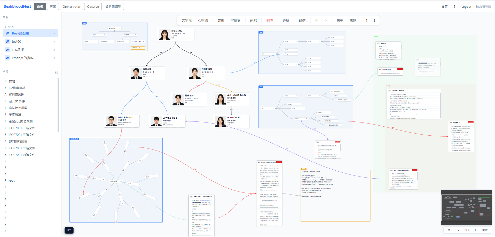
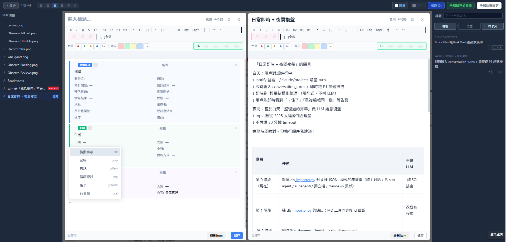
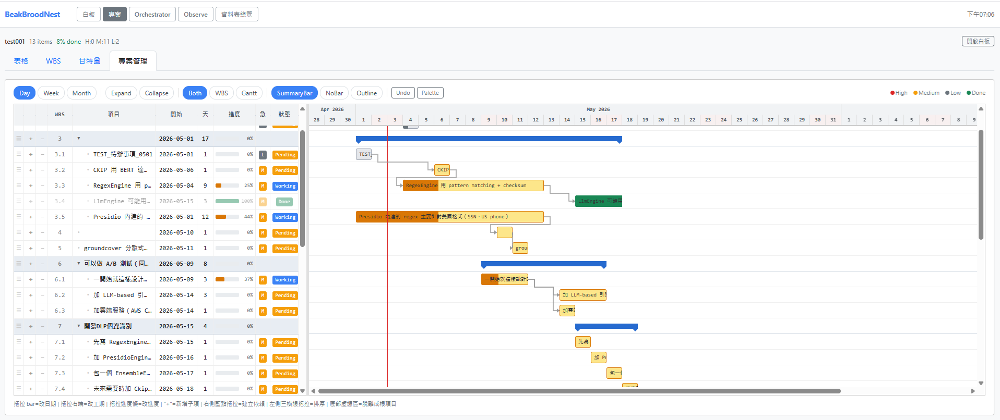
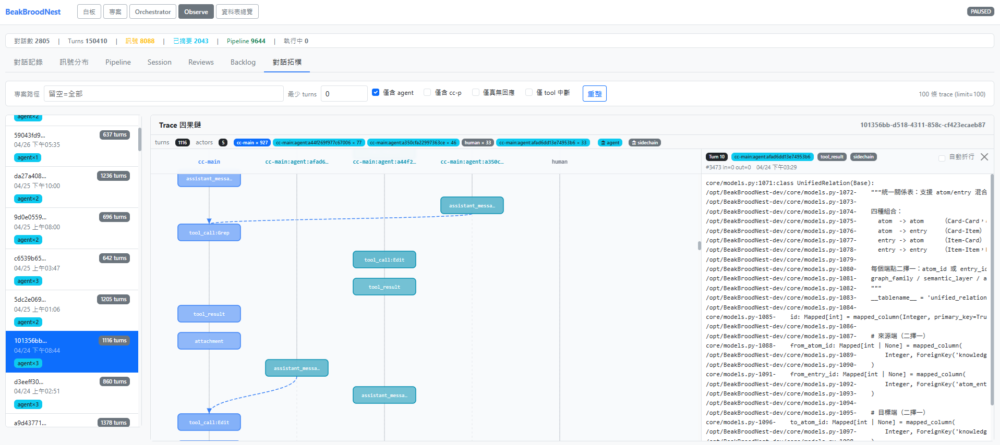
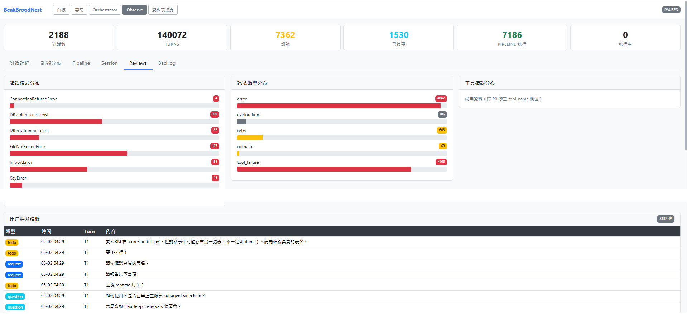
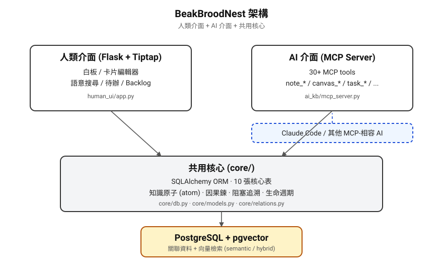
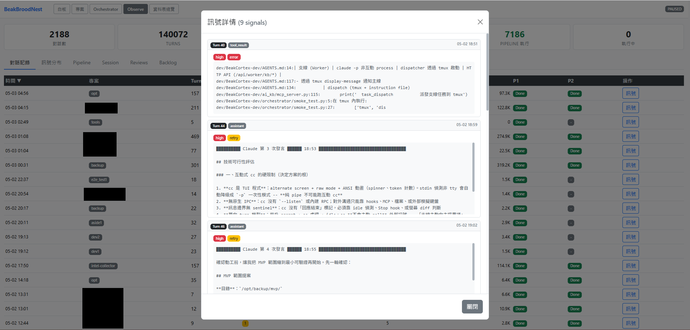
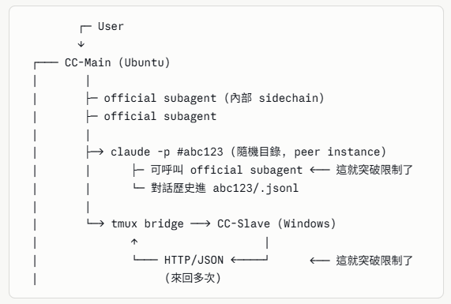

# BeakBroodNest

> Claude Code 的地端長期記憶 + 自我覆盤白板

## 簡介

- BroodNest 是 BeakMask 產品家族中，負責「腦」的協助工具，主要的用戶是 Claude Code 做地端的長期記憶，順便做了人類的筆記介面。
- 以多層分析擷取對話精華，讓 Claude 在人類用戶休息時進行「覆盤」，檢討當日失敗的原因並建立 / 修正自己的知識卡片與提示詞來使 Claude 自己更進步。
- 雖然 BroodNest 的 UI 貌似筆記工具（當然也可以當筆記來用），但你可以將自己的計劃以白板元素描繪讓 Claude Code 解讀，避免表達方式的錯誤而浪費 Token。
- 白板上的線條是以圖論為基礎建立運作，您可理解為流程表達；為考慮想輕鬆當筆記來用的用戶，預設有實線、虛線兩種無屬性線條可任意拉線。
- 即使是當筆記來用，可在卡片中用 `;;` 開頭叫出 Tiptap 物件，只要填寫任務名稱與時間與先後，就能自動產生 WBS，再去 Gantt 拉時間，即可完成即時與卡片雙向同步的甘特圖。

## 快速預覽畫面

### 白板+心智圖



### 思考筆記



### 資料庫式專案規劃工具



### 人類與 AI 的對話分析（除錯）工具



## 重要提醒

- 對話分析若開啟「即時審查」則能對當前進行中的 Claude 是否 AI 幻覺而出手警告，此功能因權重判斷還未盡完善，本版未公開，但框架與資料都已成熟，有興趣的朋友可先研究，畢竟每個人對幻覺的認定未必相同。
- BroodNest 具有讓 Claude Code 自己喚醒自己進行作業的功能，預設是關閉的。因為初期練成知識是非常非常的燒 Token！建議在重置之前才啟動，或直接放棄過去的對話從當天開始只做「複盤」。以 Claude Max 100 訂閱為例，平日工作量遠用不滿配額，但開啟複盤功能對過去半個月對話做分析時，曾連續四次達到該訂閱的限額（折合約 NT$2000 等值用量）。請謹慎啟用。
- （當然也可以不回顧過去對話，只從每天的新對話做分析就能減少分析用的 Token）
- 如果您是對 Claude Code 結構熟悉或 vibe coding 用戶，建議從「主要功能」了解。
- 如果您並非程式開發而是策略規劃或學術文書類的用途，建議從白板卡片直接使用。

## 主要功能

提供給 Claude Code 當 Local 記憶輔助：過於繁冗的 `CLAUDE.md`、`MEMORY.md` 等文件是導致幻覺的主因，讓 BroodNest 記錄精華，Claude 無須每次都讀取整個 MD 檔，只要讓 Claude 學會 BroodNest，只在需要時由 agent 找到知識來用。這意味著過去大到足以一啟動即幻覺的 MD 檔可輕量化到需要時才從 DB 讀，而且儲存更多又更不易幻覺。

對話整理：「複盤」排程能比人類使用更精準的陳述來建立提示。而且多個介面讓人類用戶理解常見的錯誤，只要將障礙處理掉，則 Claude 與 agent 下次直接採用正確的方式完成，避開不斷試誤的過程；燒 token 事小，採用了你意料外的方式解決才是隱性問題。



## 架構

雙介面、單核心：

- **人類介面**（Flask + Tiptap）：白板、卡片、語意搜尋、待辦清單
- **AI 介面**（MCP Server）：近 30 個 MCP tools，Claude 等 AI 直接讀寫
- **共用核心**（SQLAlchemy + PostgreSQL + pgvector）：10 張核心表、因果鍊、向量檢索



## 快速開始

### 前置條件

- Ubuntu 22.04 / 24.04 LTS（其他 Debian 系也可，但腳本針對 Ubuntu 設計）
- Python 3.10+
- PostgreSQL 12+ 並啟用 `pgvector` 與 `pg_trgm` extension
- nginx（正式環境，由 install.sh 自動安裝；手動安裝為可選）

### 一鍵安裝（推薦）

`scripts/install.sh` 會自動處理 apt 套件、PostgreSQL 設定（含 pgvector）、venv、systemd service、nginx site config。

```bash
# 直接從 GitHub 拉腳本執行
curl -fsSL https://raw.githubusercontent.com/ethan-beakmask/BeakBroodNest/master/scripts/install.sh -o install.sh
sudo bash install.sh
```

預設值可用環境變數覆蓋：

```bash
sudo INSTALL_DIR=/opt/BeakBroodNest \
     DB_PASS='<your_strong_password>' \
     BEAKBROODNEST_PORT=5170 \
     bash install.sh
```

| 環境變數 | 預設值 | 說明 |
| --- | --- | --- |
| `INSTALL_DIR` | `/opt/BeakBroodNest` | 安裝目錄 |
| `DB_NAME` | `beak_broodnest` | 資料庫名稱 |
| `DB_USER` | `beak_broodnest` | 資料庫使用者 |
| `DB_PASS` | （無預設） | 全新安裝時若未設定，會互動式要求輸入（至少 8 字元、兩次確認）；非互動環境必須提供此環境變數 |
| `BEAKBROODNEST_PORT` | `5170` | 對外 nginx port |
| `SERVICE_NAME` | `beakbroodnest` | systemd / nginx site / log 檔前綴；同機跑多份必須改 |
| `INSTALL_CRON` | （互動詢問） | 設 `yes`/`no` 跳過互動；非互動環境預設啟用 |
| `GITHUB_REPO` | `https://github.com/ethan-beakmask/BeakBroodNest.git` | clone 來源 |

> 安裝後會建立的 systemd service、Nginx site、log 路徑、以及需要手動加入 `/etc/crontab` 的 5 條排程，集中列於 [`docs/SERVICES_AND_SCHEDULES.md`](docs/SERVICES_AND_SCHEDULES.md)。

**安裝過程會互動詢問 Web UI 登入帳號與密碼**（密碼至少 8 字元，沒有出廠預設值）。安裝完成後若需重設：

```bash
cd /opt/BeakBroodNest && venv/bin/python human_ui/app.py --reset-auth
```

腳本子命令：

```bash
sudo bash install.sh --update     # 更新到最新版（保留資料）
sudo bash install.sh --status     # 查看服務狀態
sudo bash install.sh --start      # 啟動
sudo bash install.sh --stop       # 停止
```

### 手動安裝

如想完全自己掌控流程，可走以下步驟：

```bash
# 1. 系統套件（PG 主版本以你環境為準，這裡示範 16）
sudo apt-get install -y python3 python3-venv python3-pip \
    postgresql postgresql-contrib postgresql-16-pgvector \
    nginx git curl

# 2. clone
git clone https://github.com/ethan-beakmask/BeakBroodNest.git /opt/BeakBroodNest
cd /opt/BeakBroodNest

# 3. Python 環境
python3 -m venv venv
source venv/bin/activate
pip install -r requirements.txt

# 4. 資料庫
sudo -u postgres psql <<EOF
CREATE USER beak_broodnest WITH PASSWORD '<your_password>';
CREATE DATABASE beak_broodnest OWNER beak_broodnest;
\c beak_broodnest
CREATE EXTENSION vector;
CREATE EXTENSION pg_trgm;
EOF

# 5. 設定檔
cp config.ini.example config.ini
# 編輯 config.ini 填入 DB 帳密

# 6. 初始化 schema 與種子資料
python human_ui/app.py --init-db --seed
```

### 啟動

```bash
# 開發模式（hot reload）
python human_ui/app.py --serve --port 5170 --host 127.0.0.1

# 正式模式（gunicorn）
gunicorn --bind 127.0.0.1:5171 --workers 2 human_ui.app:app
```

啟動後瀏覽：

- 開發模式：http://127.0.0.1:5170/
- 正式模式：http://127.0.0.1:5171/（建議前置 nginx 反向代理對外）

## MCP 工具

讓 Claude 等 AI 透過 MCP 協議直接讀寫 BeakBroodNest。在 MCP 設定檔（如 `.mcp.json`）加入：

```json
{
  "mcpServers": {
    "beak_broodnest": {
      "command": "/path/to/BeakBroodNest/venv/bin/python",
      "args": ["/path/to/BeakBroodNest/ai_kb/mcp_server.py"]
    }
  }
}
```

| 類別 | 工具 | 用途 |
| --- | --- | --- |
| 知識讀寫 | `note_store` / `note_get` / `note_update` / `note_search` / `note_forget` / `note_overview` | atom CRUD 與檢索 |
| 因果鍊 | `note_relate` / `note_relate_batch` / `note_suggest_relations` / `note_blocked` / `note_trace` | 建立 / 追溯 atom 間關係 |
| 跨專案訊息 | `note_send` / `note_inbox` / `note_inbox_read` | 不同專案 Claude session 互通 |
| 白板操作 | `canvas_create` / `canvas_get` / `canvas_list` / `canvas_place_atom` / `canvas_remove_atom` | AI 主動建白板、放卡片 |
| 任務派發 | `task_dispatch` / `task_list` / `task_status` / `task_collect` | 主 AI 派子 AI 執行任務 |
| Schema | `schema_create` / `schema_list` | 結構化（E 類型）原子 schema |
| 敏感詞 / 淨化 | `sensitive_term_*` / `note_sanitize` / `sanitize_session_*` | 對外匯出前去識別化 |

語意搜尋支援三種模式：`keyword`（ILIKE + pg_trgm）、`semantic`（pgvector）、`hybrid`（兩者混合，召回率最高）。



## 整合到你的專案 CLAUDE.md

安裝 BeakBroodNest 並在 `.mcp.json` 註冊 `beak_broodnest` 之後，建議在你
**自己專案**的 `CLAUDE.md`（或 `~/.claude/CLAUDE.md` 全域檔）加入以下段落，
讓 Claude Code 知道優先使用知識庫而不是內建的 `MEMORY.md`。

---

### BeakBroodNest 知識庫整合

本專案使用 BeakBroodNest MCP server (`beak_broodnest`) 作為長期記憶，
取代 Claude Code 內建的 `MEMORY.md` 機制。

**每次對話開始時必做：**
1. 呼叫 `note_inbox` 檢查跨專案未讀訊息，有未讀則摘要告知用戶
2. 呼叫 `note_overview` 取得知識庫概覽（原子數、標籤、阻塞項目）
3. 視任務性質呼叫 `note_search` 取得相關上下文
   （例如查待辦：`tag=「待辦」+ tag=「<本專案名>」`）

**記憶讀寫規則：**
- 需要記憶 → `note_store`（不要寫入 MEMORY.md 或 memory/ 目錄）
- 需要回憶 → `note_search` / `note_get`
- 需要更新 → `note_update`
- 需要淘汰 → `note_forget`（mode=archive 保留歷史，mode=purge 永久刪除）
- 建立因果關係 → `note_relate`（blocks / follows / supports 等）

**跨專案訊息：**
- 身份由啟動 cwd 自動推斷（如 `/opt/MyProject` → `project:myproject`）
- 發送通知用 `note_send`，**不要**用 tag 廣播
- 不主動處理非當前專案的原子，避免上下文污染

**降級策略：**
- 若 `beak_broodnest` MCP 不可用（server 未啟動 / 連線失敗），
  暫時回退到 MEMORY.md，並於 MCP 恢復後手動同步回知識庫

---

## 開發

### 目錄結構

```
core/               共用資料層（SQLAlchemy）
  db.py             engine + session
  models.py         10 張核心表 ORM
  relations.py      因果鍊 + 阻塞追溯
human_ui/           Flask 應用
  app.py            主 entry + Blueprint
ai_kb/              MCP Server
  mcp_server.py     entry point
orchestrator/       多 Agent 協作框架
  dispatcher.py     一次性派遣 / 多輪會話
  cli/              cc-spawn / cc-talk / cc-pending 等
docs/               規劃文件（VISION.md / KEYBOARD_SPEC.md ...）
scripts/            維運腳本
```

### 設定檔

`config.ini` 不入版控，從 `config.ini.example` 複製後填入本機 DB 設定。

### 鍵盤規格

文件編輯器（Tiptap）的鍵盤行為集中於 [`docs/KEYBOARD_SPEC.md`](docs/KEYBOARD_SPEC.md)。設計原則：白板 = 滑鼠主場，文件 = 鍵盤主場。動鍵盤行為前必讀規格。

### 多 Agent 協作

`orchestrator/` 提供兩條獨立路徑：

- **一次性派遣**（claude -p 當一次性 agent）：`dispatcher.dispatch_task()`
- **多輪互動會話**：`dispatcher.spawn_session()` / `talk_session()` 或 CLI

詳見 [`docs/orchestrator/CC_TO_CC_HANDOVER.md`](docs/orchestrator/CC_TO_CC_HANDOVER.md)。

peer-level Claude 實例構成的 actor system：



## 授權

本專案以 Apache License 2.0 釋出。

- 完整授權條款見專案根目錄 [LICENSE](./LICENSE)
- Copyright 2026 Ethan Yu / 余瑞慶
- 你可以自由使用、修改、散佈，但須保留版權聲明、變更通知，並遵守 Apache 2.0 規範
- Apache 2.0 內含專利授權與訴訟保護條款，可降低未來專利糾紛風險

## 商標

「BeakMask」、「BeakBroodNest」為 Ethan Yu / 余瑞慶 之商標，不在 Apache License 2.0 授權範圍內。
fork 或衍生作品請使用其他名稱以避免混淆。
